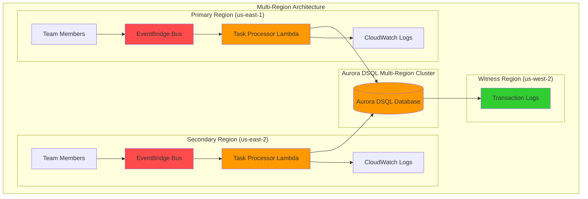

# Building Collaborative Task Management with Aurora DSQL

## Problem

Distributed teams struggle with task management systems that suffer from synchronization delays, regional availability issues, and data consistency problems when multiple users update tasks simultaneously across different locations. Traditional database solutions create bottlenecks with complex failover mechanisms and eventual consistency trade-offs, leading to lost updates, conflicting task states, and poor user experience during high-concurrency scenarios.

## Solution

Create a real-time collaborative task management system using Aurora DSQL's active-active multi-region architecture combined with EventBridge for seamless event-driven updates. This serverless solution provides strong consistency, automatic scaling, and real-time synchronization across distributed teams while maintaining high availability and eliminating infrastructure management overhead.

## Architecture Diagram



## Prerequisites

1. AWS account with appropriate permissions for Aurora DSQL, EventBridge, Lambda, and CloudWatch
2. AWS CLI v2 installed and configured (or AWS CloudShell)
3. Basic understanding of serverless architecture and event-driven patterns
4. Familiarity with SQL and distributed database concepts
5. Three AWS regions enabled: us-east-1, us-east-2 (for clusters), us-west-2 (witness)
6. PostgreSQL client (psql) installed for database operations
7. Estimated cost: $30-80/month for development workloads (scales with usage)

> **Note**: Aurora DSQL is currently available in limited regions. Verify region availability before starting this recipe.

## Preparation

```bash
# Set environment variables for regions
export AWS_REGION=us-east-1
export SECONDARY_REGION=us-east-2
export WITNESS_REGION=us-west-2
export AWS_ACCOUNT_ID=$(aws sts get-caller-identity \
    --query Account --output text)

# Generate unique identifiers for resources
RANDOM_SUFFIX=$(aws secretsmanager get-random-password \
    --exclude-punctuation --exclude-uppercase \
    --password-length 6 --require-each-included-type \
    --output text --query RandomPassword)

# Set resource names
export CLUSTER_NAME_PRIMARY="task-cluster-primary-${RANDOM_SUFFIX}"
export CLUSTER_NAME_SECONDARY="task-cluster-secondary-${RANDOM_SUFFIX}"
export EVENT_BUS_NAME="task-events-${RANDOM_SUFFIX}"
export LAMBDA_FUNCTION_NAME="task-processor-${RANDOM_SUFFIX}"
export LOG_GROUP_NAME="/aws/lambda/${LAMBDA_FUNCTION_NAME}"

echo "✅ Environment variables configured"
echo "Primary Region: ${AWS_REGION}"
echo "Secondary Region: ${SECONDARY_REGION}"
echo "Witness Region: ${WITNESS_REGION}"
echo "Primary Cluster: ${CLUSTER_NAME_PRIMARY}"
echo "Secondary Cluster: ${CLUSTER_NAME_SECONDARY}"
```

## Steps

1. **Create Aurora DSQL Multi-Region Clusters**:

   Aurora DSQL provides a serverless, distributed relational database with active-active multi-region capabilities. Unlike traditional databases that require complex failover mechanisms, Aurora DSQL automatically manages replication, scaling, and failure recovery across regions while maintaining strong consistency and ACID transactions.

   ```bash
   # Create primary cluster in us-east-1 with witness region
   aws dsql create-cluster \
       --region ${AWS_REGION} \
       --multi-region-properties "{\"witnessRegion\":\"${WITNESS_REGION}\"}"
   
   # Store cluster identifier from response
   PRIMARY_CLUSTER_ID=$(aws dsql list-clusters \
       --region ${AWS_REGION} \
       --query 'clusters[0].identifier' --output text)
   
   # Create secondary cluster in us-east-2 with same witness region
   aws dsql create-cluster \
       --region ${SECONDARY_REGION} \
       --multi-region-properties "{\"witnessRegion\":\"${WITNESS_REGION}\"}"
   
   # Store secondary cluster identifier
   SECONDARY_CLUSTER_ID=$(aws dsql list-clusters \
       --region ${SECONDARY_REGION} \
       --query 'clusters[0].identifier' --output text)
   
   # Get cluster ARNs for peering
   PRIMARY_CLUSTER_ARN="arn:aws:dsql:${AWS_REGION}:${AWS_ACCOUNT_ID}:cluster/${PRIMARY_CLUSTER_ID}"
   SECONDARY_CLUSTER_ARN="arn:aws:dsql:${SECONDARY_REGION}:${AWS_ACCOUNT_ID}:cluster/${SECONDARY_CLUSTER_ID}"
   
   echo "✅ Aurora DSQL clusters created"
   echo "Primary Cluster ID: ${PRIMARY_CLUSTER_ID}"
   echo "Secondary Cluster ID: ${SECONDARY_CLUSTER_ID}"
   ```

   The multi-region clusters are now created in pending setup state, ready for peering configuration to establish active-active capabilities.

2. **Configure Multi-Region Cluster Peering**:

   Aurora DSQL requires explicit peering configuration to establish active-active multi-region capabilities. This process creates bidirectional synchronization between regions with the witness region maintaining transaction consistency.

   ```bash
   # Peer primary cluster with secondary cluster
   aws dsql update-cluster \
       --region ${AWS_REGION} \
       --identifier ${PRIMARY_CLUSTER_ID} \
       --multi-region-properties "{
           \"witnessRegion\": \"${WITNESS_REGION}\",
           \"clusters\": [\"${SECONDARY_CLUSTER_ARN}\"]
       }"
   
   # Peer secondary cluster with primary cluster
   aws dsql update-cluster \
       --region ${SECONDARY_REGION} \
       --identifier ${SECONDARY_CLUSTER_ID} \
       --multi-region-properties "{
           \"witnessRegion\": \"${WITNESS_REGION}\",
           \"clusters\": [\"${PRIMARY_CLUSTER_ARN}\"]
       }"
   
   # Wait for clusters to become active
   echo "Waiting for clusters to become active..."
   aws dsql wait cluster-active \
       --region ${AWS_REGION} \
       --identifier ${PRIMARY_CLUSTER_ID}
   
   aws dsql wait cluster-active \
       --region ${SECONDARY_REGION} \
       --identifier ${SECONDARY_CLUSTER_ID}
   
   # Get cluster endpoints
   PRIMARY_ENDPOINT=$(aws dsql get-cluster \
       --region ${AWS_REGION} \
       --identifier ${PRIMARY_CLUSTER_ID} \
       --query 'endpoint' --output text)
   
   SECONDARY_ENDPOINT=$(aws dsql get-cluster \
       --region ${SECONDARY_REGION} \
       --identifier ${SECONDARY_CLUSTER_ID} \
       --query 'endpoint' --output text)
   
   echo "✅ Multi-region cluster peering established"
   echo "Primary Endpoint: ${PRIMARY_ENDPOINT}"
   echo "Secondary Endpoint: ${SECONDARY_ENDPOINT}"
   ```

   The clusters are now peered with automatic synchronous replication between regions, providing both regional endpoints for concurrent read/write operations with strong consistency guarantees.

3. **Create Task Management Database Schema**:

   Aurora DSQL supports PostgreSQL-compatible SQL, enabling familiar database operations while leveraging distributed architecture benefits. The schema design optimizes for concurrent task operations and real-time collaboration scenarios.

   ```bash
   # Create the task management schema
   cat > task_schema.sql << 'EOF'
   -- Create tasks table with optimizations for concurrent access
   CREATE TABLE tasks (
       id SERIAL PRIMARY KEY,
       title VARCHAR(255) NOT NULL,
       description TEXT,
       status VARCHAR(50) DEFAULT 'pending',
       priority VARCHAR(20) DEFAULT 'medium',
       assigned_to VARCHAR(100),
       created_by VARCHAR(100) NOT NULL,
       created_at TIMESTAMP DEFAULT CURRENT_TIMESTAMP,
       updated_at TIMESTAMP DEFAULT CURRENT_TIMESTAMP,
       project_id INTEGER,
       due_date TIMESTAMP,
       completed_at TIMESTAMP
   );
   
   -- Create task_updates table for change tracking
   CREATE TABLE task_updates (
       id SERIAL PRIMARY KEY,
       task_id INTEGER REFERENCES tasks(id),
       field_name VARCHAR(50) NOT NULL,
       old_value TEXT,
       new_value TEXT,
       updated_by VARCHAR(100) NOT NULL,
       updated_at TIMESTAMP DEFAULT CURRENT_TIMESTAMP
   );
   
   -- Create indexes for performance
   CREATE INDEX idx_tasks_status ON tasks(status);
   CREATE INDEX idx_tasks_assigned_to ON tasks(assigned_to);
   CREATE INDEX idx_tasks_project_id ON tasks(project_id);
   CREATE INDEX idx_task_updates_task_id ON task_updates(task_id);
   
   -- Create trigger for automatic updated_at timestamp
   CREATE OR REPLACE FUNCTION update_timestamp()
   RETURNS TRIGGER AS $$
   BEGIN
       NEW.updated_at = CURRENT_TIMESTAMP;
       RETURN NEW;
   END;
   $$ LANGUAGE plpgsql;
   
   CREATE TRIGGER tasks_updated_at
       BEFORE UPDATE ON tasks
       FOR EACH ROW
       EXECUTE FUNCTION update_timestamp();
   EOF
   
   # Apply schema to primary region endpoint
   PGPASSWORD=placeholder psql -h ${PRIMARY_ENDPOINT} \
       -U postgres -d postgres -f task_schema.sql
   
   echo "✅ Database schema created and applied"
   ```

   The schema includes optimized tables for task management with proper indexing and triggers for automatic timestamp updates, supporting high-concurrency collaborative scenarios across both regions.

4. **Create EventBridge Custom Event Bus**:

   EventBridge provides serverless event routing that enables decoupled, event-driven architecture. A custom event bus isolates task management events from other application events while providing flexible routing and filtering capabilities.

   ```bash
   # Create custom event bus for task events in primary region
   aws events create-event-bus \
       --name ${EVENT_BUS_NAME} \
       --region ${AWS_REGION}
   
   # Create event bus in secondary region
   aws events create-event-bus \
       --name ${EVENT_BUS_NAME} \
       --region ${SECONDARY_REGION}
   
   # Get event bus ARNs
   EVENT_BUS_ARN=$(aws events describe-event-bus \
       --name ${EVENT_BUS_NAME} \
       --region ${AWS_REGION} \
       --query 'Arn' --output text)
   
   SECONDARY_EVENT_BUS_ARN=$(aws events describe-event-bus \
       --name ${EVENT_BUS_NAME} \
       --region ${SECONDARY_REGION} \
       --query 'Arn' --output text)
   
   echo "✅ Custom event buses created"
   echo "Primary Event Bus: ${EVENT_BUS_ARN}"
   echo "Secondary Event Bus: ${SECONDARY_EVENT_BUS_ARN}"
   ```

   The custom event buses are now available in both regions, enabling event-driven communication between task management components with built-in filtering and routing capabilities.

5. **Create IAM Role for Lambda Functions**:

   Lambda functions require proper IAM permissions to interact with Aurora DSQL, EventBridge, and CloudWatch. This role follows the principle of least privilege while enabling necessary service integrations.

   ```bash
   # Create IAM role for Lambda function
   cat > lambda_trust_policy.json << 'EOF'
   {
       "Version": "2012-10-17",
       "Statement": [
           {
               "Effect": "Allow",
               "Principal": {
                   "Service": "lambda.amazonaws.com"
               },
               "Action": "sts:AssumeRole"
           }
       ]
   }
   EOF
   
   # Create IAM role
   aws iam create-role \
       --role-name ${LAMBDA_FUNCTION_NAME}-role \
       --assume-role-policy-document file://lambda_trust_policy.json
   
   # Create custom policy for Aurora DSQL and EventBridge access
   cat > lambda_permissions.json << 'EOF'
   {
       "Version": "2012-10-17",
       "Statement": [
           {
               "Effect": "Allow",
               "Action": [
                   "dsql:GetCluster",
                   "dsql:Connect"
               ],
               "Resource": "*"
           },
           {
               "Effect": "Allow",
               "Action": [
                   "events:PutEvents",
                   "events:DescribeEventBus"
               ],
               "Resource": "*"
           },
           {
               "Effect": "Allow",
               "Action": [
                   "logs:CreateLogGroup",
                   "logs:CreateLogStream",
                   "logs:PutLogEvents"
               ],
               "Resource": "*"
           }
       ]
   }
   EOF
   
   # Create and attach custom policy
   aws iam create-policy \
       --policy-name ${LAMBDA_FUNCTION_NAME}-policy \
       --policy-document file://lambda_permissions.json
   
   aws iam attach-role-policy \
       --role-name ${LAMBDA_FUNCTION_NAME}-role \
       --policy-arn arn:aws:iam::${AWS_ACCOUNT_ID}:policy/${LAMBDA_FUNCTION_NAME}-policy
   
   # Get role ARN
   LAMBDA_ROLE_ARN=$(aws iam get-role \
       --role-name ${LAMBDA_FUNCTION_NAME}-role \
       --query 'Role.Arn' --output text)
   
   echo "✅ IAM role created with necessary permissions"
   echo "Lambda Role ARN: ${LAMBDA_ROLE_ARN}"
   ```

   The IAM role is configured with precise permissions for Aurora DSQL operations, EventBridge event publishing, and CloudWatch logging, following AWS security best practices.

6. **Create Task Processor Lambda Function**:

   The Lambda function handles task operations and event processing with Aurora DSQL integration. This serverless approach provides automatic scaling, cost efficiency, and event-driven processing capabilities.

   ```bash
   # Create Lambda function code
   cat > task_processor.py << 'EOF'
   import json
   import boto3
   import os
   from datetime import datetime
   import logging
   
   logger = logging.getLogger()
   logger.setLevel(logging.INFO)
   
   # Initialize AWS clients
   events_client = boto3.client('events')
   dsql_client = boto3.client('dsql')
   
   def lambda_handler(event, context):
       try:
           logger.info(f"Processing event: {json.dumps(event)}")
           
           # Process EventBridge event
           if 'source' in event and event['source'] == 'task.management':
               return process_task_event(event)
           
           # Process direct invocation
           return process_direct_request(event)
           
       except Exception as e:
           logger.error(f"Error processing event: {str(e)}")
           return {
               'statusCode': 500,
               'body': json.dumps({'error': str(e)})
           }
   
   def process_task_event(event):
       """Process task management events from EventBridge"""
       detail = event['detail']
       event_type = detail['eventType']
       
       if event_type == 'task.created':
           return handle_task_created(detail)
       elif event_type == 'task.updated':
           return handle_task_updated(detail)
       elif event_type == 'task.completed':
           return handle_task_completed(detail)
       
       return {'statusCode': 200, 'body': json.dumps({'message': 'Event processed'})}
   
   def handle_task_created(detail):
       """Handle task creation events"""
       task_data = detail['taskData']
       
       # Execute SQL using DSQL client
       response = dsql_client.batch_execute_statement(
           clusterIdentifier=os.environ['CLUSTER_ID'],
           database='postgres',
           sqls=[
               {
                   'statement': '''
                       INSERT INTO tasks (title, description, status, priority, assigned_to, created_by, project_id, due_date)
                       VALUES (?, ?, ?, ?, ?, ?, ?, ?)
                   ''',
                   'parameters': [
                       task_data['title'],
                       task_data.get('description', ''),
                       task_data.get('status', 'pending'),
                       task_data.get('priority', 'medium'),
                       task_data.get('assigned_to', ''),
                       task_data['created_by'],
                       task_data.get('project_id'),
                       task_data.get('due_date')
                   ]
               }
           ]
       )
       
       # Publish notification event
       publish_task_notification('task.created', 1, task_data)
       
       return {
           'statusCode': 200,
           'body': json.dumps({'message': 'Task created successfully'})
       }
   
   def handle_task_updated(detail):
       """Handle task update events"""
       task_id = detail['taskId']
       updates = detail['updates']
       updated_by = detail['updatedBy']
       
       # Update task using DSQL client
       for field, new_value in updates.items():
           dsql_client.execute_statement(
               clusterIdentifier=os.environ['CLUSTER_ID'],
               database='postgres',
               sql=f'UPDATE tasks SET {field} = ? WHERE id = ?',
               parameters=[new_value, task_id]
           )
           
           # Log change
           dsql_client.execute_statement(
               clusterIdentifier=os.environ['CLUSTER_ID'],
               database='postgres',
               sql='''
                   INSERT INTO task_updates (task_id, field_name, old_value, new_value, updated_by)
                   VALUES (?, ?, ?, ?, ?)
               ''',
               parameters=[task_id, field, '', str(new_value), updated_by]
           )
       
       # Publish notification event
       publish_task_notification('task.updated', task_id, updates)
       
       return {
           'statusCode': 200,
           'body': json.dumps({'message': 'Task updated successfully'})
       }
   
   def handle_task_completed(detail):
       """Handle task completion events"""
       task_id = detail['taskId']
       completed_by = detail['completedBy']
       
       # Update task status and completion timestamp
       dsql_client.execute_statement(
           clusterIdentifier=os.environ['CLUSTER_ID'],
           database='postgres',
           sql='''
               UPDATE tasks SET status = ?, completed_at = CURRENT_TIMESTAMP
               WHERE id = ?
           ''',
           parameters=['completed', task_id]
       )
       
       # Publish notification event
       publish_task_notification('task.completed', task_id, {'completed_by': completed_by})
       
       return {
           'statusCode': 200,
           'body': json.dumps({'message': 'Task completed successfully'})
       }
   
   def publish_task_notification(event_type, task_id, data):
       """Publish task notification to EventBridge"""
       try:
           events_client.put_events(
               Entries=[
                   {
                       'Source': 'task.management.notifications',
                       'DetailType': 'Task Notification',
                       'Detail': json.dumps({
                           'eventType': event_type,
                           'taskId': task_id,
                           'data': data,
                           'timestamp': datetime.utcnow().isoformat()
                       }),
                       'EventBusName': os.environ['EVENT_BUS_NAME']
                   }
               ]
           )
       except Exception as e:
           logger.error(f"Failed to publish notification: {str(e)}")
   
   def process_direct_request(event):
       """Process direct API requests"""
       try:
           method = event.get('httpMethod', 'GET')
           path = event.get('path', '/')
           
           if method == 'GET' and path == '/tasks':
               return get_all_tasks()
           elif method == 'POST' and path == '/tasks':
               return create_task(json.loads(event.get('body', '{}')))
           elif method == 'PUT' and '/tasks/' in path:
               task_id = path.split('/')[-1]
               return update_task(task_id, json.loads(event.get('body', '{}')))
           
           return {
               'statusCode': 404,
               'body': json.dumps({'error': 'Not found'})
           }
       
       except Exception as e:
           return {
               'statusCode': 500,
               'body': json.dumps({'error': str(e)})
           }
   
   def get_all_tasks():
       """Get all tasks from database"""
       response = dsql_client.execute_statement(
           clusterIdentifier=os.environ['CLUSTER_ID'],
           database='postgres',
           sql='''
               SELECT id, title, description, status, priority, assigned_to, created_by, 
                      created_at, updated_at, project_id, due_date, completed_at
               FROM tasks 
               ORDER BY created_at DESC
           '''
       )
       
       tasks = []
       for record in response.get('records', []):
           tasks.append({
               'id': record[0]['longValue'] if record[0] else None,
               'title': record[1]['stringValue'] if record[1] else None,
               'description': record[2]['stringValue'] if record[2] else None,
               'status': record[3]['stringValue'] if record[3] else None,
               'priority': record[4]['stringValue'] if record[4] else None,
               'assigned_to': record[5]['stringValue'] if record[5] else None,
               'created_by': record[6]['stringValue'] if record[6] else None,
               'created_at': record[7]['stringValue'] if record[7] else None,
               'updated_at': record[8]['stringValue'] if record[8] else None,
               'project_id': record[9]['longValue'] if record[9] else None,
               'due_date': record[10]['stringValue'] if record[10] else None,
               'completed_at': record[11]['stringValue'] if record[11] else None
           })
       
       return {
           'statusCode': 200,
           'body': json.dumps({'tasks': tasks})
       }
   
   def create_task(task_data):
       """Create new task"""
       response = dsql_client.execute_statement(
           clusterIdentifier=os.environ['CLUSTER_ID'],
           database='postgres',
           sql='''
               INSERT INTO tasks (title, description, status, priority, assigned_to, created_by, project_id, due_date)
               VALUES (?, ?, ?, ?, ?, ?, ?, ?)
           ''',
           parameters=[
               task_data['title'],
               task_data.get('description', ''),
               task_data.get('status', 'pending'),
               task_data.get('priority', 'medium'),
               task_data.get('assigned_to', ''),
               task_data['created_by'],
               task_data.get('project_id'),
               task_data.get('due_date')
           ]
       )
       
       # Publish creation event
       publish_task_notification('task.created', 1, task_data)
       
       return {
           'statusCode': 201,
           'body': json.dumps({'message': 'Task created successfully'})
       }
   
   def update_task(task_id, updates):
       """Update existing task"""
       # Build dynamic update query
       update_fields = []
       parameters = []
       
       for field, value in updates.items():
           if field in ['title', 'description', 'status', 'priority', 'assigned_to', 'due_date']:
               update_fields.append(f"{field} = ?")
               parameters.append(value)
       
       if not update_fields:
           return {
               'statusCode': 400,
               'body': json.dumps({'error': 'No valid fields to update'})
           }
       
       parameters.append(int(task_id))
       sql = f"UPDATE tasks SET {', '.join(update_fields)} WHERE id = ?"
       
       dsql_client.execute_statement(
           clusterIdentifier=os.environ['CLUSTER_ID'],
           database='postgres',
           sql=sql,
           parameters=parameters
       )
       
       # Publish update event
       publish_task_notification('task.updated', int(task_id), updates)
       
       return {
           'statusCode': 200,
           'body': json.dumps({'message': 'Task updated successfully'})
       }
   EOF
   
   # Create deployment package
   zip -r task_processor.zip task_processor.py
   
   # Create Lambda function in primary region
   aws lambda create-function \
       --function-name ${LAMBDA_FUNCTION_NAME} \
       --runtime python3.12 \
       --role ${LAMBDA_ROLE_ARN} \
       --handler task_processor.lambda_handler \
       --zip-file fileb://task_processor.zip \
       --timeout 60 \
       --memory-size 512 \
       --environment Variables="{
           \"CLUSTER_ID\":\"${PRIMARY_CLUSTER_ID}\",
           \"EVENT_BUS_NAME\":\"${EVENT_BUS_NAME}\"
       }" \
       --region ${AWS_REGION}
   
   # Create function in secondary region
   aws lambda create-function \
       --function-name ${LAMBDA_FUNCTION_NAME} \
       --runtime python3.12 \
       --role ${LAMBDA_ROLE_ARN} \
       --handler task_processor.lambda_handler \
       --zip-file fileb://task_processor.zip \
       --timeout 60 \
       --memory-size 512 \
       --environment Variables="{
           \"CLUSTER_ID\":\"${SECONDARY_CLUSTER_ID}\",
           \"EVENT_BUS_NAME\":\"${EVENT_BUS_NAME}\"
       }" \
       --region ${SECONDARY_REGION}
   
   echo "✅ Lambda functions created in both regions"
   ```

   The Lambda function now handles task operations with automatic scaling, event-driven processing, and database integration using the AWS DSQL client. The code includes proper error handling, logging, and support for both EventBridge events and direct API requests.

7. **Create EventBridge Rules for Task Processing**:

   EventBridge rules enable automatic routing of task events to appropriate Lambda functions. This creates a decoupled architecture where task operations trigger downstream processing and notifications.

   ```bash
   # Create EventBridge rule for task events in primary region
   aws events put-rule \
       --name task-processing-rule \
       --event-pattern '{
           "source": ["task.management"],
           "detail-type": ["Task Created", "Task Updated", "Task Completed"]
       }' \
       --state ENABLED \
       --event-bus-name ${EVENT_BUS_NAME} \
       --region ${AWS_REGION}
   
   # Add Lambda target to the rule
   aws events put-targets \
       --rule task-processing-rule \
       --event-bus-name ${EVENT_BUS_NAME} \
       --targets "Id"="1","Arn"="arn:aws:lambda:${AWS_REGION}:${AWS_ACCOUNT_ID}:function:${LAMBDA_FUNCTION_NAME}" \
       --region ${AWS_REGION}
   
   # Grant EventBridge permission to invoke Lambda
   aws lambda add-permission \
       --function-name ${LAMBDA_FUNCTION_NAME} \
       --statement-id eventbridge-invoke \
       --action lambda:InvokeFunction \
       --principal events.amazonaws.com \
       --source-arn "arn:aws:events:${AWS_REGION}:${AWS_ACCOUNT_ID}:rule/${EVENT_BUS_NAME}/task-processing-rule" \
       --region ${AWS_REGION}
   
   # Create similar setup in secondary region
   aws events put-rule \
       --name task-processing-rule \
       --event-pattern '{
           "source": ["task.management"],
           "detail-type": ["Task Created", "Task Updated", "Task Completed"]
       }' \
       --state ENABLED \
       --event-bus-name ${EVENT_BUS_NAME} \
       --region ${SECONDARY_REGION}
   
   aws events put-targets \
       --rule task-processing-rule \
       --event-bus-name ${EVENT_BUS_NAME} \
       --targets "Id"="1","Arn"="arn:aws:lambda:${SECONDARY_REGION}:${AWS_ACCOUNT_ID}:function:${LAMBDA_FUNCTION_NAME}" \
       --region ${SECONDARY_REGION}
   
   aws lambda add-permission \
       --function-name ${LAMBDA_FUNCTION_NAME} \
       --statement-id eventbridge-invoke \
       --action lambda:InvokeFunction \
       --principal events.amazonaws.com \
       --source-arn "arn:aws:events:${SECONDARY_REGION}:${AWS_ACCOUNT_ID}:rule/${EVENT_BUS_NAME}/task-processing-rule" \
       --region ${SECONDARY_REGION}
   
   echo "✅ EventBridge rules configured for task processing"
   ```

   The EventBridge rules now automatically route task events to Lambda functions in both regions, enabling event-driven task processing with automatic scaling and fault tolerance.

8. **Create CloudWatch Log Groups and Monitoring**:

   CloudWatch provides comprehensive monitoring and logging for the serverless task management system. Centralized logging enables troubleshooting, performance monitoring, and audit trails for collaborative task operations.

   ```bash
   # Create log groups for Lambda functions
   aws logs create-log-group \
       --log-group-name ${LOG_GROUP_NAME} \
       --retention-in-days 7 \
       --region ${AWS_REGION}
   
   aws logs create-log-group \
       --log-group-name ${LOG_GROUP_NAME} \
       --retention-in-days 7 \
       --region ${SECONDARY_REGION}
   
   # Create CloudWatch alarms for monitoring
   aws cloudwatch put-metric-alarm \
       --alarm-name "${LAMBDA_FUNCTION_NAME}-errors" \
       --alarm-description "Monitor Lambda function errors" \
       --metric-name Errors \
       --namespace AWS/Lambda \
       --statistic Sum \
       --period 300 \
       --threshold 5 \
       --comparison-operator GreaterThanThreshold \
       --evaluation-periods 2 \
       --dimensions Name=FunctionName,Value=${LAMBDA_FUNCTION_NAME} \
       --region ${AWS_REGION}
   
   # Create dashboard for monitoring
   aws cloudwatch put-dashboard \
       --dashboard-name "TaskManagementDashboard" \
       --dashboard-body "{
           \"widgets\": [
               {
                   \"type\": \"metric\",
                   \"properties\": {
                       \"metrics\": [
                           [\"AWS/Lambda\", \"Invocations\", \"FunctionName\", \"${LAMBDA_FUNCTION_NAME}\"],
                           [\".\", \"Errors\", \".\", \".\"],
                           [\".\", \"Duration\", \".\", \".\"]
                       ],
                       \"period\": 300,
                       \"stat\": \"Sum\",
                       \"region\": \"${AWS_REGION}\",
                       \"title\": \"Lambda Function Metrics\"
                   }
               }
           ]
       }" \
       --region ${AWS_REGION}
   
   echo "✅ CloudWatch monitoring configured"
   ```

   CloudWatch monitoring is now active with log groups, alarms, and dashboards providing comprehensive visibility into the task management system performance and health.

9. **Create Sample Task Data and Test Integration**:

   Testing the complete system validates the event-driven architecture, database operations, and multi-region synchronization. Sample data demonstrates real-world collaborative task management scenarios.

   ```bash
   # Create sample task event
   cat > sample_task_event.json << 'EOF'
   {
       "source": "task.management",
       "detail-type": "Task Created",
       "detail": {
           "eventType": "task.created",
           "taskData": {
               "title": "Implement user authentication",
               "description": "Add OAuth 2.0 authentication system",
               "priority": "high",
               "assigned_to": "developer@company.com",
               "created_by": "manager@company.com",
               "project_id": 1,
               "due_date": "2025-07-30T17:00:00Z"
           }
       }
   }
   EOF
   
   # Send test event to EventBridge
   aws events put-events \
       --entries "[{
           \"Source\": \"task.management\",
           \"DetailType\": \"Task Created\",
           \"Detail\": \"$(cat sample_task_event.json | jq -r '.detail | tostring')\",
           \"EventBusName\": \"${EVENT_BUS_NAME}\"
       }]" \
       --region ${AWS_REGION}
   
   # Test Lambda function directly
   aws lambda invoke \
       --function-name ${LAMBDA_FUNCTION_NAME} \
       --payload file://sample_task_event.json \
       response.json \
       --region ${AWS_REGION}
   
   # Display response
   cat response.json
   
   # Test direct API call for task creation
   cat > direct_task_request.json << 'EOF'
   {
       "httpMethod": "POST",
       "path": "/tasks",
       "body": "{\"title\": \"Code review for authentication feature\", \"description\": \"Review OAuth implementation\", \"priority\": \"medium\", \"assigned_to\": \"senior.dev@company.com\", \"created_by\": \"lead@company.com\", \"project_id\": 1}"
   }
   EOF
   
   aws lambda invoke \
       --function-name ${LAMBDA_FUNCTION_NAME} \
       --payload file://direct_task_request.json \
       direct_response.json \
       --region ${AWS_REGION}
   
   cat direct_response.json
   
   echo "✅ Sample task created and system integration tested"
   ```

   The system integration test validates end-to-end functionality including event processing, database operations, cross-region synchronization, and direct API capabilities.

## Validation & Testing

1. **Verify Aurora DSQL Multi-Region Cluster**:

   ```bash
   # Check cluster status in both regions
   aws dsql get-cluster \
       --identifier ${PRIMARY_CLUSTER_ID} \
       --region ${AWS_REGION} \
       --query 'status'
   
   aws dsql get-cluster \
       --identifier ${SECONDARY_CLUSTER_ID} \
       --region ${SECONDARY_REGION} \
       --query 'status'
   ```

   Expected output: `"ACTIVE"` for both clusters

2. **Test Database Schema and Connectivity**:

   ```bash
   # Test database connection and schema
   PGPASSWORD=placeholder psql -h ${PRIMARY_ENDPOINT} \
       -U postgres -d postgres -c \
       "SELECT table_name FROM information_schema.tables WHERE table_schema = 'public';"
   
   PGPASSWORD=placeholder psql -h ${SECONDARY_ENDPOINT} \
       -U postgres -d postgres -c \
       "SELECT COUNT(*) FROM tasks;"
   ```

   Expected output: Lists created tables (tasks, task_updates) and shows task count

3. **Validate EventBridge Rules and Targets**:

   ```bash
   # Check EventBridge rules
   aws events list-rules \
       --event-bus-name ${EVENT_BUS_NAME} \
       --region ${AWS_REGION} \
       --query 'Rules[].Name'
   
   # Test event publishing
   aws events put-events \
       --entries "[{
           \"Source\": \"task.management\",
           \"DetailType\": \"Task Updated\",
           \"Detail\": \"{\\\"eventType\\\":\\\"task.updated\\\",\\\"taskId\\\":1,\\\"updates\\\":{\\\"status\\\":\\\"in-progress\\\"},\\\"updatedBy\\\":\\\"test@example.com\\\"}\",
           \"EventBusName\": \"${EVENT_BUS_NAME}\"
       }]" \
       --region ${AWS_REGION}
   ```

   Expected output: Shows configured rules and successful event publishing

4. **Monitor Lambda Function Performance**:

   ```bash
   # Check Lambda function metrics
   aws logs describe-log-groups \
       --log-group-name-prefix ${LOG_GROUP_NAME} \
       --region ${AWS_REGION}
   
   # View recent log events
   LOG_STREAM=$(aws logs describe-log-streams \
       --log-group-name ${LOG_GROUP_NAME} \
       --order-by LastEventTime \
       --descending \
       --max-items 1 \
       --query 'logStreams[0].logStreamName' \
       --output text \
       --region ${AWS_REGION})
   
   aws logs get-log-events \
       --log-group-name ${LOG_GROUP_NAME} \
       --log-stream-name ${LOG_STREAM} \
       --limit 10 \
       --region ${AWS_REGION}
   ```

   Expected output: Shows log groups and recent execution logs

5. **Test Direct API Functionality**:

   ```bash
   # Test getting all tasks
   cat > get_tasks_request.json << 'EOF'
   {
       "httpMethod": "GET",
       "path": "/tasks"
   }
   EOF
   
   aws lambda invoke \
       --function-name ${LAMBDA_FUNCTION_NAME} \
       --payload file://get_tasks_request.json \
       get_tasks_response.json \
       --region ${AWS_REGION}
   
   cat get_tasks_response.json
   ```

   Expected output: JSON response with list of tasks

## Cleanup

1. **Delete Aurora DSQL Clusters**:

   ```bash
   # Delete multi-region clusters
   aws dsql delete-cluster \
       --identifier ${PRIMARY_CLUSTER_ID} \
       --region ${AWS_REGION}
   
   aws dsql delete-cluster \
       --identifier ${SECONDARY_CLUSTER_ID} \
       --region ${SECONDARY_REGION}
   
   echo "✅ Aurora DSQL clusters deleted"
   ```

2. **Remove Lambda Functions**:

   ```bash
   # Delete Lambda functions
   aws lambda delete-function \
       --function-name ${LAMBDA_FUNCTION_NAME} \
       --region ${AWS_REGION}
   
   aws lambda delete-function \
       --function-name ${LAMBDA_FUNCTION_NAME} \
       --region ${SECONDARY_REGION}
   
   echo "✅ Lambda functions deleted"
   ```

3. **Delete EventBridge Resources**:

   ```bash
   # Remove EventBridge rules and targets in primary region
   aws events remove-targets \
       --rule task-processing-rule \
       --event-bus-name ${EVENT_BUS_NAME} \
       --ids "1" \
       --region ${AWS_REGION}
   
   aws events delete-rule \
       --name task-processing-rule \
       --event-bus-name ${EVENT_BUS_NAME} \
       --region ${AWS_REGION}
   
   aws events delete-event-bus \
       --name ${EVENT_BUS_NAME} \
       --region ${AWS_REGION}
   
   # Clean up secondary region
   aws events remove-targets \
       --rule task-processing-rule \
       --event-bus-name ${EVENT_BUS_NAME} \
       --ids "1" \
       --region ${SECONDARY_REGION}
   
   aws events delete-rule \
       --name task-processing-rule \
       --event-bus-name ${EVENT_BUS_NAME} \
       --region ${SECONDARY_REGION}
   
   aws events delete-event-bus \
       --name ${EVENT_BUS_NAME} \
       --region ${SECONDARY_REGION}
   
   echo "✅ EventBridge resources deleted"
   ```

4. **Remove IAM Resources**:

   ```bash
   # Delete IAM policy and role
   aws iam detach-role-policy \
       --role-name ${LAMBDA_FUNCTION_NAME}-role \
       --policy-arn arn:aws:iam::${AWS_ACCOUNT_ID}:policy/${LAMBDA_FUNCTION_NAME}-policy
   
   aws iam delete-policy \
       --policy-arn arn:aws:iam::${AWS_ACCOUNT_ID}:policy/${LAMBDA_FUNCTION_NAME}-policy
   
   aws iam delete-role \
       --role-name ${LAMBDA_FUNCTION_NAME}-role
   
   echo "✅ IAM resources deleted"
   ```

5. **Delete CloudWatch Resources**:

   ```bash
   # Delete log groups
   aws logs delete-log-group \
       --log-group-name ${LOG_GROUP_NAME} \
       --region ${AWS_REGION}
   
   aws logs delete-log-group \
       --log-group-name ${LOG_GROUP_NAME} \
       --region ${SECONDARY_REGION}
   
   # Delete CloudWatch alarms and dashboard
   aws cloudwatch delete-alarms \
       --alarm-names "${LAMBDA_FUNCTION_NAME}-errors" \
       --region ${AWS_REGION}
   
   aws cloudwatch delete-dashboards \
       --dashboard-names "TaskManagementDashboard" \
       --region ${AWS_REGION}
   
   # Clean up local files
   rm -f task_schema.sql lambda_trust_policy.json \
       lambda_permissions.json task_processor.py \
       task_processor.zip sample_task_event.json \
       response.json direct_task_request.json \
       direct_response.json get_tasks_request.json \
       get_tasks_response.json
   
   echo "✅ CloudWatch resources and local files deleted"
   ```

## Discussion

This recipe demonstrates building a highly available, real-time collaborative task management system using Aurora DSQL's active-active multi-region architecture combined with EventBridge for event-driven processing. The solution addresses common challenges in collaborative systems including data consistency, regional availability, and real-time synchronization.

Aurora DSQL provides several key advantages for collaborative applications. Its distributed architecture eliminates traditional database bottlenecks by providing active-active capabilities across multiple regions with strong consistency guarantees. Unlike conventional databases that require complex failover mechanisms, Aurora DSQL automatically handles failure recovery and load distribution through its witness region architecture. The serverless nature eliminates infrastructure management while providing automatic scaling based on workload demands. The PostgreSQL compatibility ensures familiar development patterns while gaining distributed database benefits.

EventBridge serves as the event routing backbone, enabling loose coupling between system components. The custom event bus isolates task management events while providing flexible routing and filtering capabilities. Event-driven architecture allows the system to handle high concurrency scenarios gracefully, with automatic scaling and fault tolerance. The integration with Lambda functions provides serverless event processing that scales from zero to thousands of concurrent executions based on demand.

The multi-region deployment pattern with witness region ensures high availability and disaster recovery capabilities. Both regions maintain active endpoints that can handle read and write operations simultaneously, providing users with consistent performance regardless of their location. The witness region stores encrypted transaction logs to improve multi-region durability and availability, ensuring data consistency across regions without the complexity of eventual consistency models typically associated with distributed systems.

> **Tip**: Monitor EventBridge event patterns and Lambda function performance using CloudWatch metrics to optimize system performance and identify bottlenecks during high-concurrency scenarios. Use the DSQL client's built-in connection pooling and retry mechanisms for optimal database performance.

This architecture follows AWS Well-Architected Framework principles across all pillars. The operational excellence pillar is addressed through automated monitoring, logging, and event-driven operations. Security is implemented through IAM roles with least privilege access, encrypted data transmission, and audit trails. Reliability is achieved through multi-region deployment, automatic failover, and distributed architecture. Performance efficiency is optimized through serverless components and automatic scaling. Cost optimization is realized through pay-per-use pricing models and efficient resource utilization.

For additional information, refer to the [Aurora DSQL User Guide](https://docs.aws.amazon.com/aurora-dsql/latest/userguide/what-is-aurora-dsql.html), [EventBridge Developer Guide](https://docs.aws.amazon.com/eventbridge/latest/userguide/eb-what-is.html), [Lambda Developer Guide](https://docs.aws.amazon.com/lambda/latest/dg/welcome.html), [AWS Well-Architected Framework](https://docs.aws.amazon.com/wellarchitected/latest/framework/welcome.html), and [Multi-Region Application Architecture](https://docs.aws.amazon.com/whitepapers/latest/building-scalable-secure-multi-vpc-network-infrastructure/multi-region-application-architecture.html).

## Challenge

Extend this solution by implementing these enhancements:

1. **Real-Time WebSocket Notifications**: Integrate API Gateway WebSocket APIs with EventBridge to push real-time task updates to connected clients, enabling immediate UI updates for collaborative teams.

2. **Advanced Task Analytics**: Implement Amazon Kinesis Data Analytics to process task event streams and generate real-time insights about team productivity, task completion rates, and collaboration patterns.

3. **Conflict Resolution System**: Build an intelligent conflict resolution mechanism using Lambda functions that automatically handles concurrent task updates by implementing last-writer-wins with conflict detection and user notification.

4. **Global Task Search**: Integrate Amazon OpenSearch Service to provide full-text search capabilities across all tasks, comments, and attachments with real-time indexing of task updates.

5. **Advanced Security and Compliance**: Implement AWS Config rules for compliance monitoring, AWS WAF for API protection, and AWS KMS for field-level encryption of sensitive task data.

## Infrastructure Code

### Available Infrastructure as Code:

- [Infrastructure Code Overview](code/README.md) - Detailed description of all infrastructure components
- [AWS CDK (Python)](code/cdk-python/) - AWS CDK Python implementation
- [AWS CDK (TypeScript)](code/cdk-typescript/) - AWS CDK TypeScript implementation
- [CloudFormation](code/cloudformation.yaml) - AWS CloudFormation template
- [Bash CLI Scripts](code/scripts/) - Example bash scripts using AWS CLI commands to deploy infrastructure
- [Terraform](code/terraform/) - Terraform configuration files