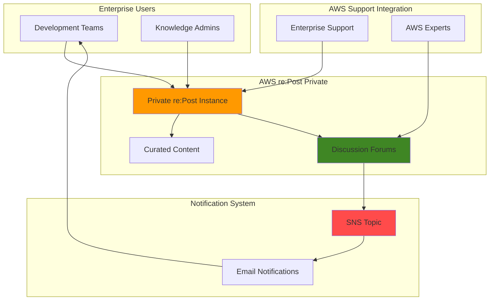

# Community Knowledge Base with re:Post Private and SNS

## Problem

Enterprise development teams struggle with knowledge silos, where critical AWS expertise and troubleshooting solutions remain trapped in individual minds or scattered across multiple documentation systems. This fragmentation leads to repeated problem-solving efforts, slower development cycles, and missed opportunities for collaborative learning, ultimately hindering cloud adoption and reducing overall team productivity.

## Solution

Establish a centralized enterprise knowledge base using AWS re:Post Private to create a secure, searchable repository of AWS expertise and troubleshooting discussions. Integrate Amazon SNS email notifications to ensure team members stay informed about new questions, solutions, and discussions, fostering an active learning community that accelerates cloud adoption and reduces knowledge gaps.

## Architecture Diagram



## Prerequisites

1. AWS Enterprise Support or Enterprise On-Ramp Support plan (required for re:Post Private)
2. AWS CLI installed and configured with appropriate permissions
3. Organization admin access to create and configure re:Post Private
4. Email addresses for team members who will receive notifications
5. Estimated cost: $0.50-$2.00 per month for SNS email notifications (varies by volume)

> **Note**: re:Post Private is included with Enterprise Support plans at no additional cost. SNS charges apply only for message delivery beyond the free tier of 1,000 email notifications per month.

## Preparation

```bash
# Set environment variables
export AWS_REGION=$(aws configure get region)
export AWS_ACCOUNT_ID=$(aws sts get-caller-identity \
    --query Account --output text)

# Generate unique identifiers for resources
RANDOM_SUFFIX=$(aws secretsmanager get-random-password \
    --exclude-punctuation --exclude-uppercase \
    --password-length 6 --require-each-included-type \
    --output text --query RandomPassword)

# Set notification topic name
export SNS_TOPIC_NAME="repost-knowledge-notifications-${RANDOM_SUFFIX}"

echo "✅ AWS environment configured for re:Post Private setup"
echo "Account ID: ${AWS_ACCOUNT_ID}"
echo "Region: ${AWS_REGION}"
```

## Steps

1. **Create SNS Topic for Knowledge Base Notifications**:

   Amazon SNS provides a managed publish-subscribe messaging service that enables reliable, scalable email notifications. Creating a dedicated topic for knowledge base updates ensures that team members receive timely notifications about new discussions, questions, and solutions without overwhelming their primary communication channels.

   ```bash
   # Create SNS topic for notifications
   aws sns create-topic \
       --name ${SNS_TOPIC_NAME}
   
   # Get the topic ARN for later use
   export TOPIC_ARN=$(aws sns list-topics \
       --query "Topics[?contains(TopicArn, '${SNS_TOPIC_NAME}')].TopicArn" \
       --output text)
   
   echo "✅ SNS topic created: ${TOPIC_ARN}"
   ```

   The SNS topic now serves as the central hub for distributing knowledge base notifications to all subscribed team members.

2. **Subscribe Email Addresses to Notifications**:

   Email subscriptions provide a non-intrusive way to keep team members informed about knowledge base activity. Each subscription requires confirmation to prevent unauthorized subscriptions and ensure compliance with email best practices.

   ```bash
   # Subscribe development team emails (replace with actual addresses)
   TEAM_EMAILS=("developer1@company.com" "developer2@company.com" "teamlead@company.com")
   
   for email in "${TEAM_EMAILS[@]}"; do
       aws sns subscribe \
           --topic-arn ${TOPIC_ARN} \
           --protocol email \
           --notification-endpoint ${email}
       echo "✅ Subscription created for ${email}"
   done
   
   echo "⚠️  Team members must confirm email subscriptions"
   ```

   Email confirmation links have been sent to each subscribed address. Team members must click the confirmation links to begin receiving notifications.

3. **Access re:Post Private Console**:

   AWS re:Post Private provides enterprise-grade knowledge management capabilities exclusively for organizations with Enterprise Support. The platform combines curated AWS content with private discussion forums to accelerate cloud adoption and reduce support escalations.

   ```bash
   # Display re:Post Private access information
   echo "🔗 Access re:Post Private at:"
   echo "https://console.aws.amazon.com/repost-private/"
   echo ""
   echo "📋 Setup checklist:"
   echo "1. Sign in with IAM Identity Center credentials"
   echo "2. Complete initial configuration wizard"
   echo "3. Customize organization branding"
   echo "4. Configure topics and tags"
   ```

   > **Warning**: Ensure you have Enterprise Support plan active before accessing re:Post Private. The service is not available with Basic, Developer, or Business support plans.

4. **Configure Private re:Post Instance**:

   The initial configuration establishes your organization's knowledge base identity and defines the collaborative framework that will guide future discussions and content creation.

   ```bash
   # Create configuration checklist
   cat > repost-config-checklist.txt << 'EOF'
   re:Post Private Configuration Checklist:
   
   ✓ Customize Appearance:
     - Organization title and welcome message
     - Upload company logo (max 2 MiB, 150x50px)
     - Set primary and button colors for branding
   
   ✓ Configure Content Management:
     - Create custom tags for internal projects
     - Define custom topics for knowledge organization
     - Set blocked terminology for compliance
   
   ✓ Select Knowledge Areas:
     - Choose AWS service topics of interest
     - Configure learning paths and selections
     - Enable curated content for your use cases
   EOF
   
   echo "✅ Configuration checklist created: repost-config-checklist.txt"
   ```

   Follow the configuration checklist to establish a professional, branded knowledge base that reflects your organization's identity and technical focus areas.

5. **Create Initial Knowledge Content**:

   Establishing foundational content encourages team participation and demonstrates the value of the knowledge base. Initial articles and discussions set the tone for collaborative knowledge sharing.

   ```bash
   # Display content creation guidelines
   cat > content-creation-guide.txt << 'EOF'
   Initial Content Creation Guidelines:
   
   🚀 Welcome Articles to Create:
     - "Getting Started with Our AWS Environment"
     - "Common Troubleshooting Procedures"
     - "Best Practices for Our Cloud Architecture"
     - "Escalation Procedures and Support Contacts"
   
   💡 Discussion Topics to Start:
     - "Share Your Latest AWS Learning"
     - "Weekly Technical Challenges"
     - "Resource Optimization Tips"
     - "Security Best Practices Discussion"
   
   📊 Content Types to Include:
     - Step-by-step tutorials
     - Architecture decision records
     - Troubleshooting runbooks
     - Learning resource recommendations
   EOF
   
   echo "✅ Content creation guide available: content-creation-guide.txt"
   ```

   Use the content creation guide to establish valuable initial knowledge that attracts team engagement and demonstrates the platform's capabilities.

6. **Test Notification System**:

   Testing ensures that the notification system functions correctly and that team members receive timely updates about knowledge base activity without overwhelming their email workflow.

   ```bash
   # Send test notification through SNS
   aws sns publish \
       --topic-arn ${TOPIC_ARN} \
       --subject "Knowledge Base Alert: Test Notification" \
       --message "This is a test notification from your enterprise knowledge base system. New discussions and solutions will be shared through this channel to keep everyone informed about valuable AWS insights and troubleshooting discoveries."
   
   echo "✅ Test notification sent to all subscribers"
   echo "📧 Check team email inboxes for delivery confirmation"
   ```

   Verify that all team members receive the test notification and that email formatting appears professional and informative.

## Validation & Testing

1. **Verify re:Post Private Setup**:

   ```bash
   # Check Enterprise Support plan status
   aws support describe-services \
       --language en 2>/dev/null || \
       echo "⚠️  Enterprise Support required for re:Post Private access"
   
   echo "✅ Enterprise Support verification complete"
   ```

   Expected output: Service list or support plan requirement message.

2. **Validate SNS Topic Configuration**:

   ```bash
   # Verify SNS topic exists and get attributes
   aws sns get-topic-attributes \
       --topic-arn ${TOPIC_ARN} \
       --query 'Attributes.{TopicArn:TopicArn,DisplayName:DisplayName}'
   
   # List all subscriptions
   aws sns list-subscriptions-by-topic \
       --topic-arn ${TOPIC_ARN} \
       --query 'Subscriptions[*].{Protocol:Protocol,Endpoint:Endpoint,SubscriptionArn:SubscriptionArn}'
   ```

   Expected output: Topic details and list of email subscriptions with confirmation status.

3. **Test Knowledge Base Functionality**:

   ```bash
   # Create functionality test checklist
   echo "🧪 Manual Testing Checklist:"
   echo "1. ✓ Create a test question in re:Post Private"
   echo "2. ✓ Verify question appears in private discussions"
   echo "3. ✓ Add response to test question"
   echo "4. ✓ Check email notifications for activity"
   echo "5. ✓ Search for content using knowledge base search"
   echo "6. ✓ Verify AWS curated content appears in selections"
   ```

   Complete each manual test to ensure the knowledge base operates as expected for real-world usage.

## Cleanup

1. **Remove SNS Topic and Subscriptions**:

   ```bash
   # Delete SNS topic (automatically removes subscriptions)
   aws sns delete-topic --topic-arn ${TOPIC_ARN}
   
   echo "✅ SNS topic and subscriptions deleted"
   ```

2. **Archive re:Post Private Content**:

   ```bash
   # Display content archival information
   echo "📦 re:Post Private Content Archival:"
   echo "- Export valuable discussions before deactivation"
   echo "- Save custom configurations and branding assets"
   echo "- Document lessons learned and usage metrics"
   echo ""
   echo "⚠️  Contact AWS Support to deactivate re:Post Private"
   echo "📞 Support case required for complete removal"
   ```

3. **Clean Environment Variables**:

   ```bash
   # Remove temporary files and variables
   rm -f repost-config-checklist.txt content-creation-guide.txt
   unset SNS_TOPIC_NAME TOPIC_ARN
   
   echo "✅ Environment variables and temporary files cleaned"
   ```

## Discussion

AWS re:Post Private represents a strategic approach to enterprise knowledge management that addresses the common challenge of information silos in cloud-native organizations. Unlike traditional wiki systems or shared documentation platforms, re:Post Private combines curated AWS expertise with private collaboration spaces, creating a hybrid environment where official AWS knowledge intersects with organization-specific insights and experiences.

The integration with Amazon SNS provides a critical engagement mechanism that transforms a passive knowledge repository into an active learning community. Email notifications ensure that valuable discussions and solutions don't remain hidden but instead reach team members who can benefit from or contribute to the conversation. This notification system follows AWS Well-Architected Framework principles by implementing loose coupling between the knowledge platform and communication channels, enabling scalable notification delivery without impacting the core knowledge base performance.

From a cost optimization perspective, this solution leverages existing Enterprise Support investments while adding minimal incremental costs through SNS email delivery. The platform's integration with AWS Support enables seamless escalation paths, where internal discussions can convert directly into support cases when needed, reducing the friction between self-service problem-solving and expert assistance. This approach aligns with the operational excellence pillar of the Well-Architected Framework by establishing clear procedures for knowledge capture, sharing, and escalation.

> **Tip**: Establish regular "knowledge harvesting" sessions where team members review recent re:Post Private discussions and promote valuable insights to permanent articles or documentation. This practice ensures that ephemeral discussions become lasting organizational knowledge assets.

**Documentation Sources:**
- [AWS re:Post Private User Guide](https://docs.aws.amazon.com/repostprivate/latest/userguide/what-is.html)
- [Amazon SNS Email Notifications Setup](https://docs.aws.amazon.com/sns/latest/dg/sns-email-notifications.html)
- [AWS Well-Architected Framework - Knowledge Management](https://docs.aws.amazon.com/wellarchitected/latest/framework/ops_evolve_ops_knowledge_management.html)
- [AWS Enterprise Support Benefits](https://aws.amazon.com/premiumsupport/plans/enterprise/)
- [Amazon SNS Best Practices](https://docs.aws.amazon.com/sns/latest/dg/sns-best-practices.html)

## Challenge

Extend this solution by implementing these enhancements:

1. **Advanced Notification Filtering**: Configure SNS subscription filter policies to send specialized notifications based on content tags, allowing team members to receive alerts only for their areas of expertise or responsibility.

2. **Integration with Slack or Microsoft Teams**: Use SNS to trigger Lambda functions that format and send notifications to team chat channels, providing real-time knowledge sharing within existing communication workflows.

3. **Automated Content Curation**: Implement CloudWatch Events and Lambda to automatically tag and categorize re:Post Private content based on keywords, AWS services mentioned, or discussion patterns, improving content discoverability.

4. **Analytics Dashboard**: Create a QuickSight dashboard that analyzes re:Post Private usage patterns, identifies knowledge gaps, and tracks the most valuable contributors and content, enabling data-driven improvements to the knowledge management program.

5. **Cross-Account Knowledge Sharing**: Establish multiple re:Post Private instances across different AWS accounts or business units, with controlled content sharing mechanisms that respect organizational boundaries while enabling broader knowledge exchange.

## Infrastructure Code

*Infrastructure code will be generated after recipe approval.*