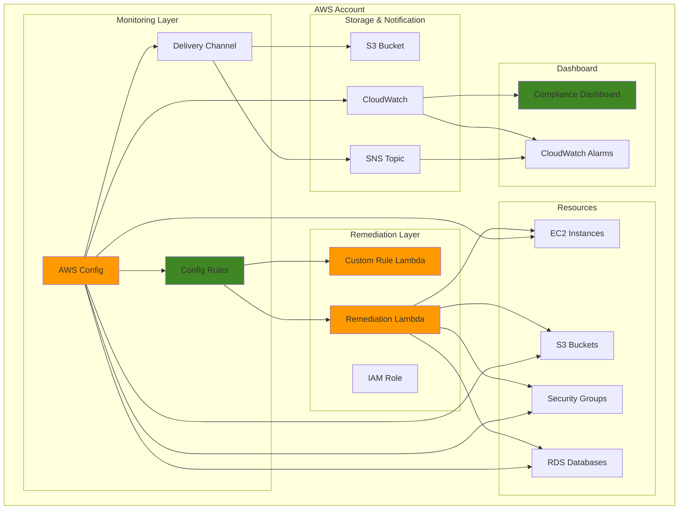

# Compliance Monitoring with AWS Config

## Problem

Organizations often struggle with maintaining compliance across their AWS infrastructure as environments grow and change rapidly. Manual compliance checks are time-consuming, error-prone, and don't scale effectively. Many companies face challenges with resource drift, configuration changes that violate security policies, and lack of visibility into their compliance posture. Without continuous monitoring, non-compliant resources can remain undetected for extended periods, potentially leading to security vulnerabilities, failed audits, and regulatory violations.

## Solution

This solution implements a comprehensive compliance monitoring system using AWS Config to continuously track resource configurations, evaluate compliance against predefined rules, and automatically remediate violations. The system combines AWS managed rules with custom Lambda-based rules to provide comprehensive coverage, sends real-time notifications through SNS, and creates automated remediation workflows to maintain compliance without manual intervention.

## Architecture Diagram



## Prerequisites

1. AWS account with appropriate permissions for Config, Lambda, SNS, S3, and CloudWatch
2. AWS CLI v2 installed and configured (or AWS CloudShell)
3. Basic knowledge of AWS Config rules and compliance frameworks
4. Understanding of Lambda functions and IAM roles
5. Estimated cost: $10-30 per month for Config rules, Lambda executions, and storage

> **Note**: AWS Config pricing depends on the number of configuration items recorded and rules evaluated. Enable only necessary resources to control costs.

## Preparation

```bash
# Set environment variables
export AWS_REGION=$(aws configure get region)
export AWS_ACCOUNT_ID=$(aws sts get-caller-identity \
    --query Account --output text)

# Generate unique identifiers for resources
RANDOM_SUFFIX=$(aws secretsmanager get-random-password \
    --exclude-punctuation --exclude-uppercase \
    --password-length 6 --require-each-included-type \
    --output text --query RandomPassword)
export CONFIG_BUCKET_NAME="config-bucket-${AWS_ACCOUNT_ID}-${RANDOM_SUFFIX}"
export CONFIG_TOPIC_NAME="config-compliance-topic-${RANDOM_SUFFIX}"
export CONFIG_ROLE_NAME="ConfigServiceRole-${RANDOM_SUFFIX}"
export REMEDIATION_ROLE_NAME="ConfigRemediationRole-${RANDOM_SUFFIX}"

# Create S3 bucket for Config data
aws s3 mb s3://${CONFIG_BUCKET_NAME} --region ${AWS_REGION}

# Create SNS topic for notifications
CONFIG_TOPIC_ARN=$(aws sns create-topic \
    --name ${CONFIG_TOPIC_NAME} \
    --output text --query TopicArn)
echo "✅ Created SNS topic: ${CONFIG_TOPIC_ARN}"

# Create IAM role for Config service
aws iam create-role \
    --role-name ${CONFIG_ROLE_NAME} \
    --assume-role-policy-document '{
        "Version": "2012-10-17",
        "Statement": [
            {
                "Effect": "Allow",
                "Principal": {
                    "Service": "config.amazonaws.com"
                },
                "Action": "sts:AssumeRole"
            }
        ]
    }'

# Attach AWS managed policy for Config service
aws iam attach-role-policy \
    --role-name ${CONFIG_ROLE_NAME} \
    --policy-arn arn:aws:iam::aws:policy/service-role/ConfigRole

# Create IAM policy for S3 bucket permissions
aws iam create-policy \
    --policy-name ConfigS3Policy-${RANDOM_SUFFIX} \
    --policy-document '{
        "Version": "2012-10-17",
        "Statement": [
            {
                "Effect": "Allow",
                "Action": [
                    "s3:GetBucketAcl",
                    "s3:GetBucketLocation",
                    "s3:GetBucketPolicy",
                    "s3:ListBucket",
                    "s3:PutObject",
                    "s3:GetObject",
                    "s3:DeleteObject"
                ],
                "Resource": [
                    "arn:aws:s3:::'${CONFIG_BUCKET_NAME}'",
                    "arn:aws:s3:::'${CONFIG_BUCKET_NAME}'/*"
                ]
            }
        ]
    }'

# Attach S3 policy to Config role
aws iam attach-role-policy \
    --role-name ${CONFIG_ROLE_NAME} \
    --policy-arn arn:aws:iam::${AWS_ACCOUNT_ID}:policy/ConfigS3Policy-${RANDOM_SUFFIX}

export CONFIG_ROLE_ARN="arn:aws:iam::${AWS_ACCOUNT_ID}:role/${CONFIG_ROLE_NAME}"
echo "✅ Created Config service role: ${CONFIG_ROLE_ARN}"
```

## Steps

1. **Set up AWS Config Delivery Channel**:

   The delivery channel is the foundation of AWS Config's data management system, establishing where configuration snapshots and history files are stored and how notifications are sent when changes occur. This component enables continuous monitoring by creating a persistent record of all resource configurations in your AWS account, which forms the baseline for compliance evaluation.

   AWS Config delivery channels support multiple destinations including S3 buckets for long-term storage and SNS topics for real-time notifications. The delivery frequency determines how often Config creates configuration snapshots - setting it to 24 hours balances storage costs with compliance monitoring needs for most organizations. This configuration enables both historical analysis and immediate alerting when compliance violations occur.

   ```bash
   # Create delivery channel configuration
   cat > delivery-channel.json << EOF
   {
       "name": "default",
       "s3BucketName": "${CONFIG_BUCKET_NAME}",
       "snsTopicARN": "${CONFIG_TOPIC_ARN}",
       "configSnapshotDeliveryProperties": {
           "deliveryFrequency": "TwentyFour_Hours"
       }
   }
   EOF
   
   # Create the delivery channel
   aws configservice put-delivery-channel \
       --delivery-channel file://delivery-channel.json
   
   echo "✅ Created Config delivery channel"
   ```

   The delivery channel is now configured to store configuration snapshots in S3 and send notifications via SNS. This establishes the data pipeline that enables all subsequent compliance monitoring activities, creating a comprehensive audit trail for regulatory requirements and security investigations.

2. **Configure AWS Config Recorder**:

   The Configuration Recorder is the core component that tracks changes to your AWS resources and records their configuration state over time. This service continuously monitors your AWS environment, capturing detailed configuration information about supported resources and maintaining a comprehensive history of all changes. Understanding how the recorder works is essential for implementing effective compliance monitoring.

   By enabling `allSupported=true` and `includeGlobalResourceTypes=true`, we ensure comprehensive coverage of all AWS resources in your account, including global services like IAM that span multiple regions. This broad monitoring approach is crucial for maintaining complete visibility into your security posture and compliance state. The recorder captures not just what resources exist, but also their configuration details, relationships, and metadata that compliance rules evaluate.

   ```bash
   # Create configuration recorder for all supported resources
   aws configservice put-configuration-recorder \
       --configuration-recorder name=default,roleARN=${CONFIG_ROLE_ARN} \
       --recording-group allSupported=true,includeGlobalResourceTypes=true
   
   # Start the configuration recorder
   aws configservice start-configuration-recorder \
       --configuration-recorder-name default
   
   echo "✅ Started Config recorder for all resources"
   ```

   The Configuration Recorder is now actively monitoring all supported AWS resources in your account. This continuous monitoring capability forms the foundation for automated compliance evaluation, enabling the system to detect configuration drift and security violations as they occur rather than during periodic manual audits.

3. **Create AWS Managed Config Rules**:

   AWS Config Rules provide the evaluation logic that determines whether your resources comply with organizational policies and security best practices. AWS managed rules are pre-built, tested compliance checks that cover common security and governance requirements, eliminating the need to develop custom evaluation logic for standard compliance scenarios.

   These managed rules leverage AWS's deep understanding of service configurations and security best practices. Each rule targets specific resource types and evaluates their configuration against established compliance criteria. The rules we're implementing address critical security controls: preventing public S3 access (data protection), ensuring EBS encryption (data at rest security), checking for root access keys (privileged access management), and enforcing resource tagging (governance and cost management).

   AWS Config Rules are designed to be declarative - you specify what compliance state you want, and the service continuously evaluates resources against these requirements. This approach enables proactive compliance monitoring rather than reactive auditing, helping organizations maintain their security posture continuously rather than discovering violations during periodic reviews.

   ```bash
   # Create rule for S3 bucket public access
   aws configservice put-config-rule \
       --config-rule '{
           "ConfigRuleName": "s3-bucket-public-access-prohibited",
           "Description": "Checks that S3 buckets do not allow public access",
           "Source": {
               "Owner": "AWS",
               "SourceIdentifier": "S3_BUCKET_PUBLIC_ACCESS_PROHIBITED"
           },
           "Scope": {
               "ComplianceResourceTypes": ["AWS::S3::Bucket"]
           }
       }'
   
   # Create rule for encrypted EBS volumes
   aws configservice put-config-rule \
       --config-rule '{
           "ConfigRuleName": "encrypted-volumes",
           "Description": "Checks whether EBS volumes are encrypted",
           "Source": {
               "Owner": "AWS",
               "SourceIdentifier": "ENCRYPTED_VOLUMES"
           },
           "Scope": {
               "ComplianceResourceTypes": ["AWS::EC2::Volume"]
           }
       }'
   
   # Create rule for root access key check
   aws configservice put-config-rule \
       --config-rule '{
           "ConfigRuleName": "root-access-key-check",
           "Description": "Checks whether root access keys exist",
           "Source": {
               "Owner": "AWS",
               "SourceIdentifier": "ROOT_ACCESS_KEY_CHECK"
           }
       }'
   
   # Create rule for required tags
   aws configservice put-config-rule \
       --config-rule '{
           "ConfigRuleName": "required-tags-ec2",
           "Description": "Checks whether EC2 instances have required tags",
           "Source": {
               "Owner": "AWS",
               "SourceIdentifier": "REQUIRED_TAGS"
           },
           "Scope": {
               "ComplianceResourceTypes": ["AWS::EC2::Instance"]
           },
           "InputParameters": "{\"tag1Key\":\"Environment\",\"tag2Key\":\"Owner\"}"
       }'
   
   echo "✅ Created AWS managed Config rules"
   ```

   The AWS managed Config rules are now active and will continuously evaluate your resources against these compliance criteria. These rules provide immediate value by implementing industry-standard security controls without requiring custom development, while the rule evaluation results will feed into your compliance dashboard and remediation workflows.

4. **Create Custom Lambda Function for Config Rules**:

   While AWS managed rules cover common compliance scenarios, organizations often need custom evaluation logic for specific business requirements, internal policies, or specialized security controls. Custom Lambda-based Config rules provide the flexibility to implement organization-specific compliance checks that go beyond standard AWS managed rules.

   Lambda functions for Config rules receive configuration items as input and return compliance evaluations, enabling sophisticated business logic that considers multiple resource attributes, cross-resource dependencies, or complex policy requirements. This approach allows organizations to codify their unique compliance requirements and maintain consistent evaluation across their AWS environment.

   The security group rule we're creating demonstrates a common pattern: evaluating network access controls based on organizational policy. This rule identifies security groups that allow unrestricted inbound access (0.0.0.0/0) except for standard web traffic ports (80, 443), helping enforce network security best practices while accommodating legitimate web application requirements.

   ```bash
   # Create IAM role for Lambda function
   aws iam create-role \
       --role-name ConfigLambdaRole-${RANDOM_SUFFIX} \
       --assume-role-policy-document '{
           "Version": "2012-10-17",
           "Statement": [
               {
                   "Effect": "Allow",
                   "Principal": {
                       "Service": "lambda.amazonaws.com"
                   },
                   "Action": "sts:AssumeRole"
               }
           ]
       }'
   
   # Attach basic Lambda execution policy
   aws iam attach-role-policy \
       --role-name ConfigLambdaRole-${RANDOM_SUFFIX} \
       --policy-arn arn:aws:iam::aws:policy/service-role/AWSLambdaBasicExecutionRole
   
   # Attach Config rule execution policy
   aws iam attach-role-policy \
       --role-name ConfigLambdaRole-${RANDOM_SUFFIX} \
       --policy-arn arn:aws:iam::aws:policy/service-role/AWSConfigRulesExecutionRole
   
   # Create Lambda function code for security group rule
   cat > sg-rule-function.py << 'EOF'
   import boto3
   import json
   
   def lambda_handler(event, context):
       # Initialize AWS Config client
       config = boto3.client('config')
       
       # Get configuration item from event
       configuration_item = event['configurationItem']
       
       # Initialize compliance status
       compliance_status = 'COMPLIANT'
       
       # Check if resource is a Security Group
       if configuration_item['resourceType'] == 'AWS::EC2::SecurityGroup':
           # Get security group configuration
           sg_config = configuration_item['configuration']
           
           # Check for overly permissive ingress rules
           for rule in sg_config.get('ipPermissions', []):
               for ip_range in rule.get('ipRanges', []):
                   if ip_range.get('cidrIp') == '0.0.0.0/0':
                       # Check if it's not port 80 or 443
                       if rule.get('fromPort') not in [80, 443]:
                           compliance_status = 'NON_COMPLIANT'
                           break
               if compliance_status == 'NON_COMPLIANT':
                   break
       
       # Put evaluation result
       config.put_evaluations(
           Evaluations=[
               {
                   'ComplianceResourceType': configuration_item['resourceType'],
                   'ComplianceResourceId': configuration_item['resourceId'],
                   'ComplianceType': compliance_status,
                   'OrderingTimestamp': configuration_item['configurationItemCaptureTime']
               }
           ],
           ResultToken=event['resultToken']
       )
       
       return {
           'statusCode': 200,
           'body': json.dumps('Config rule evaluation completed')
       }
   EOF
   
   # Create deployment package
   zip sg-rule-function.zip sg-rule-function.py
   
   # Create Lambda function
   LAMBDA_ARN=$(aws lambda create-function \
       --function-name ConfigSecurityGroupRule-${RANDOM_SUFFIX} \
       --runtime python3.12 \
       --role arn:aws:iam::${AWS_ACCOUNT_ID}:role/ConfigLambdaRole-${RANDOM_SUFFIX} \
       --handler sg-rule-function.lambda_handler \
       --zip-file fileb://sg-rule-function.zip \
       --timeout 60 \
       --output text --query FunctionArn)
   
   echo "✅ Created custom Lambda function: ${LAMBDA_ARN}"
   ```

   The custom Lambda function is now deployed and ready to evaluate security group configurations according to your organization's specific network security policies. This demonstrates how Lambda-based Config rules can implement sophisticated compliance logic that adapts to your unique security requirements while integrating seamlessly with the broader Config monitoring framework.

5. **Create Custom Config Rule with Lambda**:

   Integrating the custom Lambda function with AWS Config requires establishing the proper permissions and event triggers that enable Config to invoke the Lambda function when security group configurations change. This integration creates a real-time compliance monitoring system that immediately evaluates resources when they're created or modified.

   The Config rule configuration specifies that the Lambda function should be invoked on `ConfigurationItemChangeNotification` events, meaning the compliance evaluation occurs whenever a security group is created, modified, or deleted. This event-driven approach ensures compliance violations are detected immediately rather than during periodic batch evaluations, enabling faster response to security threats.

   Custom Config rules with Lambda functions provide the most flexible compliance monitoring option, allowing organizations to implement complex evaluation logic that considers multiple resource attributes, external data sources, or sophisticated business rules. This capability is essential for organizations with unique compliance requirements that go beyond standard AWS managed rules.

   ```bash
   # Add permission for Config to invoke Lambda
   aws lambda add-permission \
       --function-name ConfigSecurityGroupRule-${RANDOM_SUFFIX} \
       --statement-id ConfigPermission \
       --action lambda:InvokeFunction \
       --principal config.amazonaws.com \
       --source-account ${AWS_ACCOUNT_ID}
   
   # Create custom Config rule
   aws configservice put-config-rule \
       --config-rule '{
           "ConfigRuleName": "security-group-restricted-ingress",
           "Description": "Checks that security groups do not allow unrestricted ingress except for ports 80 and 443",
           "Source": {
               "Owner": "CUSTOM_LAMBDA",
               "SourceIdentifier": "'${LAMBDA_ARN}'",
               "SourceDetails": [
                   {
                       "EventSource": "aws.config",
                       "MessageType": "ConfigurationItemChangeNotification"
                   }
               ]
           },
           "Scope": {
               "ComplianceResourceTypes": ["AWS::EC2::SecurityGroup"]
           }
       }'
   
   echo "✅ Created custom Config rule with Lambda"
   ```

   The custom Config rule is now active and will automatically evaluate security group configurations in real-time. This implementation demonstrates how organizations can extend AWS Config's compliance monitoring capabilities to address specific security requirements while maintaining the same operational model as AWS managed rules.

6. **Create Remediation Lambda Function**:

   Automated remediation transforms compliance monitoring from a passive reporting tool into an active security enforcement system. This Lambda function demonstrates how organizations can automatically correct common compliance violations without manual intervention, reducing the window of exposure and operational overhead associated with compliance management.

   The remediation approach follows security best practices by implementing least-privilege permissions that allow the function to perform only the specific actions required for compliance correction. This principle ensures that remediation actions are both effective and secure, preventing over-privileged automation that could introduce additional security risks.

   Effective remediation strategies balance automation with control, automatically fixing low-risk violations while escalating complex issues for human review. The remediation logic we're implementing handles common violations like missing tags and public S3 access, which are typically safe to remediate automatically and represent the majority of compliance violations in most organizations.

   ```bash
   # Create IAM role for remediation Lambda
   aws iam create-role \
       --role-name ${REMEDIATION_ROLE_NAME} \
       --assume-role-policy-document '{
           "Version": "2012-10-17",
           "Statement": [
               {
                   "Effect": "Allow",
                   "Principal": {
                       "Service": "lambda.amazonaws.com"
                   },
                   "Action": "sts:AssumeRole"
               }
           ]
       }'
   
   # Create remediation policy
   aws iam create-policy \
       --policy-name ConfigRemediationPolicy-${RANDOM_SUFFIX} \
       --policy-document '{
           "Version": "2012-10-17",
           "Statement": [
               {
                   "Effect": "Allow",
                   "Action": [
                       "ec2:DescribeInstances",
                       "ec2:CreateTags",
                       "ec2:AuthorizeSecurityGroupIngress",
                       "ec2:RevokeSecurityGroupIngress",
                       "ec2:DescribeSecurityGroups",
                       "s3:PutBucketPublicAccessBlock",
                       "s3:GetBucketPublicAccessBlock"
                   ],
                   "Resource": "*"
               }
           ]
       }'
   
   # Attach policies to remediation role
   aws iam attach-role-policy \
       --role-name ${REMEDIATION_ROLE_NAME} \
       --policy-arn arn:aws:iam::aws:policy/service-role/AWSLambdaBasicExecutionRole
   
   aws iam attach-role-policy \
       --role-name ${REMEDIATION_ROLE_NAME} \
       --policy-arn arn:aws:iam::${AWS_ACCOUNT_ID}:policy/ConfigRemediationPolicy-${RANDOM_SUFFIX}
   
   # Create remediation Lambda function
   cat > remediation-function.py << 'EOF'
   import boto3
   import json
   
   def lambda_handler(event, context):
       ec2 = boto3.client('ec2')
       s3 = boto3.client('s3')
       
       # Parse the event
       detail = event['detail']
       config_rule_name = detail['configRuleName']
       compliance_type = detail['newEvaluationResult']['complianceType']
       resource_type = detail['resourceType']
       resource_id = detail['resourceId']
       
       if compliance_type == 'NON_COMPLIANT':
           if config_rule_name == 'required-tags-ec2' and resource_type == 'AWS::EC2::Instance':
               # Add missing tags to EC2 instance
               ec2.create_tags(
                   Resources=[resource_id],
                   Tags=[
                       {'Key': 'Environment', 'Value': 'Unknown'},
                       {'Key': 'Owner', 'Value': 'Unknown'}
                   ]
               )
               print(f"Added missing tags to EC2 instance {resource_id}")
           
           elif config_rule_name == 's3-bucket-public-access-prohibited' and resource_type == 'AWS::S3::Bucket':
               # Block public access on S3 bucket
               s3.put_public_access_block(
                   Bucket=resource_id,
                   PublicAccessBlockConfiguration={
                       'BlockPublicAcls': True,
                       'IgnorePublicAcls': True,
                       'BlockPublicPolicy': True,
                       'RestrictPublicBuckets': True
                   }
               )
               print(f"Blocked public access on S3 bucket {resource_id}")
       
       return {
           'statusCode': 200,
           'body': json.dumps('Remediation completed')
       }
   EOF
   
   # Create deployment package
   zip remediation-function.zip remediation-function.py
   
   # Create remediation Lambda function
   REMEDIATION_LAMBDA_ARN=$(aws lambda create-function \
       --function-name ConfigRemediation-${RANDOM_SUFFIX} \
       --runtime python3.12 \
       --role arn:aws:iam::${AWS_ACCOUNT_ID}:role/${REMEDIATION_ROLE_NAME} \
       --handler remediation-function.lambda_handler \
       --zip-file fileb://remediation-function.zip \
       --timeout 60 \
       --output text --query FunctionArn)
   
   echo "✅ Created remediation Lambda function: ${REMEDIATION_LAMBDA_ARN}"
   ```

   The remediation Lambda function is now deployed and ready to automatically correct compliance violations. This automated approach significantly reduces the mean time to remediation (MTTR) for compliance issues, improving your organization's security posture by closing the gap between violation detection and correction.

7. **Set up EventBridge Rule for Automatic Remediation**:

   Amazon EventBridge provides the event-driven architecture that enables real-time response to compliance violations. By creating rules that match specific event patterns, we can trigger automated remediation actions immediately when Config detects non-compliant resources, creating a closed-loop compliance system that maintains security posture without manual intervention.

   The EventBridge rule we're creating filters for 'Config Rules Compliance Change' events where the new evaluation result is 'NON_COMPLIANT', ensuring that remediation actions are triggered only when resources violate compliance policies. This selective triggering approach prevents unnecessary function invocations and ensures remediation resources are used efficiently.

   Event-driven remediation represents a significant advancement over traditional compliance approaches, transforming compliance monitoring from a periodic audit activity into a continuous security enforcement mechanism. This architecture pattern is essential for organizations operating in dynamic cloud environments where resources are frequently created and modified.

   ```bash
   # Create EventBridge rule for Config compliance changes
   aws events put-rule \
       --name ConfigComplianceRule-${RANDOM_SUFFIX} \
       --event-pattern '{
           "source": ["aws.config"],
           "detail-type": ["Config Rules Compliance Change"],
           "detail": {
               "newEvaluationResult": {
                   "complianceType": ["NON_COMPLIANT"]
               }
           }
       }' \
       --state ENABLED
   
   # Add Lambda permission for EventBridge
   aws lambda add-permission \
       --function-name ConfigRemediation-${RANDOM_SUFFIX} \
       --statement-id EventBridgePermission \
       --action lambda:InvokeFunction \
       --principal events.amazonaws.com \
       --source-arn arn:aws:events:${AWS_REGION}:${AWS_ACCOUNT_ID}:rule/ConfigComplianceRule-${RANDOM_SUFFIX}
   
   # Add Lambda as target for EventBridge rule
   aws events put-targets \
       --rule ConfigComplianceRule-${RANDOM_SUFFIX} \
       --targets "Id"="1","Arn"="${REMEDIATION_LAMBDA_ARN}"
   
   echo "✅ Created EventBridge rule for automatic remediation"
   ```

   The EventBridge rule is now active and will automatically trigger remediation actions when compliance violations are detected. This event-driven architecture ensures that your compliance posture is maintained continuously, with violations addressed within minutes rather than during periodic manual reviews.

8. **Create CloudWatch Dashboard for Compliance Monitoring**:

   CloudWatch dashboards provide essential visibility into your compliance posture, enabling stakeholders to monitor compliance trends, track remediation effectiveness, and identify areas requiring attention. This centralized monitoring approach transforms raw compliance data into actionable insights that support both operational decision-making and executive reporting.

   The dashboard design balances comprehensive monitoring with usability, displaying key compliance metrics alongside operational metrics that indicate system health and performance. By correlating compliance status with remediation function performance, teams can quickly identify issues and optimize their compliance automation processes.

   Effective compliance dashboards serve multiple audiences: security teams need detailed violation metrics, operations teams require system health indicators, and executives need trend analysis for risk assessment. This multi-widget approach provides the necessary information for each audience while maintaining a cohesive view of the overall compliance system.

   ```bash
   # Create CloudWatch dashboard
   cat > dashboard.json << EOF
   {
       "widgets": [
           {
               "type": "metric",
               "x": 0,
               "y": 0,
               "width": 12,
               "height": 6,
               "properties": {
                   "metrics": [
                       ["AWS/Config", "ComplianceByConfigRule", "ConfigRuleName", "s3-bucket-public-access-prohibited"],
                       [".", ".", ".", "encrypted-volumes"],
                       [".", ".", ".", "root-access-key-check"],
                       [".", ".", ".", "required-tags-ec2"],
                       [".", ".", ".", "security-group-restricted-ingress"]
                   ],
                   "view": "timeSeries",
                   "stacked": false,
                   "region": "${AWS_REGION}",
                   "title": "Config Rule Compliance Status",
                   "period": 300,
                   "stat": "Average"
               }
           },
           {
               "type": "metric",
               "x": 12,
               "y": 0,
               "width": 12,
               "height": 6,
               "properties": {
                   "metrics": [
                       ["AWS/Lambda", "Invocations", "FunctionName", "ConfigRemediation-${RANDOM_SUFFIX}"],
                       [".", "Errors", ".", "."],
                       [".", "Duration", ".", "."]
                   ],
                   "view": "timeSeries",
                   "stacked": false,
                   "region": "${AWS_REGION}",
                   "title": "Remediation Function Metrics",
                   "period": 300
               }
           }
       ]
   }
   EOF
   
   # Create the dashboard
   aws cloudwatch put-dashboard \
       --dashboard-name ConfigComplianceDashboard-${RANDOM_SUFFIX} \
       --dashboard-body file://dashboard.json
   
   echo "✅ Created CloudWatch dashboard for compliance monitoring"
   ```

   The CloudWatch dashboard is now providing real-time visibility into your compliance posture and remediation system performance. This monitoring capability enables proactive management of compliance issues and supports continuous improvement of your security automation processes.

9. **Create CloudWatch Alarms for Compliance Issues**:

   CloudWatch alarms provide proactive alerting that ensures compliance issues and system failures are addressed promptly. These alarms create escalation paths for violations that cannot be automatically remediated and alert operations teams to system issues that could impact compliance monitoring effectiveness.

   The alarm configuration balances sensitivity with practicality, using thresholds and evaluation periods that minimize false positives while ensuring genuine issues are escalated quickly. This approach is crucial for maintaining team confidence in the alerting system and ensuring appropriate response to critical compliance violations.

   Effective compliance alerting strategies distinguish between different types of violations, with critical security issues receiving immediate escalation while minor governance violations may be batched for periodic review. This tiered approach ensures that security and operations teams can focus their attention on the most significant issues while maintaining comprehensive monitoring coverage.

   ```bash
   # Create alarm for non-compliant resources
   aws cloudwatch put-metric-alarm \
       --alarm-name ConfigNonCompliantResources-${RANDOM_SUFFIX} \
       --alarm-description "Alert when non-compliant resources are detected" \
       --metric-name ComplianceByConfigRule \
       --namespace AWS/Config \
       --statistic Sum \
       --period 300 \
       --threshold 1 \
       --comparison-operator GreaterThanOrEqualToThreshold \
       --evaluation-periods 2 \
       --alarm-actions ${CONFIG_TOPIC_ARN}
   
   # Create alarm for remediation function errors
   aws cloudwatch put-metric-alarm \
       --alarm-name ConfigRemediationErrors-${RANDOM_SUFFIX} \
       --alarm-description "Alert when remediation function encounters errors" \
       --metric-name Errors \
       --namespace AWS/Lambda \
       --statistic Sum \
       --period 300 \
       --threshold 1 \
       --comparison-operator GreaterThanOrEqualToThreshold \
       --evaluation-periods 1 \
       --dimensions Name=FunctionName,Value=ConfigRemediation-${RANDOM_SUFFIX} \
       --alarm-actions ${CONFIG_TOPIC_ARN}
   
   echo "✅ Created CloudWatch alarms for compliance monitoring"
   ```

   The CloudWatch alarms are now actively monitoring your compliance system, providing immediate notification of compliance violations and remediation system issues. This proactive alerting capability ensures that your compliance monitoring system remains effective and that critical issues receive appropriate attention.

10. **Test the Compliance Monitoring System**:

    Testing your compliance monitoring system validates that all components work together correctly and demonstrates the end-to-end workflow from resource creation to compliance evaluation and remediation. This comprehensive testing approach ensures that your compliance system will function reliably in production environments.

    The testing strategy creates realistic scenarios that mirror actual compliance violations, allowing you to verify that detection, evaluation, and remediation processes function as expected. This validation is essential for building confidence in your automated compliance system and identifying any configuration issues before they impact production workloads.

    Effective compliance testing includes both positive and negative test cases, verifying that compliant resources are correctly identified as such while non-compliant resources trigger appropriate evaluation and remediation actions. This comprehensive approach ensures that your compliance system provides accurate and reliable results across all scenarios.

    ```bash
    # Get the latest Amazon Linux 2023 AMI ID
    LATEST_AMI=$(aws ec2 describe-images \
        --owners amazon \
        --filters "Name=name,Values=al2023-ami-*" \
        "Name=architecture,Values=x86_64" \
        "Name=state,Values=available" \
        --query 'Images|sort_by(@, &CreationDate)[-1].ImageId' \
        --output text)
    
    # Create a test EC2 instance without required tags
    TEST_INSTANCE_ID=$(aws ec2 run-instances \
        --image-id ${LATEST_AMI} \
        --instance-type t2.micro \
        --output text --query 'Instances[0].InstanceId')
    
    # Wait for Config to detect the resource
    echo "Waiting for Config to detect the new instance..."
    sleep 60
    
    # Check compliance status
    aws configservice get-compliance-details-by-resource \
        --resource-type AWS::EC2::Instance \
        --resource-id ${TEST_INSTANCE_ID} \
        --compliance-types NON_COMPLIANT
    
    # Create a test S3 bucket (will be checked for public access)
    TEST_BUCKET_NAME="test-compliance-bucket-${RANDOM_SUFFIX}"
    aws s3 mb s3://${TEST_BUCKET_NAME}
    
    # Wait for Config to evaluate the bucket
    echo "Waiting for Config to evaluate the S3 bucket..."
    sleep 60
    
    # Check overall compliance summary
    aws configservice get-compliance-summary-by-config-rule
    
    echo "✅ Testing completed - check CloudWatch dashboard for results"
    ```

    The compliance monitoring system testing is now complete, demonstrating that your implementation correctly detects violations, evaluates compliance, and triggers appropriate remediation actions. This validation confirms that your compliance automation system is ready for production use and will maintain your security posture effectively.

## Validation & Testing

1. **Verify Config Service Status**:

   ```bash
   # Check Config service status
   aws configservice get-status
   ```

   Expected output: Shows recorder status as "ON" and delivery channel status as "SUCCESS"

2. **Test Config Rules Evaluation**:

   ```bash
   # Trigger on-demand evaluation of rules
   aws configservice start-config-rules-evaluation \
       --config-rule-names s3-bucket-public-access-prohibited \
       encrypted-volumes required-tags-ec2
   
   # Check compliance summary
   aws configservice get-compliance-summary-by-config-rule
   ```

   Expected output: Shows compliance counts for each rule

3. **Verify Remediation Function**:

   ```bash
   # Check Lambda function logs
   aws logs describe-log-groups \
       --log-group-name-prefix /aws/lambda/ConfigRemediation
   
   # Get recent log events
   aws logs get-log-events \
       --log-group-name /aws/lambda/ConfigRemediation-${RANDOM_SUFFIX} \
       --log-stream-name $(aws logs describe-log-streams \
           --log-group-name /aws/lambda/ConfigRemediation-${RANDOM_SUFFIX} \
           --query 'logStreams[0].logStreamName' --output text)
   ```

4. **Test Dashboard and Alarms**:

   ```bash
   # Check CloudWatch dashboard
   aws cloudwatch get-dashboard \
       --dashboard-name ConfigComplianceDashboard-${RANDOM_SUFFIX}
   
   # Verify alarm states
   aws cloudwatch describe-alarms \
       --alarm-names ConfigNonCompliantResources-${RANDOM_SUFFIX} \
       ConfigRemediationErrors-${RANDOM_SUFFIX}
   ```

## Cleanup

1. **Remove Test Resources**:

   ```bash
   # Terminate test EC2 instance
   if [ ! -z "$TEST_INSTANCE_ID" ]; then
       aws ec2 terminate-instances --instance-ids ${TEST_INSTANCE_ID}
       echo "✅ Terminated test instance"
   fi
   
   # Delete test S3 bucket
   if [ ! -z "$TEST_BUCKET_NAME" ]; then
       aws s3 rb s3://${TEST_BUCKET_NAME} --force
       echo "✅ Deleted test bucket"
   fi
   ```

2. **Remove CloudWatch Resources**:

   ```bash
   # Delete CloudWatch dashboard
   aws cloudwatch delete-dashboards \
       --dashboard-names ConfigComplianceDashboard-${RANDOM_SUFFIX}
   
   # Delete CloudWatch alarms
   aws cloudwatch delete-alarms \
       --alarm-names ConfigNonCompliantResources-${RANDOM_SUFFIX} \
       ConfigRemediationErrors-${RANDOM_SUFFIX}
   
   echo "✅ Deleted CloudWatch resources"
   ```

3. **Remove EventBridge Rule and Lambda Functions**:

   ```bash
   # Remove EventBridge rule targets
   aws events remove-targets \
       --rule ConfigComplianceRule-${RANDOM_SUFFIX} \
       --ids "1"
   
   # Delete EventBridge rule
   aws events delete-rule \
       --name ConfigComplianceRule-${RANDOM_SUFFIX}
   
   # Delete Lambda functions
   aws lambda delete-function \
       --function-name ConfigRemediation-${RANDOM_SUFFIX}
   
   aws lambda delete-function \
       --function-name ConfigSecurityGroupRule-${RANDOM_SUFFIX}
   
   echo "✅ Deleted Lambda functions and EventBridge rule"
   ```

4. **Remove Config Rules and Service**:

   ```bash
   # Delete Config rules
   aws configservice delete-config-rule \
       --config-rule-name s3-bucket-public-access-prohibited
   
   aws configservice delete-config-rule \
       --config-rule-name encrypted-volumes
   
   aws configservice delete-config-rule \
       --config-rule-name root-access-key-check
   
   aws configservice delete-config-rule \
       --config-rule-name required-tags-ec2
   
   aws configservice delete-config-rule \
       --config-rule-name security-group-restricted-ingress
   
   # Stop configuration recorder
   aws configservice stop-configuration-recorder \
       --configuration-recorder-name default
   
   # Delete configuration recorder
   aws configservice delete-configuration-recorder \
       --configuration-recorder-name default
   
   # Delete delivery channel
   aws configservice delete-delivery-channel \
       --delivery-channel-name default
   
   echo "✅ Deleted Config rules and service components"
   ```

5. **Remove IAM Resources**:

   ```bash
   # Detach and delete IAM policies
   aws iam detach-role-policy \
       --role-name ${CONFIG_ROLE_NAME} \
       --policy-arn arn:aws:iam::aws:policy/service-role/ConfigRole
   
   aws iam detach-role-policy \
       --role-name ${CONFIG_ROLE_NAME} \
       --policy-arn arn:aws:iam::${AWS_ACCOUNT_ID}:policy/ConfigS3Policy-${RANDOM_SUFFIX}
   
   aws iam delete-policy \
       --policy-arn arn:aws:iam::${AWS_ACCOUNT_ID}:policy/ConfigS3Policy-${RANDOM_SUFFIX}
   
   aws iam delete-role --role-name ${CONFIG_ROLE_NAME}
   
   # Delete remediation role and policies
   aws iam detach-role-policy \
       --role-name ${REMEDIATION_ROLE_NAME} \
       --policy-arn arn:aws:iam::aws:policy/service-role/AWSLambdaBasicExecutionRole
   
   aws iam detach-role-policy \
       --role-name ${REMEDIATION_ROLE_NAME} \
       --policy-arn arn:aws:iam::${AWS_ACCOUNT_ID}:policy/ConfigRemediationPolicy-${RANDOM_SUFFIX}
   
   aws iam delete-policy \
       --policy-arn arn:aws:iam::${AWS_ACCOUNT_ID}:policy/ConfigRemediationPolicy-${RANDOM_SUFFIX}
   
   aws iam delete-role --role-name ${REMEDIATION_ROLE_NAME}
   
   # Delete Lambda role
   aws iam detach-role-policy \
       --role-name ConfigLambdaRole-${RANDOM_SUFFIX} \
       --policy-arn arn:aws:iam::aws:policy/service-role/AWSLambdaBasicExecutionRole
   
   aws iam detach-role-policy \
       --role-name ConfigLambdaRole-${RANDOM_SUFFIX} \
       --policy-arn arn:aws:iam::aws:policy/service-role/AWSConfigRulesExecutionRole
   
   aws iam delete-role --role-name ConfigLambdaRole-${RANDOM_SUFFIX}
   
   echo "✅ Deleted IAM roles and policies"
   ```

6. **Remove S3 Bucket and SNS Topic**:

   ```bash
   # Empty and delete S3 bucket
   aws s3 rm s3://${CONFIG_BUCKET_NAME} --recursive
   aws s3 rb s3://${CONFIG_BUCKET_NAME}
   
   # Delete SNS topic
   aws sns delete-topic --topic-arn ${CONFIG_TOPIC_ARN}
   
   # Clean up local files
   rm -f delivery-channel.json dashboard.json
   rm -f sg-rule-function.py sg-rule-function.zip
   rm -f remediation-function.py remediation-function.zip
   
   echo "✅ Cleanup completed"
   ```

## Discussion

AWS Config provides a powerful foundation for continuous compliance monitoring by automatically tracking resource configurations and evaluating them against predefined rules. The key architectural components work together to create a comprehensive monitoring system: the Configuration Recorder captures resource changes, Config Rules evaluate compliance, and Remediation Actions automatically fix violations. This integration addresses the fundamental challenge of maintaining compliance in dynamic cloud environments where manual monitoring becomes impractical.

The solution demonstrates both AWS managed rules and custom Lambda-based rules, showing how organizations can implement standard compliance checks alongside custom business logic. AWS managed rules cover common compliance scenarios like S3 bucket public access, EBS encryption, and required tags, while custom Lambda rules enable organization-specific compliance requirements. The remediation layer adds immediate value by automatically fixing common violations, reducing manual overhead and improving security posture while enabling organizations to maintain consistent compliance across their entire AWS infrastructure.

The integration with CloudWatch and EventBridge creates a real-time monitoring and alerting system that scales with your infrastructure. The CloudWatch dashboard provides visibility into compliance trends, while EventBridge enables event-driven remediation workflows. This architecture ensures that compliance violations are detected quickly and addressed automatically when possible, or escalated appropriately when manual intervention is required. For detailed implementation guidance, refer to the [AWS Config Developer Guide](https://docs.aws.amazon.com/config/latest/developerguide/WhatIsConfig.html) and [AWS Config Rules documentation](https://docs.aws.amazon.com/config/latest/developerguide/evaluate-config.html).

Cost optimization is crucial for Config deployments, as charges are based on configuration items recorded and rule evaluations performed. Organizations should carefully select which resource types to monitor and consider using resource-specific recording groups to control costs. The solution also demonstrates how to implement periodic snapshot delivery to balance monitoring frequency with cost considerations. For comprehensive cost management strategies, see the [AWS Config pricing documentation](https://aws.amazon.com/config/pricing/) and consider implementing [AWS Config remediation best practices](https://docs.aws.amazon.com/config/latest/developerguide/setup-autoremediation.html).

> **Tip**: Use AWS Config's resource-based recording to focus on high-value resources and reduce costs. Consider implementing a tiered approach with different monitoring levels for different environments. For advanced configurations, explore [AWS Config conformance packs](https://docs.aws.amazon.com/config/latest/developerguide/conformance-packs.html) which provide templated rule sets for common compliance frameworks.

## Challenge

Extend this solution by implementing these enhancements:

1. **Multi-Account Compliance**: Deploy AWS Config Rules across multiple AWS accounts using AWS Organizations and Config organizational rules to ensure consistent compliance policies across your entire organization.

2. **Custom Compliance Framework**: Create a custom compliance framework mapping specific Config rules to regulatory requirements (SOC 2, PCI DSS, HIPAA) with automated reporting and evidence collection for audits.

3. **Advanced Remediation Workflows**: Implement more sophisticated remediation workflows using AWS Step Functions to handle complex multi-step remediation processes, approval workflows, and rollback mechanisms.

4. **Compliance Scoring and Trending**: Build a comprehensive compliance scoring system that tracks compliance trends over time, identifies compliance drift patterns, and provides predictive insights using Amazon QuickSight.

5. **Integration with Security Services**: Integrate Config with AWS Security Hub, AWS Systems Manager Patch Manager, and AWS Inspector to create a unified security and compliance monitoring platform with centralized findings management.

## Infrastructure Code

### Available Infrastructure as Code:

- [Infrastructure Code Overview](code/README.md) - Detailed description of all infrastructure components
- [AWS CDK (Python)](code/cdk-python/) - AWS CDK Python implementation
- [AWS CDK (TypeScript)](code/cdk-typescript/) - AWS CDK TypeScript implementation
- [CloudFormation](code/cloudformation.yaml) - AWS CloudFormation template
- [Bash CLI Scripts](code/scripts/) - Example bash scripts using AWS CLI commands to deploy infrastructure
- [Terraform](code/terraform/) - Terraform configuration files