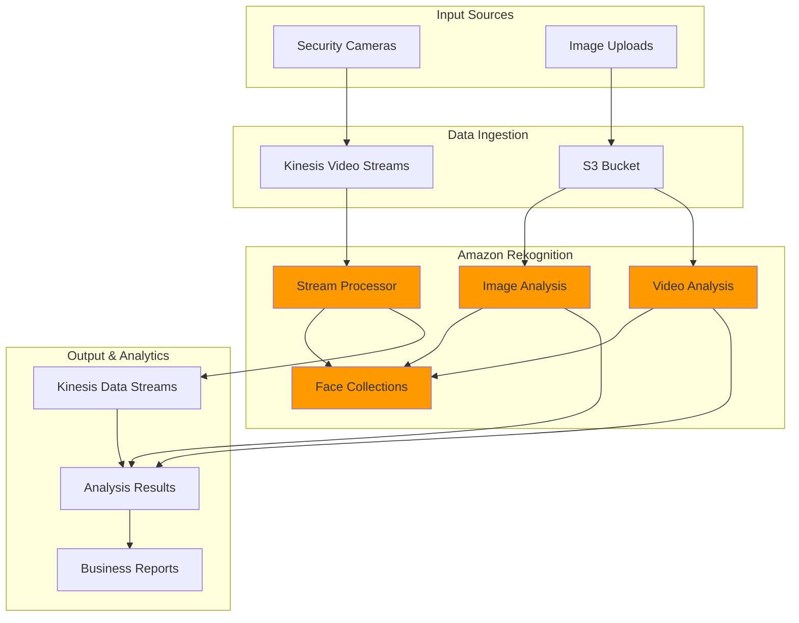

# Computer Vision Applications with Rekognition


## Problem

A retail company with thousands of stores needs to analyze customer behavior, monitor safety compliance, and manage inventory through video surveillance systems. Manual review of hours of video footage is impractical, and the company struggles with identifying shoplifting incidents, understanding customer demographics, and ensuring safety protocols are followed. Traditional security systems only provide basic recording capabilities without intelligent analysis, leaving critical business insights untapped and security vulnerabilities unaddressed.

## Solution

We'll build a comprehensive computer vision application using Amazon Rekognition that analyzes both images and videos to detect objects, recognize faces, analyze demographics, and moderate content. The solution integrates Amazon Kinesis Video Streams for real-time processing and Amazon S3 for batch analysis, providing automated insights for security, marketing, and operational efficiency while maintaining customer privacy and compliance requirements.

## Architecture Diagram



## Prerequisites

1. AWS account with appropriate permissions for Amazon Rekognition, S3, and Kinesis Video Streams
2. AWS CLI v2 installed and configured (or AWS CloudShell)
3. Basic understanding of computer vision concepts and AWS services
4. Sample images and videos for testing (retail/security footage recommended)
5. Understanding of facial recognition privacy and compliance requirements
6. Estimated cost: $15-25 USD for processing 1,000 images and 1 hour of video (varies by region)

> **Note**: Free tier includes 5,000 images processed per month for the first 12 months. Video analysis charges apply separately.

## Preparation

```bash
# Set environment variables
export AWS_REGION=$(aws configure get region)
export AWS_ACCOUNT_ID=$(aws sts get-caller-identity \
    --query Account --output text)

# Generate unique identifiers for resources
RANDOM_SUFFIX=$(aws secretsmanager get-random-password \
    --exclude-punctuation --exclude-uppercase \
    --password-length 8 --require-each-included-type \
    --output text --query RandomPassword)

# Set resource names
export S3_BUCKET_NAME="computer-vision-app-${RANDOM_SUFFIX}"
export FACE_COLLECTION_NAME="retail-faces-${RANDOM_SUFFIX}"
export KVS_STREAM_NAME="security-video-${RANDOM_SUFFIX}"
export KDS_STREAM_NAME="rekognition-results-${RANDOM_SUFFIX}"

# Create S3 bucket for storing images and videos
aws s3 mb s3://${S3_BUCKET_NAME} --region ${AWS_REGION}

# Create directories for organized storage
aws s3api put-object --bucket ${S3_BUCKET_NAME} \
    --key images/
aws s3api put-object --bucket ${S3_BUCKET_NAME} \
    --key videos/
aws s3api put-object --bucket ${S3_BUCKET_NAME} \
    --key results/

# Create local directories for sample content
mkdir -p ~/computer-vision-demo/{images,videos,results}

echo "✅ Preparation complete. Resources created with suffix: ${RANDOM_SUFFIX}"
```

## Steps

1. **Create Face Collection for Person Recognition**:

   Face collections in Amazon Rekognition act as databases for storing facial feature vectors, enabling fast face recognition and search capabilities. This is essential for identifying known individuals in your computer vision applications.

   ```bash
   # Create a face collection for storing known faces
   # This creates a container for facial feature vectors, not actual images
   aws rekognition create-collection \
       --collection-id ${FACE_COLLECTION_NAME} \
       --region ${AWS_REGION}
   
   # Verify collection was created and check its configuration
   aws rekognition describe-collection \
       --collection-id ${FACE_COLLECTION_NAME} \
       --region ${AWS_REGION}
   
   echo "✅ Face collection created: ${FACE_COLLECTION_NAME}"
   ```

   The face collection stores only mathematical representations (feature vectors) of faces, not the actual images, ensuring privacy compliance while enabling fast recognition.

2. **Upload Sample Images and Index Known Faces**:

   Face indexing is the cornerstone of identity management in computer vision systems. When you index faces, Amazon Rekognition extracts mathematical feature vectors from facial geometries and stores them in your collection, enabling rapid identification of individuals across thousands of images or video frames. This process is essential for retail security systems, employee access control, and customer experience personalization, as it allows the system to recognize known individuals in real-time without storing sensitive biometric images.

   ```bash
   # Download sample images (or use your own)
   curl -o ~/computer-vision-demo/images/person1.jpg \
       "https://images.pexels.com/photos/220453/pexels-photo-220453.jpeg?auto=compress&cs=tinysrgb&w=400"
   
   curl -o ~/computer-vision-demo/images/person2.jpg \
       "https://images.pexels.com/photos/614810/pexels-photo-614810.jpeg?auto=compress&cs=tinysrgb&w=400"
   
   # Upload images to S3
   aws s3 cp ~/computer-vision-demo/images/ \
       s3://${S3_BUCKET_NAME}/images/ --recursive
   
   # Index the first face in the collection
   aws rekognition index-faces \
       --image "S3Object={Bucket=${S3_BUCKET_NAME},Name=images/person1.jpg}" \
       --collection-id ${FACE_COLLECTION_NAME} \
       --external-image-id "employee_001" \
       --detection-attributes "ALL" \
       --region ${AWS_REGION} \
       > ~/computer-vision-demo/results/index-faces-result.json
   
   # Extract and store the Face ID
   FACE_ID_1=$(cat ~/computer-vision-demo/results/index-faces-result.json | \
       jq -r '.FaceRecords[0].Face.FaceId')
   
   echo "✅ Indexed face with ID: ${FACE_ID_1}"
   ```

   The face is now successfully indexed in your collection with a unique Face ID and associated external identifier. This indexed face can be matched against new images or video frames with high accuracy, enabling automated recognition workflows. The external ID ("employee_001") serves as a business-friendly identifier, allowing you to map face recognition results back to your existing user management systems. For more information about managing face collections, see the [AWS Rekognition Face Collections documentation](https://docs.aws.amazon.com/rekognition/latest/dg/managing-face-collections.html).

3. **Comprehensive Image Analysis**:

   This step demonstrates Rekognition's multi-modal analysis capabilities, running several AI models in parallel to extract different types of information from images. Each analysis type serves specific business use cases.

   ```bash
   # Set image to analyze
   IMAGE_NAME="person2.jpg"
   
   # 1. Detect labels (objects and scenes)
   # This uses deep learning models trained on millions of images to identify objects, scenes, activities, and concepts
   aws rekognition detect-labels \
       --image "S3Object={Bucket=${S3_BUCKET_NAME},Name=images/${IMAGE_NAME}}" \
       --features GENERAL_LABELS,IMAGE_PROPERTIES \
       --settings '{"GeneralLabels":{"LabelInclusionFilters":[],"LabelExclusionFilters":[],"LabelCategoryInclusionFilters":[],"LabelCategoryExclusionFilters":[],"MaxLabels":20},"ImageProperties":{"MaxDominantColors":10}}' \
       --region ${AWS_REGION} \
       > ~/computer-vision-demo/results/labels-analysis.json
   
   # 2. Detect and analyze faces with all attributes
   aws rekognition detect-faces \
       --image "S3Object={Bucket=${S3_BUCKET_NAME},Name=images/${IMAGE_NAME}}" \
       --attributes ALL \
       --region ${AWS_REGION} \
       > ~/computer-vision-demo/results/face-analysis.json
   
   # 3. Search for faces in the collection
   aws rekognition search-faces-by-image \
       --image "S3Object={Bucket=${S3_BUCKET_NAME},Name=images/${IMAGE_NAME}}" \
       --collection-id ${FACE_COLLECTION_NAME} \
       --face-match-threshold 80 \
       --region ${AWS_REGION} \
       > ~/computer-vision-demo/results/face-search.json
   
   # 4. Detect text in the image
   aws rekognition detect-text \
       --image "S3Object={Bucket=${S3_BUCKET_NAME},Name=images/${IMAGE_NAME}}" \
       --region ${AWS_REGION} \
       > ~/computer-vision-demo/results/text-detection.json
   
   # 5. Content moderation
   aws rekognition detect-moderation-labels \
       --image "S3Object={Bucket=${S3_BUCKET_NAME},Name=images/${IMAGE_NAME}}" \
       --region ${AWS_REGION} \
       > ~/computer-vision-demo/results/moderation-analysis.json
   
   echo "✅ Comprehensive image analysis completed"
   ```

   These five parallel analyses have generated comprehensive insights about the image content. Label detection identified objects and scenes for inventory management, facial analysis provided demographic insights for marketing, face search enabled security identification, text detection captured signage and documents, and content moderation ensured compliance with platform policies. This multi-faceted approach provides the foundation for intelligent retail analytics, automated security monitoring, and customer experience optimization.

4. **Display Analysis Results**:

   Understanding how to interpret and visualize computer vision results is crucial for transforming raw AI outputs into actionable business insights. This step demonstrates how to parse JSON responses from multiple Rekognition APIs and extract meaningful information for decision-making. Each analysis type returns structured data with confidence scores, enabling you to implement business rules based on accuracy thresholds and operational requirements.

   ```bash
   # Show detected objects and scenes
   echo "=== DETECTED OBJECTS AND SCENES ==="
   cat ~/computer-vision-demo/results/labels-analysis.json | \
       jq -r '.Labels[] | select(.Confidence > 80) | "\(.Name): \(.Confidence | floor)%"' | \
       head -10
   
   echo ""
   echo "=== FACIAL ANALYSIS ==="
   cat ~/computer-vision-demo/results/face-analysis.json | \
       jq -r '.FaceDetails[] | "Age: \(.AgeRange.Low)-\(.AgeRange.High), Gender: \(.Gender.Value) (\(.Gender.Confidence | floor)%), Emotions: \(.Emotions[0].Type) (\(.Emotions[0].Confidence | floor)%)"'
   
   echo ""
   echo "=== FACE MATCHES ==="
   FACE_MATCHES=$(cat ~/computer-vision-demo/results/face-search.json | \
       jq -r '.FaceMatches | length')
   
   if [ "$FACE_MATCHES" -gt 0 ]; then
       echo "Found matches in face collection:"
       cat ~/computer-vision-demo/results/face-search.json | \
           jq -r '.FaceMatches[] | "External ID: \(.Face.ExternalImageId), Similarity: \(.Similarity | floor)%"'
   else
       echo "No matches found in face collection"
   fi
   
   echo ""
   echo "=== DETECTED TEXT ==="
   cat ~/computer-vision-demo/results/text-detection.json | \
       jq -r '.TextDetections[] | select(.Type=="LINE") | .DetectedText'
   
   echo ""
   echo "=== CONTENT MODERATION ==="
   MODERATION_LABELS=$(cat ~/computer-vision-demo/results/moderation-analysis.json | \
       jq -r '.ModerationLabels | length')
   
   if [ "$MODERATION_LABELS" -gt 0 ]; then
       echo "Content moderation flags detected:"
       cat ~/computer-vision-demo/results/moderation-analysis.json | \
           jq -r '.ModerationLabels[] | "\(.Name): \(.Confidence | floor)%"'
   else
       echo "No content moderation issues detected"
   fi
   ```

   These results provide immediate, actionable insights from your computer vision analysis. The object detection reveals inventory presence and customer activities, facial analysis offers demographic insights for marketing optimization, face matching enables security identification, text detection captures signage and documentation, and content moderation ensures compliance. This structured output can be integrated into business intelligence systems, trigger automated alerts, or feed into real-time dashboards for operational monitoring.

5. **Video Analysis Setup**:

   Video analysis requires specialized IAM permissions because Amazon Rekognition needs to access your S3 buckets and potentially publish results to SNS topics or Kinesis streams. Creating a dedicated service role follows AWS security best practices by implementing the principle of least privilege, ensuring that Rekognition can only access the specific resources required for video processing operations. This role-based approach also enables audit trails and fine-grained access control for compliance requirements.

   ```bash
   # Create IAM role for Rekognition video analysis
   cat > ~/computer-vision-demo/trust-policy.json << 'EOF'
   {
       "Version": "2012-10-17",
       "Statement": [
           {
               "Effect": "Allow",
               "Principal": {
                   "Service": "rekognition.amazonaws.com"
               },
               "Action": "sts:AssumeRole"
           }
       ]
   }
   EOF
   
   # Create the IAM role
   aws iam create-role \
       --role-name RekognitionVideoAnalysisRole \
       --assume-role-policy-document file://~/computer-vision-demo/trust-policy.json
   
   # Attach necessary policies
   aws iam attach-role-policy \
       --role-name RekognitionVideoAnalysisRole \
       --policy-arn arn:aws:iam::aws:policy/service-role/AmazonRekognitionServiceRole
   
   # Get the role ARN
   ROLE_ARN=$(aws iam get-role \
       --role-name RekognitionVideoAnalysisRole \
       --query 'Role.Arn' --output text)
   
   echo "✅ Created IAM role: ${ROLE_ARN}"
   ```

   The IAM role is now configured with appropriate permissions for video analysis operations. This role enables Rekognition to access your S3 buckets, read video files, and publish results to specified destinations. The AmazonRekognitionServiceRole managed policy provides the necessary permissions for standard video analysis tasks while maintaining security boundaries. This secure foundation enables scalable video processing for surveillance systems, content moderation, and automated video analytics.

6. **Start Video Analysis Jobs**:

   Video analysis in Rekognition is asynchronous due to the computational complexity of processing potentially hours of video content. Multiple analysis jobs can run in parallel to extract different insights from the same video.

   ```bash
   # Download sample video or upload your own
   curl -o ~/computer-vision-demo/videos/sample-video.mp4 \
       "https://commondatastorage.googleapis.com/gtv-videos-bucket/sample/BigBuckBunny.mp4"
   
   # Upload video to S3 (required for video analysis)
   aws s3 cp ~/computer-vision-demo/videos/sample-video.mp4 \
       s3://${S3_BUCKET_NAME}/videos/
   
   # Start face detection in video - tracks facial appearances frame by frame
   FACE_DETECTION_JOB=$(aws rekognition start-face-detection \
       --video "S3Object={Bucket=${S3_BUCKET_NAME},Name=videos/sample-video.mp4}" \
       --region ${AWS_REGION} \
       --query 'JobId' --output text)
   
   # Start label detection in video
   LABEL_DETECTION_JOB=$(aws rekognition start-label-detection \
       --video "S3Object={Bucket=${S3_BUCKET_NAME},Name=videos/sample-video.mp4}" \
       --region ${AWS_REGION} \
       --query 'JobId' --output text)
   
   # Start person tracking in video
   PERSON_TRACKING_JOB=$(aws rekognition start-person-tracking \
       --video "S3Object={Bucket=${S3_BUCKET_NAME},Name=videos/sample-video.mp4}" \
       --region ${AWS_REGION} \
       --query 'JobId' --output text)
   
   echo "✅ Started video analysis jobs:"
   echo "Face Detection Job ID: ${FACE_DETECTION_JOB}"
   echo "Label Detection Job ID: ${LABEL_DETECTION_JOB}"
   echo "Person Tracking Job ID: ${PERSON_TRACKING_JOB}"
   ```

   Three parallel analysis jobs are now processing your video content in the background. Face detection tracks facial appearances throughout the video timeline, label detection identifies objects and activities in each frame, and person tracking follows individual movement patterns. This asynchronous processing approach enables efficient analysis of large video files without blocking your application. The job IDs allow you to monitor progress and retrieve results when processing completes. Learn more about video analysis in the [Amazon Rekognition streaming video documentation](https://docs.aws.amazon.com/rekognition/latest/dg/streaming-video.html).

7. **Monitor Video Analysis Progress**:

   Monitoring asynchronous video analysis jobs is essential for building reliable computer vision applications. Video processing times vary significantly based on file size, resolution, and content complexity, making real-time progress tracking crucial for user experience and system reliability. This polling mechanism implements best practices for job monitoring while avoiding excessive API calls that could impact performance or costs.

   ```bash
   # Create a function to check job status
   check_job_status() {
       local job_id=$1
       local job_type=$2
       
       case $job_type in
           "face")
               aws rekognition get-face-detection \
                   --job-id $job_id \
                   --query 'JobStatus' --output text
               ;;
           "label")
               aws rekognition get-label-detection \
                   --job-id $job_id \
                   --query 'JobStatus' --output text
               ;;
           "person")
               aws rekognition get-person-tracking \
                   --job-id $job_id \
                   --query 'JobStatus' --output text
               ;;
       esac
   }
   
   # Wait for jobs to complete (this may take several minutes)
   echo "Waiting for video analysis jobs to complete..."
   
   while true; do
       FACE_STATUS=$(check_job_status ${FACE_DETECTION_JOB} "face")
       LABEL_STATUS=$(check_job_status ${LABEL_DETECTION_JOB} "label")
       PERSON_STATUS=$(check_job_status ${PERSON_TRACKING_JOB} "person")
       
       echo "Job Status - Face: ${FACE_STATUS}, Label: ${LABEL_STATUS}, Person: ${PERSON_STATUS}"
       
       if [[ "$FACE_STATUS" == "SUCCEEDED" && "$LABEL_STATUS" == "SUCCEEDED" && "$PERSON_STATUS" == "SUCCEEDED" ]]; then
           echo "✅ All video analysis jobs completed successfully"
           break
       fi
       
       if [[ "$FACE_STATUS" == "FAILED" || "$LABEL_STATUS" == "FAILED" || "$PERSON_STATUS" == "FAILED" ]]; then
           echo "❌ One or more jobs failed"
           break
       fi
       
       sleep 30
   done
   ```

   All video analysis jobs have completed successfully and are ready for result retrieval. This monitoring approach ensures that your application waits for complete processing before attempting to access results, preventing errors and ensuring data integrity. The successful completion of all jobs indicates that comprehensive video insights are now available for analysis, reporting, and integration into your business intelligence systems.

8. **Retrieve and Analyze Video Results**:

   Video analysis results provide temporal insights that are impossible to achieve with static image analysis alone. By processing video content frame by frame, you can understand movement patterns, track individual subjects over time, and identify behavioral trends that inform business decisions. This temporal dimension enables applications like customer flow analysis, security incident tracking, and operational efficiency monitoring that rely on understanding how situations develop over time.

   ```bash
   # Get face detection results
   aws rekognition get-face-detection \
       --job-id ${FACE_DETECTION_JOB} \
       --region ${AWS_REGION} \
       > ~/computer-vision-demo/results/video-face-detection.json
   
   # Get label detection results
   aws rekognition get-label-detection \
       --job-id ${LABEL_DETECTION_JOB} \
       --region ${AWS_REGION} \
       > ~/computer-vision-demo/results/video-label-detection.json
   
   # Get person tracking results
   aws rekognition get-person-tracking \
       --job-id ${PERSON_TRACKING_JOB} \
       --region ${AWS_REGION} \
       > ~/computer-vision-demo/results/video-person-tracking.json
   
   # Display summary of video analysis
   echo "=== VIDEO ANALYSIS SUMMARY ==="
   
   # Count faces detected
   FACE_COUNT=$(cat ~/computer-vision-demo/results/video-face-detection.json | \
       jq -r '.Faces | length')
   echo "Total faces detected: ${FACE_COUNT}"
   
   # Show top labels
   echo "Top 5 labels detected in video:"
   cat ~/computer-vision-demo/results/video-label-detection.json | \
       jq -r '.Labels | group_by(.Label.Name) | map({name: .[0].Label.Name, count: length, confidence: (map(.Label.Confidence) | add / length)}) | sort_by(-.count) | .[0:5] | .[] | "\(.name): \(.count) instances, avg confidence: \(.confidence | floor)%"'
   
   # Show person tracking summary
   PERSON_COUNT=$(cat ~/computer-vision-demo/results/video-person-tracking.json | \
       jq -r '.Persons | map(.Person.Index) | unique | length')
   echo "Unique persons tracked: ${PERSON_COUNT}"
   
   echo "✅ Video analysis results retrieved"
   ```

   The video analysis results now provide comprehensive temporal insights about your video content. Face detection results include timestamps for each appearance, enabling you to track when specific individuals were present. Label detection reveals which objects and activities occurred throughout the video timeline, while person tracking provides movement patterns and behavioral analytics. This rich temporal data enables advanced applications like customer journey mapping, security event correlation, and operational optimization based on actual behavior patterns rather than static snapshots.

9. **Create Comprehensive Analytics Report**:

   Transforming raw computer vision data into actionable business intelligence requires structured reporting that combines multiple analysis types into cohesive insights. This comprehensive report generation process demonstrates how to aggregate image and video analysis results, calculate business metrics, and present findings in a format suitable for decision-making. Automated reporting enables regular monitoring of key performance indicators and helps identify trends that inform strategic business decisions.

   ```bash
   # Generate a comprehensive report
   cat > ~/computer-vision-demo/generate-analytics-report.py << 'EOF'
   #!/usr/bin/env python3
   import json
   import os
   from datetime import datetime
   
   def load_json_file(file_path):
       try:
           with open(file_path, 'r') as f:
               return json.load(f)
       except FileNotFoundError:
           return {}
   
   def generate_report():
       results_dir = os.path.expanduser('~/computer-vision-demo/results')
       
       # Load all analysis results
       labels = load_json_file(f'{results_dir}/labels-analysis.json')
       faces = load_json_file(f'{results_dir}/face-analysis.json')
       face_search = load_json_file(f'{results_dir}/face-search.json')
       text_detection = load_json_file(f'{results_dir}/text-detection.json')
       moderation = load_json_file(f'{results_dir}/moderation-analysis.json')
       video_labels = load_json_file(f'{results_dir}/video-label-detection.json')
       video_faces = load_json_file(f'{results_dir}/video-face-detection.json')
       video_persons = load_json_file(f'{results_dir}/video-person-tracking.json')
       
       # Generate report
       report = f"""
   # Computer Vision Analysis Report
   
   Generated: {datetime.now().strftime('%Y-%m-%d %H:%M:%S')}
   
   ## Image Analysis Summary
   
   ### Object Detection
   - Total labels detected: {len(labels.get('Labels', []))}
   - High confidence labels (>90%): {len([l for l in labels.get('Labels', []) if l.get('Confidence', 0) > 90])}
   
   ### Facial Analysis
   - Faces detected: {len(faces.get('FaceDetails', []))}
   """
       
       # Add facial analysis details
       for i, face in enumerate(faces.get('FaceDetails', [])):
           age_range = face.get('AgeRange', {})
           gender = face.get('Gender', {})
           emotions = face.get('Emotions', [])
           top_emotion = emotions[0] if emotions else {'Type': 'N/A', 'Confidence': 0}
           
           report += f"""
   #### Face {i+1}
   - Age Range: {age_range.get('Low', 'N/A')}-{age_range.get('High', 'N/A')}
   - Gender: {gender.get('Value', 'N/A')} ({gender.get('Confidence', 0):.1f}%)
   - Primary Emotion: {top_emotion.get('Type', 'N/A')} ({top_emotion.get('Confidence', 0):.1f}%)
   """
       
       # Add face matching results
       face_matches = face_search.get('FaceMatches', [])
       report += f"""
   ### Face Recognition
   - Face matches found: {len(face_matches)}
   """
       
       for match in face_matches:
           face_data = match.get('Face', {})
           report += f"- External ID: {face_data.get('ExternalImageId', 'N/A')}, Similarity: {match.get('Similarity', 0):.1f}%\n"
       
       # Add text detection
       text_detections = text_detection.get('TextDetections', [])
       line_texts = [t.get('DetectedText', '') for t in text_detections if t.get('Type') == 'LINE']
       report += f"""
   ### Text Detection
   - Text elements found: {len(line_texts)}
   - Detected text: {', '.join(line_texts) if line_texts else 'None'}
   
   ### Content Moderation
   - Moderation labels: {len(moderation.get('ModerationLabels', []))}
   """
       
       # Add video analysis if available
       if video_labels or video_faces or video_persons:
           report += f"""
   ## Video Analysis Summary
   
   ### Video Labels
   - Total label instances: {len(video_labels.get('Labels', []))}
   - Unique labels: {len(set(l.get('Label', {}).get('Name', '') for l in video_labels.get('Labels', [])))}
   
   ### Video Faces
   - Total face detections: {len(video_faces.get('Faces', []))}
   
   ### Person Tracking
   - Unique persons tracked: {len(set(p.get('Person', {}).get('Index', 0) for p in video_persons.get('Persons', [])))}
   """
       
       # Write report to file
       with open(f'{results_dir}/analytics-report.md', 'w') as f:
           f.write(report)
       
       print("✅ Analytics report generated: ~/computer-vision-demo/results/analytics-report.md")
   
   if __name__ == "__main__":
       generate_report()
   EOF
   
   # Make the script executable and run it
   chmod +x ~/computer-vision-demo/generate-analytics-report.py
   python3 ~/computer-vision-demo/generate-analytics-report.py
   
   # Display the report
   echo "=== ANALYTICS REPORT ==="
   cat ~/computer-vision-demo/results/analytics-report.md
   ```

   The comprehensive analytics report consolidates all computer vision insights into a single, actionable document. This report format enables business stakeholders to understand customer demographics, security events, inventory presence, and operational patterns without requiring technical expertise. The structured format facilitates integration with business intelligence tools and enables automated decision-making based on computer vision insights. This reporting approach transforms raw AI data into strategic business intelligence that drives operational improvements and informed decision-making.

10. **Implement Real-time Streaming Analysis (Optional)**:

    Real-time streaming analysis enables immediate response to computer vision events, making it essential for security systems, automated alerts, and live monitoring applications. Unlike batch processing, streaming analysis provides continuous monitoring of video feeds with minimal latency, enabling immediate detection of security incidents, VIP customer arrivals, or operational anomalies. This architecture supports scalable processing of multiple video streams simultaneously while maintaining low latency for time-sensitive applications.

    ```bash
    # Create Kinesis Data Stream for output
    aws kinesis create-stream \
        --stream-name ${KDS_STREAM_NAME} \
        --shard-count 1 \
        --region ${AWS_REGION}
    
    # Wait for stream to be active
    aws kinesis wait stream-exists \
        --stream-name ${KDS_STREAM_NAME} \
        --region ${AWS_REGION}
    
    # Create Kinesis Video Stream
    aws kinesisvideo create-stream \
        --stream-name ${KVS_STREAM_NAME} \
        --data-retention-in-hours 24 \
        --region ${AWS_REGION}
    
    # Get stream ARNs
    KVS_ARN=$(aws kinesisvideo describe-stream \
        --stream-name ${KVS_STREAM_NAME} \
        --query 'StreamInfo.StreamARN' --output text)
    
    KDS_ARN=$(aws kinesis describe-stream \
        --stream-name ${KDS_STREAM_NAME} \
        --query 'StreamDescription.StreamARN' --output text)
    
    # Create stream processor for real-time face search
    aws rekognition create-stream-processor \
        --name "face-search-processor-${RANDOM_SUFFIX}" \
        --input "{\"KinesisVideoStream\":{\"Arn\":\"${KVS_ARN}\"}}" \
        --stream-processor-output "{\"KinesisDataStream\":{\"Arn\":\"${KDS_ARN}\"}}" \
        --role-arn ${ROLE_ARN} \
        --settings "{\"FaceSearch\":{\"CollectionId\":\"${FACE_COLLECTION_NAME}\",\"FaceMatchThreshold\":80.0}}" \
        --region ${AWS_REGION}
    
    echo "✅ Real-time streaming analysis setup complete"
    echo "Stream Processor created for face search"
    echo "Kinesis Video Stream: ${KVS_STREAM_NAME}"
    echo "Kinesis Data Stream: ${KDS_STREAM_NAME}"
    ```

    The real-time streaming analysis infrastructure is now operational and ready to process live video feeds. The stream processor continuously monitors the Kinesis Video Stream for face matches against your collection, publishing results to the Kinesis Data Stream for immediate consumption by downstream applications. This architecture enables sub-second response times for security alerts, customer recognition, and operational monitoring, supporting mission-critical applications that require immediate action based on computer vision insights.

## Validation & Testing

1. **Verify Face Collection and Indexed Faces**:

   ```bash
   # List all faces in the collection
   aws rekognition list-faces \
       --collection-id ${FACE_COLLECTION_NAME} \
       --region ${AWS_REGION}
   
   # Check collection statistics
   aws rekognition describe-collection \
       --collection-id ${FACE_COLLECTION_NAME} \
       --region ${AWS_REGION}
   ```

   Expected output: Collection details with face count and creation date

2. **Test Image Analysis Results**:

   ```bash
   # Verify analysis files exist
   ls -la ~/computer-vision-demo/results/
   
   # Check for high-confidence labels
   HIGH_CONFIDENCE_LABELS=$(cat ~/computer-vision-demo/results/labels-analysis.json | \
       jq -r '.Labels[] | select(.Confidence > 90) | .Name' | wc -l)
   
   echo "High confidence labels detected: ${HIGH_CONFIDENCE_LABELS}"
   ```

   Expected output: List of result files and count of high-confidence labels

3. **Validate Video Analysis Completion**:

   ```bash
   # Check video analysis job statuses
   aws rekognition get-face-detection \
       --job-id ${FACE_DETECTION_JOB} \
       --query 'JobStatus' --output text
   
   aws rekognition get-label-detection \
       --job-id ${LABEL_DETECTION_JOB} \
       --query 'JobStatus' --output text
   
   aws rekognition get-person-tracking \
       --job-id ${PERSON_TRACKING_JOB} \
       --query 'JobStatus' --output text
   ```

   Expected output: All jobs should show "SUCCEEDED" status

4. **Test Stream Processor Status**:

   ```bash
   # List stream processors
   aws rekognition list-stream-processors \
       --region ${AWS_REGION}
   
   # Check specific processor status
   aws rekognition describe-stream-processor \
       --name "face-search-processor-${RANDOM_SUFFIX}" \
       --region ${AWS_REGION}
   ```

   Expected output: Stream processor details with "STOPPED" or "RUNNING" status

## Cleanup

1. **Delete Stream Processor and Kinesis Streams**:

   ```bash
   # Delete stream processor
   aws rekognition delete-stream-processor \
       --name "face-search-processor-${RANDOM_SUFFIX}" \
       --region ${AWS_REGION}
   
   # Delete Kinesis Video Stream
   aws kinesisvideo delete-stream \
       --stream-arn ${KVS_ARN} \
       --region ${AWS_REGION}
   
   # Delete Kinesis Data Stream
   aws kinesis delete-stream \
       --stream-name ${KDS_STREAM_NAME} \
       --region ${AWS_REGION}
   
   echo "✅ Deleted streaming resources"
   ```

2. **Delete Face Collection**:

   ```bash
   # Delete the face collection
   aws rekognition delete-collection \
       --collection-id ${FACE_COLLECTION_NAME} \
       --region ${AWS_REGION}
   
   echo "✅ Deleted face collection: ${FACE_COLLECTION_NAME}"
   ```

3. **Remove S3 Bucket and Contents**:

   ```bash
   # Delete all objects in the bucket
   aws s3 rm s3://${S3_BUCKET_NAME} --recursive
   
   # Delete the bucket
   aws s3 rb s3://${S3_BUCKET_NAME}
   
   echo "✅ Deleted S3 bucket: ${S3_BUCKET_NAME}"
   ```

4. **Delete IAM Role**:

   ```bash
   # Detach policies from role
   aws iam detach-role-policy \
       --role-name RekognitionVideoAnalysisRole \
       --policy-arn arn:aws:iam::aws:policy/service-role/AmazonRekognitionServiceRole
   
   # Delete the role
   aws iam delete-role --role-name RekognitionVideoAnalysisRole
   
   echo "✅ Deleted IAM role"
   ```

5. **Clean up Local Files**:

   ```bash
   # Remove local directories
   rm -rf ~/computer-vision-demo
   
   echo "✅ Cleaned up local files"
   ```

## Discussion

Amazon Rekognition provides a comprehensive computer vision platform that eliminates the need for specialized machine learning expertise while delivering enterprise-grade accuracy. This solution demonstrates the full spectrum of Rekognition's capabilities, from basic object detection to advanced facial analysis and real-time video processing. The architecture we built separates batch processing from real-time streaming, allowing organizations to handle both historical analysis and live monitoring efficiently.

The integration of face collections enables powerful identity management scenarios, particularly valuable for retail security, employee access control, and customer experience personalization. By maintaining a database of known faces, businesses can automatically identify VIP customers, detect known shoplifters, or monitor employee attendance. However, this capability requires careful consideration of privacy laws and ethical guidelines, particularly GDPR, CCPA, and other regional regulations governing biometric data processing.

Real-time streaming analysis through Kinesis Video Streams and stream processors provides immediate insights for time-sensitive applications. This is particularly valuable for security monitoring, where immediate alerts for suspicious behavior or unauthorized access can prevent incidents. The streaming architecture also enables scalable processing of multiple video feeds simultaneously, making it suitable for large retail chains or multi-location enterprises.

> **Tip**: For production deployments, implement confidence thresholds based on your specific use case. Security applications typically require 95%+ confidence for automated actions, while analytics applications may accept lower thresholds for broader insights.

> **Warning**: When implementing facial recognition, ensure compliance with local privacy laws such as GDPR, CCPA, and biometric privacy regulations. Always obtain proper consent and implement data retention policies.

The solution's modular design allows organizations to implement only the features they need, starting with basic object detection and gradually adding facial recognition, text extraction, and content moderation as requirements evolve. Amazon Rekognition automatically scales to handle varying workloads, but video analysis jobs are queued and processed sequentially per account in each region to manage costs and resources. This incremental approach helps manage costs while building operational confidence in the system's accuracy and reliability.

## Challenge

Extend this solution by implementing these enhancements:

1. **Build a real-time dashboard** using Amazon QuickSight or a custom web application to visualize analytics in real-time, showing customer demographics, dwell time, and traffic patterns across different store locations.

2. **Implement custom label detection** using Amazon Rekognition Custom Labels to identify specific products, brands, or store-specific objects that general labels might miss, enabling detailed inventory tracking and product placement analysis.

3. **Create an automated alert system** using Amazon SNS and Lambda that triggers notifications when specific conditions are met (e.g., overcrowding, unattended items, or VIP customer detection) with configurable rules for different business scenarios.

4. **Develop privacy-compliant face recognition** by implementing automatic face blurring for non-essential personnel while maintaining recognition capabilities for authorized use cases, ensuring compliance with privacy regulations.

5. **Build a comprehensive analytics pipeline** using Amazon Kinesis Data Analytics to process streaming results, calculate business metrics (customer conversion rates, popular product areas, peak hours), and generate actionable insights for store operations and marketing teams.

## Infrastructure Code

*Infrastructure code will be generated after recipe approval.*