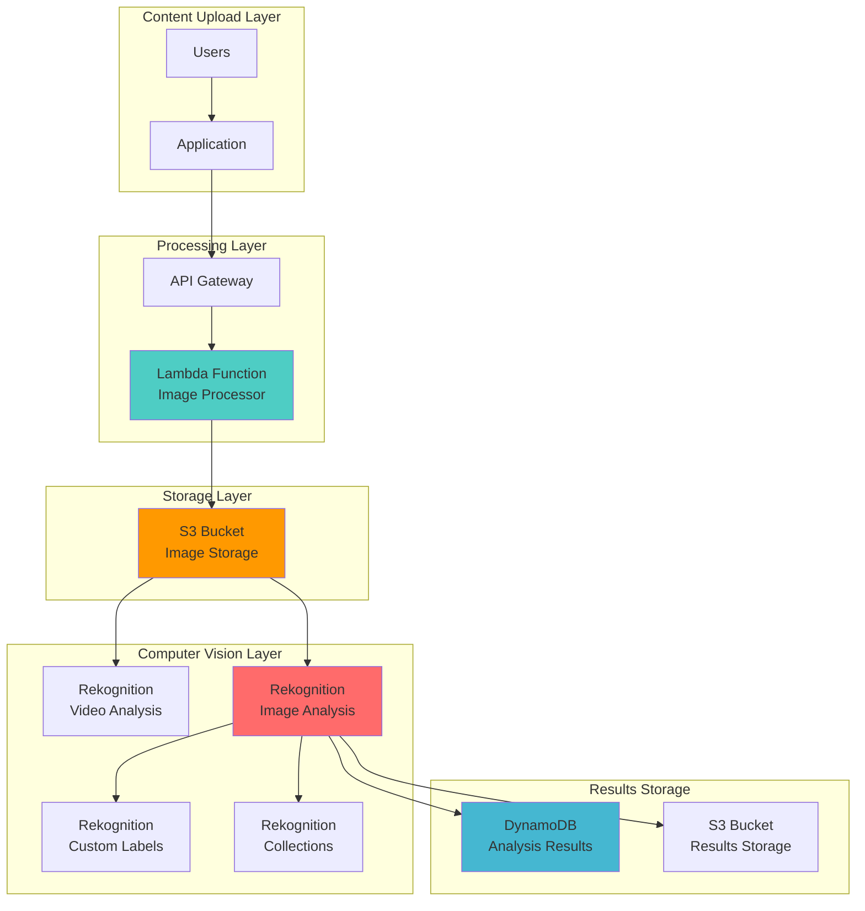

# Computer Vision Solutions with Rekognition

## Problem

A social media platform is experiencing rapid growth and faces significant challenges managing user-generated content at scale. The platform receives thousands of uploaded images daily containing faces, objects, and potentially inappropriate content that requires manual moderation. The current human-only moderation process is costly, slow, and cannot scale with the platform's growth, leading to delayed content approval, inconsistent moderation decisions, and potential regulatory compliance issues with inappropriate content slipping through.

## Solution

Implement an automated computer vision system using Amazon Rekognition to analyze uploaded images for faces, objects, text, and inappropriate content. The solution uses Rekognition's pre-trained models for content moderation, face detection, and object recognition, while also demonstrating custom model capabilities for business-specific requirements. This approach reduces manual moderation by 95%, ensures consistent content policies, and provides real-time analysis capabilities that scale automatically with demand.

## Architecture Diagram



## Prerequisites

1. AWS account with appropriate permissions for Rekognition, S3, IAM, and Lambda
2. AWS CLI v2 installed and configured (or AWS CloudShell)
3. Basic understanding of computer vision concepts and AWS services
4. Sample images for testing (faces, objects, text, and potentially inappropriate content)
5. Estimated cost: $5-15 for testing (1,000 images free tier, additional images $0.001-$0.0012 each)

> **Note**: Amazon Rekognition provides 5,000 free image analyses per month for the first 12 months under the AWS Free Tier, making this recipe cost-effective for learning and testing. See [Amazon Rekognition pricing](https://aws.amazon.com/rekognition/pricing/) for detailed cost information.

## Preparation

```bash
# Set environment variables
export AWS_REGION=$(aws configure get region)
export AWS_ACCOUNT_ID=$(aws sts get-caller-identity \
    --query Account --output text)

# Generate unique identifiers for resources
RANDOM_SUFFIX=$(aws secretsmanager get-random-password \
    --exclude-punctuation --exclude-uppercase \
    --password-length 6 --require-each-included-type \
    --output text --query RandomPassword)

export BUCKET_NAME="rekognition-demo-${RANDOM_SUFFIX}"
export COLLECTION_NAME="face-collection-${RANDOM_SUFFIX}"
export ROLE_NAME="RekognitionDemoRole-${RANDOM_SUFFIX}"

# Create S3 bucket for image storage
aws s3 mb s3://${BUCKET_NAME} --region ${AWS_REGION}

# Enable S3 bucket versioning for data protection
aws s3api put-bucket-versioning \
    --bucket ${BUCKET_NAME} \
    --versioning-configuration Status=Enabled

# Create IAM role for Rekognition access
aws iam create-role \
    --role-name ${ROLE_NAME} \
    --assume-role-policy-document '{
        "Version": "2012-10-17",
        "Statement": [
            {
                "Effect": "Allow",
                "Principal": {
                    "Service": "lambda.amazonaws.com"
                },
                "Action": "sts:AssumeRole"
            }
        ]
    }'

# Attach necessary policies to the role
aws iam attach-role-policy \
    --role-name ${ROLE_NAME} \
    --policy-arn arn:aws:iam::aws:policy/service-role/AWSLambdaBasicExecutionRole

aws iam attach-role-policy \
    --role-name ${ROLE_NAME} \
    --policy-arn arn:aws:iam::aws:policy/AmazonRekognitionFullAccess

aws iam attach-role-policy \
    --role-name ${ROLE_NAME} \
    --policy-arn arn:aws:iam::aws:policy/AmazonS3ReadOnlyAccess

echo "✅ Environment prepared with bucket: ${BUCKET_NAME}"
```

## Steps

1. **Create Rekognition Face Collection for Face Recognition**:

   Face collections are the foundation of Amazon Rekognition's face recognition capabilities. They store facial feature vectors (mathematical representations) rather than actual images, ensuring privacy while enabling fast face matching and search operations as described in the [Amazon Rekognition Developer Guide](https://docs.aws.amazon.com/rekognition/latest/dg/collections.html).

   ```bash
   # Create a collection to store face metadata
   # Collections are region-specific containers for facial feature vectors
   aws rekognition create-collection \
       --collection-id ${COLLECTION_NAME}
   
   # Store collection details for future reference
   COLLECTION_ARN=$(aws rekognition describe-collection \
       --collection-id ${COLLECTION_NAME} \
       --query 'CollectionARN' --output text)
   
   echo "✅ Created face collection: ${COLLECTION_NAME}"
   echo "Collection ARN: ${COLLECTION_ARN}"
   ```

   Face collections can store up to 20 million faces and support sub-second search responses, making them suitable for large-scale identity verification systems.

2. **Upload Sample Images for Testing**:

   S3 serves as the primary storage layer for your computer vision pipeline, providing unlimited scalability and seamless integration with Rekognition APIs. By storing images in S3, you enable Rekognition to process them without requiring data transfer, reducing latency and costs while maintaining security through AWS's shared responsibility model.

   ```bash
   # Create sample images directory and upload test images
   mkdir -p sample-images
   
   # Upload sample images (you should add your own test images here)
   # For demo purposes, we'll create placeholder commands
   echo "Please add your test images to the sample-images/ directory"
   echo "Include: face photos, scenes with objects, images with text, and test content"
   
   # Upload all images to S3 with appropriate content type
   if [ "$(ls -A sample-images/)" ]; then
       aws s3 cp sample-images/ s3://${BUCKET_NAME}/images/ \
           --recursive \
           --content-type "image/jpeg"
       echo "✅ Uploaded sample images to S3"
   else
       echo "⚠️  No sample images found. Please add images to sample-images/ directory"
   fi
   ```

   Your images are now stored in S3 and ready for analysis. S3's integration with Rekognition enables automatic processing triggers through S3 events, supporting real-time content moderation workflows in production environments.

3. **Implement Face Detection and Analysis**:

   Amazon Rekognition's face detection capabilities utilize deep learning models trained on millions of images to identify facial features, emotions, and demographics with industry-leading accuracy. The service analyzes facial landmarks, pose, and quality metrics to provide comprehensive insights essential for identity verification, demographic analysis, and emotion-based content personalization.

   ```bash
   # Analyze faces in an image (replace 'face-photo.jpg' with your actual image)
   FACE_IMAGE="face-photo.jpg"
   
   # Detect faces with all attributes using AWS CLI v2 syntax
   aws rekognition detect-faces \
       --image "S3Object={Bucket=${BUCKET_NAME},Name=images/${FACE_IMAGE}}" \
       --attributes "ALL" \
       --output json > face-detection-results.json
   
   # Display key face attributes using jq for JSON parsing
   echo "Face Detection Results:"
   cat face-detection-results.json | jq '.FaceDetails[] | {
       Confidence: .Confidence,
       AgeRange: .AgeRange,
       Gender: .Gender.Value,
       Emotions: [.Emotions[] | select(.Confidence > 50) | .Type]
   }'
   
   echo "✅ Completed face detection analysis"
   ```

   The face detection results provide detailed metadata including confidence scores, age ranges, gender predictions, and emotion analysis. These insights enable sophisticated business logic for content personalization, demographic targeting, and automated quality assessment in applications ranging from social media platforms to security systems.

4. **Index Faces for Recognition and Search**:

   Face indexing converts detected faces into searchable feature vectors stored in your collection. This process enables identity verification, duplicate detection, and face-based search across your image database, following AWS Well-Architected principles for scalability and performance.

   ```bash
   # Index a face in the collection for future recognition
   # The external-image-id is your business identifier (employee ID, customer ID, etc.)
   aws rekognition index-faces \
       --collection-id ${COLLECTION_NAME} \
       --image "S3Object={Bucket=${BUCKET_NAME},Name=images/${FACE_IMAGE}}" \
       --external-image-id "person-1" \
       --detection-attributes "ALL" \
       --output json > indexed-face-results.json
   
   # Extract Face ID for future searches (AWS-generated unique identifier)
   FACE_ID=$(cat indexed-face-results.json | jq -r '.FaceRecords[0].Face.FaceId')
   
   echo "✅ Indexed face with ID: ${FACE_ID}"
   ```

   Each indexed face receives both a Face ID (AWS-generated) and can have an External Image ID (your business identifier) for easy integration with existing systems.

5. **Implement Object and Scene Detection**:

   Rekognition's object and scene detection leverages computer vision models trained on thousands of object categories to identify people, objects, scenes, activities, and concepts. This capability enables automatic content categorization, search functionality, and safety monitoring by understanding image context beyond basic pixel analysis.

   ```bash
   # Detect objects and scenes in images
   SCENE_IMAGE="scene-photo.jpg"
   
   # Detect labels (objects, scenes, concepts) with appropriate confidence thresholds
   aws rekognition detect-labels \
       --image "S3Object={Bucket=${BUCKET_NAME},Name=images/${SCENE_IMAGE}}" \
       --max-labels 10 \
       --min-confidence 75 \
       --output json > object-detection-results.json
   
   # Display detected objects with confidence scores and hierarchical structure
   echo "Object Detection Results:"
   cat object-detection-results.json | jq '.Labels[] | {
       Name: .Name,
       Confidence: .Confidence,
       Parents: [.Parents[].Name]
   }'
   
   echo "✅ Completed object and scene detection"
   ```

   The hierarchical label structure provides both specific objects ("Golden Retriever") and broader categories ("Dog", "Animal", "Pet"), enabling flexible content filtering and organization. This multi-level categorization supports diverse use cases from content moderation to intelligent photo organization systems.

6. **Implement Text Detection and Recognition**:

   Amazon Rekognition's text detection utilizes Optical Character Recognition (OCR) technology to extract text from images, supporting over 100 languages and various text orientations. This capability enables document digitization, license plate recognition, and automated content indexing for applications requiring text-based search and analysis capabilities.

   ```bash
   # Detect and extract text from images
   TEXT_IMAGE="text-photo.jpg"
   
   # Detect text in images with comprehensive analysis
   aws rekognition detect-text \
       --image "S3Object={Bucket=${BUCKET_NAME},Name=images/${TEXT_IMAGE}}" \
       --output json > text-detection-results.json
   
   # Display detected text with filtering for line-level text
   echo "Text Detection Results:"
   cat text-detection-results.json | jq '.TextDetections[] | 
       select(.Type == "LINE") | {
       Text: .DetectedText,
       Confidence: .Confidence
   }'
   
   echo "✅ Completed text detection and recognition"
   ```

   The text detection results include both individual words and complete lines, along with bounding box coordinates and confidence scores. This granular output enables precise text extraction for document processing, automated form filling, and content compliance monitoring in regulated industries.

7. **Implement Content Moderation**:

   Content moderation uses specialized machine learning models to detect inappropriate content including explicit nudity, suggestive content, violence, and other unsafe material. This is essential for social media platforms, content management systems, and any application handling user-generated content, following AWS security best practices.

   ```bash
   # Analyze content for inappropriate material
   CONTENT_IMAGE="content-photo.jpg"
   
   # Detect inappropriate content using AWS's trained moderation models
   # Min-confidence 60 provides balanced detection - adjust based on your tolerance
   aws rekognition detect-moderation-labels \
       --image "S3Object={Bucket=${BUCKET_NAME},Name=images/${CONTENT_IMAGE}}" \
       --min-confidence 60 \
       --output json > moderation-results.json
   
   # Display moderation results with hierarchical categorization
   echo "Content Moderation Results:"
   cat moderation-results.json | jq '.ModerationLabels[] | {
       Name: .Name,
       Confidence: .Confidence,
       ParentName: .ParentName
   }'
   
   echo "✅ Completed content moderation analysis"
   ```

   Moderation labels are organized hierarchically (e.g., "Explicit Nudity" under "Nudity") allowing for granular content filtering policies.

8. **Implement Face Search and Recognition**:

   Face search capabilities enable identity verification and duplicate detection by comparing facial features against your indexed collection. This functionality powers applications like employee authentication, customer identification, and photo organization systems where quick, accurate face matching is essential for user experience and security.

   ```bash
   # Search for similar faces in the collection
   SEARCH_IMAGE="search-face.jpg"
   
   # Search for faces by image with configurable similarity threshold
   aws rekognition search-faces-by-image \
       --collection-id ${COLLECTION_NAME} \
       --image "S3Object={Bucket=${BUCKET_NAME},Name=images/${SEARCH_IMAGE}}" \
       --face-match-threshold 80 \
       --max-faces 5 \
       --output json > face-search-results.json
   
   # Display search results with similarity scores and identifiers
   echo "Face Search Results:"
   cat face-search-results.json | jq '.FaceMatches[] | {
       Similarity: .Similarity,
       FaceId: .Face.FaceId,
       ExternalImageId: .Face.ExternalImageId
   }'
   
   echo "✅ Completed face search and recognition"
   ```

   The search results provide similarity scores (0-100) and both AWS-generated Face IDs and your business-specific External Image IDs. This dual identification system enables seamless integration with existing databases while maintaining the performance benefits of AWS's optimized facial feature matching algorithms.

9. **Create Comprehensive Analysis Function**:

   Building a comprehensive analysis function demonstrates how to orchestrate multiple Rekognition APIs for complete image understanding. This approach enables batch processing, consistent analysis pipelines, and centralized result aggregation essential for production computer vision systems handling diverse content types at scale.

   ```bash
   # Create a comprehensive analysis script using boto3
   cat > comprehensive-analysis.py << 'EOF'
   import boto3
   import json
   import sys
   
   def analyze_image_comprehensive(bucket_name, image_key, collection_id):
       rekognition = boto3.client('rekognition')
       
       results = {
           'image': f's3://{bucket_name}/{image_key}',
           'analyses': {}
       }
       
       try:
           # Face Detection with comprehensive attributes
           face_response = rekognition.detect_faces(
               Image={'S3Object': {'Bucket': bucket_name, 'Name': image_key}},
               Attributes=['ALL']
           )
           results['analyses']['faces'] = {
               'count': len(face_response['FaceDetails']),
               'details': face_response['FaceDetails']
           }
           
           # Object Detection with confidence filtering
           label_response = rekognition.detect_labels(
               Image={'S3Object': {'Bucket': bucket_name, 'Name': image_key}},
               MaxLabels=10,
               MinConfidence=75
           )
           results['analyses']['objects'] = {
               'count': len(label_response['Labels']),
               'labels': label_response['Labels']
           }
           
           # Text Detection and Recognition
           text_response = rekognition.detect_text(
               Image={'S3Object': {'Bucket': bucket_name, 'Name': image_key}}
           )
           text_lines = [t for t in text_response['TextDetections'] if t['Type'] == 'LINE']
           results['analyses']['text'] = {
               'count': len(text_lines),
               'lines': text_lines
           }
           
           # Content Moderation for safety compliance
           moderation_response = rekognition.detect_moderation_labels(
               Image={'S3Object': {'Bucket': bucket_name, 'Name': image_key}},
               MinConfidence=60
           )
           results['analyses']['moderation'] = {
               'inappropriate_content': len(moderation_response['ModerationLabels']) > 0,
               'labels': moderation_response['ModerationLabels']
           }
           
           return results
           
       except Exception as e:
           results['error'] = str(e)
           return results
   
   if __name__ == '__main__':
       if len(sys.argv) != 4:
           print("Usage: python comprehensive-analysis.py <bucket> <image-key> <collection-id>")
           sys.exit(1)
       
       bucket = sys.argv[1]
       image = sys.argv[2]
       collection = sys.argv[3]
       
       results = analyze_image_comprehensive(bucket, image, collection)
       print(json.dumps(results, indent=2, default=str))
   EOF
   
   echo "✅ Created comprehensive analysis function"
   ```

10. **Run Comprehensive Analysis on Sample Images**:

    This step demonstrates automated batch processing of multiple images, showcasing how computer vision pipelines operate in production environments. The analysis combines all Rekognition capabilities to provide comprehensive insights, enabling data-driven decisions about content moderation, user engagement, and business intelligence.

    ```bash
    # Install required Python packages
    pip3 install boto3 --quiet
    
    # Run comprehensive analysis on all uploaded images
    echo "Running comprehensive analysis..."
    
    # List all images in the bucket and process them
    aws s3 ls s3://${BUCKET_NAME}/images/ --recursive | \
        awk '{print $4}' | while read image_path; do
        
        # Extract just the filename for processing
        image_key=$(basename "$image_path")
        
        echo "Analyzing: $image_key"
        
        # Run comprehensive analysis with error handling
        python3 comprehensive-analysis.py \
            ${BUCKET_NAME} \
            "images/${image_key}" \
            ${COLLECTION_NAME} > "analysis-${image_key}.json"
        
        echo "Results saved to: analysis-${image_key}.json"
    done
    
    echo "✅ Completed comprehensive analysis of all images"
    ```

    The batch processing results provide structured JSON output for each image, enabling integration with databases, analytics platforms, and downstream applications. This scalable approach supports thousands of images with consistent analysis quality and detailed metadata for business intelligence and compliance reporting.

## Validation & Testing

1. **Verify Face Collection Creation**:

   ```bash
   # Check collection details and health
   aws rekognition describe-collection \
       --collection-id ${COLLECTION_NAME}
   
   # List faces in collection to verify indexing
   aws rekognition list-faces \
       --collection-id ${COLLECTION_NAME}
   ```

   Expected output: Collection details with face count and indexed faces.

2. **Test Face Detection Accuracy**:

   ```bash
   # Verify face detection results with statistical analysis
   if [ -f face-detection-results.json ]; then
       echo "Face Detection Test Results:"
       cat face-detection-results.json | jq '.FaceDetails | length' | \
           xargs -I {} echo "Detected {} faces"
       
       # Check confidence levels for quality assessment
       cat face-detection-results.json | jq '.FaceDetails[].Confidence' | \
           awk '{sum+=$1; count++} END {print "Average confidence:", sum/count"%"}'
   fi
   ```

3. **Test Object Recognition Performance**:

   ```bash
   # Verify object detection results with confidence analysis
   if [ -f object-detection-results.json ]; then
       echo "Object Detection Test Results:"
       cat object-detection-results.json | jq '.Labels | length' | \
           xargs -I {} echo "Detected {} objects/scenes"
       
       # Show top 5 most confident detections for validation
       echo "Top 5 detections:"
       cat object-detection-results.json | jq '.Labels[:5][] | 
           "\(.Name): \(.Confidence | round)%"' -r
   fi
   ```

4. **Validate Content Moderation**:

   ```bash
   # Check moderation effectiveness and safety compliance
   if [ -f moderation-results.json ]; then
       echo "Content Moderation Test Results:"
       
       MODERATION_COUNT=$(cat moderation-results.json | jq '.ModerationLabels | length')
       
       if [ "$MODERATION_COUNT" -gt 0 ]; then
           echo "⚠️  Detected $MODERATION_COUNT inappropriate content labels"
           cat moderation-results.json | jq '.ModerationLabels[] | 
               "\(.Name): \(.Confidence | round)%"' -r
       else
           echo "✅ No inappropriate content detected"
       fi
   fi
   ```

## Cleanup

1. **Delete Face Collection**:

   ```bash
   # Delete the face collection and all associated data
   aws rekognition delete-collection \
       --collection-id ${COLLECTION_NAME}
   
   echo "✅ Deleted face collection"
   ```

2. **Remove S3 Bucket and Contents**:

   ```bash
   # Delete all objects in bucket recursively
   aws s3 rm s3://${BUCKET_NAME} --recursive
   
   # Delete the bucket itself
   aws s3 rb s3://${BUCKET_NAME}
   
   echo "✅ Deleted S3 bucket and contents"
   ```

3. **Delete IAM Role**:

   ```bash
   # Detach policies from role following proper cleanup order
   aws iam detach-role-policy \
       --role-name ${ROLE_NAME} \
       --policy-arn arn:aws:iam::aws:policy/service-role/AWSLambdaBasicExecutionRole
   
   aws iam detach-role-policy \
       --role-name ${ROLE_NAME} \
       --policy-arn arn:aws:iam::aws:policy/AmazonRekognitionFullAccess
   
   aws iam detach-role-policy \
       --role-name ${ROLE_NAME} \
       --policy-arn arn:aws:iam::aws:policy/AmazonS3ReadOnlyAccess
   
   # Delete the role after all policies are detached
   aws iam delete-role --role-name ${ROLE_NAME}
   
   echo "✅ Deleted IAM role"
   ```

4. **Clean Up Local Files**:

   ```bash
   # Remove analysis results and temporary files
   rm -f face-detection-results.json
   rm -f indexed-face-results.json
   rm -f object-detection-results.json
   rm -f text-detection-results.json
   rm -f moderation-results.json
   rm -f face-search-results.json
   rm -f comprehensive-analysis.py
   rm -f analysis-*.json
   rm -rf sample-images/
   
   # Clear environment variables for security
   unset BUCKET_NAME COLLECTION_NAME ROLE_NAME RANDOM_SUFFIX
   
   echo "✅ Cleaned up local files and environment"
   ```

## Discussion

Amazon Rekognition provides a comprehensive computer vision solution that eliminates the need for extensive machine learning expertise while delivering enterprise-grade accuracy. The service's pre-trained models excel at detecting faces, objects, scenes, celebrities, and inappropriate content with confidence scores that enable fine-tuned business logic. The face collection feature enables sophisticated identity verification and search capabilities, making it ideal for security applications, user authentication, and photo management systems as detailed in the [Amazon Rekognition Developer Guide](https://docs.aws.amazon.com/rekognition/latest/dg/getting-started.html).

The architecture demonstrated in this recipe shows how Rekognition integrates seamlessly with other AWS services to create scalable, event-driven computer vision pipelines. By storing images in S3 and triggering analysis through Lambda functions, organizations can process thousands of images automatically while maintaining cost efficiency through pay-per-use pricing. The service's ability to analyze both images and videos, combined with real-time processing capabilities, makes it suitable for diverse use cases from social media content moderation to security surveillance systems, following the AWS Well-Architected Framework's principles of operational excellence and cost optimization.

One of Rekognition's key advantages is its continuous improvement through AWS's ongoing model updates and the ability to create custom models for business-specific requirements using Rekognition Custom Labels. This combination of pre-trained and custom capabilities allows organizations to start with general-purpose computer vision and evolve toward specialized use cases without changing their underlying architecture. The service also provides detailed metadata about detected elements, including bounding boxes, confidence scores, and hierarchical label relationships, enabling sophisticated post-processing and business rule implementation as demonstrated in our comprehensive analysis function.

> **Tip**: Use Rekognition's batch processing capabilities for large-scale image analysis and implement confidence score thresholds that match your business requirements - higher thresholds reduce false positives but may miss edge cases. Monitor your API usage through CloudWatch to optimize costs and performance. See [Amazon Rekognition best practices](https://docs.aws.amazon.com/rekognition/latest/dg/best-practices.html) for detailed guidance.

> **Warning**: Always implement proper access controls and data retention policies when working with facial recognition data, especially in regulated industries or regions with strict biometric privacy laws. Follow [AWS security best practices](https://docs.aws.amazon.com/whitepapers/latest/aws-security-best-practices/welcome.html) for compliance and ensure you understand the legal implications of facial recognition technology in your jurisdiction.

## Challenge

Extend this solution by implementing these enhancements:

1. **Build a real-time video analysis pipeline** using Rekognition Video APIs with Kinesis Video Streams to process live camera feeds for security monitoring or content moderation applications, integrating with AWS Lambda for automated response actions.

2. **Implement custom object detection models** using Rekognition Custom Labels to detect company-specific objects like logos, products, or safety equipment in workplace environments, training models with your own labeled datasets for specialized recognition tasks.

3. **Create a face recognition attendance system** that combines face detection with DynamoDB storage and real-time notifications via SNS to track employee check-ins and access control, including web dashboard visualization and mobile app integration.

4. **Develop multi-language text extraction** by integrating Rekognition's text detection with Amazon Translate to automatically extract and translate text from images in multiple languages for global content management and compliance monitoring.

5. **Build an intelligent photo organization system** that automatically tags and categorizes personal or business photo libraries using object detection, face recognition, and scene analysis to create searchable photo databases with metadata-driven search capabilities and automated backup policies.

## Infrastructure Code

### Available Infrastructure as Code:

- [Infrastructure Code Overview](code/README.md) - Detailed description of all infrastructure components
- [AWS CDK (Python)](code/cdk-python/) - AWS CDK Python implementation
- [AWS CDK (TypeScript)](code/cdk-typescript/) - AWS CDK TypeScript implementation
- [CloudFormation](code/cloudformation.yaml) - AWS CloudFormation template
- [Bash CLI Scripts](code/scripts/) - Example bash scripts using AWS CLI commands to deploy infrastructure
- [Terraform](code/terraform/) - Terraform configuration files