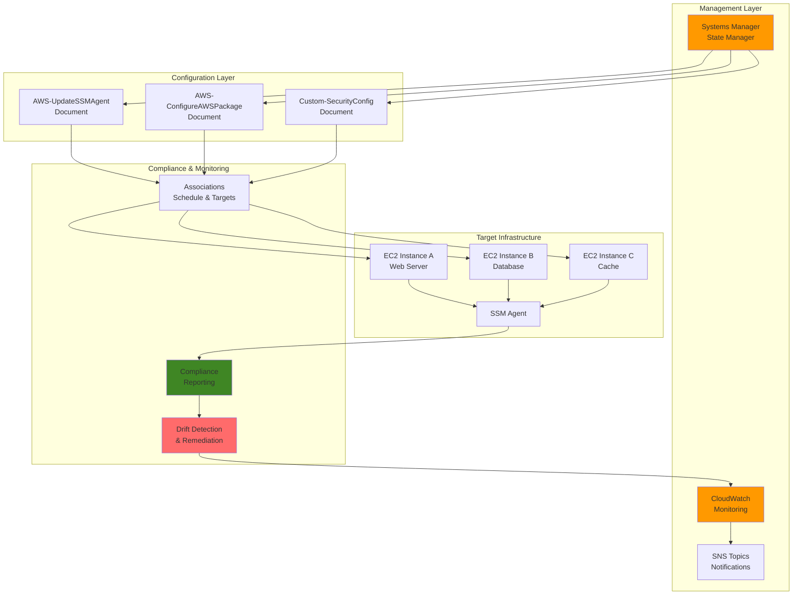

# Configuration Management with Systems Manager

## Problem

Enterprise organizations struggle with configuration drift across their EC2 infrastructure, where instances gradually deviate from their intended configuration state due to manual changes, software updates, or missed security patches. This drift leads to compliance violations, security vulnerabilities, and inconsistent application behavior. Traditional configuration management tools require significant overhead to deploy and maintain, while manual processes are error-prone and don't scale effectively across hundreds or thousands of instances.

## Solution

AWS Systems Manager State Manager provides a scalable, serverless approach to configuration management that automatically enforces desired states across your EC2 fleet. By creating associations between managed instances and configuration documents, State Manager continuously monitors and corrects configuration drift, ensuring compliance and security standards are maintained. This solution integrates seamlessly with existing AWS services for monitoring, alerting, and reporting on configuration compliance.

## Architecture Diagram



## Prerequisites

1. AWS account with appropriate permissions for Systems Manager, EC2, CloudWatch, and IAM
2. AWS CLI v2 installed and configured (or AWS CloudShell)
3. Understanding of EC2 instances and basic systems administration
4. Knowledge of AWS IAM roles and policies
5. At least 2 EC2 instances running with SSM Agent installed
6. Estimated cost: $5-15/month for CloudWatch logs and SNS notifications

> **Note**: SSM Agent is pre-installed on Amazon Linux 2023, Amazon Linux 2, Windows Server 2016/2019/2022, and Ubuntu 18.04/20.04/22.04 AMIs.

## Preparation

```bash
# Set environment variables
export AWS_REGION=$(aws configure get region)
export AWS_ACCOUNT_ID=$(aws sts get-caller-identity \
    --query Account --output text)

# Generate unique identifiers for resources
RANDOM_SUFFIX=$(aws secretsmanager get-random-password \
    --exclude-punctuation --exclude-uppercase \
    --password-length 6 --require-each-included-type \
    --output text --query RandomPassword)

# Set resource names
export ROLE_NAME="SSMStateManagerRole-${RANDOM_SUFFIX}"
export POLICY_NAME="SSMStateManagerPolicy-${RANDOM_SUFFIX}"
export ASSOCIATION_NAME="ConfigManagement-${RANDOM_SUFFIX}"
export SNS_TOPIC_NAME="config-drift-alerts-${RANDOM_SUFFIX}"
export CLOUDWATCH_LOG_GROUP="/aws/ssm/state-manager-${RANDOM_SUFFIX}"

# Create CloudWatch log group for State Manager
aws logs create-log-group \
    --log-group-name "${CLOUDWATCH_LOG_GROUP}" \
    --tags Key=Purpose,Value=StateManagerDemo \
           Key=Environment,Value=Demo

echo "✅ CloudWatch log group created: ${CLOUDWATCH_LOG_GROUP}"

# Create SNS topic for notifications
export SNS_TOPIC_ARN=$(aws sns create-topic \
    --name "${SNS_TOPIC_NAME}" \
    --attributes DisplayName="Configuration Drift Alerts" \
    --query TopicArn --output text)

echo "✅ SNS topic created: ${SNS_TOPIC_ARN}"

# Subscribe to SNS topic (replace with your email)
aws sns subscribe \
    --topic-arn "${SNS_TOPIC_ARN}" \
    --protocol email \
    --notification-endpoint "your-email@example.com"

echo "✅ SNS subscription created (check your email to confirm)"
```

## Steps

1. **Create IAM Role for State Manager**:

   AWS Systems Manager State Manager requires specific IAM permissions to manage configurations across your EC2 fleet. This step creates an IAM role with a trust policy that allows only the Systems Manager service to assume it, following the principle of least privilege. The role serves as the security foundation for all State Manager operations, ensuring that configuration management activities are performed with appropriate authorization while maintaining security isolation from other AWS services.

   ```bash
   # Create trust policy for State Manager role
   cat > state-manager-trust-policy.json << 'EOF'
   {
       "Version": "2012-10-17",
       "Statement": [
           {
               "Effect": "Allow",
               "Principal": {
                   "Service": "ssm.amazonaws.com"
               },
               "Action": "sts:AssumeRole"
           }
       ]
   }
   EOF
   
   # Create IAM role
   aws iam create-role \
       --role-name "${ROLE_NAME}" \
       --assume-role-policy-document file://state-manager-trust-policy.json \
       --description "Role for Systems Manager State Manager operations"
   
   # Get role ARN
   export ROLE_ARN=$(aws iam get-role \
       --role-name "${ROLE_NAME}" \
       --query Role.Arn --output text)
   
   echo "✅ IAM role created: ${ROLE_ARN}"
   ```

   The trust policy restricts role assumption to only the Systems Manager service, preventing unauthorized access while enabling the service to manage your infrastructure securely.

2. **Create and Attach IAM Policy**:

   This step defines the specific permissions required for State Manager to perform configuration management tasks. The policy follows AWS security best practices by granting only the minimum permissions necessary for the service to function effectively, including access to Systems Manager APIs, EC2 instance metadata, CloudWatch logging, and SNS notifications.

   ```bash
   # Create custom policy for State Manager
   cat > state-manager-policy.json << EOF
   {
       "Version": "2012-10-17",
       "Statement": [
           {
               "Effect": "Allow",
               "Action": [
                   "ssm:CreateAssociation",
                   "ssm:DescribeAssociation*",
                   "ssm:GetAutomationExecution",
                   "ssm:ListAssociations",
                   "ssm:ListDocuments",
                   "ssm:SendCommand",
                   "ssm:StartAutomationExecution",
                   "ssm:DescribeInstanceInformation",
                   "ssm:DescribeDocumentParameters",
                   "ssm:ListCommandInvocations",
                   "ssm:StartAssociationsOnce"
               ],
               "Resource": "*"
           },
           {
               "Effect": "Allow",
               "Action": [
                   "ec2:DescribeInstances",
                   "ec2:DescribeInstanceAttribute",
                   "ec2:DescribeImages",
                   "ec2:DescribeSnapshots",
                   "ec2:DescribeVolumes"
               ],
               "Resource": "*"
           },
           {
               "Effect": "Allow",
               "Action": [
                   "cloudwatch:PutMetricData",
                   "logs:CreateLogGroup",
                   "logs:CreateLogStream",
                   "logs:PutLogEvents"
               ],
               "Resource": "*"
           },
           {
               "Effect": "Allow",
               "Action": [
                   "sns:Publish"
               ],
               "Resource": "${SNS_TOPIC_ARN}"
           }
       ]
   }
   EOF
   
   # Create and attach policy
   aws iam create-policy \
       --policy-name "${POLICY_NAME}" \
       --policy-document file://state-manager-policy.json \
       --description "Policy for State Manager operations"
   
   # Get policy ARN
   export POLICY_ARN=$(aws iam list-policies \
       --scope Local \
       --query "Policies[?PolicyName=='${POLICY_NAME}'].Arn" \
       --output text)
   
   # Attach policy to role
   aws iam attach-role-policy \
       --role-name "${ROLE_NAME}" \
       --policy-arn "${POLICY_ARN}"
   
   # Attach AWS managed policy for SSM
   aws iam attach-role-policy \
       --role-name "${ROLE_NAME}" \
       --policy-arn "arn:aws:iam::aws:policy/AmazonSSMManagedInstanceCore"
   
   echo "✅ IAM policies attached to role"
   ```

3. **Create Custom Security Configuration Document**:

   Systems Manager documents define the specific configuration changes to apply to instances. This step creates a custom document that implements security hardening measures, including firewall configuration and SSH security settings. The document uses conditional logic to handle different Linux distributions and includes error handling to ensure reliable execution across diverse environments.

   ```bash
   # Create custom SSM document for security configuration
   cat > security-config-document.json << 'EOF'
   {
       "schemaVersion": "2.2",
       "description": "Configure security settings on Linux instances",
       "parameters": {
           "enableFirewall": {
               "type": "String",
               "description": "Enable firewall",
               "default": "true",
               "allowedValues": ["true", "false"]
           },
           "disableRootLogin": {
               "type": "String",
               "description": "Disable root SSH login",
               "default": "true",
               "allowedValues": ["true", "false"]
           }
       },
       "mainSteps": [
           {
               "action": "aws:runShellScript",
               "name": "configureFirewall",
               "precondition": {
                   "StringEquals": ["platformType", "Linux"]
               },
               "inputs": {
                   "runCommand": [
                       "#!/bin/bash",
                       "if [ '{{ enableFirewall }}' == 'true' ]; then",
                       "  if command -v ufw &> /dev/null; then",
                       "    ufw --force enable",
                       "    echo 'UFW firewall enabled'",
                       "  elif command -v firewall-cmd &> /dev/null; then",
                       "    systemctl enable firewalld",
                       "    systemctl start firewalld",
                       "    echo 'Firewalld enabled'",
                       "  fi",
                       "fi"
                   ]
               }
           },
           {
               "action": "aws:runShellScript",
               "name": "configureSshSecurity",
               "precondition": {
                   "StringEquals": ["platformType", "Linux"]
               },
               "inputs": {
                   "runCommand": [
                       "#!/bin/bash",
                       "if [ '{{ disableRootLogin }}' == 'true' ]; then",
                       "  sed -i 's/^#\\?PermitRootLogin.*/PermitRootLogin no/' /etc/ssh/sshd_config",
                       "  if systemctl is-active --quiet sshd; then",
                       "    systemctl reload sshd",
                       "  fi",
                       "  echo 'Root SSH login disabled'",
                       "fi"
                   ]
               }
           }
       ]
   }
   EOF
   
   # Create the document
   aws ssm create-document \
       --content file://security-config-document.json \
       --name "Custom-SecurityConfiguration-${RANDOM_SUFFIX}" \
       --document-type "Command" \
       --document-format JSON \
       --tags Key=Purpose,Value=StateManagerDemo
   
   export SECURITY_DOC_NAME="Custom-SecurityConfiguration-${RANDOM_SUFFIX}"
   
   echo "✅ Custom security configuration document created: ${SECURITY_DOC_NAME}"
   ```

   > **Warning**: This document modifies system security settings. Test thoroughly in non-production environments before deploying to production instances. See [SSM document best practices](https://docs.aws.amazon.com/systems-manager/latest/userguide/sysman-ssm-docs.html) for guidance.

4. **Create State Manager Association for SSM Agent Updates**:

   State Manager associations define the relationship between configuration documents and target instances, establishing automated configuration management workflows. This association ensures that SSM Agent stays updated across all managed instances, which is critical for security and functionality. The AWS-UpdateSSMAgent document handles updates safely with built-in rollback capabilities, while the weekly schedule balances security with operational stability by avoiding frequent disruptions.

   ```bash
   # Create association to keep SSM Agent updated
   export AGENT_ASSOCIATION_ID=$(aws ssm create-association \
       --name "AWS-UpdateSSMAgent" \
       --targets Key=tag:Environment,Values=Demo \
       --schedule-expression "rate(7 days)" \
       --association-name "${ASSOCIATION_NAME}-SSMAgent" \
       --query AssociationDescription.AssociationId --output text)
   
   echo "✅ SSM Agent update association created: ${AGENT_ASSOCIATION_ID}"
   ```

   This association runs weekly to ensure your SSM Agent remains current with the latest security updates and feature improvements, maintaining the communication channel between your instances and Systems Manager.

5. **Create State Manager Association for Security Configuration**:

   This association applies your custom security configuration to targeted instances on a scheduled basis. By setting the compliance severity to CRITICAL, you ensure that security configuration violations receive appropriate priority in monitoring and alerting systems. The daily schedule provides regular compliance checking while allowing sufficient time for manual interventions if needed.

   ```bash
   # Create association for security configuration
   export SECURITY_ASSOCIATION_ID=$(aws ssm create-association \
       --name "${SECURITY_DOC_NAME}" \
       --targets Key=tag:Environment,Values=Demo \
       --schedule-expression "rate(1 day)" \
       --association-name "${ASSOCIATION_NAME}-Security" \
       --parameters enableFirewall=true,disableRootLogin=true \
       --compliance-severity CRITICAL \
       --query AssociationDescription.AssociationId --output text)
   
   echo "✅ Security configuration association created: ${SECURITY_ASSOCIATION_ID}"
   ```

6. **Create Configuration Drift Monitoring**:

   CloudWatch alarms provide real-time monitoring of your configuration management system's health and effectiveness. These alarms monitor key metrics including association execution failures and compliance violations, triggering immediate notifications when configuration issues occur. This proactive monitoring enables rapid response to configuration drift and helps maintain system reliability.

   ```bash
   # Create CloudWatch alarm for association failures
   aws cloudwatch put-metric-alarm \
       --alarm-name "SSM-Association-Failures-${RANDOM_SUFFIX}" \
       --alarm-description "Monitor SSM association failures" \
       --metric-name "AssociationExecutionsFailed" \
       --namespace "AWS/SSM" \
       --statistic Sum \
       --period 300 \
       --threshold 1 \
       --comparison-operator GreaterThanOrEqualToThreshold \
       --evaluation-periods 1 \
       --alarm-actions "${SNS_TOPIC_ARN}" \
       --dimensions Name=AssociationName,Value="${ASSOCIATION_NAME}-Security"
   
   # Create CloudWatch alarm for compliance violations
   aws cloudwatch put-metric-alarm \
       --alarm-name "SSM-Compliance-Violations-${RANDOM_SUFFIX}" \
       --alarm-description "Monitor compliance violations" \
       --metric-name "ComplianceByConfigRule" \
       --namespace "AWS/SSM" \
       --statistic Sum \
       --period 300 \
       --threshold 1 \
       --comparison-operator GreaterThanOrEqualToThreshold \
       --evaluation-periods 1 \
       --alarm-actions "${SNS_TOPIC_ARN}"
   
   echo "✅ CloudWatch alarms created for monitoring"
   ```

7. **Set Up Automated Remediation Workflow**:

   Automation documents enable self-healing infrastructure by automatically responding to configuration drift and association failures. This remediation workflow demonstrates how to create automated responses to configuration issues, including rerunning failed associations and sending notifications about remediation activities. The automation reduces manual intervention requirements and improves system reliability.

   ```bash
   # Create automation document for remediation
   cat > remediation-document.json << EOF
   {
       "schemaVersion": "0.3",
       "description": "Automated remediation for configuration drift",
       "assumeRole": "{{ AutomationAssumeRole }}",
       "parameters": {
           "AutomationAssumeRole": {
               "type": "String",
               "description": "The ARN of the role for automation"
           },
           "InstanceId": {
               "type": "String",
               "description": "The ID of the non-compliant instance"
           },
           "AssociationId": {
               "type": "String",
               "description": "The ID of the failed association"
           }
       },
       "mainSteps": [
           {
               "name": "RerunAssociation",
               "action": "aws:executeAwsApi",
               "inputs": {
                   "Service": "ssm",
                   "Api": "StartAssociationsOnce",
                   "AssociationIds": ["{{ AssociationId }}"]
               }
           },
           {
               "name": "WaitForCompletion",
               "action": "aws:waitForAwsResourceProperty",
               "inputs": {
                   "Service": "ssm",
                   "Api": "DescribeAssociationExecutions",
                   "AssociationId": "{{ AssociationId }}",
                   "PropertySelector": "$.AssociationExecutions[0].Status",
                   "DesiredValues": ["Success"]
               },
               "timeoutSeconds": 300
           },
           {
               "name": "SendNotification",
               "action": "aws:executeAwsApi",
               "inputs": {
                   "Service": "sns",
                   "Api": "Publish",
                   "TopicArn": "${SNS_TOPIC_ARN}",
                   "Message": "Configuration drift remediation completed for instance {{ InstanceId }}"
               }
           }
       ]
   }
   EOF
   
   # Create automation document
   aws ssm create-document \
       --content file://remediation-document.json \
       --name "AutoRemediation-${RANDOM_SUFFIX}" \
       --document-type "Automation" \
       --document-format JSON \
       --tags Key=Purpose,Value=StateManagerDemo
   
   export REMEDIATION_DOC_NAME="AutoRemediation-${RANDOM_SUFFIX}"
   
   echo "✅ Automated remediation document created: ${REMEDIATION_DOC_NAME}"
   ```

8. **Create Compliance Dashboard**:

   CloudWatch dashboards provide centralized visualization of your configuration management system's performance and compliance status. This dashboard displays key metrics including association execution success rates and compliance status, enabling quick identification of trends and issues across your infrastructure fleet.

   ```bash
   # Create CloudWatch dashboard
   cat > dashboard-config.json << EOF
   {
       "widgets": [
           {
               "type": "metric",
               "x": 0,
               "y": 0,
               "width": 12,
               "height": 6,
               "properties": {
                   "metrics": [
                       ["AWS/SSM", "AssociationExecutionsSucceeded", "AssociationName", "${ASSOCIATION_NAME}-Security"],
                       [".", "AssociationExecutionsFailed", ".", "."]
                   ],
                   "period": 300,
                   "stat": "Sum",
                   "region": "${AWS_REGION}",
                   "title": "Association Execution Status"
               }
           },
           {
               "type": "metric",
               "x": 12,
               "y": 0,
               "width": 12,
               "height": 6,
               "properties": {
                   "metrics": [
                       ["AWS/SSM", "ComplianceByConfigRule", "RuleName", "${ASSOCIATION_NAME}-Security", "ComplianceType", "Association"]
                   ],
                   "period": 300,
                   "stat": "Sum",
                   "region": "${AWS_REGION}",
                   "title": "Compliance Status"
               }
           }
       ]
   }
   EOF
   
   # Create dashboard
   aws cloudwatch put-dashboard \
       --dashboard-name "SSM-StateManager-${RANDOM_SUFFIX}" \
       --dashboard-body file://dashboard-config.json
   
   echo "✅ CloudWatch dashboard created: SSM-StateManager-${RANDOM_SUFFIX}"
   ```

9. **Test Configuration Drift Detection**:

   Testing validates that your configuration management system responds correctly to drift and can successfully remediate configuration deviations. The `start-associations-once` command triggers immediate execution of associations, bypassing scheduled intervals for testing purposes. This immediate feedback allows you to verify system functionality and identify any configuration issues before they impact production operations.

   ```bash
   # Trigger association execution immediately for testing
   aws ssm start-associations-once \
       --association-ids "${SECURITY_ASSOCIATION_ID}"
   
   # Monitor association execution
   aws ssm describe-association-executions \
       --association-id "${SECURITY_ASSOCIATION_ID}" \
       --max-results 5 \
       --query 'AssociationExecutions[0].{Status:Status,CreatedTime:CreatedTime,ExecutionId:ExecutionId}'
   
   echo "✅ Association execution started for testing"
   ```

   The association execution provides immediate feedback on your configuration management system's effectiveness, allowing you to identify and resolve any issues before they impact production operations.

10. **Configure Compliance Reporting**:

    Compliance reporting provides ongoing visibility into the configuration state of your infrastructure, enabling audit trails and governance oversight. This step demonstrates how to generate compliance reports and set up automated reporting workflows that can be integrated with broader compliance management systems.

    ```bash
    # Create compliance summary report
    aws ssm list-compliance-items \
        --resource-types "ManagedInstance" \
        --filters Key=ComplianceType,Values=Association \
        --query 'ComplianceItems[*].{ResourceId:ResourceId,Status:Status,ComplianceType:ComplianceType,Title:Title}' \
        --output table
    
    # Set up periodic compliance reports
    cat > compliance-report.json << 'EOF'
    {
        "schemaVersion": "0.3",
        "description": "Generate compliance report",
        "mainSteps": [
            {
                "name": "GenerateReport",
                "action": "aws:executeAwsApi",
                "inputs": {
                    "Service": "ssm",
                    "Api": "ListComplianceItems",
                    "ResourceTypes": ["ManagedInstance"],
                    "Filters": [
                        {
                            "Key": "ComplianceType",
                            "Values": ["Association"]
                        }
                    ]
                }
            }
        ]
    }
    EOF
    
    aws ssm create-document \
        --content file://compliance-report.json \
        --name "ComplianceReport-${RANDOM_SUFFIX}" \
        --document-type "Automation" \
        --document-format JSON
    
    echo "✅ Compliance reporting configured"
    ```

## Validation & Testing

1. **Verify Association Status**:

   ```bash
   # Check association status
   aws ssm describe-association \
       --association-id "${SECURITY_ASSOCIATION_ID}" \
       --query 'AssociationDescription.{Name:Name,Status:Overview.Status,LastExecutionDate:LastExecutionDate}'
   ```

   Expected output: Association should show "Success" status with recent execution date.

2. **Test Configuration Compliance**:

   ```bash
   # List compliance items for managed instances
   aws ssm list-compliance-items \
       --resource-types "ManagedInstance" \
       --filters Key=ComplianceType,Values=Association \
       --query 'ComplianceItems[*].{InstanceId:ResourceId,Status:Status,AssociationName:Details.DocumentName}' \
       --output table
   ```

   Expected output: Table showing compliance status for each managed instance.

3. **Test Drift Detection**:

   ```bash
   # Manually create configuration drift (on a test instance)
   # This command should be run on the instance to simulate drift
   echo "# Simulating configuration drift by modifying SSH config"
   
   # Then check association execution history
   aws ssm describe-association-executions \
       --association-id "${SECURITY_ASSOCIATION_ID}" \
       --query 'AssociationExecutions[*].{ExecutionId:ExecutionId,Status:Status,CreatedTime:CreatedTime}' \
       --output table
   ```

4. **Verify Monitoring and Alerts**:

   ```bash
   # Check CloudWatch alarms status
   aws cloudwatch describe-alarms \
       --alarm-names "SSM-Association-Failures-${RANDOM_SUFFIX}" \
       --query 'MetricAlarms[*].{AlarmName:AlarmName,StateValue:StateValue,StateReason:StateReason}'
   
   # Check SNS topic subscriptions
   aws sns list-subscriptions-by-topic \
       --topic-arn "${SNS_TOPIC_ARN}" \
       --query 'Subscriptions[*].{Protocol:Protocol,Endpoint:Endpoint,SubscriptionArn:SubscriptionArn}'
   ```

5. **Test Remediation Automation**:

   ```bash
   # Execute remediation automation
   aws ssm start-automation-execution \
       --document-name "${REMEDIATION_DOC_NAME}" \
       --parameters AutomationAssumeRole="${ROLE_ARN}",InstanceId="i-1234567890abcdef0",AssociationId="${SECURITY_ASSOCIATION_ID}"
   
   echo "✅ Remediation automation test completed"
   ```

## Cleanup

1. **Delete State Manager Associations**:

   ```bash
   # Delete security configuration association
   aws ssm delete-association \
       --association-id "${SECURITY_ASSOCIATION_ID}"
   
   # Delete SSM Agent update association
   aws ssm delete-association \
       --association-id "${AGENT_ASSOCIATION_ID}"
   
   echo "✅ State Manager associations deleted"
   ```

2. **Delete Custom Documents**:

   ```bash
   # Delete custom documents
   aws ssm delete-document \
       --name "${SECURITY_DOC_NAME}"
   
   aws ssm delete-document \
       --name "${REMEDIATION_DOC_NAME}"
   
   aws ssm delete-document \
       --name "ComplianceReport-${RANDOM_SUFFIX}"
   
   echo "✅ Custom SSM documents deleted"
   ```

3. **Delete CloudWatch Resources**:

   ```bash
   # Delete CloudWatch alarms
   aws cloudwatch delete-alarms \
       --alarm-names "SSM-Association-Failures-${RANDOM_SUFFIX}" \
                    "SSM-Compliance-Violations-${RANDOM_SUFFIX}"
   
   # Delete CloudWatch dashboard
   aws cloudwatch delete-dashboards \
       --dashboard-names "SSM-StateManager-${RANDOM_SUFFIX}"
   
   # Delete CloudWatch log group
   aws logs delete-log-group \
       --log-group-name "${CLOUDWATCH_LOG_GROUP}"
   
   echo "✅ CloudWatch resources deleted"
   ```

4. **Delete SNS Resources**:

   ```bash
   # Delete SNS topic
   aws sns delete-topic \
       --topic-arn "${SNS_TOPIC_ARN}"
   
   echo "✅ SNS topic deleted"
   ```

5. **Delete IAM Resources**:

   ```bash
   # Detach policies from role
   aws iam detach-role-policy \
       --role-name "${ROLE_NAME}" \
       --policy-arn "${POLICY_ARN}"
   
   aws iam detach-role-policy \
       --role-name "${ROLE_NAME}" \
       --policy-arn "arn:aws:iam::aws:policy/AmazonSSMManagedInstanceCore"
   
   # Delete custom policy
   aws iam delete-policy \
       --policy-arn "${POLICY_ARN}"
   
   # Delete IAM role
   aws iam delete-role \
       --role-name "${ROLE_NAME}"
   
   echo "✅ IAM resources deleted"
   ```

6. **Clean Up Local Files**:

   ```bash
   # Remove temporary files
   rm -f state-manager-trust-policy.json
   rm -f state-manager-policy.json
   rm -f security-config-document.json
   rm -f remediation-document.json
   rm -f compliance-report.json
   rm -f dashboard-config.json
   
   # Unset environment variables
   unset AWS_REGION AWS_ACCOUNT_ID RANDOM_SUFFIX
   unset ROLE_NAME POLICY_NAME ASSOCIATION_NAME
   unset SNS_TOPIC_NAME CLOUDWATCH_LOG_GROUP
   unset ROLE_ARN POLICY_ARN SNS_TOPIC_ARN
   unset SECURITY_DOC_NAME REMEDIATION_DOC_NAME
   unset AGENT_ASSOCIATION_ID SECURITY_ASSOCIATION_ID
   
   echo "✅ Local environment cleaned up"
   ```

## Discussion

AWS Systems Manager State Manager provides a robust, serverless solution for configuration management that addresses the challenges of maintaining consistent infrastructure at scale. Unlike traditional configuration management tools that require dedicated servers and complex agent deployments, State Manager leverages the existing SSM Agent infrastructure to enforce desired states across your EC2 fleet. This approach significantly reduces operational overhead while providing enterprise-grade configuration management capabilities that integrate seamlessly with the broader AWS ecosystem.

The key architectural advantage of State Manager lies in its association-based approach to configuration management. By creating associations between SSM documents and target resources, you establish a continuous compliance framework that automatically detects and corrects configuration drift. This approach is particularly valuable for organizations with strict compliance requirements, as it provides auditable evidence of configuration enforcement and can trigger immediate remediation when violations are detected. The [AWS Systems Manager State Manager documentation](https://docs.aws.amazon.com/systems-manager/latest/userguide/systems-manager-state.html) provides comprehensive guidance on implementing configuration management at scale across diverse infrastructure environments.

State Manager's integration with CloudWatch and SNS enables sophisticated monitoring and alerting capabilities that extend beyond basic configuration management. The service automatically publishes metrics for association executions, compliance status, and drift detection, allowing you to build comprehensive dashboards and automated response workflows. This integration is crucial for maintaining operational visibility and ensuring rapid response to configuration issues across your infrastructure, while also supporting integration with existing incident management and operational workflows.

The scheduling flexibility of State Manager supports various operational patterns, from frequent compliance checks to periodic maintenance windows during specific business hours. You can use cron expressions for precise timing or rate expressions for simple intervals, and the service handles the complexity of coordinating executions across large fleets of instances spanning multiple regions and availability zones. This scalability makes State Manager suitable for organizations managing hundreds or thousands of instances across complex, distributed architectures.

> **Tip**: Use State Manager's compliance reporting features to generate regular compliance reports for audit purposes, and consider integrating with [AWS Config](https://docs.aws.amazon.com/config/latest/developerguide/WhatIsConfig.html) for additional compliance monitoring capabilities and automated remediation workflows that extend beyond EC2 instances to other AWS resources.

## Challenge

Extend this configuration management solution by implementing these enhancements:

1. **Multi-Region Configuration Management**: Deploy State Manager associations across multiple AWS regions with centralized reporting and cross-region compliance monitoring using CloudWatch cross-region dashboards and AWS Organizations for centralized management.

2. **Advanced Drift Detection**: Implement custom SSM documents that perform deep configuration analysis, including file integrity monitoring, service configuration validation, and security baseline compliance checks using tools like AIDE or Tripwire integration.

3. **Dynamic Configuration Updates**: Create a CI/CD pipeline that automatically updates SSM documents and associations when configuration templates change, using CodeCommit, CodeBuild, and CodeDeploy for infrastructure as code workflows with automated testing.

4. **Integration with Third-Party Tools**: Extend the solution to integrate with external configuration management tools like Ansible, Puppet, or Chef, using State Manager to orchestrate and monitor these tools across your infrastructure while maintaining centralized compliance reporting.

5. **Machine Learning-Enhanced Compliance**: Implement Amazon CloudWatch Anomaly Detection to identify unusual patterns in configuration drift and association failures, enabling predictive maintenance and proactive remediation based on historical trends and behavior analysis.

## Infrastructure Code

### Available Infrastructure as Code:

- [Infrastructure Code Overview](code/README.md) - Detailed description of all infrastructure components
- [AWS CDK (Python)](code/cdk-python/) - AWS CDK Python implementation
- [AWS CDK (TypeScript)](code/cdk-typescript/) - AWS CDK TypeScript implementation
- [CloudFormation](code/cloudformation.yaml) - AWS CloudFormation template
- [Bash CLI Scripts](code/scripts/) - Example bash scripts using AWS CLI commands to deploy infrastructure
- [Terraform](code/terraform/) - Terraform configuration files