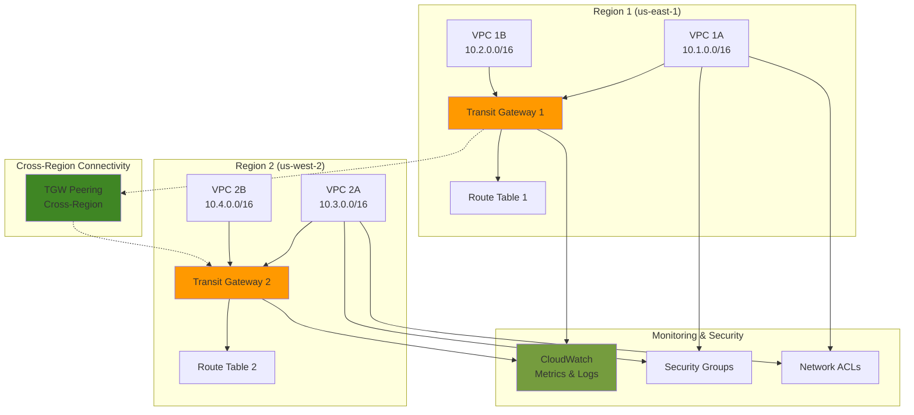

# Connecting Multi-Region Networks with Transit Gateway

## Problem

Global enterprises with distributed workloads across multiple AWS regions face complex networking challenges when attempting to establish secure, scalable, and cost-effective connectivity between their VPCs. Traditional approaches using VPC peering create a mesh topology that becomes increasingly difficult to manage as the number of regions and VPCs grows, leading to routing complexity, operational overhead, and potential security vulnerabilities. Organizations need a centralized hub-and-spoke architecture that can efficiently route traffic between regions while maintaining security controls and providing comprehensive monitoring capabilities.

## Solution

Build a multi-region network architecture using AWS Transit Gateway with cross-region peering to create a scalable hub-and-spoke connectivity model. This solution establishes Transit Gateways in multiple regions, connects them through peering attachments, and implements intelligent routing policies to enable secure communication between VPCs across regions. The architecture provides centralized network management, reduces operational complexity, and offers better security posture through consolidated routing controls.

## Architecture Diagram



## Prerequisites

1. AWS account with appropriate permissions for Transit Gateway, VPC, and networking services
2. AWS CLI v2 installed and configured (or AWS CloudShell)
3. Understanding of VPC networking concepts, CIDR blocks, and routing principles
4. Familiarity with multi-region AWS architectures and cross-region data transfer costs
5. Estimated cost: $150-200/month for Transit Gateway attachments, data processing, and cross-region data transfer

> **Note**: Cross-region Transit Gateway peering incurs data transfer charges. Review [AWS Transit Gateway pricing](https://aws.amazon.com/transit-gateway/pricing/) for Transit Gateway and data transfer costs before implementation.

## Preparation

```bash
# Set environment variables for both regions
export PRIMARY_REGION="us-east-1"
export SECONDARY_REGION="us-west-2"
export AWS_ACCOUNT_ID=$(aws sts get-caller-identity \
    --query Account --output text)

# Generate unique identifiers for resources
RANDOM_SUFFIX=$(aws secretsmanager get-random-password \
    --exclude-punctuation --exclude-uppercase \
    --password-length 6 --require-each-included-type \
    --output text --query RandomPassword)

# Set resource names with unique suffix
export PROJECT_NAME="multi-region-tgw-${RANDOM_SUFFIX}"
export PRIMARY_TGW_NAME="${PROJECT_NAME}-primary"
export SECONDARY_TGW_NAME="${PROJECT_NAME}-secondary"

# Define CIDR blocks for VPCs (ensure non-overlapping ranges)
export PRIMARY_VPC_A_CIDR="10.1.0.0/16"
export PRIMARY_VPC_B_CIDR="10.2.0.0/16"
export SECONDARY_VPC_A_CIDR="10.3.0.0/16"
export SECONDARY_VPC_B_CIDR="10.4.0.0/16"

echo "✅ Environment variables configured"
echo "Primary Region: ${PRIMARY_REGION}"
echo "Secondary Region: ${SECONDARY_REGION}"
echo "Project Name: ${PROJECT_NAME}"
```

## Steps

1. **Create VPCs in Primary Region**:

   Amazon VPC (Virtual Private Cloud) provides isolated network environments within AWS, serving as the foundation for all our network resources. Creating multiple VPCs in the primary region simulates a common enterprise scenario where different applications or business units require network isolation. Each VPC operates as a separate network segment with its own IP address range, routing tables, and security settings, ensuring logical separation while enabling centralized connectivity through Transit Galaxy.

   ```bash
   # Create VPC A in primary region
   PRIMARY_VPC_A_ID=$(aws ec2 create-vpc \
       --cidr-block ${PRIMARY_VPC_A_CIDR} \
       --region ${PRIMARY_REGION} \
       --tag-specifications \
           "ResourceType=vpc,Tags=[{Key=Name,Value=${PROJECT_NAME}-primary-vpc-a}]" \
       --query 'Vpc.VpcId' --output text)
   
   # Create VPC B in primary region
   PRIMARY_VPC_B_ID=$(aws ec2 create-vpc \
       --cidr-block ${PRIMARY_VPC_B_CIDR} \
       --region ${PRIMARY_REGION} \
       --tag-specifications \
           "ResourceType=vpc,Tags=[{Key=Name,Value=${PROJECT_NAME}-primary-vpc-b}]" \
       --query 'Vpc.VpcId' --output text)
   
   # Wait for VPCs to be available
   aws ec2 wait vpc-available --vpc-ids ${PRIMARY_VPC_A_ID} \
       --region ${PRIMARY_REGION}
   aws ec2 wait vpc-available --vpc-ids ${PRIMARY_VPC_B_ID} \
       --region ${PRIMARY_REGION}
   
   echo "✅ Created VPCs in primary region:"
   echo "Primary VPC A: ${PRIMARY_VPC_A_ID}"
   echo "Primary VPC B: ${PRIMARY_VPC_B_ID}"
   ```

   The VPCs are now established with non-overlapping CIDR blocks, providing the isolated network foundations required for our multi-region architecture. These VPCs will serve as attachment points for Transit Gateway, enabling centralized routing and connectivity management across the entire network topology.

2. **Create Subnets in Primary Region**:

   Subnets subdivide VPCs into smaller network segments and are required for Transit Gateway attachments. Each subnet represents a specific availability zone within the region, providing the physical network interface points where Transit Gateway can connect to VPC resources. Creating subnets in each VPC establishes the necessary endpoints for Transit Gateway attachments, enabling traffic to flow between the Transit Gateway and VPC resources while maintaining availability zone isolation for high availability.

   ```bash
   # Create subnet in VPC A
   PRIMARY_SUBNET_A_ID=$(aws ec2 create-subnet \
       --vpc-id ${PRIMARY_VPC_A_ID} \
       --cidr-block 10.1.1.0/24 \
       --availability-zone ${PRIMARY_REGION}a \
       --region ${PRIMARY_REGION} \
       --tag-specifications \
           "ResourceType=subnet,Tags=[{Key=Name,Value=${PROJECT_NAME}-primary-subnet-a}]" \
       --query 'Subnet.SubnetId' --output text)
   
   # Create subnet in VPC B
   PRIMARY_SUBNET_B_ID=$(aws ec2 create-subnet \
       --vpc-id ${PRIMARY_VPC_B_ID} \
       --cidr-block 10.2.1.0/24 \
       --availability-zone ${PRIMARY_REGION}a \
       --region ${PRIMARY_REGION} \
       --tag-specifications \
           "ResourceType=subnet,Tags=[{Key=Name,Value=${PROJECT_NAME}-primary-subnet-b}]" \
       --query 'Subnet.SubnetId' --output text)
   
   echo "✅ Created subnets in primary region:"
   echo "Primary Subnet A: ${PRIMARY_SUBNET_A_ID}"
   echo "Primary Subnet B: ${PRIMARY_SUBNET_B_ID}"
   ```

   The subnets now provide the necessary attachment points for Transit Gateway connections. These subnets act as the network interfaces through which Transit Gateway can route traffic into and out of each VPC, establishing the foundational connectivity layer for our multi-region network architecture.

3. **Create VPCs and Subnets in Secondary Region**:

   Replicating the VPC and subnet structure in the secondary region creates the distributed network foundation required for cross-region connectivity. This approach enables business continuity, disaster recovery, and global application deployment strategies. Each region maintains its own isolated network segments while connecting through Transit Gateway peering, providing both regional isolation and global connectivity for enterprise workloads that span multiple geographic locations.

   ```bash
   # Create VPC A in secondary region
   SECONDARY_VPC_A_ID=$(aws ec2 create-vpc \
       --cidr-block ${SECONDARY_VPC_A_CIDR} \
       --region ${SECONDARY_REGION} \
       --tag-specifications \
           "ResourceType=vpc,Tags=[{Key=Name,Value=${PROJECT_NAME}-secondary-vpc-a}]" \
       --query 'Vpc.VpcId' --output text)
   
   # Create VPC B in secondary region
   SECONDARY_VPC_B_ID=$(aws ec2 create-vpc \
       --cidr-block ${SECONDARY_VPC_B_CIDR} \
       --region ${SECONDARY_REGION} \
       --tag-specifications \
           "ResourceType=vpc,Tags=[{Key=Name,Value=${PROJECT_NAME}-secondary-vpc-b}]" \
       --query 'Vpc.VpcId' --output text)
   
   # Wait for VPCs to be available
   aws ec2 wait vpc-available --vpc-ids ${SECONDARY_VPC_A_ID} \
       --region ${SECONDARY_REGION}
   aws ec2 wait vpc-available --vpc-ids ${SECONDARY_VPC_B_ID} \
       --region ${SECONDARY_REGION}
   
   # Create subnets in secondary region
   SECONDARY_SUBNET_A_ID=$(aws ec2 create-subnet \
       --vpc-id ${SECONDARY_VPC_A_ID} \
       --cidr-block 10.3.1.0/24 \
       --availability-zone ${SECONDARY_REGION}a \
       --region ${SECONDARY_REGION} \
       --tag-specifications \
           "ResourceType=subnet,Tags=[{Key=Name,Value=${PROJECT_NAME}-secondary-subnet-a}]" \
       --query 'Subnet.SubnetId' --output text)
   
   SECONDARY_SUBNET_B_ID=$(aws ec2 create-subnet \
       --vpc-id ${SECONDARY_VPC_B_ID} \
       --cidr-block 10.4.1.0/24 \
       --availability-zone ${SECONDARY_REGION}a \
       --region ${SECONDARY_REGION} \
       --tag-specifications \
           "ResourceType=subnet,Tags=[{Key=Name,Value=${PROJECT_NAME}-secondary-subnet-b}]" \
       --query 'Subnet.SubnetId' --output text)
   
   echo "✅ Created VPCs and subnets in secondary region:"
   echo "Secondary VPC A: ${SECONDARY_VPC_A_ID}"
   echo "Secondary VPC B: ${SECONDARY_VPC_B_ID}"
   ```

   The secondary region infrastructure mirrors the primary region design, ensuring consistent network architecture across both regions. This symmetrical approach simplifies management, enables bidirectional traffic flow, and provides identical capabilities in both regions for robust multi-region application deployments.

4. **Create Transit Gateway in Primary Region**:

   AWS Transit Gateway acts as a regional networking hub that simplifies connectivity between VPCs, on-premises networks, and other AWS services. By enabling default route table association and propagation, we allow automatic route learning and sharing between all attached networks. The unique ASN (64512) enables BGP routing capabilities and distinguishes this Transit Gateway from others in cross-region scenarios. This centralized hub eliminates the need for complex VPC peering mesh topologies and provides scalable network management.

   ```bash
   # Create Transit Gateway in primary region
   PRIMARY_TGW_ID=$(aws ec2 create-transit-gateway \
       --description "Primary region Transit Gateway for ${PROJECT_NAME}" \
       --options \
           DefaultRouteTableAssociation=enable,DefaultRouteTablePropagation=enable,AmazonSideAsn=64512 \
       --tag-specifications \
           "ResourceType=transit-gateway,Tags=[{Key=Name,Value=${PRIMARY_TGW_NAME}}]" \
       --region ${PRIMARY_REGION} \
       --query 'TransitGateway.TransitGatewayId' --output text)
   
   # Wait for Transit Gateway to be available
   aws ec2 wait transit-gateway-available \
       --transit-gateway-ids ${PRIMARY_TGW_ID} \
       --region ${PRIMARY_REGION}
   
   echo "✅ Created Transit Gateway in primary region: ${PRIMARY_TGW_ID}"
   ```

   The primary Transit Gateway is now operational and ready to accept VPC attachments. This regional hub will manage all intra-region routing and serve as the connection point for cross-region peering, providing centralized network control and simplified management for the primary region's network infrastructure.

5. **Create Transit Gateway in Secondary Region**:

   Creating a second Transit Gateway in the secondary region establishes the counterpart hub for cross-region connectivity. Using a different ASN (64513) ensures proper BGP operation when the gateways communicate through peering attachments. This dual-hub architecture provides regional resilience, enables independent regional operations, and creates the foundation for sophisticated routing policies that can direct traffic based on source, destination, or business requirements.

   ```bash
   # Create Transit Gateway in secondary region
   SECONDARY_TGW_ID=$(aws ec2 create-transit-gateway \
       --description "Secondary region Transit Gateway for ${PROJECT_NAME}" \
       --options \
           DefaultRouteTableAssociation=enable,DefaultRouteTablePropagation=enable,AmazonSideAsn=64513 \
       --tag-specifications \
           "ResourceType=transit-gateway,Tags=[{Key=Name,Value=${SECONDARY_TGW_NAME}}]" \
       --region ${SECONDARY_REGION} \
       --query 'TransitGateway.TransitGatewayId' --output text)
   
   # Wait for Transit Gateway to be available
   aws ec2 wait transit-gateway-available \
       --transit-gateway-ids ${SECONDARY_TGW_ID} \
       --region ${SECONDARY_REGION}
   
   echo "✅ Created Transit Gateway in secondary region: ${SECONDARY_TGW_ID}"
   ```

   Both Transit Gateways are now established and ready to facilitate cross-region communication. The different ASN values enable unique identification and proper routing protocols when the gateways peer with each other, creating a robust multi-region network backbone for enterprise applications.

6. **Create VPC Attachments to Transit Gateways**:

   VPC attachments create the logical connections between Transit Gateways and VPCs, enabling traffic flow between the centralized hub and individual network segments. Each attachment specifies which subnet Transit Gateway uses as its network interface within the VPC, establishing the physical connection point. These attachments enable Transit Gateway to learn VPC routes automatically and provide the foundational connectivity that transforms isolated VPCs into an integrated network topology.

   ```bash
   # Attach primary VPCs to primary Transit Gateway
   PRIMARY_ATTACHMENT_A_ID=$(aws ec2 create-transit-gateway-vpc-attachment \
       --transit-gateway-id ${PRIMARY_TGW_ID} \
       --vpc-id ${PRIMARY_VPC_A_ID} \
       --subnet-ids ${PRIMARY_SUBNET_A_ID} \
       --region ${PRIMARY_REGION} \
       --query 'TransitGatewayVpcAttachment.TransitGatewayAttachmentId' \
       --output text)
   
   PRIMARY_ATTACHMENT_B_ID=$(aws ec2 create-transit-gateway-vpc-attachment \
       --transit-gateway-id ${PRIMARY_TGW_ID} \
       --vpc-id ${PRIMARY_VPC_B_ID} \
       --subnet-ids ${PRIMARY_SUBNET_B_ID} \
       --region ${PRIMARY_REGION} \
       --query 'TransitGatewayVpcAttachment.TransitGatewayAttachmentId' \
       --output text)
   
   # Attach secondary VPCs to secondary Transit Gateway
   SECONDARY_ATTACHMENT_A_ID=$(aws ec2 create-transit-gateway-vpc-attachment \
       --transit-gateway-id ${SECONDARY_TGW_ID} \
       --vpc-id ${SECONDARY_VPC_A_ID} \
       --subnet-ids ${SECONDARY_SUBNET_A_ID} \
       --region ${SECONDARY_REGION} \
       --query 'TransitGatewayVpcAttachment.TransitGatewayAttachmentId' \
       --output text)
   
   SECONDARY_ATTACHMENT_B_ID=$(aws ec2 create-transit-gateway-vpc-attachment \
       --transit-gateway-id ${SECONDARY_TGW_ID} \
       --vpc-id ${SECONDARY_VPC_B_ID} \
       --subnet-ids ${SECONDARY_SUBNET_B_ID} \
       --region ${SECONDARY_REGION} \
       --query 'TransitGatewayVpcAttachment.TransitGatewayAttachmentId' \
       --output text)
   
   echo "✅ Created VPC attachments to Transit Gateways"
   ```

   All VPCs are now successfully attached to their respective regional Transit Gateways, establishing intra-region connectivity. These attachments enable automatic route propagation and learning, allowing resources within each region to communicate through the Transit Gateway hub while preparing for cross-region connectivity through peering attachments.

> **Warning**: Transit Gateway attachments incur hourly charges and data processing fees. Monitor your AWS billing dashboard to track costs associated with Transit Gateway usage and cross-region data transfer.

7. **Create Cross-Region Transit Gateway Peering**:

   Cross-region peering establishes encrypted connectivity between Transit Gateways in different AWS regions, enabling secure data transmission across geographic boundaries. This peering connection operates as a managed, high-bandwidth link that eliminates the complexity of VPN or Direct Connect configurations for inter-region communication. The two-step process (create and accept) ensures both regions explicitly consent to the connection, providing security and administrative control over cross-region network access.

   ```bash
   # Create peering attachment from primary to secondary region
   PEERING_ATTACHMENT_ID=$(aws ec2 create-transit-gateway-peering-attachment \
       --transit-gateway-id ${PRIMARY_TGW_ID} \
       --peer-transit-gateway-id ${SECONDARY_TGW_ID} \
       --peer-account-id ${AWS_ACCOUNT_ID} \
       --peer-region ${SECONDARY_REGION} \
       --region ${PRIMARY_REGION} \
       --query 'TransitGatewayPeeringAttachment.TransitGatewayAttachmentId' \
       --output text)
   
   # Wait for peering attachment to be in pending state
   sleep 30
   
   # Accept the peering attachment in secondary region
   aws ec2 accept-transit-gateway-peering-attachment \
       --transit-gateway-attachment-id ${PEERING_ATTACHMENT_ID} \
       --region ${SECONDARY_REGION}
   
   echo "✅ Created and accepted cross-region peering attachment: ${PEERING_ATTACHMENT_ID}"
   ```

   The cross-region peering attachment is now active, creating a secure, encrypted tunnel between the two regions. This connection enables controlled routing of traffic between regions while maintaining the security and performance characteristics required for enterprise applications. The peering attachment serves as the foundation for implementing sophisticated cross-region routing policies.

8. **Create Custom Route Tables**:

   Custom route tables provide granular control over traffic flow within Transit Gateway environments, enabling advanced network segmentation and routing policies. Unlike default route tables that automatically propagate all routes, custom route tables allow selective route management, traffic isolation, and the implementation of security policies that determine which networks can communicate. Creating separate route tables for each region enables independent routing control while facilitating cross-region connectivity management.

   ```bash
   # Create custom route table for primary region
   PRIMARY_ROUTE_TABLE_ID=$(aws ec2 create-transit-gateway-route-table \
       --transit-gateway-id ${PRIMARY_TGW_ID} \
       --tag-specifications \
           "ResourceType=transit-gateway-route-table,Tags=[{Key=Name,Value=${PROJECT_NAME}-primary-rt}]" \
       --region ${PRIMARY_REGION} \
       --query 'TransitGatewayRouteTable.TransitGatewayRouteTableId' \
       --output text)
   
   # Create custom route table for secondary region
   SECONDARY_ROUTE_TABLE_ID=$(aws ec2 create-transit-gateway-route-table \
       --transit-gateway-id ${SECONDARY_TGW_ID} \
       --tag-specifications \
           "ResourceType=transit-gateway-route-table,Tags=[{Key=Name,Value=${PROJECT_NAME}-secondary-rt}]" \
       --region ${SECONDARY_REGION} \
       --query 'TransitGatewayRouteTable.TransitGatewayRouteTableId' \
       --output text)
   
   echo "✅ Created custom route tables:"
   echo "Primary Route Table: ${PRIMARY_ROUTE_TABLE_ID}"
   echo "Secondary Route Table: ${SECONDARY_ROUTE_TABLE_ID}"
   ```

   The custom route tables are now available for precise routing control in each region. These tables will replace the default automatic route propagation with explicit routing rules, enabling fine-grained control over which networks can communicate and implementing security policies through network segmentation.

9. **Configure Route Table Associations**:

   Route table associations determine which routing table controls traffic for each attachment. By associating all VPC attachments and the peering attachment with custom route tables, we gain explicit control over routing decisions rather than relying on default propagation. This association model enables implementing sophisticated routing policies, traffic segmentation, and security controls that determine exactly which networks can communicate across regions.

   ```bash
   # Associate attachments with custom route tables in primary region
   aws ec2 associate-transit-gateway-route-table \
       --transit-gateway-attachment-id ${PRIMARY_ATTACHMENT_A_ID} \
       --transit-gateway-route-table-id ${PRIMARY_ROUTE_TABLE_ID} \
       --region ${PRIMARY_REGION}
   
   aws ec2 associate-transit-gateway-route-table \
       --transit-gateway-attachment-id ${PRIMARY_ATTACHMENT_B_ID} \
       --transit-gateway-route-table-id ${PRIMARY_ROUTE_TABLE_ID} \
       --region ${PRIMARY_REGION}
   
   # Associate peering attachment with primary route table
   aws ec2 associate-transit-gateway-route-table \
       --transit-gateway-attachment-id ${PEERING_ATTACHMENT_ID} \
       --transit-gateway-route-table-id ${PRIMARY_ROUTE_TABLE_ID} \
       --region ${PRIMARY_REGION}
   
   # Associate attachments with custom route tables in secondary region
   aws ec2 associate-transit-gateway-route-table \
       --transit-gateway-attachment-id ${SECONDARY_ATTACHMENT_A_ID} \
       --transit-gateway-route-table-id ${SECONDARY_ROUTE_TABLE_ID} \
       --region ${SECONDARY_REGION}
   
   aws ec2 associate-transit-gateway-route-table \
       --transit-gateway-attachment-id ${SECONDARY_ATTACHMENT_B_ID} \
       --transit-gateway-route-table-id ${SECONDARY_ROUTE_TABLE_ID} \
       --region ${SECONDARY_REGION}
   
   # Associate peering attachment with secondary route table
   aws ec2 associate-transit-gateway-route-table \
       --transit-gateway-attachment-id ${PEERING_ATTACHMENT_ID} \
       --transit-gateway-route-table-id ${SECONDARY_ROUTE_TABLE_ID} \
       --region ${SECONDARY_REGION}
   
   echo "✅ Configured route table associations"
   ```

   All attachments are now associated with custom route tables, establishing the framework for controlled routing. This configuration enables selective route creation and provides the foundation for implementing cross-region connectivity with explicit control over traffic flow patterns and security policies.

10. **Create Cross-Region Routes**:

    Explicit route creation enables precise control over cross-region traffic flow by defining exactly which remote networks are reachable through the peering attachment. These static routes override default propagation behaviors and provide deterministic routing for cross-region communication. By specifying destination CIDR blocks and the peering attachment as the target, we create secure, predictable traffic paths that enable applications in one region to communicate with resources in another region while maintaining network security and performance.

    ```bash
    # Create routes from primary to secondary region
    aws ec2 create-transit-gateway-route \
        --destination-cidr-block ${SECONDARY_VPC_A_CIDR} \
        --transit-gateway-route-table-id ${PRIMARY_ROUTE_TABLE_ID} \
        --transit-gateway-attachment-id ${PEERING_ATTACHMENT_ID} \
        --region ${PRIMARY_REGION}
    
    aws ec2 create-transit-gateway-route \
        --destination-cidr-block ${SECONDARY_VPC_B_CIDR} \
        --transit-gateway-route-table-id ${PRIMARY_ROUTE_TABLE_ID} \
        --transit-gateway-attachment-id ${PEERING_ATTACHMENT_ID} \
        --region ${PRIMARY_REGION}
    
    # Create routes from secondary to primary region
    aws ec2 create-transit-gateway-route \
        --destination-cidr-block ${PRIMARY_VPC_A_CIDR} \
        --transit-gateway-route-table-id ${SECONDARY_ROUTE_TABLE_ID} \
        --transit-gateway-attachment-id ${PEERING_ATTACHMENT_ID} \
        --region ${SECONDARY_REGION}
    
    aws ec2 create-transit-gateway-route \
        --destination-cidr-block ${PRIMARY_VPC_B_CIDR} \
        --transit-gateway-route-table-id ${SECONDARY_ROUTE_TABLE_ID} \
        --transit-gateway-attachment-id ${PEERING_ATTACHMENT_ID} \
        --region ${SECONDARY_REGION}
    
    echo "✅ Created cross-region routes"
    ```

    Cross-region routing is now fully operational, enabling controlled communication between VPCs across regions. These explicit routes ensure that traffic destined for remote regions follows predictable paths through the peering attachment, providing the network connectivity foundation for multi-region applications and services.

11. **Configure Security Groups for Cross-Region Access**:

    Security groups provide stateful firewall capabilities at the instance level, controlling which traffic can reach resources within each VPC. Creating security groups that allow cross-region communication enables testing and validates that the Transit Gateway routing is functioning correctly. The ICMP protocol allows for basic connectivity testing using ping commands, providing a simple method to verify that cross-region network paths are operational and properly configured.

    ```bash
    # Create security group in primary VPC A
    PRIMARY_SG_A_ID=$(aws ec2 create-security-group \
        --group-name ${PROJECT_NAME}-primary-sg-a \
        --description "Security group for cross-region connectivity" \
        --vpc-id ${PRIMARY_VPC_A_ID} \
        --region ${PRIMARY_REGION} \
        --query 'GroupId' --output text)
    
    # Create security group in secondary VPC A
    SECONDARY_SG_A_ID=$(aws ec2 create-security-group \
        --group-name ${PROJECT_NAME}-secondary-sg-a \
        --description "Security group for cross-region connectivity" \
        --vpc-id ${SECONDARY_VPC_A_ID} \
        --region ${SECONDARY_REGION} \
        --query 'GroupId' --output text)
    
    # Allow ICMP from remote regions for testing
    aws ec2 authorize-security-group-ingress \
        --group-id ${PRIMARY_SG_A_ID} \
        --protocol icmp \
        --port -1 \
        --cidr ${SECONDARY_VPC_A_CIDR} \
        --region ${PRIMARY_REGION}
    
    aws ec2 authorize-security-group-ingress \
        --group-id ${SECONDARY_SG_A_ID} \
        --protocol icmp \
        --port -1 \
        --cidr ${PRIMARY_VPC_A_CIDR} \
        --region ${SECONDARY_REGION}
    
    echo "✅ Created security groups for cross-region access"
    ```

    Security groups are now configured to enable cross-region communication testing. These firewall rules allow ICMP traffic between regions, providing the necessary access controls for validating connectivity while maintaining security best practices. In production environments, these rules would be replaced with specific application protocols and ports.

12. **Set Up CloudWatch Monitoring**:

    CloudWatch monitoring provides essential visibility into Transit Gateway performance, helping identify potential issues, track usage patterns, and optimize network performance. The dashboard displays key metrics including data transfer volumes, packet drop counts, and attachment status across both regions. This monitoring capability enables proactive network management, cost optimization, and troubleshooting, ensuring that the multi-region network infrastructure operates efficiently and meets business requirements.

> **Tip**: Enable Transit Gateway Flow Logs for detailed network traffic analysis. This feature provides comprehensive visibility into traffic patterns, security analysis capabilities, and detailed troubleshooting information for complex network scenarios. For more information, see [AWS Transit Gateway Flow Logs documentation](https://docs.aws.amazon.com/vpc/latest/tgw/tgw-flow-logs.html).

    ```bash
    # Create CloudWatch dashboard for Transit Gateway monitoring
    aws cloudwatch put-dashboard \
        --dashboard-name "${PROJECT_NAME}-tgw-dashboard" \
        --dashboard-body '{
            "widgets": [
                {
                    "type": "metric",
                    "properties": {
                        "metrics": [
                            ["AWS/TransitGateway", "BytesIn", "TransitGateway", "'${PRIMARY_TGW_ID}'"],
                            [".", "BytesOut", ".", "."],
                            [".", "PacketDropCount", ".", "."]
                        ],
                        "period": 300,
                        "stat": "Sum",
                        "region": "'${PRIMARY_REGION}'",
                        "title": "Primary Transit Gateway Metrics"
                    }
                },
                {
                    "type": "metric",
                    "properties": {
                        "metrics": [
                            ["AWS/TransitGateway", "BytesIn", "TransitGateway", "'${SECONDARY_TGW_ID}'"],
                            [".", "BytesOut", ".", "."],
                            [".", "PacketDropCount", ".", "."]
                        ],
                        "period": 300,
                        "stat": "Sum",
                        "region": "'${SECONDARY_REGION}'",
                        "title": "Secondary Transit Gateway Metrics"
                    }
                }
            ]
        }' \
        --region ${PRIMARY_REGION}
    
    echo "✅ Created CloudWatch dashboard for monitoring"
    ```

    The CloudWatch dashboard is now operational, providing real-time visibility into Transit Gateway performance metrics across both regions. This monitoring infrastructure enables proactive management of the multi-region network, helping identify potential issues before they impact applications and providing data-driven insights for network optimization and capacity planning.

## Validation & Testing

1. **Verify Transit Gateway Status**:

   ```bash
   # Check primary Transit Gateway status
   aws ec2 describe-transit-gateways \
       --transit-gateway-ids ${PRIMARY_TGW_ID} \
       --region ${PRIMARY_REGION} \
       --query 'TransitGateways[0].State' --output text
   
   # Check secondary Transit Gateway status
   aws ec2 describe-transit-gateways \
       --transit-gateway-ids ${SECONDARY_TGW_ID} \
       --region ${SECONDARY_REGION} \
       --query 'TransitGateways[0].State' --output text
   ```

   Expected output: `available` for both Transit Gateways

2. **Verify Peering Attachment Status**:

   ```bash
   # Check peering attachment status
   aws ec2 describe-transit-gateway-peering-attachments \
       --transit-gateway-attachment-ids ${PEERING_ATTACHMENT_ID} \
       --region ${PRIMARY_REGION} \
       --query 'TransitGatewayPeeringAttachments[0].State' --output text
   ```

   Expected output: `available`

3. **Test Cross-Region Route Propagation**:

   ```bash
   # Search routes in primary region route table
   aws ec2 search-transit-gateway-routes \
       --transit-gateway-route-table-id ${PRIMARY_ROUTE_TABLE_ID} \
       --filters "Name=state,Values=active" \
       --region ${PRIMARY_REGION} \
       --query 'Routes[].{Destination:DestinationCidrBlock,State:State}'
   
   # Search routes in secondary region route table
   aws ec2 search-transit-gateway-routes \
       --transit-gateway-route-table-id ${SECONDARY_ROUTE_TABLE_ID} \
       --filters "Name=state,Values=active" \
       --region ${SECONDARY_REGION} \
       --query 'Routes[].{Destination:DestinationCidrBlock,State:State}'
   ```

   Expected output: Active routes showing cross-region CIDR blocks

4. **Monitor Transit Gateway Metrics**:

   ```bash
   # Get Transit Gateway metrics from CloudWatch
   aws cloudwatch get-metric-statistics \
       --namespace AWS/TransitGateway \
       --metric-name BytesIn \
       --dimensions Name=TransitGateway,Value=${PRIMARY_TGW_ID} \
       --start-time $(date -u -d '1 hour ago' +%Y-%m-%dT%H:%M:%S) \
       --end-time $(date -u +%Y-%m-%dT%H:%M:%S) \
       --period 300 \
       --statistics Sum \
       --region ${PRIMARY_REGION}
   ```

5. **Verify VPC Attachment Status**:

   ```bash
   # List all attachments for primary Transit Gateway
   aws ec2 describe-transit-gateway-attachments \
       --filters "Name=transit-gateway-id,Values=${PRIMARY_TGW_ID}" \
       --region ${PRIMARY_REGION} \
       --query 'TransitGatewayAttachments[].{AttachmentId:TransitGatewayAttachmentId,State:State,Type:ResourceType}'
   ```

   Expected output: All attachments should show `available` state

## Cleanup

1. **Delete Cross-Region Routes**:

   ```bash
   # Delete routes from primary to secondary region
   aws ec2 delete-transit-gateway-route \
       --destination-cidr-block ${SECONDARY_VPC_A_CIDR} \
       --transit-gateway-route-table-id ${PRIMARY_ROUTE_TABLE_ID} \
       --region ${PRIMARY_REGION}
   
   aws ec2 delete-transit-gateway-route \
       --destination-cidr-block ${SECONDARY_VPC_B_CIDR} \
       --transit-gateway-route-table-id ${PRIMARY_ROUTE_TABLE_ID} \
       --region ${PRIMARY_REGION}
   
   # Delete routes from secondary to primary region
   aws ec2 delete-transit-gateway-route \
       --destination-cidr-block ${PRIMARY_VPC_A_CIDR} \
       --transit-gateway-route-table-id ${SECONDARY_ROUTE_TABLE_ID} \
       --region ${SECONDARY_REGION}
   
   aws ec2 delete-transit-gateway-route \
       --destination-cidr-block ${PRIMARY_VPC_B_CIDR} \
       --transit-gateway-route-table-id ${SECONDARY_ROUTE_TABLE_ID} \
       --region ${SECONDARY_REGION}
   
   echo "✅ Deleted cross-region routes"
   ```

2. **Delete Route Table Associations**:

   ```bash
   # Disassociate primary region attachments
   aws ec2 disassociate-transit-gateway-route-table \
       --transit-gateway-attachment-id ${PRIMARY_ATTACHMENT_A_ID} \
       --transit-gateway-route-table-id ${PRIMARY_ROUTE_TABLE_ID} \
       --region ${PRIMARY_REGION}
   
   aws ec2 disassociate-transit-gateway-route-table \
       --transit-gateway-attachment-id ${PRIMARY_ATTACHMENT_B_ID} \
       --transit-gateway-route-table-id ${PRIMARY_ROUTE_TABLE_ID} \
       --region ${PRIMARY_REGION}
   
   # Disassociate secondary region attachments
   aws ec2 disassociate-transit-gateway-route-table \
       --transit-gateway-attachment-id ${SECONDARY_ATTACHMENT_A_ID} \
       --transit-gateway-route-table-id ${SECONDARY_ROUTE_TABLE_ID} \
       --region ${SECONDARY_REGION}
   
   aws ec2 disassociate-transit-gateway-route-table \
       --transit-gateway-attachment-id ${SECONDARY_ATTACHMENT_B_ID} \
       --transit-gateway-route-table-id ${SECONDARY_ROUTE_TABLE_ID} \
       --region ${SECONDARY_REGION}
   
   echo "✅ Deleted route table associations"
   ```

3. **Delete Transit Gateway Peering Attachment**:

   ```bash
   # Delete peering attachment
   aws ec2 delete-transit-gateway-peering-attachment \
       --transit-gateway-attachment-id ${PEERING_ATTACHMENT_ID} \
       --region ${PRIMARY_REGION}
   
   # Wait for peering attachment to be deleted
   echo "⏳ Waiting for peering attachment deletion..."
   sleep 60
   
   echo "✅ Deleted Transit Gateway peering attachment"
   ```

4. **Delete VPC Attachments**:

   ```bash
   # Delete VPC attachments in primary region
   aws ec2 delete-transit-gateway-vpc-attachment \
       --transit-gateway-attachment-id ${PRIMARY_ATTACHMENT_A_ID} \
       --region ${PRIMARY_REGION}
   
   aws ec2 delete-transit-gateway-vpc-attachment \
       --transit-gateway-attachment-id ${PRIMARY_ATTACHMENT_B_ID} \
       --region ${PRIMARY_REGION}
   
   # Delete VPC attachments in secondary region
   aws ec2 delete-transit-gateway-vpc-attachment \
       --transit-gateway-attachment-id ${SECONDARY_ATTACHMENT_A_ID} \
       --region ${SECONDARY_REGION}
   
   aws ec2 delete-transit-gateway-vpc-attachment \
       --transit-gateway-attachment-id ${SECONDARY_ATTACHMENT_B_ID} \
       --region ${SECONDARY_REGION}
   
   echo "✅ Deleted VPC attachments"
   ```

5. **Delete Route Tables**:

   ```bash
   # Delete custom route tables
   aws ec2 delete-transit-gateway-route-table \
       --transit-gateway-route-table-id ${PRIMARY_ROUTE_TABLE_ID} \
       --region ${PRIMARY_REGION}
   
   aws ec2 delete-transit-gateway-route-table \
       --transit-gateway-route-table-id ${SECONDARY_ROUTE_TABLE_ID} \
       --region ${SECONDARY_REGION}
   
   echo "✅ Deleted custom route tables"
   ```

6. **Delete Transit Gateways**:

   ```bash
   # Delete Transit Gateways
   aws ec2 delete-transit-gateway \
       --transit-gateway-id ${PRIMARY_TGW_ID} \
       --region ${PRIMARY_REGION}
   
   aws ec2 delete-transit-gateway \
       --transit-gateway-id ${SECONDARY_TGW_ID} \
       --region ${SECONDARY_REGION}
   
   echo "✅ Deleted Transit Gateways"
   ```

7. **Delete Security Groups and VPC Resources**:

   ```bash
   # Delete security groups
   aws ec2 delete-security-group \
       --group-id ${PRIMARY_SG_A_ID} \
       --region ${PRIMARY_REGION}
   
   aws ec2 delete-security-group \
       --group-id ${SECONDARY_SG_A_ID} \
       --region ${SECONDARY_REGION}
   
   # Delete subnets
   aws ec2 delete-subnet --subnet-id ${PRIMARY_SUBNET_A_ID} \
       --region ${PRIMARY_REGION}
   aws ec2 delete-subnet --subnet-id ${PRIMARY_SUBNET_B_ID} \
       --region ${PRIMARY_REGION}
   aws ec2 delete-subnet --subnet-id ${SECONDARY_SUBNET_A_ID} \
       --region ${SECONDARY_REGION}
   aws ec2 delete-subnet --subnet-id ${SECONDARY_SUBNET_B_ID} \
       --region ${SECONDARY_REGION}
   
   # Delete VPCs
   aws ec2 delete-vpc --vpc-id ${PRIMARY_VPC_A_ID} \
       --region ${PRIMARY_REGION}
   aws ec2 delete-vpc --vpc-id ${PRIMARY_VPC_B_ID} \
       --region ${PRIMARY_REGION}
   aws ec2 delete-vpc --vpc-id ${SECONDARY_VPC_A_ID} \
       --region ${SECONDARY_REGION}
   aws ec2 delete-vpc --vpc-id ${SECONDARY_VPC_B_ID} \
       --region ${SECONDARY_REGION}
   
   # Delete CloudWatch dashboard
   aws cloudwatch delete-dashboards \
       --dashboard-names "${PROJECT_NAME}-tgw-dashboard" \
       --region ${PRIMARY_REGION}
   
   echo "✅ Deleted all VPC resources and monitoring"
   ```

8. **Clean Up Environment Variables**:

   ```bash
   # Unset environment variables
   unset PRIMARY_REGION SECONDARY_REGION AWS_ACCOUNT_ID
   unset PROJECT_NAME PRIMARY_TGW_NAME SECONDARY_TGW_NAME
   unset PRIMARY_VPC_A_CIDR PRIMARY_VPC_B_CIDR SECONDARY_VPC_A_CIDR SECONDARY_VPC_B_CIDR
   unset PRIMARY_TGW_ID SECONDARY_TGW_ID PEERING_ATTACHMENT_ID
   unset PRIMARY_VPC_A_ID PRIMARY_VPC_B_ID SECONDARY_VPC_A_ID SECONDARY_VPC_B_ID
   
   echo "✅ Cleaned up environment variables"
   ```

## Discussion

This multi-region Transit Gateway architecture provides a robust foundation for enterprise-scale networking across AWS regions. The hub-and-spoke model significantly reduces the complexity compared to traditional VPC peering mesh architectures, where the number of peering connections grows exponentially with each additional VPC. Transit Gateway centralizes routing decisions and provides a single point of control for network policies, making it easier to manage security rules and traffic flow patterns. The architecture follows AWS Well-Architected Framework principles for operational excellence and performance efficiency.

The cross-region peering capability is particularly valuable for organizations with disaster recovery requirements or global applications that need low-latency access to resources in multiple regions. The encrypted connections between regions ensure that data in transit is protected using AES-256 encryption, while the ability to create custom route tables allows for sophisticated traffic engineering and segmentation strategies. Organizations can implement different routing policies for different types of traffic, such as separating production and development workloads or implementing specific compliance requirements.

From a cost perspective, Transit Gateway operates on a pay-per-use model with charges for attachments, data processing, and cross-region data transfer. While this can be more expensive than VPC peering for simple scenarios, the operational benefits and reduced management overhead often justify the additional cost for complex multi-region architectures. The centralized monitoring capabilities through CloudWatch provide visibility into network performance and help identify potential issues before they impact applications. For detailed pricing information, see the [AWS Transit Gateway pricing page](https://aws.amazon.com/transit-gateway/pricing/).

For implementation best practices, consider using unique ASN (Autonomous System Number) values for each Transit Gateway to enable future BGP-based routing enhancements. The architecture also supports advanced features like multicast domains for specialized applications and Connect attachments for integration with third-party network appliances. Regular monitoring of route table propagation and attachment states helps ensure optimal performance and quick identification of connectivity issues. For comprehensive guidance, refer to the [AWS Transit Gateway design best practices documentation](https://docs.aws.amazon.com/vpc/latest/tgw/tgw-best-design-practices.html).

> **Note**: This configuration follows AWS Well-Architected Framework principles for networking and connectivity. See the [AWS Well-Architected Framework](https://docs.aws.amazon.com/wellarchitected/latest/framework/) for additional guidance on designing robust, secure, and efficient cloud architectures.

## Challenge

Extend this solution by implementing these advanced networking scenarios:

1. **Multi-Account Cross-Region Connectivity**: Implement Transit Gateway sharing using AWS Resource Access Manager (RAM) to enable secure connectivity between VPCs across different AWS accounts and regions, including cross-account route table associations and security policies.

2. **Hybrid Cloud Integration**: Add AWS Direct Connect or VPN connections to the Transit Gateway architecture to create a hybrid cloud network that seamlessly connects on-premises infrastructure with multi-region AWS resources, implementing advanced routing policies for traffic optimization.

3. **Network Segmentation with Policy Tables**: Implement Transit Gateway Policy Tables to create micro-segmentation capabilities, allowing fine-grained control over which VPCs can communicate with each other based on tags, resource types, or other attributes.

4. **Advanced Monitoring and Automation**: Build a comprehensive monitoring solution using Transit Gateway Flow Logs, CloudWatch Logs Insights, and AWS Lambda to create automated network troubleshooting and optimization workflows, including automatic route adjustments based on performance metrics.

5. **Multi-Region Disaster Recovery**: Design an automated disaster recovery solution that uses Transit Gateway cross-region peering to enable rapid failover of applications and data between regions, including automated DNS failover and traffic rerouting based on health checks.

## Infrastructure Code

*Infrastructure code will be generated after recipe approval.*