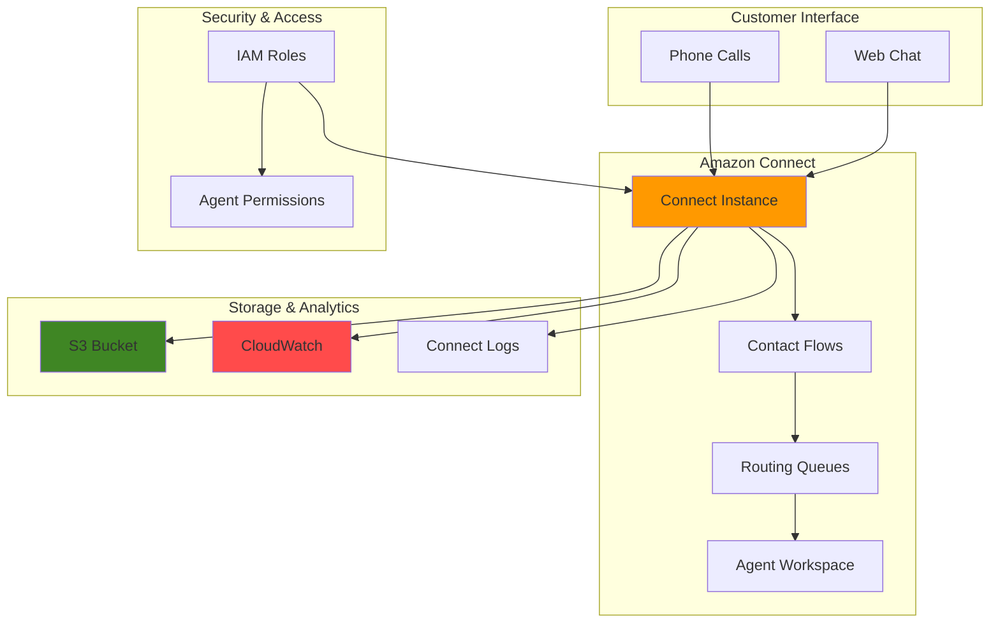

# Contact Center Solutions with Amazon Connect

## Problem

Organizations struggle with traditional contact center infrastructure that requires significant upfront investment, complex hardware maintenance, and limited scalability during peak demand periods. Business leaders need a modern contact center solution that can scale dynamically, integrate with existing business applications, and provide comprehensive analytics to optimize customer service operations while reducing operational costs.

## Solution

Amazon Connect provides a cloud-based contact center platform that eliminates infrastructure complexity while offering intelligent routing, real-time analytics, and seamless integration capabilities. This solution demonstrates building a fully functional contact center with automated routing, call recording, and performance monitoring that scales automatically based on demand.

## Architecture Diagram



## Prerequisites

1. AWS account with administrative permissions for Amazon Connect, S3, IAM, and CloudWatch
2. AWS CLI v2 installed and configured (or AWS CloudShell)
3. Basic understanding of contact center operations and call routing concepts
4. Phone number for testing (mobile or landline)
5. Estimated cost: $2-5 per day for testing (pay-per-use pricing for calls and agent time)

> **Note**: Amazon Connect charges per minute for phone usage and per agent per hour. Costs accumulate only when actively using the service.

## Preparation

```bash
# Set environment variables
export AWS_REGION=$(aws configure get region)
export AWS_ACCOUNT_ID=$(aws sts get-caller-identity \
    --query Account --output text)

# Generate unique identifier for resources
RANDOM_SUFFIX=$(aws secretsmanager get-random-password \
    --exclude-punctuation --exclude-uppercase \
    --password-length 6 --require-each-included-type \
    --output text --query RandomPassword)

export CONNECT_INSTANCE_ALIAS="contact-center-${RANDOM_SUFFIX}"
export S3_BUCKET_NAME="connect-recordings-${AWS_ACCOUNT_ID}-${RANDOM_SUFFIX}"

# Create S3 bucket for call recordings and data storage
aws s3 mb s3://${S3_BUCKET_NAME} --region ${AWS_REGION}

# Enable S3 bucket versioning and encryption
aws s3api put-bucket-versioning \
    --bucket ${S3_BUCKET_NAME} \
    --versioning-configuration Status=Enabled

aws s3api put-bucket-encryption \
    --bucket ${S3_BUCKET_NAME} \
    --server-side-encryption-configuration \
    'Rules=[{ApplyServerSideEncryptionByDefault:{SSEAlgorithm:AES256}}]'

echo "✅ S3 bucket created and configured: ${S3_BUCKET_NAME}"
```

## Steps

1. **Create Amazon Connect Instance**:

   Amazon Connect instances represent the core infrastructure for your contact center operations, providing a fully managed platform that eliminates the need for traditional on-premises telephony hardware. Each instance acts as a logical container for all your contact center resources including users, queues, routing profiles, and contact flows, while automatically handling scalability, security, and compliance requirements.

   Creating an instance with both inbound and outbound calling capabilities establishes the foundation for comprehensive customer service operations. The CONNECT_MANAGED identity management option simplifies user administration by allowing you to manage agent accounts directly within Amazon Connect rather than requiring external identity providers.

   ```bash
   # Create the Connect instance with basic configuration
   INSTANCE_RESULT=$(aws connect create-instance \
       --identity-management-type CONNECT_MANAGED \
       --instance-alias ${CONNECT_INSTANCE_ALIAS} \
       --inbound-calls-enabled \
       --outbound-calls-enabled \
       --output json)
   
   export INSTANCE_ID=$(echo $INSTANCE_RESULT | jq -r '.Id')
   export INSTANCE_ARN=$(echo $INSTANCE_RESULT | jq -r '.Arn')
   
   # Wait for instance to be active
   echo "Waiting for instance to become active..."
   aws connect describe-instance \
       --instance-id ${INSTANCE_ID} \
       --query 'Instance.InstanceStatus' \
       --output text
   
   echo "✅ Connect instance created: ${INSTANCE_ID}"
   ```

   Your Amazon Connect instance is now provisioned and ready for configuration. The instance ID serves as the unique identifier for all subsequent API calls and resource associations. This foundational step enables you to build a complete contact center solution with enterprise-grade reliability and security.

2. **Configure Instance Storage for Call Recordings**:

   Call recording and transcript storage are critical for compliance, quality assurance, and business intelligence in contact centers. Amazon Connect integrates seamlessly with S3 to provide secure, durable storage for all customer interactions, ensuring long-term retention and easy access for analysis.

   Configuring separate storage paths for call recordings and chat transcripts enables organized data management and supports different retention policies based on content type. This separation also facilitates compliance with regulations like PCI-DSS, GDPR, and industry-specific requirements that may have different storage and access requirements for voice versus text interactions.

   ```bash
   # Associate S3 bucket for call recordings
   aws connect associate-instance-storage-config \
       --instance-id ${INSTANCE_ID} \
       --resource-type CALL_RECORDINGS \
       --storage-config "S3Config={BucketName=${S3_BUCKET_NAME},BucketPrefix=call-recordings/}"
   
   # Associate S3 bucket for chat transcripts
   aws connect associate-instance-storage-config \
       --instance-id ${INSTANCE_ID} \
       --resource-type CHAT_TRANSCRIPTS \
       --storage-config "S3Config={BucketName=${S3_BUCKET_NAME},BucketPrefix=chat-transcripts/}"
   
   # Associate S3 bucket for contact trace records
   aws connect associate-instance-storage-config \
       --instance-id ${INSTANCE_ID} \
       --resource-type CONTACT_TRACE_RECORDS \
       --storage-config "S3Config={BucketName=${S3_BUCKET_NAME},BucketPrefix=contact-trace-records/}"
   
   echo "✅ Storage configuration completed"
   ```

   Your contact center now has secure, scalable storage configured for all customer interactions. This setup ensures that call recordings and chat transcripts are automatically stored in S3 with proper organization, enabling compliance reporting, quality monitoring, and business analytics workflows.

3. **Create Administrative User**:

   Administrative users in Amazon Connect serve as the primary management interface for your contact center, requiring elevated permissions to configure routing, manage agents, and access comprehensive analytics. The Admin security profile provides full access to all Connect features, while the soft phone configuration enables the administrator to monitor calls and provide real-time support when needed.

   Creating a dedicated administrative account with proper security profiles ensures secure access control and enables delegation of management responsibilities. The after-contact work time limit defines how long agents have to complete post-call tasks like updating customer records or case notes, directly impacting operational efficiency and customer satisfaction metrics.

   ```bash
   # Get the default Admin security profile ID
   ADMIN_PROFILE_ID=$(aws connect list-security-profiles \
       --instance-id ${INSTANCE_ID} \
       --query 'SecurityProfileSummaryList[?Name==`Admin`].Id' \
       --output text)
   
   # Get the default Basic Routing Profile ID
   ROUTING_PROFILE_ID=$(aws connect list-routing-profiles \
       --instance-id ${INSTANCE_ID} \
       --query 'RoutingProfileSummaryList[0].Id' \
       --output text)
   
   # Create admin user
   USER_RESULT=$(aws connect create-user \
       --username "connect-admin" \
       --password "TempPass123!" \
       --identity-info "FirstName=Connect,LastName=Administrator" \
       --phone-config "PhoneType=SOFT_PHONE,AutoAccept=false,AfterContactWorkTimeLimit=120" \
       --security-profile-ids ${ADMIN_PROFILE_ID} \
       --routing-profile-id ${ROUTING_PROFILE_ID} \
       --instance-id ${INSTANCE_ID} \
       --output json)
   
   export ADMIN_USER_ID=$(echo $USER_RESULT | jq -r '.UserId')
   
   echo "✅ Admin user created: connect-admin"
   ```

   The administrative user account is now configured with full management capabilities for your contact center. This account enables comprehensive system administration including user management, routing configuration, and performance monitoring, establishing the operational foundation for your contact center management team.

4. **Create Customer Service Queue**:

   Queues in Amazon Connect serve as the intelligent routing mechanism that distributes incoming customer contacts to available agents based on skills, availability, and business rules. Each queue operates within defined hours of operation and can handle multiple communication channels while maintaining separate performance metrics and routing logic.

   The queue configuration directly impacts customer experience through wait times, routing efficiency, and agent utilization. Setting appropriate maximum contact limits prevents queue overload while ensuring optimal resource allocation. This queue will serve as the primary destination for customer inquiries, establishing the foundation for systematic contact handling and performance measurement.

   ```bash
   # Get default hours of operation
   HOURS_ID=$(aws connect list-hours-of-operations \
       --instance-id ${INSTANCE_ID} \
       --query 'HoursOfOperationSummaryList[0].Id' \
       --output text)
   
   # Create customer service queue
   QUEUE_RESULT=$(aws connect create-queue \
       --instance-id ${INSTANCE_ID} \
       --name "CustomerService" \
       --description "Main customer service queue for general inquiries" \
       --hours-of-operation-id ${HOURS_ID} \
       --max-contacts 50 \
       --tags "Purpose=CustomerService,Environment=Production" \
       --output json)
   
   export QUEUE_ID=$(echo $QUEUE_RESULT | jq -r '.QueueId')
   export QUEUE_ARN=$(echo $QUEUE_RESULT | jq -r '.QueueArn')
   
   echo "✅ Customer service queue created: ${QUEUE_ID}"
   ```

   Your customer service queue is now operational and ready to receive incoming contacts. This queue serves as the central hub for customer interactions, enabling intelligent routing based on agent availability and skills while providing comprehensive performance metrics for operational optimization.

5. **Configure Phone Number**:

   Phone numbers in Amazon Connect provide the telephony endpoint for customer interactions, with toll-free numbers offering cost-effective customer access and professional business presence. The phone number claiming process involves searching available numbers from AWS's telephony partners and associating them with your Connect instance for inbound call routing.

   Toll-free numbers eliminate customer calling costs and provide a professional image while supporting high-volume inbound traffic. The conditional logic in this step handles scenarios where toll-free numbers may not be immediately available, ensuring the setup process continues smoothly while providing alternative configuration options.

   ```bash
   # Search for available phone numbers to claim (US numbers)
   AVAILABLE_NUMBERS=$(aws connect search-available-phone-numbers \
       --target-arn ${INSTANCE_ARN} \
       --phone-number-country-code US \
       --phone-number-type TOLL_FREE \
       --max-results 1 \
       --output json)
   
   # Check if numbers are available and claim one
   if [ "$(echo $AVAILABLE_NUMBERS | jq '.AvailableNumbersList | length')" -gt 0 ]; then
       PHONE_NUMBER=$(echo $AVAILABLE_NUMBERS | jq -r '.AvailableNumbersList[0]')
       
       CLAIM_RESULT=$(aws connect claim-phone-number \
           --target-arn ${INSTANCE_ARN} \
           --phone-number ${PHONE_NUMBER} \
           --phone-number-description "Main customer service line" \
           --tags "Purpose=CustomerService" \
           --output json)
       
       export CONTACT_NUMBER=${PHONE_NUMBER}
       export PHONE_NUMBER_ID=$(echo $CLAIM_RESULT | jq -r '.PhoneNumberId')
       echo "✅ Phone number claimed: ${PHONE_NUMBER}"
   else
       echo "ℹ️  No toll-free numbers available. Use Connect console to claim a number manually."
       echo "ℹ️  You can continue with the setup and claim a number later."
   fi
   ```

   Your contact center now has a dedicated phone number for customer interactions. This telephony endpoint enables customers to reach your support team directly, with the number automatically routing calls through your configured contact flows and queues for optimal customer experience.

6. **Create Basic Contact Flow**:

   Contact flows represent the logical workflow that defines how customer interactions are handled from initial contact through resolution. These flows use a visual, drag-and-drop interface in the Connect console but can also be defined programmatically using JSON configuration for automation and version control.

   This contact flow implements a standard customer service pattern: greeting message, call recording activation, and queue transfer. The recording configuration ensures compliance with regulations while providing quality assurance capabilities. The flow structure enables easy modification and scaling as business requirements evolve.

   > **Note**: Contact flows support advanced routing logic including interactive voice response (IVR), skills-based routing, and integration with external systems. Learn more about [contact flow best practices](https://docs.aws.amazon.com/connect/latest/adminguide/about-routing.html) in the AWS documentation.

   ```bash
   # Create a simple contact flow JSON configuration
   cat > contact-flow.json << 'EOF'
   {
     "Version": "2019-10-30",
     "StartAction": "12345678-1234-1234-1234-123456789012",
     "Metadata": {
       "entryPointPosition": {"x": 20, "y": 20},
       "snapToGrid": false,
       "ActionMetadata": {
         "12345678-1234-1234-1234-123456789012": {
           "position": {"x": 178, "y": 52}
         },
         "87654321-4321-4321-4321-210987654321": {
           "position": {"x": 392, "y": 154}
         },
         "11111111-2222-3333-4444-555555555555": {
           "position": {"x": 626, "y": 154}
         }
       }
     },
     "Actions": [
       {
         "Identifier": "12345678-1234-1234-1234-123456789012",
         "Type": "MessageParticipant",
         "Parameters": {
           "Text": "Thank you for calling our customer service. Please wait while we connect you to an available agent."
         },
         "Transitions": {
           "NextAction": "87654321-4321-4321-4321-210987654321"
         }
       },
       {
         "Identifier": "87654321-4321-4321-4321-210987654321", 
         "Type": "SetRecordingBehavior",
         "Parameters": {
           "RecordingBehaviorOption": "Enable",
           "RecordingParticipantOption": "Both"
         },
         "Transitions": {
           "NextAction": "11111111-2222-3333-4444-555555555555"
         }
       },
       {
         "Identifier": "11111111-2222-3333-4444-555555555555",
         "Type": "TransferToQueue",
         "Parameters": {
           "QueueId": "QUEUE_ARN_PLACEHOLDER"
         },
         "Transitions": {}
       }
     ]
   }
   EOF
   
   # Update the contact flow with actual queue ARN
   sed -i "s/QUEUE_ARN_PLACEHOLDER/${QUEUE_ARN//\//\\/}/g" contact-flow.json
   
   # Create the contact flow
   FLOW_RESULT=$(aws connect create-contact-flow \
       --instance-id ${INSTANCE_ID} \
       --name "CustomerServiceFlow" \
       --type CONTACT_FLOW \
       --description "Main customer service contact flow with recording" \
       --content file://contact-flow.json \
       --output json)
   
   export FLOW_ID=$(echo $FLOW_RESULT | jq -r '.ContactFlowId')
   export FLOW_ARN=$(echo $FLOW_RESULT | jq -r '.ContactFlowArn')
   
   # Associate phone number with contact flow (if phone number is available)
   if [ ! -z "${PHONE_NUMBER_ID}" ]; then
       aws connect associate-phone-number-contact-flow \
           --phone-number-id ${PHONE_NUMBER_ID} \
           --instance-id ${INSTANCE_ID} \
           --contact-flow-id ${FLOW_ID}
       echo "✅ Phone number associated with contact flow"
   fi
   
   echo "✅ Contact flow created: ${FLOW_ID}"
   ```

   Your contact flow is now active and ready to handle customer interactions. This flow provides a professional customer experience with automated greeting, call recording for compliance, and intelligent routing to available agents, establishing the foundation for consistent service delivery.

7. **Create Agent User and Routing Profile**:

   Agent users and routing profiles work together to define how customer service representatives interact with the system and receive customer contacts. Routing profiles determine which queues agents can handle, channel concurrency limits, and priority settings that optimize workload distribution based on business needs.

   The Agent security profile provides appropriate permissions for handling customer interactions while maintaining security boundaries. Soft phone configuration enables browser-based calling without requiring physical desk phones, reducing infrastructure costs while providing flexibility for remote work arrangements.

   ```bash
   # Get Agent security profile ID
   AGENT_PROFILE_ID=$(aws connect list-security-profiles \
       --instance-id ${INSTANCE_ID} \
       --query 'SecurityProfileSummaryList[?Name==`Agent`].Id' \
       --output text)
   
   # Create a routing profile for customer service agents
   AGENT_ROUTING_RESULT=$(aws connect create-routing-profile \
       --instance-id ${INSTANCE_ID} \
       --name "CustomerServiceAgents" \
       --description "Routing profile for customer service representatives" \
       --default-outbound-queue-id ${QUEUE_ID} \
       --queue-configs "QueueReference={QueueId=${QUEUE_ID},Channel=VOICE},Priority=1,Delay=0" \
       --media-concurrencies "Channel=VOICE,Concurrency=1" \
       --output json)
   
   export AGENT_ROUTING_ID=$(echo $AGENT_ROUTING_RESULT | jq -r '.RoutingProfileId')
   
   # Create agent user
   AGENT_USER_RESULT=$(aws connect create-user \
       --username "service-agent-01" \
       --password "AgentPass123!" \
       --identity-info "FirstName=Service,LastName=Agent" \
       --phone-config "PhoneType=SOFT_PHONE,AutoAccept=true,AfterContactWorkTimeLimit=180" \
       --security-profile-ids ${AGENT_PROFILE_ID} \
       --routing-profile-id ${AGENT_ROUTING_ID} \
       --instance-id ${INSTANCE_ID} \
       --output json)
   
   export AGENT_USER_ID=$(echo $AGENT_USER_RESULT | jq -r '.UserId')
   
   echo "✅ Agent user and routing profile created"
   ```

   Your agent infrastructure is now configured with proper security profiles and routing capabilities. This setup enables agents to log in and begin handling customer interactions immediately, with the routing profile ensuring optimal contact distribution based on availability and queue priorities.

8. **Enable CloudWatch Metrics and Real-time Reports**:

   CloudWatch integration provides comprehensive monitoring and analytics capabilities for your contact center operations, enabling real-time visibility into performance metrics like contact volume, agent utilization, and customer satisfaction. Contact flow logging captures detailed interaction data for troubleshooting and optimization.

   Contact Lens for Amazon Connect provides AI-powered conversation analytics, including sentiment analysis, call categorization, and trend identification. This advanced analytics capability transforms raw interaction data into actionable business insights, enabling proactive quality management and customer experience optimization.

   ```bash
   # Enable contact events for CloudWatch
   aws connect update-instance-attribute \
       --instance-id ${INSTANCE_ID} \
       --attribute-type CONTACTFLOW_LOGS \
       --value true
   
   # Enable Contact Lens for analytics (if available in region)
   aws connect update-instance-attribute \
       --instance-id ${INSTANCE_ID} \
       --attribute-type CONTACT_LENS \
       --value true 2>/dev/null || echo "ℹ️  Contact Lens not available in this region"
   
   # Create CloudWatch dashboard for monitoring
   cat > dashboard-config.json << EOF
   {
     "widgets": [
       {
         "type": "metric",
         "x": 0,
         "y": 0,
         "width": 12,
         "height": 6,
         "properties": {
           "metrics": [
             ["AWS/Connect", "ContactsReceived", "InstanceId", "${INSTANCE_ID}"],
             [".", "ContactsHandled", ".", "."],
             [".", "ContactsAbandoned", ".", "."]
           ],
           "period": 300,
           "stat": "Sum",
           "region": "${AWS_REGION}",
           "title": "Contact Center Metrics"
         }
       }
     ]
   }
   EOF
   
   aws cloudwatch put-dashboard \
       --dashboard-name "ConnectContactCenter-${RANDOM_SUFFIX}" \
       --dashboard-body file://dashboard-config.json
   
   echo "✅ CloudWatch monitoring configured"
   ```

   Your contact center now has comprehensive monitoring and analytics capabilities enabled. The CloudWatch dashboard provides real-time visibility into key performance indicators, while Contact Lens delivers AI-powered insights that enable data-driven optimization of customer service operations.

## Validation & Testing

1. Verify Connect instance is running:

   ```bash
   # Check instance status
   aws connect describe-instance \
       --instance-id ${INSTANCE_ID} \
       --query 'Instance.{Status:InstanceStatus,Alias:InstanceAlias,CreatedTime:CreatedTime}' \
       --output table
   ```

   Expected output: Instance status should be "ACTIVE"

2. Test agent login functionality:

   ```bash
   # List all users to verify creation
   aws connect list-users \
       --instance-id ${INSTANCE_ID} \
       --query 'UserSummaryList[*].{Username:Username,Id:Id}' \
       --output table
   ```

3. Verify call recording configuration:

   ```bash
   # Check storage configurations
   aws connect list-instance-storage-configs \
       --instance-id ${INSTANCE_ID} \
       --resource-type CALL_RECORDINGS \
       --output table
   ```

4. Test contact flow functionality:

   ```bash
   # List contact flows
   aws connect list-contact-flows \
       --instance-id ${INSTANCE_ID} \
       --query 'ContactFlowSummaryList[*].{Name:Name,Type:Type,Id:Id}' \
       --output table
   ```

5. Verify phone number association (if claimed):

   ```bash
   # List phone numbers
   aws connect list-phone-numbers \
       --instance-id ${INSTANCE_ID} \
       --phone-number-types TOLL_FREE DID \
       --output table
   ```

## Cleanup

1. Remove users and profiles:

   ```bash
   # Delete agent user
   aws connect delete-user \
       --instance-id ${INSTANCE_ID} \
       --user-id ${AGENT_USER_ID}
   
   # Delete admin user  
   aws connect delete-user \
       --instance-id ${INSTANCE_ID} \
       --user-id ${ADMIN_USER_ID}
   
   echo "✅ Users deleted"
   ```

2. Release phone number (if claimed):

   ```bash
   # Release phone number if it was claimed
   if [ ! -z "${PHONE_NUMBER_ID}" ]; then
       aws connect release-phone-number \
           --phone-number-id ${PHONE_NUMBER_ID}
       echo "✅ Phone number released"
   fi
   ```

3. Delete Connect instance:

   ```bash
   # Delete the Connect instance (this removes all associated resources)
   aws connect delete-instance \
       --instance-id ${INSTANCE_ID}
   
   echo "✅ Connect instance deletion initiated"
   ```

4. Remove storage resources:

   ```bash
   # Empty and delete S3 bucket
   aws s3 rm s3://${S3_BUCKET_NAME} --recursive
   aws s3 rb s3://${S3_BUCKET_NAME}
   
   # Remove CloudWatch dashboard
   aws cloudwatch delete-dashboards \
       --dashboard-names "ConnectContactCenter-${RANDOM_SUFFIX}"
   
   # Clean up local files
   rm -f contact-flow.json dashboard-config.json
   
   echo "✅ Storage and monitoring resources cleaned up"
   ```

## Discussion

This implementation demonstrates building a production-ready contact center using Amazon Connect's cloud-native architecture. The solution eliminates traditional infrastructure concerns while providing enterprise-grade features like automatic call recording, intelligent routing, and real-time analytics. Amazon Connect follows the AWS Well-Architected Framework principles, ensuring operational excellence, security, reliability, performance efficiency, and cost optimization.

Amazon Connect's pay-as-you-use pricing model significantly reduces costs compared to traditional contact center solutions. Organizations only pay for actual usage - per minute for calls and per agent-hour for staffing. This approach is particularly beneficial for businesses with variable call volumes or seasonal fluctuations, providing cost optimization without sacrificing functionality.

The service integrates seamlessly with other AWS services, enabling advanced capabilities like AI-powered chatbots (Amazon Lex), sentiment analysis (Amazon Comprehend), and machine learning insights (Contact Lens). Contact flows provide visual, drag-and-drop configuration for call routing logic, making it accessible to business users without requiring technical expertise. This integration ecosystem supports comprehensive omnichannel customer experience strategies.

Real-time and historical analytics through CloudWatch and Connect's built-in reporting enable data-driven optimization of contact center operations. Managers can monitor key performance indicators like average handle time, abandonment rates, and agent utilization to improve customer experience and operational efficiency. The solution supports compliance requirements through comprehensive audit trails and secure data storage in S3.

> **Warning**: Contact Lens for Amazon Connect may not be available in all AWS regions. Check the [Amazon Connect service quotas and regional availability](https://docs.aws.amazon.com/connect/latest/adminguide/amazon-connect-service-limits.html) before enabling advanced analytics features.

> **Tip**: Configure automatic call distribution (ACD) based on agent skills and availability to optimize customer wait times and ensure calls reach the most qualified agents. Use CloudWatch alarms to trigger notifications when queue wait times exceed business thresholds.

## Challenge

Extend this solution by implementing these enhancements:

1. **Add AI-powered chatbot integration**: Implement Amazon Lex chatbot for common inquiries with fallback to human agents for complex issues, reducing agent workload and improving customer self-service capabilities
2. **Implement skills-based routing**: Create multiple agent skill sets (technical support, billing, sales) with intelligent routing based on customer input or CRM integration
3. **Build real-time sentiment analysis**: Use Contact Lens to analyze customer sentiment during calls and trigger supervisor alerts for negative interactions or escalation opportunities
4. **Create omnichannel experience**: Add web chat, SMS, and email channels with unified agent desktop and customer history across all touchpoints using Amazon Connect APIs
5. **Develop custom analytics dashboard**: Build advanced reporting using Amazon QuickSight with Connect data lake integration for executive-level insights and operational optimization

## Infrastructure Code

*Infrastructure code will be generated after recipe approval.*