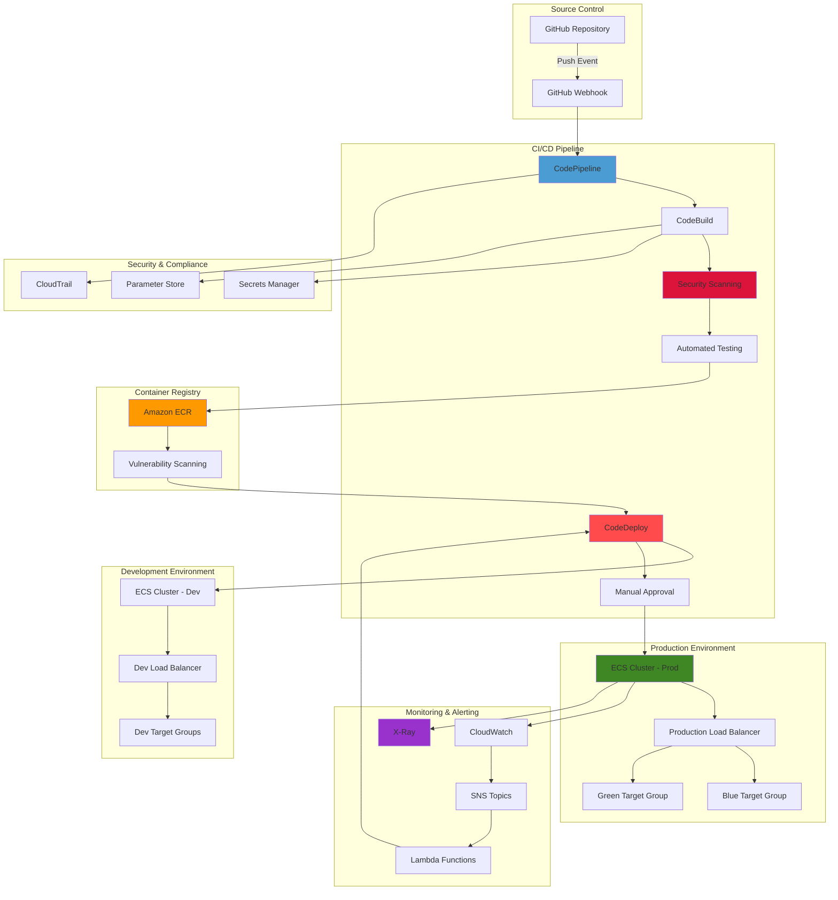

# Container CI/CD Pipelines with CodePipeline

## Problem

Enterprise development teams require robust, scalable CI/CD pipelines for containerized applications that can handle complex deployment scenarios, automated testing, security scanning, and compliance requirements. Manual deployment processes introduce human error, lack auditability, and cannot scale across multiple environments and regions. Organizations need automated pipelines that support blue-green deployments, canary releases, automated rollbacks, and integration with monitoring systems while maintaining security and compliance standards across development, staging, and production environments.

## Solution

Build a comprehensive CI/CD pipeline using AWS CodePipeline, CodeDeploy, and CodeBuild that automates the entire software delivery lifecycle for containerized applications. This solution implements advanced deployment strategies including blue-green and canary deployments, automated security scanning, multi-environment promotion, and intelligent rollback mechanisms. The pipeline integrates with Amazon ECS, ECR, CloudWatch, and X-Ray to provide end-to-end visibility, automated testing, and operational excellence for containerized workloads.

## Architecture Diagram



## Prerequisites

1. AWS account with administrator-level permissions for CodePipeline, CodeDeploy, CodeBuild, ECS, ECR, IAM, and related services
2. AWS CLI v2 installed and configured (or AWS CloudShell)
3. Docker installed locally for testing container builds
4. Advanced understanding of containerization, CI/CD concepts, and blue-green deployments
5. GitHub repository with a containerized application including Dockerfile, buildspec.yml, and application code
6. Basic knowledge of AWS networking, security groups, and load balancing
7. Estimated cost: $150-200 per month for running multi-environment ECS clusters, CodeBuild projects, and associated resources

> **Note**: This advanced recipe includes multi-environment deployment, security scanning, and comprehensive monitoring. Ensure you have proper AWS permissions and understand the cost implications before proceeding.

## Preparation

```bash
# Set environment variables
export AWS_REGION=$(aws configure get region)
export AWS_ACCOUNT_ID=$(aws sts get-caller-identity \
    --query Account --output text)

# Generate unique identifiers for resources
RANDOM_SUFFIX=$(aws secretsmanager get-random-password \
    --exclude-punctuation --exclude-uppercase \
    --password-length 8 --require-each-included-type \
    --output text --query RandomPassword)

export PROJECT_NAME="advanced-cicd-${RANDOM_SUFFIX}"
export DEV_CLUSTER_NAME="${PROJECT_NAME}-dev-cluster"
export PROD_CLUSTER_NAME="${PROJECT_NAME}-prod-cluster"
export SERVICE_NAME="${PROJECT_NAME}-service"
export REPOSITORY_NAME="${PROJECT_NAME}-repo"
export PIPELINE_NAME="${PROJECT_NAME}-pipeline"
export APPLICATION_NAME="${PROJECT_NAME}-app"
export BUILD_PROJECT_NAME="${PROJECT_NAME}-build"

# Create S3 bucket for CodePipeline artifacts with versioning
aws s3 mb s3://${PROJECT_NAME}-artifacts-${AWS_REGION}
aws s3api put-bucket-versioning \
    --bucket ${PROJECT_NAME}-artifacts-${AWS_REGION} \
    --versioning-configuration Status=Enabled

# Create parameter store values for configuration
aws ssm put-parameter \
    --name "/${PROJECT_NAME}/app/environment" \
    --value "production" \
    --type "String" \
    --description "Application environment"

aws ssm put-parameter \
    --name "/${PROJECT_NAME}/app/version" \
    --value "1.0.0" \
    --type "String" \
    --description "Application version"

echo "✅ Environment variables set, S3 bucket created, and parameters stored"
```

## Steps

1. **Create Enhanced ECR Repository with Security Scanning**:

   Amazon ECR serves as the foundation of our container deployment pipeline, providing secure, scalable, and highly available container image storage. ECR's integrated vulnerability scanning automatically identifies software vulnerabilities in container images during push operations, enabling early detection of security issues before deployment. This proactive security approach is essential for maintaining compliance and reducing attack surfaces in production environments.

   ```bash
   # Create ECR repository with enhanced security
   aws ecr create-repository \
       --repository-name ${REPOSITORY_NAME} \
       --image-scanning-configuration scanOnPush=true \
       --encryption-configuration encryptionType=AES256 \
       --region ${AWS_REGION}
   
   # Set lifecycle policy to manage image retention
   cat > lifecycle-policy.json << EOF
   {
     "rules": [
       {
         "rulePriority": 1,
         "description": "Keep last 10 production images",
         "selection": {
           "tagStatus": "tagged",
           "tagPrefixList": ["prod"],
           "countType": "imageCountMoreThan",
           "countNumber": 10
         },
         "action": {
           "type": "expire"
         }
       },
       {
         "rulePriority": 2,
         "description": "Keep last 5 development images",
         "selection": {
           "tagStatus": "tagged",
           "tagPrefixList": ["dev"],
           "countType": "imageCountMoreThan",
           "countNumber": 5
         },
         "action": {
           "type": "expire"
         }
       }
     ]
   }
   EOF
   
   aws ecr put-lifecycle-policy \
       --repository-name ${REPOSITORY_NAME} \
       --lifecycle-policy-text file://lifecycle-policy.json
   
   # Get repository URI
   export REPOSITORY_URI=$(aws ecr describe-repositories \
       --repository-names ${REPOSITORY_NAME} \
       --query 'repositories[0].repositoryUri' \
       --output text)
   
   echo "✅ Enhanced ECR repository created with security scanning: ${REPOSITORY_URI}"
   ```

   The ECR repository is now configured with automatic vulnerability scanning and lifecycle policies that optimize storage costs while maintaining security. The scan-on-push feature ensures every container image is analyzed for known vulnerabilities, creating an automated security gate in your deployment pipeline. Learn more about [ECR image scanning capabilities](https://docs.aws.amazon.com/AmazonECR/latest/userguide/image-scanning.html).

2. **Create Multi-Environment VPC Infrastructure**:

   A dedicated Virtual Private Cloud (VPC) provides network isolation and security boundaries for our containerized applications. VPCs enable fine-grained control over network traffic, security policies, and resource access across multiple environments. This network foundation supports both development and production workloads while maintaining strict separation between environments, which is crucial for compliance and security best practices.

   ```bash
   # Create VPC for multi-environment deployment
   export VPC_ID=$(aws ec2 create-vpc \
       --cidr-block 10.0.0.0/16 \
       --query 'Vpc.VpcId' --output text)
   
   aws ec2 create-tags \
       --resources ${VPC_ID} \
       --tags Key=Name,Value=${PROJECT_NAME}-vpc
   
   # Enable DNS support
   aws ec2 modify-vpc-attribute \
       --vpc-id ${VPC_ID} \
       --enable-dns-hostnames
   
   # Create internet gateway
   export IGW_ID=$(aws ec2 create-internet-gateway \
       --query 'InternetGateway.InternetGatewayId' \
       --output text)
   
   aws ec2 attach-internet-gateway \
       --vpc-id ${VPC_ID} \
       --internet-gateway-id ${IGW_ID}
   
   # Create route table
   export RT_ID=$(aws ec2 create-route-table \
       --vpc-id ${VPC_ID} \
       --query 'RouteTable.RouteTableId' \
       --output text)
   
   aws ec2 create-route \
       --route-table-id ${RT_ID} \
       --destination-cidr-block 0.0.0.0/0 \
       --gateway-id ${IGW_ID}
   
   echo "✅ VPC infrastructure created with DNS support"
   ```

   The VPC infrastructure now provides secure network isolation for our container workloads with DNS resolution enabled for service discovery. The internet gateway and routing configuration allow controlled external access while maintaining security boundaries between environments.

3. **Create Multi-AZ Subnets and Advanced Security Groups**:

   Multi-Availability Zone deployment is fundamental for achieving high availability and fault tolerance in container workloads. By distributing resources across multiple AZs, we ensure that our applications can withstand individual AZ failures while maintaining service availability. Security groups act as virtual firewalls, implementing the principle of least privilege by allowing only necessary traffic between application tiers.

   ```bash
   # Create subnets across multiple AZs
   export SUBNET_1=$(aws ec2 create-subnet \
       --vpc-id ${VPC_ID} \
       --cidr-block 10.0.1.0/24 \
       --availability-zone ${AWS_REGION}a \
       --query 'Subnet.SubnetId' --output text)
   
   export SUBNET_2=$(aws ec2 create-subnet \
       --vpc-id ${VPC_ID} \
       --cidr-block 10.0.2.0/24 \
       --availability-zone ${AWS_REGION}b \
       --query 'Subnet.SubnetId' --output text)
   
   export SUBNET_3=$(aws ec2 create-subnet \
       --vpc-id ${VPC_ID} \
       --cidr-block 10.0.3.0/24 \
       --availability-zone ${AWS_REGION}c \
       --query 'Subnet.SubnetId' --output text)
   
   # Associate subnets with route table
   aws ec2 associate-route-table \
       --subnet-id ${SUBNET_1} \
       --route-table-id ${RT_ID}
   
   aws ec2 associate-route-table \
       --subnet-id ${SUBNET_2} \
       --route-table-id ${RT_ID}
   
   aws ec2 associate-route-table \
       --subnet-id ${SUBNET_3} \
       --route-table-id ${RT_ID}
   
   # Create security group for ALB
   export ALB_SG_ID=$(aws ec2 create-security-group \
       --group-name ${PROJECT_NAME}-alb-sg \
       --description "Security group for Application Load Balancer" \
       --vpc-id ${VPC_ID} \
       --query 'GroupId' --output text)
   
   # Create security group for ECS tasks
   export ECS_SG_ID=$(aws ec2 create-security-group \
       --group-name ${PROJECT_NAME}-ecs-sg \
       --description "Security group for ECS tasks" \
       --vpc-id ${VPC_ID} \
       --query 'GroupId' --output text)
   
   # Configure security group rules
   aws ec2 authorize-security-group-ingress \
       --group-id ${ALB_SG_ID} \
       --protocol tcp \
       --port 80 \
       --cidr 0.0.0.0/0
   
   aws ec2 authorize-security-group-ingress \
       --group-id ${ALB_SG_ID} \
       --protocol tcp \
       --port 443 \
       --cidr 0.0.0.0/0
   
   aws ec2 authorize-security-group-ingress \
       --group-id ${ECS_SG_ID} \
       --protocol tcp \
       --port 8080 \
       --source-group ${ALB_SG_ID}
   
   echo "✅ Multi-AZ subnets and security groups configured"
   ```

   The multi-AZ subnet configuration provides redundancy and fault tolerance, while security groups implement defense-in-depth by controlling traffic flow between load balancers and container tasks. This configuration ensures high availability and maintains security isolation between different application components.

4. **Create Advanced Application Load Balancers for Multi-Environment**:

   Application Load Balancers (ALBs) provide sophisticated Layer 7 load balancing capabilities essential for container deployments. ALBs support advanced routing, health checks, and blue-green deployment patterns through target group management. The separation of development and production load balancers enables independent scaling, testing, and deployment strategies while maintaining production stability.

   ```bash
   # Create Development ALB
   export DEV_ALB_ARN=$(aws elbv2 create-load-balancer \
       --name ${PROJECT_NAME}-dev-alb \
       --subnets ${SUBNET_1} ${SUBNET_2} ${SUBNET_3} \
       --security-groups ${ALB_SG_ID} \
       --scheme internet-facing \
       --type application \
       --query 'LoadBalancers[0].LoadBalancerArn' \
       --output text)
   
   # Create Production ALB
   export PROD_ALB_ARN=$(aws elbv2 create-load-balancer \
       --name ${PROJECT_NAME}-prod-alb \
       --subnets ${SUBNET_1} ${SUBNET_2} ${SUBNET_3} \
       --security-groups ${ALB_SG_ID} \
       --scheme internet-facing \
       --type application \
       --query 'LoadBalancers[0].LoadBalancerArn' \
       --output text)
   
   # Create target groups for development
   export DEV_TG=$(aws elbv2 create-target-group \
       --name ${PROJECT_NAME}-dev-tg \
       --protocol HTTP \
       --port 8080 \
       --vpc-id ${VPC_ID} \
       --target-type ip \
       --health-check-path /health \
       --health-check-interval-seconds 30 \
       --health-check-timeout-seconds 5 \
       --healthy-threshold-count 2 \
       --unhealthy-threshold-count 3 \
       --query 'TargetGroups[0].TargetGroupArn' \
       --output text)
   
   # Create target groups for production blue-green deployment
   export PROD_TG_BLUE=$(aws elbv2 create-target-group \
       --name ${PROJECT_NAME}-prod-blue \
       --protocol HTTP \
       --port 8080 \
       --vpc-id ${VPC_ID} \
       --target-type ip \
       --health-check-path /health \
       --health-check-interval-seconds 15 \
       --health-check-timeout-seconds 5 \
       --healthy-threshold-count 2 \
       --unhealthy-threshold-count 2 \
       --query 'TargetGroups[0].TargetGroupArn' \
       --output text)
   
   export PROD_TG_GREEN=$(aws elbv2 create-target-group \
       --name ${PROJECT_NAME}-prod-green \
       --protocol HTTP \
       --port 8080 \
       --vpc-id ${VPC_ID} \
       --target-type ip \
       --health-check-path /health \
       --health-check-interval-seconds 15 \
       --health-check-timeout-seconds 5 \
       --healthy-threshold-count 2 \
       --unhealthy-threshold-count 2 \
       --query 'TargetGroups[0].TargetGroupArn' \
       --output text)
   
   # Create listeners
   export DEV_LISTENER_ARN=$(aws elbv2 create-listener \
       --load-balancer-arn ${DEV_ALB_ARN} \
       --protocol HTTP \
       --port 80 \
       --default-actions Type=forward,TargetGroupArn=${DEV_TG} \
       --query 'Listeners[0].ListenerArn' \
       --output text)
   
   export PROD_LISTENER_ARN=$(aws elbv2 create-listener \
       --load-balancer-arn ${PROD_ALB_ARN} \
       --protocol HTTP \
       --port 80 \
       --default-actions Type=forward,TargetGroupArn=${PROD_TG_BLUE} \
       --query 'Listeners[0].ListenerArn' \
       --output text)
   
   echo "✅ Advanced load balancers and target groups created"
   ```

   The load balancer infrastructure now supports sophisticated deployment patterns including blue-green deployments for production workloads. Target groups with optimized health check configurations ensure rapid detection of unhealthy containers and automatic traffic routing to healthy instances, minimizing downtime during deployments.

5. **Create Comprehensive IAM Roles with Least Privilege**:

   IAM roles implement the security principle of least privilege by granting containers and services only the minimum permissions required for their specific functions. Task execution roles handle infrastructure operations like pulling container images and writing logs, while task roles provide application-level permissions for accessing AWS services. This separation ensures secure credential management without embedding long-term credentials in container images.

   ```bash
   # Create ECS task execution role
   aws iam create-role \
       --role-name ${PROJECT_NAME}-task-execution-role \
       --assume-role-policy-document '{
         "Version": "2012-10-17",
         "Statement": [
           {
             "Effect": "Allow",
             "Principal": {
               "Service": "ecs-tasks.amazonaws.com"
             },
             "Action": "sts:AssumeRole"
           }
         ]
       }'
   
   # Create ECS task role with additional permissions
   aws iam create-role \
       --role-name ${PROJECT_NAME}-task-role \
       --assume-role-policy-document '{
         "Version": "2012-10-17",
         "Statement": [
           {
             "Effect": "Allow",
             "Principal": {
               "Service": "ecs-tasks.amazonaws.com"
             },
             "Action": "sts:AssumeRole"
           }
         ]
       }'
   
   # Create custom policy for task role
   cat > task-role-policy.json << EOF
   {
     "Version": "2012-10-17",
     "Statement": [
       {
         "Effect": "Allow",
         "Action": [
           "ssm:GetParameter",
           "ssm:GetParameters",
           "ssm:GetParametersByPath",
           "secretsmanager:GetSecretValue",
           "xray:PutTraceSegments",
           "xray:PutTelemetryRecords",
           "logs:CreateLogStream",
           "logs:PutLogEvents"
         ],
         "Resource": "*"
       }
     ]
   }
   EOF
   
   aws iam put-role-policy \
       --role-name ${PROJECT_NAME}-task-role \
       --policy-name ${PROJECT_NAME}-task-policy \
       --policy-document file://task-role-policy.json
   
   # Attach managed policies
   aws iam attach-role-policy \
       --role-name ${PROJECT_NAME}-task-execution-role \
       --policy-arn arn:aws:iam::aws:policy/service-role/AmazonECSTaskExecutionRolePolicy
   
   # Create CodeDeploy service role
   aws iam create-role \
       --role-name ${PROJECT_NAME}-codedeploy-role \
       --assume-role-policy-document '{
         "Version": "2012-10-17",
         "Statement": [
           {
             "Effect": "Allow",
             "Principal": {
               "Service": "codedeploy.amazonaws.com"
             },
             "Action": "sts:AssumeRole"
           }
         ]
       }'
   
   aws iam attach-role-policy \
       --role-name ${PROJECT_NAME}-codedeploy-role \
       --policy-arn arn:aws:iam::aws:policy/AWSCodeDeployRoleForECS
   
   echo "✅ Comprehensive IAM roles created with least privilege"
   ```

   The IAM role configuration now implements security best practices with granular permissions for each service component. Task roles enable secure access to Parameter Store and X-Ray without requiring hardcoded credentials, while service roles allow CodeDeploy to manage ECS deployments with appropriate permissions.

6. **Create Multi-Environment ECS Clusters**:

   ECS clusters provide the compute foundation for containerized applications with built-in orchestration, scaling, and monitoring capabilities. Container Insights integration enables deep observability into cluster performance, resource utilization, and application metrics. The development cluster uses Fargate Spot for cost optimization, while production uses standard Fargate for predictable performance and availability.

   ```bash
   # Create development ECS cluster
   aws ecs create-cluster \
       --cluster-name ${DEV_CLUSTER_NAME} \
       --capacity-providers EC2 FARGATE FARGATE_SPOT \
       --default-capacity-provider-strategy \
       capacityProvider=FARGATE_SPOT,weight=1,base=0 \
       --settings name=containerInsights,value=enabled \
       --tags key=Environment,value=development \
       key=Project,value=${PROJECT_NAME}
   
   # Create production ECS cluster
   aws ecs create-cluster \
       --cluster-name ${PROD_CLUSTER_NAME} \
       --capacity-providers EC2 FARGATE \
       --default-capacity-provider-strategy \
       capacityProvider=FARGATE,weight=1,base=0 \
       --settings name=containerInsights,value=enabled \
       --tags key=Environment,value=production \
       key=Project,value=${PROJECT_NAME}
   
   # Create CloudWatch log groups
   aws logs create-log-group \
       --log-group-name /ecs/${PROJECT_NAME}/dev \
       --retention-in-days 7
   
   aws logs create-log-group \
       --log-group-name /ecs/${PROJECT_NAME}/prod \
       --retention-in-days 30
   
   echo "✅ Multi-environment ECS clusters created with Container Insights"
   ```

   The ECS clusters are now configured with Container Insights providing comprehensive monitoring and observability. CloudWatch log groups with environment-specific retention policies ensure appropriate log management while supporting debugging and compliance requirements. Learn more about [Container Insights capabilities](https://docs.aws.amazon.com/AmazonCloudWatch/latest/monitoring/ContainerInsights.html).

7. **Create Advanced Task Definitions with X-Ray and Parameter Store**:

   Task definitions specify how containers should run within ECS, including resource allocation, networking, and security configurations. X-Ray integration enables distributed tracing for microservices architectures, providing visibility into request flows and performance bottlenecks. Parameter Store integration allows secure configuration management without hardcoding sensitive values in container images.

   ```bash
   # Create development task definition
   cat > dev-task-definition.json << EOF
   {
     "family": "${PROJECT_NAME}-dev-task",
     "networkMode": "awsvpc",
     "requiresCompatibilities": ["FARGATE"],
     "cpu": "256",
     "memory": "512",
     "executionRoleArn": "arn:aws:iam::${AWS_ACCOUNT_ID}:role/${PROJECT_NAME}-task-execution-role",
     "taskRoleArn": "arn:aws:iam::${AWS_ACCOUNT_ID}:role/${PROJECT_NAME}-task-role",
     "containerDefinitions": [
       {
         "name": "app",
         "image": "nginx:latest",
         "portMappings": [
           {
             "containerPort": 8080,
             "protocol": "tcp"
           }
         ],
         "essential": true,
         "environment": [
           {
             "name": "ENV",
             "value": "development"
           },
           {
             "name": "AWS_XRAY_TRACING_NAME",
             "value": "${PROJECT_NAME}-dev"
           }
         ],
         "secrets": [
           {
             "name": "APP_VERSION",
             "valueFrom": "/${PROJECT_NAME}/app/version"
           }
         ],
         "logConfiguration": {
           "logDriver": "awslogs",
           "options": {
             "awslogs-group": "/ecs/${PROJECT_NAME}/dev",
             "awslogs-region": "${AWS_REGION}",
             "awslogs-stream-prefix": "ecs"
           }
         },
         "healthCheck": {
           "command": ["CMD-SHELL", "curl -f http://localhost:8080/health || exit 1"],
           "interval": 30,
           "timeout": 5,
           "retries": 3,
           "startPeriod": 60
         }
       },
       {
         "name": "xray-daemon",
         "image": "amazon/aws-xray-daemon:latest",
         "portMappings": [
           {
             "containerPort": 2000,
             "protocol": "udp"
           }
         ],
         "essential": false,
         "logConfiguration": {
           "logDriver": "awslogs",
           "options": {
             "awslogs-group": "/ecs/${PROJECT_NAME}/dev",
             "awslogs-region": "${AWS_REGION}",
             "awslogs-stream-prefix": "xray"
           }
         }
       }
     ]
   }
   EOF
   
   # Create production task definition
   cat > prod-task-definition.json << EOF
   {
     "family": "${PROJECT_NAME}-prod-task",
     "networkMode": "awsvpc",
     "requiresCompatibilities": ["FARGATE"],
     "cpu": "512",
     "memory": "1024",
     "executionRoleArn": "arn:aws:iam::${AWS_ACCOUNT_ID}:role/${PROJECT_NAME}-task-execution-role",
     "taskRoleArn": "arn:aws:iam::${AWS_ACCOUNT_ID}:role/${PROJECT_NAME}-task-role",
     "containerDefinitions": [
       {
         "name": "app",
         "image": "${REPOSITORY_URI}:latest",
         "portMappings": [
           {
             "containerPort": 8080,
             "protocol": "tcp"
           }
         ],
         "essential": true,
         "environment": [
           {
             "name": "ENV",
             "value": "production"
           },
           {
             "name": "AWS_XRAY_TRACING_NAME",
             "value": "${PROJECT_NAME}-prod"
           }
         ],
         "secrets": [
           {
             "name": "APP_VERSION",
             "valueFrom": "/${PROJECT_NAME}/app/version"
           }
         ],
         "logConfiguration": {
           "logDriver": "awslogs",
           "options": {
             "awslogs-group": "/ecs/${PROJECT_NAME}/prod",
             "awslogs-region": "${AWS_REGION}",
             "awslogs-stream-prefix": "ecs"
           }
         },
         "healthCheck": {
           "command": ["CMD-SHELL", "curl -f http://localhost:8080/health || exit 1"],
           "interval": 30,
           "timeout": 5,
           "retries": 3,
           "startPeriod": 60
         }
       },
       {
         "name": "xray-daemon",
         "image": "amazon/aws-xray-daemon:latest",
         "portMappings": [
           {
             "containerPort": 2000,
             "protocol": "udp"
           }
         ],
         "essential": false,
         "logConfiguration": {
           "logDriver": "awslogs",
           "options": {
             "awslogs-group": "/ecs/${PROJECT_NAME}/prod",
             "awslogs-region": "${AWS_REGION}",
             "awslogs-stream-prefix": "xray"
           }
         }
       }
     ]
   }
   EOF
   
   # Register task definitions
   aws ecs register-task-definition \
       --cli-input-json file://dev-task-definition.json
   
   aws ecs register-task-definition \
       --cli-input-json file://prod-task-definition.json
   
   echo "✅ Advanced task definitions created with X-Ray and Parameter Store integration"
   ```

   The task definitions now include comprehensive observability through X-Ray daemon containers and secure configuration management via Parameter Store. Health check configurations ensure rapid detection of application issues, while resource allocation optimizes performance for each environment's specific requirements.

8. **Create ECS Services with Blue-Green Deployment Support**:

   ECS services maintain desired container counts and integrate with load balancers for traffic distribution. The production service uses CodeDeploy as its deployment controller, enabling sophisticated blue-green deployment patterns with automated traffic shifting and rollback capabilities. Development services use standard ECS deployment for rapid iteration and testing.

   ```bash
   # Create development service
   aws ecs create-service \
       --cluster ${DEV_CLUSTER_NAME} \
       --service-name ${SERVICE_NAME}-dev \
       --task-definition ${PROJECT_NAME}-dev-task:1 \
       --desired-count 2 \
       --launch-type FARGATE \
       --network-configuration "awsvpcConfiguration={subnets=[${SUBNET_1},${SUBNET_2}],securityGroups=[${ECS_SG_ID}],assignPublicIp=ENABLED}" \
       --load-balancers "targetGroupArn=${DEV_TG},containerName=app,containerPort=8080" \
       --enable-execute-command \
       --tags key=Environment,value=development
   
   # Create production service with CODE_DEPLOY deployment controller
   aws ecs create-service \
       --cluster ${PROD_CLUSTER_NAME} \
       --service-name ${SERVICE_NAME}-prod \
       --task-definition ${PROJECT_NAME}-prod-task:1 \
       --desired-count 3 \
       --launch-type FARGATE \
       --deployment-controller type=CODE_DEPLOY \
       --network-configuration "awsvpcConfiguration={subnets=[${SUBNET_1},${SUBNET_2}],securityGroups=[${ECS_SG_ID}],assignPublicIp=ENABLED}" \
       --load-balancers "targetGroupArn=${PROD_TG_BLUE},containerName=app,containerPort=8080" \
       --enable-execute-command \
       --tags key=Environment,value=production
   
   # Wait for services to stabilize
   aws ecs wait services-stable \
       --cluster ${DEV_CLUSTER_NAME} \
       --services ${SERVICE_NAME}-dev
   
   aws ecs wait services-stable \
       --cluster ${PROD_CLUSTER_NAME} \
       --services ${SERVICE_NAME}-prod
   
   echo "✅ Multi-environment ECS services created with blue-green deployment support"
   ```

   The ECS services are now configured for zero-downtime deployments with blue-green deployment support in production. The CodeDeploy integration enables sophisticated deployment strategies with automated rollback capabilities based on CloudWatch alarms and health checks.

9. **Create Advanced CodeDeploy Applications with Canary Deployment**:

   CodeDeploy orchestrates blue-green deployments for ECS services with sophisticated traffic management and automated rollback capabilities. Canary deployment strategies gradually shift traffic to new versions while monitoring key metrics, reducing deployment risk and enabling rapid rollback if issues are detected. This approach ensures high availability while maintaining the ability to deploy frequent updates safely.

   ```bash
   # Create CodeDeploy application
   aws deploy create-application \
       --application-name ${APPLICATION_NAME} \
       --compute-platform ECS
   
   # Create deployment group for production with canary configuration
   cat > prod-deployment-group-config.json << EOF
   {
     "applicationName": "${APPLICATION_NAME}",
     "deploymentGroupName": "${PROJECT_NAME}-prod-deployment-group",
     "serviceRoleArn": "arn:aws:iam::${AWS_ACCOUNT_ID}:role/${PROJECT_NAME}-codedeploy-role",
     "deploymentConfigName": "CodeDeployDefault.ECSCanary10Percent5Minutes",
     "ecsServices": [
       {
         "serviceName": "${SERVICE_NAME}-prod",
         "clusterName": "${PROD_CLUSTER_NAME}"
       }
     ],
     "loadBalancerInfo": {
       "targetGroupInfoList": [
         {
           "name": "${PROJECT_NAME}-prod-blue"
         },
         {
           "name": "${PROJECT_NAME}-prod-green"
         }
       ]
     },
     "productionTrafficRoute": {
       "listenerArns": ["${PROD_LISTENER_ARN}"]
     },
     "deploymentStyle": {
       "deploymentType": "BLUE_GREEN",
       "deploymentOption": "WITH_TRAFFIC_CONTROL"
     },
     "blueGreenDeploymentConfiguration": {
       "terminateBlueInstancesOnDeploymentSuccess": {
         "action": "TERMINATE",
         "terminationWaitTimeInMinutes": 5
       },
       "deploymentReadyOption": {
         "actionOnTimeout": "CONTINUE_DEPLOYMENT"
       }
     },
     "alarmConfiguration": {
       "enabled": true,
       "alarms": [
         {
           "name": "${PROJECT_NAME}-high-error-rate"
         }
       ]
     },
     "autoRollbackConfiguration": {
       "enabled": true,
       "events": ["DEPLOYMENT_FAILURE", "DEPLOYMENT_STOP_ON_ALARM"]
     }
   }
   EOF
   
   # Create production deployment group
   aws deploy create-deployment-group \
       --cli-input-json file://prod-deployment-group-config.json
   
   echo "✅ Advanced CodeDeploy application created with canary deployment and auto-rollback"
   ```

   The CodeDeploy configuration now supports canary deployments with automated rollback based on CloudWatch alarms. This deployment strategy minimizes risk by gradually shifting traffic while continuously monitoring application health and performance metrics. Learn more about [CodeDeploy blue-green deployments](https://docs.aws.amazon.com/codedeploy/latest/userguide/tutorial-ecs-deployment.html).

10. **Create Advanced CodeBuild Project with Security Scanning**:

    CodeBuild provides managed build environments with integrated security scanning capabilities. The build process includes vulnerability scanning using Grype, unit testing, and container image optimization. Security scanning at the build stage creates an automated security gate, preventing vulnerable images from reaching production environments and maintaining compliance with security policies.

    ```bash
    # Create CodeBuild service role
    aws iam create-role \
        --role-name ${PROJECT_NAME}-codebuild-role \
        --assume-role-policy-document '{
          "Version": "2012-10-17",
          "Statement": [
            {
              "Effect": "Allow",
              "Principal": {
                "Service": "codebuild.amazonaws.com"
              },
              "Action": "sts:AssumeRole"
            }
          ]
        }'
    
    # Create comprehensive CodeBuild policy
    cat > codebuild-policy.json << EOF
    {
      "Version": "2012-10-17",
      "Statement": [
        {
          "Effect": "Allow",
          "Action": [
            "logs:CreateLogGroup",
            "logs:CreateLogStream",
            "logs:PutLogEvents",
            "ecr:BatchCheckLayerAvailability",
            "ecr:GetDownloadUrlForLayer",
            "ecr:BatchGetImage",
            "ecr:GetAuthorizationToken",
            "ecr:InitiateLayerUpload",
            "ecr:UploadLayerPart",
            "ecr:CompleteLayerUpload",
            "ecr:PutImage",
            "ecr:DescribeRepositories",
            "ecr:DescribeImages",
            "s3:GetObject",
            "s3:PutObject",
            "ssm:GetParameter",
            "ssm:GetParameters",
            "secretsmanager:GetSecretValue",
            "codebuild:CreateReportGroup",
            "codebuild:CreateReport",
            "codebuild:UpdateReport",
            "codebuild:BatchPutTestCases",
            "codebuild:BatchPutCodeCoverages"
          ],
          "Resource": "*"
        }
      ]
    }
    EOF
    
    aws iam put-role-policy \
        --role-name ${PROJECT_NAME}-codebuild-role \
        --policy-name ${PROJECT_NAME}-codebuild-policy \
        --policy-document file://codebuild-policy.json
    
    # Create buildspec.yml for advanced build process
    cat > buildspec.yml << EOF
    version: 0.2
    
    phases:
      pre_build:
        commands:
          - echo Logging in to Amazon ECR...
          - aws ecr get-login-password --region \$AWS_DEFAULT_REGION | docker login --username AWS --password-stdin \$AWS_ACCOUNT_ID.dkr.ecr.\$AWS_DEFAULT_REGION.amazonaws.com
          - REPOSITORY_URI=\$AWS_ACCOUNT_ID.dkr.ecr.\$AWS_DEFAULT_REGION.amazonaws.com/\$IMAGE_REPO_NAME
          - COMMIT_HASH=\$(echo \$CODEBUILD_RESOLVED_SOURCE_VERSION | cut -c 1-7)
          - IMAGE_TAG=\$COMMIT_HASH
          - echo Installing security scanning tools...
          - curl -sSfL https://raw.githubusercontent.com/anchore/grype/main/install.sh | sh -s -- -b /usr/local/bin
      
      build:
        commands:
          - echo Build started on \`date\`
          - echo Building the Docker image...
          - docker build -t \$IMAGE_REPO_NAME:latest .
          - docker tag \$IMAGE_REPO_NAME:latest \$REPOSITORY_URI:latest
          - docker tag \$IMAGE_REPO_NAME:latest \$REPOSITORY_URI:\$IMAGE_TAG
          - echo Running security scan...
          - grype \$IMAGE_REPO_NAME:latest --fail-on medium
          - echo Running unit tests...
          - docker run --rm \$IMAGE_REPO_NAME:latest npm test
      
      post_build:
        commands:
          - echo Build completed on \`date\`
          - echo Pushing the Docker images...
          - docker push \$REPOSITORY_URI:latest
          - docker push \$REPOSITORY_URI:\$IMAGE_TAG
          - echo Writing image definitions file...
          - printf '[{"name":"app","imageUri":"%s"}]' \$REPOSITORY_URI:\$IMAGE_TAG > imagedefinitions.json
          - echo Creating task definition and appspec files...
          - sed -i "s|IMAGE_URI|\$REPOSITORY_URI:\$IMAGE_TAG|g" taskdef.json
          - cat taskdef.json
          - cat appspec.yaml
    
    artifacts:
      files:
        - imagedefinitions.json
        - taskdef.json
        - appspec.yaml
    
    reports:
      unit-tests:
        files:
          - 'test-results.xml'
        name: 'unit-tests'
      security-scan:
        files:
          - 'security-scan-results.json'
        name: 'security-scan'
    EOF
    
    # Create CodeBuild project
    aws codebuild create-project \
        --name ${BUILD_PROJECT_NAME} \
        --source type=CODEPIPELINE,buildspec=buildspec.yml \
        --artifacts type=CODEPIPELINE \
        --environment type=LINUX_CONTAINER,image=aws/codebuild/amazonlinux2-x86_64-standard:3.0,computeType=BUILD_GENERAL1_MEDIUM,privilegedMode=true \
        --service-role arn:aws:iam::${AWS_ACCOUNT_ID}:role/${PROJECT_NAME}-codebuild-role
    
    echo "✅ Advanced CodeBuild project created with security scanning"
    ```

    The CodeBuild project now includes comprehensive security scanning, automated testing, and artifact generation for deployment. The buildspec configuration ensures consistent, repeatable builds while integrating security scanning as a quality gate in the deployment pipeline.

11. **Create CloudWatch Alarms for Monitoring**:

    CloudWatch alarms provide proactive monitoring and alerting for application performance and availability metrics. These alarms integrate with CodeDeploy to enable automated rollback during deployments when performance degradation is detected. SNS topics facilitate real-time notifications to operations teams and automated response systems.

    ```bash
    # Create SNS topic for alerts
    export SNS_TOPIC_ARN=$(aws sns create-topic \
        --name ${PROJECT_NAME}-alerts \
        --query 'TopicArn' --output text)
    
    # Create CloudWatch alarm for high error rate
    aws cloudwatch put-metric-alarm \
        --alarm-name ${PROJECT_NAME}-high-error-rate \
        --alarm-description "High error rate detected" \
        --metric-name 4XXError \
        --namespace AWS/ApplicationELB \
        --statistic Sum \
        --period 300 \
        --threshold 10 \
        --comparison-operator GreaterThanThreshold \
        --evaluation-periods 2 \
        --alarm-actions ${SNS_TOPIC_ARN} \
        --dimensions Name=LoadBalancer,Value=${PROD_ALB_ARN##*/}
    
    # Create alarm for high response time
    aws cloudwatch put-metric-alarm \
        --alarm-name ${PROJECT_NAME}-high-response-time \
        --alarm-description "High response time detected" \
        --metric-name TargetResponseTime \
        --namespace AWS/ApplicationELB \
        --statistic Average \
        --period 300 \
        --threshold 2.0 \
        --comparison-operator GreaterThanThreshold \
        --evaluation-periods 2 \
        --alarm-actions ${SNS_TOPIC_ARN} \
        --dimensions Name=LoadBalancer,Value=${PROD_ALB_ARN##*/}
    
    echo "✅ CloudWatch alarms created for monitoring"
    ```

    The monitoring infrastructure now provides proactive alerting for application performance issues and deployment anomalies. CloudWatch alarms enable automated responses to performance degradation while SNS topics ensure rapid notification of critical events to operations teams.

12. **Create Advanced CodePipeline with Multi-Environment Deployment**:

    CodePipeline orchestrates the entire software delivery lifecycle from source control through production deployment. The pipeline implements a multi-stage approval process with automated development deployment followed by manual approval gates before production release. This approach balances deployment velocity with production stability while maintaining audit trails for compliance requirements.

    ```bash
    # Create CodePipeline service role
    aws iam create-role \
        --role-name ${PROJECT_NAME}-codepipeline-role \
        --assume-role-policy-document '{
          "Version": "2012-10-17",
          "Statement": [
            {
              "Effect": "Allow",
              "Principal": {
                "Service": "codepipeline.amazonaws.com"
              },
              "Action": "sts:AssumeRole"
            }
          ]
        }'
    
    # Create comprehensive CodePipeline policy
    cat > codepipeline-policy.json << EOF
    {
      "Version": "2012-10-17",
      "Statement": [
        {
          "Effect": "Allow",
          "Action": [
            "s3:GetBucketVersioning",
            "s3:GetObject",
            "s3:GetObjectVersion",
            "s3:PutObject",
            "codebuild:BatchGetBuilds",
            "codebuild:StartBuild",
            "codedeploy:CreateDeployment",
            "codedeploy:GetApplication",
            "codedeploy:GetApplicationRevision",
            "codedeploy:GetDeployment",
            "codedeploy:GetDeploymentConfig",
            "codedeploy:RegisterApplicationRevision",
            "ecs:DescribeServices",
            "ecs:DescribeTaskDefinition",
            "ecs:DescribeTasks",
            "ecs:ListTasks",
            "ecs:RegisterTaskDefinition",
            "ecs:UpdateService",
            "iam:PassRole",
            "sns:Publish"
          ],
          "Resource": "*"
        }
      ]
    }
    EOF
    
    aws iam put-role-policy \
        --role-name ${PROJECT_NAME}-codepipeline-role \
        --policy-name ${PROJECT_NAME}-codepipeline-policy \
        --policy-document file://codepipeline-policy.json
    
    # Create advanced pipeline configuration
    cat > advanced-pipeline-config.json << EOF
    {
      "pipeline": {
        "name": "${PIPELINE_NAME}",
        "roleArn": "arn:aws:iam::${AWS_ACCOUNT_ID}:role/${PROJECT_NAME}-codepipeline-role",
        "artifactStore": {
          "type": "S3",
          "location": "${PROJECT_NAME}-artifacts-${AWS_REGION}"
        },
        "stages": [
          {
            "name": "Source",
            "actions": [
              {
                "name": "Source",
                "actionTypeId": {
                  "category": "Source",
                  "owner": "AWS",
                  "provider": "S3",
                  "version": "1"
                },
                "configuration": {
                  "S3Bucket": "${PROJECT_NAME}-artifacts-${AWS_REGION}",
                  "S3ObjectKey": "source.zip"
                },
                "outputArtifacts": [
                  {
                    "name": "SourceOutput"
                  }
                ]
              }
            ]
          },
          {
            "name": "Build",
            "actions": [
              {
                "name": "Build",
                "actionTypeId": {
                  "category": "Build",
                  "owner": "AWS",
                  "provider": "CodeBuild",
                  "version": "1"
                },
                "configuration": {
                  "ProjectName": "${BUILD_PROJECT_NAME}",
                  "EnvironmentVariables": "[{\"name\":\"AWS_DEFAULT_REGION\",\"value\":\"${AWS_REGION}\"},{\"name\":\"AWS_ACCOUNT_ID\",\"value\":\"${AWS_ACCOUNT_ID}\"},{\"name\":\"IMAGE_REPO_NAME\",\"value\":\"${REPOSITORY_NAME}\"}]"
                },
                "inputArtifacts": [
                  {
                    "name": "SourceOutput"
                  }
                ],
                "outputArtifacts": [
                  {
                    "name": "BuildOutput"
                  }
                ]
              }
            ]
          },
          {
            "name": "Deploy-Dev",
            "actions": [
              {
                "name": "Deploy-Dev",
                "actionTypeId": {
                  "category": "Deploy",
                  "owner": "AWS",
                  "provider": "ECS",
                  "version": "1"
                },
                "configuration": {
                  "ClusterName": "${DEV_CLUSTER_NAME}",
                  "ServiceName": "${SERVICE_NAME}-dev",
                  "FileName": "imagedefinitions.json"
                },
                "inputArtifacts": [
                  {
                    "name": "BuildOutput"
                  }
                ],
                "runOrder": 1
              }
            ]
          },
          {
            "name": "Approval",
            "actions": [
              {
                "name": "ManualApproval",
                "actionTypeId": {
                  "category": "Approval",
                  "owner": "AWS",
                  "provider": "Manual",
                  "version": "1"
                },
                "configuration": {
                  "NotificationArn": "${SNS_TOPIC_ARN}",
                  "CustomData": "Please review the development deployment and approve for production deployment."
                }
              }
            ]
          },
          {
            "name": "Deploy-Production",
            "actions": [
              {
                "name": "Deploy-Production",
                "actionTypeId": {
                  "category": "Deploy",
                  "owner": "AWS",
                  "provider": "CodeDeployToECS",
                  "version": "1"
                },
                "configuration": {
                  "ApplicationName": "${APPLICATION_NAME}",
                  "DeploymentGroupName": "${PROJECT_NAME}-prod-deployment-group",
                  "TaskDefinitionTemplateArtifact": "BuildOutput",
                  "TaskDefinitionTemplatePath": "taskdef.json",
                  "AppSpecTemplateArtifact": "BuildOutput",
                  "AppSpecTemplatePath": "appspec.yaml"
                },
                "inputArtifacts": [
                  {
                    "name": "BuildOutput"
                  }
                ]
              }
            ]
          }
        ]
      }
    }
    EOF
    
    # Create the advanced pipeline
    aws codepipeline create-pipeline \
        --cli-input-json file://advanced-pipeline-config.json
    
    echo "✅ Advanced CodePipeline created with multi-environment deployment"
    ```

    The CodePipeline now orchestrates a complete CI/CD workflow with automated security scanning, multi-environment deployment, and manual approval gates. This configuration ensures consistent, reliable deployments while maintaining appropriate controls for production releases. Learn more about [CodePipeline best practices](https://docs.aws.amazon.com/codepipeline/latest/userguide/ecs-cd-pipeline.html).

## Validation & Testing

1. **Verify Multi-Environment ECS Services**:

   ```bash
   # Check development service status
   aws ecs describe-services \
       --cluster ${DEV_CLUSTER_NAME} \
       --services ${SERVICE_NAME}-dev \
       --query 'services[0].{Status:status,Running:runningCount,Desired:desiredCount,TaskDefinition:taskDefinition}'
   
   # Check production service status
   aws ecs describe-services \
       --cluster ${PROD_CLUSTER_NAME} \
       --services ${SERVICE_NAME}-prod \
       --query 'services[0].{Status:status,Running:runningCount,Desired:desiredCount,TaskDefinition:taskDefinition}'
   ```

   Expected output: Both services should show Status as "ACTIVE" with running count matching desired count

2. **Test Load Balancer Endpoints**:

   ```bash
   # Get load balancer DNS names
   export DEV_ALB_DNS=$(aws elbv2 describe-load-balancers \
       --load-balancer-arns ${DEV_ALB_ARN} \
       --query 'LoadBalancers[0].DNSName' \
       --output text)
   
   export PROD_ALB_DNS=$(aws elbv2 describe-load-balancers \
       --load-balancer-arns ${PROD_ALB_ARN} \
       --query 'LoadBalancers[0].DNSName' \
       --output text)
   
   echo "Development endpoint: http://${DEV_ALB_DNS}"
   echo "Production endpoint: http://${PROD_ALB_DNS}"
   
   # Test connectivity (wait for DNS propagation)
   sleep 60
   curl -I http://${DEV_ALB_DNS}
   curl -I http://${PROD_ALB_DNS}
   ```

3. **Verify CodePipeline Configuration**:

   ```bash
   # Check pipeline configuration
   aws codepipeline get-pipeline \
       --name ${PIPELINE_NAME} \
       --query 'pipeline.stages[].name'
   
   # Check pipeline execution history
   aws codepipeline list-pipeline-executions \
       --pipeline-name ${PIPELINE_NAME} \
       --max-items 5
   ```

4. **Test Container Insights and X-Ray Integration**:

   ```bash
   # Check Container Insights metrics
   aws logs describe-log-groups \
       --log-group-name-prefix "/aws/containerinsights/${PROD_CLUSTER_NAME}"
   
   # Check X-Ray service map
   aws xray get-service-graph \
       --start-time $(date -u -d '1 hour ago' +%Y-%m-%dT%H:%M:%S) \
       --end-time $(date -u +%Y-%m-%dT%H:%M:%S)
   ```

5. **Validate Security Scanning and Compliance**:

   ```bash
   # Check ECR scan results
   aws ecr describe-image-scan-findings \
       --repository-name ${REPOSITORY_NAME} \
       --image-id imageTag=latest
   
   # Check CloudTrail logs for pipeline activities
   aws logs filter-log-events \
       --log-group-name CloudTrail/CodePipelineLogGroup \
       --start-time $(date -u -d '1 hour ago' +%s)000 \
       --filter-pattern "{ $.eventSource = codepipeline.amazonaws.com }"
   ```

## Cleanup

1. **Delete CodePipeline and CodeBuild Resources**:

   ```bash
   # Delete pipeline
   aws codepipeline delete-pipeline \
       --name ${PIPELINE_NAME}
   
   # Delete CodeBuild project
   aws codebuild delete-project \
       --name ${BUILD_PROJECT_NAME}
   
   # Delete CodeDeploy resources
   aws deploy delete-deployment-group \
       --application-name ${APPLICATION_NAME} \
       --deployment-group-name ${PROJECT_NAME}-prod-deployment-group
   
   aws deploy delete-application \
       --application-name ${APPLICATION_NAME}
   
   echo "✅ Deleted CodePipeline, CodeBuild, and CodeDeploy resources"
   ```

2. **Remove ECS Services and Clusters**:

   ```bash
   # Scale down services
   aws ecs update-service \
       --cluster ${DEV_CLUSTER_NAME} \
       --service ${SERVICE_NAME}-dev \
       --desired-count 0
   
   aws ecs update-service \
       --cluster ${PROD_CLUSTER_NAME} \
       --service ${SERVICE_NAME}-prod \
       --desired-count 0
   
   # Wait for services to scale down
   aws ecs wait services-stable \
       --cluster ${DEV_CLUSTER_NAME} \
       --services ${SERVICE_NAME}-dev
   
   aws ecs wait services-stable \
       --cluster ${PROD_CLUSTER_NAME} \
       --services ${SERVICE_NAME}-prod
   
   # Delete services
   aws ecs delete-service \
       --cluster ${DEV_CLUSTER_NAME} \
       --service ${SERVICE_NAME}-dev
   
   aws ecs delete-service \
       --cluster ${PROD_CLUSTER_NAME} \
       --service ${SERVICE_NAME}-prod
   
   # Delete clusters
   aws ecs delete-cluster --cluster ${DEV_CLUSTER_NAME}
   aws ecs delete-cluster --cluster ${PROD_CLUSTER_NAME}
   
   echo "✅ Deleted ECS services and clusters"
   ```

3. **Remove Load Balancers and Networking Resources**:

   ```bash
   # Delete listeners
   aws elbv2 delete-listener --listener-arn ${DEV_LISTENER_ARN}
   aws elbv2 delete-listener --listener-arn ${PROD_LISTENER_ARN}
   
   # Delete load balancers
   aws elbv2 delete-load-balancer --load-balancer-arn ${DEV_ALB_ARN}
   aws elbv2 delete-load-balancer --load-balancer-arn ${PROD_ALB_ARN}
   
   # Wait for load balancers to be deleted
   sleep 30
   
   # Delete target groups
   aws elbv2 delete-target-group --target-group-arn ${DEV_TG}
   aws elbv2 delete-target-group --target-group-arn ${PROD_TG_BLUE}
   aws elbv2 delete-target-group --target-group-arn ${PROD_TG_GREEN}
   
   # Delete security groups
   aws ec2 delete-security-group --group-id ${ECS_SG_ID}
   aws ec2 delete-security-group --group-id ${ALB_SG_ID}
   
   echo "✅ Deleted load balancers and networking resources"
   ```

4. **Clean Up VPC and Subnets**:

   ```bash
   # Delete route table associations
   aws ec2 disassociate-route-table \
       --association-id $(aws ec2 describe-route-tables \
       --route-table-ids ${RT_ID} \
       --query 'RouteTables[0].Associations[?SubnetId==`'${SUBNET_1}'`].RouteTableAssociationId' \
       --output text)
   
   # Delete subnets
   aws ec2 delete-subnet --subnet-id ${SUBNET_1}
   aws ec2 delete-subnet --subnet-id ${SUBNET_2}
   aws ec2 delete-subnet --subnet-id ${SUBNET_3}
   
   # Delete route table
   aws ec2 delete-route-table --route-table-id ${RT_ID}
   
   # Detach and delete internet gateway
   aws ec2 detach-internet-gateway \
       --internet-gateway-id ${IGW_ID} \
       --vpc-id ${VPC_ID}
   
   aws ec2 delete-internet-gateway --internet-gateway-id ${IGW_ID}
   
   # Delete VPC
   aws ec2 delete-vpc --vpc-id ${VPC_ID}
   
   echo "✅ Deleted VPC and subnet resources"
   ```

5. **Remove IAM Roles, CloudWatch Resources, and Storage**:

   ```bash
   # Delete IAM roles and policies
   aws iam delete-role-policy \
       --role-name ${PROJECT_NAME}-task-role \
       --policy-name ${PROJECT_NAME}-task-policy
   
   aws iam delete-role --role-name ${PROJECT_NAME}-task-role
   
   aws iam detach-role-policy \
       --role-name ${PROJECT_NAME}-task-execution-role \
       --policy-arn arn:aws:iam::aws:policy/service-role/AmazonECSTaskExecutionRolePolicy
   
   aws iam delete-role --role-name ${PROJECT_NAME}-task-execution-role
   
   aws iam detach-role-policy \
       --role-name ${PROJECT_NAME}-codedeploy-role \
       --policy-arn arn:aws:iam::aws:policy/AWSCodeDeployRoleForECS
   
   aws iam delete-role --role-name ${PROJECT_NAME}-codedeploy-role
   
   aws iam delete-role-policy \
       --role-name ${PROJECT_NAME}-codebuild-role \
       --policy-name ${PROJECT_NAME}-codebuild-policy
   
   aws iam delete-role --role-name ${PROJECT_NAME}-codebuild-role
   
   aws iam delete-role-policy \
       --role-name ${PROJECT_NAME}-codepipeline-role \
       --policy-name ${PROJECT_NAME}-codepipeline-policy
   
   aws iam delete-role --role-name ${PROJECT_NAME}-codepipeline-role
   
   # Delete CloudWatch resources
   aws cloudwatch delete-alarms \
       --alarm-names ${PROJECT_NAME}-high-error-rate ${PROJECT_NAME}-high-response-time
   
   aws sns delete-topic --topic-arn ${SNS_TOPIC_ARN}
   
   aws logs delete-log-group --log-group-name /ecs/${PROJECT_NAME}/dev
   aws logs delete-log-group --log-group-name /ecs/${PROJECT_NAME}/prod
   
   # Delete Parameter Store parameters
   aws ssm delete-parameter --name "/${PROJECT_NAME}/app/environment"
   aws ssm delete-parameter --name "/${PROJECT_NAME}/app/version"
   
   # Delete S3 bucket
   aws s3 rb s3://${PROJECT_NAME}-artifacts-${AWS_REGION} --force
   
   # Delete ECR repository
   aws ecr delete-repository \
       --repository-name ${REPOSITORY_NAME} \
       --force
   
   echo "✅ Deleted all IAM roles, CloudWatch resources, and storage"
   ```

## Discussion

Building enterprise-grade CI/CD pipelines for containerized applications requires sophisticated orchestration of multiple AWS services and careful consideration of security, monitoring, and operational excellence. This advanced solution demonstrates how to implement production-ready deployment pipelines that support complex scenarios including multi-environment promotion, canary deployments, automated security scanning, and intelligent rollback mechanisms. The architecture follows [AWS best practices for CI/CD pipelines](https://docs.aws.amazon.com/codepipeline/latest/userguide/ecs-cd-pipeline.html) while incorporating advanced security and monitoring capabilities.

The architecture separates concerns across multiple environments while maintaining consistency and security. The development environment uses Fargate Spot for cost optimization, while production utilizes standard Fargate for reliability. [Container Insights](https://docs.aws.amazon.com/AmazonCloudWatch/latest/monitoring/ContainerInsights.html) provides deep observability into cluster performance, while X-Ray enables distributed tracing for complex microservices architectures. The integration of [ECR vulnerability scanning](https://docs.aws.amazon.com/AmazonECR/latest/userguide/image-scanning.html) at the build stage ensures vulnerabilities are caught early in the development cycle.

Key design decisions include implementing [blue-green deployments with CodeDeploy](https://docs.aws.amazon.com/codedeploy/latest/userguide/tutorial-ecs-deployment.html) for zero-downtime deployments, using Parameter Store and Secrets Manager for configuration management, and leveraging CloudWatch alarms for automated rollback triggers. The pipeline supports both automated and manual approval gates, providing flexibility for different organizational deployment policies while maintaining audit trails through CloudTrail integration.

The solution emphasizes security through least-privilege IAM roles, encrypted container images, and comprehensive monitoring. The use of multiple target groups enables sophisticated traffic management during deployments, while the integration with SNS provides real-time alerting for deployment events and system health issues. This approach ensures high availability while maintaining the ability to quickly respond to issues through automated rollback mechanisms.

> **Warning**: This advanced architecture incurs significant costs through multi-environment ECS clusters and ALBs. Monitor your [AWS billing dashboard](https://console.aws.amazon.com/billing/) regularly and implement cost optimization strategies.

> **Tip**: Implement additional stages for performance testing and chaos engineering to validate application resilience before production deployment. Consider using AWS App Mesh for advanced traffic management and observability in complex microservices architectures.

## Challenge

Extend this solution by implementing these advanced enhancements:

1. **Multi-Region Deployment Pipeline**: Create a pipeline that deploys across multiple AWS regions with cross-region replication and failover capabilities using Route 53 health checks
2. **Advanced Security Integration**: Integrate AWS Security Hub, GuardDuty, and Inspector for comprehensive security monitoring and compliance reporting throughout the pipeline
3. **Intelligent Rollback with Machine Learning**: Implement CloudWatch Anomaly Detection and Lambda functions to automatically trigger rollbacks based on application performance metrics and user behavior patterns
4. **Service Mesh Integration**: Add AWS App Mesh for advanced traffic management, observability, and security policies across microservices deployments
5. **Compliance and Governance**: Implement AWS Config rules, CloudFormation drift detection, and automated compliance reporting for SOC 2, PCI DSS, or other regulatory requirements

## Infrastructure Code

*Infrastructure code will be generated after recipe approval.*