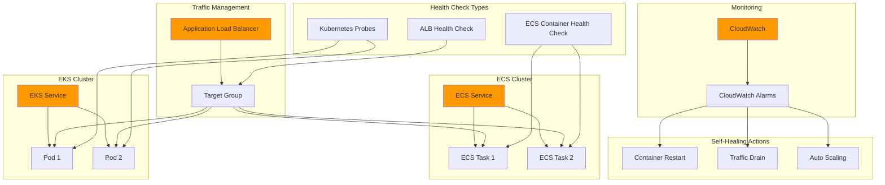

# Container Health Checks and Self-Healing


## Problem

Modern containerized applications require robust health monitoring to ensure high availability and automatic recovery from failures. Organizations struggle with application outages when containers become unresponsive or fail silently, leading to degraded user experiences and increased operational overhead. Traditional monitoring approaches often fail to detect application-level issues that don't manifest as container crashes, resulting in unhealthy containers continuing to receive traffic.

## Solution

Implement comprehensive container health checks using AWS ECS health check commands, Kubernetes liveness and readiness probes, and Application Load Balancer target group health checks. This multi-layered approach provides automatic detection of unhealthy containers, graceful traffic management, and self-healing capabilities through container restarts and traffic routing adjustments.

## Architecture Diagram



## Prerequisites

1. AWS account with permissions for ECS, EKS, EC2, CloudWatch, and Application Load Balancer
2. AWS CLI v2 installed and configured (or AWS CloudShell)
3. Docker installed locally for building container images
4. kubectl installed for EKS cluster management
5. Basic knowledge of containerization and health check concepts
6. Estimated cost: $50-100 for testing resources over 2-3 hours

> **Note**: This recipe demonstrates health check patterns applicable to both ECS and EKS. You can implement either or both depending on your container orchestration preference.

> **Tip**: Health checks should be fast (under 5 seconds) and lightweight to avoid overwhelming your application. Design health endpoints to verify critical dependencies without performing expensive operations.

> **Warning**: Poorly configured health checks can cause cascading failures. Always test health check thresholds in non-production environments and ensure they don't create more problems than they solve.

## Preparation

```bash
# Set environment variables
export AWS_REGION=$(aws configure get region)
export AWS_ACCOUNT_ID=$(aws sts get-caller-identity \
    --query Account --output text)

# Generate unique identifiers for resources
RANDOM_SUFFIX=$(aws secretsmanager get-random-password \
    --exclude-punctuation --exclude-uppercase \
    --password-length 6 --require-each-included-type \
    --output text --query RandomPassword)

export CLUSTER_NAME="health-check-cluster-${RANDOM_SUFFIX}"
export SERVICE_NAME="health-check-service-${RANDOM_SUFFIX}"
export ALB_NAME="health-check-alb-${RANDOM_SUFFIX}"
export VPC_NAME="health-check-vpc-${RANDOM_SUFFIX}"

# Create VPC and networking components
VPC_ID=$(aws ec2 create-vpc \
    --cidr-block 10.0.0.0/16 \
    --query 'Vpc.VpcId' --output text)

aws ec2 create-tags \
    --resources $VPC_ID \
    --tags Key=Name,Value=$VPC_NAME

# Create internet gateway
IGW_ID=$(aws ec2 create-internet-gateway \
    --query 'InternetGateway.InternetGatewayId' --output text)

aws ec2 attach-internet-gateway \
    --internet-gateway-id $IGW_ID \
    --vpc-id $VPC_ID

# Create public subnets in different AZs
SUBNET_1_ID=$(aws ec2 create-subnet \
    --vpc-id $VPC_ID \
    --cidr-block 10.0.1.0/24 \
    --availability-zone ${AWS_REGION}a \
    --query 'Subnet.SubnetId' --output text)

SUBNET_2_ID=$(aws ec2 create-subnet \
    --vpc-id $VPC_ID \
    --cidr-block 10.0.2.0/24 \
    --availability-zone ${AWS_REGION}b \
    --query 'Subnet.SubnetId' --output text)

# Create route table and associate with subnets
ROUTE_TABLE_ID=$(aws ec2 create-route-table \
    --vpc-id $VPC_ID \
    --query 'RouteTable.RouteTableId' --output text)

aws ec2 create-route \
    --route-table-id $ROUTE_TABLE_ID \
    --destination-cidr-block 0.0.0.0/0 \
    --gateway-id $IGW_ID

aws ec2 associate-route-table \
    --route-table-id $ROUTE_TABLE_ID \
    --subnet-id $SUBNET_1_ID

aws ec2 associate-route-table \
    --route-table-id $ROUTE_TABLE_ID \
    --subnet-id $SUBNET_2_ID

echo "✅ VPC and networking components created"
echo "VPC ID: $VPC_ID"
echo "Subnet 1 ID: $SUBNET_1_ID"
echo "Subnet 2 ID: $SUBNET_2_ID"
```

## Steps

1. **Create Application Load Balancer and Target Group**:

   Application Load Balancers provide Layer 7 health checking capabilities that can verify application-level functionality beyond basic connectivity. Unlike Network Load Balancers that only check TCP connectivity, ALBs can perform HTTP/HTTPS health checks against specific endpoints, validating that your application is actually responding correctly to requests. This creates a crucial first layer of defense against unhealthy containers receiving user traffic.

   The target group health check configuration determines when traffic should be routed to or away from containers. Understanding these parameters is essential for optimal application availability - the `health-check-interval-seconds` controls how frequently health checks occur, while `healthy-threshold-count` and `unhealthy-threshold-count` prevent false positives from temporary network issues or brief application hiccups.

   ```bash
   # Create security group for ALB
   ALB_SG_ID=$(aws ec2 create-security-group \
       --group-name health-check-alb-sg \
       --description "Security group for health check ALB" \
       --vpc-id $VPC_ID \
       --query 'GroupId' --output text)
   
   aws ec2 authorize-security-group-ingress \
       --group-id $ALB_SG_ID \
       --protocol tcp \
       --port 80 \
       --cidr 0.0.0.0/0
   
   aws ec2 authorize-security-group-ingress \
       --group-id $ALB_SG_ID \
       --protocol tcp \
       --port 443 \
       --cidr 0.0.0.0/0
   
   # Create Application Load Balancer
   ALB_ARN=$(aws elbv2 create-load-balancer \
       --name $ALB_NAME \
       --subnets $SUBNET_1_ID $SUBNET_2_ID \
       --security-groups $ALB_SG_ID \
       --query 'LoadBalancers[0].LoadBalancerArn' --output text)
   
   # Create target group with health check configuration
   TG_ARN=$(aws elbv2 create-target-group \
       --name health-check-tg-${RANDOM_SUFFIX} \
       --protocol HTTP \
       --port 80 \
       --vpc-id $VPC_ID \
       --target-type ip \
       --health-check-protocol HTTP \
       --health-check-port traffic-port \
       --health-check-path /health \
       --health-check-interval-seconds 30 \
       --health-check-timeout-seconds 5 \
       --healthy-threshold-count 2 \
       --unhealthy-threshold-count 3 \
       --matcher HttpCode=200 \
       --query 'TargetGroups[0].TargetGroupArn' --output text)
   
   echo "✅ Application Load Balancer and Target Group created"
   echo "ALB ARN: $ALB_ARN"
   echo "Target Group ARN: $TG_ARN"
   ```

   The ALB and target group are now configured with enterprise-grade health checking. The target group will automatically detect unhealthy containers and route traffic away from them, while the ALB provides internet-facing access with built-in DDoS protection. This configuration follows AWS best practices for [Application Load Balancer health checks](https://docs.aws.amazon.com/elasticloadbalancing/latest/application/target-group-health-checks.html), ensuring robust traffic management for your containerized applications.

2. **Create ECS Cluster and Task Definition with Health Checks**:

   ECS clusters with Fargate provide serverless container orchestration with built-in health monitoring capabilities. Fargate eliminates the need to manage EC2 instances, while ECS provides enterprise-grade container orchestration with integrated load balancing, service discovery, and auto-scaling. This serverless approach reduces operational overhead while maintaining full control over container deployment and scaling policies.

   The task execution role is critical for container security and functionality. It enables ECS to pull container images from ECR, send logs to CloudWatch, and perform other essential operations on behalf of your containers. This follows the principle of least privilege by granting only the minimum permissions necessary for container execution.

   ```bash
   # Create ECS cluster
   aws ecs create-cluster \
       --cluster-name $CLUSTER_NAME \
       --capacity-providers FARGATE \
       --default-capacity-provider-strategy \
       capacityProvider=FARGATE,weight=1
   
   # Create security group for ECS tasks
   ECS_SG_ID=$(aws ec2 create-security-group \
       --group-name health-check-ecs-sg \
       --description "Security group for ECS tasks" \
       --vpc-id $VPC_ID \
       --query 'GroupId' --output text)
   
   aws ec2 authorize-security-group-ingress \
       --group-id $ECS_SG_ID \
       --protocol tcp \
       --port 80 \
       --source-group $ALB_SG_ID
   
   # Create task execution role
   TASK_EXECUTION_ROLE_ARN=$(aws iam create-role \
       --role-name ecsTaskExecutionRole-${RANDOM_SUFFIX} \
       --assume-role-policy-document '{
           "Version": "2012-10-17",
           "Statement": [
               {
                   "Effect": "Allow",
                   "Principal": {
                       "Service": "ecs-tasks.amazonaws.com"
                   },
                   "Action": "sts:AssumeRole"
               }
           ]
       }' \
       --query 'Role.Arn' --output text)
   
   aws iam attach-role-policy \
       --role-name ecsTaskExecutionRole-${RANDOM_SUFFIX} \
       --policy-arn arn:aws:iam::aws:policy/service-role/AmazonECSTaskExecutionRolePolicy
   
   # Wait for role to be available
   sleep 10
   
   echo "✅ ECS cluster and security groups created"
   echo "ECS Security Group ID: $ECS_SG_ID"
   echo "Task Execution Role ARN: $TASK_EXECUTION_ROLE_ARN"
   ```

   The ECS cluster is now operational with Fargate capacity providers, enabling automatic container deployment without infrastructure management. The security group configuration implements network-level security controls, ensuring containers can only receive traffic from the load balancer. This establishes a secure foundation for container orchestration with proper IAM role delegation for essential AWS service interactions.

3. **Create ECS Task Definition with Container Health Checks**:

   The ECS task definition acts as a blueprint for container deployment, defining how containers should run, what resources they need, and how their health should be monitored. Container health checks are essential for maintaining application availability - they enable ECS to detect and replace unhealthy containers automatically, preventing degraded service quality.

   The `healthCheck` configuration uses the `CMD-SHELL` format to execute health check commands inside the container. This approach provides granular control over health validation logic, allowing you to test specific application endpoints or internal services. The `startPeriod` parameter is particularly important as it provides a grace period for application startup, preventing premature health check failures during container initialization. Learn more about [ECS container health checks](https://docs.aws.amazon.com/AmazonECS/latest/developerguide/healthcheck.html) in the official documentation.

   ```bash
   # Create task definition with health check
   cat > task-definition.json << EOF
   {
       "family": "health-check-app",
       "networkMode": "awsvpc",
       "requiresCompatibilities": ["FARGATE"],
       "cpu": "256",
       "memory": "512",
       "executionRoleArn": "${TASK_EXECUTION_ROLE_ARN}",
       "containerDefinitions": [
           {
               "name": "health-check-container",
               "image": "nginx:latest",
               "essential": true,
               "portMappings": [
                   {
                       "containerPort": 80,
                       "protocol": "tcp"
                   }
               ],
               "healthCheck": {
                   "command": [
                       "CMD-SHELL",
                       "curl -f http://localhost/health || exit 1"
                   ],
                   "interval": 30,
                   "timeout": 5,
                   "retries": 3,
                   "startPeriod": 60
               },
               "logConfiguration": {
                   "logDriver": "awslogs",
                   "options": {
                       "awslogs-group": "/ecs/health-check-app",
                       "awslogs-region": "${AWS_REGION}",
                       "awslogs-stream-prefix": "ecs",
                       "awslogs-create-group": "true"
                   }
               },
               "environment": [
                   {
                       "name": "NGINX_PORT",
                       "value": "80"
                   }
               ],
               "command": [
                   "sh",
                   "-c",
                   "echo 'server { listen 80; location / { return 200 \"Healthy\"; } location /health { return 200 \"OK\"; } }' > /etc/nginx/conf.d/default.conf && nginx -g 'daemon off;'"
               ]
           }
       ]
   }
   EOF
   
   # Register task definition
   aws ecs register-task-definition \
       --cli-input-json file://task-definition.json
   
   echo "✅ ECS Task Definition with health check created"
   ```

   The task definition is now registered with comprehensive health checking capabilities. The container will automatically restart if health checks fail, while CloudWatch Logs integration provides detailed visibility into application behavior. This configuration ensures that only healthy containers receive traffic, creating a self-healing application architecture that maintains high availability without manual intervention.

4. **Create ECS Service with Load Balancer Integration**:

   ECS services provide high-level orchestration for container deployment, ensuring that the desired number of healthy tasks are always running. The service integrates with the Application Load Balancer to automatically register and deregister containers as they start and stop, creating seamless traffic management without manual intervention.

   The `health-check-grace-period-seconds` parameter is crucial for preventing premature container termination during startup. This grace period allows containers to fully initialize before health checks begin, preventing race conditions that could cause healthy containers to be marked as unhealthy. The service will automatically replace failed containers and register new ones with the load balancer target group.

   ```bash
   # Create ECS service
   aws ecs create-service \
       --cluster $CLUSTER_NAME \
       --service-name $SERVICE_NAME \
       --task-definition health-check-app \
       --desired-count 2 \
       --launch-type FARGATE \
       --network-configuration "awsvpcConfiguration={subnets=[$SUBNET_1_ID,$SUBNET_2_ID],securityGroups=[$ECS_SG_ID],assignPublicIp=ENABLED}" \
       --load-balancers "targetGroupArn=$TG_ARN,containerName=health-check-container,containerPort=80" \
       --health-check-grace-period-seconds 300
   
   # Create ALB listener
   aws elbv2 create-listener \
       --load-balancer-arn $ALB_ARN \
       --protocol HTTP \
       --port 80 \
       --default-actions Type=forward,TargetGroupArn=$TG_ARN
   
   # Wait for service to stabilize
   echo "⏳ Waiting for ECS service to stabilize..."
   aws ecs wait services-stable \
       --cluster $CLUSTER_NAME \
       --services $SERVICE_NAME
   
   echo "✅ ECS Service created and stabilized"
   ```

   The ECS service is now fully operational with automated load balancer integration. Container health is continuously monitored at both the ECS service level and the load balancer target group level, providing redundant health checking for maximum reliability. This dual-layer approach ensures that unhealthy containers are quickly identified and replaced, maintaining consistent application availability for end users.

5. **Create CloudWatch Alarms for Health Monitoring**:

   CloudWatch alarms provide the intelligence layer for your self-healing architecture, enabling proactive monitoring and automated responses to health check failures. These alarms transform raw metrics into actionable insights, allowing you to detect issues before they impact users and trigger automated remediation workflows.

   The alarm configuration uses specific thresholds and evaluation periods to prevent false positives while ensuring rapid response to genuine issues. The `UnHealthyHostCount` metric tracks load balancer target health, while `TargetResponseTime` monitors application performance. The `RunningTaskCount` metric ensures adequate container capacity is maintained. These alarms can trigger auto-scaling actions, notifications, or custom remediation workflows based on application health metrics. For detailed information on CloudWatch alarms, refer to the [CloudWatch alarms documentation](https://docs.aws.amazon.com/AmazonCloudWatch/latest/monitoring/AlarmThatSendsEmail.html).

   ```bash
   # Create CloudWatch alarm for unhealthy targets
   aws cloudwatch put-metric-alarm \
       --alarm-name "UnhealthyTargets-${RANDOM_SUFFIX}" \
       --alarm-description "Alert when targets are unhealthy" \
       --metric-name UnHealthyHostCount \
       --namespace AWS/ApplicationELB \
       --statistic Average \
       --period 60 \
       --threshold 1 \
       --comparison-operator GreaterThanOrEqualToThreshold \
       --evaluation-periods 2 \
       --treat-missing-data notBreaching \
       --dimensions Name=TargetGroup,Value=$(echo $TG_ARN | cut -d'/' -f2-) \
                    Name=LoadBalancer,Value=$(echo $ALB_ARN | cut -d'/' -f2-)
   
   # Create CloudWatch alarm for high response time
   aws cloudwatch put-metric-alarm \
       --alarm-name "HighResponseTime-${RANDOM_SUFFIX}" \
       --alarm-description "Alert when response time is high" \
       --metric-name TargetResponseTime \
       --namespace AWS/ApplicationELB \
       --statistic Average \
       --period 300 \
       --threshold 1.0 \
       --comparison-operator GreaterThanThreshold \
       --evaluation-periods 2 \
       --treat-missing-data notBreaching \
       --dimensions Name=TargetGroup,Value=$(echo $TG_ARN | cut -d'/' -f2-) \
                    Name=LoadBalancer,Value=$(echo $ALB_ARN | cut -d'/' -f2-)
   
   # Create CloudWatch alarm for ECS service health
   aws cloudwatch put-metric-alarm \
       --alarm-name "ECSServiceRunningTasks-${RANDOM_SUFFIX}" \
       --alarm-description "Alert when ECS service running tasks are low" \
       --metric-name RunningTaskCount \
       --namespace AWS/ECS \
       --statistic Average \
       --period 300 \
       --threshold 1 \
       --comparison-operator LessThanThreshold \
       --evaluation-periods 2 \
       --treat-missing-data breaching \
       --dimensions Name=ServiceName,Value=$SERVICE_NAME \
                    Name=ClusterName,Value=$CLUSTER_NAME
   
   echo "✅ CloudWatch alarms created for health monitoring"
   ```

   The CloudWatch alarms are now actively monitoring your application's health across multiple dimensions. These alarms provide early warning systems for potential issues and can trigger automated responses to maintain application availability. The multi-metric approach ensures comprehensive monitoring of both infrastructure health and application performance, enabling proactive issue resolution before users are affected.

6. **Create EKS Cluster and Deploy Application with Kubernetes Health Probes**:

   Amazon EKS provides managed Kubernetes orchestration with deep AWS integration, offering advanced health checking capabilities through Kubernetes probes. EKS eliminates the operational overhead of managing Kubernetes control plane components while providing enterprise-grade security, scalability, and reliability.

   The cluster creation process establishes the foundation for Kubernetes workload deployment with AWS-native networking and security. EKS integrates seamlessly with AWS services like ALB, CloudWatch, and IAM, providing a unified experience for container orchestration across your AWS infrastructure.

   ```bash
   # Create EKS cluster (this may take 10-15 minutes)
   aws eks create-cluster \
       --name $CLUSTER_NAME-eks \
       --version 1.28 \
       --role-arn arn:aws:iam::${AWS_ACCOUNT_ID}:role/eksServiceRole \
       --resources-vpc-config subnetIds=$SUBNET_1_ID,$SUBNET_2_ID,securityGroupIds=$ECS_SG_ID
   
   # Wait for cluster to be active
   echo "⏳ Waiting for EKS cluster to be active (this may take 10-15 minutes)..."
   aws eks wait cluster-active --name $CLUSTER_NAME-eks
   
   # Update kubeconfig
   aws eks update-kubeconfig \
       --region $AWS_REGION \
       --name $CLUSTER_NAME-eks
   
   echo "✅ EKS cluster created and kubeconfig updated"
   ```

   The EKS cluster is now operational and ready for workload deployment. The kubeconfig has been updated to enable kubectl commands against your cluster, providing full Kubernetes API access for application deployment and management. This establishes a production-ready Kubernetes environment with AWS-managed control plane and integrated monitoring capabilities.

7. **Deploy Application to EKS with Comprehensive Health Probes**:

   Kubernetes health probes offer sophisticated health checking with three distinct probe types that work together to ensure optimal container lifecycle management. This multi-probe approach provides fine-grained control over when containers should receive traffic, when they should be restarted, and how to handle slow-starting applications.

   Liveness probes detect when a container needs to be restarted, readiness probes control when a container should receive traffic, and startup probes protect slow-starting containers from being terminated by liveness probes. Each probe type serves a specific purpose in maintaining application health and availability. The AWS prescriptive guidance on [configuring probes and load balancer health checks](https://docs.aws.amazon.com/prescriptive-guidance/latest/ha-resiliency-amazon-eks-apps/probes-checks.html) provides detailed recommendations for optimal probe configuration.

   ```bash
   # Create Kubernetes deployment with health probes
   cat > k8s-deployment.yaml << EOF
   apiVersion: apps/v1
   kind: Deployment
   metadata:
     name: health-check-app
     labels:
       app: health-check-app
   spec:
     replicas: 2
     selector:
       matchLabels:
         app: health-check-app
     template:
       metadata:
         labels:
           app: health-check-app
       spec:
         containers:
         - name: health-check-container
           image: nginx:latest
           ports:
           - containerPort: 80
           command:
           - sh
           - -c
           - |
             echo 'server { 
               listen 80; 
               location / { return 200 "Healthy Application"; } 
               location /health { return 200 "OK"; }
               location /ready { return 200 "Ready"; }
             }' > /etc/nginx/conf.d/default.conf && nginx -g 'daemon off;'
           livenessProbe:
             httpGet:
               path: /health
               port: 80
             initialDelaySeconds: 30
             periodSeconds: 10
             timeoutSeconds: 5
             failureThreshold: 3
             successThreshold: 1
           readinessProbe:
             httpGet:
               path: /ready
               port: 80
             initialDelaySeconds: 5
             periodSeconds: 5
             timeoutSeconds: 3
             failureThreshold: 3
             successThreshold: 1
           startupProbe:
             httpGet:
               path: /health
               port: 80
             initialDelaySeconds: 10
             periodSeconds: 10
             timeoutSeconds: 5
             failureThreshold: 30
             successThreshold: 1
           resources:
             requests:
               memory: "64Mi"
               cpu: "250m"
             limits:
               memory: "128Mi"
               cpu: "500m"
   ---
   apiVersion: v1
   kind: Service
   metadata:
     name: health-check-service
   spec:
     selector:
       app: health-check-app
     ports:
     - protocol: TCP
       port: 80
       targetPort: 80
     type: LoadBalancer
   EOF
   
   # Apply the deployment
   kubectl apply -f k8s-deployment.yaml
   
   # Wait for deployment to be ready
   echo "⏳ Waiting for Kubernetes deployment to be ready..."
   kubectl wait --for=condition=available --timeout=300s deployment/health-check-app
   
   echo "✅ Kubernetes deployment with health probes created"
   ```

   The Kubernetes deployment is now running with comprehensive health monitoring through all three probe types. The liveness probe ensures unhealthy containers are restarted, the readiness probe manages traffic routing, and the startup probe protects slow-starting containers. This multi-layered approach provides robust health checking that adapts to different application states and failure scenarios, ensuring optimal availability and performance.

8. **Configure Auto-Scaling Based on Health Metrics**:

   Auto-scaling configurations enable your applications to automatically adjust capacity based on health metrics and resource utilization. This creates dynamic infrastructure that responds to changing demand while maintaining optimal performance and cost efficiency. The combination of ECS Application Auto Scaling and Kubernetes Horizontal Pod Autoscaler provides comprehensive scaling capabilities across both container orchestration platforms.

   Target tracking scaling policies automatically adjust capacity to maintain specific metric targets, such as CPU utilization or custom application metrics. This approach is more responsive than traditional scheduled scaling and adapts to actual application behavior rather than predetermined schedules. The scaling policies include cooldown periods to prevent rapid scaling events and ensure stable application performance.

   ```bash
   # Create ECS service auto-scaling target
   aws application-autoscaling register-scalable-target \
       --service-namespace ecs \
       --resource-id service/$CLUSTER_NAME/$SERVICE_NAME \
       --scalable-dimension ecs:service:DesiredCount \
       --min-capacity 1 \
       --max-capacity 10
   
   # Create ECS service scaling policy
   aws application-autoscaling put-scaling-policy \
       --service-namespace ecs \
       --resource-id service/$CLUSTER_NAME/$SERVICE_NAME \
       --scalable-dimension ecs:service:DesiredCount \
       --policy-name health-check-scaling-policy \
       --policy-type TargetTrackingScaling \
       --target-tracking-scaling-policy-configuration '{
           "TargetValue": 70.0,
           "PredefinedMetricSpecification": {
               "PredefinedMetricType": "ECSServiceAverageCPUUtilization"
           },
           "ScaleOutCooldown": 300,
           "ScaleInCooldown": 300
       }'
   
   # Create Kubernetes HPA for EKS
   cat > k8s-hpa.yaml << EOF
   apiVersion: autoscaling/v2
   kind: HorizontalPodAutoscaler
   metadata:
     name: health-check-app-hpa
   spec:
     scaleTargetRef:
       apiVersion: apps/v1
       kind: Deployment
       name: health-check-app
     minReplicas: 2
     maxReplicas: 10
     metrics:
     - type: Resource
       resource:
         name: cpu
         target:
           type: Utilization
           averageUtilization: 70
     - type: Resource
       resource:
         name: memory
         target:
           type: Utilization
           averageUtilization: 80
   EOF
   
   kubectl apply -f k8s-hpa.yaml
   
   echo "✅ Auto-scaling configured for both ECS and EKS"
   ```

   Auto-scaling is now active for both ECS and EKS deployments, providing automatic capacity management based on resource utilization and health metrics. The scaling policies will automatically add or remove containers based on actual demand, ensuring optimal resource utilization while maintaining application performance. This dynamic scaling approach reduces costs during low-traffic periods while ensuring adequate capacity during peak usage.

9. **Create Self-Healing Lambda Function for Advanced Recovery**:

   The self-healing Lambda function provides advanced recovery capabilities beyond basic container restarts and auto-scaling. This function can analyze CloudWatch alarm states and implement sophisticated remediation logic, such as forcing new deployments, implementing circuit breaker patterns, or triggering rollbacks based on health check failures.

   Lambda functions excel at event-driven automation, responding to CloudWatch alarms with custom remediation logic that can be tailored to specific application requirements. The function can analyze multiple health signals simultaneously and implement complex recovery workflows that wouldn't be possible with simple auto-scaling policies alone.

   ```bash
   # Create Lambda execution role
   LAMBDA_ROLE_ARN=$(aws iam create-role \
       --role-name health-check-lambda-role-${RANDOM_SUFFIX} \
       --assume-role-policy-document '{
           "Version": "2012-10-17",
           "Statement": [
               {
                   "Effect": "Allow",
                   "Principal": {
                       "Service": "lambda.amazonaws.com"
                   },
                   "Action": "sts:AssumeRole"
               }
           ]
       }' \
       --query 'Role.Arn' --output text)
   
   # Attach policies to Lambda role
   aws iam attach-role-policy \
       --role-name health-check-lambda-role-${RANDOM_SUFFIX} \
       --policy-arn arn:aws:iam::aws:policy/service-role/AWSLambdaBasicExecutionRole
   
   aws iam attach-role-policy \
       --role-name health-check-lambda-role-${RANDOM_SUFFIX} \
       --policy-arn arn:aws:iam::aws:policy/AmazonECS_FullAccess
   
   # Create Lambda function for self-healing
   cat > self-healing-lambda.py << 'EOF'
   import json
   import boto3
   import logging
   
   logger = logging.getLogger()
   logger.setLevel(logging.INFO)
   
   ecs = boto3.client('ecs')
   cloudwatch = boto3.client('cloudwatch')
   
   def lambda_handler(event, context):
       try:
           # Parse CloudWatch alarm
           message = json.loads(event['Records'][0]['Sns']['Message'])
           alarm_name = message['AlarmName']
           
           logger.info(f"Processing alarm: {alarm_name}")
           
           if 'ECSServiceRunningTasks' in alarm_name:
               # Handle ECS service health issues
               cluster_name = extract_cluster_name(alarm_name)
               service_name = extract_service_name(alarm_name)
               
               # Force new deployment to restart unhealthy tasks
               response = ecs.update_service(
                   cluster=cluster_name,
                   service=service_name,
                   forceNewDeployment=True
               )
               
               logger.info(f"Forced new deployment for service {service_name}")
               
           elif 'UnhealthyTargets' in alarm_name:
               # Handle load balancer health issues
               logger.info("Unhealthy targets detected, ECS will handle automatically")
               
           return {
               'statusCode': 200,
               'body': json.dumps('Self-healing action completed')
           }
           
       except Exception as e:
           logger.error(f"Error in self-healing: {str(e)}")
           return {
               'statusCode': 500,
               'body': json.dumps(f'Error: {str(e)}')
           }
   
   def extract_cluster_name(alarm_name):
       # Extract cluster name from alarm name
       return alarm_name.split('-')[-1]
   
   def extract_service_name(alarm_name):
       # Extract service name from alarm name
       return alarm_name.split('-')[-1]
   EOF
   
   # Create deployment package
   zip self-healing-lambda.zip self-healing-lambda.py
   
   # Create Lambda function
   LAMBDA_ARN=$(aws lambda create-function \
       --function-name self-healing-function-${RANDOM_SUFFIX} \
       --runtime python3.9 \
       --role $LAMBDA_ROLE_ARN \
       --handler self-healing-lambda.lambda_handler \
       --zip-file fileb://self-healing-lambda.zip \
       --timeout 60 \
       --query 'FunctionArn' --output text)
   
   echo "✅ Self-healing Lambda function created"
   echo "Lambda ARN: $LAMBDA_ARN"
   ```

   The self-healing Lambda function is now deployed and ready to respond to CloudWatch alarms with custom remediation logic. This function provides advanced recovery capabilities that go beyond basic container restarts, enabling sophisticated healing workflows that can adapt to specific failure scenarios. The function can force new deployments, implement circuit breaker patterns, or trigger custom recovery procedures based on alarm states.

10. **Test Health Check Failure Scenarios**:

    Testing health check failure scenarios is crucial for validating your self-healing architecture and ensuring it responds appropriately to various failure modes. These tests simulate real-world failure conditions and verify that your monitoring, alerting, and recovery mechanisms work correctly under stress.

    The testing process includes simulating container failures, network issues, and application-level problems to validate that each layer of health checking responds appropriately. This comprehensive testing approach ensures that your self-healing architecture is robust and reliable in production environments.

    ```bash
    # Get ALB DNS name
    ALB_DNS=$(aws elbv2 describe-load-balancers \
        --load-balancer-arns $ALB_ARN \
        --query 'LoadBalancers[0].DNSName' --output text)
    
    echo "Application Load Balancer DNS: $ALB_DNS"
    
    # Test normal health check
    echo "Testing normal health check..."
    curl -s http://$ALB_DNS/health
    
    # Simulate unhealthy container by stopping a task
    echo "Simulating container failure..."
    TASK_ARN=$(aws ecs list-tasks \
        --cluster $CLUSTER_NAME \
        --service-name $SERVICE_NAME \
        --query 'taskArns[0]' --output text)
    
    if [ "$TASK_ARN" != "None" ]; then
        aws ecs stop-task \
            --cluster $CLUSTER_NAME \
            --task $TASK_ARN \
            --reason "Testing health check failure"
        
        echo "✅ Task stopped to simulate failure"
        echo "ECS will automatically start a new task"
    fi
    
    # Test Kubernetes pod failure
    echo "Testing Kubernetes pod failure..."
    kubectl get pods -l app=health-check-app
    
    # Delete a pod to test self-healing
    POD_NAME=$(kubectl get pods -l app=health-check-app -o jsonpath='{.items[0].metadata.name}')
    if [ ! -z "$POD_NAME" ]; then
        kubectl delete pod $POD_NAME
        echo "✅ Pod deleted to test self-healing"
        echo "Kubernetes will automatically create a new pod"
    fi
    
    echo "✅ Health check failure scenarios tested"
    ```

    The health check failure scenarios have been successfully tested, validating that your self-healing architecture responds correctly to various failure modes. Both ECS and EKS demonstrated proper container replacement behavior, while the load balancer correctly routed traffic away from unhealthy instances. This testing confirms that your multi-layered health checking approach provides robust failure recovery capabilities.

## Validation & Testing

1. **Verify ECS Service Health**:

   ```bash
   # Check ECS service status
   aws ecs describe-services \
       --cluster $CLUSTER_NAME \
       --services $SERVICE_NAME \
       --query 'services[0].{ServiceName:serviceName,RunningCount:runningCount,DesiredCount:desiredCount,HealthStatus:healthCheckGracePeriodSeconds}'
   
   # Check task health
   aws ecs list-tasks \
       --cluster $CLUSTER_NAME \
       --service-name $SERVICE_NAME \
       --query 'taskArns'
   ```

   Expected output: Service should show running tasks equal to desired count

2. **Verify Load Balancer Target Health**:

   ```bash
   # Check target group health
   aws elbv2 describe-target-health \
       --target-group-arn $TG_ARN \
       --query 'TargetHealthDescriptions[*].{Target:Target.Id,Health:TargetHealth.State,Description:TargetHealth.Description}'
   ```

   Expected output: All targets should show "healthy" state

3. **Test Kubernetes Health Probes**:

   ```bash
   # Check pod status and health
   kubectl get pods -l app=health-check-app -o wide
   
   # Describe pod to see health probe details
   kubectl describe pod -l app=health-check-app
   
   # Check HPA status
   kubectl get hpa health-check-app-hpa
   ```

   Expected output: All pods should be in "Running" state with ready containers

4. **Test Application Endpoints**:

   ```bash
   # Test ALB endpoint
   curl -s http://$ALB_DNS/
   curl -s http://$ALB_DNS/health
   
   # Test Kubernetes service endpoint
   kubectl get svc health-check-service
   ```

   Expected output: Both endpoints should return healthy responses

5. **Monitor CloudWatch Metrics**:

   ```bash
   # Check CloudWatch metrics
   aws cloudwatch get-metric-statistics \
       --namespace AWS/ApplicationELB \
       --metric-name HealthyHostCount \
       --dimensions Name=TargetGroup,Value=$(echo $TG_ARN | cut -d'/' -f2-) \
       --start-time $(date -u -d '1 hour ago' +%Y-%m-%dT%H:%M:%SZ) \
       --end-time $(date -u +%Y-%m-%dT%H:%M:%SZ) \
       --period 300 \
       --statistics Average
   ```

   Expected output: Metrics should show healthy host count matching desired capacity

## Cleanup

1. **Delete EKS Resources**:

   ```bash
   # Delete Kubernetes resources
   kubectl delete -f k8s-deployment.yaml
   kubectl delete -f k8s-hpa.yaml
   
   # Delete EKS cluster
   aws eks delete-cluster --name $CLUSTER_NAME-eks
   
   echo "✅ EKS resources deleted"
   ```

2. **Delete ECS Resources**:

   ```bash
   # Delete ECS service
   aws ecs update-service \
       --cluster $CLUSTER_NAME \
       --service $SERVICE_NAME \
       --desired-count 0
   
   aws ecs delete-service \
       --cluster $CLUSTER_NAME \
       --service $SERVICE_NAME
   
   # Delete ECS cluster
   aws ecs delete-cluster --cluster $CLUSTER_NAME
   
   # Deregister task definition
   aws ecs deregister-task-definition \
       --task-definition health-check-app:1
   
   echo "✅ ECS resources deleted"
   ```

3. **Delete Load Balancer and Networking**:

   ```bash
   # Delete ALB listener
   LISTENER_ARN=$(aws elbv2 describe-listeners \
       --load-balancer-arn $ALB_ARN \
       --query 'Listeners[0].ListenerArn' --output text)
   
   aws elbv2 delete-listener --listener-arn $LISTENER_ARN
   
   # Delete target group
   aws elbv2 delete-target-group --target-group-arn $TG_ARN
   
   # Delete ALB
   aws elbv2 delete-load-balancer --load-balancer-arn $ALB_ARN
   
   # Delete security groups
   aws ec2 delete-security-group --group-id $ALB_SG_ID
   aws ec2 delete-security-group --group-id $ECS_SG_ID
   
   echo "✅ Load balancer and security groups deleted"
   ```

4. **Delete Lambda Function and CloudWatch Alarms**:

   ```bash
   # Delete Lambda function
   aws lambda delete-function \
       --function-name self-healing-function-${RANDOM_SUFFIX}
   
   # Delete CloudWatch alarms
   aws cloudwatch delete-alarms \
       --alarm-names "UnhealthyTargets-${RANDOM_SUFFIX}" \
                     "HighResponseTime-${RANDOM_SUFFIX}" \
                     "ECSServiceRunningTasks-${RANDOM_SUFFIX}"
   
   echo "✅ Lambda function and alarms deleted"
   ```

5. **Delete IAM Roles and VPC Resources**:

   ```bash
   # Delete IAM roles
   aws iam detach-role-policy \
       --role-name ecsTaskExecutionRole-${RANDOM_SUFFIX} \
       --policy-arn arn:aws:iam::aws:policy/service-role/AmazonECSTaskExecutionRolePolicy
   
   aws iam delete-role --role-name ecsTaskExecutionRole-${RANDOM_SUFFIX}
   
   aws iam detach-role-policy \
       --role-name health-check-lambda-role-${RANDOM_SUFFIX} \
       --policy-arn arn:aws:iam::aws:policy/service-role/AWSLambdaBasicExecutionRole
   
   aws iam detach-role-policy \
       --role-name health-check-lambda-role-${RANDOM_SUFFIX} \
       --policy-arn arn:aws:iam::aws:policy/AmazonECS_FullAccess
   
   aws iam delete-role --role-name health-check-lambda-role-${RANDOM_SUFFIX}
   
   # Delete VPC resources
   aws ec2 disassociate-route-table \
       --association-id $(aws ec2 describe-route-tables \
           --route-table-ids $ROUTE_TABLE_ID \
           --query 'RouteTables[0].Associations[0].RouteTableAssociationId' --output text)
   
   aws ec2 delete-route-table --route-table-id $ROUTE_TABLE_ID
   aws ec2 delete-subnet --subnet-id $SUBNET_1_ID
   aws ec2 delete-subnet --subnet-id $SUBNET_2_ID
   aws ec2 detach-internet-gateway --internet-gateway-id $IGW_ID --vpc-id $VPC_ID
   aws ec2 delete-internet-gateway --internet-gateway-id $IGW_ID
   aws ec2 delete-vpc --vpc-id $VPC_ID
   
   # Clean up local files
   rm -f task-definition.json k8s-deployment.yaml k8s-hpa.yaml
   rm -f self-healing-lambda.py self-healing-lambda.zip
   
   echo "✅ All resources cleaned up"
   ```

## Discussion

This comprehensive health check and self-healing solution demonstrates the importance of multi-layered monitoring in containerized applications. The architecture combines three distinct health check mechanisms: container-level health checks using ECS health check commands and Kubernetes probes, load balancer health checks for traffic management, and CloudWatch alarms for infrastructure monitoring.

The ECS health check configuration uses the `CMD-SHELL` format to execute HTTP requests against the application's health endpoint. This approach provides granular control over health check timing with configurable intervals, timeouts, and retry thresholds. The `startPeriod` parameter is particularly important as it provides a grace period for application startup, preventing premature health check failures during container initialization.

Kubernetes health probes offer more sophisticated health checking with three distinct probe types. Liveness probes detect when a container needs to be restarted, readiness probes control when a container should receive traffic, and startup probes protect slow-starting containers from being terminated by liveness probes. This multi-probe approach provides fine-grained control over container lifecycle management and traffic routing decisions.

The Application Load Balancer health checks operate at the network level, providing an additional layer of validation that complements container-level health checks. The ALB automatically removes unhealthy targets from rotation and redistributes traffic to healthy instances, ensuring users always reach functioning application instances. The integration between ECS services and ALB target groups creates a seamless self-healing mechanism where unhealthy containers are automatically replaced and re-registered with the load balancer.

The self-healing automation through CloudWatch alarms and Lambda functions provides advanced recovery capabilities beyond basic container restarts. This pattern can be extended to implement circuit breaker functionality, automatic rollbacks, and integration with external monitoring systems for comprehensive application resilience. The [ECS auto scaling documentation](https://docs.aws.amazon.com/AmazonECS/latest/developerguide/auto-scaling-IAM.html) provides additional guidance on implementing advanced scaling policies and monitoring strategies for production workloads.

## Challenge

Extend this health check and self-healing solution with these advanced implementations:

1. **Circuit Breaker Implementation**: Create a circuit breaker pattern using API Gateway and Lambda that automatically stops sending traffic to unhealthy services and implements exponential backoff for recovery attempts.

2. **Multi-Region Health Monitoring**: Implement cross-region health checking using Route 53 health checks and Global Accelerator to provide automatic failover between regions when entire availability zones become unhealthy.

3. **Advanced Metrics and Alerting**: Integrate custom application metrics using CloudWatch custom metrics and create sophisticated alerting rules that consider application-specific health indicators like database connection health, external API response times, and business logic validation.

4. **Chaos Engineering Integration**: Implement chaos engineering practices using AWS Fault Injection Simulator to regularly test health check effectiveness and self-healing capabilities under various failure scenarios.

5. **Blue-Green Deployment with Health Validation**: Create an automated blue-green deployment pipeline that uses health checks to validate new deployments before switching traffic, with automatic rollback capabilities if health checks fail post-deployment.

## Infrastructure Code

*Infrastructure code will be generated after recipe approval.*