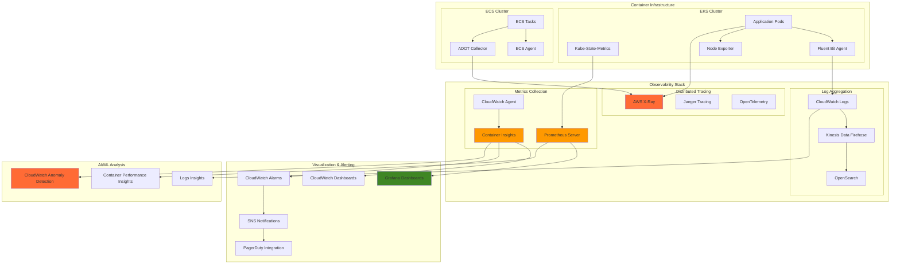

# Container Observability and Performance Monitoring

## Problem

Enterprise container environments running across EKS and ECS face critical observability challenges with limited visibility into application performance, infrastructure health, and resource utilization patterns. Traditional monitoring approaches fail to provide the granular metrics, distributed tracing, and real-time alerting needed for complex microservices architectures. Without comprehensive observability, teams struggle to identify performance bottlenecks, troubleshoot incidents, optimize resource allocation, and maintain SLAs across containerized applications spanning multiple clusters and services.

## Solution

This recipe implements a comprehensive observability platform combining CloudWatch Container Insights, AWS X-Ray distributed tracing, Prometheus metrics collection, and custom performance monitoring dashboards. The solution provides end-to-end visibility from infrastructure metrics to application-level performance data, enabling proactive monitoring, automated alerting, and performance optimization across both EKS and ECS container environments with enterprise-grade observability practices.

## Architecture Diagram



## Prerequisites

1. AWS account with EKS, ECS, CloudWatch, X-Ray, and OpenSearch permissions
2. AWS CLI v2 installed and configured (version 2.15.0 or later)
3. kubectl and eksctl installed for EKS management
4. Helm v3 installed for Kubernetes package management
5. Docker installed for container image management
6. Advanced understanding of container orchestration, metrics, and observability concepts
7. Estimated cost: $300-500 for 5 hours including EKS/ECS clusters, CloudWatch usage, and OpenSearch

> **Note**: This recipe deploys comprehensive monitoring infrastructure that will generate significant CloudWatch metrics and logs, impacting costs proportional to the scale of monitoring data. For detailed cost optimization strategies, see the [AWS Cost Management documentation](https://docs.aws.amazon.com/awsaccountbilling/latest/aboutv2/cost-alloc-tags.html).

## Preparation

```bash
# Set environment variables
export AWS_REGION=$(aws configure get region)
export AWS_ACCOUNT_ID=$(aws sts get-caller-identity \
    --query Account --output text)

# Generate unique identifier
RANDOM_SUFFIX=$(aws secretsmanager get-random-password \
    --exclude-punctuation --exclude-uppercase \
    --password-length 6 --require-each-included-type \
    --output text --query RandomPassword)

export EKS_CLUSTER_NAME="observability-eks-${RANDOM_SUFFIX}"
export ECS_CLUSTER_NAME="observability-ecs-${RANDOM_SUFFIX}"
export MONITORING_NAMESPACE="monitoring"
export OPENSEARCH_DOMAIN="container-logs-${RANDOM_SUFFIX}"

# Create CloudWatch log groups for container logs
aws logs create-log-group \
    --log-group-name "/aws/eks/${EKS_CLUSTER_NAME}/application" \
    --retention-in-days 30

aws logs create-log-group \
    --log-group-name "/aws/ecs/${ECS_CLUSTER_NAME}/application" \
    --retention-in-days 30

aws logs create-log-group \
    --log-group-name "/aws/containerinsights/${EKS_CLUSTER_NAME}/application" \
    --retention-in-days 30

# Create SNS topic for alerts
aws sns create-topic --name "container-observability-alerts"
export SNS_TOPIC_ARN=$(aws sns get-topic-attributes \
    --topic-arn arn:aws:sns:${AWS_REGION}:${AWS_ACCOUNT_ID}:container-observability-alerts \
    --query 'Attributes.TopicArn' --output text)

echo "✅ Observability infrastructure preparation completed"
```

## Steps

1. **Create Enhanced EKS Cluster with Container Insights**:

   Amazon EKS provides a managed Kubernetes service that integrates seamlessly with AWS observability services. [Container Insights with enhanced observability](https://docs.aws.amazon.com/AmazonCloudWatch/latest/monitoring/container-insights-detailed-metrics.html) collects granular health, performance, and status metrics up to the container level, including control plane metrics. This enhanced mode provides significantly more detailed metrics than the standard version, enabling deeper visibility into cluster performance and resource utilization patterns for enterprise workloads.

   ```bash
   # Create EKS cluster with enhanced observability
   cat > eks-observability-config.yaml << EOF
   apiVersion: eksctl.io/v1alpha5
   kind: ClusterConfig
   
   metadata:
     name: ${EKS_CLUSTER_NAME}
     region: ${AWS_REGION}
     version: "1.33"
   
   cloudWatch:
     clusterLogging:
       enable:
         - api
         - audit
         - authenticator
         - controllerManager
         - scheduler
       logRetentionInDays: 30
   
   managedNodeGroups:
     - name: observability-nodes
       instanceType: t3.large
       minSize: 3
       maxSize: 6
       desiredCapacity: 3
       volumeSize: 50
       privateNetworking: true
       labels:
         role: observability
       tags:
         Environment: observability
         Monitoring: enabled
       iam:
         withAddonPolicies:
           autoScaler: true
           cloudWatch: true
           xray: true
   
   addons:
     - name: vpc-cni
       version: latest
     - name: coredns
       version: latest
     - name: kube-proxy
       version: latest
     - name: aws-ebs-csi-driver
       version: latest
   
   iam:
     withOIDC: true
     serviceAccounts:
       - metadata:
           name: cloudwatch-agent
           namespace: amazon-cloudwatch
         wellKnownPolicies:
           cloudWatch: true
       - metadata:
           name: fluent-bit
           namespace: amazon-cloudwatch
         wellKnownPolicies:
           cloudWatch: true
       - metadata:
           name: aws-for-fluent-bit
           namespace: amazon-cloudwatch
         wellKnownPolicies:
           cloudWatch: true
   EOF
   
   # Create the EKS cluster
   eksctl create cluster -f eks-observability-config.yaml
   
   echo "✅ EKS cluster with enhanced observability created"
   ```

   The EKS cluster is now configured with Kubernetes 1.33 and CloudWatch logging for all control plane components. The cluster includes IAM service accounts with appropriate permissions for monitoring services and enhanced observability capabilities. This enables comprehensive data collection from both the Kubernetes control plane and worker nodes, providing the foundation for enterprise-grade container observability.

2. **Deploy Container Insights with Enhanced Observability**:

   Container Insights provides automated discovery and monitoring of containerized applications across EKS clusters. The enhanced observability mode collects additional metrics beyond the standard set, including detailed pod-level CPU and memory utilization, network I/O, and filesystem metrics. This comprehensive metric collection enables detailed performance analysis, capacity planning, and troubleshooting of containerized workloads at both the infrastructure and application levels.

   ```bash
   # Install Container Insights with enhanced observability
   curl -O https://raw.githubusercontent.com/aws-samples/amazon-cloudwatch-container-insights/latest/k8s-deployment-manifest-templates/deployment-mode/daemonset/container-insights-monitoring/quickstart/cwagent-fluent-bit-quickstart.yaml
   
   # Replace cluster name and region in the manifest
   sed -i.bak "s/{{cluster_name}}/${EKS_CLUSTER_NAME}/g" \
       cwagent-fluent-bit-quickstart.yaml
   sed -i.bak "s/{{region_name}}/${AWS_REGION}/g" \
       cwagent-fluent-bit-quickstart.yaml
   
   # Apply Container Insights
   kubectl apply -f cwagent-fluent-bit-quickstart.yaml
   
   # Install enhanced observability version
   kubectl apply -f https://raw.githubusercontent.com/aws-samples/amazon-cloudwatch-container-insights/latest/k8s-deployment-manifest-templates/deployment-mode/daemonset/container-insights-monitoring/cwagent/cwagent-serviceaccount.yaml
   
   curl -O https://raw.githubusercontent.com/aws-samples/amazon-cloudwatch-container-insights/latest/k8s-deployment-manifest-templates/deployment-mode/daemonset/container-insights-monitoring/cwagent/cwagent-configmap.yaml
   sed -i.bak "s/{{cluster_name}}/${EKS_CLUSTER_NAME}/g" \
       cwagent-configmap.yaml
   kubectl apply -f cwagent-configmap.yaml
   
   curl -O https://raw.githubusercontent.com/aws-samples/amazon-cloudwatch-container-insights/latest/k8s-deployment-manifest-templates/deployment-mode/daemonset/container-insights-monitoring/cwagent/cwagent-daemonset.yaml
   kubectl apply -f cwagent-daemonset.yaml
   
   echo "✅ Container Insights with enhanced observability deployed"
   ```

   Container Insights is now actively collecting enhanced metrics from all pods and nodes in your EKS cluster. The CloudWatch agent and Fluent Bit are deployed as DaemonSets, ensuring comprehensive coverage across all worker nodes. This provides real-time visibility into container resource utilization, performance bottlenecks, and application health metrics with significantly more granular data than standard monitoring.

3. **Install Prometheus and Grafana Stack**:

   [Prometheus](https://prometheus.io/) provides time-series metrics collection with powerful querying capabilities, while Grafana offers advanced visualization and dashboarding. This combination complements AWS CloudWatch by providing Kubernetes-native monitoring, custom metrics collection, and flexible alerting rules. The integration enables both cloud-native and open-source monitoring approaches, giving teams flexibility in metric collection, visualization, and alerting strategies for their containerized workloads.

   ```bash
   # Add Prometheus Helm repository
   helm repo add prometheus-community \
       https://prometheus-community.github.io/helm-charts
   helm repo add grafana https://grafana.github.io/helm-charts
   helm repo update
   
   # Create monitoring namespace
   kubectl create namespace ${MONITORING_NAMESPACE}
   
   # Install Prometheus with comprehensive configuration
   cat > prometheus-values.yaml << EOF
   server:
     global:
       scrape_interval: 15s
       evaluation_interval: 15s
     persistentVolume:
       enabled: true
       size: 50Gi
     retention: "30d"
     
   serverFiles:
     prometheus.yml:
       global:
         scrape_interval: 15s
         evaluation_interval: 15s
       scrape_configs:
         - job_name: 'kubernetes-apiservers'
           kubernetes_sd_configs:
           - role: endpoints
           scheme: https
           tls_config:
             ca_file: /var/run/secrets/kubernetes.io/serviceaccount/ca.crt
           bearer_token_file: /var/run/secrets/kubernetes.io/serviceaccount/token
           relabel_configs:
           - source_labels: [__meta_kubernetes_namespace, __meta_kubernetes_service_name, __meta_kubernetes_endpoint_port_name]
             action: keep
             regex: default;kubernetes;https
             
         - job_name: 'kubernetes-nodes'
           kubernetes_sd_configs:
           - role: node
           scheme: https
           tls_config:
             ca_file: /var/run/secrets/kubernetes.io/serviceaccount/ca.crt
           bearer_token_file: /var/run/secrets/kubernetes.io/serviceaccount/token
           relabel_configs:
           - action: labelmap
             regex: __meta_kubernetes_node_label_(.+)
             
         - job_name: 'kubernetes-cadvisor'
           kubernetes_sd_configs:
           - role: node
           scheme: https
           path: /metrics/cadvisor
           tls_config:
             ca_file: /var/run/secrets/kubernetes.io/serviceaccount/ca.crt
           bearer_token_file: /var/run/secrets/kubernetes.io/serviceaccount/token
           relabel_configs:
           - action: labelmap
             regex: __meta_kubernetes_node_label_(.+)
             
   alertmanager:
     enabled: true
     persistentVolume:
       enabled: true
       size: 10Gi
       
   nodeExporter:
     enabled: true
     
   kubeStateMetrics:
     enabled: true
   EOF
   
   helm install prometheus prometheus-community/prometheus \
       --namespace ${MONITORING_NAMESPACE} \
       --values prometheus-values.yaml
   
   # Install Grafana with CloudWatch data source
   cat > grafana-values.yaml << EOF
   adminPassword: "observability123!"
   
   persistence:
     enabled: true
     size: 10Gi
     
   service:
     type: LoadBalancer
     
   datasources:
     datasources.yaml:
       apiVersion: 1
       datasources:
       - name: Prometheus
         type: prometheus
         url: http://prometheus-server:80
         access: proxy
         isDefault: true
       - name: CloudWatch
         type: cloudwatch
         jsonData:
           authType: default
           defaultRegion: ${AWS_REGION}
           
   dashboardProviders:
     dashboardproviders.yaml:
       apiVersion: 1
       providers:
       - name: 'container-observability'
         orgId: 1
         folder: 'Container Observability'
         type: file
         disableDeletion: false
         editable: true
         options:
           path: /var/lib/grafana/dashboards/container-observability
           
   dashboards:
     container-observability:
       kubernetes-cluster-overview:
         gnetId: 7249
         revision: 1
         datasource: Prometheus
       kubernetes-pod-overview:
         gnetId: 6417
         revision: 1
         datasource: Prometheus
       aws-ecs-overview:
         gnetId: 551
         revision: 1
         datasource: CloudWatch
   EOF
   
   helm install grafana grafana/grafana \
       --namespace ${MONITORING_NAMESPACE} \
       --values grafana-values.yaml
   
   echo "✅ Prometheus and Grafana observability stack deployed"
   ```

   The Prometheus and Grafana stack is now operational, providing comprehensive metrics collection from Kubernetes API servers, nodes, and cAdvisor. Grafana is configured with both Prometheus and CloudWatch data sources, enabling unified visualization of metrics from multiple sources. This hybrid approach maximizes observability coverage while maintaining cost efficiency and provides teams with familiar open-source tooling alongside AWS services.

4. **Deploy AWS Distro for OpenTelemetry (ADOT)**:

   [AWS Distro for OpenTelemetry](https://aws-otel.github.io/docs/introduction) is a secure, production-ready, AWS-supported distribution of the OpenTelemetry project. ADOT provides a standardized way to collect telemetry data from applications and infrastructure, supporting metrics, traces, and logs. This step deploys the ADOT collector to gather enhanced container metrics and traces, enabling unified observability across hybrid environments and providing vendor-neutral telemetry collection that follows industry standards.

   ```bash
   # Install ADOT operator
   kubectl apply -f https://github.com/aws-observability/aws-otel-operator/releases/latest/download/opentelemetry-operator.yaml
   
   # Wait for operator to be ready
   kubectl wait --for=condition=available --timeout=300s \
       deployment/opentelemetry-operator-controller-manager \
       -n opentelemetry-operator-system
   
   # Create ADOT collector configuration
   cat > adot-collector-config.yaml << EOF
   apiVersion: opentelemetry.io/v1alpha1
   kind: OpenTelemetryCollector
   metadata:
     name: adot-container-collector
     namespace: ${MONITORING_NAMESPACE}
   spec:
     mode: daemonset
     serviceAccount: adot-collector
     config: |
       receivers:
         awscontainerinsightreceiver:
           collection_interval: 60s
           container_orchestrator: eks
           add_service_as_attribute: true
           prefer_full_pod_name: false
           add_full_pod_name_metric_label: false
         
         awsecscontainermetrics:
           collection_interval: 20s
         
         prometheus:
           config:
             scrape_configs:
               - job_name: 'kubernetes-pods'
                 kubernetes_sd_configs:
                   - role: pod
                 relabel_configs:
                   - source_labels: [__meta_kubernetes_pod_annotation_prometheus_io_scrape]
                     action: keep
                     regex: true
                   - source_labels: [__meta_kubernetes_pod_annotation_prometheus_io_path]
                     action: replace
                     target_label: __metrics_path__
                     regex: (.+)
       
       processors:
         batch:
           timeout: 60s
         
         resourcedetection:
           detectors: [env, eks]
           timeout: 2s
           override: false
         
         metricstransform:
           transforms:
             - include: .*
               match_type: regexp
               action: update
               operations:
                 - action: add_label
                   new_label: cluster_name
                   new_value: ${EKS_CLUSTER_NAME}
       
       exporters:
         awscloudwatchmetrics:
           region: ${AWS_REGION}
           namespace: AWS/ContainerInsights/Enhanced
           dimension_rollup_option: NoDimensionRollup
           metric_declarations:
             - dimensions: [[ClusterName], [ClusterName, Namespace], [ClusterName, Namespace, PodName]]
               metric_name_selectors: 
                 - pod_cpu_utilization
                 - pod_memory_utilization
                 - pod_network_rx_bytes
                 - pod_network_tx_bytes
                 - pod_cpu_usage_total
                 - pod_memory_working_set
             - dimensions: [[ClusterName], [ClusterName, Namespace], [ClusterName, Namespace, Service]]
               metric_name_selectors:
                 - service_cpu_utilization
                 - service_memory_utilization
         
         awsxray:
           region: ${AWS_REGION}
         
         logging:
           loglevel: debug
       
       service:
         pipelines:
           metrics:
             receivers: [awscontainerinsightreceiver, prometheus]
             processors: [resourcedetection, metricstransform, batch]
             exporters: [awscloudwatchmetrics]
           
           traces:
             receivers: [awsxray]
             processors: [resourcedetection, batch]
             exporters: [awsxray]
   EOF
   
   # Create service account for ADOT collector
   eksctl create iamserviceaccount \
       --cluster=${EKS_CLUSTER_NAME} \
       --namespace=${MONITORING_NAMESPACE} \
       --name=adot-collector \
       --attach-policy-arn=arn:aws:iam::aws:policy/CloudWatchAgentServerPolicy \
       --attach-policy-arn=arn:aws:iam::aws:policy/AWSXRayDaemonWriteAccess \
       --override-existing-serviceaccounts \
       --approve
   
   # Deploy ADOT collector
   kubectl apply -f adot-collector-config.yaml
   
   echo "✅ ADOT collector deployed for enhanced observability"
   ```

   The ADOT collector is now running as a DaemonSet across all worker nodes, collecting enhanced container metrics and traces using OpenTelemetry standards. This provides standardized telemetry collection that can be exported to multiple backends, enabling unified observability across different environments and reducing vendor lock-in while maintaining seamless AWS service integration.

5. **Create ECS Cluster with Enhanced Monitoring**:

   [Amazon ECS](https://docs.aws.amazon.com/AmazonECS/latest/developerguide/what-is-ecs.html) provides a fully managed container orchestration service that integrates natively with AWS observability services. Container Insights for ECS automatically collects metrics and logs from containers and services, providing detailed visibility into resource utilization, performance, and health. This step creates an ECS cluster with enhanced monitoring capabilities to demonstrate observability across both EKS and ECS environments.

   ```bash
   # Create ECS cluster with Container Insights
   aws ecs create-cluster \
       --cluster-name ${ECS_CLUSTER_NAME} \
       --capacity-providers EC2 FARGATE \
       --default-capacity-provider-strategy \
       capacityProvider=FARGATE,weight=1 \
       --settings name=containerInsights,value=enabled \
       --tags key=Environment,value=observability \
              key=Monitoring,value=enabled
   
   # Create task execution role for ECS tasks
   cat > ecs-task-execution-role.json << EOF
   {
       "Version": "2012-10-17",
       "Statement": [
           {
               "Effect": "Allow",
               "Principal": {
                   "Service": "ecs-tasks.amazonaws.com"
               },
               "Action": "sts:AssumeRole"
           }
       ]
   }
   EOF
   
   aws iam create-role \
       --role-name "ecsTaskExecutionRole-${RANDOM_SUFFIX}" \
       --assume-role-policy-document file://ecs-task-execution-role.json
   
   aws iam attach-role-policy \
       --role-name "ecsTaskExecutionRole-${RANDOM_SUFFIX}" \
       --policy-arn arn:aws:iam::aws:policy/service-role/AmazonECSTaskExecutionRolePolicy
   
   aws iam attach-role-policy \
       --role-name "ecsTaskExecutionRole-${RANDOM_SUFFIX}" \
       --policy-arn arn:aws:iam::aws:policy/CloudWatchLogsFullAccess
   
   aws iam attach-role-policy \
       --role-name "ecsTaskExecutionRole-${RANDOM_SUFFIX}" \
       --policy-arn arn:aws:iam::aws:policy/AWSXRayDaemonWriteAccess
   
   export ECS_TASK_EXECUTION_ROLE_ARN=$(aws iam get-role \
       --role-name "ecsTaskExecutionRole-${RANDOM_SUFFIX}" \
       --query 'Role.Arn' --output text)
   
   echo "✅ ECS cluster with Container Insights created"
   ```

   The ECS cluster is now configured with Container Insights enabled, providing automatic metrics collection from tasks and services running on Fargate. The task execution role includes necessary permissions for CloudWatch logs and X-Ray tracing, enabling comprehensive observability for containerized applications running on the fully managed ECS platform.

6. **Deploy Sample Applications with Observability**:

   Deploying instrumented sample applications demonstrates how observability works in practice with real workloads. The EKS application includes [AWS X-Ray](https://docs.aws.amazon.com/xray/latest/devguide/xray-concepts.html) sidecar containers for distributed tracing, Prometheus metrics endpoints, and proper resource limits for accurate monitoring. The ECS application showcases the [AWS Distro for OpenTelemetry](https://docs.aws.amazon.com/AmazonCloudWatch/latest/monitoring/Container-Insights-EKS-otel.html) integration, providing standardized telemetry collection across different container orchestration platforms.

   ```bash
   # Deploy sample EKS application with observability
   cat > eks-sample-app.yaml << EOF
   apiVersion: apps/v1
   kind: Deployment
   metadata:
     name: observability-demo-app
     namespace: default
     labels:
       app: observability-demo
   spec:
     replicas: 3
     selector:
       matchLabels:
         app: observability-demo
     template:
       metadata:
         labels:
           app: observability-demo
         annotations:
           prometheus.io/scrape: "true"
           prometheus.io/port: "8080"
           prometheus.io/path: "/metrics"
       spec:
         containers:
         - name: app
           image: nginx:1.25-alpine
           ports:
           - containerPort: 80
           - containerPort: 8080
             name: metrics
           resources:
             requests:
               cpu: 100m
               memory: 128Mi
             limits:
               cpu: 500m
               memory: 512Mi
           env:
           - name: AWS_XRAY_TRACING_NAME
             value: "observability-demo"
           - name: AWS_XRAY_DAEMON_ADDRESS
             value: "xray-daemon:2000"
           livenessProbe:
             httpGet:
               path: /
               port: 80
             initialDelaySeconds: 30
             periodSeconds: 10
           readinessProbe:
             httpGet:
               path: /
               port: 80
             initialDelaySeconds: 5
             periodSeconds: 5
         - name: xray-sidecar
           image: amazon/aws-xray-daemon:latest
           command:
           - /xray
           - -o
           - -b
           - 0.0.0.0:2000
           ports:
           - containerPort: 2000
             protocol: UDP
           resources:
             requests:
               cpu: 50m
               memory: 64Mi
             limits:
               cpu: 100m
               memory: 128Mi
   ---
   apiVersion: v1
   kind: Service
   metadata:
     name: observability-demo-service
     labels:
       app: observability-demo
   spec:
     selector:
       app: observability-demo
     ports:
     - name: http
       port: 80
       targetPort: 80
     - name: metrics
       port: 8080
       targetPort: 8080
     type: LoadBalancer
   EOF
   
   kubectl apply -f eks-sample-app.yaml
   
   # Deploy ECS sample application with ADOT sidecar
   cat > ecs-task-definition.json << EOF
   {
       "family": "observability-demo-task",
       "networkMode": "awsvpc",
       "requiresCompatibilities": ["FARGATE"],
       "cpu": "512",
       "memory": "1024",
       "executionRoleArn": "${ECS_TASK_EXECUTION_ROLE_ARN}",
       "taskRoleArn": "${ECS_TASK_EXECUTION_ROLE_ARN}",
       "containerDefinitions": [
           {
               "name": "app",
               "image": "nginx:latest",
               "essential": true,
               "portMappings": [
                   {
                       "containerPort": 80,
                       "protocol": "tcp"
                   }
               ],
               "logConfiguration": {
                   "logDriver": "awslogs",
                   "options": {
                       "awslogs-group": "/aws/ecs/${ECS_CLUSTER_NAME}/application",
                       "awslogs-region": "${AWS_REGION}",
                       "awslogs-stream-prefix": "app"
                   }
               },
               "environment": [
                   {
                       "name": "AWS_XRAY_TRACING_NAME",
                       "value": "ecs-observability-demo"
                   }
               ]
           },
           {
               "name": "aws-otel-collector",
               "image": "public.ecr.aws/aws-observability/aws-otel-collector:latest",
               "essential": false,
               "logConfiguration": {
                   "logDriver": "awslogs",
                   "options": {
                       "awslogs-group": "/aws/ecs/${ECS_CLUSTER_NAME}/application",
                       "awslogs-region": "${AWS_REGION}",
                       "awslogs-stream-prefix": "otel-collector"
                   }
               },
               "environment": [
                   {
                       "name": "AWS_REGION",
                       "value": "${AWS_REGION}"
                   }
               ]
           }
       ]
   }
   EOF
   
   # Register ECS task definition
   aws ecs register-task-definition \
       --cli-input-json file://ecs-task-definition.json
   
   # Get default VPC and subnet for ECS service
   DEFAULT_VPC=$(aws ec2 describe-vpcs \
       --filters "Name=isDefault,Values=true" \
       --query 'Vpcs[0].VpcId' --output text)
   
   DEFAULT_SUBNET=$(aws ec2 describe-subnets \
       --filters "Name=vpc-id,Values=${DEFAULT_VPC}" \
       --query 'Subnets[0].SubnetId' --output text)
   
   DEFAULT_SG=$(aws ec2 describe-security-groups \
       --filters "Name=vpc-id,Values=${DEFAULT_VPC}" \
       "Name=group-name,Values=default" \
       --query 'SecurityGroups[0].GroupId' --output text)
   
   # Create ECS service
   aws ecs create-service \
       --cluster ${ECS_CLUSTER_NAME} \
       --service-name observability-demo-service \
       --task-definition observability-demo-task \
       --desired-count 2 \
       --launch-type FARGATE \
       --network-configuration "awsvpcConfiguration={subnets=[${DEFAULT_SUBNET}],securityGroups=[${DEFAULT_SG}],assignPublicIp=ENABLED}"
   
   echo "✅ Sample applications deployed with comprehensive observability"
   ```

   The sample applications are now running with full observability instrumentation. The EKS application exposes Prometheus metrics and includes X-Ray tracing sidecars for distributed tracing visibility, while the ECS application demonstrates ADOT integration for standardized telemetry collection. These applications will generate metrics, logs, and traces that demonstrate the complete observability stack in action across both orchestration platforms.

7. **Configure Advanced CloudWatch Alarms and Anomaly Detection**:

   [CloudWatch Alarms](https://docs.aws.amazon.com/AmazonCloudWatch/latest/monitoring/AlarmThatSendsEmail.html) provide threshold-based monitoring and automated responses to metric changes. [Anomaly Detection](https://docs.aws.amazon.com/AmazonCloudWatch/latest/monitoring/CloudWatch_Anomaly_Detection.html) uses machine learning to identify unusual patterns in metrics without requiring manual threshold configuration. This combination enables both reactive and predictive monitoring capabilities, reducing alert fatigue while ensuring critical issues are detected early in containerized environments.

   ```bash
   # Create CloudWatch alarms for container metrics
   aws cloudwatch put-metric-alarm \
       --alarm-name "EKS-High-CPU-Utilization" \
       --alarm-description "High CPU utilization in EKS cluster" \
       --metric-name "pod_cpu_utilization" \
       --namespace "AWS/ContainerInsights" \
       --statistic Average \
       --period 300 \
       --threshold 80 \
       --comparison-operator GreaterThanThreshold \
       --dimensions Name=ClusterName,Value=${EKS_CLUSTER_NAME} \
       --evaluation-periods 2 \
       --alarm-actions ${SNS_TOPIC_ARN} \
       --ok-actions ${SNS_TOPIC_ARN}
   
   aws cloudwatch put-metric-alarm \
       --alarm-name "EKS-High-Memory-Utilization" \
       --alarm-description "High memory utilization in EKS cluster" \
       --metric-name "pod_memory_utilization" \
       --namespace "AWS/ContainerInsights" \
       --statistic Average \
       --period 300 \
       --threshold 80 \
       --comparison-operator GreaterThanThreshold \
       --dimensions Name=ClusterName,Value=${EKS_CLUSTER_NAME} \
       --evaluation-periods 2 \
       --alarm-actions ${SNS_TOPIC_ARN}
   
   aws cloudwatch put-metric-alarm \
       --alarm-name "ECS-Service-Unhealthy-Tasks" \
       --alarm-description "Unhealthy tasks in ECS service" \
       --metric-name "RunningTaskCount" \
       --namespace "AWS/ECS" \
       --statistic Average \
       --period 300 \
       --threshold 1 \
       --comparison-operator LessThanThreshold \
       --dimensions Name=ServiceName,Value=observability-demo-service \
                    Name=ClusterName,Value=${ECS_CLUSTER_NAME} \
       --evaluation-periods 2 \
       --alarm-actions ${SNS_TOPIC_ARN}
   
   # Enable CloudWatch anomaly detection
   aws cloudwatch put-anomaly-detector \
       --namespace "AWS/ContainerInsights" \
       --metric-name "pod_cpu_utilization" \
       --dimensions Name=ClusterName,Value=${EKS_CLUSTER_NAME} \
       --stat Average
   
   aws cloudwatch put-anomaly-detector \
       --namespace "AWS/ContainerInsights" \
       --metric-name "pod_memory_utilization" \
       --dimensions Name=ClusterName,Value=${EKS_CLUSTER_NAME} \
       --stat Average
   
   # Create anomaly detection alarms
   aws cloudwatch put-metric-alarm \
       --alarm-name "EKS-CPU-Anomaly-Detection" \
       --alarm-description "CPU utilization anomaly detection" \
       --comparison-operator LessThanLowerOrGreaterThanUpperThreshold \
       --evaluation-periods 2 \
       --metrics '[
         {
           "Id": "m1",
           "ReturnData": true,
           "MetricStat": {
             "Metric": {
               "Namespace": "AWS/ContainerInsights",
               "MetricName": "pod_cpu_utilization",
               "Dimensions": [
                 {
                   "Name": "ClusterName",
                   "Value": "'${EKS_CLUSTER_NAME}'"
                 }
               ]
             },
             "Period": 300,
             "Stat": "Average"
           }
         },
         {
           "Id": "ad1",
           "Expression": "ANOMALY_DETECTION_FUNCTION(m1, 2)"
         }
       ]' \
       --threshold-metric-id ad1 \
       --alarm-actions ${SNS_TOPIC_ARN}
   
   echo "✅ Advanced CloudWatch alarms and anomaly detection configured"
   ```

   CloudWatch alarms are now monitoring critical container metrics with both threshold-based and anomaly detection capabilities. The anomaly detection models will learn normal patterns over time, improving accuracy and reducing false positives. This provides comprehensive alerting that adapts to changing workload patterns while maintaining sensitivity to genuine performance issues.

8. **Deploy Custom Performance Monitoring Dashboard**:

   [CloudWatch Dashboards](https://docs.aws.amazon.com/AmazonCloudWatch/latest/monitoring/CloudWatch_Dashboards.html) provide centralized visualization of metrics, logs, and alarms across AWS services. Custom dashboards enable teams to create role-specific views of system health, combining infrastructure metrics, application performance data, and business metrics in a single interface. This step creates a comprehensive dashboard that provides at-a-glance visibility into container performance, resource utilization, and operational health.

   ```bash
   # Create comprehensive CloudWatch dashboard
   cat > container-observability-dashboard.json << EOF
   {
       "widgets": [
           {
               "type": "metric",
               "x": 0,
               "y": 0,
               "width": 12,
               "height": 6,
               "properties": {
                   "metrics": [
                       [ "AWS/ContainerInsights", "pod_cpu_utilization", "ClusterName", "${EKS_CLUSTER_NAME}" ],
                       [ ".", "pod_memory_utilization", ".", "." ]
                   ],
                   "view": "timeSeries",
                   "stacked": false,
                   "region": "${AWS_REGION}",
                   "title": "EKS Pod Resource Utilization",
                   "period": 300,
                   "yAxis": {
                       "left": {
                           "min": 0,
                           "max": 100
                       }
                   }
               }
           },
           {
               "type": "metric",
               "x": 12,
               "y": 0,
               "width": 12,
               "height": 6,
               "properties": {
                   "metrics": [
                       [ "AWS/ECS", "CPUUtilization", "ServiceName", "observability-demo-service", "ClusterName", "${ECS_CLUSTER_NAME}" ],
                       [ ".", "MemoryUtilization", ".", ".", ".", "." ]
                   ],
                   "view": "timeSeries",
                   "stacked": false,
                   "region": "${AWS_REGION}",
                   "title": "ECS Service Resource Utilization",
                   "period": 300
               }
           },
           {
               "type": "metric",
               "x": 0,
               "y": 6,
               "width": 12,
               "height": 6,
               "properties": {
                   "metrics": [
                       [ "AWS/ContainerInsights", "pod_network_rx_bytes", "ClusterName", "${EKS_CLUSTER_NAME}" ],
                       [ ".", "pod_network_tx_bytes", ".", "." ]
                   ],
                   "view": "timeSeries",
                   "stacked": false,
                   "region": "${AWS_REGION}",
                   "title": "EKS Network I/O",
                   "period": 300
               }
           },
           {
               "type": "metric",
               "x": 12,
               "y": 6,
               "width": 12,
               "height": 6,
               "properties": {
                   "metrics": [
                       [ "AWS/ECS", "RunningTaskCount", "ServiceName", "observability-demo-service", "ClusterName", "${ECS_CLUSTER_NAME}" ],
                       [ ".", "PendingTaskCount", ".", ".", ".", "." ]
                   ],
                   "view": "timeSeries",
                   "stacked": false,
                   "region": "${AWS_REGION}",
                   "title": "ECS Task Counts",
                   "period": 300
               }
           },
           {
               "type": "log",
               "x": 0,
               "y": 12,
               "width": 24,
               "height": 6,
               "properties": {
                   "query": "SOURCE '/aws/containerinsights/${EKS_CLUSTER_NAME}/application' | fields @timestamp, log\n| filter @message like /ERROR/\n| sort @timestamp desc\n| limit 20",
                   "region": "${AWS_REGION}",
                   "title": "Recent Application Errors",
                   "view": "table"
               }
           }
       ]
   }
   EOF
   
   # Create the dashboard
   aws cloudwatch put-dashboard \
       --dashboard-name "Container-Observability-${RANDOM_SUFFIX}" \
       --dashboard-body file://container-observability-dashboard.json
   
   echo "✅ Comprehensive observability dashboard created"
   ```

   The custom dashboard now provides unified visibility across both EKS and ECS environments, displaying real-time metrics, historical trends, and log insights. This centralized view enables rapid identification of performance issues, resource bottlenecks, and operational anomalies across the entire containerized infrastructure.

9. **Configure Log Analytics with OpenSearch**:

   [Amazon OpenSearch Service](https://docs.aws.amazon.com/opensearch-service/latest/developerguide/what-is.html) provides powerful log analytics capabilities with full-text search, aggregations, and visualization. Integrating OpenSearch with container logs enables complex queries across application logs, infrastructure events, and security data. This step demonstrates how to create a comprehensive log analytics pipeline that complements CloudWatch Logs with advanced search and analysis capabilities.

   ```bash
   # Create OpenSearch domain for log analytics
   cat > opensearch-domain.json << EOF
   {
       "DomainName": "${OPENSEARCH_DOMAIN}",
       "EngineVersion": "OpenSearch_2.17",
       "ClusterConfig": {
           "InstanceType": "t3.small.search",
           "InstanceCount": 3,
           "DedicatedMasterEnabled": false
       },
       "EBSOptions": {
           "EBSEnabled": true,
           "VolumeType": "gp3",
           "VolumeSize": 20
       },
       "AccessPolicies": "{\"Version\":\"2012-10-17\",\"Statement\":[{\"Effect\":\"Allow\",\"Principal\":{\"AWS\":\"*\"},\"Action\":\"es:*\",\"Resource\":\"arn:aws:es:${AWS_REGION}:${AWS_ACCOUNT_ID}:domain/${OPENSEARCH_DOMAIN}/*\"}]}",
       "EncryptionAtRestOptions": {
           "Enabled": true
       },
       "NodeToNodeEncryptionOptions": {
           "Enabled": true
       },
       "DomainEndpointOptions": {
           "EnforceHTTPS": true
       }
   }
   EOF
   
   # Create OpenSearch domain
   aws opensearch create-domain \
       --cli-input-json file://opensearch-domain.json
   
   # Wait for domain to be ready
   echo "Waiting for OpenSearch domain to be ready (this may take 10-15 minutes)..."
   aws opensearch wait domain-ready --domain-name ${OPENSEARCH_DOMAIN}
   
   # Get OpenSearch endpoint
   export OPENSEARCH_ENDPOINT=$(aws opensearch describe-domain \
       --domain-name ${OPENSEARCH_DOMAIN} \
       --query 'DomainStatus.Endpoint' --output text)
   
   echo "✅ OpenSearch domain configured for log analytics"
   echo "OpenSearch endpoint: https://${OPENSEARCH_ENDPOINT}"
   ```

   The OpenSearch domain is now ready to receive container logs for advanced analytics and search capabilities. The domain uses the latest OpenSearch 2.17 version with encryption at rest and in transit enabled. This provides a secure foundation for log analytics that can handle complex queries across application logs, infrastructure events, and performance data.

10. **Implement Performance Optimization Recommendations**:

    Automated performance optimization demonstrates how observability data can drive actionable improvements in containerized environments. By analyzing metrics patterns and resource utilization trends, automated systems can identify optimization opportunities, recommend resource adjustments, and even implement changes automatically. This approach enables continuous optimization of container resource allocation, cost efficiency, and application performance based on real-world usage patterns.

    ```bash
    # Create performance optimization Lambda function
    cat > performance-optimizer.py << 'EOF'
    import json
    import boto3
    from datetime import datetime, timedelta
    
    def lambda_handler(event, context):
        cloudwatch = boto3.client('cloudwatch')
        ecs_client = boto3.client('ecs')
        
        # Get performance metrics for the last hour
        end_time = datetime.utcnow()
        start_time = end_time - timedelta(hours=1)
        
        # Get CPU utilization metrics
        try:
            cpu_metrics = cloudwatch.get_metric_statistics(
                Namespace='AWS/ContainerInsights',
                MetricName='pod_cpu_utilization',
                Dimensions=[
                    {'Name': 'ClusterName', 'Value': '${EKS_CLUSTER_NAME}'}
                ],
                StartTime=start_time,
                EndTime=end_time,
                Period=300,
                Statistics=['Average', 'Maximum']
            )
        except Exception as e:
            print(f"Error retrieving metrics: {e}")
            return {
                'statusCode': 500,
                'body': json.dumps({'error': str(e)})
            }
        
        recommendations = []
        
        # Analyze CPU utilization
        if cpu_metrics['Datapoints']:
            avg_cpu = sum(point['Average'] for point in cpu_metrics['Datapoints']) / len(cpu_metrics['Datapoints'])
            max_cpu = max(point['Maximum'] for point in cpu_metrics['Datapoints'])
            
            if avg_cpu < 20:
                recommendations.append({
                    'type': 'DOWNSIZE_CPU',
                    'message': f'Average CPU utilization is {avg_cpu:.1f}%. Consider reducing CPU requests.',
                    'severity': 'MEDIUM'
                })
            elif max_cpu > 90:
                recommendations.append({
                    'type': 'UPSIZE_CPU',
                    'message': f'Maximum CPU utilization reached {max_cpu:.1f}%. Consider increasing CPU limits.',
                    'severity': 'HIGH'
                })
        
        # Return optimization recommendations
        return {
            'statusCode': 200,
            'body': json.dumps({
                'recommendations': recommendations,
                'timestamp': datetime.utcnow().isoformat()
            })
        }
    EOF
    
    # Create ZIP file for Lambda function
    zip performance-optimizer.zip performance-optimizer.py
    
    # Create Lambda execution role
    cat > lambda-execution-role.json << EOF
    {
        "Version": "2012-10-17",
        "Statement": [
            {
                "Effect": "Allow",
                "Principal": {
                    "Service": "lambda.amazonaws.com"
                },
                "Action": "sts:AssumeRole"
            }
        ]
    }
    EOF
    
    aws iam create-role \
        --role-name "PerformanceOptimizerRole-${RANDOM_SUFFIX}" \
        --assume-role-policy-document file://lambda-execution-role.json
    
    aws iam attach-role-policy \
        --role-name "PerformanceOptimizerRole-${RANDOM_SUFFIX}" \
        --policy-arn arn:aws:iam::aws:policy/service-role/AWSLambdaBasicExecutionRole
    
    aws iam attach-role-policy \
        --role-name "PerformanceOptimizerRole-${RANDOM_SUFFIX}" \
        --policy-arn arn:aws:iam::aws:policy/CloudWatchReadOnlyAccess
    
    # Wait for role to propagate
    sleep 10
    
    # Create Lambda function
    aws lambda create-function \
        --function-name "container-performance-optimizer" \
        --runtime python3.12 \
        --role "arn:aws:iam::${AWS_ACCOUNT_ID}:role/PerformanceOptimizerRole-${RANDOM_SUFFIX}" \
        --handler performance-optimizer.lambda_handler \
        --zip-file fileb://performance-optimizer.zip \
        --timeout 60
    
    # Create EventBridge rule to trigger optimization analysis
    aws events put-rule \
        --name "container-performance-analysis" \
        --schedule-expression "rate(1 hour)" \
        --description "Trigger container performance optimization analysis"
    
    aws events put-targets \
        --rule "container-performance-analysis" \
        --targets "Id"="1","Arn"="arn:aws:lambda:${AWS_REGION}:${AWS_ACCOUNT_ID}:function:container-performance-optimizer"
    
    aws lambda add-permission \
        --function-name "container-performance-optimizer" \
        --statement-id "allow-eventbridge" \
        --action "lambda:InvokeFunction" \
        --principal events.amazonaws.com \
        --source-arn "arn:aws:events:${AWS_REGION}:${AWS_ACCOUNT_ID}:rule/container-performance-analysis"
    
    echo "✅ Performance optimization automation implemented"
    ```

    The performance optimization system is now analyzing container metrics and generating actionable recommendations for resource optimization. The Lambda function runs hourly using EventBridge to identify over-provisioned or under-provisioned containers, helping teams maintain optimal resource allocation while minimizing costs and maximizing performance through data-driven insights.

## Validation & Testing

1. **Verify Container Insights Data Collection**:

   ```bash
   # Check Container Insights metrics in CloudWatch
   aws cloudwatch list-metrics \
       --namespace "AWS/ContainerInsights" \
       --dimensions Name=ClusterName,Value=${EKS_CLUSTER_NAME}
   
   # Verify ECS Container Insights
   aws cloudwatch list-metrics \
       --namespace "AWS/ECS" \
       --dimensions Name=ClusterName,Value=${ECS_CLUSTER_NAME}
   ```

   Expected output: Multiple container metrics should be available including CPU, memory, and network metrics.

2. **Test Prometheus Metrics Collection**:

   ```bash
   # Port forward to Prometheus server
   kubectl port-forward -n ${MONITORING_NAMESPACE} \
       svc/prometheus-server 9090:80 &
   
   # Query Prometheus metrics
   curl -s "http://localhost:9090/api/v1/query?query=up" | jq .
   
   # Stop port forward
   pkill -f "kubectl port-forward"
   ```

3. **Validate Grafana Dashboards**:

   ```bash
   # Get Grafana load balancer URL
   GRAFANA_URL=$(kubectl get svc -n ${MONITORING_NAMESPACE} grafana \
       -o jsonpath='{.status.loadBalancer.ingress[0].hostname}')
   
   echo "Grafana URL: http://${GRAFANA_URL}"
   echo "Username: admin"
   echo "Password: observability123!"
   ```

4. **Test X-Ray Tracing**:

   ```bash
   # Generate some traffic to create traces
   APP_URL=$(kubectl get svc observability-demo-service \
       -o jsonpath='{.status.loadBalancer.ingress[0].hostname}')
   
   for i in {1..20}; do
       curl -s http://${APP_URL} > /dev/null
       sleep 1
   done
   
   # Check X-Ray traces
   aws xray get-trace-summaries \
       --time-range-type TimeRangeByStartTime \
       --start-time $(date -u -d '1 hour ago' +%Y-%m-%dT%H:%M:%S) \
       --end-time $(date -u +%Y-%m-%dT%H:%M:%S)
   ```

5. **Verify Alerting Configuration**:

   ```bash
   # List configured alarms
   aws cloudwatch describe-alarms \
       --alarm-names "EKS-High-CPU-Utilization" \
                     "EKS-High-Memory-Utilization" \
                     "ECS-Service-Unhealthy-Tasks"
   
   # Check anomaly detectors
   aws cloudwatch describe-anomaly-detectors \
       --namespace "AWS/ContainerInsights"
   ```

## Cleanup

1. **Remove Sample Applications**:

   ```bash
   # Delete EKS applications
   kubectl delete -f eks-sample-app.yaml
   
   # Delete ECS service and task definition
   aws ecs update-service \
       --cluster ${ECS_CLUSTER_NAME} \
       --service observability-demo-service \
       --desired-count 0
   
   aws ecs wait services-stable \
       --cluster ${ECS_CLUSTER_NAME} \
       --services observability-demo-service
   
   aws ecs delete-service \
       --cluster ${ECS_CLUSTER_NAME} \
       --service observability-demo-service
   
   echo "✅ Sample applications removed"
   ```

2. **Remove Monitoring Stack**:

   ```bash
   # Uninstall Grafana and Prometheus
   helm uninstall grafana -n ${MONITORING_NAMESPACE}
   helm uninstall prometheus -n ${MONITORING_NAMESPACE}
   
   # Remove ADOT collector
   kubectl delete -f adot-collector-config.yaml
   kubectl delete -f https://github.com/aws-observability/aws-otel-operator/releases/latest/download/opentelemetry-operator.yaml
   
   # Remove Container Insights
   kubectl delete -f cwagent-fluent-bit-quickstart.yaml
   kubectl delete -f cwagent-daemonset.yaml
   kubectl delete -f cwagent-configmap.yaml
   
   echo "✅ Monitoring stack removed"
   ```

3. **Delete CloudWatch Resources**:

   ```bash
   # Delete CloudWatch alarms
   aws cloudwatch delete-alarms \
       --alarm-names "EKS-High-CPU-Utilization" \
                     "EKS-High-Memory-Utilization" \
                     "ECS-Service-Unhealthy-Tasks" \
                     "EKS-CPU-Anomaly-Detection"
   
   # Delete anomaly detectors
   aws cloudwatch delete-anomaly-detector \
       --namespace "AWS/ContainerInsights" \
       --metric-name "pod_cpu_utilization" \
       --dimensions Name=ClusterName,Value=${EKS_CLUSTER_NAME} \
       --stat Average
   
   aws cloudwatch delete-anomaly-detector \
       --namespace "AWS/ContainerInsights" \
       --metric-name "pod_memory_utilization" \
       --dimensions Name=ClusterName,Value=${EKS_CLUSTER_NAME} \
       --stat Average
   
   # Delete dashboard
   aws cloudwatch delete-dashboards \
       --dashboard-names "Container-Observability-${RANDOM_SUFFIX}"
   
   echo "✅ CloudWatch resources removed"
   ```

4. **Remove AWS Infrastructure**:

   ```bash
   # Delete Lambda function and EventBridge rule
   aws events remove-targets \
       --rule "container-performance-analysis" \
       --ids "1"
   
   aws events delete-rule \
       --name "container-performance-analysis"
   
   aws lambda delete-function \
       --function-name "container-performance-optimizer"
   
   # Delete OpenSearch domain
   aws opensearch delete-domain \
       --domain-name ${OPENSEARCH_DOMAIN}
   
   # Delete ECS cluster
   aws ecs delete-cluster \
       --cluster ${ECS_CLUSTER_NAME}
   
   # Delete EKS cluster
   eksctl delete cluster --name ${EKS_CLUSTER_NAME}
   
   echo "✅ AWS infrastructure removed"
   ```

5. **Clean Up IAM and Local Resources**:

   ```bash
   # Delete IAM roles
   aws iam detach-role-policy \
       --role-name "ecsTaskExecutionRole-${RANDOM_SUFFIX}" \
       --policy-arn arn:aws:iam::aws:policy/service-role/AmazonECSTaskExecutionRolePolicy
   
   aws iam detach-role-policy \
       --role-name "ecsTaskExecutionRole-${RANDOM_SUFFIX}" \
       --policy-arn arn:aws:iam::aws:policy/CloudWatchLogsFullAccess
   
   aws iam detach-role-policy \
       --role-name "ecsTaskExecutionRole-${RANDOM_SUFFIX}" \
       --policy-arn arn:aws:iam::aws:policy/AWSXRayDaemonWriteAccess
   
   aws iam delete-role \
       --role-name "ecsTaskExecutionRole-${RANDOM_SUFFIX}"
   
   aws iam detach-role-policy \
       --role-name "PerformanceOptimizerRole-${RANDOM_SUFFIX}" \
       --policy-arn arn:aws:iam::aws:policy/service-role/AWSLambdaBasicExecutionRole
   
   aws iam detach-role-policy \
       --role-name "PerformanceOptimizerRole-${RANDOM_SUFFIX}" \
       --policy-arn arn:aws:iam::aws:policy/CloudWatchReadOnlyAccess
   
   aws iam delete-role \
       --role-name "PerformanceOptimizerRole-${RANDOM_SUFFIX}"
   
   # Delete SNS topic
   aws sns delete-topic \
       --topic-arn ${SNS_TOPIC_ARN}
   
   # Delete CloudWatch log groups
   aws logs delete-log-group \
       --log-group-name "/aws/eks/${EKS_CLUSTER_NAME}/application"
   
   aws logs delete-log-group \
       --log-group-name "/aws/ecs/${ECS_CLUSTER_NAME}/application"
   
   aws logs delete-log-group \
       --log-group-name "/aws/containerinsights/${EKS_CLUSTER_NAME}/application"
   
   # Clean up local files
   rm -f eks-observability-config.yaml cwagent-*.yaml
   rm -f prometheus-values.yaml grafana-values.yaml
   rm -f adot-collector-config.yaml eks-sample-app.yaml
   rm -f ecs-task-*.json container-observability-dashboard.json
   rm -f opensearch-domain.json
   rm -f performance-optimizer.py performance-optimizer.zip
   rm -f ecs-task-execution-role.json lambda-execution-role.json
   
   echo "✅ Complete cleanup performed successfully"
   ```

## Discussion

Comprehensive container observability requires a multi-layered approach that combines infrastructure monitoring, application performance management, and log analytics to provide complete visibility into containerized environments. This recipe demonstrates how to implement enterprise-grade observability using AWS native services combined with open-source tools like Prometheus and Grafana to create a robust monitoring ecosystem that scales with container deployments.

The architecture leverages CloudWatch Container Insights with enhanced observability to collect granular metrics at the container level, providing deep visibility into resource utilization, performance trends, and application health. The integration with AWS X-Ray enables distributed tracing across microservices, helping teams understand request flows, identify bottlenecks, and troubleshoot performance issues in complex container architectures. The combination of these AWS services with Prometheus provides both cloud-native and Kubernetes-native monitoring capabilities, following the [AWS Well-Architected Framework](https://docs.aws.amazon.com/wellarchitected/latest/framework/welcome.html) principles for operational excellence.

The observability stack includes automated anomaly detection using CloudWatch's machine learning capabilities to identify unusual patterns in container behavior without manual threshold configuration. This approach reduces alert fatigue while ensuring critical issues are detected early. The integration with OpenSearch provides advanced log analytics capabilities, enabling complex queries across containerized application logs and infrastructure events for comprehensive troubleshooting and forensic analysis.

Performance optimization automation through Lambda functions demonstrates how to build self-healing and self-optimizing container environments. By analyzing metrics patterns and generating actionable recommendations, teams can proactively optimize resource allocation, improve cost efficiency, and maintain optimal application performance. The use of EventBridge for scheduled analysis ensures continuous optimization without manual intervention, enabling true operational excellence in container management as outlined in the [CloudWatch Custom Metrics documentation](https://docs.aws.amazon.com/AmazonCloudWatch/latest/monitoring/publishingMetrics.html).

> **Tip**: Implement custom business metrics alongside infrastructure metrics to correlate application performance with business outcomes and enable SLA-driven alerting strategies. This approach enables teams to move beyond simple infrastructure monitoring to true business-impact observability.

## Challenge

Extend this solution by implementing these enhancements:

1. **Multi-Cloud Observability**: Extend the monitoring stack to include containers running on other cloud providers or on-premises Kubernetes clusters with federated Prometheus and centralized alerting through Amazon Managed Service for Prometheus.

2. **Advanced AIOps Integration**: Implement machine learning-based root cause analysis using Amazon DevOps Guru and custom ML models to automatically correlate metrics, logs, and traces for faster incident resolution and predictive maintenance.

3. **Cost Optimization Intelligence**: Build advanced cost analytics that correlate container resource usage with business metrics to provide ROI-based optimization recommendations and automatic rightsizing using AWS Cost Explorer APIs.

4. **Security Observability**: Integrate container security monitoring with runtime threat detection using AWS GuardDuty, Falco, and custom security event correlation to provide comprehensive security visibility across the container lifecycle.

5. **Chaos Engineering Integration**: Implement chaos engineering experiments with automated monitoring validation to test system resilience and improve observability coverage of failure scenarios using AWS Fault Injection Simulator.

## Infrastructure Code

### Available Infrastructure as Code:

- [Infrastructure Code Overview](code/README.md) - Detailed description of all infrastructure components
- [AWS CDK (Python)](code/cdk-python/) - AWS CDK Python implementation
- [AWS CDK (TypeScript)](code/cdk-typescript/) - AWS CDK TypeScript implementation
- [CloudFormation](code/cloudformation.yaml) - AWS CloudFormation template
- [Bash CLI Scripts](code/scripts/) - Example bash scripts using AWS CLI commands to deploy infrastructure
- [Terraform](code/terraform/) - Terraform configuration files