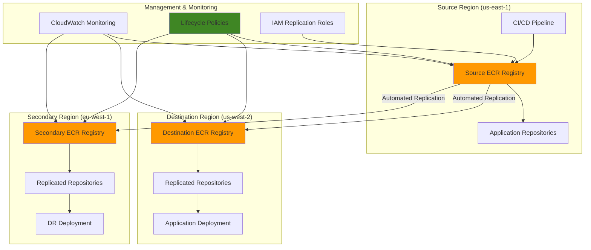

# Container Registry Replication with ECR

## Problem

Enterprise development teams operating across multiple AWS regions face container distribution challenges when deploying applications at scale. Without proper container registry replication, teams encounter slow image pull times, increased deployment failures due to network issues, and lack of disaster recovery capabilities for their container images. Manual synchronization of container images across regions is time-consuming, error-prone, and creates single points of failure that can disrupt application deployments and impact business continuity.

## Solution

Implement automated container registry replication using Amazon ECR's native cross-region replication capabilities. This solution automatically synchronizes container images across multiple regions, implements lifecycle policies to manage storage costs, and provides governance controls to ensure only approved images are replicated. The architecture enables faster application deployments, improved disaster recovery, and centralized management of container distribution policies.

## Architecture Diagram



## Prerequisites

1. AWS account with ECR, IAM, and CloudWatch permissions
2. AWS CLI v2 installed and configured (or AWS CloudShell)
3. Docker installed for testing image operations
4. Basic understanding of container registries and IAM policies
5. Access to multiple AWS regions for testing replication
6. Estimated cost: $5-15 per month for storage and data transfer

> **Note**: Cross-region replication incurs data transfer charges between regions. Monitor costs using CloudWatch metrics.

## Preparation

```bash
# Set environment variables
export AWS_REGION=$(aws configure get region)
export AWS_ACCOUNT_ID=$(aws sts get-caller-identity \
    --query Account --output text)
export SOURCE_REGION="us-east-1"
export DEST_REGION="us-west-2"
export SECONDARY_REGION="eu-west-1"

# Generate unique identifiers for resources
RANDOM_SUFFIX=$(aws secretsmanager get-random-password \
    --exclude-punctuation --exclude-uppercase \
    --password-length 6 --require-each-included-type \
    --output text --query RandomPassword)

# Set repository names
export REPO_PREFIX="enterprise-apps"
export PROD_REPO="${REPO_PREFIX}/production-${RANDOM_SUFFIX}"
export TEST_REPO="${REPO_PREFIX}/testing-${RANDOM_SUFFIX}"

echo "✅ Environment configured with suffix: ${RANDOM_SUFFIX}"
```

## Steps

1. **Create source repositories in primary region**:

   Amazon ECR provides a fully managed Docker container registry that offers high availability and scalable architecture. By creating repositories in the primary region, we establish the foundation for our container distribution strategy. ECR repositories serve as the central storage location for Docker images, providing security features like vulnerability scanning and access control through IAM policies.

   ```bash
   # Switch to source region
   aws configure set region $SOURCE_REGION
   
   # Create production repository with scanning enabled
   aws ecr create-repository \
       --repository-name $PROD_REPO \
       --image-scanning-configuration scanOnPush=true \
       --image-tag-mutability IMMUTABLE
   
   # Create testing repository
   aws ecr create-repository \
       --repository-name $TEST_REPO \
       --image-scanning-configuration scanOnPush=true \
       --image-tag-mutability MUTABLE
   
   echo "✅ Created source repositories in ${SOURCE_REGION}"
   ```

   The repositories are now created with specific security configurations. The production repository uses `IMMUTABLE` tag mutability to prevent accidental overwrites of production images, while the testing repository allows `MUTABLE` tags for development flexibility. Image scanning is enabled on both repositories to automatically detect vulnerabilities upon image push, providing an essential security layer for your container supply chain.

2. **Configure cross-region replication rules**:

   ECR's cross-region replication feature automatically synchronizes container images across multiple AWS regions, eliminating the need for manual image distribution. This capability is crucial for global applications that require low-latency container pulls and robust disaster recovery strategies. The replication configuration uses repository filters to selectively replicate images based on naming patterns, providing granular control over which containers are distributed globally.

   ```bash
   # Create replication configuration file
   cat > replication-config.json << EOF
   {
     "rules": [
       {
         "destinations": [
           {
             "region": "${DEST_REGION}",
             "registryId": "${AWS_ACCOUNT_ID}"
           },
           {
             "region": "${SECONDARY_REGION}",
             "registryId": "${AWS_ACCOUNT_ID}"
           }
         ],
         "repositoryFilters": [
           {
             "filter": "${REPO_PREFIX}",
             "filterType": "PREFIX_MATCH"
           }
         ]
       }
     ]
   }
   EOF
   
   # Apply replication configuration
   aws ecr put-replication-configuration \
       --replication-configuration file://replication-config.json
   
   echo "✅ Configured replication to ${DEST_REGION} and ${SECONDARY_REGION}"
   ```

   The replication configuration is now active and will automatically replicate any new images pushed to repositories matching the specified prefix. ECR creates a service-linked IAM role to handle replication operations, ensuring secure and efficient image distribution. This setup enables applications in multiple regions to pull containers locally, reducing latency and improving deployment reliability.

   > **Warning**: Replication typically completes within 30 minutes but can take longer for large images. Monitor replication status using CloudWatch metrics to ensure timely distribution.

3. **Create and configure lifecycle policies**:

   ECR lifecycle policies provide automated image management capabilities that are essential for controlling storage costs and maintaining repository hygiene. These policies automatically expire images based on age, count, or tag status, preventing repositories from growing indefinitely. For production environments, lifecycle policies ensure that only the most recent and relevant images are retained while removing outdated versions that consume storage and incur costs.

   ```bash
   # Create lifecycle policy for production images
   cat > prod-lifecycle-policy.json << EOF
   {
     "rules": [
       {
         "rulePriority": 1,
         "description": "Keep last 10 production images",
         "selection": {
           "tagStatus": "tagged",
           "tagPrefixList": ["prod", "release"],
           "countType": "imageCountMoreThan",
           "countNumber": 10
         },
         "action": {
           "type": "expire"
         }
       },
       {
         "rulePriority": 2,
         "description": "Delete untagged images older than 1 day",
         "selection": {
           "tagStatus": "untagged",
           "countType": "sinceImagePushed",
           "countUnit": "days",
           "countNumber": 1
         },
         "action": {
           "type": "expire"
         }
       }
     ]
   }
   EOF
   
   # Apply lifecycle policy to production repository
   aws ecr put-lifecycle-policy \
       --repository-name $PROD_REPO \
       --lifecycle-policy-text file://prod-lifecycle-policy.json
   
   echo "✅ Applied lifecycle policy to production repository"
   ```

   The lifecycle policy is now active and will automatically manage image retention based on the defined rules. The policy evaluates images within 24 hours and applies rules based on priority, with lower numbers taking precedence. This automated cleanup ensures optimal storage utilization while maintaining the required number of recent production images for rollback scenarios.

4. **Create lifecycle policy for testing repository**:

   Testing and development repositories require different lifecycle management strategies compared to production environments. Since development images are created frequently and have shorter lifespans, more aggressive cleanup policies help maintain cost efficiency. The testing repository policy balances the need for recent images during development cycles while preventing storage accumulation from abandoned or obsolete builds.

   ```bash
   # Create lifecycle policy for testing images
   cat > test-lifecycle-policy.json << EOF
   {
     "rules": [
       {
         "rulePriority": 1,
         "description": "Keep last 5 testing images",
         "selection": {
           "tagStatus": "tagged",
           "tagPrefixList": ["test", "dev", "staging"],
           "countType": "imageCountMoreThan",
           "countNumber": 5
         },
         "action": {
           "type": "expire"
         }
       },
       {
         "rulePriority": 2,
         "description": "Delete images older than 7 days",
         "selection": {
           "tagStatus": "any",
           "countType": "sinceImagePushed",
           "countUnit": "days",
           "countNumber": 7
         },
         "action": {
           "type": "expire"
         }
       }
     ]
   }
   EOF
   
   # Apply lifecycle policy to testing repository
   aws ecr put-lifecycle-policy \
       --repository-name $TEST_REPO \
       --lifecycle-policy-text file://test-lifecycle-policy.json
   
   echo "✅ Applied lifecycle policy to testing repository"
   ```

   The testing repository now has an optimized lifecycle policy that maintains recent development images while aggressively cleaning up older content. This policy strikes a balance between developer productivity and cost management, ensuring that testing environments have access to recent images while preventing storage costs from spiraling out of control.

5. **Create repository policies for access control**:

   Repository policies provide fine-grained access control that complements IAM policies, enabling organizations to implement the principle of least privilege for container operations. These policies define who can push, pull, and manage images within specific repositories, creating security boundaries that prevent unauthorized access to production containers. By separating read and write permissions, we ensure that only authorized CI/CD pipelines can push images while allowing broader read access for deployments.

   ```bash
   # Create repository policy for production access
   cat > prod-repo-policy.json << EOF
   {
     "Version": "2008-10-17",
     "Statement": [
       {
         "Sid": "ProdReadOnlyAccess",
         "Effect": "Allow",
         "Principal": {
           "AWS": "arn:aws:iam::${AWS_ACCOUNT_ID}:role/ECRProductionRole"
         },
         "Action": [
           "ecr:GetDownloadUrlForLayer",
           "ecr:BatchGetImage",
           "ecr:BatchCheckLayerAvailability"
         ]
       },
       {
         "Sid": "ProdPushAccess",
         "Effect": "Allow",
         "Principal": {
           "AWS": "arn:aws:iam::${AWS_ACCOUNT_ID}:role/ECRCIPipelineRole"
         },
         "Action": [
           "ecr:PutImage",
           "ecr:InitiateLayerUpload",
           "ecr:UploadLayerPart",
           "ecr:CompleteLayerUpload"
         ]
       }
     ]
   }
   EOF
   
   # Apply repository policy to production repository
   aws ecr set-repository-policy \
       --repository-name $PROD_REPO \
       --policy-text file://prod-repo-policy.json
   
   echo "✅ Applied repository policy to production repository"
   ```

   The repository policy is now enforced, creating a security boundary that controls access to production container images. This policy implements role-based access control where only specific IAM roles can perform read or write operations, preventing unauthorized access to critical production assets. The separation of permissions ensures that deployment processes can pull images while restricting push operations to authorized CI/CD pipelines.

6. **Create and push test images**:

   Testing the replication mechanism requires pushing an actual container image to the source repository. ECR uses Docker's authentication system, requiring a login token that's valid for 12 hours. This step demonstrates the complete container lifecycle from build to push, triggering the replication process that will distribute the image across configured regions automatically.

   ```bash
   # Get login token for Docker
   aws ecr get-login-password --region $SOURCE_REGION | \
       docker login --username AWS --password-stdin \
       ${AWS_ACCOUNT_ID}.dkr.ecr.${SOURCE_REGION}.amazonaws.com
   
   # Create a simple test image
   cat > Dockerfile << EOF
   FROM alpine:latest
   RUN echo "Enterprise Application v1.0" > /app-info.txt
   CMD ["cat", "/app-info.txt"]
   EOF
   
   # Build and tag test image
   docker build -t test-app .
   docker tag test-app \
       ${AWS_ACCOUNT_ID}.dkr.ecr.${SOURCE_REGION}.amazonaws.com/${PROD_REPO}:prod-1.0
   
   # Push test image to trigger replication
   docker push \
       ${AWS_ACCOUNT_ID}.dkr.ecr.${SOURCE_REGION}.amazonaws.com/${PROD_REPO}:prod-1.0
   
   echo "✅ Pushed test image to source repository"
   ```

   The test image is now pushed to the source repository and will trigger the replication process. ECR automatically begins distributing this image to the configured destination regions based on the replication rules. The image includes vulnerability scanning results and will be subject to the lifecycle policies configured earlier, demonstrating the complete container management lifecycle.

7. **Configure CloudWatch monitoring for replication**:

   CloudWatch provides comprehensive monitoring capabilities for ECR repositories, enabling teams to track replication performance, repository usage patterns, and potential issues. By creating custom dashboards, operations teams gain visibility into container distribution metrics, helping them optimize replication strategies and troubleshoot performance bottlenecks. These metrics are essential for maintaining SLAs and ensuring reliable container delivery across regions.

   ```bash
   # Create CloudWatch dashboard for ECR monitoring
   cat > ecr-dashboard.json << EOF
   {
     "widgets": [
       {
         "type": "metric",
         "properties": {
           "metrics": [
             ["AWS/ECR", "RepositoryPullCount", "RepositoryName", "${PROD_REPO}"],
             ["AWS/ECR", "RepositoryPushCount", "RepositoryName", "${PROD_REPO}"]
           ],
           "period": 300,
           "stat": "Sum",
           "region": "${SOURCE_REGION}",
           "title": "ECR Repository Activity"
         }
       }
     ]
   }
   EOF
   
   # Create CloudWatch dashboard
   aws cloudwatch put-dashboard \
       --dashboard-name "ECR-Replication-Monitoring" \
       --dashboard-body file://ecr-dashboard.json
   
   echo "✅ Created CloudWatch dashboard for monitoring"
   ```

   The monitoring dashboard is now active and provides real-time visibility into repository activity across all regions. This centralized monitoring capability enables teams to track replication performance, identify usage patterns, and detect potential issues before they impact application deployments. The dashboard serves as a foundation for operational excellence in container management.

8. **Set up replication monitoring alarms**:

   Proactive monitoring through CloudWatch alarms ensures that replication failures are detected and addressed promptly, preventing service disruptions. These alarms integrate with SNS topics to provide immediate notifications when replication issues occur, enabling rapid response to maintain container availability across regions. This monitoring layer is crucial for maintaining high availability and meeting operational SLAs.

   ```bash
   # Create SNS topic for notifications
   TOPIC_ARN=$(aws sns create-topic \
       --name "ECR-Replication-Alerts" \
       --output text --query TopicArn)
   
   # Create CloudWatch alarm for replication failures
   aws cloudwatch put-metric-alarm \
       --alarm-name "ECR-Replication-Failure-Rate" \
       --alarm-description "Monitor ECR replication failure rate" \
       --metric-name "ReplicationFailureRate" \
       --namespace "AWS/ECR" \
       --statistic "Average" \
       --period 300 \
       --threshold 0.1 \
       --comparison-operator "GreaterThanThreshold" \
       --evaluation-periods 2 \
       --alarm-actions $TOPIC_ARN
   
   echo "✅ Created replication monitoring alarm"
   ```

   The alarm system is now configured to detect replication failures and send notifications through SNS. This proactive monitoring approach ensures that operations teams are immediately aware of any issues that could impact container availability or deployment reliability. The alarm threshold is set to trigger when replication failures exceed 10%, providing early warning before issues become critical.

9. **Create automation for repository cleanup**:

   Automated cleanup through Lambda functions extends beyond basic lifecycle policies to provide customized repository management. This serverless approach enables complex cleanup logic that can analyze usage patterns, implement business-specific retention rules, and coordinate cleanup across multiple repositories. Lambda functions can be scheduled to run periodically, ensuring consistent repository hygiene without manual intervention.

   ```bash
   # Create Lambda function for automated cleanup
   cat > cleanup-lambda.py << EOF
   import boto3
   import json
   from datetime import datetime, timedelta
   
   def lambda_handler(event, context):
       ecr_client = boto3.client('ecr')
       
       # Get all repositories with specific prefix
       repos = ecr_client.describe_repositories()
       
       for repo in repos['repositories']:
           repo_name = repo['repositoryName']
           
           # Skip if repository doesn't match prefix
           if not repo_name.startswith('${REPO_PREFIX}'):
               continue
           
           # Get images older than 30 days
           images = ecr_client.describe_images(
               repositoryName=repo_name,
               filter={
                   'tagStatus': 'UNTAGGED'
               }
           )
           
           old_images = []
           cutoff_date = datetime.now() - timedelta(days=30)
           
           for image in images['imageDetails']:
               if image['imagePushedAt'].replace(tzinfo=None) < cutoff_date:
                   old_images.append({'imageDigest': image['imageDigest']})
           
           # Delete old images
           if old_images:
               ecr_client.batch_delete_image(
                   repositoryName=repo_name,
                   imageIds=old_images
               )
               print(f"Deleted {len(old_images)} old images from {repo_name}")
       
       return {
           'statusCode': 200,
           'body': json.dumps('Cleanup completed successfully')
       }
   EOF
   
   # Create Lambda deployment package
   zip cleanup-lambda.zip cleanup-lambda.py
   
   echo "✅ Created Lambda function for automated cleanup"
   ```

   The Lambda function provides advanced cleanup capabilities that complement ECR lifecycle policies. This serverless automation can be scheduled using EventBridge rules to run at specific intervals, ensuring that repository cleanup operations are performed consistently across all regions. The function can be extended to implement custom business logic for image retention and cleanup strategies.

10. **Test replication across regions**:

    Validating replication functionality ensures that the container distribution strategy is working correctly and that images are available for deployment across all target regions. This testing phase verifies that the replication configuration is properly distributing images and that the expected images are available in destination regions. Understanding replication timing is crucial for coordinating deployment strategies and setting appropriate expectations for global application rollouts.

    ```bash
    # Wait for replication to complete (typically 5-10 minutes)
    echo "Waiting for replication to complete..."
    sleep 300
    
    # Check replication in destination region
    aws ecr describe-repositories \
        --region $DEST_REGION \
        --repository-names $PROD_REPO \
        --query 'repositories[0].repositoryName' \
        --output text
    
    # Check images in destination region
    aws ecr describe-images \
        --region $DEST_REGION \
        --repository-name $PROD_REPO \
        --query 'imageDetails[*].[imageTags[0],imagePushedAt]' \
        --output table
    
    echo "✅ Verified replication to destination region"
    ```

    The replication verification confirms that images are successfully distributed across regions and available for deployment. This validation step ensures that the replication mechanism is functioning correctly and that applications can reliably pull containers from local registries. The successful replication establishes the foundation for improved deployment performance and disaster recovery capabilities.

## Validation & Testing

1. **Verify replication configuration**:

   ```bash
   # Check current replication configuration
   aws ecr describe-registry --region $SOURCE_REGION
   ```

   Expected output: Should show replication rules for both destination regions.

2. **Test image replication**:

   ```bash
   # Push another test image
   docker tag test-app \
       ${AWS_ACCOUNT_ID}.dkr.ecr.${SOURCE_REGION}.amazonaws.com/${TEST_REPO}:test-latest
   
   docker push \
       ${AWS_ACCOUNT_ID}.dkr.ecr.${SOURCE_REGION}.amazonaws.com/${TEST_REPO}:test-latest
   
   # Wait and verify replication
   sleep 600
   
   # Check replication in secondary region
   aws ecr describe-images \
       --region $SECONDARY_REGION \
       --repository-name $TEST_REPO \
       --query 'imageDetails[*].[imageTags[0],imagePushedAt]' \
       --output table
   ```

3. **Test lifecycle policies**:

   ```bash
   # Check lifecycle policy application
   aws ecr get-lifecycle-policy \
       --repository-name $PROD_REPO \
       --query 'lifecyclePolicyText' \
       --output text
   
   # Preview lifecycle policy actions
   aws ecr preview-lifecycle-policy \
       --repository-name $PROD_REPO \
       --lifecycle-policy-text file://prod-lifecycle-policy.json
   ```

4. **Verify cross-region pull performance**:

   ```bash
   # Test pull from destination region
   aws ecr get-login-password --region $DEST_REGION | \
       docker login --username AWS --password-stdin \
       ${AWS_ACCOUNT_ID}.dkr.ecr.${DEST_REGION}.amazonaws.com
   
   # Time the pull operation
   time docker pull \
       ${AWS_ACCOUNT_ID}.dkr.ecr.${DEST_REGION}.amazonaws.com/${PROD_REPO}:prod-1.0
   ```

## Cleanup

1. **Remove test images**:

   ```bash
   # Delete images from all regions
   for region in $SOURCE_REGION $DEST_REGION $SECONDARY_REGION; do
       aws ecr batch-delete-image \
           --region $region \
           --repository-name $PROD_REPO \
           --image-ids imageTag=prod-1.0 2>/dev/null || true
       
       aws ecr batch-delete-image \
           --region $region \
           --repository-name $TEST_REPO \
           --image-ids imageTag=test-latest 2>/dev/null || true
   done
   
   echo "✅ Deleted test images from all regions"
   ```

2. **Remove repositories**:

   ```bash
   # Delete repositories in all regions
   for region in $SOURCE_REGION $DEST_REGION $SECONDARY_REGION; do
       aws ecr delete-repository \
           --region $region \
           --repository-name $PROD_REPO \
           --force 2>/dev/null || true
       
       aws ecr delete-repository \
           --region $region \
           --repository-name $TEST_REPO \
           --force 2>/dev/null || true
   done
   
   echo "✅ Deleted repositories from all regions"
   ```

3. **Remove replication configuration**:

   ```bash
   # Remove replication configuration
   aws ecr put-replication-configuration \
       --region $SOURCE_REGION \
       --replication-configuration '{"rules": []}'
   
   echo "✅ Removed replication configuration"
   ```

4. **Clean up monitoring resources**:

   ```bash
   # Delete CloudWatch dashboard
   aws cloudwatch delete-dashboards \
       --dashboard-names "ECR-Replication-Monitoring"
   
   # Delete CloudWatch alarms
   aws cloudwatch delete-alarms \
       --alarm-names "ECR-Replication-Failure-Rate"
   
   # Delete SNS topic
   aws sns delete-topic --topic-arn $TOPIC_ARN
   
   echo "✅ Cleaned up monitoring resources"
   ```

5. **Remove local files**:

   ```bash
   # Clean up local files
   rm -f replication-config.json
   rm -f prod-lifecycle-policy.json
   rm -f test-lifecycle-policy.json
   rm -f prod-repo-policy.json
   rm -f ecr-dashboard.json
   rm -f cleanup-lambda.py
   rm -f cleanup-lambda.zip
   rm -f Dockerfile
   
   # Clean up environment variables
   unset AWS_ACCOUNT_ID SOURCE_REGION DEST_REGION SECONDARY_REGION
   unset REPO_PREFIX PROD_REPO TEST_REPO RANDOM_SUFFIX
   
   echo "✅ Cleaned up local files and environment variables"
   ```

## Discussion

Amazon ECR's replication capabilities provide a robust foundation for enterprise container distribution strategies. The automated replication system ensures that container images are consistently available across multiple regions, reducing deployment latency and improving disaster recovery capabilities. This approach is particularly valuable for organizations with global application deployments or strict business continuity requirements. The service creates a service-linked IAM role automatically to handle replication operations, eliminating the need for manual role configuration. For detailed information about replication capabilities, refer to the [ECR private image replication documentation](https://docs.aws.amazon.com/AmazonECR/latest/userguide/replication.html).

The implementation demonstrates several key architectural patterns that follow AWS Well-Architected Framework principles. Repository filtering allows selective replication based on naming conventions, enabling different policies for production and development images. Lifecycle policies automatically manage storage costs by cleaning up old or unused images, while repository policies provide fine-grained access control. The combination of these features creates a comprehensive governance framework for container image management that ensures both security and cost optimization. For more details on lifecycle policies, see the [ECR lifecycle policies documentation](https://docs.aws.amazon.com/AmazonECR/latest/userguide/LifecyclePolicies.html).

Performance considerations include replication latency, which typically ranges from 5-30 minutes depending on image size and network conditions. Organizations should factor this delay into their deployment pipelines and implement appropriate monitoring to detect replication failures. Cost optimization through lifecycle policies is essential, as cross-region storage and data transfer can become expensive without proper management. The monitoring solution provides visibility into replication performance and enables proactive issue detection.

The monitoring and alerting components provide visibility into replication health and performance metrics. CloudWatch dashboards enable teams to track repository activity, while automated alarms ensure prompt notification of issues. For additional insights, consider implementing custom metrics using Lambda functions to track replication success rates and image pull patterns across regions. The automation capabilities demonstrated through Lambda functions can be extended to implement sophisticated repository management workflows that adapt to business requirements and usage patterns.

> **Tip**: Use ECR's enhanced scanning features to automatically detect vulnerabilities in replicated images. Combined with replication filters, you can ensure only secure images are distributed globally.

## Challenge

Extend this solution by implementing these enhancements:

1. **Cross-account replication**: Configure replication between different AWS accounts for multi-tenant scenarios, implementing proper IAM roles and registry policies for secure cross-account access.

2. **Automated image promotion**: Create a Step Functions workflow that automatically promotes images from testing to production repositories based on successful security scans and quality gates.

3. **Cost optimization automation**: Implement Lambda functions that analyze image usage patterns and automatically adjust lifecycle policies to optimize storage costs while maintaining required retention periods.

4. **Geographic image routing**: Develop a solution using Route 53 health checks and weighted routing to automatically direct container pulls to the nearest healthy regional registry.

5. **Compliance reporting**: Build a comprehensive reporting system using Amazon QuickSight to track image lineage, security scan results, and compliance status across all replicated repositories.

## Infrastructure Code

*Infrastructure code will be generated after recipe approval.*