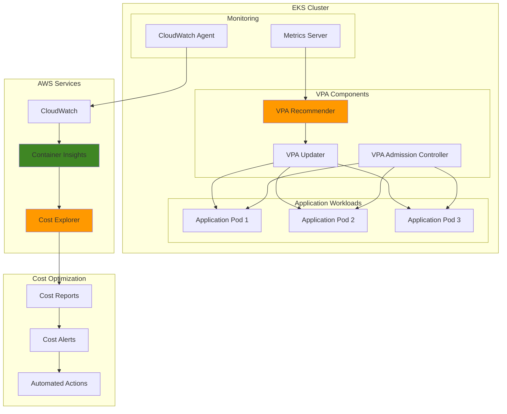

# Container Resource Optimization with EKS

## Problem

Enterprise organizations running containerized workloads on Amazon EKS often face significant resource waste due to overprovisioned containers. Development teams typically set conservative resource requests and limits based on initial estimates, leading to containers that consume far less CPU and memory than allocated. This results in unused cluster capacity, increased infrastructure costs, and inefficient resource utilization patterns that can waste 30-50% of cluster compute resources.

## Solution

Implement automated container resource optimization using Kubernetes Vertical Pod Autoscaler (VPA) and AWS cost monitoring tools. This solution continuously analyzes container resource usage patterns, provides right-sizing recommendations, and implements automated resource adjustments to optimize both performance and cost efficiency across your EKS cluster.

## Architecture Diagram



## Prerequisites

1. AWS account with EKS cluster administrator permissions
2. AWS CLI v2 installed and configured (or AWS CloudShell)
3. kubectl installed and configured for EKS cluster access
4. Existing EKS cluster with worker nodes (minimum 2 nodes)
5. Basic understanding of Kubernetes resource management concepts
6. Estimated cost: $10-50/month for additional CloudWatch metrics and logging

> **Note**: This recipe assumes you have an existing EKS cluster. If you need to create one, follow the [Amazon EKS getting started guide](https://docs.aws.amazon.com/eks/latest/userguide/getting-started.html) first.

## Preparation

```bash
# Set environment variables
export AWS_REGION=$(aws configure get region)
export AWS_ACCOUNT_ID=$(aws sts get-caller-identity \
    --query Account --output text)

# Generate unique suffix for resources
RANDOM_SUFFIX=$(aws secretsmanager get-random-password \
    --exclude-punctuation --exclude-uppercase \
    --password-length 6 --require-each-included-type \
    --output text --query RandomPassword)

# Set cluster name (replace with your actual cluster name)
export CLUSTER_NAME="my-eks-cluster"

# Configure kubectl for EKS cluster
aws eks update-kubeconfig \
    --region $AWS_REGION \
    --name $CLUSTER_NAME

# Verify cluster connectivity
kubectl cluster-info

# Create namespace for cost optimization workloads
kubectl create namespace cost-optimization

# Enable Container Insights for the cluster
aws eks put-cluster-logging \
    --region $AWS_REGION \
    --name $CLUSTER_NAME \
    --logging '{"clusterLogging":[{"types":["api","audit","authenticator","controllerManager","scheduler"],"enabled":true}]}'
```

## Steps

1. **Deploy Kubernetes Metrics Server**:

   The Metrics Server is essential for VPA functionality as it provides the CPU and memory usage data that VPA uses to generate recommendations. It collects resource usage metrics from kubelets and makes them available through the Kubernetes API, enabling resource-based autoscaling decisions that directly impact cost optimization. Without this foundation, VPA cannot understand actual resource consumption patterns and provide accurate right-sizing recommendations.

   ```bash
   # Check if Metrics Server is already installed
   kubectl get deployment metrics-server -n kube-system
   
   # If not installed, deploy it
   kubectl apply -f https://github.com/kubernetes-sigs/metrics-server/releases/latest/download/components.yaml
   
   # Wait for Metrics Server to be ready
   kubectl wait --for=condition=available --timeout=300s \
       deployment/metrics-server -n kube-system
   
   echo "✅ Metrics Server deployed successfully"
   ```

   The Metrics Server is now collecting resource usage data from all nodes in your cluster and making it available through the Kubernetes API. This data foundation enables VPA to analyze historical usage patterns and generate cost-optimized resource recommendations based on actual workload behavior rather than initial estimates.

2. **Install Vertical Pod Autoscaler (VPA)**:

   VPA consists of three components that work together to analyze and optimize resource allocation, enabling automated cost optimization through intelligent resource right-sizing. The VPA Recommender analyzes historical usage patterns and generates resource recommendations, the VPA Updater applies those recommendations by evicting and recreating pods with optimized resource allocations, and the VPA Admission Controller ensures new pods receive optimized resource settings automatically. This comprehensive approach addresses both existing workload optimization and prevents future resource waste.

   ```bash
   # Clone the VPA repository
   git clone https://github.com/kubernetes/autoscaler.git
   cd autoscaler/vertical-pod-autoscaler/
   
   # Deploy VPA components
   ./hack/vpa-up.sh
   
   # Verify VPA components are running
   kubectl get pods -n kube-system | grep vpa
   
   echo "✅ VPA components deployed successfully"
   ```

   The VPA installation script automatically creates necessary RBAC permissions and deploys the three core components. Your cluster now has the intelligence to analyze resource usage patterns and automatically optimize container resource allocations, which typically results in 20-40% cost savings through elimination of overprovisioned resources.

3. **Deploy Sample Application for Testing**:

   This step creates a test workload with intentionally suboptimal resource settings to demonstrate VPA's optimization capabilities. The application represents a common scenario where development teams set conservative resource requests and limits based on initial estimates rather than actual usage patterns. This realistic test case allows you to observe how VPA identifies and corrects resource waste, providing measurable cost optimization results.

   ```bash
   # Create a test application with suboptimal resource settings
   cat <<EOF | kubectl apply -f -
   apiVersion: apps/v1
   kind: Deployment
   metadata:
     name: resource-test-app
     namespace: cost-optimization
   spec:
     replicas: 3
     selector:
       matchLabels:
         app: resource-test-app
     template:
       metadata:
         labels:
           app: resource-test-app
       spec:
         containers:
         - name: app
           image: nginx:1.20
           ports:
           - containerPort: 80
           resources:
             requests:
               cpu: 500m
               memory: 512Mi
             limits:
               cpu: 1000m
               memory: 1024Mi
           # Add some load generation
           command: ["/bin/sh"]
           args: ["-c", "while true; do echo 'Load test'; sleep 30; done & nginx -g 'daemon off;'"]
   ---
   apiVersion: v1
   kind: Service
   metadata:
     name: resource-test-app
     namespace: cost-optimization
   spec:
     selector:
       app: resource-test-app
     ports:
     - port: 80
       targetPort: 80
   EOF
   
   # Wait for deployment to be ready
   kubectl wait --for=condition=available --timeout=300s \
       deployment/resource-test-app -n cost-optimization
   
   echo "✅ Test application deployed"
   ```

   The test application is now running with intentionally overprovisioned resources (500m CPU request for a simple nginx workload). This creates a realistic scenario where VPA can demonstrate its cost optimization capabilities by identifying the actual resource needs versus the allocated resources.

4. **Create VPA Configuration for Resource Optimization**:

   VPA policies define how resource optimization should be applied to specific workloads, establishing the boundaries and behavior for automated cost optimization. This configuration starts in "Off" mode to allow you to review recommendations before enabling automatic updates, following AWS cost optimization best practices that emphasize validation before implementation. The policy includes safety boundaries (minAllowed and maxAllowed) to prevent VPA from making recommendations that could negatively impact application performance or availability.

   ```bash
   # Create VPA policy for the test application
   cat <<EOF | kubectl apply -f -
   apiVersion: autoscaling.k8s.io/v1
   kind: VerticalPodAutoscaler
   metadata:
     name: resource-test-app-vpa
     namespace: cost-optimization
   spec:
     targetRef:
       apiVersion: apps/v1
       kind: Deployment
       name: resource-test-app
     updatePolicy:
       updateMode: "Off"  # Start with recommendation mode only
     resourcePolicy:
       containerPolicies:
       - containerName: app
         minAllowed:
           cpu: 50m
           memory: 64Mi
         maxAllowed:
           cpu: 2000m
           memory: 2048Mi
         controlledResources: ["cpu", "memory"]
   EOF
   
   echo "✅ VPA policy created for test application"
   ```

   > **Warning**: Starting with `updateMode: "Off"` is recommended for production environments. This allows you to review VPA recommendations before enabling automatic resource updates that could impact running applications.

5. **Install CloudWatch Container Insights**:

   CloudWatch Container Insights provides comprehensive monitoring and visualization of containerized applications, enabling data-driven cost optimization decisions. It collects metrics at the cluster, node, pod, and task level, providing the granular visibility needed to track resource utilization patterns and measure the business impact of optimization efforts. This integration with AWS's native monitoring platform enables correlation between resource usage and cost, supporting both technical optimization and financial reporting requirements.

   ```bash
   # Create CloudWatch agent configuration
   cat <<EOF | kubectl apply -f -
   apiVersion: v1
   kind: ConfigMap
   metadata:
     name: cwagentconfig
     namespace: amazon-cloudwatch
   data:
     cwagentconfig.json: |
       {
         "logs": {
           "metrics_collected": {
             "kubernetes": {
               "metrics_collection_interval": 60,
               "resources": [
                 "namespace",
                 "pod",
                 "container",
                 "service"
               ]
             }
           },
           "force_flush_interval": 5
         }
       }
   ---
   apiVersion: v1
   kind: Namespace
   metadata:
     name: amazon-cloudwatch
   EOF
   
   # Deploy CloudWatch agent
   kubectl apply -f https://raw.githubusercontent.com/aws-samples/amazon-cloudwatch-container-insights/latest/k8s-deployment-manifest-templates/deployment-mode/daemonset/container-insights-monitoring/cloudwatch-namespace.yaml
   
   kubectl apply -f https://raw.githubusercontent.com/aws-samples/amazon-cloudwatch-container-insights/latest/k8s-deployment-manifest-templates/deployment-mode/daemonset/container-insights-monitoring/cwagent/cwagent-serviceaccount.yaml
   
   kubectl apply -f https://raw.githubusercontent.com/aws-samples/amazon-cloudwatch-container-insights/latest/k8s-deployment-manifest-templates/deployment-mode/daemonset/container-insights-monitoring/cwagent/cwagent-configmap.yaml
   
   kubectl apply -f https://raw.githubusercontent.com/aws-samples/amazon-cloudwatch-container-insights/latest/k8s-deployment-manifest-templates/deployment-mode/daemonset/container-insights-monitoring/cwagent/cwagent-daemonset.yaml
   
   echo "✅ CloudWatch Container Insights deployed"
   ```

   Container Insights is now collecting detailed metrics from your EKS cluster and sending them to CloudWatch. This provides the foundation for cost analysis and enables integration with AWS Cost Explorer for comprehensive visibility into both resource utilization and cost implications. The detailed metrics enable you to track the effectiveness of VPA optimizations and demonstrate ROI to stakeholders.

6. **Create Cost Monitoring Dashboard**:

   CloudWatch dashboards provide visual representation of resource utilization patterns and help identify optimization opportunities through real-time visibility into cost-related metrics. This dashboard compares actual usage against reserved capacity to highlight waste, enabling proactive cost management and demonstrating the business value of optimization efforts. The visualizations support both technical teams tracking resource efficiency and financial stakeholders monitoring cost optimization progress.

   ```bash
   # Create CloudWatch dashboard for cost monitoring
   aws cloudwatch put-dashboard \
       --dashboard-name "EKS-Cost-Optimization-${RANDOM_SUFFIX}" \
       --dashboard-body '{
         "widgets": [
           {
             "type": "metric",
             "properties": {
               "metrics": [
                 ["ContainerInsights", "pod_cpu_utilization", "Namespace", "cost-optimization"],
                 [".", "pod_memory_utilization", ".", "."],
                 [".", "pod_cpu_reserved_capacity", ".", "."],
                 [".", "pod_memory_reserved_capacity", ".", "."]
               ],
               "period": 300,
               "stat": "Average",
               "region": "'$AWS_REGION'",
               "title": "Resource Utilization vs Reserved Capacity"
             }
           }
         ]
       }'
   
   echo "✅ Cost monitoring dashboard created"
   ```

   The dashboard is now available in CloudWatch and provides real-time visibility into resource utilization versus reserved capacity. This visualization enables you to identify underutilized resources and track the effectiveness of VPA optimizations, supporting both technical decision-making and business reporting on cost optimization initiatives.

7. **Set Up Automated Cost Alerts**:

   Proactive alerting helps identify resource waste as it occurs, enabling rapid response to optimization opportunities before they accumulate into significant cost impacts. These alerts trigger when resource utilization falls below efficiency thresholds, supporting continuous cost optimization practices recommended in the [AWS Cost Optimization Framework](https://docs.aws.amazon.com/eks/latest/best-practices/cost-opt-framework.html). The automated notification system ensures optimization opportunities are addressed promptly, maintaining cost efficiency as workloads evolve.

   ```bash
   # Create SNS topic for cost alerts
   TOPIC_ARN=$(aws sns create-topic \
       --name "eks-cost-optimization-alerts-${RANDOM_SUFFIX}" \
       --query TopicArn --output text)
   
   # Create CloudWatch alarm for high resource waste
   aws cloudwatch put-metric-alarm \
       --alarm-name "EKS-High-Resource-Waste-${RANDOM_SUFFIX}" \
       --alarm-description "Alert when container resource utilization is low" \
       --metric-name pod_cpu_utilization \
       --namespace ContainerInsights \
       --statistic Average \
       --period 300 \
       --threshold 30 \
       --comparison-operator LessThanThreshold \
       --evaluation-periods 2 \
       --alarm-actions $TOPIC_ARN \
       --dimensions Name=Namespace,Value=cost-optimization
   
   echo "✅ Cost alerts configured"
   echo "Topic ARN: $TOPIC_ARN"
   ```

   The cost alerting system is now active and will notify you when resource utilization falls below efficiency thresholds. This proactive monitoring enables rapid response to optimization opportunities and supports continuous cost management practices that are essential for maintaining efficient EKS operations.

8. **Generate Resource Optimization Reports**:

   Regular reporting enables tracking of optimization progress and demonstrates the business value of resource right-sizing efforts to both technical teams and financial stakeholders. This script creates comprehensive VPA recommendation reports that quantify potential cost savings and track optimization effectiveness over time. The reports support compliance with [AWS Cost Optimization best practices](https://docs.aws.amazon.com/eks/latest/best-practices/cost-opt.html) by providing measurable evidence of resource efficiency improvements.

   ```bash
   # Create script to generate VPA recommendations
   cat <<EOF > generate-vpa-recommendations.sh
   #!/bin/bash
   
   echo "=== VPA Recommendations Report ==="
   echo "Generated on: \$(date)"
   echo ""
   
   # Get VPA recommendations
   kubectl get vpa -n cost-optimization -o custom-columns=\
   "NAME:.metadata.name,TARGET:.spec.targetRef.name,CPU_REQUEST:.status.recommendation.containerRecommendations[0].target.cpu,MEMORY_REQUEST:.status.recommendation.containerRecommendations[0].target.memory"
   
   echo ""
   echo "=== Current Resource Usage ==="
   kubectl top pods -n cost-optimization
   
   echo ""
   echo "=== Detailed VPA Status ==="
   kubectl describe vpa -n cost-optimization
   EOF
   
   chmod +x generate-vpa-recommendations.sh
   
   # Run the report (after allowing time for data collection)
   echo "✅ VPA report script created"
   echo "Run './generate-vpa-recommendations.sh' after 10-15 minutes to see recommendations"
   ```

   > **Note**: VPA requires sufficient historical data to generate accurate recommendations. Allow at least 10-15 minutes of runtime before expecting meaningful recommendations.

9. **Implement Automated Right-Sizing**:

   Once you've validated VPA recommendations in "Off" mode, you can enable automatic resource updates to implement continuous cost optimization. This configuration implements aggressive right-sizing with appropriate safety boundaries, automating the resource optimization process to ensure ongoing cost efficiency as workload patterns evolve. The automatic updates eliminate the need for manual intervention while maintaining safety controls to prevent performance degradation.

   ```bash
   # Create a more aggressive VPA configuration for automated updates
   cat <<EOF | kubectl apply -f -
   apiVersion: autoscaling.k8s.io/v1
   kind: VerticalPodAutoscaler
   metadata:
     name: resource-test-app-vpa-auto
     namespace: cost-optimization
   spec:
     targetRef:
       apiVersion: apps/v1
       kind: Deployment
       name: resource-test-app
     updatePolicy:
       updateMode: "Auto"  # Enable automatic updates
     resourcePolicy:
       containerPolicies:
       - containerName: app
         minAllowed:
           cpu: 50m
           memory: 64Mi
         maxAllowed:
           cpu: 500m  # Reduced from original
           memory: 512Mi  # Reduced from original
         controlledResources: ["cpu", "memory"]
   EOF
   
   echo "✅ Automated VPA configuration deployed"
   ```

   The automated VPA configuration is now active and will continuously optimize resource allocations based on actual usage patterns. This enables ongoing cost optimization without manual intervention, automatically adjusting resource requests as workload patterns change and ensuring sustained cost efficiency over time.

10. **Create Cost Optimization Automation**:

    Advanced automation can analyze metrics and trigger optimization actions based on predefined thresholds, enabling enterprise-scale cost optimization that operates continuously without manual intervention. This Lambda function demonstrates integration with CloudWatch metrics for automated cost optimization decisions, supporting the advanced automation practices outlined in [AWS Cost Management best practices](https://docs.aws.amazon.com/cost-management/latest/userguide/ce-what-is.html). The automation layer provides intelligent decision-making capabilities that can scale across multiple clusters and respond to changing workload patterns.

    ```bash
    # Create Lambda function for cost optimization automation
    cat <<EOF > cost-optimization-lambda.py
    import boto3
    import json
    from datetime import datetime, timedelta
    
    def lambda_handler(event, context):
        # Get EKS cluster metrics
        cloudwatch = boto3.client('cloudwatch')
        
        # Query resource utilization metrics
        response = cloudwatch.get_metric_statistics(
            Namespace='ContainerInsights',
            MetricName='pod_cpu_utilization',
            Dimensions=[
                {
                    'Name': 'Namespace',
                    'Value': 'cost-optimization'
                }
            ],
            StartTime=datetime.utcnow() - timedelta(hours=1),
            EndTime=datetime.utcnow(),
            Period=300,
            Statistics=['Average']
        )
        
        # Analyze utilization and trigger recommendations
        if response['Datapoints']:
            avg_utilization = sum(dp['Average'] for dp in response['Datapoints']) / len(response['Datapoints'])
            
            if avg_utilization < 30:  # Low utilization threshold
                # Send SNS notification
                sns = boto3.client('sns')
                sns.publish(
                    TopicArn='${TOPIC_ARN}',
                    Message=f'EKS cluster resource utilization is low: {avg_utilization:.2f}%',
                    Subject='EKS Cost Optimization Alert'
                )
        
        return {
            'statusCode': 200,
            'body': json.dumps('Cost optimization check completed')
        }
    EOF
    
    echo "✅ Cost optimization automation script created"
    ```

    The automation script is now ready for deployment as an AWS Lambda function with CloudWatch Events scheduling for continuous cost monitoring and alerting. This advanced automation capability enables enterprise-scale cost optimization that operates continuously across your EKS infrastructure.

## Validation & Testing

1. **Verify VPA Components Are Running**:

   ```bash
   # Check VPA pods status
   kubectl get pods -n kube-system | grep vpa
   ```

   Expected output: Three VPA pods (recommender, updater, admission-controller) in Running state

2. **Test Resource Recommendations**:

   ```bash
   # Wait for VPA to collect metrics (10-15 minutes)
   sleep 900
   
   # Check VPA recommendations
   kubectl describe vpa resource-test-app-vpa -n cost-optimization
   
   # Generate detailed report
   ./generate-vpa-recommendations.sh
   ```

3. **Monitor Cost Impact**:

   ```bash
   # Check current resource usage
   kubectl top pods -n cost-optimization
   
   # View cost dashboard
   echo "View dashboard at: https://console.aws.amazon.com/cloudwatch/home?region=${AWS_REGION}#dashboards:name=EKS-Cost-Optimization-${RANDOM_SUFFIX}"
   ```

4. **Test Automated Scaling**:

   ```bash
   # Generate load to test VPA response
   kubectl run load-generator --image=busybox --restart=Never \
       --rm -it --namespace=cost-optimization \
       -- /bin/sh -c "while true; do wget -q -O- http://resource-test-app.cost-optimization.svc.cluster.local; done"
   ```

## Cleanup

1. **Remove VPA Components**:

   ```bash
   # Remove VPA
   cd autoscaler/vertical-pod-autoscaler/
   ./hack/vpa-down.sh
   
   echo "✅ VPA components removed"
   ```

2. **Delete Test Applications**:

   ```bash
   # Delete test application and VPA policies
   kubectl delete deployment resource-test-app -n cost-optimization
   kubectl delete service resource-test-app -n cost-optimization
   kubectl delete vpa resource-test-app-vpa -n cost-optimization
   kubectl delete vpa resource-test-app-vpa-auto -n cost-optimization
   
   echo "✅ Test applications removed"
   ```

3. **Remove CloudWatch Resources**:

   ```bash
   # Delete CloudWatch dashboard
   aws cloudwatch delete-dashboards \
       --dashboard-names "EKS-Cost-Optimization-${RANDOM_SUFFIX}"
   
   # Delete CloudWatch alarms
   aws cloudwatch delete-alarms \
       --alarm-names "EKS-High-Resource-Waste-${RANDOM_SUFFIX}"
   
   echo "✅ CloudWatch resources removed"
   ```

4. **Clean Up Container Insights**:

   ```bash
   # Remove CloudWatch agent
   kubectl delete namespace amazon-cloudwatch
   
   echo "✅ Container Insights removed"
   ```

5. **Delete Namespace and Local Files**:

   ```bash
   # Remove namespace
   kubectl delete namespace cost-optimization
   
   # Clean up local files
   rm -rf autoscaler/
   rm -f generate-vpa-recommendations.sh
   rm -f cost-optimization-lambda.py
   
   echo "✅ All resources cleaned up"
   ```

## Discussion

Container resource optimization is a critical component of FinOps practices in Kubernetes environments, directly addressing the challenge of cloud cost management at scale. The Vertical Pod Autoscaler provides intelligent resource recommendations based on historical usage patterns, but implementing it effectively requires understanding both the technical mechanisms and business implications outlined in [AWS EKS Cost Optimization best practices](https://docs.aws.amazon.com/eks/latest/best-practices/cost-opt.html).

The VPA operates through three main components: the Recommender analyzes resource usage patterns and generates recommendations, the Updater applies those recommendations by evicting and recreating pods, and the Admission Controller ensures new pods receive optimized resource allocations. This architecture enables both reactive optimization of existing workloads and proactive optimization of new deployments, supporting the continuous improvement approach recommended in AWS cost optimization frameworks.

Key considerations for production implementation include setting appropriate resource bounds to prevent recommendations that are too aggressive, implementing gradual rollout strategies to minimize disruption, and integrating VPA data with broader cost management processes. Organizations should also consider the trade-offs between automated and manual optimization approaches, as automated updates can provide continuous optimization but may introduce operational complexity. The [AWS Cost Explorer](https://docs.aws.amazon.com/cost-management/latest/userguide/ce-what-is.html) integration provides detailed cost visibility and enables tracking of optimization ROI.

The integration with AWS Cost Explorer and [CloudWatch Container Insights](https://docs.aws.amazon.com/AmazonCloudWatch/latest/monitoring/ContainerInsights.html) enables comprehensive visibility into both resource utilization and cost implications. This visibility is essential for making informed decisions about resource allocation and for demonstrating the business value of optimization efforts to stakeholders, supporting both technical decision-making and financial reporting requirements.

## Challenge

Extend this solution by implementing these enhancements:

1. **Multi-Cluster Cost Optimization**: Implement VPA across multiple EKS clusters with centralized reporting and recommendations aggregation using AWS Systems Manager and Cost Explorer APIs.

2. **ML-Powered Resource Prediction**: Integrate Amazon SageMaker to predict future resource needs based on application usage patterns, seasonal trends, and business metrics.

3. **Cost-Aware Scheduling**: Implement custom Kubernetes schedulers that consider both resource requirements and cost implications when placing pods on nodes with different instance types.

4. **Automated Node Right-Sizing**: Extend the solution to automatically adjust node group instance types based on aggregate container resource requirements and cost optimization opportunities.

5. **Advanced Cost Allocation**: Implement detailed cost allocation and chargeback mechanisms using Kubernetes labels, namespaces, and AWS Cost Categories to track resource optimization impact by team or application.

## Infrastructure Code

*Infrastructure code will be generated after recipe approval.*