# Container Secrets Management with Secrets Manager

## Problem

Organizations running containerized applications often struggle with securely managing sensitive data like database credentials, API keys, and service tokens. Traditional approaches like hardcoding secrets in container images or using environment variables create security vulnerabilities and compliance risks. Teams need a secure, centralized solution for managing secrets across both Amazon ECS and Amazon EKS environments while maintaining operational simplicity and automatic secret rotation capabilities.

## Solution

Implement a comprehensive container secrets management strategy using AWS Secrets Manager integrated with both ECS and EKS. This solution provides centralized secret storage, automatic rotation, and fine-grained access control through IAM policies, enabling containers to securely retrieve secrets at runtime without exposing them in code or configuration files.

## Architecture Diagram

```mermaid
graph TB
    subgraph "AWS Secrets Manager"
        SM[Secrets Manager<br/>- Database Credentials<br/>- API Keys<br/>- Service Tokens]
        ROT[Rotation Lambda<br/>Function]
    end
    
    subgraph "ECS Cluster"
        ECS_TASK[ECS Task<br/>with Task Role]
        ECS_CONT[Application<br/>Container]
    end
    
    subgraph "EKS Cluster"
        EKS_POD[Kubernetes Pod]
        CSI[Secrets Store<br/>CSI Driver]
        ASCP[AWS Secrets and<br/>Configuration Provider]
    end
    
    subgraph "IAM"
        TASK_ROLE[ECS Task Role]
        POD_ROLE[Pod Service Account<br/>with IRSA]
        LAMBDA_ROLE[Lambda Role]
        OIDC[OIDC Provider]
    end
    
    SM --> ROT
    ROT --> SM
    
    ECS_TASK --> ECS_CONT
    ECS_CONT --> SM
    TASK_ROLE --> ECS_TASK
    
    EKS_POD --> CSI
    CSI --> ASCP
    ASCP --> SM
    POD_ROLE --> EKS_POD
    OIDC --> POD_ROLE
    
    LAMBDA_ROLE --> ROT
    
    style SM fill:#FF9900
    style ECS_TASK fill:#3F8624
    style EKS_POD fill:#3F8624
    style CSI fill:#232F3E
    style OIDC fill:#FF9900
```



## Prerequisites

1. AWS account with appropriate permissions for Secrets Manager, ECS, EKS, and IAM
2. AWS CLI v2 installed and configured (or AWS CloudShell)
3. kubectl installed and configured for EKS cluster access
4. Helm v3 installed for CSI driver deployment
5. eksctl installed for EKS cluster management
6. Basic understanding of container orchestration and IAM roles
7. Estimated cost: $15-30/month for secrets storage, rotation, and EKS cluster

> **Note**: This configuration follows AWS Well-Architected Framework principles for security and operational excellence. See [AWS Well-Architected Framework](https://docs.aws.amazon.com/wellarchitected/latest/framework/welcome.html) for additional guidance.

## Preparation

```bash
# Set environment variables
export AWS_REGION=$(aws configure get region)
export AWS_ACCOUNT_ID=$(aws sts get-caller-identity \
    --query Account --output text)

# Generate unique identifiers for resources
RANDOM_SUFFIX=$(aws secretsmanager get-random-password \
    --exclude-punctuation --exclude-uppercase \
    --password-length 6 --require-each-included-type \
    --output text --query RandomPassword)

export CLUSTER_NAME="secrets-demo-${RANDOM_SUFFIX}"
export SECRET_NAME="demo-app-secrets-${RANDOM_SUFFIX}"
export LAMBDA_FUNCTION_NAME="secrets-rotation-${RANDOM_SUFFIX}"

# Create KMS key for encryption
export KMS_KEY_ID=$(aws kms create-key \
    --description "Secrets Manager encryption key" \
    --query KeyMetadata.KeyId --output text)

aws kms create-alias \
    --alias-name alias/secrets-manager-${RANDOM_SUFFIX} \
    --target-key-id $KMS_KEY_ID

echo "✅ Environment variables and KMS key created"
```

## Steps

1. **Create Application Secrets in Secrets Manager**:

   AWS Secrets Manager provides centralized secret storage with automatic encryption, versioning, and rotation capabilities. This step establishes the foundation by creating encrypted secrets that will be accessed by both ECS and EKS applications using different integration methods. Secrets Manager offers superior security compared to environment variables or configuration files by encrypting secrets at rest and in transit using AWS KMS.

   ```bash
   # Create database credentials secret
   aws secretsmanager create-secret \
       --name "${SECRET_NAME}-db" \
       --description "Database credentials for demo application" \
       --secret-string '{"username":"appuser","password":"temp-password123","host":"demo-db.cluster-xyz.us-west-2.rds.amazonaws.com","port":"5432","database":"appdb"}' \
       --kms-key-id $KMS_KEY_ID
   
   # Create API keys secret
   aws secretsmanager create-secret \
       --name "${SECRET_NAME}-api" \
       --description "API keys for external services" \
       --secret-string '{"github_token":"ghp_example_token","stripe_key":"sk_test_example_key","twilio_sid":"AC_example_sid"}' \
       --kms-key-id $KMS_KEY_ID
   
   # Store secret ARNs for later use
   export DB_SECRET_ARN=$(aws secretsmanager describe-secret \
       --secret-id "${SECRET_NAME}-db" \
       --query ARN --output text)
   
   export API_SECRET_ARN=$(aws secretsmanager describe-secret \
       --secret-id "${SECRET_NAME}-api" \
       --query ARN --output text)
   
   echo "✅ Application secrets created successfully"
   ```

   The secrets are now stored in AWS Secrets Manager with KMS encryption and are ready for consumption by container applications. Each secret has a unique ARN that will be used in IAM policies and application configurations to ensure secure, controlled access. For more information about Secrets Manager integration with containers, see the [AWS Secrets Manager documentation](https://docs.aws.amazon.com/secretsmanager/latest/userguide/intro.html).

   > **Warning**: Never store real credentials in examples. This step demonstrates the structure - replace with actual credentials in production environments following your organization's security policies.

2. **Create IAM Role for ECS Task**:

   ECS tasks require specific IAM permissions to access Secrets Manager. This step creates a task role with minimal necessary permissions following the principle of least privilege, ensuring that containers can only access the secrets they need while maintaining security boundaries. The IAM role enables secure, temporary credential delegation without hardcoding secrets in application code.

   ```bash
   # Create trust policy for ECS tasks
   cat > ecs-task-trust-policy.json << 'EOF'
   {
       "Version": "2012-10-17",
       "Statement": [
           {
               "Effect": "Allow",
               "Principal": {
                   "Service": "ecs-tasks.amazonaws.com"
               },
               "Action": "sts:AssumeRole"
           }
       ]
   }
   EOF
   
   # Create ECS task role
   aws iam create-role \
       --role-name "${CLUSTER_NAME}-ecs-task-role" \
       --assume-role-policy-document file://ecs-task-trust-policy.json
   
   # Create permissions policy for accessing secrets
   cat > ecs-secrets-policy.json << EOF
   {
       "Version": "2012-10-17",
       "Statement": [
           {
               "Effect": "Allow",
               "Action": [
                   "secretsmanager:GetSecretValue",
                   "secretsmanager:DescribeSecret"
               ],
               "Resource": [
                   "${DB_SECRET_ARN}",
                   "${API_SECRET_ARN}"
               ]
           },
           {
               "Effect": "Allow",
               "Action": [
                   "kms:Decrypt"
               ],
               "Resource": "arn:aws:kms:${AWS_REGION}:${AWS_ACCOUNT_ID}:key/${KMS_KEY_ID}"
           }
       ]
   }
   EOF
   
   # Attach policy to role
   aws iam put-role-policy \
       --role-name "${CLUSTER_NAME}-ecs-task-role" \
       --policy-name SecretsManagerAccess \
       --policy-document file://ecs-secrets-policy.json
   
   export ECS_TASK_ROLE_ARN=$(aws iam get-role \
       --role-name "${CLUSTER_NAME}-ecs-task-role" \
       --query Role.Arn --output text)
   
   echo "✅ ECS task role created with secrets access"
   ```

   The IAM role is now configured with precise permissions to access only the specified secrets and the KMS key used for encryption. This security foundation enables ECS tasks to retrieve secrets at runtime without exposing credentials in container images or environment variables. For more information about ECS task IAM roles, see the [ECS task IAM roles documentation](https://docs.aws.amazon.com/AmazonECS/latest/developerguide/task-iam-roles.html).

3. **Create ECS Cluster and Task Definition**:

   This step demonstrates ECS's native secrets integration, where the task definition references secrets directly and ECS injects them as environment variables at container startup. ECS Fargate provides serverless container execution with built-in security isolation, eliminating the need for EC2 instance management while maintaining high availability and scalability.

   ```bash
   # Create ECS cluster with Fargate capacity
   aws ecs create-cluster \
       --cluster-name $CLUSTER_NAME \
       --capacity-providers FARGATE \
       --default-capacity-provider-strategy capacityProvider=FARGATE,weight=1
   
   # Create task definition with secrets injection
   cat > ecs-task-definition.json << EOF
   {
       "family": "${CLUSTER_NAME}-task",
       "networkMode": "awsvpc",
       "requiresCompatibilities": ["FARGATE"],
       "cpu": "256",
       "memory": "512",
       "executionRoleArn": "arn:aws:iam::${AWS_ACCOUNT_ID}:role/ecsTaskExecutionRole",
       "taskRoleArn": "${ECS_TASK_ROLE_ARN}",
       "containerDefinitions": [
           {
               "name": "demo-app",
               "image": "nginx:latest",
               "portMappings": [
                   {
                       "containerPort": 80,
                       "protocol": "tcp"
                   }
               ],
               "secrets": [
                   {
                       "name": "DB_USERNAME",
                       "valueFrom": "${DB_SECRET_ARN}:username::"
                   },
                   {
                       "name": "DB_PASSWORD",
                       "valueFrom": "${DB_SECRET_ARN}:password::"
                   },
                   {
                       "name": "DB_HOST",
                       "valueFrom": "${DB_SECRET_ARN}:host::"
                   },
                   {
                       "name": "GITHUB_TOKEN",
                       "valueFrom": "${API_SECRET_ARN}:github_token::"
                   }
               ],
               "logConfiguration": {
                   "logDriver": "awslogs",
                   "options": {
                       "awslogs-group": "/ecs/${CLUSTER_NAME}",
                       "awslogs-region": "${AWS_REGION}",
                       "awslogs-stream-prefix": "ecs"
                   }
               }
           }
       ]
   }
   EOF
   
   # Create CloudWatch log group
   aws logs create-log-group \
       --log-group-name "/ecs/${CLUSTER_NAME}" \
       --retention-in-days 7
   
   # Register task definition
   aws ecs register-task-definition \
       --cli-input-json file://ecs-task-definition.json
   
   echo "✅ ECS cluster and task definition created"
   ```

   The ECS cluster is now configured with Fargate capacity providers for serverless container execution. The task definition enables secure secrets injection using the native ECS integration, where secrets are retrieved at runtime and injected as environment variables. This approach provides seamless integration with zero application code changes while maintaining enterprise-grade security. For more details about ECS secrets integration, see the [ECS Secrets Manager integration documentation](https://docs.aws.amazon.com/secretsmanager/latest/userguide/integrating_how-services-use-secrets_ecs-sc.html).

4. **Create EKS Cluster for Kubernetes Secrets Management**:

   EKS requires a different approach using the Secrets Store CSI Driver, which enables Kubernetes pods to mount secrets from external systems as volumes. This step creates the EKS cluster infrastructure using eksctl for simplified setup, providing the foundation for secure secrets management in Kubernetes environments with proper networking and security configurations.

   ```bash
   # Create EKS cluster using eksctl (recommended approach)
   cat > eks-cluster-config.yaml << EOF
   apiVersion: eksctl.io/v1alpha5
   kind: ClusterConfig
   
   metadata:
     name: ${CLUSTER_NAME}
     region: ${AWS_REGION}
     version: "1.30"
   
   nodeGroups:
     - name: workers
       instanceType: t3.medium
       desiredCapacity: 2
       minSize: 1
       maxSize: 3
       volumeSize: 20
       ssh:
         allow: false
   
   iam:
     withOIDC: true
   EOF
   
   # Create EKS cluster (this takes 15-20 minutes)
   eksctl create cluster -f eks-cluster-config.yaml
   
   echo "✅ EKS cluster created successfully"
   ```

   The EKS cluster is now operational with managed node groups and OIDC provider automatically configured. Using eksctl simplifies the cluster creation process by automatically setting up the necessary IAM service roles, OIDC provider, and networking components. This infrastructure provides the foundation for secure, scalable secrets management in Kubernetes environments with proper authentication and authorization mechanisms.

   > **Tip**: EKS cluster creation typically takes 15-20 minutes. You can monitor progress in the AWS console or use `eksctl get cluster` to check status. The OIDC provider is automatically created when using `withOIDC: true`.

5. **Install Secrets Store CSI Driver and AWS Provider**:

   The Secrets Store CSI Driver enables Kubernetes pods to mount secrets from external systems as volumes, while the AWS Secrets and Configuration Provider (ASCP) specifically integrates with AWS Secrets Manager and Systems Manager Parameter Store. This installation provides the foundation for secure secret mounting in EKS pods with automatic rotation support.

   ```bash
   # Add Helm repositories
   helm repo add secrets-store-csi-driver \
       https://kubernetes-sigs.github.io/secrets-store-csi-driver/charts
   
   helm repo add aws-secrets-manager \
       https://aws.github.io/secrets-store-csi-driver-provider-aws
   
   helm repo update
   
   # Install Secrets Store CSI Driver
   helm install csi-secrets-store \
       secrets-store-csi-driver/secrets-store-csi-driver \
       --namespace kube-system \
       --set syncSecret.enabled=true \
       --set enableSecretRotation=true
   
   # Install AWS Secrets and Configuration Provider
   helm install secrets-provider-aws \
       aws-secrets-manager/secrets-store-csi-driver-provider-aws \
       --namespace kube-system
   
   # Verify installations
   kubectl get pods -n kube-system -l app=secrets-store-csi-driver
   kubectl get pods -n kube-system -l app=secrets-store-csi-driver-provider-aws
   
   echo "✅ CSI driver and AWS provider installed"
   ```

   The CSI driver and AWS provider are now installed and running in the cluster. The `syncSecret.enabled=true` setting allows secrets to be synced to Kubernetes secrets for environment variable access, while `enableSecretRotation=true` ensures automatic detection of secret updates. These components work together to provide seamless integration between AWS Secrets Manager and Kubernetes workloads.

6. **Create Service Account with IRSA for EKS**:

   IAM Roles for Service Accounts (IRSA) enables Kubernetes pods to assume IAM roles without storing credentials, providing secure, scalable access to AWS services from EKS pods. This feature uses OpenID Connect (OIDC) to establish trust between the EKS cluster and IAM, allowing pods to obtain temporary AWS credentials automatically through the AWS STS AssumeRoleWithWebIdentity API.

   ```bash
   # Create IAM role for service account using eksctl (recommended)
   eksctl create iamserviceaccount \
       --name secrets-demo-sa \
       --namespace default \
       --cluster $CLUSTER_NAME \
       --role-name "${CLUSTER_NAME}-pod-role" \
       --attach-policy-arn arn:aws:iam::aws:policy/SecretsManagerReadWrite \
       --approve \
       --override-existing-serviceaccounts
   
   # Create more restrictive inline policy for production use
   cat > pod-secrets-policy.json << EOF
   {
       "Version": "2012-10-17",
       "Statement": [
           {
               "Effect": "Allow",
               "Action": [
                   "secretsmanager:GetSecretValue",
                   "secretsmanager:DescribeSecret"
               ],
               "Resource": [
                   "${DB_SECRET_ARN}",
                   "${API_SECRET_ARN}"
               ]
           },
           {
               "Effect": "Allow",
               "Action": [
                   "kms:Decrypt"
               ],
               "Resource": "arn:aws:kms:${AWS_REGION}:${AWS_ACCOUNT_ID}:key/${KMS_KEY_ID}"
           }
       ]
   }
   EOF
   
   # Apply more restrictive policy
   aws iam put-role-policy \
       --role-name "${CLUSTER_NAME}-pod-role" \
       --policy-name RestrictedSecretsAccess \
       --policy-document file://pod-secrets-policy.json
   
   # Remove broader policy
   aws iam detach-role-policy \
       --role-name "${CLUSTER_NAME}-pod-role" \
       --policy-arn arn:aws:iam::aws:policy/SecretsManagerReadWrite
   
   export POD_ROLE_ARN=$(aws iam get-role \
       --role-name "${CLUSTER_NAME}-pod-role" \
       --query Role.Arn --output text)
   
   echo "✅ Service account with IRSA created"
   ```

   The service account is now configured with IRSA, enabling pods to automatically assume the IAM role and access AWS Secrets Manager. Using eksctl simplifies the IRSA setup by automatically creating the OIDC provider, IAM role, trust policy, and Kubernetes service account with proper annotations. This approach follows AWS best practices for secure pod-to-AWS service authentication. For more information about IRSA, see the [IAM roles for service accounts documentation](https://docs.aws.amazon.com/eks/latest/userguide/iam-roles-for-service-accounts.html).

7. **Create SecretProviderClass for Kubernetes**:

   The SecretProviderClass defines how secrets should be retrieved from AWS Secrets Manager and mounted into pods. It specifies which secrets to fetch, how to transform them using JMESPath expressions, and provides a declarative approach to secrets management in Kubernetes that integrates seamlessly with AWS services while supporting both file mounts and environment variable access patterns.

   ```bash
   # Create SecretProviderClass manifest with secret sync
   cat > secret-provider-class.yaml << EOF
   apiVersion: secrets-store.csi.x-k8s.io/v1
   kind: SecretProviderClass
   metadata:
     name: demo-secrets-provider
     namespace: default
   spec:
     provider: aws
     secretObjects:
     - secretName: demo-secrets
       type: Opaque
       data:
       - objectName: db_username
         key: db_username
       - objectName: db_password
         key: db_password
       - objectName: db_host
         key: db_host
       - objectName: github_token
         key: github_token
     parameters:
       objects: |
         - objectName: "${SECRET_NAME}-db"
           objectType: "secretsmanager"
           jmesPath:
             - path: "username"
               objectAlias: "db_username"
             - path: "password"
               objectAlias: "db_password"
             - path: "host"
               objectAlias: "db_host"
         - objectName: "${SECRET_NAME}-api"
           objectType: "secretsmanager"
           jmesPath:
             - path: "github_token"
               objectAlias: "github_token"
             - path: "stripe_key"
               objectAlias: "stripe_key"
   EOF
   
   # Apply SecretProviderClass
   kubectl apply -f secret-provider-class.yaml
   
   echo "✅ SecretProviderClass created"
   ```

   The SecretProviderClass is now configured to retrieve secrets from AWS Secrets Manager and make them available to pods through both file mounts and Kubernetes secrets. The `secretObjects` section enables automatic syncing to native Kubernetes secrets, allowing flexible access patterns through environment variables. The JMESPath expressions extract specific fields from JSON secrets and assign them friendly aliases for use in pods. For more information about using AWS Secrets Manager with EKS, see the [EKS secrets management documentation](https://docs.aws.amazon.com/eks/latest/userguide/manage-secrets.html).

8. **Deploy Application Pod with Secrets Mount**:

   This step demonstrates how applications consume secrets through both file mounts and environment variables in Kubernetes. The CSI driver automatically syncs mounted secrets to Kubernetes secrets, providing flexible access patterns while maintaining security. The pod uses the IRSA-enabled service account to authenticate with AWS services without storing any credentials.

   ```bash
   # Create deployment with secrets mount
   cat > demo-app-deployment.yaml << 'EOF'
   apiVersion: apps/v1
   kind: Deployment
   metadata:
     name: demo-app
     namespace: default
   spec:
     replicas: 1
     selector:
       matchLabels:
         app: demo-app
     template:
       metadata:
         labels:
           app: demo-app
       spec:
         serviceAccountName: secrets-demo-sa
         containers:
         - name: demo-app
           image: nginx:latest
           ports:
           - containerPort: 80
           volumeMounts:
           - name: secrets-store
             mountPath: "/mnt/secrets"
             readOnly: true
           env:
           - name: DB_USERNAME
             valueFrom:
               secretKeyRef:
                 name: demo-secrets
                 key: db_username
           - name: DB_PASSWORD
             valueFrom:
               secretKeyRef:
                 name: demo-secrets
                 key: db_password
           - name: DB_HOST
             valueFrom:
               secretKeyRef:
                 name: demo-secrets
                 key: db_host
         volumes:
         - name: secrets-store
           csi:
             driver: secrets-store.csi.k8s.io
             readOnly: true
             volumeAttributes:
               secretProviderClass: "demo-secrets-provider"
   EOF
   
   # Apply deployment
   kubectl apply -f demo-app-deployment.yaml
   
   # Wait for deployment to be ready
   kubectl rollout status deployment/demo-app
   
   echo "✅ Application deployed with secrets integration"
   ```

   The application is now deployed with dual access to secrets through both file mounts at `/mnt/secrets` and environment variables. This flexible approach allows applications to choose their preferred method of secret consumption while maintaining security. The CSI driver handles the retrieval and mounting of secrets from AWS Secrets Manager, ensuring that secrets are always current and properly encrypted in transit.

9. **Set Up Automatic Secret Rotation**:

   Automatic rotation reduces the risk of credential compromise by regularly updating secrets without manual intervention. This Lambda function demonstrates the rotation workflow required by AWS Secrets Manager, implementing the four-step rotation process: createSecret, setSecret, testSecret, and finishSecret. This foundation can be extended for specific secret types and database connections.

   ```bash
   # Create Lambda function for rotation
   cat > lambda-rotation.py << 'EOF'
   import boto3
   import json
   import logging
   from datetime import datetime, timedelta
   
   logger = logging.getLogger()
   logger.setLevel(logging.INFO)
   
   def lambda_handler(event, context):
       client = boto3.client('secretsmanager')
       
       # Get rotation parameters from event
       secret_arn = event['SecretId']
       token = event['ClientRequestToken']
       step = event['Step']
       
       logger.info(f"Rotating secret {secret_arn}, step: {step}")
       
       try:
           if step == "createSecret":
               create_secret(client, secret_arn, token)
           elif step == "setSecret":
               set_secret(client, secret_arn, token)
           elif step == "testSecret":
               test_secret(client, secret_arn, token)
           elif step == "finishSecret":
               finish_secret(client, secret_arn, token)
           else:
               raise ValueError(f"Invalid step parameter: {step}")
               
           return {'statusCode': 200, 'body': f'Successfully completed {step}'}
               
       except Exception as e:
           logger.error(f"Error in {step}: {str(e)}")
           raise e
   
   def create_secret(client, secret_arn, token):
       # Generate new password and create new secret version
       new_password = client.get_random_password(
           PasswordLength=32,
           ExcludeCharacters='"@/\\'
       )['RandomPassword']
       
       current_secret = client.get_secret_value(SecretId=secret_arn, VersionStage='AWSCURRENT')
       secret_dict = json.loads(current_secret['SecretString'])
       secret_dict['password'] = new_password
       
       client.put_secret_value(
           SecretId=secret_arn,
           ClientRequestToken=token,
           SecretString=json.dumps(secret_dict),
           VersionStages=['AWSPENDING']
       )
       logger.info("Created new secret version")
   
   def set_secret(client, secret_arn, token):
       # In production, update the database/service with new credentials
       logger.info("Set secret in service (placeholder)")
   
   def test_secret(client, secret_arn, token):
       # In production, test connectivity with new credentials
       logger.info("Test secret connectivity (placeholder)")
   
   def finish_secret(client, secret_arn, token):
       # Finalize rotation by moving versions
       client.update_secret_version_stage(
           SecretId=secret_arn,
           VersionStage='AWSCURRENT',
           ClientRequestToken=token,
           RemoveFromVersionId=client.describe_secret(SecretId=secret_arn)['VersionIdsToStages']['AWSCURRENT'][0]
       )
       client.update_secret_version_stage(
           SecretId=secret_arn,
           VersionStage='AWSCURRENT',
           ClientRequestToken=token
       )
       logger.info("Finished secret rotation")
   EOF
   
   # Create deployment package
   zip lambda-rotation.zip lambda-rotation.py
   
   # Create Lambda role
   aws iam create-role \
       --role-name "${LAMBDA_FUNCTION_NAME}-role" \
       --assume-role-policy-document '{
           "Version": "2012-10-17",
           "Statement": [
               {
                   "Effect": "Allow",
                   "Principal": {
                       "Service": "lambda.amazonaws.com"
                   },
                   "Action": "sts:AssumeRole"
               }
           ]
       }'
   
   # Attach basic execution policy
   aws iam attach-role-policy \
       --role-name "${LAMBDA_FUNCTION_NAME}-role" \
       --policy-arn arn:aws:iam::aws:policy/service-role/AWSLambdaBasicExecutionRole
   
   # Create custom policy for secrets access
   aws iam put-role-policy \
       --role-name "${LAMBDA_FUNCTION_NAME}-role" \
       --policy-name SecretsManagerRotation \
       --policy-document file://ecs-secrets-policy.json
   
   # Create Lambda function with updated runtime
   aws lambda create-function \
       --function-name $LAMBDA_FUNCTION_NAME \
       --runtime python3.12 \
       --role "arn:aws:iam::${AWS_ACCOUNT_ID}:role/${LAMBDA_FUNCTION_NAME}-role" \
       --handler lambda-rotation.lambda_handler \
       --zip-file fileb://lambda-rotation.zip \
       --timeout 60
   
   # Configure rotation for database secret
   aws secretsmanager rotate-secret \
       --secret-id $DB_SECRET_ARN \
       --rotation-lambda-arn "arn:aws:lambda:${AWS_REGION}:${AWS_ACCOUNT_ID}:function:${LAMBDA_FUNCTION_NAME}" \
       --rotation-rules "AutomaticallyAfterDays=30"
   
   echo "✅ Automatic secret rotation configured"
   ```

   The Lambda function is now configured to automatically rotate secrets every 30 days using the four-step rotation process required by AWS Secrets Manager. This implementation provides a foundation that can be extended for specific database types and services, significantly reducing the risk of credential compromise while maintaining operational efficiency. For more information about secret rotation, see the [AWS Secrets Manager rotation documentation](https://docs.aws.amazon.com/secretsmanager/latest/userguide/rotating-secrets.html).

10. **Create Secret Monitoring and Alerting**:

    Comprehensive monitoring enables detection of unauthorized access attempts and rotation failures, providing essential visibility into secret usage patterns and potential security threats. This step establishes CloudWatch alarms and logging infrastructure for security monitoring, creating a robust defense-in-depth approach to secrets management with automated alerting capabilities.

    ```bash
    # Create CloudWatch alarm for secret access failures
    aws cloudwatch put-metric-alarm \
        --alarm-name "${SECRET_NAME}-access-failures" \
        --alarm-description "Alert on secret access failures" \
        --metric-name "GetSecretValue.Errors" \
        --namespace "AWS/SecretsManager" \
        --statistic Sum \
        --period 300 \
        --threshold 3 \
        --comparison-operator GreaterThanThreshold \
        --evaluation-periods 1 \
        --dimensions Name=SecretArn,Value=${DB_SECRET_ARN}
    
    # Create alarm for rotation failures
    aws cloudwatch put-metric-alarm \
        --alarm-name "${SECRET_NAME}-rotation-failures" \
        --alarm-description "Alert on secret rotation failures" \
        --metric-name "RotationFailed" \
        --namespace "AWS/SecretsManager" \
        --statistic Sum \
        --period 3600 \
        --threshold 1 \
        --comparison-operator GreaterThanThreshold \
        --evaluation-periods 1 \
        --dimensions Name=SecretArn,Value=${DB_SECRET_ARN}
    
    # Create CloudWatch log group for audit logs
    aws logs create-log-group \
        --log-group-name "/aws/secretsmanager/${SECRET_NAME}" \
        --retention-in-days 90
    
    echo "✅ Monitoring and alerting configured"
    ```

    The monitoring infrastructure is now configured to detect and alert on access failures and rotation issues, providing real-time visibility into secret usage patterns. CloudWatch alarms enable proactive incident response, while log groups provide detailed audit trails for compliance and forensic analysis. This monitoring foundation supports both operational excellence and security best practices as outlined in the AWS Well-Architected Framework.

## Validation & Testing

1. **Test ECS Secrets Integration**:

   ```bash
   # Run ECS task and verify secrets injection
   TASK_ARN=$(aws ecs run-task \
       --cluster $CLUSTER_NAME \
       --task-definition "${CLUSTER_NAME}-task" \
       --launch-type FARGATE \
       --network-configuration "awsvpcConfiguration={subnets=[$(aws ec2 describe-subnets --filters Name=default-for-az,Values=true --query 'Subnets[0].SubnetId' --output text)],assignPublicIp=ENABLED}" \
       --query 'tasks[0].taskArn' --output text)
   
   # Wait for task to start
   aws ecs wait tasks-running --cluster $CLUSTER_NAME --tasks $TASK_ARN
   
   # Check task status
   aws ecs describe-tasks \
       --cluster $CLUSTER_NAME \
       --tasks $TASK_ARN \
       --query 'tasks[0].lastStatus' --output text
   
   echo "Expected output: RUNNING (secrets injected as environment variables)"
   ```

2. **Test EKS Secrets Mount**:

   ```bash
   # Verify pod is running
   kubectl get pods -l app=demo-app
   
   # Check mounted secrets
   POD_NAME=$(kubectl get pods -l app=demo-app -o jsonpath='{.items[0].metadata.name}')
   kubectl exec $POD_NAME -- ls -la /mnt/secrets/
   
   # Verify environment variables are set
   kubectl exec $POD_NAME -- env | grep -E "(DB_USERNAME|DB_PASSWORD|DB_HOST)"
   
   # Verify Kubernetes secret was synced
   kubectl get secret demo-secrets -o yaml
   ```

3. **Test Secret Rotation**:

   ```bash
   # Get current secret version
   CURRENT_VERSION=$(aws secretsmanager describe-secret \
       --secret-id $DB_SECRET_ARN \
       --query 'VersionIdsToStages' --output json)
   
   echo "Current version stages: $CURRENT_VERSION"
   
   # Trigger manual rotation
   aws secretsmanager rotate-secret \
       --secret-id $DB_SECRET_ARN \
       --force-rotate-immediately
   
   # Check rotation status
   aws secretsmanager describe-secret \
       --secret-id $DB_SECRET_ARN \
       --query '{RotationEnabled:RotationEnabled,NextRotationDate:NextRotationDate}'
   ```

4. **Verify Access Control and Monitoring**:

   ```bash
   # Check CloudWatch metrics for secret access
   aws cloudwatch get-metric-statistics \
       --namespace AWS/SecretsManager \
       --metric-name GetSecretValue.Success \
       --dimensions Name=SecretArn,Value=$DB_SECRET_ARN \
       --start-time $(date -u -d '1 hour ago' +%Y-%m-%dT%H:%M:%S) \
       --end-time $(date -u +%Y-%m-%dT%H:%M:%S) \
       --period 3600 \
       --statistics Sum
   
   # View CloudWatch alarms status
   aws cloudwatch describe-alarms \
       --alarm-names "${SECRET_NAME}-access-failures" "${SECRET_NAME}-rotation-failures"
   ```

## Cleanup

1. **Delete EKS Resources**:

   ```bash
   # Delete Kubernetes resources
   kubectl delete deployment demo-app
   kubectl delete secretproviderclass demo-secrets-provider
   kubectl delete secret demo-secrets
   
   # Uninstall Helm charts
   helm uninstall secrets-provider-aws -n kube-system
   helm uninstall csi-secrets-store -n kube-system
   
   echo "✅ Deleted EKS resources"
   ```

2. **Delete EKS Cluster and Service Account**:

   ```bash
   # Delete IAM service account
   eksctl delete iamserviceaccount \
       --name secrets-demo-sa \
       --namespace default \
       --cluster $CLUSTER_NAME
   
   # Delete EKS cluster
   eksctl delete cluster --name $CLUSTER_NAME
   
   echo "✅ Deleted EKS cluster and IRSA"
   ```

3. **Delete ECS Resources**:

   ```bash
   # Stop running tasks
   if [ ! -z "$TASK_ARN" ]; then
       aws ecs stop-task \
           --cluster $CLUSTER_NAME \
           --task $TASK_ARN
   fi
   
   # Delete ECS cluster
   aws ecs delete-cluster --cluster $CLUSTER_NAME
   
   # Delete IAM role
   aws iam delete-role-policy \
       --role-name "${CLUSTER_NAME}-ecs-task-role" \
       --policy-name SecretsManagerAccess
   
   aws iam delete-role --role-name "${CLUSTER_NAME}-ecs-task-role"
   
   # Delete log group
   aws logs delete-log-group --log-group-name "/ecs/${CLUSTER_NAME}"
   
   echo "✅ Deleted ECS resources"
   ```

4. **Delete Lambda and Secrets**:

   ```bash
   # Delete Lambda function
   aws lambda delete-function --function-name $LAMBDA_FUNCTION_NAME
   
   # Delete Lambda role
   aws iam delete-role-policy \
       --role-name "${LAMBDA_FUNCTION_NAME}-role" \
       --policy-name SecretsManagerRotation
   
   aws iam detach-role-policy \
       --role-name "${LAMBDA_FUNCTION_NAME}-role" \
       --policy-arn arn:aws:iam::aws:policy/service-role/AWSLambdaBasicExecutionRole
   
   aws iam delete-role --role-name "${LAMBDA_FUNCTION_NAME}-role"
   
   # Delete secrets
   aws secretsmanager delete-secret \
       --secret-id $DB_SECRET_ARN \
       --force-delete-without-recovery
   
   aws secretsmanager delete-secret \
       --secret-id $API_SECRET_ARN \
       --force-delete-without-recovery
   
   echo "✅ Deleted Lambda function and secrets"
   ```

5. **Delete KMS Key and Cleanup**:

   ```bash
   # Schedule KMS key deletion
   aws kms schedule-key-deletion \
       --key-id $KMS_KEY_ID \
       --pending-window-in-days 7
   
   # Delete CloudWatch alarms
   aws cloudwatch delete-alarms \
       --alarm-names "${SECRET_NAME}-access-failures" "${SECRET_NAME}-rotation-failures"
   
   # Delete log groups
   aws logs delete-log-group \
       --log-group-name "/aws/secretsmanager/${SECRET_NAME}" 2>/dev/null || echo "Log group not found"
   
   # Clean up local files
   rm -f ecs-task-trust-policy.json \
         ecs-secrets-policy.json \
         ecs-task-definition.json \
         pod-secrets-policy.json \
         eks-cluster-config.yaml \
         secret-provider-class.yaml \
         demo-app-deployment.yaml \
         lambda-rotation.py \
         lambda-rotation.zip
   
   echo "✅ Cleanup completed"
   ```

## Discussion

This comprehensive secrets management solution addresses the critical security challenge of handling sensitive data in containerized environments using AWS native services. The architecture leverages AWS Secrets Manager's centralized secret storage with fine-grained access controls through IAM, ensuring that applications can securely access secrets without exposing them in code or configuration files. This approach significantly reduces security risks while maintaining operational efficiency and following AWS Well-Architected Framework principles.

For ECS environments, the solution uses task roles and native secrets integration, where secrets are injected as environment variables during container startup. This approach provides seamless integration with minimal application code changes and leverages ECS's built-in security features including network isolation through VPC networking and fine-grained IAM permissions. The EKS implementation utilizes the Secrets Store CSI Driver with the AWS Secrets and Configuration Provider (ASCP), which mounts secrets as files within pods and optionally syncs them to Kubernetes secrets for environment variable access.

The automatic rotation capability implemented through Lambda functions ensures that secrets are regularly updated without manual intervention, significantly reducing the risk of credential compromise. The rotation function follows AWS Secrets Manager's four-step rotation process (createSecret, setSecret, testSecret, finishSecret) and can be customized to handle different secret types and rotation frequencies. This automation reduces operational overhead while enhancing security posture through regular credential refresh cycles.

> **Tip**: Use secret versioning to enable gradual rollouts of rotated secrets, allowing applications to handle both current and previous secret versions during rotation windows. This approach minimizes downtime and enables safe rollback capabilities.

Access control is implemented through least-privilege IAM policies that restrict secret access to specific resources and actions, following the principle of least privilege. The integration with CloudTrail provides comprehensive audit logging for compliance and security monitoring, while CloudWatch alarms enable real-time detection of access failures and rotation issues. Organizations should regularly review access patterns and implement additional monitoring to detect unauthorized access attempts. The CSI driver approach in EKS provides additional benefits like automatic secret rotation detection and pod restart capabilities, ensuring that applications always use the latest secret values through the kubelet's periodic refresh mechanism.

## Challenge

Extend this solution by implementing these enhancements:

1. **Multi-Region Secret Replication**: Configure cross-region secret replication using AWS Secrets Manager for disaster recovery and implement region-specific access controls using IAM condition keys with `aws:RequestedRegion`.

2. **Secret Scanning and Compliance**: Integrate AWS Config rules to detect hardcoded secrets in container images and implement automated remediation workflows using Amazon EventBridge and Lambda functions for policy enforcement.

3. **Advanced Rotation Strategies**: Implement database-specific rotation functions for Amazon RDS, Aurora, and other AWS services, including connection testing, rollback capabilities, and multi-master database configurations.

4. **Secret Performance Optimization**: Implement secret caching mechanisms using Amazon ElastiCache or application-level caching to reduce API calls and improve performance while maintaining security through cache invalidation on rotation.

5. **GitOps Integration**: Create a GitOps workflow that automatically updates secret references in Kubernetes manifests when secrets are rotated, using tools like ArgoCD or Flux with sealed secrets for enhanced security.

## Infrastructure Code

*Infrastructure code will be generated after recipe approval.*