# Container Secrets Management with Secrets Manager

## Problem

Organizations running containerized applications often struggle with securely managing sensitive data like database credentials, API keys, and service tokens. Traditional approaches like hardcoding secrets in container images or using environment variables create security vulnerabilities and compliance risks. Teams need a secure, centralized solution for managing secrets across both Amazon ECS and Amazon EKS environments while maintaining operational simplicity and automatic secret rotation capabilities.

## Solution

Implement a comprehensive container secrets management strategy using AWS Secrets Manager integrated with both ECS and EKS. This solution provides centralized secret storage, automatic rotation, and fine-grained access control through IAM policies, enabling containers to securely retrieve secrets at runtime without exposing them in code or configuration files.

## Architecture Diagram

```mermaid
graph TB
    subgraph "AWS Secrets Manager"
        SM[Secrets Manager<br/>- Database Credentials<br/>- API Keys<br/>- Service Tokens]
        ROT[Rotation Lambda<br/>Function]
    end
    
    subgraph "ECS Cluster"
        ECS_TASK[ECS Task<br/>with Task Role]
        ECS_CONT[Application<br/>Container]
    end
    
    subgraph "EKS Cluster"
        EKS_POD[Kubernetes Pod]
        CSI[Secrets Store<br/>CSI Driver]
        ASCP[AWS Secrets and<br/>Configuration Provider]
    end
    
    subgraph "IAM"
        TASK_ROLE[ECS Task Role]
        POD_ROLE[Pod Service Account<br/>with IRSA]
        LAMBDA_ROLE[Lambda Role]
    end
    
    SM --> ROT
    ROT --> SM
    
    ECS_TASK --> ECS_CONT
    ECS_CONT --> SM
    TASK_ROLE --> ECS_TASK
    
    EKS_POD --> CSI
    CSI --> ASCP
    ASCP --> SM
    POD_ROLE --> EKS_POD
    
    LAMBDA_ROLE --> ROT
    
    style SM fill:#FF9900
    style ECS_TASK fill:#3F8624
    style EKS_POD fill:#3F8624
    style CSI fill:#232F3E
```



## Prerequisites

1. AWS account with appropriate permissions for Secrets Manager, ECS, EKS, and IAM
2. AWS CLI v2 installed and configured (or AWS CloudShell)
3. kubectl installed and configured for EKS cluster access
4. Helm v3 installed for CSI driver deployment
5. Basic understanding of container orchestration and IAM roles
6. Estimated cost: $10-20/month for secrets storage and rotation

## Preparation

```bash
# Set environment variables
export AWS_REGION=$(aws configure get region)
export AWS_ACCOUNT_ID=$(aws sts get-caller-identity \
    --query Account --output text)

# Generate unique identifiers for resources
RANDOM_SUFFIX=$(aws secretsmanager get-random-password \
    --exclude-punctuation --exclude-uppercase \
    --password-length 6 --require-each-included-type \
    --output text --query RandomPassword)

export CLUSTER_NAME="secrets-demo-${RANDOM_SUFFIX}"
export SECRET_NAME="demo-app-secrets-${RANDOM_SUFFIX}"
export LAMBDA_FUNCTION_NAME="secrets-rotation-${RANDOM_SUFFIX}"

# Create KMS key for encryption
export KMS_KEY_ID=$(aws kms create-key \
    --description "Secrets Manager encryption key" \
    --query KeyMetadata.KeyId --output text)

aws kms create-alias \
    --alias-name alias/secrets-manager-${RANDOM_SUFFIX} \
    --target-key-id $KMS_KEY_ID

echo "✅ Environment variables and KMS key created"
```

## Steps

1. **Create Application Secrets in Secrets Manager**:

   AWS Secrets Manager provides centralized secret storage with automatic encryption, versioning, and rotation capabilities. This step establishes the foundation by creating encrypted secrets that will be accessed by both ECS and EKS applications using different integration methods. Secrets Manager offers superior security compared to environment variables or configuration files by encrypting secrets at rest and in transit.

   ```bash
   # Create database credentials secret
   aws secretsmanager create-secret \
       --name "${SECRET_NAME}-db" \
       --description "Database credentials for demo application" \
       --secret-string '{"username":"appuser","password":"temp-password123","host":"demo-db.cluster-xyz.us-west-2.rds.amazonaws.com","port":"5432","database":"appdb"}' \
       --kms-key-id $KMS_KEY_ID
   
   # Create API keys secret
   aws secretsmanager create-secret \
       --name "${SECRET_NAME}-api" \
       --description "API keys for external services" \
       --secret-string '{"github_token":"ghp_example_token","stripe_key":"sk_test_example_key","twilio_sid":"AC_example_sid"}' \
       --kms-key-id $KMS_KEY_ID
   
   # Store secret ARNs for later use
   export DB_SECRET_ARN=$(aws secretsmanager describe-secret \
       --secret-id "${SECRET_NAME}-db" \
       --query ARN --output text)
   
   export API_SECRET_ARN=$(aws secretsmanager describe-secret \
       --secret-id "${SECRET_NAME}-api" \
       --query ARN --output text)
   
   echo "✅ Application secrets created successfully"
   ```

   The secrets are now stored in AWS Secrets Manager with KMS encryption and are ready for consumption by container applications. Each secret has a unique ARN that will be used in IAM policies and application configurations. For more information about Secrets Manager integration with containers, see the [AWS Secrets Manager documentation](https://docs.aws.amazon.com/secretsmanager/latest/userguide/intro.html).

   > **Warning**: Never store real credentials in examples. This step demonstrates the structure - replace with actual credentials in production environments following your organization's security policies.

2. **Create IAM Role for ECS Task**:

   ECS tasks require specific IAM permissions to access Secrets Manager. This step creates a task role with minimal necessary permissions following the principle of least privilege, ensuring that containers can only access the secrets they need while maintaining security boundaries. The IAM role enables secure, temporary credential delegation without hardcoding secrets in application code.

   ```bash
   # Create trust policy for ECS tasks
   cat > ecs-task-trust-policy.json << 'EOF'
   {
       "Version": "2012-10-17",
       "Statement": [
           {
               "Effect": "Allow",
               "Principal": {
                   "Service": "ecs-tasks.amazonaws.com"
               },
               "Action": "sts:AssumeRole"
           }
       ]
   }
   EOF
   
   # Create ECS task role
   aws iam create-role \
       --role-name "${CLUSTER_NAME}-ecs-task-role" \
       --assume-role-policy-document file://ecs-task-trust-policy.json
   
   # Create permissions policy for accessing secrets
   cat > ecs-secrets-policy.json << EOF
   {
       "Version": "2012-10-17",
       "Statement": [
           {
               "Effect": "Allow",
               "Action": [
                   "secretsmanager:GetSecretValue",
                   "secretsmanager:DescribeSecret"
               ],
               "Resource": [
                   "${DB_SECRET_ARN}",
                   "${API_SECRET_ARN}"
               ]
           },
           {
               "Effect": "Allow",
               "Action": [
                   "kms:Decrypt"
               ],
               "Resource": "arn:aws:kms:${AWS_REGION}:${AWS_ACCOUNT_ID}:key/${KMS_KEY_ID}"
           }
       ]
   }
   EOF
   
   # Attach policy to role
   aws iam put-role-policy \
       --role-name "${CLUSTER_NAME}-ecs-task-role" \
       --policy-name SecretsManagerAccess \
       --policy-document file://ecs-secrets-policy.json
   
   export ECS_TASK_ROLE_ARN=$(aws iam get-role \
       --role-name "${CLUSTER_NAME}-ecs-task-role" \
       --query Role.Arn --output text)
   
   echo "✅ ECS task role created with secrets access"
   ```

   The IAM role is now configured with precise permissions to access only the specified secrets and the KMS key used for encryption. This security foundation enables ECS tasks to retrieve secrets at runtime without exposing credentials in container images or environment variables. For more information about ECS task IAM roles, see the [ECS task IAM roles documentation](https://docs.aws.amazon.com/AmazonECS/latest/developerguide/task-iam-roles.html).

3. **Create ECS Cluster and Task Definition**:

   This step demonstrates ECS's native secrets integration, where the task definition references secrets directly and ECS injects them as environment variables at container startup. This eliminates the need for application code changes while maintaining security. The secrets are retrieved at runtime using the task role we created, ensuring secure access without exposing credentials in the container image or logs.

   ```bash
   # Create ECS cluster
   aws ecs create-cluster \
       --cluster-name $CLUSTER_NAME \
       --capacity-providers FARGATE \
       --default-capacity-provider-strategy capacityProvider=FARGATE,weight=1
   
   # Create task definition with secrets injection
   cat > ecs-task-definition.json << EOF
   {
       "family": "${CLUSTER_NAME}-task",
       "networkMode": "awsvpc",
       "requiresCompatibilities": ["FARGATE"],
       "cpu": "256",
       "memory": "512",
       "executionRoleArn": "arn:aws:iam::${AWS_ACCOUNT_ID}:role/ecsTaskExecutionRole",
       "taskRoleArn": "${ECS_TASK_ROLE_ARN}",
       "containerDefinitions": [
           {
               "name": "demo-app",
               "image": "nginx:latest",
               "portMappings": [
                   {
                       "containerPort": 80,
                       "protocol": "tcp"
                   }
               ],
               "secrets": [
                   {
                       "name": "DB_USERNAME",
                       "valueFrom": "${DB_SECRET_ARN}:username::"
                   },
                   {
                       "name": "DB_PASSWORD",
                       "valueFrom": "${DB_SECRET_ARN}:password::"
                   },
                   {
                       "name": "DB_HOST",
                       "valueFrom": "${DB_SECRET_ARN}:host::"
                   },
                   {
                       "name": "GITHUB_TOKEN",
                       "valueFrom": "${API_SECRET_ARN}:github_token::"
                   }
               ],
               "logConfiguration": {
                   "logDriver": "awslogs",
                   "options": {
                       "awslogs-group": "/ecs/${CLUSTER_NAME}",
                       "awslogs-region": "${AWS_REGION}",
                       "awslogs-stream-prefix": "ecs"
                   }
               }
           }
       ]
   }
   EOF
   
   # Create CloudWatch log group
   aws logs create-log-group \
       --log-group-name "/ecs/${CLUSTER_NAME}" \
       --retention-in-days 7
   
   # Register task definition
   aws ecs register-task-definition \
       --cli-input-json file://ecs-task-definition.json
   
   echo "✅ ECS cluster and task definition created"
   ```

   The ECS cluster is now configured with Fargate capacity providers for serverless container execution, and the task definition enables secure secrets injection. The secrets are specified in the task definition using the ARN format, and ECS automatically retrieves and injects them as environment variables at container startup. For more details about ECS secrets integration, see the [ECS Secrets Manager integration documentation](https://docs.aws.amazon.com/secretsmanager/latest/userguide/integrating_how-services-use-secrets_ecs-sc.html).

4. **Create EKS Cluster for Kubernetes Secrets Management**:

   EKS requires a different approach using the Secrets Store CSI Driver, which enables Kubernetes pods to mount secrets from external systems as volumes. This step creates the EKS cluster infrastructure that will host the CSI driver and demonstration applications, providing the foundation for secure secrets management in Kubernetes environments.

   ```bash
   # Create EKS cluster service role
   aws iam create-role \
       --role-name "${CLUSTER_NAME}-eks-service-role" \
       --assume-role-policy-document '{
           "Version": "2012-10-17",
           "Statement": [
               {
                   "Effect": "Allow",
                   "Principal": {
                       "Service": "eks.amazonaws.com"
                   },
                   "Action": "sts:AssumeRole"
               }
           ]
       }'
   
   # Attach required policies
   aws iam attach-role-policy \
       --role-name "${CLUSTER_NAME}-eks-service-role" \
       --policy-arn arn:aws:iam::aws:policy/AmazonEKSClusterPolicy
   
   # Get default VPC and subnets for EKS
   export VPC_ID=$(aws ec2 describe-vpcs \
       --filters "Name=isDefault,Values=true" \
       --query "Vpcs[0].VpcId" --output text)
   
   export SUBNET_IDS=$(aws ec2 describe-subnets \
       --filters "Name=vpc-id,Values=${VPC_ID}" \
       --query "Subnets[*].SubnetId" --output text | tr '\t' ',')
   
   # Create EKS cluster (this takes 10-15 minutes)
   aws eks create-cluster \
       --name $CLUSTER_NAME \
       --version 1.28 \
       --role-arn "arn:aws:iam::${AWS_ACCOUNT_ID}:role/${CLUSTER_NAME}-eks-service-role" \
       --resources-vpc-config subnetIds=${SUBNET_IDS}
   
   # Wait for cluster to be active
   aws eks wait cluster-active --name $CLUSTER_NAME
   
   # Update kubeconfig
   aws eks update-kubeconfig --name $CLUSTER_NAME
   
   echo "✅ EKS cluster created successfully"
   ```

   The EKS cluster is now operational and ready to host the Secrets Store CSI Driver. The cluster uses the default VPC for simplified networking and includes the necessary IAM service role for cluster management. This infrastructure provides the foundation for secure, scalable secrets management in Kubernetes environments.

   > **Tip**: EKS cluster creation typically takes 10-15 minutes. You can monitor progress in the AWS console or use `aws eks describe-cluster` to check status.

5. **Install Secrets Store CSI Driver and AWS Provider**:

   The CSI driver enables Kubernetes pods to mount secrets from external systems as volumes. The AWS provider specifically integrates with AWS Secrets Manager and Systems Manager Parameter Store.

   ```bash
   # Add Helm repositories
   helm repo add secrets-store-csi-driver \
       https://kubernetes-sigs.github.io/secrets-store-csi-driver/charts
   
   helm repo add aws-secrets-manager \
       https://aws.github.io/secrets-store-csi-driver-provider-aws
   
   helm repo update
   
   # Install Secrets Store CSI Driver
   helm install csi-secrets-store \
       secrets-store-csi-driver/secrets-store-csi-driver \
       --namespace kube-system \
       --set syncSecret.enabled=true \
       --set enableSecretRotation=true
   
   # Install AWS Secrets and Configuration Provider
   helm install secrets-provider-aws \
       aws-secrets-manager/secrets-store-csi-driver-provider-aws \
       --namespace kube-system
   
   # Verify installations
   kubectl get pods -n kube-system -l app=secrets-store-csi-driver
   kubectl get pods -n kube-system -l app=secrets-store-csi-driver-provider-aws
   
   echo "✅ CSI driver and AWS provider installed"
   ```

6. **Create Service Account with IRSA for EKS**:

   IAM Roles for Service Accounts (IRSA) enables Kubernetes pods to assume IAM roles without storing credentials, providing secure, scalable access to AWS services from EKS pods. This feature uses OpenID Connect (OIDC) to establish trust between the EKS cluster and IAM, allowing pods to obtain temporary AWS credentials automatically.

   ```bash
   # Create IAM role for service account
   cat > eks-pod-trust-policy.json << EOF
   {
       "Version": "2012-10-17",
       "Statement": [
           {
               "Effect": "Allow",
               "Principal": {
                   "Federated": "arn:aws:iam::${AWS_ACCOUNT_ID}:oidc-provider/$(aws eks describe-cluster --name $CLUSTER_NAME --query 'cluster.identity.oidc.issuer' --output text | sed 's|https://||')"
               },
               "Action": "sts:AssumeRoleWithWebIdentity",
               "Condition": {
                   "StringEquals": {
                       "$(aws eks describe-cluster --name $CLUSTER_NAME --query 'cluster.identity.oidc.issuer' --output text | sed 's|https://||'):sub": "system:serviceaccount:default:secrets-demo-sa",
                       "$(aws eks describe-cluster --name $CLUSTER_NAME --query 'cluster.identity.oidc.issuer' --output text | sed 's|https://||'):aud": "sts.amazonaws.com"
                   }
               }
           }
       ]
   }
   EOF
   
   # Create service account role
   aws iam create-role \
       --role-name "${CLUSTER_NAME}-pod-role" \
       --assume-role-policy-document file://eks-pod-trust-policy.json
   
   # Attach secrets policy
   aws iam put-role-policy \
       --role-name "${CLUSTER_NAME}-pod-role" \
       --policy-name SecretsManagerAccess \
       --policy-document file://ecs-secrets-policy.json
   
   export POD_ROLE_ARN=$(aws iam get-role \
       --role-name "${CLUSTER_NAME}-pod-role" \
       --query Role.Arn --output text)
   
   # Create Kubernetes service account
   kubectl create serviceaccount secrets-demo-sa
   
   # Annotate service account with IAM role
   kubectl annotate serviceaccount secrets-demo-sa \
       eks.amazonaws.com/role-arn=$POD_ROLE_ARN
   
   echo "✅ Service account with IRSA created"
   ```

   The service account is now configured with IRSA, enabling pods to automatically assume the IAM role and access AWS Secrets Manager. The OIDC identity provider creates a secure trust relationship between Kubernetes service accounts and AWS IAM roles, eliminating the need to manage AWS credentials in pods. For more information about IRSA, see the [IAM roles for service accounts documentation](https://docs.aws.amazon.com/eks/latest/userguide/iam-roles-for-service-accounts.html).

7. **Create SecretProviderClass for Kubernetes**:

   The SecretProviderClass defines how secrets should be retrieved from AWS Secrets Manager and mounted into pods. It specifies which secrets to fetch, how to transform them for application use, and provides a declarative approach to secrets management in Kubernetes that integrates seamlessly with AWS services.

   ```bash
   # Create SecretProviderClass manifest
   cat > secret-provider-class.yaml << EOF
   apiVersion: secrets-store.csi.x-k8s.io/v1
   kind: SecretProviderClass
   metadata:
     name: demo-secrets-provider
     namespace: default
   spec:
     provider: aws
     parameters:
       objects: |
         - objectName: "${SECRET_NAME}-db"
           objectType: "secretsmanager"
           jmesPath:
             - path: "username"
               objectAlias: "db_username"
             - path: "password"
               objectAlias: "db_password"
             - path: "host"
               objectAlias: "db_host"
         - objectName: "${SECRET_NAME}-api"
           objectType: "secretsmanager"
           jmesPath:
             - path: "github_token"
               objectAlias: "github_token"
             - path: "stripe_key"
               objectAlias: "stripe_key"
   EOF
   
   # Apply SecretProviderClass
   kubectl apply -f secret-provider-class.yaml
   
   echo "✅ SecretProviderClass created"
   ```

   The SecretProviderClass is now configured to retrieve secrets from AWS Secrets Manager and make them available to pods through the CSI driver. The JMESPath expressions extract specific fields from JSON secrets and assign them friendly aliases for use in pods, enabling flexible secret transformation and mapping. For more information about using AWS Secrets Manager with EKS, see the [EKS secrets management documentation](https://docs.aws.amazon.com/eks/latest/userguide/manage-secrets.html).

8. **Deploy Application Pod with Secrets Mount**:

   This step demonstrates how applications consume secrets through both file mounts and environment variables in Kubernetes. The CSI driver automatically syncs mounted secrets to Kubernetes secrets for flexible access patterns.

   ```bash
   # Create deployment with secrets mount
   cat > demo-app-deployment.yaml << 'EOF'
   apiVersion: apps/v1
   kind: Deployment
   metadata:
     name: demo-app
     namespace: default
   spec:
     replicas: 1
     selector:
       matchLabels:
         app: demo-app
     template:
       metadata:
         labels:
           app: demo-app
       spec:
         serviceAccountName: secrets-demo-sa
         containers:
         - name: demo-app
           image: nginx:latest
           ports:
           - containerPort: 80
           volumeMounts:
           - name: secrets-store
             mountPath: "/mnt/secrets"
             readOnly: true
           env:
           - name: DB_USERNAME
             valueFrom:
               secretKeyRef:
                 name: demo-secrets
                 key: db_username
           - name: DB_PASSWORD
             valueFrom:
               secretKeyRef:
                 name: demo-secrets
                 key: db_password
         volumes:
         - name: secrets-store
           csi:
             driver: secrets-store.csi.k8s.io
             readOnly: true
             volumeAttributes:
               secretProviderClass: "demo-secrets-provider"
   EOF
   
   # Apply deployment
   kubectl apply -f demo-app-deployment.yaml
   
   # Wait for deployment to be ready
   kubectl rollout status deployment/demo-app
   
   echo "✅ Application deployed with secrets integration"
   ```

9. **Set Up Automatic Secret Rotation**:

   Automatic rotation reduces the risk of credential compromise by regularly updating secrets without manual intervention. This Lambda function demonstrates basic rotation logic that can be extended for specific secret types, providing a foundation for implementing comprehensive secret lifecycle management that enhances security posture.

   ```bash
   # Create Lambda function for rotation
   cat > lambda-rotation.py << 'EOF'
   import boto3
   import json
   import logging
   from datetime import datetime, timedelta
   
   logger = logging.getLogger()
   logger.setLevel(logging.INFO)
   
   def lambda_handler(event, context):
       client = boto3.client('secretsmanager')
       
       # Get the secret ARN from the event
       secret_arn = event['Step']
       
       try:
           # Generate new random password
           new_password = boto3.client('secretsmanager').get_random_password(
               PasswordLength=32,
               ExcludeCharacters='"@/\\'
           )['RandomPassword']
           
           # Get current secret
           current_secret = client.get_secret_value(SecretId=secret_arn)
           secret_dict = json.loads(current_secret['SecretString'])
           
           # Update password
           secret_dict['password'] = new_password
           
           # Update secret
           client.update_secret(
               SecretId=secret_arn,
               SecretString=json.dumps(secret_dict)
           )
           
           logger.info(f"Successfully rotated secret: {secret_arn}")
           return {'statusCode': 200, 'body': 'Secret rotated successfully'}
           
       except Exception as e:
           logger.error(f"Error rotating secret: {str(e)}")
           raise e
   EOF
   
   # Create deployment package
   zip lambda-rotation.zip lambda-rotation.py
   
   # Create Lambda role
   aws iam create-role \
       --role-name "${LAMBDA_FUNCTION_NAME}-role" \
       --assume-role-policy-document '{
           "Version": "2012-10-17",
           "Statement": [
               {
                   "Effect": "Allow",
                   "Principal": {
                       "Service": "lambda.amazonaws.com"
                   },
                   "Action": "sts:AssumeRole"
               }
           ]
       }'
   
   # Attach basic execution policy
   aws iam attach-role-policy \
       --role-name "${LAMBDA_FUNCTION_NAME}-role" \
       --policy-arn arn:aws:iam::aws:policy/service-role/AWSLambdaBasicExecutionRole
   
   # Create custom policy for secrets access
   aws iam put-role-policy \
       --role-name "${LAMBDA_FUNCTION_NAME}-role" \
       --policy-name SecretsManagerRotation \
       --policy-document file://ecs-secrets-policy.json
   
   # Create Lambda function
   aws lambda create-function \
       --function-name $LAMBDA_FUNCTION_NAME \
       --runtime python3.9 \
       --role "arn:aws:iam::${AWS_ACCOUNT_ID}:role/${LAMBDA_FUNCTION_NAME}-role" \
       --handler lambda-rotation.lambda_handler \
       --zip-file fileb://lambda-rotation.zip \
       --timeout 60
   
   # Configure rotation for database secret
   aws secretsmanager rotate-secret \
       --secret-id $DB_SECRET_ARN \
       --rotation-lambda-arn "arn:aws:lambda:${AWS_REGION}:${AWS_ACCOUNT_ID}:function:${LAMBDA_FUNCTION_NAME}" \
       --rotation-rules "AutomaticallyAfterDays=30"
   
   echo "✅ Automatic secret rotation configured"
   ```

   The Lambda function is now configured to automatically rotate secrets every 30 days, significantly reducing the risk of credential compromise. The rotation process generates new random passwords and updates the secret while maintaining version history for gradual rollout scenarios. For more information about secret rotation, see the [AWS Secrets Manager rotation documentation](https://docs.aws.amazon.com/secretsmanager/latest/userguide/rotating-secrets.html).

10. **Create Secret Monitoring and Alerting**:

    Comprehensive monitoring enables detection of unauthorized access attempts and rotation failures, providing essential visibility into secret usage patterns and potential security threats. This step establishes CloudWatch alarms and logging infrastructure for security monitoring, creating a robust defense-in-depth approach to secrets management.

    ```bash
    # Create CloudWatch alarm for secret access
    aws cloudwatch put-metric-alarm \
        --alarm-name "${SECRET_NAME}-unauthorized-access" \
        --alarm-description "Alert on unauthorized secret access attempts" \
        --metric-name UnauthorizedAPICallsCount \
        --namespace AWS/Secrets \
        --statistic Sum \
        --period 300 \
        --threshold 1 \
        --comparison-operator GreaterThanThreshold \
        --evaluation-periods 1
    
    # Create CloudWatch log group for audit logs
    aws logs create-log-group \
        --log-group-name "/aws/secretsmanager/${SECRET_NAME}" \
        --retention-in-days 90
    
    # Enable CloudTrail for API logging (if not already enabled)
    aws cloudtrail create-trail \
        --name "${CLUSTER_NAME}-secrets-trail" \
        --s3-bucket-name "${CLUSTER_NAME}-cloudtrail-logs" \
        --include-global-service-events \
        --is-multi-region-trail \
        --enable-log-file-validation || echo "CloudTrail creation skipped - may already exist"
    
    echo "✅ Monitoring and alerting configured"
    ```

    The monitoring infrastructure is now configured to detect and alert on unauthorized access attempts, rotation failures, and other suspicious activities. CloudWatch alarms provide real-time notifications, while CloudTrail ensures comprehensive audit logging for compliance and forensic analysis. This monitoring foundation enables proactive security management and incident response capabilities.

## Validation & Testing

1. **Test ECS Secrets Integration**:

   ```bash
   # Run ECS task and verify secrets injection
   aws ecs run-task \
       --cluster $CLUSTER_NAME \
       --task-definition "${CLUSTER_NAME}-task" \
       --launch-type FARGATE \
       --network-configuration "awsvpcConfiguration={subnets=[$(echo $SUBNET_IDS | cut -d',' -f1)],assignPublicIp=ENABLED}"
   
   # Get task ARN
   TASK_ARN=$(aws ecs list-tasks \
       --cluster $CLUSTER_NAME \
       --query 'taskArns[0]' --output text)
   
   # Check task logs for secret values (they should be injected as environment variables)
   aws logs describe-log-streams \
       --log-group-name "/ecs/${CLUSTER_NAME}" \
       --query 'logStreams[0].logStreamName' --output text
   ```

2. **Test EKS Secrets Mount**:

   ```bash
   # Verify pod is running
   kubectl get pods -l app=demo-app
   
   # Check mounted secrets
   POD_NAME=$(kubectl get pods -l app=demo-app -o jsonpath='{.items[0].metadata.name}')
   kubectl exec $POD_NAME -- ls -la /mnt/secrets/
   
   # Verify environment variables are set
   kubectl exec $POD_NAME -- env | grep -E "(DB_USERNAME|DB_PASSWORD)"
   ```

3. **Test Secret Rotation**:

   ```bash
   # Get current secret version
   CURRENT_VERSION=$(aws secretsmanager describe-secret \
       --secret-id $DB_SECRET_ARN \
       --query 'VersionIdsToStages' --output text)
   
   echo "Current version: $CURRENT_VERSION"
   
   # Trigger manual rotation
   aws secretsmanager rotate-secret \
       --secret-id $DB_SECRET_ARN
   
   # Check rotation status
   aws secretsmanager describe-secret \
       --secret-id $DB_SECRET_ARN \
       --query 'RotationEnabled'
   ```

4. **Verify Access Control**:

   ```bash
   # Test unauthorized access (should fail)
   aws secretsmanager get-secret-value \
       --secret-id $DB_SECRET_ARN \
       --profile unauthorized-profile 2>&1 | grep -i "denied" || echo "Access control test passed"
   
   # Check CloudTrail logs for API calls
   aws logs filter-log-events \
       --log-group-name "/aws/cloudtrail" \
       --filter-pattern "{ $.eventName = GetSecretValue && $.responseElements.arn = \"$DB_SECRET_ARN\" }" \
       --start-time $(date -d '1 hour ago' +%s)000
   ```

## Cleanup

1. **Delete EKS Resources**:

   ```bash
   # Delete Kubernetes resources
   kubectl delete deployment demo-app
   kubectl delete secretproviderclass demo-secrets-provider
   kubectl delete serviceaccount secrets-demo-sa
   
   # Uninstall Helm charts
   helm uninstall secrets-provider-aws -n kube-system
   helm uninstall csi-secrets-store -n kube-system
   
   echo "✅ Deleted EKS resources"
   ```

2. **Delete EKS Cluster**:

   ```bash
   # Delete EKS cluster
   aws eks delete-cluster --name $CLUSTER_NAME
   
   # Delete IAM roles
   aws iam delete-role-policy \
       --role-name "${CLUSTER_NAME}-pod-role" \
       --policy-name SecretsManagerAccess
   
   aws iam delete-role --role-name "${CLUSTER_NAME}-pod-role"
   
   aws iam detach-role-policy \
       --role-name "${CLUSTER_NAME}-eks-service-role" \
       --policy-arn arn:aws:iam::aws:policy/AmazonEKSClusterPolicy
   
   aws iam delete-role --role-name "${CLUSTER_NAME}-eks-service-role"
   
   echo "✅ Deleted EKS cluster and roles"
   ```

3. **Delete ECS Resources**:

   ```bash
   # Stop running tasks
   aws ecs stop-task \
       --cluster $CLUSTER_NAME \
       --task $TASK_ARN 2>/dev/null || echo "No running tasks"
   
   # Delete ECS cluster
   aws ecs delete-cluster --cluster $CLUSTER_NAME
   
   # Delete IAM role
   aws iam delete-role-policy \
       --role-name "${CLUSTER_NAME}-ecs-task-role" \
       --policy-name SecretsManagerAccess
   
   aws iam delete-role --role-name "${CLUSTER_NAME}-ecs-task-role"
   
   # Delete log group
   aws logs delete-log-group --log-group-name "/ecs/${CLUSTER_NAME}"
   
   echo "✅ Deleted ECS resources"
   ```

4. **Delete Lambda and Secrets**:

   ```bash
   # Delete Lambda function
   aws lambda delete-function --function-name $LAMBDA_FUNCTION_NAME
   
   # Delete Lambda role
   aws iam delete-role-policy \
       --role-name "${LAMBDA_FUNCTION_NAME}-role" \
       --policy-name SecretsManagerRotation
   
   aws iam detach-role-policy \
       --role-name "${LAMBDA_FUNCTION_NAME}-role" \
       --policy-arn arn:aws:iam::aws:policy/service-role/AWSLambdaBasicExecutionRole
   
   aws iam delete-role --role-name "${LAMBDA_FUNCTION_NAME}-role"
   
   # Delete secrets
   aws secretsmanager delete-secret \
       --secret-id $DB_SECRET_ARN \
       --force-delete-without-recovery
   
   aws secretsmanager delete-secret \
       --secret-id $API_SECRET_ARN \
       --force-delete-without-recovery
   
   echo "✅ Deleted Lambda function and secrets"
   ```

5. **Delete KMS Key and Cleanup**:

   ```bash
   # Schedule KMS key deletion
   aws kms schedule-key-deletion \
       --key-id $KMS_KEY_ID \
       --pending-window-in-days 7
   
   # Delete CloudWatch alarms
   aws cloudwatch delete-alarms \
       --alarm-names "${SECRET_NAME}-unauthorized-access"
   
   # Delete log groups
   aws logs delete-log-group \
       --log-group-name "/aws/secretsmanager/${SECRET_NAME}" 2>/dev/null || echo "Log group not found"
   
   # Clean up local files
   rm -f ecs-task-trust-policy.json \
         ecs-secrets-policy.json \
         ecs-task-definition.json \
         eks-pod-trust-policy.json \
         secret-provider-class.yaml \
         demo-app-deployment.yaml \
         lambda-rotation.py \
         lambda-rotation.zip
   
   echo "✅ Cleanup completed"
   ```

## Discussion

This comprehensive secrets management solution addresses the critical security challenge of handling sensitive data in containerized environments. The architecture leverages AWS Secrets Manager's centralized secret storage with fine-grained access controls through IAM, ensuring that applications can securely access secrets without exposing them in code or configuration files. This approach significantly reduces security risks while maintaining operational efficiency.

For ECS environments, the solution uses task roles and the native secrets integration, where secrets are injected as environment variables during container startup. This approach provides seamless integration with minimal application code changes and leverages ECS's built-in security features. The EKS implementation utilizes the Secrets Store CSI Driver with the AWS Secrets and Configuration Provider (ASCP), which mounts secrets as files within the pod and optionally syncs them to Kubernetes secrets for environment variable access.

The automatic rotation capability ensures that secrets are regularly updated without manual intervention, significantly reducing the risk of credential compromise. The Lambda-based rotation function can be customized to handle different secret types and rotation frequencies, providing flexibility for various security requirements. This automation reduces operational overhead while enhancing security posture.

> **Tip**: Use secret versioning to enable gradual rollouts of rotated secrets, allowing applications to handle both current and previous secret versions during rotation windows.

Access control is implemented through least-privilege IAM policies that restrict secret access to specific resources and actions. The integration with CloudTrail provides comprehensive audit logging for compliance and security monitoring. Organizations should regularly review access patterns and implement additional monitoring through CloudWatch alarms to detect unauthorized access attempts. The CSI driver approach in EKS provides additional benefits like automatic secret rotation detection and pod restart capabilities, ensuring that applications always use the latest secret values.

## Challenge

Extend this solution by implementing these enhancements:

1. **Multi-Region Secret Replication**: Configure cross-region secret replication for disaster recovery and implement region-specific access controls using IAM condition keys.

2. **Secret Scanning and Compliance**: Integrate AWS Config rules to detect hardcoded secrets in container images and implement automated remediation workflows using EventBridge and Lambda.

3. **Advanced Rotation Strategies**: Implement database-specific rotation functions for RDS, Aurora, and other AWS services, including connection testing and rollback capabilities.

4. **Secret Performance Optimization**: Implement secret caching mechanisms using ElastiCache or application-level caching to reduce API calls and improve performance while maintaining security.

5. **GitOps Integration**: Create a GitOps workflow that automatically updates secret references in Kubernetes manifests when secrets are rotated, using tools like ArgoCD or Flux.

## Infrastructure Code

*Infrastructure code will be generated after recipe approval.*