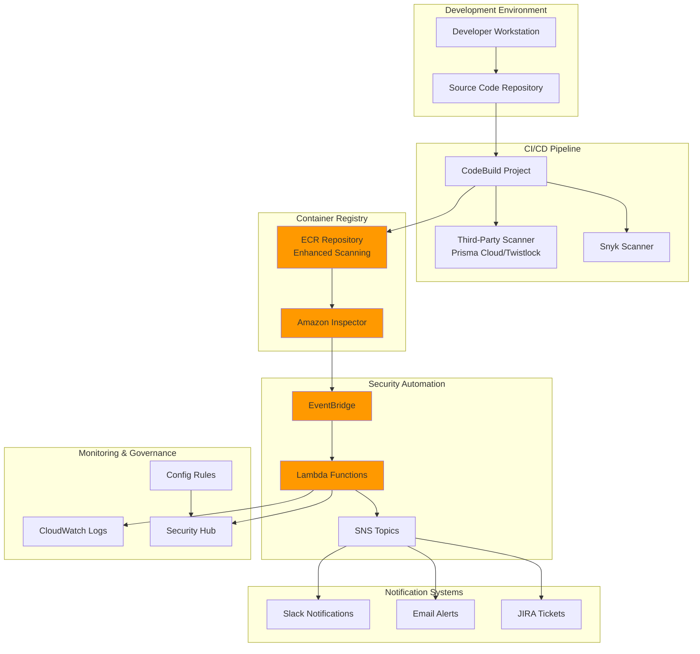

# Container Security Scanning Pipelines

## Problem

Modern enterprises deploy thousands of container images to production environments daily, creating significant security risks when vulnerabilities go undetected. Traditional security scanning approaches are often fragmented, lacking continuous monitoring and comprehensive vulnerability coverage across operating systems, application dependencies, and configuration issues. Organizations struggle to maintain compliance with security standards while ensuring that critical vulnerabilities are identified and remediated before deployment, leading to potential data breaches and regulatory violations.

## Solution

This solution implements a comprehensive container security scanning pipeline using Amazon ECR's enhanced scanning capabilities integrated with Amazon Inspector, combined with third-party security tools through automated CI/CD workflows. The architecture provides multi-layered security scanning, automated vulnerability reporting, and policy enforcement with EventBridge-driven notifications for immediate response to critical security findings.

## Architecture Diagram



## Prerequisites

1. AWS account with Administrator permissions for ECR, Inspector, CodeBuild, EventBridge, and Lambda
2. AWS CLI v2 installed and configured (or AWS CloudShell)
3. Docker installed locally for testing container builds
4. Knowledge of container security best practices and vulnerability management
5. Third-party security tool accounts (Snyk, Prisma Cloud, or similar)
6. Estimated cost: $50-150/month for scanning 100-500 images with enhanced scanning enabled

> **Note**: Enhanced scanning with Amazon Inspector incurs charges based on the number of images scanned. Review [Amazon Inspector pricing](https://aws.amazon.com/inspector/pricing/) for detailed cost information.

## Preparation

```bash
# Set environment variables
export AWS_REGION=$(aws configure get region)
export AWS_ACCOUNT_ID=$(aws sts get-caller-identity \
    --query Account --output text)

# Generate unique identifiers for resources
RANDOM_SUFFIX=$(aws secretsmanager get-random-password \
    --exclude-punctuation --exclude-uppercase \
    --password-length 6 --require-each-included-type \
    --output text --query RandomPassword)

export PROJECT_NAME="security-scanning-${RANDOM_SUFFIX}"
export ECR_REPO_NAME="secure-app-${RANDOM_SUFFIX}"
export CODEBUILD_PROJECT_NAME="security-scan-${RANDOM_SUFFIX}"

# Create foundational IAM roles
aws iam create-role \
    --role-name "ECRSecurityScanningRole-${RANDOM_SUFFIX}" \
    --assume-role-policy-document '{
        "Version": "2012-10-17",
        "Statement": [
            {
                "Effect": "Allow",
                "Principal": {
                    "Service": "codebuild.amazonaws.com"
                },
                "Action": "sts:AssumeRole"
            }
        ]
    }'

# Create Lambda execution role
aws iam create-role \
    --role-name "SecurityScanLambdaRole-${RANDOM_SUFFIX}" \
    --assume-role-policy-document '{
        "Version": "2012-10-17",
        "Statement": [
            {
                "Effect": "Allow",
                "Principal": {
                    "Service": "lambda.amazonaws.com"
                },
                "Action": "sts:AssumeRole"
            }
        ]
    }'

echo "✅ Environment prepared with project name: ${PROJECT_NAME}"
```

## Steps

1. **Create Enhanced Scanning ECR Repository**:

   Amazon ECR serves as the foundation for secure container image management, providing integrated vulnerability scanning capabilities that are essential for maintaining security posture in containerized applications. Enhanced scanning, powered by Amazon Inspector, offers continuous monitoring with automatic vulnerability database updates, ensuring that newly discovered vulnerabilities are detected in existing images without requiring rebuilds. This capability is critical for organizations that need to maintain compliance with security standards while deploying containers at scale.

   ```bash
   # Create ECR repository with enhanced scanning
   aws ecr create-repository \
       --repository-name "${ECR_REPO_NAME}" \
       --image-scanning-configuration scanOnPush=true \
       --encryption-configuration encryptionType=AES256
   
   # Get repository URI
   ECR_URI=$(aws ecr describe-repositories \
       --repository-names "${ECR_REPO_NAME}" \
       --query 'repositories[0].repositoryUri' \
       --output text)
   
   echo "✅ ECR repository created: ${ECR_URI}"
   ```

   The repository is now configured with scan-on-push enabled and AES256 encryption, providing the secure foundation for our container security pipeline. This establishes the primary storage layer where all container images will be automatically scanned for vulnerabilities upon upload, enabling immediate security assessment of new deployments. For detailed information about ECR image scanning capabilities, see the [Amazon ECR image scanning documentation](https://docs.aws.amazon.com/AmazonECR/latest/userguide/image-scanning.html).

2. **Configure Enhanced Scanning Registry Settings**:

   Enhanced scanning represents a significant advancement over basic vulnerability scanning, utilizing Amazon Inspector's deep inspection capabilities to provide comprehensive vulnerability detection across operating system packages, programming language libraries, and application dependencies. The continuous scanning mode ensures that as new vulnerabilities are discovered and added to the Common Vulnerabilities and Exposures (CVE) database, existing images are automatically rescanned without requiring manual intervention or image rebuilds.

   ```bash
   # Enable enhanced scanning for the registry
   aws ecr put-registry-scanning-configuration \
       --scan-type ENHANCED \
       --rules '[
           {
               "scanFrequency": "CONTINUOUS_SCAN",
               "repositoryFilters": [
                   {
                       "filter": "*",
                       "filterType": "WILDCARD"
                   }
               ]
           }
       ]'
   
   # Verify enhanced scanning is enabled
   aws ecr describe-registry \
       --query 'registryConfiguration.scanningConfiguration'
   
   echo "✅ Enhanced scanning configured for registry"
   ```

   The registry-level configuration now enables enhanced scanning across all repositories, establishing a comprehensive security posture that automatically protects new repositories as they are created. This centralized approach ensures consistent security policies across the entire container registry, reducing the risk of configuration drift and maintaining compliance standards. Learn more about configuring enhanced scanning in the [Amazon ECR enhanced scanning configuration guide](https://docs.aws.amazon.com/AmazonECR/latest/userguide/image-scanning-enhanced-enabling.html).

3. **Create Security Scanning CodeBuild Project**:

   AWS CodeBuild provides the scalable compute environment necessary for executing complex security scanning workflows that integrate multiple third-party security tools with AWS-native services. This step configures the IAM permissions required for CodeBuild to interact with ECR repositories, retrieve scan results, and manage the container build and deployment process. The principle of least privilege is applied by granting only the specific permissions needed for ECR operations and CloudWatch logging.

   ```bash
   # Create CodeBuild service role policy
   cat > /tmp/codebuild-policy.json << 'EOF'
   {
       "Version": "2012-10-17",
       "Statement": [
           {
               "Effect": "Allow",
               "Action": [
                   "ecr:BatchCheckLayerAvailability",
                   "ecr:GetDownloadUrlForLayer",
                   "ecr:BatchGetImage",
                   "ecr:GetAuthorizationToken",
                   "ecr:InitiateLayerUpload",
                   "ecr:UploadLayerPart",
                   "ecr:CompleteLayerUpload",
                   "ecr:PutImage",
                   "ecr:DescribeRepositories",
                   "ecr:DescribeImages",
                   "ecr:DescribeImageScanFindings"
               ],
               "Resource": "*"
           },
           {
               "Effect": "Allow",
               "Action": [
                   "logs:CreateLogGroup",
                   "logs:CreateLogStream",
                   "logs:PutLogEvents"
               ],
               "Resource": "arn:aws:logs:*:*:*"
           }
       ]
   }
   EOF
   
   # Attach policy to CodeBuild role
   aws iam put-role-policy \
       --role-name "ECRSecurityScanningRole-${RANDOM_SUFFIX}" \
       --policy-name "ECRSecurityScanningPolicy" \
       --policy-document file:///tmp/codebuild-policy.json
   
   echo "✅ CodeBuild IAM policies configured"
   ```

   The IAM policy has been configured to enable secure access to ECR repositories and CloudWatch logging, following AWS security best practices by granting only the minimum required permissions. This security-first approach ensures that the CodeBuild project can perform its scanning functions while maintaining strong access controls and audit trails for compliance purposes.

4. **Create Multi-Stage Security Scanning Pipeline**:

   The multi-stage scanning pipeline represents the core of our security strategy, orchestrating multiple security tools to provide comprehensive vulnerability detection across different layers of the container stack. This approach combines the strengths of various security tools: Snyk excels at detecting vulnerabilities in application dependencies and open-source libraries, Prisma Cloud/Twistlock provides runtime protection and compliance checking, while Amazon Inspector offers deep OS-level vulnerability detection. The pipeline architecture ensures that no single point of failure exists in the security assessment process.

   ```bash
   # Create buildspec.yml for multi-stage scanning
   cat > /tmp/buildspec.yml << 'EOF'
   version: 0.2
   
   phases:
     pre_build:
       commands:
         - echo Logging in to Amazon ECR...
         - aws ecr get-login-password --region $AWS_DEFAULT_REGION | docker login --username AWS --password-stdin $ECR_URI
         - IMAGE_TAG=${CODEBUILD_RESOLVED_SOURCE_VERSION:-latest}
         - echo Build started on `date`
         - echo Building the Docker image...
         
     build:
       commands:
         # Build the container image
         - docker build -t $ECR_REPO_NAME:$IMAGE_TAG .
         - docker tag $ECR_REPO_NAME:$IMAGE_TAG $ECR_URI:$IMAGE_TAG
         
         # Run Snyk container security scan
         - echo "Running Snyk container scan..."
         - snyk container test $ECR_REPO_NAME:$IMAGE_TAG --severity-threshold=high --json > snyk-results.json || true
         
         # Run Prisma Cloud/Twistlock scan (if configured)
         - echo "Running Prisma Cloud scan..."
         - twistcli images scan --details $ECR_REPO_NAME:$IMAGE_TAG --output-file prisma-results.json || true
         
     post_build:
       commands:
         - echo Build completed on `date`
         - echo Pushing the Docker image...
         - docker push $ECR_URI:$IMAGE_TAG
         
         # Wait for enhanced scanning to complete
         - echo "Waiting for ECR enhanced scanning..."
         - sleep 30
         
         # Get ECR scan results
         - aws ecr describe-image-scan-findings --repository-name $ECR_REPO_NAME --image-id imageTag=$IMAGE_TAG > ecr-scan-results.json || true
         
         # Process and combine scan results
         - echo "Processing security scan results..."
         - python3 process_scan_results.py
         
   artifacts:
     files:
       - '**/*'
   EOF
   
   # Create the CodeBuild project
   aws codebuild create-project \
       --name "${CODEBUILD_PROJECT_NAME}" \
       --source type=GITHUB,location="https://github.com/your-org/your-repo.git" \
       --artifacts type=NO_ARTIFACTS \
       --environment type=LINUX_CONTAINER,image=aws/codebuild/standard:5.0,computeType=BUILD_GENERAL1_MEDIUM,privilegedMode=true \
       --service-role "arn:aws:iam::${AWS_ACCOUNT_ID}:role/ECRSecurityScanningRole-${RANDOM_SUFFIX}"
   
   echo "✅ Multi-stage security scanning pipeline created"
   ```

   The CodeBuild project is now configured with privileged mode enabled, which is necessary for Docker-in-Docker operations required by container scanning tools. This multi-stage approach ensures that security scanning occurs at multiple points in the CI/CD pipeline, providing defense-in-depth security coverage. The pipeline will automatically correlate results from different scanners, providing a comprehensive security assessment that can inform deployment decisions and risk management processes.

5. **Create Security Scan Result Processing Lambda**:

   AWS Lambda provides the serverless compute environment for processing and correlating security scan results from multiple sources, enabling real-time decision-making based on vulnerability findings. This function implements business logic for risk assessment, automatically determining appropriate actions based on vulnerability severity and count thresholds. The Lambda function serves as the central intelligence hub that transforms raw vulnerability data into actionable security insights, including automated policy enforcement and compliance reporting.

   ```bash
   # Create Lambda function for processing scan results
   cat > /tmp/scan_processor.py << 'EOF'
   import json
   import boto3
   import os
   from datetime import datetime
   
   def lambda_handler(event, context):
       print("Processing security scan results...")
       
       # Parse ECR scan results from EventBridge
       detail = event.get('detail', {})
       repository_name = detail.get('repository-name', '')
       image_digest = detail.get('image-digest', '')
       finding_counts = detail.get('finding-severity-counts', {})
       
       # Create consolidated security report
       security_report = {
           'timestamp': datetime.utcnow().isoformat(),
           'repository': repository_name,
           'image_digest': image_digest,
           'scan_results': {
               'ecr_enhanced': finding_counts,
               'total_vulnerabilities': finding_counts.get('TOTAL', 0),
               'critical_vulnerabilities': finding_counts.get('CRITICAL', 0),
               'high_vulnerabilities': finding_counts.get('HIGH', 0)
           }
       }
       
       # Determine risk level and actions
       critical_count = finding_counts.get('CRITICAL', 0)
       high_count = finding_counts.get('HIGH', 0)
       
       if critical_count > 0:
           risk_level = 'CRITICAL'
           action_required = 'IMMEDIATE_BLOCK'
       elif high_count > 5:
           risk_level = 'HIGH'
           action_required = 'REVIEW_REQUIRED'
       else:
           risk_level = 'LOW'
           action_required = 'MONITOR'
       
       security_report['risk_assessment'] = {
           'risk_level': risk_level,
           'action_required': action_required,
           'compliance_status': 'FAIL' if critical_count > 0 else 'PASS'
       }
       
       # Send to Security Hub
       securityhub = boto3.client('securityhub')
       try:
           securityhub.batch_import_findings(
               Findings=[{
                   'SchemaVersion': '2018-10-08',
                   'Id': f"{repository_name}-{image_digest}",
                   'ProductArn': f"arn:aws:securityhub:{os.environ['AWS_REGION']}:{os.environ['AWS_ACCOUNT_ID']}:product/custom/container-security-scanner",
                   'GeneratorId': 'container-security-pipeline',
                   'AwsAccountId': os.environ['AWS_ACCOUNT_ID'],
                   'Title': f"Container Security Scan - {repository_name}",
                   'Description': f"Security scan completed for {repository_name}",
                   'Severity': {
                       'Label': risk_level
                   },
                   'Resources': [{
                       'Type': 'AwsEcrContainerImage',
                       'Id': f"{repository_name}:{image_digest}",
                       'Region': os.environ['AWS_REGION']
                   }]
               }]
           )
       except Exception as e:
           print(f"Error sending to Security Hub: {e}")
       
       # Trigger notifications based on risk level
       if risk_level in ['CRITICAL', 'HIGH']:
           sns = boto3.client('sns')
           sns.publish(
               TopicArn=os.environ['SNS_TOPIC_ARN'],
               Message=json.dumps(security_report, indent=2),
               Subject=f"Container Security Alert - {risk_level} Risk Detected"
           )
       
       return {
           'statusCode': 200,
           'body': json.dumps(security_report)
       }
   EOF
   
   # Create deployment package
   zip -j /tmp/scan_processor.zip /tmp/scan_processor.py
   
   # Create Lambda function
   aws lambda create-function \
       --function-name "SecurityScanProcessor-${RANDOM_SUFFIX}" \
       --runtime python3.9 \
       --role "arn:aws:iam::${AWS_ACCOUNT_ID}:role/SecurityScanLambdaRole-${RANDOM_SUFFIX}" \
       --handler scan_processor.lambda_handler \
       --zip-file fileb:///tmp/scan_processor.zip \
       --environment Variables='{
           "SNS_TOPIC_ARN":"arn:aws:sns:'${AWS_REGION}':'${AWS_ACCOUNT_ID}':security-alerts-'${RANDOM_SUFFIX}'"
       }'
   
   echo "✅ Security scan processing Lambda created"
   ```

   The Lambda function is now deployed and ready to process security scan events from EventBridge. This serverless architecture ensures that scan results are processed immediately upon completion, enabling real-time security responses and maintaining continuous security monitoring. The function will automatically forward high-priority findings to Security Hub for centralized security management and trigger appropriate notifications based on risk levels. For more information about Security Hub findings format, refer to the [AWS Security Hub findings documentation](https://docs.aws.amazon.com/securityhub/latest/userguide/securityhub-findings.html).

6. **Configure EventBridge Rules for Scan Events**:

   Amazon EventBridge provides the event-driven architecture foundation that enables real-time response to security scan completions, creating a responsive security system that can take immediate action based on vulnerability findings. EventBridge integrates seamlessly with Amazon Inspector's enhanced scanning capabilities, automatically triggering workflows when scans complete. This event-driven approach ensures that security findings are processed without delay, enabling rapid response to critical vulnerabilities and maintaining security posture without manual intervention.

   ```bash
   # Create SNS topic for security alerts
   aws sns create-topic \
       --name "security-alerts-${RANDOM_SUFFIX}"
   
   SNS_TOPIC_ARN=$(aws sns get-topic-attributes \
       --topic-arn "arn:aws:sns:${AWS_REGION}:${AWS_ACCOUNT_ID}:security-alerts-${RANDOM_SUFFIX}" \
       --query 'Attributes.TopicArn' --output text)
   
   # Create EventBridge rule for ECR scan completion
   aws events put-rule \
       --name "ECRScanCompleted-${RANDOM_SUFFIX}" \
       --event-pattern '{
           "source": ["aws.inspector2"],
           "detail-type": ["Inspector2 Scan"],
           "detail": {
               "scan-status": ["INITIAL_SCAN_COMPLETE"]
           }
       }'
   
   # Add Lambda target to EventBridge rule
   aws events put-targets \
       --rule "ECRScanCompleted-${RANDOM_SUFFIX}" \
       --targets "Id"="1","Arn"="arn:aws:lambda:${AWS_REGION}:${AWS_ACCOUNT_ID}:function:SecurityScanProcessor-${RANDOM_SUFFIX}"
   
   # Grant EventBridge permission to invoke Lambda
   aws lambda add-permission \
       --function-name "SecurityScanProcessor-${RANDOM_SUFFIX}" \
       --statement-id "AllowExecutionFromEventBridge" \
       --action "lambda:InvokeFunction" \
       --principal events.amazonaws.com \
       --source-arn "arn:aws:events:${AWS_REGION}:${AWS_ACCOUNT_ID}:rule/ECRScanCompleted-${RANDOM_SUFFIX}"
   
   echo "✅ EventBridge automation configured"
   ```

   The EventBridge rule is now configured to automatically trigger our Lambda function whenever Amazon Inspector completes an enhanced scan, creating a fully automated security response system. This configuration ensures that security findings are processed in real-time, enabling immediate notification and response to critical vulnerabilities. The SNS topic provides a scalable notification mechanism that can be extended to support multiple communication channels and integration with external security management systems. For detailed information about EventBridge events from enhanced scanning, see the [Amazon ECR EventBridge events documentation](https://docs.aws.amazon.com/AmazonECR/latest/userguide/image-scanning-enhanced-events.html).

7. **Create Security Policy Enforcement Rules**:

   Security policy enforcement represents the governance layer of our container security architecture, ensuring that all repositories comply with organizational security standards and regulatory requirements. AWS Config provides continuous compliance monitoring by automatically evaluating ECR repositories against predefined security policies, while the Lambda function's Security Hub integration enables centralized security findings management across the AWS environment. This approach implements security as code principles, making security policies auditable, version-controlled, and consistently enforced.

   ```bash
   # Create IAM policy for Lambda Security Hub integration
   cat > /tmp/lambda-security-policy.json << 'EOF'
   {
       "Version": "2012-10-17",
       "Statement": [
           {
               "Effect": "Allow",
               "Action": [
                   "securityhub:BatchImportFindings",
                   "securityhub:GetFindings",
                   "sns:Publish",
                   "logs:CreateLogGroup",
                   "logs:CreateLogStream",
                   "logs:PutLogEvents"
               ],
               "Resource": "*"
           }
       ]
   }
   EOF
   
   # Attach policy to Lambda role
   aws iam put-role-policy \
       --role-name "SecurityScanLambdaRole-${RANDOM_SUFFIX}" \
       --policy-name "SecurityHubIntegrationPolicy" \
       --policy-document file:///tmp/lambda-security-policy.json
   
   # Create Config rule for ECR repository compliance
   aws configservice put-config-rule \
       --config-rule '{
           "ConfigRuleName": "ecr-repository-scan-enabled-'${RANDOM_SUFFIX}'",
           "Source": {
               "Owner": "AWS",
               "SourceIdentifier": "ECR_PRIVATE_IMAGE_SCANNING_ENABLED"
           },
           "Scope": {
               "ComplianceResourceTypes": ["AWS::ECR::Repository"]
           }
       }'
   
   echo "✅ Security policy enforcement configured"
   ```

   The security policy enforcement framework is now active, providing continuous compliance monitoring and automated security findings management. The Config rule will automatically evaluate all ECR repositories to ensure image scanning is enabled, while the Lambda function has the necessary permissions to integrate with Security Hub for centralized security management. This governance approach ensures that security policies are consistently applied across all container repositories, supporting audit requirements and regulatory compliance frameworks.

8. **Set Up Third-Party Scanner Integration**:

   Third-party security scanner integration extends the security coverage beyond AWS-native capabilities, providing specialized vulnerability detection for specific programming languages, frameworks, and compliance requirements. Snyk excels at identifying vulnerabilities in application dependencies and provides detailed remediation guidance, while Prisma Cloud offers comprehensive runtime protection and compliance policy enforcement. This multi-vendor approach ensures comprehensive security coverage and reduces the risk of security gaps that could be exploited by attackers.

   ```bash
   # Create Snyk integration script
   cat > /tmp/snyk-integration.sh << 'EOF'
   #!/bin/bash
   
   # Install Snyk CLI
   npm install -g snyk
   
   # Authenticate with Snyk (requires SNYK_TOKEN environment variable)
   snyk auth $SNYK_TOKEN
   
   # Configure Snyk for container scanning
   snyk config set api=$SNYK_TOKEN
   
   # Create Snyk policy file
   cat > .snyk << 'SNYK_EOF'
   version: v1.0.0
   ignore: {}
   patch: {}
   language-settings:
     javascript:
       packageManager: npm
   SNYK_EOF
   
   echo "Snyk integration configured"
   EOF
   
   # Create Prisma Cloud integration script
   cat > /tmp/prisma-integration.sh << 'EOF'
   #!/bin/bash
   
   # Download Prisma Cloud CLI (twistcli)
   curl -k -u $PRISMA_USER:$PRISMA_PASSWORD \
       https://$PRISMA_CONSOLE/api/v1/util/twistcli > twistcli
   
   chmod +x twistcli
   
   # Configure Prisma Cloud scanning
   ./twistcli images scan \
       --address $PRISMA_CONSOLE \
       --user $PRISMA_USER \
       --password $PRISMA_PASSWORD \
       --details \
       --output-file prisma-results.json \
       $IMAGE_NAME
   
   echo "Prisma Cloud integration configured"
   EOF
   
   chmod +x /tmp/snyk-integration.sh /tmp/prisma-integration.sh
   
   echo "✅ Third-party scanner integration scripts created"
   ```

   The third-party scanner integration scripts are now configured and ready for use in the CodeBuild pipeline. These scripts provide the bridge between AWS-native security services and specialized third-party security tools, enabling comprehensive vulnerability detection across multiple security domains. The integration approach maintains security best practices by using environment variables for authentication credentials and enabling detailed scan result output for correlation with other security findings.

9. **Create Compliance Reporting Dashboard**:

   CloudWatch dashboards provide the centralized visibility layer that enables security teams to monitor container security posture across the entire organization. The dashboard aggregates security metrics from multiple sources, providing both real-time monitoring and historical trend analysis that supports compliance reporting and security governance activities. This visualization approach transforms raw security data into actionable insights that can inform strategic security decisions and demonstrate compliance with regulatory requirements.

   ```bash
   # Create CloudWatch dashboard for security metrics
   cat > /tmp/security-dashboard.json << 'EOF'
   {
       "widgets": [
           {
               "type": "metric",
               "properties": {
                   "metrics": [
                       ["AWS/ECR", "RepositoryCount"],
                       ["AWS/ECR", "ImageCount"]
                   ],
                   "period": 300,
                   "stat": "Sum",
                   "region": "'${AWS_REGION}'",
                   "title": "ECR Repository Metrics"
               }
           },
           {
               "type": "log",
               "properties": {
                   "query": "SOURCE '/aws/lambda/SecurityScanProcessor-'${RANDOM_SUFFIX}' | fields @timestamp, @message | filter @message like /CRITICAL/ | sort @timestamp desc | limit 20",
                   "region": "'${AWS_REGION}'",
                   "title": "Critical Security Findings"
               }
           }
       ]
   }
   EOF
   
   # Create CloudWatch dashboard
   aws cloudwatch put-dashboard \
       --dashboard-name "ContainerSecurityDashboard-${RANDOM_SUFFIX}" \
       --dashboard-body file:///tmp/security-dashboard.json
   
   echo "✅ Security compliance dashboard created"
   ```

   The compliance reporting dashboard is now active and provides real-time visibility into container security metrics and critical findings. This centralized monitoring approach enables security teams to quickly identify trends, track compliance status, and respond to security incidents. The dashboard can be extended with additional widgets to support specific compliance frameworks and organizational security requirements.

10. **Deploy Sample Application with Security Scanning**:

    This step deploys a sample application that intentionally contains known vulnerabilities, providing a practical testing environment to validate the security scanning pipeline's effectiveness. The application uses outdated versions of popular JavaScript libraries with documented security vulnerabilities, demonstrating how the scanning pipeline detects and reports security issues. This testing approach enables validation of the entire security workflow, from vulnerability detection through automated notification and Security Hub integration.

    ```bash
    # Create sample Dockerfile with known vulnerabilities for testing
    cat > /tmp/Dockerfile << 'EOF'
    FROM ubuntu:18.04
    
    # Install packages with known vulnerabilities for testing
    RUN apt-get update && apt-get install -y \
        curl \
        wget \
        openssl \
        nodejs \
        npm
    
    # Create application directory
    WORKDIR /app
    
    # Copy application files
    COPY package*.json ./
    
    # Install dependencies
    RUN npm install
    
    # Copy source code
    COPY . .
    
    # Expose port
    EXPOSE 3000
    
    # Run application
    CMD ["node", "app.js"]
    EOF
    
    # Create sample package.json with vulnerable dependencies
    cat > /tmp/package.json << 'EOF'
    {
        "name": "security-test-app",
        "version": "1.0.0",
        "description": "Test application for security scanning",
        "main": "app.js",
        "dependencies": {
            "express": "4.16.0",
            "lodash": "4.17.4",
            "request": "2.81.0"
        }
    }
    EOF
    
    # Create sample app.js
    cat > /tmp/app.js << 'EOF'
    const express = require('express');
    const app = express();
    const port = 3000;
    
    app.get('/', (req, res) => {
        res.send('Hello from Security Test App!');
    });
    
    app.listen(port, () => {
        console.log(`App listening at http://localhost:${port}`);
    });
    EOF
    
    # Build and push test image
    cd /tmp
    docker build -t "${ECR_REPO_NAME}:test" .
    
    # Get ECR login token
    aws ecr get-login-password --region "${AWS_REGION}" | \
        docker login --username AWS --password-stdin "${ECR_URI}"
    
    # Tag and push image
    docker tag "${ECR_REPO_NAME}:test" "${ECR_URI}:test"
    docker push "${ECR_URI}:test"
    
    echo "✅ Sample application deployed for security testing"
    ```

    The sample application has been successfully deployed to ECR and will automatically trigger the security scanning pipeline. The intentionally vulnerable dependencies will be detected by the various scanning tools, providing a comprehensive test of the security automation workflow. This deployment validates the entire security pipeline from image scanning through EventBridge automation to Security Hub integration and notification systems.

## Validation & Testing

1. **Verify Enhanced Scanning is Active**:

   ```bash
   # Check registry scanning configuration
   aws ecr describe-registry \
       --query 'registryConfiguration.scanningConfiguration'
   
   # Verify repository scanning status
   aws ecr describe-repositories \
       --repository-names "${ECR_REPO_NAME}" \
       --query 'repositories[0].imageScanningConfiguration'
   ```

   Expected output: Shows enhanced scanning enabled with continuous scanning frequency.

2. **Test Image Scan Results**:

   ```bash
   # Get scan results for the test image
   aws ecr describe-image-scan-findings \
       --repository-name "${ECR_REPO_NAME}" \
       --image-id imageTag=test \
       --query 'imageScanFindings.findingCounts'
   
   # Check scan status
   aws ecr describe-images \
       --repository-name "${ECR_REPO_NAME}" \
       --image-ids imageTag=test \
       --query 'imageDetails[0].imageScanFindingsSummary'
   ```

   Expected output: Shows vulnerability counts by severity level and scan completion status.

3. **Validate EventBridge Integration**:

   ```bash
   # Check EventBridge rule status
   aws events describe-rule \
       --name "ECRScanCompleted-${RANDOM_SUFFIX}" \
       --query 'State'
   
   # Verify Lambda function logs
   aws logs describe-log-groups \
       --log-group-name-prefix "/aws/lambda/SecurityScanProcessor-${RANDOM_SUFFIX}"
   ```

   Expected output: Rule shows as "ENABLED" and Lambda logs show recent executions.

4. **Test Security Hub Integration**:

   ```bash
   # Check Security Hub findings
   aws securityhub get-findings \
       --filters '{"ProductName": [{"Value": "custom/container-security-scanner", "Comparison": "EQUALS"}]}' \
       --query 'Findings[0].{Title:Title,Severity:Severity.Label,Resource:Resources[0].Id}'
   ```

   Expected output: Shows container security findings in Security Hub.

## Cleanup

1. **Remove EventBridge Rules and Lambda Function**:

   ```bash
   # Remove EventBridge targets
   aws events remove-targets \
       --rule "ECRScanCompleted-${RANDOM_SUFFIX}" \
       --ids "1"
   
   # Delete EventBridge rule
   aws events delete-rule \
       --name "ECRScanCompleted-${RANDOM_SUFFIX}"
   
   # Delete Lambda function
   aws lambda delete-function \
       --function-name "SecurityScanProcessor-${RANDOM_SUFFIX}"
   
   echo "✅ EventBridge and Lambda resources deleted"
   ```

2. **Remove SNS Topic and Config Rules**:

   ```bash
   # Delete SNS topic
   aws sns delete-topic \
       --topic-arn "arn:aws:sns:${AWS_REGION}:${AWS_ACCOUNT_ID}:security-alerts-${RANDOM_SUFFIX}"
   
   # Delete Config rule
   aws configservice delete-config-rule \
       --config-rule-name "ecr-repository-scan-enabled-${RANDOM_SUFFIX}"
   
   echo "✅ SNS and Config resources deleted"
   ```

3. **Remove CodeBuild Project**:

   ```bash
   # Delete CodeBuild project
   aws codebuild delete-project \
       --name "${CODEBUILD_PROJECT_NAME}"
   
   echo "✅ CodeBuild project deleted"
   ```

4. **Clean Up ECR Repository**:

   ```bash
   # Delete all images in repository
   aws ecr batch-delete-image \
       --repository-name "${ECR_REPO_NAME}" \
       --image-ids imageTag=test
   
   # Delete ECR repository
   aws ecr delete-repository \
       --repository-name "${ECR_REPO_NAME}" \
       --force
   
   echo "✅ ECR repository deleted"
   ```

5. **Remove IAM Roles and Policies**:

   ```bash
   # Delete IAM role policies
   aws iam delete-role-policy \
       --role-name "ECRSecurityScanningRole-${RANDOM_SUFFIX}" \
       --policy-name "ECRSecurityScanningPolicy"
   
   aws iam delete-role-policy \
       --role-name "SecurityScanLambdaRole-${RANDOM_SUFFIX}" \
       --policy-name "SecurityHubIntegrationPolicy"
   
   # Delete IAM roles
   aws iam delete-role \
       --role-name "ECRSecurityScanningRole-${RANDOM_SUFFIX}"
   
   aws iam delete-role \
       --role-name "SecurityScanLambdaRole-${RANDOM_SUFFIX}"
   
   echo "✅ IAM resources deleted"
   ```

6. **Remove CloudWatch Dashboard and Temporary Files**:

   ```bash
   # Delete CloudWatch dashboard
   aws cloudwatch delete-dashboards \
       --dashboard-names "ContainerSecurityDashboard-${RANDOM_SUFFIX}"
   
   # Clean up temporary files
   rm -f /tmp/codebuild-policy.json /tmp/buildspec.yml /tmp/scan_processor.py
   rm -f /tmp/scan_processor.zip /tmp/lambda-security-policy.json
   rm -f /tmp/security-dashboard.json /tmp/Dockerfile /tmp/package.json /tmp/app.js
   rm -f /tmp/snyk-integration.sh /tmp/prisma-integration.sh
   
   # Unset environment variables
   unset PROJECT_NAME ECR_REPO_NAME CODEBUILD_PROJECT_NAME RANDOM_SUFFIX ECR_URI SNS_TOPIC_ARN
   
   echo "✅ All resources and temporary files cleaned up"
   ```

## Discussion

This comprehensive container security scanning pipeline addresses the critical need for multi-layered vulnerability detection in modern containerized applications. The architecture combines AWS-native services with third-party security tools to provide comprehensive coverage across operating system vulnerabilities, application dependencies, and configuration issues. Amazon ECR's enhanced scanning, powered by Amazon Inspector, offers continuous monitoring and automatic vulnerability database updates, while integration with tools like Snyk and Prisma Cloud provides specialized scanning capabilities for specific programming languages and compliance frameworks.

The EventBridge-driven automation ensures immediate response to security findings, enabling organizations to implement policy-based controls that can automatically block deployments of vulnerable images or trigger remediation workflows. This approach is particularly valuable for organizations with stringent compliance requirements, such as those in financial services or healthcare, where container security is paramount to maintaining regulatory compliance and protecting sensitive data.

The solution's integration with AWS Security Hub provides centralized security findings management, enabling security teams to correlate container vulnerabilities with other security events across their AWS infrastructure. The automated reporting and notification capabilities ensure that security teams are immediately alerted to critical vulnerabilities, reducing the mean time to remediation and minimizing exposure to potential security threats.

Performance considerations include the scanning duration for large images and the cost implications of continuous scanning. Organizations should evaluate their scanning frequency requirements and implement appropriate filtering to balance security coverage with operational costs. The architecture supports both scan-on-push and continuous scanning modes, allowing organizations to optimize their security posture based on their specific risk tolerance and operational requirements.

> **Tip**: Configure scan filters to optimize costs by focusing enhanced scanning on production and staging repositories while using basic scanning for development environments.

## Challenge

Extend this solution by implementing these enhancements:

1. **Implement vulnerability remediation automation** using AWS Systems Manager to automatically patch base images and rebuild containers when security updates are available.

2. **Create policy-as-code enforcement** using Open Policy Agent (OPA) and AWS Lambda to automatically prevent deployment of images that violate security policies or contain critical vulnerabilities.

3. **Build compliance reporting workflows** that generate automated security reports for SOC 2, PCI DSS, or other regulatory frameworks, including evidence collection and audit trails.

4. **Integrate with GitOps workflows** using AWS CodeCommit, CodePipeline, and Amazon EKS to implement security scanning as part of a complete CI/CD pipeline with automated rollback capabilities.

5. **Implement advanced threat detection** using Amazon GuardDuty and custom ML models to detect malicious activity in container images and runtime environments.

## Infrastructure Code

*Infrastructure code will be generated after recipe approval.*