# Container Vulnerability Scanning with ECR

## Problem

Organizations struggle with maintaining secure containerized applications due to the complexity of tracking vulnerabilities across multiple container images. Development teams often push container images without comprehensive security scanning, leaving applications exposed to known vulnerabilities, malware, and supply chain attacks. Manual vulnerability assessment processes are time-consuming and prone to human error, while existing security tools often fail to provide actionable insights for remediation priorities. This creates compliance gaps and increases the risk of security incidents in production environments.

## Solution

Implement an automated container image vulnerability scanning solution using Amazon ECR's enhanced scanning capabilities integrated with Amazon Inspector. This solution provides continuous monitoring of container images for both operating system and programming language package vulnerabilities, with automated scan triggers on image push events. Amazon Inspector leverages multiple vulnerability databases and provides detailed findings with remediation guidance, while ECR integration ensures seamless scanning without disrupting development workflows.

## Architecture Diagram

```mermaid
graph TB
    subgraph "Development Environment"
        DEV[Developer]
        DOCKER[Docker Build]
    end
    
    subgraph "Container Registry"
        ECR[Amazon ECR Repository]
        SCAN[Enhanced Scanning]
    end
    
    subgraph "Security Services"
        INSPECTOR[Amazon Inspector]
        CVE[CVE Database]
        FINDINGS[Vulnerability Findings]
    end
    
    subgraph "Monitoring & Alerting"
        EB[EventBridge]
        SNS[SNS Topic]
        EMAIL[Email Alerts]
    end
    
    subgraph "Runtime Environment"
        ECS[ECS/EKS Clusters]
        CONTAINERS[Running Containers]
    end
    
    DEV-->DOCKER
    DOCKER-->|1. Push Image|ECR
    ECR-->|2. Trigger Scan|SCAN
    SCAN-->|3. Invoke Scanner|INSPECTOR
    INSPECTOR-->|4. Query CVEs|CVE
    INSPECTOR-->|5. Generate Findings|FINDINGS
    FINDINGS-->|6. Send Events|EB
    EB-->|7. Route Alerts|SNS
    SNS-->|8. Notify Team|EMAIL
    ECR-->|9. Deploy Images|ECS
    ECS-->CONTAINERS
    INSPECTOR-->|10. Map Usage|CONTAINERS
    
    style ECR fill:#FF9900
    style INSPECTOR fill:#232F3E
    style FINDINGS fill:#FF4842
    style CVE fill:#3F8624
```



## Prerequisites

1. AWS account with ECR, Inspector, EventBridge, and SNS permissions
2. AWS CLI v2 installed and configured (or AWS CloudShell)
3. Docker installed for building and pushing container images
4. Basic understanding of container security concepts and vulnerability management
5. Estimated cost: $0.10-0.50 per image scanned (Inspector pricing) + ECR storage costs

> **Note**: Enhanced scanning is billed through Amazon Inspector. Review pricing at https://aws.amazon.com/inspector/pricing/

## Preparation

```bash
# Set environment variables
export AWS_REGION=$(aws configure get region)
export AWS_ACCOUNT_ID=$(aws sts get-caller-identity \
    --query Account --output text)

# Generate unique identifiers for resources
RANDOM_SUFFIX=$(aws secretsmanager get-random-password \
    --exclude-punctuation --exclude-uppercase \
    --password-length 6 --require-each-included-type \
    --output text --query RandomPassword)

# Set resource names
export ECR_REPOSITORY_NAME="vulnerable-app-${RANDOM_SUFFIX}"
export SNS_TOPIC_NAME="ecr-vulnerability-alerts-${RANDOM_SUFFIX}"
export EMAIL_ADDRESS="your-email@example.com"

# Create SNS topic for vulnerability alerts
aws sns create-topic --name "${SNS_TOPIC_NAME}"

# Store topic ARN
export SNS_TOPIC_ARN=$(aws sns get-topic-attributes \
    --topic-arn "arn:aws:sns:${AWS_REGION}:${AWS_ACCOUNT_ID}:${SNS_TOPIC_NAME}" \
    --query Attributes.TopicArn --output text)

echo "✅ Environment configured with repository: ${ECR_REPOSITORY_NAME}"
```

## Steps

1. **Create ECR Repository with Scan on Push**:

   Amazon ECR's enhanced scanning integrates directly with Amazon Inspector to provide comprehensive vulnerability detection. This integration automatically scans images on push and provides continuous monitoring for newly discovered vulnerabilities.

   ```bash
   # Create ECR repository with scan on push enabled
   aws ecr create-repository \
       --repository-name "${ECR_REPOSITORY_NAME}" \
       --image-scanning-configuration scanOnPush=true \
       --tags Key=Purpose,Value=VulnerabilityScanning \
       Key=Environment,Value=Demo
   
   # Store repository URI
   export ECR_REPOSITORY_URI=$(aws ecr describe-repositories \
       --repository-names "${ECR_REPOSITORY_NAME}" \
       --query 'repositories[0].repositoryUri' --output text)
   
   echo "✅ ECR repository created: ${ECR_REPOSITORY_URI}"
   ```

   The repository is now configured with scan-on-push enabled, which triggers vulnerability scanning whenever a new image is pushed. This ensures that security assessment happens immediately as part of your CI/CD pipeline workflow.

2. **Enable Amazon Inspector Enhanced Scanning**:

   Amazon Inspector Enhanced Scanning provides deeper vulnerability detection than basic ECR scanning, including support for programming language packages (Python, Java, JavaScript, etc.) and more comprehensive OS package scanning. The enhanced scanning service leverages multiple vulnerability databases including the National Vulnerability Database (NVD) and vendor-specific security advisories.

   ```bash
   # Enable Inspector ECR scanning at the account level
   aws inspector2 enable \
       --resource-types ECR \
       --account-ids "${AWS_ACCOUNT_ID}"
   
   # Configure registry scanning configuration for enhanced scanning
   aws ecr put-registry-scanning-configuration \
       --scan-type ENHANCED \
       --rules '[{
           "scanFrequency": "SCAN_ON_PUSH",
           "repositoryFilters": [{
               "filter": "*",
               "filterType": "WILDCARD"
           }]
       }]'
   
   echo "✅ Inspector enhanced scanning enabled for ECR"
   ```

   Enhanced scanning is now active for all repositories in your registry. The wildcard filter ensures that all current and future repositories will be scanned using Amazon Inspector's advanced vulnerability detection capabilities. This configuration follows AWS security best practices for container security, as detailed in the [Amazon Inspector User Guide](https://docs.aws.amazon.com/inspector/latest/user/what-is-inspector.html).

3. **Configure Inspector Rescan Settings**:

   The rescan duration setting determines how frequently Amazon Inspector re-evaluates container images for newly discovered vulnerabilities, even when the image hasn't changed. This continuous monitoring capability is essential for maintaining security posture over time, as new CVEs are published daily and previously clean images may become vulnerable.

   ```bash
   # Set ECR re-scan duration to 30 days
   aws inspector2 update-configuration \
       --ecr-configuration '{
           "rescanDuration": "DAYS_30"
       }'
   
   # Verify Inspector configuration
   aws inspector2 get-configuration \
       --query 'ecrConfiguration.rescanDurationState'
   
   echo "✅ Inspector scanning configuration updated"
   ```

   Setting a 30-day rescan duration balances security coverage with cost optimization, ensuring regular monitoring without excessive charges. This configuration ensures that your container images are continuously monitored for emerging threats, providing ongoing security assurance for long-running applications.

4. **Create Sample Vulnerable Container Image**:

   This step creates a container image with intentionally outdated packages to demonstrate vulnerability detection capabilities. In real scenarios, vulnerabilities often come from outdated base images, unpatched system packages, or vulnerable application dependencies.

   ```bash
   # Create directory for sample application
   mkdir -p vulnerable-app && cd vulnerable-app
   
   # Create Dockerfile with intentionally vulnerable packages
   cat > Dockerfile << 'EOF'
   FROM ubuntu:20.04
   RUN apt-get update && apt-get install -y \
       curl \
       wget \
       apache2 \
       php7.4 \
       libssl1.1 \
       openssl \
       && rm -rf /var/lib/apt/lists/*
   EXPOSE 80
   CMD ["apache2ctl", "-D", "FOREGROUND"]
   EOF
   
   # Build the container image
   docker build -t "${ECR_REPOSITORY_URI}:vulnerable-v1.0" .
   
   echo "✅ Sample vulnerable container image built"
   ```

   The sample image uses Ubuntu 20.04 and includes packages that may contain known vulnerabilities. This demonstrates how Amazon Inspector detects security issues in common enterprise application stacks, helping you understand the scanning process before implementing it with production images.

5. **Authenticate and Push Image to ECR**:

   ECR authentication uses temporary tokens that provide secure access to your container registry without exposing permanent credentials. The authentication process generates a 12-hour token that Docker uses to authenticate with the ECR service.

   ```bash
   # Get ECR authentication token
   aws ecr get-login-password --region "${AWS_REGION}" | \
       docker login --username AWS --password-stdin \
       "${AWS_ACCOUNT_ID}.dkr.ecr.${AWS_REGION}.amazonaws.com"
   
   # Push the image to ECR
   docker push "${ECR_REPOSITORY_URI}:vulnerable-v1.0"
   
   # Wait for push to complete and scan to initialize
   sleep 30
   
   echo "✅ Container image pushed to ECR"
   ```

   The image push triggers automatic vulnerability scanning due to the scanOnPush configuration enabled earlier. ECR immediately begins the enhanced scanning process, leveraging Amazon Inspector's vulnerability database to identify potential security issues. This integration ensures that security scanning occurs seamlessly as part of your container deployment workflow, as described in the [ECR Enhanced Scanning documentation](https://docs.aws.amazon.com/AmazonECR/latest/userguide/image-scanning-enhanced.html).

6. **Monitor Initial Scan Progress**:

   Amazon Inspector's scanning process analyzes both operating system packages and programming language libraries within your container images. The scanner compares installed packages against multiple vulnerability databases, including the National Vulnerability Database (NVD) and vendor-specific security advisories.

   ```bash
   # Check scan status
   aws ecr describe-image-scan-findings \
       --repository-name "${ECR_REPOSITORY_NAME}" \
       --image-id imageTag=vulnerable-v1.0 \
       --query 'imageScanStatus' 2>/dev/null || \
       echo "Scan in progress - enhanced scanning may take 5-15 minutes"
   
   # Get image details and scan summary
   aws ecr describe-images \
       --repository-name "${ECR_REPOSITORY_NAME}" \
       --image-ids imageTag=vulnerable-v1.0 \
       --query 'imageDetails[0].imageScanFindingsSummary'
   
   echo "✅ Initial scan initiated"
   ```

   Scan findings are categorized by severity (CRITICAL, HIGH, MEDIUM, LOW, INFORMATIONAL) and include detailed remediation guidance to help development teams prioritize fixes. The scan results provide a comprehensive security assessment, including CVE identifiers, CVSS scores, and package-specific remediation advice.

7. **Set up EventBridge Rules for Scan Notifications**:

   Amazon EventBridge enables event-driven architecture by routing security events from Inspector to downstream systems for automated response. This decoupled approach allows multiple systems to react to vulnerability findings simultaneously, supporting complex workflows like ticket creation, deployment blocking, and compliance reporting.

   ```bash
   # Create EventBridge rule for Inspector findings
   aws events put-rule \
       --name "ECR-Vulnerability-Findings-${RANDOM_SUFFIX}" \
       --description "Capture Inspector ECR vulnerability findings" \
       --event-pattern '{
           "source": ["aws.inspector2"],
           "detail-type": ["Inspector2 Finding"],
           "detail": {
               "service": ["ECR"]
           }
       }'
   
   # Add SNS target to the rule
   aws events put-targets \
       --rule "ECR-Vulnerability-Findings-${RANDOM_SUFFIX}" \
       --targets "Id=1,Arn=${SNS_TOPIC_ARN}"
   
   # Grant EventBridge permission to publish to SNS
   aws sns add-permission \
       --topic-arn "${SNS_TOPIC_ARN}" \
       --label "EventBridge-Publish" \
       --aws-account-id "${AWS_ACCOUNT_ID}" \
       --action-name "Publish"
   
   echo "✅ EventBridge rule configured for vulnerability notifications"
   ```

   The EventBridge rule captures Inspector vulnerability findings in real-time and routes them to SNS for notification distribution. EventBridge's pattern matching capabilities ensure that only relevant ECR security events trigger notifications, reducing noise and focusing attention on actionable findings. Learn more about EventBridge patterns in the [EventBridge User Guide](https://docs.aws.amazon.com/eventbridge/latest/userguide/eb-events.html).

8. **Configure SNS Email Subscription**:

   Amazon SNS provides reliable, scalable notification delivery to multiple communication channels, ensuring security alerts reach the right stakeholders promptly. The fan-out messaging pattern allows single vulnerability findings to trigger notifications across multiple channels (email, SMS, Slack, etc.).

   ```bash
   # Subscribe email to SNS topic
   aws sns subscribe \
       --topic-arn "${SNS_TOPIC_ARN}" \
       --protocol email \
       --notification-endpoint "${EMAIL_ADDRESS}"
   
   echo "✅ Email subscription created - please confirm the subscription"
   echo "Check your email for subscription confirmation"
   ```

   The email subscription requires confirmation to prevent unauthorized notifications and ensure legitimate stakeholders receive security alerts. SNS supports multiple subscription protocols including email, SMS, HTTP/HTTPS webhooks, and AWS Lambda functions, enabling flexible notification routing based on organizational needs. For more information about SNS subscriptions, see the [SNS Developer Guide](https://docs.aws.amazon.com/sns/latest/dg/sns-getting-started.html).

9. **Create Enhanced Container Image with Security Improvements**:

   Container security hardening involves multiple layers of protection, including using recent base images, minimizing installed packages, applying security updates, and implementing proper user access controls. The secure image demonstrates best practices for reducing attack surface and vulnerability exposure.

   ```bash
   # Create improved Dockerfile with security best practices
   cat > Dockerfile.secure << 'EOF'
   FROM ubuntu:22.04
   RUN apt-get update && apt-get install -y \
       curl \
       && apt-get upgrade -y \
       && rm -rf /var/lib/apt/lists/*
   RUN useradd -m -s /bin/bash appuser
   USER appuser
   WORKDIR /home/appuser
   CMD ["sleep", "infinity"]
   EOF
   
   # Build and push the secure image
   docker build -f Dockerfile.secure -t "${ECR_REPOSITORY_URI}:secure-v1.0" .
   docker push "${ECR_REPOSITORY_URI}:secure-v1.0"
   
   echo "✅ Secure container image built and pushed"
   ```

   The secure image incorporates multiple security improvements: using a newer base image (Ubuntu 22.04) reduces known vulnerabilities, running apt-get upgrade applies the latest security patches, and implementing non-root user execution follows the principle of least privilege. These changes will be reflected in the vulnerability scan results, demonstrating how proactive security measures reduce risk exposure. This approach aligns with container security best practices outlined in the [ECR Best Practices Guide](https://docs.aws.amazon.com/AmazonECR/latest/userguide/ECR_best_practices.html).

## Validation & Testing

1. **Verify Enhanced Scanning is Active**:

   ```bash
   # Check registry scanning configuration
   aws ecr get-registry-scanning-configuration \
       --query 'scanningConfiguration'
   
   # Verify Inspector is enabled for ECR
   aws inspector2 get-configuration \
       --query 'ecrConfiguration.rescanDurationState.status'
   ```

   Expected output: `"SUCCESS"` indicating Inspector is properly configured.

2. **Review Vulnerability Findings**:

   ```bash
   # Wait for scan completion (enhanced scanning may take 5-15 minutes)
   echo "Waiting for scan completion..."
   sleep 600
   
   # Get detailed scan findings for vulnerable image
   aws ecr describe-image-scan-findings \
       --repository-name "${ECR_REPOSITORY_NAME}" \
       --image-id imageTag=vulnerable-v1.0 \
       --query 'imageScanFindings.findingSeverityCounts'
   
   # List specific high severity vulnerabilities
   aws ecr describe-image-scan-findings \
       --repository-name "${ECR_REPOSITORY_NAME}" \
       --image-id imageTag=vulnerable-v1.0 \
       --query 'imageScanFindings.findings[?severity==`HIGH`].[name,description]' \
       --output table
   ```

   Expected output: Multiple vulnerabilities with severity counts and detailed findings.

3. **Compare Scan Results Between Images**:

   ```bash
   # Compare vulnerability counts between images
   echo "Vulnerable image findings:"
   aws ecr describe-image-scan-findings \
       --repository-name "${ECR_REPOSITORY_NAME}" \
       --image-id imageTag=vulnerable-v1.0 \
       --query 'imageScanFindings.findingSeverityCounts'
   
   # Wait for secure image scan to complete
   sleep 300
   
   echo "Secure image findings:"
   aws ecr describe-image-scan-findings \
       --repository-name "${ECR_REPOSITORY_NAME}" \
       --image-id imageTag=secure-v1.0 \
       --query 'imageScanFindings.findingSeverityCounts'
   ```

4. **Test EventBridge Integration**:

   ```bash
   # Check EventBridge rule metrics
   aws cloudwatch get-metric-statistics \
       --namespace "AWS/Events" \
       --metric-name "InvocationsCount" \
       --dimensions Name=RuleName,Value="ECR-Vulnerability-Findings-${RANDOM_SUFFIX}" \
       --start-time "$(date -u -d '1 hour ago' +%Y-%m-%dT%H:%M:%S)" \
       --end-time "$(date -u +%Y-%m-%dT%H:%M:%S)" \
       --period 300 \
       --statistics Sum
   ```

## Cleanup

1. **Delete Container Images**:

   ```bash
   # Delete all images in the repository
   aws ecr batch-delete-image \
       --repository-name "${ECR_REPOSITORY_NAME}" \
       --image-ids imageTag=vulnerable-v1.0 imageTag=secure-v1.0
   
   echo "✅ Container images deleted"
   ```

2. **Remove ECR Repository**:

   ```bash
   # Delete the ECR repository
   aws ecr delete-repository \
       --repository-name "${ECR_REPOSITORY_NAME}" \
       --force
   
   echo "✅ ECR repository deleted"
   ```

3. **Clean up EventBridge Resources**:

   ```bash
   # Remove EventBridge rule targets
   aws events remove-targets \
       --rule "ECR-Vulnerability-Findings-${RANDOM_SUFFIX}" \
       --ids "1"
   
   # Delete EventBridge rule
   aws events delete-rule \
       --name "ECR-Vulnerability-Findings-${RANDOM_SUFFIX}"
   
   echo "✅ EventBridge resources cleaned up"
   ```

4. **Remove SNS Topic and Subscription**:

   ```bash
   # Delete SNS topic (this also removes subscriptions)
   aws sns delete-topic \
       --topic-arn "${SNS_TOPIC_ARN}"
   
   echo "✅ SNS topic deleted"
   ```

5. **Disable Inspector (Optional)**:

   ```bash
   # Disable Inspector for ECR if no longer needed
   aws inspector2 disable \
       --resource-types ECR \
       --account-ids "${AWS_ACCOUNT_ID}"
   
   echo "✅ Inspector ECR scanning disabled"
   ```

6. **Clean up Local Files**:

   ```bash
   # Remove local build directory
   cd .. && rm -rf vulnerable-app
   
   # Unset environment variables
   unset ECR_REPOSITORY_NAME SNS_TOPIC_NAME EMAIL_ADDRESS
   unset ECR_REPOSITORY_URI SNS_TOPIC_ARN
   
   echo "✅ Local cleanup completed"
   ```

## Discussion

This solution demonstrates a comprehensive approach to container image vulnerability scanning using AWS native services. Amazon Inspector's enhanced scanning capabilities provide deep visibility into both operating system and programming language package vulnerabilities, leveraging multiple CVE databases including the National Vulnerability Database (NVD) and vendor-specific databases. The integration with Amazon ECR ensures that scanning occurs automatically whenever images are pushed, creating a security gate in the CI/CD pipeline that follows AWS Well-Architected Framework security principles.

The architecture supports both scan-on-push and continuous scanning modes, with continuous scanning providing ongoing monitoring as new vulnerabilities are discovered. This is particularly valuable for long-running applications where images may become vulnerable over time due to newly published CVEs. The solution also demonstrates the mapping of container images to running containers in ECS and EKS clusters, enabling teams to prioritize remediation based on actual usage patterns and business impact.

EventBridge integration enables real-time notifications and automated responses to vulnerability findings, creating an event-driven security architecture that can scale across multiple repositories and environments. Organizations can extend this pattern with additional automation, such as blocking deployments based on vulnerability severity thresholds, automatically creating tickets for remediation workflows, or integrating with external security information and event management (SIEM) systems through AWS Security Hub.

> **Tip**: Implement vulnerability scanning early in your CI/CD pipeline to catch security issues before they reach production. Consider setting up automated policies that block deployments when critical vulnerabilities are detected, ensuring only secure images reach your production environment.

## Challenge

Extend this solution by implementing these enhancements:

1. **Automated Remediation Workflows**: Create Lambda functions that automatically rebuild and push patched images when vulnerabilities are detected, integrating with your CI/CD pipeline to trigger updates using AWS CodeBuild and CodePipeline.

2. **Vulnerability Scoring and Prioritization**: Implement custom scoring algorithms that consider factors like CVSS scores, exploit availability, runtime context, and business criticality to prioritize remediation efforts using AWS Lambda and DynamoDB.

3. **Integration with Security Hub**: Connect vulnerability findings to AWS Security Hub for centralized security monitoring, enabling correlation with other security findings and automated incident response workflows.

4. **Multi-Account Scanning Management**: Extend the solution to manage vulnerability scanning across multiple AWS accounts using AWS Organizations, with centralized reporting and policy enforcement through AWS Config and Security Hub.

5. **Container Runtime Security**: Integrate with AWS GuardDuty for EKS or third-party runtime security tools to correlate vulnerability findings with runtime behavior and threat detection for comprehensive container security posture management.

## Infrastructure Code

*Infrastructure code will be generated after recipe approval.*