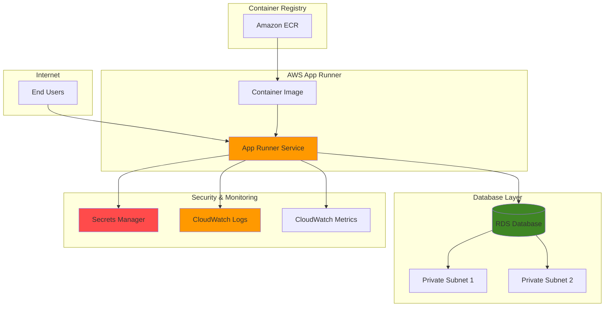

# Containerized Web Applications with App Runner

## Problem

Modern development teams need to deploy containerized web applications quickly without managing complex infrastructure, but connecting to managed databases while maintaining security and observability remains challenging. Traditional container deployment approaches require extensive knowledge of load balancing, auto-scaling, and networking configurations, creating deployment friction that slows development velocity and increases operational overhead.

## Solution

This recipe demonstrates how to deploy a containerized web application using AWS App Runner with an RDS database backend, leveraging Secrets Manager for secure credential management and CloudWatch for comprehensive monitoring. App Runner provides fully managed container deployment with automatic scaling and load balancing, while RDS offers managed database services with high availability and automated backups.

## Architecture Diagram



## Prerequisites

1. AWS account with appropriate permissions for App Runner, RDS, Secrets Manager, ECR, and CloudWatch
2. AWS CLI installed and configured (version 2.0 or later)
3. Docker installed for building container images
4. Basic knowledge of containerization and database concepts
5. Estimated cost: $25-50/month for development usage (varies by region and usage patterns)

> **Note**: This recipe creates resources in multiple AWS services. Review [AWS App Runner pricing](https://aws.amazon.com/apprunner/pricing/) and [RDS pricing](https://aws.amazon.com/rds/pricing/) for detailed cost information.

## Preparation

```bash
# Set environment variables
export AWS_REGION=$(aws configure get region)
export AWS_ACCOUNT_ID=$(aws sts get-caller-identity \
    --query Account --output text)

# Generate unique identifiers for resources
RANDOM_SUFFIX=$(aws secretsmanager get-random-password \
    --exclude-punctuation --exclude-uppercase \
    --password-length 6 --require-each-included-type \
    --output text --query RandomPassword)

# Set resource names
export DB_NAME="webapp-db-${RANDOM_SUFFIX}"
export APP_NAME="webapp-${RANDOM_SUFFIX}"
export ECR_REPO="webapp-${RANDOM_SUFFIX}"
export SECRET_NAME="webapp-db-credentials-${RANDOM_SUFFIX}"

# Create VPC and subnets for RDS (if not existing)
export VPC_ID=$(aws ec2 create-vpc \
    --cidr-block 10.0.0.0/16 \
    --query 'Vpc.VpcId' --output text)

aws ec2 create-tags \
    --resources ${VPC_ID} \
    --tags Key=Name,Value=webapp-vpc-${RANDOM_SUFFIX}

# Create subnets in different AZs
export SUBNET1_ID=$(aws ec2 create-subnet \
    --vpc-id ${VPC_ID} \
    --cidr-block 10.0.1.0/24 \
    --availability-zone ${AWS_REGION}a \
    --query 'Subnet.SubnetId' --output text)

export SUBNET2_ID=$(aws ec2 create-subnet \
    --vpc-id ${VPC_ID} \
    --cidr-block 10.0.2.0/24 \
    --availability-zone ${AWS_REGION}b \
    --query 'Subnet.SubnetId' --output text)

# Create security group for RDS
export SG_ID=$(aws ec2 create-security-group \
    --group-name webapp-rds-sg-${RANDOM_SUFFIX} \
    --description "Security group for RDS database" \
    --vpc-id ${VPC_ID} \
    --query 'GroupId' --output text)

aws ec2 authorize-security-group-ingress \
    --group-id ${SG_ID} \
    --protocol tcp \
    --port 5432 \
    --cidr 10.0.0.0/16

echo "✅ AWS environment and networking configured"
```

## Steps

1. **Create ECR Repository for Container Images**:

   Amazon ECR provides a secure, scalable container image registry that integrates seamlessly with App Runner for automated deployments. Creating a dedicated repository establishes the foundation for your containerized application deployment pipeline while maintaining image security and access control.

   ```bash
   # Create ECR repository
   aws ecr create-repository \
       --repository-name ${ECR_REPO} \
       --region ${AWS_REGION}
   
   # Get ECR login token and authenticate Docker
   aws ecr get-login-password --region ${AWS_REGION} | \
       docker login --username AWS \
       --password-stdin ${AWS_ACCOUNT_ID}.dkr.ecr.${AWS_REGION}.amazonaws.com
   
   export ECR_URI="${AWS_ACCOUNT_ID}.dkr.ecr.${AWS_REGION}.amazonaws.com/${ECR_REPO}"
   
   echo "✅ ECR repository created: ${ECR_URI}"
   ```

   The ECR repository is now ready to store your container images with secure authentication and versioning capabilities. This provides the image source that App Runner will use for automated deployments.

2. **Build and Push Sample Web Application**:

   We'll create a simple Node.js web application that demonstrates database connectivity and health monitoring. This containerized application will serve as the foundation for our App Runner service deployment.

   ```bash
   # Create application directory
   mkdir -p webapp-${RANDOM_SUFFIX}
   cd webapp-${RANDOM_SUFFIX}
   
   # Create package.json
   cat > package.json << EOF
   {
     "name": "webapp-apprunner",
     "version": "1.0.0",
     "description": "Sample web app for App Runner",
     "main": "server.js",
     "scripts": {
       "start": "node server.js"
     },
     "dependencies": {
       "express": "^4.18.2",
       "pg": "^8.11.0",
       "aws-sdk": "^2.1414.0"
     }
   }
   EOF
   
   # Create server.js
   cat > server.js << EOF
   const express = require('express');
   const { Client } = require('pg');
   const AWS = require('aws-sdk');
   
   const app = express();
   const port = process.env.PORT || 8080;
   
   // Configure AWS SDK
   AWS.config.update({ region: process.env.AWS_REGION || 'us-east-1' });
   const secretsManager = new AWS.SecretsManager();
   
   let dbClient;
   
   // Initialize database connection
   async function initDB() {
     try {
       const secretName = process.env.DB_SECRET_NAME;
       const secret = await secretsManager.getSecretValue({ SecretId: secretName }).promise();
       const credentials = JSON.parse(secret.SecretString);
       
       dbClient = new Client({
         host: credentials.host,
         port: credentials.port,
         database: credentials.dbname,
         user: credentials.username,
         password: credentials.password,
       });
       
       await dbClient.connect();
       console.log('Connected to database');
     } catch (error) {
       console.error('Database connection error:', error);
     }
   }
   
   // Health check endpoint
   app.get('/health', async (req, res) => {
     try {
       if (dbClient) {
         await dbClient.query('SELECT 1');
         res.json({ status: 'healthy', database: 'connected' });
       } else {
         res.json({ status: 'healthy', database: 'disconnected' });
       }
     } catch (error) {
       res.status(500).json({ status: 'unhealthy', error: error.message });
     }
   });
   
   // Main endpoint
   app.get('/', (req, res) => {
     res.json({ 
       message: 'Hello from App Runner!',
       timestamp: new Date().toISOString(),
       environment: process.env.NODE_ENV || 'development'
     });
   });
   
   // Start server
   app.listen(port, () => {
     console.log(\`Server running on port \${port}\`);
     initDB();
   });
   EOF
   
   # Create Dockerfile
   cat > Dockerfile << EOF
   FROM node:18-alpine
   
   WORKDIR /app
   
   COPY package*.json ./
   RUN npm install --production
   
   COPY . .
   
   EXPOSE 8080
   
   CMD ["npm", "start"]
   EOF
   
   # Build and push Docker image
   docker build -t ${ECR_URI}:latest .
   docker push ${ECR_URI}:latest
   
   cd ..
   
   echo "✅ Container image built and pushed to ECR"
   ```

   The containerized web application is now available in ECR with database connectivity and health monitoring capabilities. This provides a production-ready foundation for App Runner deployment.

3. **Create RDS Database Instance**:

   Amazon RDS provides a managed PostgreSQL database with automated backups, patching, and high availability. Creating the database instance establishes the persistent data layer for your web application with enterprise-grade reliability and security.

   ```bash
   # Create DB subnet group
   aws rds create-db-subnet-group \
       --db-subnet-group-name webapp-subnet-group-${RANDOM_SUFFIX} \
       --db-subnet-group-description "Subnet group for webapp database" \
       --subnet-ids ${SUBNET1_ID} ${SUBNET2_ID}
   
   # Create RDS instance
   aws rds create-db-instance \
       --db-instance-identifier ${DB_NAME} \
       --db-instance-class db.t3.micro \
       --engine postgres \
       --engine-version 14.9 \
       --master-username postgres \
       --master-user-password TempPassword123! \
       --allocated-storage 20 \
       --storage-type gp2 \
       --db-subnet-group-name webapp-subnet-group-${RANDOM_SUFFIX} \
       --vpc-security-group-ids ${SG_ID} \
       --backup-retention-period 7 \
       --no-multi-az \
       --no-publicly-accessible \
       --storage-encrypted
   
   # Wait for database to be available
   echo "⏳ Waiting for database to be available (this may take 5-10 minutes)..."
   aws rds wait db-instance-available \
       --db-instance-identifier ${DB_NAME}
   
   # Get database endpoint
   export DB_ENDPOINT=$(aws rds describe-db-instances \
       --db-instance-identifier ${DB_NAME} \
       --query 'DBInstances[0].Endpoint.Address' \
       --output text)
   
   echo "✅ RDS database created: ${DB_ENDPOINT}"
   ```

   The RDS PostgreSQL instance is now running with secure networking and automated management features. This provides a reliable, scalable database backend for your containerized application.

4. **Store Database Credentials in Secrets Manager**:

   AWS Secrets Manager provides secure storage and automatic rotation for database credentials, eliminating the need to hardcode sensitive information in your application. This approach follows security best practices while enabling seamless credential management.

   ```bash
   # Create database credentials secret
   aws secretsmanager create-secret \
       --name ${SECRET_NAME} \
       --description "Database credentials for webapp" \
       --secret-string "{
         \"username\": \"postgres\",
         \"password\": \"TempPassword123!\",
         \"host\": \"${DB_ENDPOINT}\",
         \"port\": 5432,
         \"dbname\": \"postgres\"
       }"
   
   # Get secret ARN
   export SECRET_ARN=$(aws secretsmanager describe-secret \
       --secret-id ${SECRET_NAME} \
       --query 'ARN' --output text)
   
   echo "✅ Database credentials stored in Secrets Manager: ${SECRET_ARN}"
   ```

   Database credentials are now securely stored and accessible to your application through IAM-based access control. This eliminates credential exposure while maintaining application functionality.

5. **Create IAM Role for App Runner**:

   App Runner requires specific IAM permissions to access ECR for container images, Secrets Manager for database credentials, and CloudWatch for logging. Creating a dedicated service role ensures least-privilege access while enabling all required functionality.

   ```bash
   # Create App Runner service role
   cat > apprunner-trust-policy.json << EOF
   {
     "Version": "2012-10-17",
     "Statement": [
       {
         "Effect": "Allow",
         "Principal": {
           "Service": "build.apprunner.amazonaws.com"
         },
         "Action": "sts:AssumeRole"
       }
     ]
   }
   EOF
   
   aws iam create-role \
       --role-name AppRunnerServiceRole-${RANDOM_SUFFIX} \
       --assume-role-policy-document file://apprunner-trust-policy.json
   
   # Create instance role for runtime permissions
   cat > apprunner-instance-trust-policy.json << EOF
   {
     "Version": "2012-10-17",
     "Statement": [
       {
         "Effect": "Allow",
         "Principal": {
           "Service": "tasks.apprunner.amazonaws.com"
         },
         "Action": "sts:AssumeRole"
       }
     ]
   }
   EOF
   
   aws iam create-role \
       --role-name AppRunnerInstanceRole-${RANDOM_SUFFIX} \
       --assume-role-policy-document file://apprunner-instance-trust-policy.json
   
   # Create policy for Secrets Manager access
   cat > secrets-policy.json << EOF
   {
     "Version": "2012-10-17",
     "Statement": [
       {
         "Effect": "Allow",
         "Action": [
           "secretsmanager:GetSecretValue"
         ],
         "Resource": "${SECRET_ARN}"
       }
     ]
   }
   EOF
   
   aws iam create-policy \
       --policy-name SecretsManagerAccess-${RANDOM_SUFFIX} \
       --policy-document file://secrets-policy.json
   
   # Attach policies to roles
   aws iam attach-role-policy \
       --role-name AppRunnerServiceRole-${RANDOM_SUFFIX} \
       --policy-arn arn:aws:iam::aws:policy/service-role/AWSAppRunnerServicePolicyForECRAccess
   
   aws iam attach-role-policy \
       --role-name AppRunnerInstanceRole-${RANDOM_SUFFIX} \
       --policy-arn arn:aws:iam::${AWS_ACCOUNT_ID}:policy/SecretsManagerAccess-${RANDOM_SUFFIX}
   
   # Get role ARNs
   export SERVICE_ROLE_ARN=$(aws iam get-role \
       --role-name AppRunnerServiceRole-${RANDOM_SUFFIX} \
       --query 'Role.Arn' --output text)
   
   export INSTANCE_ROLE_ARN=$(aws iam get-role \
       --role-name AppRunnerInstanceRole-${RANDOM_SUFFIX} \
       --query 'Role.Arn' --output text)
   
   # Clean up temporary files
   rm -f apprunner-trust-policy.json apprunner-instance-trust-policy.json secrets-policy.json
   
   echo "✅ IAM roles created for App Runner service"
   ```

   The IAM roles are now configured with appropriate permissions for ECR access, Secrets Manager integration, and CloudWatch logging. This ensures secure, least-privilege access to required AWS services.

6. **Create App Runner Service**:

   App Runner provides a fully managed container deployment platform that automatically handles load balancing, scaling, and health monitoring. Creating the service establishes your web application with production-ready infrastructure and monitoring capabilities.

   ```bash
   # Create App Runner service configuration
   cat > apprunner-service.json << EOF
   {
     "ServiceName": "${APP_NAME}",
     "SourceConfiguration": {
       "ImageRepository": {
         "ImageIdentifier": "${ECR_URI}:latest",
         "ImageConfiguration": {
           "Port": "8080",
           "RuntimeEnvironmentVariables": {
             "NODE_ENV": "production",
             "AWS_REGION": "${AWS_REGION}",
             "DB_SECRET_NAME": "${SECRET_NAME}"
           }
         },
         "ImageRepositoryType": "ECR"
       },
       "AutoDeploymentsEnabled": true
     },
     "InstanceConfiguration": {
       "Cpu": "0.25 vCPU",
       "Memory": "0.5 GB",
       "InstanceRoleArn": "${INSTANCE_ROLE_ARN}"
     },
     "AutoScalingConfigurationArn": "",
     "HealthCheckConfiguration": {
       "Protocol": "HTTP",
       "Path": "/health",
       "Interval": 10,
       "Timeout": 5,
       "HealthyThreshold": 1,
       "UnhealthyThreshold": 5
     },
     "EncryptionConfiguration": {
       "KmsKey": ""
     },
     "NetworkConfiguration": {
       "EgressConfiguration": {
         "EgressType": "DEFAULT"
       }
     },
     "ObservabilityConfiguration": {
       "ObservabilityEnabled": true
     }
   }
   EOF
   
   # Create App Runner service
   aws apprunner create-service \
       --cli-input-json file://apprunner-service.json \
       --service-role-arn ${SERVICE_ROLE_ARN}
   
   # Wait for service to be running
   echo "⏳ Waiting for App Runner service to be running (this may take 5-10 minutes)..."
   aws apprunner wait service-running \
       --service-arn $(aws apprunner list-services \
           --query "ServiceSummaryList[?ServiceName=='${APP_NAME}'].ServiceArn" \
           --output text)
   
   # Get service details
   export SERVICE_ARN=$(aws apprunner list-services \
       --query "ServiceSummaryList[?ServiceName=='${APP_NAME}'].ServiceArn" \
       --output text)
   
   export SERVICE_URL=$(aws apprunner describe-service \
       --service-arn ${SERVICE_ARN} \
       --query 'Service.ServiceUrl' --output text)
   
   # Clean up temporary file
   rm -f apprunner-service.json
   
   echo "✅ App Runner service created: https://${SERVICE_URL}"
   ```

   The App Runner service is now deployed with automatic scaling, health monitoring, and secure database connectivity. Your containerized web application is accessible via the provided HTTPS URL with production-ready infrastructure.

7. **Configure CloudWatch Monitoring**:

   CloudWatch provides comprehensive monitoring for your App Runner service with custom metrics, alarms, and log aggregation. Setting up monitoring ensures proactive issue detection and performance optimization capabilities.

   ```bash
   # Create CloudWatch alarm for high CPU utilization
   aws cloudwatch put-metric-alarm \
       --alarm-name "${APP_NAME}-high-cpu" \
       --alarm-description "Alert when CPU exceeds 80%" \
       --metric-name CPUUtilization \
       --namespace AWS/AppRunner \
       --statistic Average \
       --period 300 \
       --threshold 80 \
       --comparison-operator GreaterThanThreshold \
       --evaluation-periods 2 \
       --dimensions Name=ServiceName,Value=${APP_NAME}
   
   # Create CloudWatch alarm for high memory utilization
   aws cloudwatch put-metric-alarm \
       --alarm-name "${APP_NAME}-high-memory" \
       --alarm-description "Alert when memory exceeds 80%" \
       --metric-name MemoryUtilization \
       --namespace AWS/AppRunner \
       --statistic Average \
       --period 300 \
       --threshold 80 \
       --comparison-operator GreaterThanThreshold \
       --evaluation-periods 2 \
       --dimensions Name=ServiceName,Value=${APP_NAME}
   
   # Create CloudWatch alarm for request latency
   aws cloudwatch put-metric-alarm \
       --alarm-name "${APP_NAME}-high-latency" \
       --alarm-description "Alert when response time exceeds 2 seconds" \
       --metric-name RequestLatency \
       --namespace AWS/AppRunner \
       --statistic Average \
       --period 300 \
       --threshold 2000 \
       --comparison-operator GreaterThanThreshold \
       --evaluation-periods 2 \
       --dimensions Name=ServiceName,Value=${APP_NAME}
   
   # Create custom log group for application logs
   aws logs create-log-group \
       --log-group-name "/aws/apprunner/${APP_NAME}/application" \
       --retention-in-days 7
   
   echo "✅ CloudWatch monitoring configured with alarms and log groups"
   ```

   CloudWatch monitoring is now active with automated alerts for performance issues and centralized log management. This provides proactive monitoring and troubleshooting capabilities for your deployed application.

## Validation & Testing

1. **Verify App Runner Service Status**:

   ```bash
   # Check App Runner service status
   aws apprunner describe-service \
       --service-arn ${SERVICE_ARN} \
       --query 'Service.Status' --output text
   
   # Test application endpoint
   curl -s https://${SERVICE_URL}/ | jq .
   ```

   Expected output: Service status should be "RUNNING" and the endpoint should return a JSON response with application information.

2. **Test Database Connectivity**:

   ```bash
   # Test health check endpoint
   curl -s https://${SERVICE_URL}/health | jq .
   
   # Check application logs
   aws logs filter-log-events \
       --log-group-name "/aws/apprunner/${APP_NAME}/application" \
       --start-time $(date -d '5 minutes ago' +%s)000 \
       --query 'events[*].message' --output text
   ```

   Expected output: Health check should return database connectivity status and logs should show successful database connection.

3. **Verify CloudWatch Metrics**:

   ```bash
   # Check App Runner metrics
   aws cloudwatch get-metric-statistics \
       --namespace AWS/AppRunner \
       --metric-name ActiveInstances \
       --dimensions Name=ServiceName,Value=${APP_NAME} \
       --start-time $(date -d '10 minutes ago' -u +%Y-%m-%dT%H:%M:%S) \
       --end-time $(date -u +%Y-%m-%dT%H:%M:%S) \
       --period 300 \
       --statistics Average
   
   # Check CloudWatch alarms
   aws cloudwatch describe-alarms \
       --alarm-names "${APP_NAME}-high-cpu" "${APP_NAME}-high-memory" "${APP_NAME}-high-latency" \
       --query 'MetricAlarms[*].[AlarmName,StateValue]' --output table
   ```

   Expected output: Metrics should show active instances and alarm states should be "OK" under normal conditions.

## Cleanup

1. **Delete App Runner Service**:

   ```bash
   # Delete App Runner service
   aws apprunner delete-service \
       --service-arn ${SERVICE_ARN}
   
   # Wait for service deletion
   aws apprunner wait service-deleted \
       --service-arn ${SERVICE_ARN}
   
   echo "✅ App Runner service deleted"
   ```

2. **Delete RDS Database**:

   ```bash
   # Delete RDS instance
   aws rds delete-db-instance \
       --db-instance-identifier ${DB_NAME} \
       --skip-final-snapshot
   
   # Wait for database deletion
   aws rds wait db-instance-deleted \
       --db-instance-identifier ${DB_NAME}
   
   # Delete DB subnet group
   aws rds delete-db-subnet-group \
       --db-subnet-group-name webapp-subnet-group-${RANDOM_SUFFIX}
   
   echo "✅ RDS database deleted"
   ```

3. **Remove Secrets and IAM Resources**:

   ```bash
   # Delete secret
   aws secretsmanager delete-secret \
       --secret-id ${SECRET_NAME} \
       --force-delete-without-recovery
   
   # Detach and delete IAM policies
   aws iam detach-role-policy \
       --role-name AppRunnerServiceRole-${RANDOM_SUFFIX} \
       --policy-arn arn:aws:iam::aws:policy/service-role/AWSAppRunnerServicePolicyForECRAccess
   
   aws iam detach-role-policy \
       --role-name AppRunnerInstanceRole-${RANDOM_SUFFIX} \
       --policy-arn arn:aws:iam::${AWS_ACCOUNT_ID}:policy/SecretsManagerAccess-${RANDOM_SUFFIX}
   
   aws iam delete-policy \
       --policy-arn arn:aws:iam::${AWS_ACCOUNT_ID}:policy/SecretsManagerAccess-${RANDOM_SUFFIX}
   
   aws iam delete-role --role-name AppRunnerServiceRole-${RANDOM_SUFFIX}
   aws iam delete-role --role-name AppRunnerInstanceRole-${RANDOM_SUFFIX}
   
   echo "✅ Secrets and IAM resources deleted"
   ```

4. **Clean Up Container Registry and Networking**:

   ```bash
   # Delete ECR repository
   aws ecr delete-repository \
       --repository-name ${ECR_REPO} \
       --force
   
   # Delete CloudWatch resources
   aws cloudwatch delete-alarms \
       --alarm-names "${APP_NAME}-high-cpu" "${APP_NAME}-high-memory" "${APP_NAME}-high-latency"
   
   aws logs delete-log-group \
       --log-group-name "/aws/apprunner/${APP_NAME}/application"
   
   # Delete VPC resources
   aws ec2 delete-security-group --group-id ${SG_ID}
   aws ec2 delete-subnet --subnet-id ${SUBNET1_ID}
   aws ec2 delete-subnet --subnet-id ${SUBNET2_ID}
   aws ec2 delete-vpc --vpc-id ${VPC_ID}
   
   # Remove local files
   rm -rf webapp-${RANDOM_SUFFIX}
   
   echo "✅ All resources cleaned up"
   ```

## Discussion

This recipe demonstrates a modern approach to containerized web application deployment using AWS App Runner, showcasing how serverless container services can eliminate infrastructure management complexity while maintaining enterprise-grade capabilities. App Runner provides automatic scaling, load balancing, and health monitoring without requiring knowledge of underlying infrastructure, making it ideal for development teams focused on application logic rather than operations.

The integration with Amazon RDS demonstrates how managed database services complement serverless compute platforms, providing persistent storage with automated backups, patching, and high availability. The use of AWS Secrets Manager for credential management follows security best practices by eliminating hardcoded secrets and providing automatic rotation capabilities. This approach aligns with AWS Well-Architected Framework principles, particularly the Security and Operational Excellence pillars.

The CloudWatch monitoring configuration provides comprehensive observability with custom metrics, alarms, and centralized logging. This enables proactive issue detection and performance optimization, essential for production workloads. The health check configuration ensures that App Runner can automatically detect and replace unhealthy instances, maintaining application availability even during failures.

Key architectural decisions include using private subnets for the RDS database to ensure network isolation, implementing IAM roles with least-privilege access, and enabling encryption at rest for both database and application layers. These choices balance security requirements with operational simplicity, demonstrating how AWS services can provide enterprise-grade security without increasing complexity.

> **Tip**: Consider implementing [AWS X-Ray](https://docs.aws.amazon.com/xray/latest/devguide/) for distributed tracing to gain deeper insights into application performance and identify bottlenecks across your serverless architecture.

For additional guidance on production deployments, refer to the [AWS App Runner Developer Guide](https://docs.aws.amazon.com/apprunner/latest/dg/), [Amazon RDS Best Practices](https://docs.aws.amazon.com/AmazonRDS/latest/UserGuide/CHAP_BestPractices.html), [AWS Secrets Manager Best Practices](https://docs.aws.amazon.com/secretsmanager/latest/userguide/best-practices.html), and [AWS Well-Architected Framework](https://docs.aws.amazon.com/wellarchitected/latest/framework/welcome.html) for comprehensive architectural guidance.

## Challenge

Extend this solution by implementing these enhancements:

1. **Implement Multi-Environment Deployment Pipeline**: Create separate App Runner services for development, staging, and production environments with automated promotion workflows using AWS CodePipeline and CodeBuild.

2. **Add Database Read Replicas**: Configure RDS read replicas for improved read performance and implement connection pooling in your application to efficiently manage database connections across multiple instances.

3. **Implement Custom Domain and SSL**: Configure a custom domain with Amazon Route 53 and SSL certificate management using AWS Certificate Manager for professional application hosting.

4. **Add Advanced Monitoring and Alerting**: Implement AWS X-Ray for distributed tracing, create custom CloudWatch dashboards with business metrics, and set up SNS notifications for operational alerts.

5. **Implement Blue-Green Deployment Strategy**: Configure App Runner's deployment configuration for blue-green deployments with automated rollback capabilities based on health check failures or custom metrics.

## Infrastructure Code

*Infrastructure code will be generated after recipe approval.*