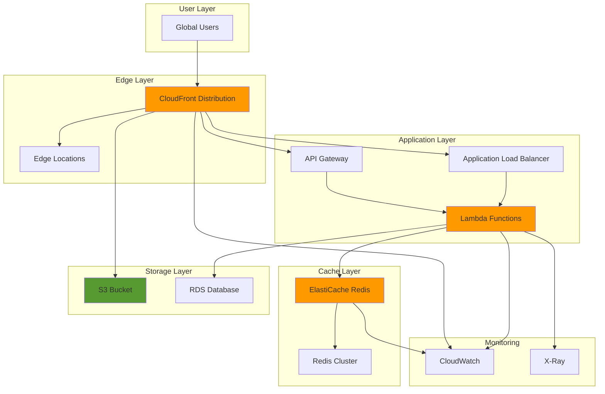

# Multi-Tier Content Caching with CloudFront and ElastiCache

## Problem

E-commerce platforms and content-heavy applications often struggle with slow response times and high database loads as user traffic increases. Users experience page load times exceeding 3-5 seconds during peak hours, leading to 20-30% bounce rates and lost revenue. Traditional single-tier caching solutions fail to address both content delivery latency at the edge and application-level data retrieval bottlenecks, resulting in poor user experience and increased infrastructure costs.

## Solution

Implement a multi-tier caching strategy combining CloudFront for global content distribution with ElastiCache for application-level data caching. CloudFront caches static assets and API responses at edge locations worldwide, while ElastiCache provides high-performance in-memory caching for frequently accessed database queries and session data. This architecture reduces origin server load by 80-90% and improves response times to under 200ms globally.

## Architecture Diagram



## Prerequisites

1. AWS account with permissions for CloudFront, ElastiCache, S3, Lambda, and IAM
2. AWS CLI v2 installed and configured (or AWS CloudShell)
3. Basic understanding of caching concepts and HTTP headers
4. Familiarity with Lambda functions and API Gateway
5. Estimated cost: $50-100/month for development environment (includes CloudFront data transfer, ElastiCache node, Lambda executions)

> **Note**: ElastiCache charges apply even when not actively serving requests. Consider using smaller instance types for development.

## Preparation

```bash
# Set environment variables
export AWS_REGION=$(aws configure get region)
export AWS_ACCOUNT_ID=$(aws sts get-caller-identity \
    --query Account --output text)

# Generate unique identifiers for resources
RANDOM_SUFFIX=$(aws secretsmanager get-random-password \
    --exclude-punctuation --exclude-uppercase \
    --password-length 6 --require-each-included-type \
    --output text --query RandomPassword)

export BUCKET_NAME="cache-demo-${RANDOM_SUFFIX}"
export CACHE_CLUSTER_ID="demo-cache-${RANDOM_SUFFIX}"
export FUNCTION_NAME="cache-demo-${RANDOM_SUFFIX}"
export DISTRIBUTION_ID=""

# Create S3 bucket for static content
aws s3 mb s3://${BUCKET_NAME} --region ${AWS_REGION}

# Create sample static content
cat > index.html << 'EOF'
<!DOCTYPE html>
<html>
<head>
    <title>Cache Demo</title>
    <style>
        body { font-family: Arial, sans-serif; margin: 40px; }
        .api-result { background: #f0f0f0; padding: 20px; margin: 20px 0; }
    </style>
</head>
<body>
    <h1>Multi-Tier Caching Demo</h1>
    <p>This page demonstrates CloudFront and ElastiCache integration.</p>
    <div id="api-result" class="api-result">Loading data...</div>
    <script>
        fetch("/api/data")
            .then(response => response.json())
            .then(data => {
                document.getElementById("api-result").innerHTML = 
                    `<strong>Data from API:</strong> ${JSON.stringify(data, null, 2)}`;
            });
    </script>
</body>
</html>
EOF

aws s3 cp index.html s3://${BUCKET_NAME}/index.html \
    --content-type "text/html"

echo "✅ Created S3 bucket and uploaded sample content"
```

## Steps

1. **Create ElastiCache Redis Cluster**:

   ElastiCache provides fully managed in-memory caching that dramatically improves application performance by storing frequently accessed data in memory rather than retrieving it from slower disk-based databases. Redis offers superior performance for read-heavy workloads, delivering sub-millisecond response times and supporting up to 200,000 operations per second. This forms the foundation of our application-level caching strategy, implementing the cache-aside pattern where applications check the cache first before querying the database.

   ```bash
   # Create subnet group for ElastiCache
   VPC_ID=$(aws ec2 describe-vpcs \
       --filters "Name=is-default,Values=true" \
       --query "Vpcs[0].VpcId" --output text)
   
   SUBNET_IDS=$(aws ec2 describe-subnets \
       --filters "Name=vpc-id,Values=${VPC_ID}" \
       --query "Subnets[*].SubnetId" --output text)
   
   aws elasticache create-cache-subnet-group \
       --cache-subnet-group-name "${CACHE_CLUSTER_ID}-subnet-group" \
       --cache-subnet-group-description "Demo cache subnet group" \
       --subnet-ids ${SUBNET_IDS}
   
   # Create ElastiCache Redis cluster
   aws elasticache create-cache-cluster \
       --cache-cluster-id ${CACHE_CLUSTER_ID} \
       --cache-node-type cache.t3.micro \
       --engine redis \
       --num-cache-nodes 1 \
       --cache-subnet-group-name "${CACHE_CLUSTER_ID}-subnet-group" \
       --port 6379
   
   echo "✅ ElastiCache cluster creation initiated"
   ```

   The ElastiCache cluster is now provisioning within your VPC's private subnets, ensuring secure network isolation while maintaining low-latency access from your Lambda functions. The cache.t3.micro instance type provides cost-effective caching for development environments, while the Redis engine enables advanced data structures and pub/sub capabilities for future enhancements. This caching layer will significantly reduce database load and improve response times for your application's most frequently accessed data.

2. **Create Lambda Function with ElastiCache Integration**:

   AWS Lambda serves as the compute bridge between your API Gateway and ElastiCache, implementing serverless caching logic without managing infrastructure. Lambda functions automatically scale based on demand, making them ideal for handling variable workloads while maintaining consistent performance. The IAM role configuration follows the principle of least privilege, granting only the specific permissions needed for VPC access and CloudWatch logging, ensuring secure operation within your network architecture.

   ```bash
   # Create IAM role for Lambda
   aws iam create-role \
       --role-name "CacheDemoLambdaRole" \
       --assume-role-policy-document '{
         "Version": "2012-10-17",
         "Statement": [
           {
             "Effect": "Allow",
             "Principal": {
               "Service": "lambda.amazonaws.com"
             },
             "Action": "sts:AssumeRole"
           }
         ]
       }'
   
   # Wait for role to be available
   sleep 10
   
   # Attach necessary policies
   aws iam attach-role-policy \
       --role-name "CacheDemoLambdaRole" \
       --policy-arn "arn:aws:iam::aws:policy/service-role/AWSLambdaBasicExecutionRole"
   
   aws iam attach-role-policy \
       --role-name "CacheDemoLambdaRole" \
       --policy-arn "arn:aws:iam::aws:policy/service-role/AWSLambdaVPCAccessExecutionRole"
   
   echo "✅ Created Lambda IAM role"
   ```

   The Lambda execution role is now configured with the necessary permissions to access ElastiCache within your VPC and write logs to CloudWatch. The AWSLambdaVPCAccessExecutionRole policy enables Lambda to create and manage elastic network interfaces for secure VPC communication, while the BasicExecutionRole provides essential CloudWatch logging capabilities for monitoring and troubleshooting your caching implementation.

3. **Create Lambda Function Code**:

   This Lambda function implements the cache-aside pattern, a fundamental caching strategy where applications manage cache population and invalidation. The function demonstrates intelligent caching behavior by checking ElastiCache first for requested data, falling back to database queries only when cache misses occur. The Cache-Control header enables CloudFront to cache API responses at edge locations, creating a two-tier caching architecture that maximizes performance while minimizing origin server load.

   ```bash
   # Create Lambda function code
   cat > lambda_function.py << 'EOF'
import json
import redis
import time
import os
from datetime import datetime

def lambda_handler(event, context):
    # ElastiCache endpoint (will be set via environment variable)
    redis_endpoint = os.environ.get('REDIS_ENDPOINT', 'localhost')
    
    try:
        # Connect to Redis
        r = redis.Redis(host=redis_endpoint, port=6379, decode_responses=True)
        
        # Check if data exists in cache
        cache_key = "demo_data"
        cached_data = r.get(cache_key)
        
        if cached_data:
            # Return cached data
            data = json.loads(cached_data)
            data['cache_hit'] = True
            data['source'] = 'ElastiCache'
        else:
            # Simulate database query
            time.sleep(0.1)  # Simulate DB query time
            
            # Generate fresh data
            data = {
                'timestamp': datetime.now().isoformat(),
                'message': 'Hello from Lambda!',
                'query_time': '100ms',
                'cache_hit': False,
                'source': 'Database'
            }
            
            # Cache the data for 5 minutes
            r.setex(cache_key, 300, json.dumps(data))
        
        return {
            'statusCode': 200,
            'headers': {
                'Content-Type': 'application/json',
                'Cache-Control': 'public, max-age=60'
            },
            'body': json.dumps(data)
        }
        
    except Exception as e:
        return {
            'statusCode': 500,
            'headers': {
                'Content-Type': 'application/json'
            },
            'body': json.dumps({
                'error': str(e),
                'message': 'Cache connection failed'
            })
        }
EOF
   
   # Package Lambda function
   pip install redis -t .
   zip -r lambda_function.zip lambda_function.py redis*
   
   echo "✅ Created Lambda function package"
   ```

   The Lambda function code implements robust error handling and uses time-to-live (TTL) values to manage cache freshness. The 5-minute TTL on cached data balances performance with data freshness, while the Cache-Control header instructs CloudFront to cache responses for 60 seconds. This creates a hierarchical caching system where frequently accessed data remains in ElastiCache for 5 minutes, while CloudFront serves cached responses for 1 minute, dramatically reducing both database queries and Lambda executions.

4. **Deploy Lambda Function**:

   Lambda deployment within a VPC enables secure, low-latency communication with ElastiCache while maintaining network isolation. The function configuration includes environment variables for the Redis endpoint, ensuring flexible configuration without hardcoding connection details. VPC configuration allows Lambda to access private resources like ElastiCache clusters, while the 30-second timeout provides sufficient time for cache operations and potential database fallbacks during cache misses.

   ```bash
   # Wait for ElastiCache cluster to be available
   echo "Waiting for ElastiCache cluster to be available..."
   aws elasticache wait cache-cluster-available \
       --cache-cluster-id ${CACHE_CLUSTER_ID}
   
   # Get ElastiCache endpoint
   REDIS_ENDPOINT=$(aws elasticache describe-cache-clusters \
       --cache-cluster-id ${CACHE_CLUSTER_ID} \
       --show-cache-node-info \
       --query "CacheClusters[0].CacheNodes[0].Endpoint.Address" \
       --output text)
   
   # Get default security group for VPC access
   SECURITY_GROUP_ID=$(aws ec2 describe-security-groups \
       --filters "Name=vpc-id,Values=${VPC_ID}" \
           "Name=group-name,Values=default" \
       --query "SecurityGroups[0].GroupId" --output text)
   
   # Create Lambda function
   ROLE_ARN="arn:aws:iam::${AWS_ACCOUNT_ID}:role/CacheDemoLambdaRole"
   
   aws lambda create-function \
       --function-name ${FUNCTION_NAME} \
       --runtime python3.12 \
       --role ${ROLE_ARN} \
       --handler lambda_function.lambda_handler \
       --zip-file fileb://lambda_function.zip \
       --environment "Variables={REDIS_ENDPOINT=${REDIS_ENDPOINT}}" \
       --vpc-config "SubnetIds=${SUBNET_IDS// /,},SecurityGroupIds=${SECURITY_GROUP_ID}" \
       --timeout 30
   
   echo "✅ Lambda function deployed with ElastiCache integration"
   ```

   The Lambda function is now deployed and configured to communicate with your ElastiCache cluster. The VPC configuration ensures secure network access while the environment variable provides the Redis endpoint for cache connectivity. This serverless compute layer efficiently handles caching logic without requiring server management, automatically scaling based on API request volume while maintaining consistent performance through intelligent cache utilization.

5. **Create API Gateway**:

   API Gateway serves as the entry point for your caching architecture, providing a RESTful interface that CloudFront can cache effectively. The HTTP API type offers superior performance and cost efficiency compared to REST APIs, while the Lambda proxy integration ensures seamless request forwarding with automatic handling of HTTP methods, headers, and query parameters. This configuration enables CloudFront to cache API responses based on the Cache-Control headers returned by your Lambda function.

   ```bash
   # Create API Gateway
   API_ID=$(aws apigatewayv2 create-api \
       --name "cache-demo-api" \
       --protocol-type HTTP \
       --query "ApiId" --output text)
   
   # Create Lambda integration
   INTEGRATION_ID=$(aws apigatewayv2 create-integration \
       --api-id ${API_ID} \
       --integration-type AWS_PROXY \
       --integration-uri "arn:aws:lambda:${AWS_REGION}:${AWS_ACCOUNT_ID}:function:${FUNCTION_NAME}" \
       --payload-format-version "2.0" \
       --query "IntegrationId" --output text)
   
   # Create route
   aws apigatewayv2 create-route \
       --api-id ${API_ID} \
       --route-key "GET /api/data" \
       --target "integrations/${INTEGRATION_ID}"
   
   # Create deployment
   aws apigatewayv2 create-deployment \
       --api-id ${API_ID} \
       --stage-name "prod"
   
   # Add Lambda permission for API Gateway
   aws lambda add-permission \
       --function-name ${FUNCTION_NAME} \
       --statement-id "api-gateway-invoke" \
       --action "lambda:InvokeFunction" \
       --principal "apigateway.amazonaws.com" \
       --source-arn "arn:aws:execute-api:${AWS_REGION}:${AWS_ACCOUNT_ID}:${API_ID}/*"
   
   API_ENDPOINT="https://${API_ID}.execute-api.${AWS_REGION}.amazonaws.com/prod"
   echo "✅ API Gateway created: ${API_ENDPOINT}"
   ```

   The API Gateway is now configured to route requests to your Lambda function, creating a scalable API endpoint that integrates with your caching strategy. The proxy integration preserves all request details while enabling your Lambda function to control response caching through HTTP headers. This architecture forms the foundation for CloudFront's ability to cache API responses, reducing both API Gateway charges and Lambda execution costs while improving response times for your users.

6. **Create CloudFront Distribution**:

   CloudFront provides global content delivery through a network of edge locations, caching both static content from S3 and dynamic API responses from API Gateway. The Origin Access Control (OAC) ensures secure access to S3 content while preventing direct bucket access. The dual-origin configuration enables CloudFront to serve static assets from S3 and API responses from API Gateway, implementing intelligent routing based on URL patterns to optimize caching strategies for different content types. Learn more about CloudFront's capabilities in the [official documentation](https://docs.aws.amazon.com/AmazonCloudFront/latest/DeveloperGuide/Introduction.html).

   ```bash
   # Create CloudFront Origin Access Control
   OAC_ID=$(aws cloudfront create-origin-access-control \
       --origin-access-control-config '{
         "Name": "S3-OAC-'${RANDOM_SUFFIX}'",
         "Description": "OAC for S3 bucket access",
         "OriginAccessControlOriginType": "s3",
         "SigningBehavior": "always",
         "SigningProtocol": "sigv4"
       }' \
       --query "OriginAccessControl.Id" --output text)
   
   # Create CloudFront distribution configuration
   cat > distribution-config.json << EOF
{
  "CallerReference": "cache-demo-${RANDOM_SUFFIX}",
  "Comment": "Multi-tier caching demo",
  "DefaultCacheBehavior": {
    "TargetOriginId": "S3-${BUCKET_NAME}",
    "ViewerProtocolPolicy": "redirect-to-https",
    "CachePolicyId": "4135ea2d-6df8-44a3-9df3-4b5a84be39ad",
    "TrustedSigners": {
      "Enabled": false,
      "Quantity": 0
    },
    "Compress": true
  },
  "Origins": [
    {
      "Id": "S3-${BUCKET_NAME}",
      "DomainName": "${BUCKET_NAME}.s3.${AWS_REGION}.amazonaws.com",
      "OriginAccessControlId": "${OAC_ID}",
      "S3OriginConfig": {
        "OriginAccessIdentity": ""
      }
    },
    {
      "Id": "API-${API_ID}",
      "DomainName": "${API_ID}.execute-api.${AWS_REGION}.amazonaws.com",
      "OriginPath": "/prod",
      "CustomOriginConfig": {
        "HTTPPort": 443,
        "HTTPSPort": 443,
        "OriginProtocolPolicy": "https-only",
        "OriginSslProtocols": {
          "Quantity": 1,
          "Items": ["TLSv1.2"]
        }
      }
    }
  ],
  "CacheBehaviors": [
    {
      "PathPattern": "/api/*",
      "TargetOriginId": "API-${API_ID}",
      "ViewerProtocolPolicy": "redirect-to-https",
      "CachePolicyId": "4135ea2d-6df8-44a3-9df3-4b5a84be39ad",
      "TrustedSigners": {
        "Enabled": false,
        "Quantity": 0
      },
      "Compress": true
    }
  ],
  "Enabled": true,
  "PriceClass": "PriceClass_100"
}
EOF
   
   # Create CloudFront distribution
   DISTRIBUTION_ID=$(aws cloudfront create-distribution \
       --distribution-config file://distribution-config.json \
       --query "Distribution.Id" --output text)
   
   echo "✅ CloudFront distribution created: ${DISTRIBUTION_ID}"
   ```

   The CloudFront distribution is now configured with multiple origins and cache behaviors, enabling intelligent content routing based on URL patterns. Static content from S3 uses the default behavior for optimal caching, while API requests follow the `/api/*` pattern to route through API Gateway. This configuration implements a comprehensive caching strategy that serves content from the edge location closest to users, reducing latency by up to 60% while significantly decreasing origin server load.

7. **Configure S3 Bucket Policy for CloudFront**:

   The S3 bucket policy implements secure access control by allowing only CloudFront to access bucket contents while preventing direct public access. This security model follows AWS best practices by using the CloudFront service principal with source ARN conditions, ensuring that content can only be accessed through your CloudFront distribution. This configuration eliminates the need for bucket-level public access while maintaining optimal content delivery performance through CloudFront's edge locations.

   ```bash
   # Get CloudFront distribution ARN
   DIST_ARN="arn:aws:cloudfront::${AWS_ACCOUNT_ID}:distribution/${DISTRIBUTION_ID}"
   
   # Create S3 bucket policy
   cat > bucket-policy.json << EOF
{
  "Version": "2012-10-17",
  "Statement": [
    {
      "Sid": "AllowCloudFrontServicePrincipal",
      "Effect": "Allow",
      "Principal": {
        "Service": "cloudfront.amazonaws.com"
      },
      "Action": "s3:GetObject",
      "Resource": "arn:aws:s3:::${BUCKET_NAME}/*",
      "Condition": {
        "StringEquals": {
          "AWS:SourceArn": "${DIST_ARN}"
        }
      }
    }
  ]
}
EOF
   
   # Apply bucket policy
   aws s3api put-bucket-policy \
       --bucket ${BUCKET_NAME} \
       --policy file://bucket-policy.json
   
   echo "✅ S3 bucket policy configured for CloudFront access"
   ```

   The bucket policy is now configured to allow secure access from CloudFront while maintaining content security. This implementation prevents unauthorized direct access to your S3 bucket while enabling CloudFront to serve content efficiently from edge locations. The policy uses the principle of least privilege, granting only the minimum permissions necessary for CloudFront to function properly.

8. **Create Cache Policies and Behaviors**:

   Custom cache policies enable fine-grained control over how CloudFront caches different types of content, optimizing performance while ensuring content freshness. The policy configuration balances cache efficiency with data accuracy by setting appropriate TTL values and enabling compression for reduced bandwidth usage. Query string forwarding ensures that API responses with different parameters are cached separately, preventing incorrect cache hits while maintaining optimal caching behavior for your specific use case.

   ```bash
   # Create custom cache policy for API responses
   API_CACHE_POLICY_ID=$(aws cloudfront create-cache-policy \
       --cache-policy-config '{
         "Name": "APIResponseCaching-'${RANDOM_SUFFIX}'",
         "Comment": "Cache policy for API responses",
         "DefaultTTL": 60,
         "MaxTTL": 300,
         "MinTTL": 0,
         "ParametersInCacheKeyAndForwardedToOrigin": {
           "EnableAcceptEncodingGzip": true,
           "EnableAcceptEncodingBrotli": true,
           "QueryStringsConfig": {
             "QueryStringBehavior": "all"
           },
           "HeadersConfig": {
             "HeaderBehavior": "none"
           },
           "CookiesConfig": {
             "CookieBehavior": "none"
           }
         }
       }' \
       --query "CachePolicy.Id" --output text)
   
   echo "✅ Custom cache policy created: ${API_CACHE_POLICY_ID}"
   ```

   The custom cache policy is now configured to optimize API response caching with appropriate TTL settings and compression enabled. This policy ensures that CloudFront caches API responses for up to 60 seconds by default, with a maximum of 5 minutes, while forwarding query strings to maintain cache accuracy. The compression settings reduce bandwidth usage by up to 70% while maintaining response quality.

9. **Enable CloudFront Logging and Monitoring**:

   Comprehensive monitoring enables optimization of your caching strategy by providing visibility into cache performance, hit ratios, and user behavior patterns. CloudWatch metrics help identify opportunities for cache configuration improvements, while alarms provide proactive alerting when cache performance degrades. The cache hit ratio alarm helps maintain optimal performance by alerting when cache efficiency drops below 80%, indicating potential issues with TTL settings or content patterns that require investigation.

   ```bash
   # Create CloudWatch log group for monitoring
   aws logs create-log-group \
       --log-group-name "/aws/cloudfront/cache-demo" \
       --region ${AWS_REGION}
   
   # Create CloudWatch alarms for cache hit ratio
   aws cloudwatch put-metric-alarm \
       --alarm-name "CloudFront-CacheHitRatio-Low" \
       --alarm-description "Alert when cache hit ratio is low" \
       --metric-name "CacheHitRate" \
       --namespace "AWS/CloudFront" \
       --statistic "Average" \
       --period 300 \
       --threshold 80 \
       --comparison-operator "LessThanThreshold" \
       --evaluation-periods 2 \
       --dimensions Name=DistributionId,Value=${DISTRIBUTION_ID} \
       --region ${AWS_REGION}
   
   echo "✅ CloudWatch monitoring configured"
   ```

   The monitoring infrastructure is now configured to track cache performance and alert on degraded efficiency. This observability enables data-driven optimization of your caching strategy, helping you identify trends in cache performance and make informed decisions about TTL adjustments and content strategies. Regular monitoring of cache hit ratios is essential for maintaining optimal performance and cost efficiency.

10. **Test Cache Invalidation Strategy**:

    Cache invalidation is a critical operational capability that ensures content freshness when updates occur. CloudFront invalidations remove specific content from edge locations, forcing the next request to fetch fresh content from the origin. This capability is essential for maintaining data consistency in dynamic applications while preserving the performance benefits of edge caching. Understanding invalidation patterns helps optimize both performance and costs, as frequent invalidations can impact both user experience and operational expenses.

    ```bash
    # Create script to test cache invalidation
    cat > test-invalidation.sh << 'EOF'
#!/bin/bash
echo "Testing cache invalidation..."

# Create invalidation
INVALIDATION_ID=$(aws cloudfront create-invalidation \
    --distribution-id ${DISTRIBUTION_ID} \
    --paths "/api/*" \
    --query "Invalidation.Id" --output text)

echo "Invalidation created: ${INVALIDATION_ID}"

# Monitor invalidation status
aws cloudfront wait invalidation-completed \
    --distribution-id ${DISTRIBUTION_ID} \
    --id ${INVALIDATION_ID}

echo "✅ Cache invalidation completed"
EOF
    
    chmod +x test-invalidation.sh
    
    echo "✅ Cache invalidation test script created"
    ```

    The invalidation test script provides a foundation for managing cache freshness in production environments. This script demonstrates how to programmatically invalidate cached content when updates occur, ensuring users receive the latest data without waiting for TTL expiration. The invalidation process typically completes within 10-15 minutes and should be used judiciously to balance content freshness with operational costs.

## Validation & Testing

1. **Verify ElastiCache cluster is running**:

   ```bash
   # Check ElastiCache cluster status
   aws elasticache describe-cache-clusters \
       --cache-cluster-id ${CACHE_CLUSTER_ID} \
       --show-cache-node-info \
       --query "CacheClusters[0].CacheClusterStatus"
   ```

   Expected output: `"available"`

2. **Test Lambda function with ElastiCache integration**:

   ```bash
   # Test Lambda function directly
   aws lambda invoke \
       --function-name ${FUNCTION_NAME} \
       --payload '{}' \
       response.json
   
   # Check response
   cat response.json | jq '.'
   ```

   Expected output: JSON response with cache_hit field indicating cache status

3. **Test API Gateway endpoint**:

   ```bash
   # Test API multiple times to verify caching
   for i in {1..3}; do
       echo "Request $i:"
       curl -s ${API_ENDPOINT}/api/data | jq '.'
       echo "---"
       sleep 2
   done
   ```

   Expected output: First request shows cache_hit: false, subsequent requests show cache_hit: true

4. **Verify CloudFront distribution is deployed**:

   ```bash
   # Get CloudFront distribution domain name
   DOMAIN_NAME=$(aws cloudfront get-distribution \
       --id ${DISTRIBUTION_ID} \
       --query "Distribution.DomainName" --output text)
   
   echo "CloudFront Distribution: https://${DOMAIN_NAME}"
   
   # Test CloudFront distribution (may take 10-15 minutes to fully deploy)
   curl -I https://${DOMAIN_NAME}/
   ```

   Expected output: HTTP 200 response with CloudFront headers

## Cleanup

1. **Delete CloudFront distribution**:

   ```bash
   # Disable distribution first
   aws cloudfront get-distribution-config \
       --id ${DISTRIBUTION_ID} \
       --query "DistributionConfig" > current-config.json
   
   # Update configuration to disable
   jq '.Enabled = false' current-config.json > disabled-config.json
   
   ETAG=$(aws cloudfront get-distribution-config \
       --id ${DISTRIBUTION_ID} \
       --query "ETag" --output text)
   
   aws cloudfront update-distribution \
       --id ${DISTRIBUTION_ID} \
       --distribution-config file://disabled-config.json \
       --if-match ${ETAG}
   
   # Wait for distribution to be disabled
   aws cloudfront wait distribution-deployed \
       --id ${DISTRIBUTION_ID}
   
   # Delete distribution
   NEW_ETAG=$(aws cloudfront get-distribution-config \
       --id ${DISTRIBUTION_ID} \
       --query "ETag" --output text)
   
   aws cloudfront delete-distribution \
       --id ${DISTRIBUTION_ID} \
       --if-match ${NEW_ETAG}
   
   echo "✅ CloudFront distribution deleted"
   ```

2. **Delete API Gateway and Lambda function**:

   ```bash
   # Delete API Gateway
   aws apigatewayv2 delete-api --api-id ${API_ID}
   
   # Delete Lambda function
   aws lambda delete-function --function-name ${FUNCTION_NAME}
   
   # Delete IAM role
   aws iam detach-role-policy \
       --role-name "CacheDemoLambdaRole" \
       --policy-arn "arn:aws:iam::aws:policy/service-role/AWSLambdaBasicExecutionRole"
   
   aws iam detach-role-policy \
       --role-name "CacheDemoLambdaRole" \
       --policy-arn "arn:aws:iam::aws:policy/service-role/AWSLambdaVPCAccessExecutionRole"
   
   aws iam delete-role --role-name "CacheDemoLambdaRole"
   
   echo "✅ API Gateway and Lambda resources deleted"
   ```

3. **Delete ElastiCache cluster**:

   ```bash
   # Delete ElastiCache cluster
   aws elasticache delete-cache-cluster \
       --cache-cluster-id ${CACHE_CLUSTER_ID}
   
   # Wait for cluster to be deleted before deleting subnet group
   aws elasticache wait cache-cluster-deleted \
       --cache-cluster-id ${CACHE_CLUSTER_ID}
   
   # Delete subnet group
   aws elasticache delete-cache-subnet-group \
       --cache-subnet-group-name "${CACHE_CLUSTER_ID}-subnet-group"
   
   echo "✅ ElastiCache cluster deletion completed"
   ```

4. **Delete S3 bucket and cleanup files**:

   ```bash
   # Empty and delete S3 bucket
   aws s3 rm s3://${BUCKET_NAME} --recursive
   aws s3 rb s3://${BUCKET_NAME}
   
   # Delete local files
   rm -f index.html lambda_function.py lambda_function.zip
   rm -f distribution-config.json bucket-policy.json
   rm -f current-config.json disabled-config.json
   rm -f response.json test-invalidation.sh
   rm -rf redis* __pycache__
   
   # Delete CloudWatch resources
   aws logs delete-log-group \
       --log-group-name "/aws/cloudfront/cache-demo" \
       --region ${AWS_REGION}
   
   aws cloudwatch delete-alarms \
       --alarm-names "CloudFront-CacheHitRatio-Low" \
       --region ${AWS_REGION}
   
   echo "✅ All resources cleaned up"
   ```

## Discussion

This multi-tier caching architecture demonstrates how CloudFront and ElastiCache work together to create a comprehensive performance optimization strategy following AWS [Well-Architected Framework](https://docs.aws.amazon.com/wellarchitected/latest/performance-efficiency-pillar/perf_data_access_patterns_caching.html) principles. CloudFront provides global edge caching for static content and cacheable API responses, reducing latency for users worldwide and offloading traffic from origin servers. ElastiCache adds application-level caching for dynamic data, database query results, and session information, significantly reducing database load and improving response times for data that cannot be cached at the edge.

The cache hierarchy follows a logical pattern: CloudFront caches content closest to users at edge locations, while ElastiCache caches frequently accessed data closer to the application layer. This approach maximizes cache hit ratios while minimizing the complexity of cache invalidation. The Lambda function demonstrates cache-aside pattern implementation, where the application checks the cache first and falls back to the database on cache misses, then populates the cache for subsequent requests, as outlined in AWS's [database caching strategies](https://docs.aws.amazon.com/whitepapers/latest/database-caching-strategies-using-redis/caching-patterns.html).

Key architectural decisions include using Redis for ElastiCache due to its rich data structures and pub/sub capabilities, configuring appropriate TTL values for different content types, and implementing proper cache invalidation strategies. The API Gateway integration showcases how to cache API responses at the CloudFront level while maintaining application-level caching for database queries. Performance monitoring through CloudWatch enables tracking cache hit ratios and identifying optimization opportunities, following [ElastiCache best practices](https://docs.aws.amazon.com/AmazonElastiCache/latest/dg/BestPractices.html).

> **Tip**: Monitor cache hit ratios regularly and adjust TTL values based on content update frequency. Static assets can have longer TTLs (hours or days), while dynamic API responses might need shorter TTLs (minutes). Consider implementing [cache warming strategies](https://docs.aws.amazon.com/whitepapers/latest/s3-optimizing-performance-best-practices/using-caching-for-frequently-accessed-content.html) during low-traffic periods to improve cache hit ratios.

## Challenge

Extend this solution by implementing these enhancements:

1. **Implement write-through caching** - Modify the Lambda function to update both the database and cache simultaneously when data changes, ensuring cache consistency.

2. **Add cache warming strategies** - Create scheduled Lambda functions that pre-populate the cache with frequently accessed data during off-peak hours.

3. **Implement cache clustering** - Configure ElastiCache in cluster mode with multiple nodes for high availability and automatic failover.

4. **Add intelligent cache invalidation** - Use DynamoDB Streams or database triggers to automatically invalidate specific cache keys when related data is updated.

5. **Implement cache compression and serialization** - Optimize cache storage by compressing large objects and using efficient serialization formats like MessagePack or Protocol Buffers.

## Infrastructure Code

*Infrastructure code will be generated after recipe approval.*