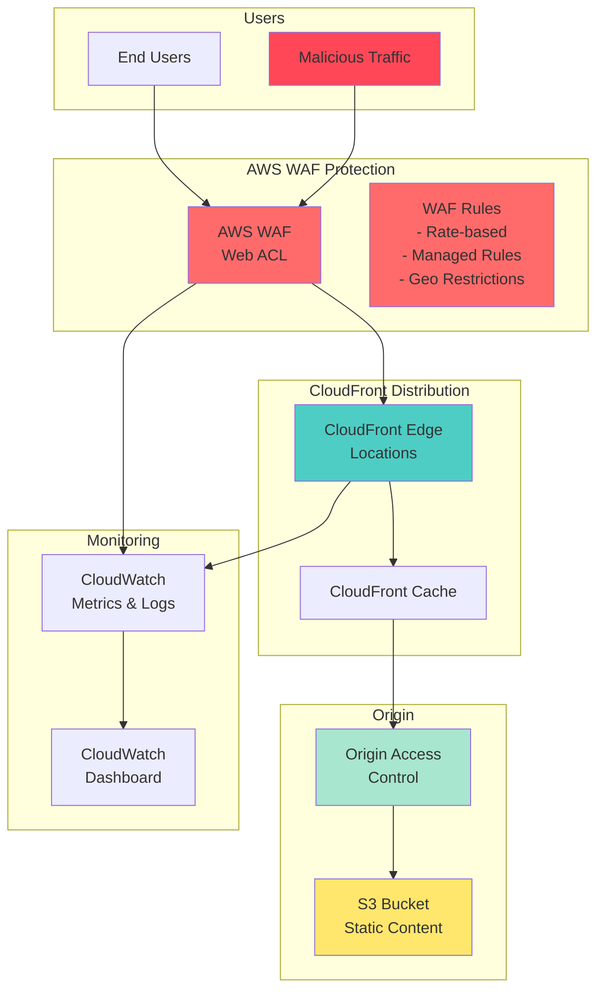

# Secure Content Delivery with CloudFront WAF

## Problem

Your organization delivers web content and applications to a global audience, but is experiencing increasing security threats including bot traffic, DDoS attacks, and attempts to exploit web vulnerabilities. The existing content delivery solution lacks advanced threat protection, has no geographic access controls, and provides limited visibility into malicious traffic patterns. Without proper security controls, your infrastructure is vulnerable to service disruption, data breaches, and performance degradation that could impact customer experience and business operations.

## Solution

Implement a comprehensive content protection system using Amazon CloudFront combined with AWS WAF (Web Application Firewall). This solution leverages CloudFront's global edge network for high-performance content delivery while applying multi-layered security controls through AWS WAF. By implementing geographic restrictions, rate-based rules, managed rule groups for common threats, and Origin Access Control for secure S3 integration, the system provides enterprise-grade protection against a wide range of attack vectors while maintaining optimal performance for legitimate users.

## Architecture Diagram



## Prerequisites

1. AWS account with appropriate permissions for CloudFront, WAF, S3, and CloudWatch
2. AWS CLI v2 installed and configured (or AWS CloudShell)
3. Basic understanding of web application security concepts and HTTP protocols
4. Knowledge of JSON file structure for configuration management
5. Understanding of DNS and content delivery network concepts
6. Estimated cost: $1.00-$5.00 per month for WAF rules and CloudFront requests (varies by traffic volume and rule complexity)

> **Note**: WAF charges are based on the number of web ACLs, rules, and web requests processed. CloudFront charges apply for data transfer and requests. See the [AWS WAF pricing page](https://aws.amazon.com/waf/pricing/) and [CloudFront pricing page](https://aws.amazon.com/cloudfront/pricing/) for detailed cost information.

## Preparation

```bash
# Set environment variables
export AWS_REGION=$(aws configure get region)
export AWS_ACCOUNT_ID=$(aws sts get-caller-identity \
    --query Account --output text)

# Generate unique identifiers for resources
RANDOM_SUFFIX=$(aws secretsmanager get-random-password \
    --exclude-punctuation --exclude-uppercase \
    --password-length 6 --require-each-included-type \
    --output text --query RandomPassword)

export BUCKET_NAME="secure-content-${RANDOM_SUFFIX}"
export DISTRIBUTION_NAME="secure-distribution-${RANDOM_SUFFIX}"
export WAF_WEB_ACL_NAME="secure-web-acl-${RANDOM_SUFFIX}"

# Create S3 bucket for content storage
aws s3 mb s3://${BUCKET_NAME} --region ${AWS_REGION}

# Enable versioning and encryption for security
aws s3api put-bucket-versioning \
    --bucket ${BUCKET_NAME} \
    --versioning-configuration Status=Enabled

aws s3api put-bucket-encryption \
    --bucket ${BUCKET_NAME} \
    --server-side-encryption-configuration \
    'Rules=[{ApplyServerSideEncryptionByDefault:{SSEAlgorithm:AES256}}]'

# Create sample content for testing
echo "<html><body><h1>Secure Content Test</h1><p>This content is protected by AWS WAF and CloudFront.</p><p>Timestamp: $(date)</p></body></html>" > index.html

# Upload sample content to S3
aws s3 cp index.html s3://${BUCKET_NAME}/index.html

echo "✅ Environment prepared with bucket: ${BUCKET_NAME}"
```

## Steps

1. **Create AWS WAF Web ACL with Initial Configuration**:

   AWS WAF provides a centralized way to protect your web applications from common web exploits and attacks. A Web ACL (Access Control List) acts as a firewall for your web applications, inspecting each HTTP/HTTPS request and applying rules to allow, block, or monitor traffic. For CloudFront distributions, WAF must be created in the us-east-1 region with CLOUDFRONT scope to provide global protection.

   ```bash
   # Create WAF Web ACL for CloudFront (must be in us-east-1 region)
   aws wafv2 create-web-acl \
       --scope CLOUDFRONT \
       --region us-east-1 \
       --name ${WAF_WEB_ACL_NAME} \
       --description "Web ACL for CloudFront security protection" \
       --default-action Allow={} \
       --visibility-config SampledRequestsEnabled=true,CloudWatchMetricsEnabled=true,MetricName=${WAF_WEB_ACL_NAME}Metrics
   
   # Get Web ACL ID and ARN for future operations
   export WAF_WEB_ACL_ID=$(aws wafv2 list-web-acls \
       --scope CLOUDFRONT \
       --region us-east-1 \
       --query "WebACLs[?Name=='${WAF_WEB_ACL_NAME}'].Id" \
       --output text)
   
   export WAF_WEB_ACL_ARN=$(aws wafv2 list-web-acls \
       --scope CLOUDFRONT \
       --region us-east-1 \
       --query "WebACLs[?Name=='${WAF_WEB_ACL_NAME}'].ARN" \
       --output text)
   
   echo "✅ WAF Web ACL created: ${WAF_WEB_ACL_ARN}"
   ```

   The Web ACL is now configured with a default action to allow traffic and CloudWatch metrics enabled. This foundational step establishes the security framework that will be enhanced with specific protection rules in subsequent steps.

2. **Configure WAF Managed Rules for Common Threats**:

   AWS Managed Rules provide pre-configured rule groups that protect against OWASP Top 10 vulnerabilities, known bad inputs, and other common attack vectors. These rules are maintained by AWS security experts and automatically updated as new threats emerge, providing enterprise-grade protection without requiring specialized security knowledge or constant maintenance.

   ```bash
   # Create managed rules configuration file
   cat > waf-managed-rules.json << 'EOF'
   [
     {
       "Name": "AWS-AWSManagedRulesCommonRuleSet",
       "Priority": 1,
       "Statement": {
         "ManagedRuleGroupStatement": {
           "VendorName": "AWS",
           "Name": "AWSManagedRulesCommonRuleSet"
         }
       },
       "OverrideAction": {
         "None": {}
       },
       "VisibilityConfig": {
         "SampledRequestsEnabled": true,
         "CloudWatchMetricsEnabled": true,
         "MetricName": "CommonRuleSetMetric"
       }
     },
     {
       "Name": "AWS-AWSManagedRulesKnownBadInputsRuleSet",
       "Priority": 2,
       "Statement": {
         "ManagedRuleGroupStatement": {
           "VendorName": "AWS",
           "Name": "AWSManagedRulesKnownBadInputsRuleSet"
         }
       },
       "OverrideAction": {
         "None": {}
       },
       "VisibilityConfig": {
         "SampledRequestsEnabled": true,
         "CloudWatchMetricsEnabled": true,
         "MetricName": "KnownBadInputsMetric"
       }
     }
   ]
   EOF
   
   # Get current lock token for Web ACL update
   export WAF_LOCK_TOKEN=$(aws wafv2 get-web-acl \
       --scope CLOUDFRONT \
       --region us-east-1 \
       --id ${WAF_WEB_ACL_ID} \
       --query "LockToken" --output text)
   
   # Update Web ACL with managed rules
   aws wafv2 update-web-acl \
       --scope CLOUDFRONT \
       --region us-east-1 \
       --id ${WAF_WEB_ACL_ID} \
       --name ${WAF_WEB_ACL_NAME} \
       --description "Web ACL with managed rules for CloudFront" \
       --default-action Allow={} \
       --rules file://waf-managed-rules.json \
       --visibility-config SampledRequestsEnabled=true,CloudWatchMetricsEnabled=true,MetricName=${WAF_WEB_ACL_NAME}Metrics \
       --lock-token ${WAF_LOCK_TOKEN}
   
   echo "✅ WAF managed rules configured for common threats"
   ```

   These managed rule groups now provide comprehensive protection against SQL injection, cross-site scripting (XSS), and other common attack patterns. The rules automatically inspect HTTP headers, URI paths, query strings, and request bodies for malicious content, significantly reducing your security exposure with minimal configuration effort.

3. **Implement Rate-Based Rules for DDoS Protection**:

   Rate-based rules are crucial for protecting against HTTP flood attacks and aggressive bot behavior. These rules monitor request patterns from individual IP addresses and automatically block sources that exceed defined thresholds, providing an effective defense against distributed denial-of-service attacks while allowing legitimate traffic bursts to continue unimpeded.

   ```bash
   # Get current Web ACL configuration to merge with new rule
   aws wafv2 get-web-acl \
       --scope CLOUDFRONT \
       --region us-east-1 \
       --id ${WAF_WEB_ACL_ID} \
       --query "WebACL.Rules" > current-rules.json
   
   # Create combined rules with rate-based rule added
   jq '. + [
     {
       "Name": "RateLimitRule",
       "Priority": 3,
       "Statement": {
         "RateBasedStatement": {
           "Limit": 2000,
           "AggregateKeyType": "IP"
         }
       },
       "Action": {
         "Block": {}
       },
       "VisibilityConfig": {
         "SampledRequestsEnabled": true,
         "CloudWatchMetricsEnabled": true,
         "MetricName": "RateLimitMetric"
       }
     }
   ]' current-rules.json > updated-rules.json
   
   # Get fresh lock token for update
   export WAF_LOCK_TOKEN=$(aws wafv2 get-web-acl \
       --scope CLOUDFRONT \
       --region us-east-1 \
       --id ${WAF_WEB_ACL_ID} \
       --query "LockToken" --output text)
   
   # Update Web ACL with rate-based rule
   aws wafv2 update-web-acl \
       --scope CLOUDFRONT \
       --region us-east-1 \
       --id ${WAF_WEB_ACL_ID} \
       --name ${WAF_WEB_ACL_NAME} \
       --description "Web ACL with rate-based rules for DDoS protection" \
       --default-action Allow={} \
       --rules file://updated-rules.json \
       --visibility-config SampledRequestsEnabled=true,CloudWatchMetricsEnabled=true,MetricName=${WAF_WEB_ACL_NAME}Metrics \
       --lock-token ${WAF_LOCK_TOKEN}
   
   echo "✅ Rate-based rules configured for DDoS protection"
   ```

   The rate-based rule now monitors incoming requests and automatically blocks IP addresses that exceed 2,000 requests per 5-minute window. This threshold balances protection against attack traffic while accommodating legitimate high-volume users and automated systems that may generate rapid requests during normal operations.

4. **Create Origin Access Control for S3 Security**:

   Origin Access Control (OAC) is the recommended method for securing CloudFront's access to S3 buckets. OAC ensures that your S3 bucket can only be accessed through CloudFront, preventing direct access attempts that could bypass your security controls. This approach is more secure and feature-complete than the legacy Origin Access Identity (OAI) method.

   ```bash
   # Create Origin Access Control for S3
   aws cloudfront create-origin-access-control \
       --origin-access-control-config \
       Name="OAC-${BUCKET_NAME}",Description="Origin Access Control for ${BUCKET_NAME}",SigningBehavior="always",SigningProtocol="sigv4",OriginAccessControlOriginType="s3" \
       --query "OriginAccessControl.Id" --output text > oac-id.txt
   
   export OAC_ID=$(cat oac-id.txt)
   
   echo "✅ Origin Access Control created: ${OAC_ID}"
   ```

   The Origin Access Control is now configured to use AWS Signature Version 4 (SigV4) for authenticating CloudFront requests to S3. This provides stronger security than the previous OAI method and supports all S3 features including server-side encryption with AWS KMS.

5. **Create CloudFront Distribution with WAF Integration**:

   CloudFront's global edge network provides low-latency content delivery while serving as the first line of defense when integrated with WAF. The distribution configuration includes HTTPS enforcement, caching optimization, and direct integration with the WAF Web ACL to ensure all requests are inspected before content delivery.

   ```bash
   # Create CloudFront distribution configuration
   cat > cloudfront-config.json << EOF
   {
     "CallerReference": "secure-distribution-$(date +%s)",
     "Comment": "Secure CloudFront distribution with WAF protection",
     "Origins": {
       "Quantity": 1,
       "Items": [
         {
           "Id": "${BUCKET_NAME}",
           "DomainName": "${BUCKET_NAME}.s3.${AWS_REGION}.amazonaws.com",
           "OriginPath": "",
           "S3OriginConfig": {
             "OriginAccessIdentity": ""
           },
           "OriginAccessControlId": "${OAC_ID}",
           "ConnectionAttempts": 3,
           "ConnectionTimeout": 10
         }
       ]
     },
     "DefaultCacheBehavior": {
       "TargetOriginId": "${BUCKET_NAME}",
       "ViewerProtocolPolicy": "redirect-to-https",
       "CachePolicyId": "658327ea-f89d-4fab-a63d-7e88639e58f6",
       "OriginRequestPolicyId": "88a5eaf4-2fd4-4709-b370-b4c650ea3fcf",
       "Compress": true,
       "TrustedSigners": {
         "Enabled": false,
         "Quantity": 0
       }
     },
     "Enabled": true,
     "WebACLId": "${WAF_WEB_ACL_ARN}",
     "PriceClass": "PriceClass_100",
     "DefaultRootObject": "index.html",
     "HttpVersion": "http2and3"
   }
   EOF
   
   # Create CloudFront distribution
   aws cloudfront create-distribution \
       --distribution-config file://cloudfront-config.json \
       --query "Distribution.Id" --output text > distribution-id.txt
   
   export DISTRIBUTION_ID=$(cat distribution-id.txt)
   
   echo "✅ CloudFront distribution created with WAF protection: ${DISTRIBUTION_ID}"
   ```

   The CloudFront distribution is now configured with modern cache policies, HTTP/2 and HTTP/3 support, automatic compression, and WAF integration. The distribution uses AWS managed cache and origin request policies that provide optimized performance while maintaining security controls.

6. **Configure S3 Bucket Policy for CloudFront Access**:

   The S3 bucket policy restricts access to only allow CloudFront using the Origin Access Control identity. This security measure prevents direct access to your content, ensuring all requests pass through CloudFront and are subject to WAF inspection and protection. The policy uses AWS service principals for secure authentication.

   ```bash
   # Wait for distribution to be created
   echo "⏳ Waiting for CloudFront distribution to be deployed..."
   aws cloudfront wait distribution-deployed --id ${DISTRIBUTION_ID}
   
   # Create S3 bucket policy for CloudFront OAC
   cat > bucket-policy.json << EOF
   {
     "Version": "2012-10-17",
     "Statement": [
       {
         "Sid": "AllowCloudFrontServicePrincipal",
         "Effect": "Allow",
         "Principal": {
           "Service": "cloudfront.amazonaws.com"
         },
         "Action": "s3:GetObject",
         "Resource": "arn:aws:s3:::${BUCKET_NAME}/*",
         "Condition": {
           "StringEquals": {
             "AWS:SourceArn": "arn:aws:cloudfront::${AWS_ACCOUNT_ID}:distribution/${DISTRIBUTION_ID}"
           }
         }
       }
     ]
   }
   EOF
   
   # Apply bucket policy
   aws s3api put-bucket-policy \
       --bucket ${BUCKET_NAME} \
       --policy file://bucket-policy.json
   
   echo "✅ S3 bucket policy configured for CloudFront access"
   ```

   The bucket policy now ensures that only the specific CloudFront distribution can access your S3 content using the service principal approach. This creates a secure content delivery pipeline where all requests are filtered through WAF before reaching your origin, eliminating potential security bypasses.

7. **Configure Geographic Restrictions**:

   Geographic restrictions provide an additional layer of security by blocking or allowing traffic based on the requesting user's country. This capability is particularly valuable for compliance requirements, content licensing restrictions, or when you need to block traffic from regions with high malicious activity. CloudFront evaluates these restrictions at the edge before processing WAF rules.

   ```bash
   # Get current distribution configuration
   aws cloudfront get-distribution-config \
       --id ${DISTRIBUTION_ID} \
       --query "DistributionConfig" > current-distribution-config.json
   
   # Update distribution with geographic restrictions
   jq '.Restrictions = {
     "GeoRestriction": {
       "RestrictionType": "blacklist",
       "Quantity": 2,
       "Items": ["RU", "CN"]
     }
   }' current-distribution-config.json > updated-distribution-config.json
   
   # Get current ETag for update
   export ETAG=$(aws cloudfront get-distribution-config \
       --id ${DISTRIBUTION_ID} \
       --query "ETag" --output text)
   
   # Apply geographic restrictions
   aws cloudfront update-distribution \
       --id ${DISTRIBUTION_ID} \
       --distribution-config file://updated-distribution-config.json \
       --if-match ${ETAG}
   
   echo "✅ Geographic restrictions configured"
   ```

   Geographic restrictions are now active, automatically blocking requests from specified countries at the CloudFront edge locations. This provides an efficient way to implement location-based access controls without impacting performance for allowed regions, and can significantly reduce malicious traffic from known problematic regions.

## Validation & Testing

1. **Verify WAF Web ACL Configuration**:

   ```bash
   # Check WAF Web ACL status and rules
   aws wafv2 get-web-acl \
       --scope CLOUDFRONT \
       --region us-east-1 \
       --id ${WAF_WEB_ACL_ID} \
       --query "WebACL.{Name:Name,Rules:Rules[].Name,DefaultAction:DefaultAction}"
   ```

   Expected output: Web ACL with managed rules, rate-based rules, and default allow action.

2. **Test CloudFront Distribution Access**:

   ```bash
   # Get CloudFront distribution domain name
   export DOMAIN_NAME=$(aws cloudfront get-distribution \
       --id ${DISTRIBUTION_ID} \
       --query "Distribution.DomainName" --output text)
   
   echo "CloudFront domain: https://${DOMAIN_NAME}"
   
   # Test HTTPS access (should succeed)
   curl -I https://${DOMAIN_NAME}/index.html
   
   # Test HTTP access (should redirect to HTTPS)
   curl -I http://${DOMAIN_NAME}/index.html
   ```

   Expected output: 200 OK for HTTPS requests, 301 redirect for HTTP requests.

3. **Verify S3 Direct Access Prevention**:

   ```bash
   # Attempt direct S3 access (should fail)
   curl -I https://${BUCKET_NAME}.s3.${AWS_REGION}.amazonaws.com/index.html
   ```

   Expected output: 403 Forbidden error, confirming direct access is blocked.

4. **Test WAF Protection**:

   ```bash
   # Test basic access
   curl -s -o /dev/null -w "%{http_code}" https://${DOMAIN_NAME}/index.html
   
   # Test with suspicious query (should trigger managed rules)
   curl -s -o /dev/null -w "%{http_code}" \
       "https://${DOMAIN_NAME}/index.html?test=<script>alert('xss')</script>"
   ```

   Expected output: 200 for normal requests, potential blocks for malicious patterns.

## Cleanup

1. **Remove CloudFront Distribution**:

   ```bash
   # Disable distribution first
   aws cloudfront get-distribution-config \
       --id ${DISTRIBUTION_ID} \
       --query "DistributionConfig" > final-distribution-config.json
   
   jq '.Enabled = false' final-distribution-config.json > disabled-distribution-config.json
   
   export FINAL_ETAG=$(aws cloudfront get-distribution-config \
       --id ${DISTRIBUTION_ID} \
       --query "ETag" --output text)
   
   aws cloudfront update-distribution \
       --id ${DISTRIBUTION_ID} \
       --distribution-config file://disabled-distribution-config.json \
       --if-match ${FINAL_ETAG}
   
   # Wait for distribution to be disabled
   echo "⏳ Waiting for distribution to be disabled..."
   aws cloudfront wait distribution-deployed --id ${DISTRIBUTION_ID}
   
   # Delete distribution
   aws cloudfront delete-distribution \
       --id ${DISTRIBUTION_ID} \
       --if-match $(aws cloudfront get-distribution-config \
           --id ${DISTRIBUTION_ID} \
           --query "ETag" --output text)
   
   echo "✅ CloudFront distribution deleted"
   ```

2. **Remove Origin Access Control**:

   ```bash
   # Delete Origin Access Control
   aws cloudfront delete-origin-access-control \
       --id ${OAC_ID} \
       --if-match $(aws cloudfront get-origin-access-control \
           --id ${OAC_ID} \
           --query "ETag" --output text)
   
   echo "✅ Origin Access Control deleted"
   ```

3. **Remove WAF Web ACL**:

   ```bash
   # Get final lock token for WAF deletion
   export FINAL_WAF_LOCK_TOKEN=$(aws wafv2 get-web-acl \
       --scope CLOUDFRONT \
       --region us-east-1 \
       --id ${WAF_WEB_ACL_ID} \
       --query "LockToken" --output text)
   
   # Delete WAF Web ACL
   aws wafv2 delete-web-acl \
       --scope CLOUDFRONT \
       --region us-east-1 \
       --id ${WAF_WEB_ACL_ID} \
       --lock-token ${FINAL_WAF_LOCK_TOKEN}
   
   echo "✅ WAF Web ACL deleted"
   ```

4. **Remove S3 Bucket and Content**:

   ```bash
   # Delete S3 bucket contents
   aws s3 rm s3://${BUCKET_NAME} --recursive
   
   # Delete S3 bucket
   aws s3 rb s3://${BUCKET_NAME}
   
   # Clean up local files
   rm -f index.html *.json *.txt
   
   echo "✅ S3 bucket and local files deleted"
   ```

## Discussion

The integration of Amazon CloudFront with AWS WAF creates a powerful security architecture that provides both performance optimization and comprehensive threat protection. CloudFront's global edge network serves as the first line of defense, intercepting malicious requests before they reach your origin infrastructure. This approach significantly reduces the load on your backend systems while providing consistent security enforcement across all global regions. The edge-based security model ensures that threats are blocked as close to their source as possible, minimizing latency impact on legitimate users.

AWS WAF's managed rules offer enterprise-grade protection that automatically adapts to emerging threats. The Common Rule Set protects against OWASP Top 10 vulnerabilities, while the Known Bad Inputs rule set blocks requests containing malicious payloads. These rules are continuously updated by AWS security experts, ensuring your applications remain protected against the latest attack vectors without requiring manual intervention. The rules inspect multiple request components including headers, URI paths, query strings, and request bodies to provide comprehensive coverage against injection attacks, cross-site scripting, and other common exploits.

Rate-based rules provide crucial protection against HTTP flood attacks and aggressive bot behavior. By monitoring request patterns and automatically blocking source IP addresses that exceed defined thresholds, these rules create an effective defense against distributed denial-of-service attacks. The 5-minute sliding window approach ensures that legitimate traffic bursts don't trigger false positives while maintaining protection against sustained attacks. This mechanism is particularly effective against application-layer DDoS attacks that attempt to overwhelm your infrastructure with seemingly legitimate requests.

The Origin Access Control mechanism represents a significant security improvement over traditional methods, ensuring that your S3 content can only be accessed through CloudFront using AWS Signature Version 4 authentication. This security model extends beyond simple access control—it creates a comprehensive security perimeter that forces all traffic through your configured protection mechanisms. OAC supports all modern S3 features including server-side encryption with AWS KMS, making it the recommended approach for securing CloudFront origins. For comprehensive security guidance, refer to the [AWS WAF Best Practices](https://docs.aws.amazon.com/waf/latest/developerguide/waf-best-practices.html) and [CloudFront Security Best Practices](https://docs.aws.amazon.com/AmazonCloudFront/latest/DeveloperGuide/SecurityBestPractices.html) documentation.

> **Warning**: Monitor your WAF metrics regularly to ensure rules are not blocking legitimate traffic. Fine-tune rate limits and rule configurations based on your application's traffic patterns and business requirements. Consider implementing staged rollouts for rule changes in production environments.

## Challenge

Extend this solution to create a more sophisticated content protection system by implementing the following enhancements:

1. Deploy a custom header verification system using Lambda@Edge that validates secure headers and API keys before requests reach your origin, implementing a multi-layer authentication approach that goes beyond IP-based controls.

2. Implement AWS WAF Bot Control managed rule group to detect and manage bot traffic more intelligently, differentiating between good bots (search engines, monitoring tools) and malicious ones while allowing legitimate automation workflows.

3. Create an automated IP reputation management system that uses Lambda functions to periodically fetch known bad IP lists from threat intelligence sources and dynamically updates your WAF IP set rules, creating a self-updating blocklist system.

4. Integrate with AWS Shield Advanced for enhanced DDoS protection and configure real-time attack notifications through Amazon SNS with automated response workflows that can scale protection during active attacks.

5. Implement comprehensive logging and monitoring dashboards using CloudWatch Insights and Amazon OpenSearch to analyze traffic patterns, security events, and performance metrics in real-time, enabling proactive threat detection and response.

## Infrastructure Code

### Available Infrastructure as Code:

- [Infrastructure Code Overview](code/README.md) - Detailed description of all infrastructure components
- [AWS CDK (Python)](code/cdk-python/) - AWS CDK Python implementation
- [AWS CDK (TypeScript)](code/cdk-typescript/) - AWS CDK TypeScript implementation
- [CloudFormation](code/cloudformation.yaml) - AWS CloudFormation template
- [Bash CLI Scripts](code/scripts/) - Example bash scripts using AWS CLI commands to deploy infrastructure
- [Terraform](code/terraform/) - Terraform configuration files