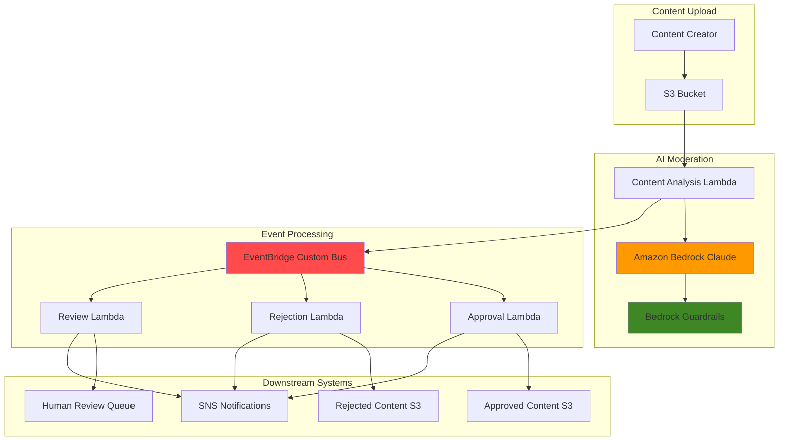

# AI Content Moderation with Bedrock and EventBridge

## Problem

Organizations receiving user-generated content through social platforms, forums, or file uploads face significant challenges moderating harmful, inappropriate, or policy-violating content at scale. Manual content review processes are time-consuming, inconsistent, and cannot keep pace with high-volume content streams. Traditional rule-based filtering systems lack the contextual understanding needed to accurately identify nuanced policy violations, leading to false positives that restrict legitimate content or false negatives that allow harmful content to reach audiences.

## Solution

This solution implements an intelligent, automated content moderation system using Amazon Bedrock's advanced AI models to analyze uploaded content and Amazon EventBridge to orchestrate event-driven workflows. Content uploaded to S3 triggers Lambda functions that leverage Bedrock's Claude models with safety guardrails to perform contextual analysis, generating moderation decisions that flow through EventBridge to downstream systems for approval, rejection, or human review workflows.

## Architecture Diagram



## Prerequisites

1. AWS account with appropriate permissions for S3, Lambda, Bedrock, EventBridge, and SNS
2. AWS CLI v2 installed and configured (or AWS CloudShell)
3. Basic understanding of event-driven architectures and AI/ML concepts
4. Amazon Bedrock model access enabled (specifically for Anthropic Claude models)
5. Estimated cost: $0.50-2.00 per hour for testing (varies based on content volume and model usage)

> **Note**: Amazon Bedrock requires explicit model access request approval for Claude models. Enable access through the AWS console under Bedrock > Model access before proceeding.

## Preparation

```bash
# Set environment variables
export AWS_REGION=$(aws configure get region)
export AWS_ACCOUNT_ID=$(aws sts get-caller-identity \
    --query Account --output text)

# Generate unique identifiers for resources
RANDOM_SUFFIX=$(aws secretsmanager get-random-password \
    --exclude-punctuation --exclude-uppercase \
    --password-length 6 --require-each-included-type \
    --output text --query RandomPassword)

# Set resource names
export CONTENT_BUCKET="content-moderation-bucket-${RANDOM_SUFFIX}"
export APPROVED_BUCKET="approved-content-${RANDOM_SUFFIX}"
export REJECTED_BUCKET="rejected-content-${RANDOM_SUFFIX}"
export CUSTOM_BUS_NAME="content-moderation-bus"
export SNS_TOPIC_NAME="content-moderation-notifications"

# Create S3 buckets for content storage
aws s3 mb s3://${CONTENT_BUCKET} --region ${AWS_REGION}
aws s3 mb s3://${APPROVED_BUCKET} --region ${AWS_REGION}
aws s3 mb s3://${REJECTED_BUCKET} --region ${AWS_REGION}

# Enable versioning and encryption
for bucket in ${CONTENT_BUCKET} ${APPROVED_BUCKET} ${REJECTED_BUCKET}; do
    aws s3api put-bucket-versioning \
        --bucket ${bucket} \
        --versioning-configuration Status=Enabled
    
    aws s3api put-bucket-encryption \
        --bucket ${bucket} \
        --server-side-encryption-configuration \
        'Rules=[{ApplyServerSideEncryptionByDefault:{SSEAlgorithm:AES256}}]'
done

echo "✅ S3 buckets created with security features enabled"
```

## Steps

1. **Create SNS Topic for Notifications**:

   Amazon SNS provides a reliable messaging service for sending notifications about moderation decisions to administrators, content creators, and downstream systems. This centralized notification system ensures all stakeholders receive timely updates about content status changes, enabling quick response to policy violations or system issues.

   ```bash
   # Create SNS topic for moderation notifications
   SNS_TOPIC_ARN=$(aws sns create-topic \
       --name ${SNS_TOPIC_NAME} \
       --query TopicArn --output text)
   
   # Subscribe email endpoint for notifications (replace with your email)
   aws sns subscribe \
       --topic-arn ${SNS_TOPIC_ARN} \
       --protocol email \
       --notification-endpoint your-email@example.com
   
   echo "✅ SNS topic created: ${SNS_TOPIC_ARN}"
   ```

   The SNS topic is now configured to deliver moderation notifications via multiple channels. This messaging infrastructure enables real-time alerting and audit trail creation for all content moderation decisions processed by the system.

2. **Create Custom EventBridge Bus**:

   EventBridge custom buses provide isolated event routing for application-specific events, separate from the default AWS service events. This segregation improves security, reduces noise, and enables fine-grained access control for content moderation workflows while supporting scalable event-driven architecture patterns.

   ```bash
   # Create custom EventBridge bus for content moderation
   aws events create-event-bus \
       --name ${CUSTOM_BUS_NAME}
   
   CUSTOM_BUS_ARN="arn:aws:events:${AWS_REGION}:${AWS_ACCOUNT_ID}:event-bus/${CUSTOM_BUS_NAME}"
   
   echo "✅ Custom EventBridge bus created: ${CUSTOM_BUS_NAME}"
   ```

   The custom event bus establishes a dedicated event routing infrastructure for content moderation workflows. This separation enables better security policies, monitoring, and ensures moderation events don't interfere with other application events.

3. **Create IAM Roles for Lambda Functions**:

   IAM roles implement the principle of least privilege by granting Lambda functions only the specific permissions needed for their designated tasks. These roles enable secure access to Bedrock AI models, S3 content storage, EventBridge event publishing, and SNS notifications while maintaining security boundaries between different system components.

   ```bash
   # Trust policy for Lambda execution
   cat > lambda-trust-policy.json << 'EOF'
   {
       "Version": "2012-10-17",
       "Statement": [
           {
               "Effect": "Allow",
               "Principal": {
                   "Service": "lambda.amazonaws.com"
               },
               "Action": "sts:AssumeRole"
           }
       ]
   }
   EOF
   
   # Create role for content analysis Lambda
   aws iam create-role \
       --role-name ContentAnalysisLambdaRole \
       --assume-role-policy-document file://lambda-trust-policy.json
   
   # Create policy for Bedrock, S3, and EventBridge access
   cat > content-analysis-policy.json << EOF
   {
       "Version": "2012-10-17",
       "Statement": [
           {
               "Effect": "Allow",
               "Action": [
                   "bedrock:InvokeModel",
                   "bedrock:InvokeModelWithResponseStream"
               ],
               "Resource": "arn:aws:bedrock:${AWS_REGION}::foundation-model/anthropic.*"
           },
           {
               "Effect": "Allow",
               "Action": [
                   "s3:GetObject",
                   "s3:GetObjectVersion"
               ],
               "Resource": "arn:aws:s3:::${CONTENT_BUCKET}/*"
           },
           {
               "Effect": "Allow",
               "Action": [
                   "events:PutEvents"
               ],
               "Resource": "${CUSTOM_BUS_ARN}"
           }
       ]
   }
   EOF
   
   aws iam put-role-policy \
       --role-name ContentAnalysisLambdaRole \
       --policy-name ContentAnalysisPolicy \
       --policy-document file://content-analysis-policy.json
   
   # Attach basic Lambda execution role
   aws iam attach-role-policy \
       --role-name ContentAnalysisLambdaRole \
       --policy-arn arn:aws:iam::aws:policy/service-role/AWSLambdaBasicExecutionRole
   
   # Create separate role for workflow functions
   aws iam create-role \
       --role-name WorkflowLambdaRole \
       --assume-role-policy-document file://lambda-trust-policy.json
   
   # Create policy for workflow functions (S3 and SNS access)
   cat > workflow-policy.json << EOF
   {
       "Version": "2012-10-17",
       "Statement": [
           {
               "Effect": "Allow",
               "Action": [
                   "s3:GetObject",
                   "s3:PutObject",
                   "s3:CopyObject"
               ],
               "Resource": [
                   "arn:aws:s3:::${CONTENT_BUCKET}/*",
                   "arn:aws:s3:::${APPROVED_BUCKET}/*",
                   "arn:aws:s3:::${REJECTED_BUCKET}/*"
               ]
           },
           {
               "Effect": "Allow",
               "Action": [
                   "sns:Publish"
               ],
               "Resource": "${SNS_TOPIC_ARN}"
           }
       ]
   }
   EOF
   
   aws iam put-role-policy \
       --role-name WorkflowLambdaRole \
       --policy-name WorkflowPolicy \
       --policy-document file://workflow-policy.json
   
   aws iam attach-role-policy \
       --role-name WorkflowLambdaRole \
       --policy-arn arn:aws:iam::aws:policy/service-role/AWSLambdaBasicExecutionRole
   
   echo "✅ IAM roles created with appropriate permissions"
   ```

   The IAM roles now provide secure, scoped access for Lambda functions to interact with AWS services. This security foundation enables the content analysis workflow while maintaining strict access controls and audit trails for all AI model invocations and content operations.

4. **Create Content Processing Lambda Functions**:

   Lambda functions provide serverless compute for content analysis and workflow orchestration. The content analysis function leverages Bedrock's Claude models to perform intelligent content moderation, while workflow functions handle approved, rejected, and flagged content routing through EventBridge event patterns.

   ```bash
   # Create content analysis Lambda function code
   mkdir -p lambda-functions/content-analysis
   cat > lambda-functions/content-analysis/index.py << 'EOF'
   import json
   import boto3
   import urllib.parse
   from datetime import datetime
   
   bedrock = boto3.client('bedrock-runtime')
   s3 = boto3.client('s3')
   eventbridge = boto3.client('events')
   
   def lambda_handler(event, context):
       try:
           # Parse S3 event
           bucket = event['Records'][0]['s3']['bucket']['name']
           key = urllib.parse.unquote_plus(
               event['Records'][0]['s3']['object']['key'])
           
           # Get content from S3
           response = s3.get_object(Bucket=bucket, Key=key)
           content = response['Body'].read().decode('utf-8')
           
           # Prepare moderation prompt
           prompt = f"""Please analyze the following content for policy violations. 
   Consider harmful content including hate speech, violence, harassment, 
   inappropriate sexual content, misinformation, and spam.
   
   Content to analyze:
   {content[:2000]}
   
   Respond with a JSON object containing:
   - "decision": "approved", "rejected", or "review"
   - "confidence": score from 0.0 to 1.0  
   - "reason": brief explanation
   - "categories": array of policy categories if violations found"""
           
           # Invoke Bedrock Claude model
           body = json.dumps({
               "anthropic_version": "bedrock-2023-05-31",
               "max_tokens": 1000,
               "messages": [
                   {"role": "user", "content": prompt}
               ]
           })
           
           bedrock_response = bedrock.invoke_model(
               modelId='anthropic.claude-3-sonnet-20240229-v1:0',
               body=body,
               contentType='application/json'
           )
           
           response_body = json.loads(bedrock_response['body'].read())
           
           # Extract the response text
           response_text = response_body['content'][0]['text']
           
           # Parse JSON from response
           try:
               moderation_result = json.loads(response_text)
           except json.JSONDecodeError:
               # Fallback if response isn't valid JSON
               moderation_result = {
                   "decision": "review",
                   "confidence": 0.5,
                   "reason": "Unable to parse moderation response",
                   "categories": ["parsing_error"]
               }
           
           # Publish event to EventBridge
           event_detail = {
               'bucket': bucket,
               'key': key,
               'decision': moderation_result['decision'],
               'confidence': moderation_result['confidence'],
               'reason': moderation_result['reason'],
               'categories': moderation_result.get('categories', []),
               'timestamp': datetime.utcnow().isoformat()
           }
           
           eventbridge.put_events(
               Entries=[
                   {
                       'Source': 'content.moderation',
                       'DetailType': f"Content {moderation_result['decision'].title()}",
                       'Detail': json.dumps(event_detail),
                       'EventBusName': 'content-moderation-bus'
                   }
               ]
           )
           
           return {
               'statusCode': 200,
               'body': json.dumps({
                   'message': 'Content analyzed successfully',
                   'decision': moderation_result['decision']
               })
           }
           
       except Exception as e:
           print(f"Error: {str(e)}")
           return {
               'statusCode': 500,
               'body': json.dumps({'error': str(e)})
           }
   EOF
   
   # Package and deploy content analysis function
   cd lambda-functions/content-analysis
   zip -r content-analysis.zip .
   
   CONTENT_ANALYSIS_FUNCTION_ARN=$(aws lambda create-function \
       --function-name ContentAnalysisFunction \
       --runtime python3.11 \
       --role arn:aws:iam::${AWS_ACCOUNT_ID}:role/ContentAnalysisLambdaRole \
       --handler index.lambda_handler \
       --zip-file fileb://content-analysis.zip \
       --timeout 60 \
       --memory-size 512 \
       --query FunctionArn --output text)
   
   cd ../..
   
   echo "✅ Content analysis Lambda function deployed: ${CONTENT_ANALYSIS_FUNCTION_ARN}"
   ```

   The content analysis function is now operational and ready to process content uploads. This serverless component integrates Bedrock's advanced AI capabilities with your content moderation workflow, providing intelligent analysis and automated decision-making based on configurable content policies.

5. **Create Content Workflow Lambda Functions**:

   Workflow Lambda functions handle the post-analysis processing of content based on moderation decisions. These functions implement business logic for approved content publishing, rejected content quarantine, and human review queue management, ensuring proper content lifecycle management and compliance tracking.

   ```bash
   # Create workflow functions for each decision type
   for workflow in approved rejected review; do
       mkdir -p lambda-functions/${workflow}-handler
       
       cat > lambda-functions/${workflow}-handler/index.py << EOF
   import json
   import boto3
   from datetime import datetime
   
   s3 = boto3.client('s3')
   sns = boto3.client('sns')
   
   def lambda_handler(event, context):
       try:
           detail = event['detail']
           source_bucket = detail['bucket']
           source_key = detail['key']
           
           # Determine target bucket based on workflow
           target_bucket = {
               'approved': '${APPROVED_BUCKET}',
               'rejected': '${REJECTED_BUCKET}',
               'review': '${REJECTED_BUCKET}'
           }['${workflow}']
           
           target_key = f"${workflow}/{datetime.utcnow().strftime('%Y/%m/%d')}/{source_key}"
           
           # Copy content to appropriate bucket
           copy_source = {'Bucket': source_bucket, 'Key': source_key}
           s3.copy_object(
               CopySource=copy_source,
               Bucket=target_bucket,
               Key=target_key,
               MetadataDirective='REPLACE',
               Metadata={
                   'moderation-decision': detail['decision'],
                   'moderation-confidence': str(detail['confidence']),
                   'moderation-reason': detail['reason'],
                   'processed-timestamp': datetime.utcnow().isoformat()
               }
           )
           
           # Send notification
           message = f"""
   Content Moderation Result: {detail['decision'].upper()}
   
   File: {source_key}
   Confidence: {detail['confidence']:.2f}
   Reason: {detail['reason']}
   Categories: {', '.join(detail.get('categories', []))}
   Timestamp: {detail['timestamp']}
   
   Target Location: s3://{target_bucket}/{target_key}
           """
           
           sns.publish(
               TopicArn='${SNS_TOPIC_ARN}',
               Subject=f'Content {detail["decision"].title()}: {source_key}',
               Message=message
           )
           
           return {
               'statusCode': 200,
               'body': json.dumps({
                   'message': f'Content processed for ${workflow}',
                   'target_location': f's3://{target_bucket}/{target_key}'
               })
           }
           
       except Exception as e:
           print(f"Error in ${workflow} handler: {str(e)}")
           return {
               'statusCode': 500,
               'body': json.dumps({'error': str(e)})
           }
   EOF
       
       # Package and deploy workflow function
       cd lambda-functions/${workflow}-handler
       zip -r ${workflow}-handler.zip .
       
       aws lambda create-function \
           --function-name ${workflow^}HandlerFunction \
           --runtime python3.11 \
           --role arn:aws:iam::${AWS_ACCOUNT_ID}:role/WorkflowLambdaRole \
           --handler index.lambda_handler \
           --zip-file fileb://${workflow}-handler.zip \
           --timeout 30 \
           --memory-size 256
       
       cd ../..
   done
   
   echo "✅ Workflow Lambda functions created for all decision types"
   ```

   The workflow functions are now deployed and configured to handle content routing based on moderation decisions. These functions implement the business logic for content lifecycle management, ensuring proper storage, metadata tagging, and stakeholder notifications for each moderation outcome.

6. **Configure S3 Event Notifications**:

   S3 event notifications create the trigger mechanism that initiates content moderation workflows when new content is uploaded. This event-driven approach ensures immediate processing of uploaded content without requiring polling or manual intervention, enabling real-time content moderation at scale.

   ```bash
   # Grant S3 permission to invoke Lambda function
   aws lambda add-permission \
       --function-name ContentAnalysisFunction \
       --principal s3.amazonaws.com \
       --action lambda:InvokeFunction \
       --statement-id s3-trigger-permission \
       --source-arn arn:aws:s3:::${CONTENT_BUCKET}
   
   # Configure S3 event notification
   cat > s3-notification-config.json << EOF
   {
       "LambdaConfigurations": [
           {
               "Id": "ContentAnalysisNotification",
               "LambdaFunctionArn": "${CONTENT_ANALYSIS_FUNCTION_ARN}",
               "Events": ["s3:ObjectCreated:*"],
               "Filter": {
                   "Key": {
                       "FilterRules": [
                           {
                               "Name": "suffix",
                               "Value": ".txt"
                           }
                       ]
                   }
               }
           }
       ]
   }
   EOF
   
   aws s3api put-bucket-notification-configuration \
       --bucket ${CONTENT_BUCKET} \
       --notification-configuration file://s3-notification-config.json
   
   echo "✅ S3 event notification configured for content analysis"
   ```

   S3 event notifications are now configured to automatically trigger content analysis when text files are uploaded. This automated trigger mechanism ensures every piece of content undergoes moderation analysis without manual intervention, providing consistent policy enforcement.

7. **Create EventBridge Rules for Workflow Routing**:

   EventBridge rules implement intelligent event routing based on moderation decisions, directing content through appropriate workflows. These rules enable decoupled, scalable processing where each decision type triggers specific downstream actions, supporting complex business logic and compliance requirements.

   ```bash
   # Create rules for each decision type
   for decision in approved rejected review; do
       # Create rule
       aws events put-rule \
           --name ${decision}-content-rule \
           --event-pattern "{\"source\":[\"content.moderation\"],\"detail-type\":[\"Content ${decision^}\"]}" \
           --state ENABLED \
           --event-bus-name ${CUSTOM_BUS_NAME}
       
       # Add Lambda target to rule
       aws events put-targets \
           --rule ${decision}-content-rule \
           --event-bus-name ${CUSTOM_BUS_NAME} \
           --targets Id=1,Arn=arn:aws:lambda:${AWS_REGION}:${AWS_ACCOUNT_ID}:function:${decision^}HandlerFunction
       
       # Grant EventBridge permission to invoke Lambda
       aws lambda add-permission \
           --function-name ${decision^}HandlerFunction \
           --principal events.amazonaws.com \
           --action lambda:InvokeFunction \
           --statement-id eventbridge-${decision}-permission \
           --source-arn arn:aws:events:${AWS_REGION}:${AWS_ACCOUNT_ID}:rule/${CUSTOM_BUS_NAME}/${decision}-content-rule
   done
   
   echo "✅ EventBridge rules configured for all content workflows"
   ```

   EventBridge rules are now routing moderation decisions to appropriate workflow functions. This event-driven architecture enables flexible, scalable content processing with clear separation of concerns and easy extensibility for additional workflow types or business rules.

8. **Create Bedrock Guardrails for Enhanced Safety**:

   Bedrock Guardrails provide an additional layer of AI safety by implementing configurable content filters, topic restrictions, and sensitive information detection. These guardrails work alongside Claude's built-in safety features to provide defense-in-depth protection against policy violations and ensure consistent content moderation standards.

   ```bash
   # Create guardrail configuration
   cat > bedrock-guardrail.json << EOF
   {
       "name": "ContentModerationGuardrail",
       "description": "Guardrail for content moderation to prevent harmful content",
       "contentPolicyConfig": {
           "filtersConfig": [
               {
                   "type": "SEXUAL",
                   "inputStrength": "HIGH",
                   "outputStrength": "HIGH"
               },
               {
                   "type": "VIOLENCE",
                   "inputStrength": "HIGH",
                   "outputStrength": "HIGH"
               },
               {
                   "type": "HATE",
                   "inputStrength": "HIGH",
                   "outputStrength": "HIGH"
               },
               {
                   "type": "INSULTS",
                   "inputStrength": "MEDIUM",
                   "outputStrength": "MEDIUM"
               },
               {
                   "type": "MISCONDUCT",
                   "inputStrength": "HIGH",
                   "outputStrength": "HIGH"
               }
           ]
       },
       "topicPolicyConfig": {
           "topicsConfig": [
               {
                   "name": "IllegalActivities",
                   "definition": "Content promoting or instructing illegal activities",
                   "examples": ["How to make illegal substances", "Tax evasion strategies"],
                   "type": "DENY"
               }
           ]
       },
       "sensitiveInformationPolicyConfig": {
           "piiEntitiesConfig": [
               {
                   "type": "EMAIL",
                   "action": "ANONYMIZE"
               },
               {
                   "type": "PHONE",
                   "action": "ANONYMIZE"
               },
               {
                   "type": "CREDIT_DEBIT_CARD_NUMBER",
                   "action": "BLOCK"
               }
           ]
       },
       "blockedInputMessaging": "This content violates our content policy.",
       "blockedOutputsMessaging": "I cannot provide that type of content."
   }
   EOF
   
   # Create the guardrail
   GUARDRAIL_ID=$(aws bedrock create-guardrail \
       --cli-input-json file://bedrock-guardrail.json \
       --query guardrailId --output text)
   
   echo "✅ Bedrock guardrail created with ID: ${GUARDRAIL_ID}"
   ```

   The Bedrock guardrail is now active and provides enhanced content filtering capabilities. This additional safety layer works in conjunction with Claude's analysis to provide comprehensive content moderation with configurable sensitivity levels and policy enforcement.

## Validation & Testing

1. **Verify EventBridge Rules and Targets**:

   ```bash
   # List rules on custom event bus
   aws events list-rules --event-bus-name ${CUSTOM_BUS_NAME}
   
   # Check targets for each rule
   for decision in approved rejected review; do
       echo "Targets for ${decision}-content-rule:"
       aws events list-targets-by-rule \
           --rule ${decision}-content-rule \
           --event-bus-name ${CUSTOM_BUS_NAME}
   done
   ```

   Expected output: Three rules with Lambda function targets configured for each decision type.

2. **Test Content Upload and Moderation**:

   ```bash
   # Create test content files
   echo "This is a great product review. I love this item!" > positive-content.txt
   echo "I hate this stupid product and the people who made it are idiots!" > negative-content.txt
   echo "This product is okay. Nothing special but it works fine." > neutral-content.txt
   
   # Upload test content to trigger moderation
   aws s3 cp positive-content.txt s3://${CONTENT_BUCKET}/
   aws s3 cp negative-content.txt s3://${CONTENT_BUCKET}/
   aws s3 cp neutral-content.txt s3://${CONTENT_BUCKET}/
   
   echo "✅ Test content uploaded. Check CloudWatch Logs for processing results."
   ```

3. **Monitor Processing Results**:

   ```bash
   # Check Lambda function logs
   aws logs describe-log-groups \
       --log-group-name-prefix "/aws/lambda/ContentAnalysis"
   
   # Check if content was moved to appropriate buckets
   echo "Approved content:"
   aws s3 ls s3://${APPROVED_BUCKET}/approved/ --recursive
   
   echo "Rejected content:"
   aws s3 ls s3://${REJECTED_BUCKET}/rejected/ --recursive
   
   echo "Review content:"
   aws s3 ls s3://${REJECTED_BUCKET}/review/ --recursive
   ```

4. **Verify SNS Notifications**:

   ```bash
   # Check SNS topic subscriptions
   aws sns list-subscriptions-by-topic \
       --topic-arn ${SNS_TOPIC_ARN}
   
   echo "Check your email for moderation notifications."
   ```

## Cleanup

1. **Remove Lambda Functions**:

   ```bash
   # Delete Lambda functions
   for function in ContentAnalysisFunction ApprovedHandlerFunction RejectedHandlerFunction ReviewHandlerFunction; do
       aws lambda delete-function --function-name ${function} 2>/dev/null || true
   done
   
   echo "✅ Lambda functions deleted"
   ```

2. **Remove EventBridge Rules and Custom Bus**:

   ```bash
   # Remove targets and rules
   for decision in approved rejected review; do
       aws events remove-targets \
           --rule ${decision}-content-rule \
           --event-bus-name ${CUSTOM_BUS_NAME} \
           --ids 1 2>/dev/null || true
       
       aws events delete-rule \
           --name ${decision}-content-rule \
           --event-bus-name ${CUSTOM_BUS_NAME} 2>/dev/null || true
   done
   
   # Delete custom event bus
   aws events delete-event-bus --name ${CUSTOM_BUS_NAME} 2>/dev/null || true
   
   echo "✅ EventBridge resources deleted"
   ```

3. **Remove S3 Buckets and Content**:

   ```bash
   # Empty and delete S3 buckets
   for bucket in ${CONTENT_BUCKET} ${APPROVED_BUCKET} ${REJECTED_BUCKET}; do
       aws s3 rm s3://${bucket} --recursive 2>/dev/null || true
       aws s3 rb s3://${bucket} 2>/dev/null || true
   done
   
   echo "✅ S3 buckets deleted"
   ```

4. **Remove IAM Roles and Policies**:

   ```bash
   # Detach and delete policies for ContentAnalysisLambdaRole
   aws iam detach-role-policy \
       --role-name ContentAnalysisLambdaRole \
       --policy-arn arn:aws:iam::aws:policy/service-role/AWSLambdaBasicExecutionRole \
       2>/dev/null || true
   
   aws iam delete-role-policy \
       --role-name ContentAnalysisLambdaRole \
       --policy-name ContentAnalysisPolicy 2>/dev/null || true
   
   aws iam delete-role --role-name ContentAnalysisLambdaRole 2>/dev/null || true
   
   # Detach and delete policies for WorkflowLambdaRole
   aws iam detach-role-policy \
       --role-name WorkflowLambdaRole \
       --policy-arn arn:aws:iam::aws:policy/service-role/AWSLambdaBasicExecutionRole \
       2>/dev/null || true
   
   aws iam delete-role-policy \
       --role-name WorkflowLambdaRole \
       --policy-name WorkflowPolicy 2>/dev/null || true
   
   aws iam delete-role --role-name WorkflowLambdaRole 2>/dev/null || true
   
   echo "✅ IAM roles and policies deleted"
   ```

5. **Remove SNS Topic and Bedrock Guardrail**:

   ```bash
   # Delete SNS topic
   aws sns delete-topic --topic-arn ${SNS_TOPIC_ARN} 2>/dev/null || true
   
   # Delete Bedrock guardrail
   aws bedrock delete-guardrail \
       --guardrail-identifier ${GUARDRAIL_ID} 2>/dev/null || true
   
   # Clean up local files
   rm -rf lambda-functions/ *.json *.txt 2>/dev/null || true
   
   echo "✅ All resources cleaned up"
   ```

## Discussion

Building intelligent content moderation with Amazon Bedrock and EventBridge creates a sophisticated, scalable system that combines advanced AI capabilities with robust event-driven architecture. This solution leverages Amazon Bedrock's Claude models, which are specifically designed with strong safety features and contextual understanding, making them ideal for content moderation tasks that require nuanced policy interpretation. The [Amazon Bedrock User Guide](https://docs.aws.amazon.com/bedrock/latest/userguide/what-is-bedrock.html) provides comprehensive documentation on model capabilities and safety features.

The event-driven architecture using Amazon EventBridge enables loose coupling between content analysis and downstream processing, supporting scalable workflows that can handle varying content volumes. EventBridge's custom event buses provide security isolation and enable fine-grained access control, while event patterns ensure proper routing based on moderation decisions. For detailed guidance on event-driven patterns, reference the [EventBridge User Guide](https://docs.aws.amazon.com/eventbridge/latest/userguide/eb-what-is.html) and [AWS Well-Architected Event-Driven Architecture guidance](https://docs.aws.amazon.com/wellarchitected/latest/event-driven-architecture-pillar/welcome.html).

From a security and compliance perspective, this architecture implements multiple layers of protection including Bedrock Guardrails, IAM role-based access control, and encrypted data storage. The [Bedrock Guardrails documentation](https://docs.aws.amazon.com/bedrock/latest/userguide/guardrails-components.html) details how to configure content filters, topic restrictions, and sensitive information detection for enhanced safety. The system maintains audit trails through CloudWatch logs and SNS notifications, supporting compliance requirements for content governance and regulatory oversight.

Cost optimization is achieved through serverless architecture that scales to zero when not processing content, pay-per-request pricing for AI model invocations, and intelligent storage tiering for processed content. The solution follows AWS Well-Architected principles of reliability, security, and cost optimization while providing the flexibility to customize moderation policies and workflows based on specific business requirements.

> **Tip**: Monitor Amazon Bedrock model invocation costs using [CloudWatch metrics and Cost Explorer](https://docs.aws.amazon.com/bedrock/latest/userguide/monitoring-bedrock.html) to optimize batch processing and implement cost controls based on content volume patterns.

## Challenge

Extend this content moderation solution by implementing these enhancements:

1. **Multi-Modal Content Support**: Integrate Amazon Rekognition and Amazon Textract to analyze images, videos, and documents in addition to text content, creating a comprehensive moderation pipeline for all content types.

2. **Human-in-the-Loop Workflow**: Implement Amazon A2I (Augmented AI) for human review of edge cases and confidence threshold-based escalation, enabling continuous improvement of moderation accuracy.

3. **Real-time Moderation Dashboard**: Build a web application using Amazon QuickSight or custom dashboards to visualize moderation metrics, policy violation trends, and system performance in real-time.

4. **Advanced Policy Engine**: Create a configurable policy engine using Amazon DynamoDB and AWS Step Functions to support complex, multi-criteria moderation rules with temporal logic and contextual factors.

5. **Content Appeal System**: Develop an appeal workflow using Amazon API Gateway and Lambda that allows content creators to contest moderation decisions, triggering human review and policy refinement processes.

## Infrastructure Code

### Available Infrastructure as Code:

- [Infrastructure Code Overview](code/README.md) - Detailed description of all infrastructure components
- [AWS CDK (Python)](code/cdk-python/) - AWS CDK Python implementation
- [AWS CDK (TypeScript)](code/cdk-typescript/) - AWS CDK TypeScript implementation
- [CloudFormation](code/cloudformation.yaml) - AWS CloudFormation template
- [Bash CLI Scripts](code/scripts/) - Example bash scripts using AWS CLI commands to deploy infrastructure
- [Terraform](code/terraform/) - Terraform configuration files