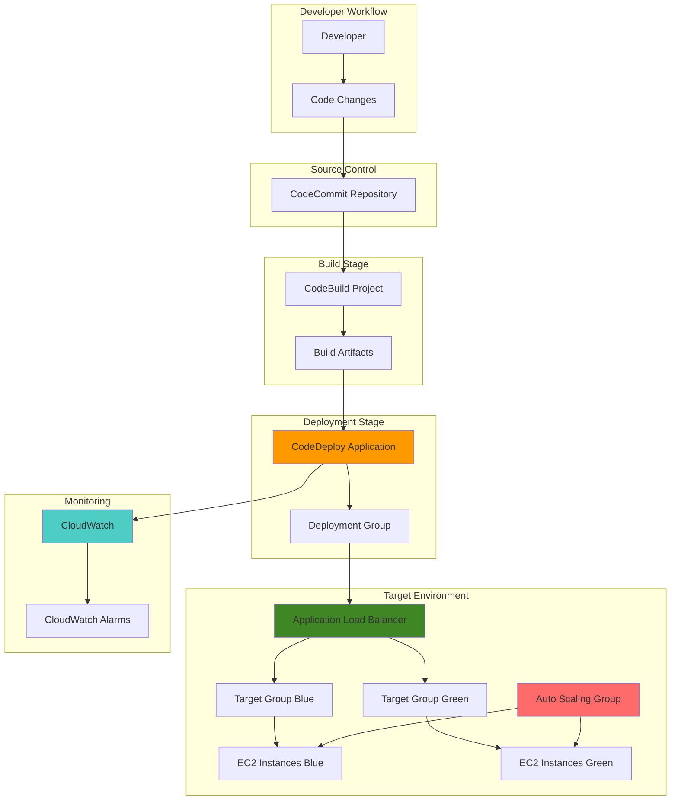

# Continuous Deployment with CodeDeploy

## Problem

Modern software development teams need to deliver applications rapidly while maintaining high availability and minimizing deployment risks. Manual deployment processes are error-prone, time-consuming, and create bottlenecks that slow down feature delivery. Development teams struggle with coordinating deployments across multiple environments, rolling back failed deployments, and ensuring zero-downtime releases. Traditional deployment approaches often result in service interruptions, inconsistent environments, and difficulty in maintaining deployment consistency across development, staging, and production environments.

## Solution

AWS CodeDeploy provides automated application deployment capabilities that enable continuous delivery with blue-green deployment strategies. This solution implements an end-to-end continuous deployment pipeline that automatically deploys applications to EC2 instances using blue-green deployment patterns, ensuring zero-downtime releases with built-in rollback capabilities. CodeDeploy integrates with CodeCommit for source control and CodeBuild for build automation, creating a complete CI/CD pipeline that maintains deployment consistency and enables rapid, reliable software delivery.

## Architecture Diagram



## Prerequisites

1. AWS account with administrative permissions for CodeDeploy, CodeCommit, CodeBuild, EC2, and IAM
2. AWS CLI v2 installed and configured (or AWS CloudShell)
3. Understanding of deployment strategies and blue-green deployment concepts
4. Basic knowledge of EC2, Application Load Balancers, and Auto Scaling Groups
5. Familiarity with application deployment lifecycle and CI/CD pipelines
6. Estimated cost: $10-20 for testing resources (EC2 instances, ALB, data transfer)

> **Note**: This recipe creates multiple EC2 instances for blue-green deployment simulation. Ensure you have sufficient EC2 instance limits in your account and clean up resources after testing to avoid ongoing charges.

## Preparation

```bash
# Set environment variables
export AWS_REGION=$(aws configure get region)
export AWS_ACCOUNT_ID=$(aws sts get-caller-identity \
    --query Account --output text)

# Generate unique identifiers for resources
RANDOM_SUFFIX=$(aws secretsmanager get-random-password \
    --exclude-punctuation --exclude-uppercase \
    --password-length 6 --require-each-included-type \
    --output text --query RandomPassword)

export APP_NAME="webapp-${RANDOM_SUFFIX}"
export REPO_NAME="webapp-repo-${RANDOM_SUFFIX}"
export BUILD_PROJECT_NAME="webapp-build-${RANDOM_SUFFIX}"
export DEPLOYMENT_GROUP_NAME="webapp-depgroup-${RANDOM_SUFFIX}"
export KEY_PAIR_NAME="webapp-keypair-${RANDOM_SUFFIX}"

# Create EC2 Key Pair for instances
aws ec2 create-key-pair \
    --key-name $KEY_PAIR_NAME \
    --query 'KeyMaterial' --output text > "${KEY_PAIR_NAME}.pem"

chmod 400 "${KEY_PAIR_NAME}.pem"

# Get default VPC and subnet information
export DEFAULT_VPC_ID=$(aws ec2 describe-vpcs \
    --filters "Name=is-default,Values=true" \
    --query 'Vpcs[0].VpcId' --output text)

export SUBNET_IDS=$(aws ec2 describe-subnets \
    --filters "Name=vpc-id,Values=${DEFAULT_VPC_ID}" \
    --query 'Subnets[*].SubnetId' --output text)

export SUBNET_ID_1=$(echo $SUBNET_IDS | cut -d' ' -f1)
export SUBNET_ID_2=$(echo $SUBNET_IDS | cut -d' ' -f2)

echo "✅ Environment variables configured"
echo "App Name: $APP_NAME"
echo "Repository: $REPO_NAME"
echo "VPC ID: $DEFAULT_VPC_ID"
```

## Steps

1. **Create IAM Roles and Policies**:

   AWS Identity and Access Management (IAM) roles provide secure access to AWS services without hardcoded credentials. The CodeDeploy service role enables CodeDeploy to orchestrate deployments across EC2 instances and Auto Scaling Groups, while the EC2 instance profile allows instances to communicate with AWS services during deployment. These roles follow the principle of least privilege, granting only the minimum permissions required for successful operations.

   ```bash
   # Create CodeDeploy service role
   aws iam create-role \
       --role-name CodeDeployServiceRole \
       --assume-role-policy-document '{
           "Version": "2012-10-17",
           "Statement": [
               {
                   "Effect": "Allow",
                   "Principal": {
                       "Service": "codedeploy.amazonaws.com"
                   },
                   "Action": "sts:AssumeRole"
               }
           ]
       }'
   
   # Attach AWS managed policy for CodeDeploy
   aws iam attach-role-policy \
       --role-name CodeDeployServiceRole \
       --policy-arn arn:aws:iam::aws:policy/service-role/AWSCodeDeployRole
   
   # Create EC2 instance profile for CodeDeploy agent
   aws iam create-role \
       --role-name CodeDeployEC2Role \
       --assume-role-policy-document '{
           "Version": "2012-10-17",
           "Statement": [
               {
                   "Effect": "Allow",
                   "Principal": {
                       "Service": "ec2.amazonaws.com"
                   },
                   "Action": "sts:AssumeRole"
               }
           ]
       }'
   
   # Attach policies for EC2 instances
   aws iam attach-role-policy \
       --role-name CodeDeployEC2Role \
       --policy-arn arn:aws:iam::aws:policy/service-role/AmazonEC2RoleforAWSCodeDeploy
   
   aws iam attach-role-policy \
       --role-name CodeDeployEC2Role \
       --policy-arn arn:aws:iam::aws:policy/CloudWatchAgentServerPolicy
   
   # Create instance profile
   aws iam create-instance-profile \
       --instance-profile-name CodeDeployEC2InstanceProfile
   
   aws iam add-role-to-instance-profile \
       --instance-profile-name CodeDeployEC2InstanceProfile \
       --role-name CodeDeployEC2Role
   
   echo "✅ IAM roles and instance profile created"
   ```

   The CodeDeploy service role allows CodeDeploy to perform deployments on EC2 instances and Auto Scaling groups with appropriate permissions for blue-green deployments. The EC2 instance profile enables instances to download deployment artifacts from S3 and communicate with CodeDeploy during the deployment process.

   > **Note**: Follow the [principle of least privilege](https://docs.aws.amazon.com/IAM/latest/UserGuide/best-practices.html#grant-least-privilege) when configuring IAM permissions for production environments.

2. **Create Application Load Balancer and Target Groups**:

   Application Load Balancers enable blue-green deployments by routing traffic between different target groups representing the blue and green environments. The ALB provides Layer-7 load balancing with health checks, ensuring traffic only reaches healthy instances during deployments. Two target groups allow seamless traffic switching without downtime, forming the foundation of the blue-green deployment strategy.

   ```bash
   # Create security group for ALB
   export ALB_SG_ID=$(aws ec2 create-security-group \
       --group-name "${APP_NAME}-alb-sg" \
       --description "Security group for ALB" \
       --vpc-id $DEFAULT_VPC_ID \
       --query 'GroupId' --output text)
   
   # Allow HTTP traffic to ALB
   aws ec2 authorize-security-group-ingress \
       --group-id $ALB_SG_ID \
       --protocol tcp \
       --port 80 \
       --cidr 0.0.0.0/0
   
   # Create Application Load Balancer
   export ALB_ARN=$(aws elbv2 create-load-balancer \
       --name "${APP_NAME}-alb" \
       --subnets $SUBNET_ID_1 $SUBNET_ID_2 \
       --security-groups $ALB_SG_ID \
       --query 'LoadBalancers[0].LoadBalancerArn' --output text)
   
   # Create target groups for blue-green deployment
   export TG_BLUE_ARN=$(aws elbv2 create-target-group \
       --name "${APP_NAME}-tg-blue" \
       --protocol HTTP \
       --port 80 \
       --vpc-id $DEFAULT_VPC_ID \
       --health-check-path / \
       --health-check-interval-seconds 30 \
       --health-check-timeout-seconds 5 \
       --healthy-threshold-count 2 \
       --unhealthy-threshold-count 3 \
       --query 'TargetGroups[0].TargetGroupArn' --output text)
   
   export TG_GREEN_ARN=$(aws elbv2 create-target-group \
       --name "${APP_NAME}-tg-green" \
       --protocol HTTP \
       --port 80 \
       --vpc-id $DEFAULT_VPC_ID \
       --health-check-path / \
       --health-check-interval-seconds 30 \
       --health-check-timeout-seconds 5 \
       --healthy-threshold-count 2 \
       --unhealthy-threshold-count 3 \
       --query 'TargetGroups[0].TargetGroupArn' --output text)
   
   # Create listener for ALB
   export LISTENER_ARN=$(aws elbv2 create-listener \
       --load-balancer-arn $ALB_ARN \
       --protocol HTTP \
       --port 80 \
       --default-actions Type=forward,TargetGroupArn=$TG_BLUE_ARN \
       --query 'Listeners[0].ListenerArn' --output text)
   
   echo "✅ Application Load Balancer and target groups created"
   ```

   The blue target group initially receives all traffic, while the green target group remains idle until deployment. Health checks ensure only healthy instances receive traffic during deployments, providing automatic failure detection and traffic isolation.

3. **Create Auto Scaling Group and Launch Template**:

   Auto Scaling Groups provide the compute infrastructure for deployments, automatically managing instance lifecycle and maintaining desired capacity. The launch template includes CodeDeploy agent installation and application setup, ensuring new instances are deployment-ready from launch. This infrastructure foundation enables CodeDeploy to perform blue-green deployments by creating parallel environments and managing instance replacement.

   ```bash
   # Create security group for EC2 instances
   export EC2_SG_ID=$(aws ec2 create-security-group \
       --group-name "${APP_NAME}-ec2-sg" \
       --description "Security group for EC2 instances" \
       --vpc-id $DEFAULT_VPC_ID \
       --query 'GroupId' --output text)
   
   # Allow HTTP traffic from ALB
   aws ec2 authorize-security-group-ingress \
       --group-id $EC2_SG_ID \
       --protocol tcp \
       --port 80 \
       --source-group $ALB_SG_ID
   
   # Allow SSH access (for debugging)
   aws ec2 authorize-security-group-ingress \
       --group-id $EC2_SG_ID \
       --protocol tcp \
       --port 22 \
       --cidr 0.0.0.0/0
   
   # Get Amazon Linux 2 AMI ID
   export AMI_ID=$(aws ec2 describe-images \
       --owners amazon \
       --filters "Name=name,Values=amzn2-ami-hvm-*-x86_64-gp2" \
       --query 'Images | sort_by(@, &CreationDate) | [-1].ImageId' \
       --output text)
   
   # Create launch template with region-agnostic CodeDeploy agent installation
   aws ec2 create-launch-template \
       --launch-template-name "${APP_NAME}-launch-template" \
       --launch-template-data '{
           "ImageId": "'$AMI_ID'",
           "InstanceType": "t3.micro",
           "KeyName": "'$KEY_PAIR_NAME'",
           "SecurityGroupIds": ["'$EC2_SG_ID'"],
           "IamInstanceProfile": {
               "Name": "CodeDeployEC2InstanceProfile"
           },
           "UserData": "'$(base64 -w 0 <<EOF
#!/bin/bash
yum update -y
yum install -y ruby wget httpd
systemctl start httpd
systemctl enable httpd
echo "<h1>Blue Environment - Version 1.0</h1>" > /var/www/html/index.html
cd /home/ec2-user
wget https://aws-codedeploy-${AWS_REGION}.s3.${AWS_REGION}.amazonaws.com/latest/install
chmod +x ./install
./install auto
systemctl start codedeploy-agent
systemctl enable codedeploy-agent
EOF
)'"
       }'
   
   # Create Auto Scaling Group
   aws autoscaling create-auto-scaling-group \
       --auto-scaling-group-name "${APP_NAME}-asg" \
       --launch-template LaunchTemplateName="${APP_NAME}-launch-template",Version='$Latest' \
       --min-size 2 \
       --max-size 4 \
       --desired-capacity 2 \
       --target-group-arns $TG_BLUE_ARN \
       --vpc-zone-identifier "${SUBNET_ID_1},${SUBNET_ID_2}" \
       --tags Key=Name,Value="${APP_NAME}-instance",PropagateAtLaunch=true \
              Key=Environment,Value=blue,PropagateAtLaunch=true
   
   echo "✅ Auto Scaling Group and launch template created"
   ```

   The user data script installs the CodeDeploy agent using a region-agnostic URL and sets up a basic web server. The Auto Scaling Group maintains desired capacity and automatically replaces unhealthy instances during deployments, providing resilient compute infrastructure for the blue-green deployment process.

4. **Create CodeCommit Repository and Sample Application**:

   CodeCommit provides secure, scalable Git repository hosting with integrated AWS service authentication. The repository stores application source code along with deployment configuration files, including the appspec.yml file that defines deployment hooks and file mappings. This centralized source control enables automated CI/CD workflows where code changes trigger builds and deployments through the pipeline.

   ```bash
   # Create CodeCommit repository
   aws codecommit create-repository \
       --repository-name $REPO_NAME \
       --repository-description "Repository for webapp deployment"
   
   # Clone the repository
   git clone https://codecommit.${AWS_REGION}.amazonaws.com/v1/repos/${REPO_NAME}
   cd $REPO_NAME
   
   # Create sample application files
   mkdir -p scripts
   
   # Create application specification file for CodeDeploy
   cat > appspec.yml << 'EOF'
version: 0.0
os: linux
files:
  - source: /
    destination: /var/www/html
    overwrite: true
hooks:
  BeforeInstall:
    - location: scripts/install_dependencies.sh
      timeout: 300
      runas: root
  ApplicationStart:
    - location: scripts/start_server.sh
      timeout: 300
      runas: root
  ApplicationStop:
    - location: scripts/stop_server.sh
      timeout: 300
      runas: root
  ValidateService:
    - location: scripts/validate_service.sh
      timeout: 300
      runas: root
EOF
   
   # Create sample web application
   cat > index.html << 'EOF'
<!DOCTYPE html>
<html>
<head>
    <title>WebApp Deployment</title>
    <style>
        body { font-family: Arial, sans-serif; margin: 40px; }
        .header { background-color: #4CAF50; color: white; padding: 20px; }
        .content { padding: 20px; }
        .version { background-color: #f0f0f0; padding: 10px; margin: 10px 0; }
    </style>
</head>
<body>
    <div class="header">
        <h1>WebApp Continuous Deployment</h1>
    </div>
    <div class="content">
        <div class="version">
            <h2>Version: 2.0</h2>
            <p>Environment: Green</p>
            <p>Deployment Status: Success</p>
        </div>
        <p>This application was deployed using AWS CodeDeploy with blue-green deployment strategy.</p>
        <p>Deployment timestamp: <span id="timestamp"></span></p>
    </div>
    <script>
        document.getElementById('timestamp').textContent = new Date().toLocaleString();
    </script>
</body>
</html>
EOF
   
   # Create deployment lifecycle scripts
   cat > scripts/install_dependencies.sh << 'EOF'
#!/bin/bash
yum update -y
yum install -y httpd
EOF
   
   cat > scripts/start_server.sh << 'EOF'
#!/bin/bash
systemctl start httpd
systemctl enable httpd
EOF
   
   cat > scripts/stop_server.sh << 'EOF'
#!/bin/bash
systemctl stop httpd
EOF
   
   cat > scripts/validate_service.sh << 'EOF'
#!/bin/bash
systemctl is-active httpd
curl -f http://localhost/ || exit 1
EOF
   
   chmod +x scripts/*.sh
   
   # Create buildspec for CodeBuild with updated runtime
   cat > buildspec.yml << 'EOF'
version: 0.2
phases:
  install:
    runtime-versions:
      nodejs: 20
  pre_build:
    commands:
      - echo Build started on `date`
      - echo Logging in to Amazon ECR...
  build:
    commands:
      - echo Build completed on `date`
artifacts:
  files:
    - '**/*'
EOF
   
   # Commit initial code
   git add .
   git commit -m "Initial commit with sample web application"
   git push origin main
   
   cd ..
   
   echo "✅ CodeCommit repository created with sample application"
   ```

   The appspec.yml file defines the deployment lifecycle with hooks for dependency installation, service management, and validation. The deployment scripts ensure proper application lifecycle management during blue-green deployments, enabling automated service startup, validation, and cleanup processes.

5. **Create CodeBuild Project**:

   CodeBuild provides fully managed build services that compile source code, run tests, and produce deployable artifacts. The build service uses the latest Amazon Linux container image and Node.js runtime, ensuring builds execute in a consistent, secure environment. CodeBuild integrates seamlessly with CodeCommit for source retrieval and S3 for artifact storage, creating the crucial bridge between source code and deployment artifacts in the CI/CD pipeline.

   ```bash
   # Create CodeBuild service role
   aws iam create-role \
       --role-name CodeBuildServiceRole \
       --assume-role-policy-document '{
           "Version": "2012-10-17",
           "Statement": [
               {
                   "Effect": "Allow",
                   "Principal": {
                       "Service": "codebuild.amazonaws.com"
                   },
                   "Action": "sts:AssumeRole"
               }
           ]
       }'
   
   # Create and attach policy for CodeBuild
   cat > codebuild-policy.json << EOF
{
    "Version": "2012-10-17",
    "Statement": [
        {
            "Effect": "Allow",
            "Action": [
                "logs:CreateLogGroup",
                "logs:CreateLogStream",
                "logs:PutLogEvents",
                "codecommit:GitPull",
                "s3:GetObject",
                "s3:PutObject",
                "s3:GetBucketLocation",
                "s3:ListBucket"
            ],
            "Resource": "*"
        }
    ]
}
EOF
   
   aws iam put-role-policy \
       --role-name CodeBuildServiceRole \
       --policy-name CodeBuildServicePolicy \
       --policy-document file://codebuild-policy.json
   
   # Create S3 bucket for artifacts
   export ARTIFACTS_BUCKET_NAME="codedeploy-artifacts-${RANDOM_SUFFIX}"
   aws s3 mb s3://$ARTIFACTS_BUCKET_NAME
   
   # Create CodeBuild project with current image
   aws codebuild create-project \
       --name $BUILD_PROJECT_NAME \
       --source type=CODECOMMIT,location=https://codecommit.${AWS_REGION}.amazonaws.com/v1/repos/${REPO_NAME} \
       --artifacts type=S3,location=${ARTIFACTS_BUCKET_NAME}/artifacts \
       --environment type=LINUX_CONTAINER,image=aws/codebuild/amazonlinux-x86_64-standard:5.0,computeType=BUILD_GENERAL1_SMALL \
       --service-role arn:aws:iam::${AWS_ACCOUNT_ID}:role/CodeBuildServiceRole
   
   echo "✅ CodeBuild project created"
   ```

   The CodeBuild project uses the latest Amazon Linux 2023 image with Node.js 20 runtime, ensuring builds execute with current tools and security patches. The build specification defines build phases and artifact outputs, enabling automated compilation and packaging of application code with consistent, repeatable results. Learn more about [CodeBuild build specifications](https://docs.aws.amazon.com/codebuild/latest/userguide/build-spec-ref.html) for advanced build configuration options.

6. **Create CodeDeploy Application and Deployment Group**:

   CodeDeploy applications define the deployment target and configuration settings for application deployments. The deployment group specifies which instances receive deployments and defines the blue-green deployment strategy with automatic instance provisioning and traffic switching. This configuration enables zero-downtime deployments by creating parallel environments, validating new deployments, and switching traffic only after successful validation.

   ```bash
   # Create CodeDeploy application
   aws deploy create-application \
       --application-name $APP_NAME \
       --compute-platform EC2/On-Premises
   
   # Create deployment group with blue-green configuration
   aws deploy create-deployment-group \
       --application-name $APP_NAME \
       --deployment-group-name $DEPLOYMENT_GROUP_NAME \
       --service-role-arn arn:aws:iam::${AWS_ACCOUNT_ID}:role/CodeDeployServiceRole \
       --auto-scaling-groups "${APP_NAME}-asg" \
       --deployment-config-name CodeDeployDefault.AllAtOnceBlueGreen \
       --blue-green-deployment-configuration '{
           "deploymentReadyOption": {
               "actionOnTimeout": "CONTINUE_DEPLOYMENT"
           },
           "terminateBlueInstancesOnDeploymentSuccess": {
               "action": "TERMINATE",
               "terminationWaitTimeInMinutes": 5
           },
           "greenFleetProvisioningOption": {
               "action": "COPY_AUTO_SCALING_GROUP"
           }
       }' \
       --load-balancer-info '{
           "targetGroupInfoList": [
               {
                   "name": "'$(basename $TG_BLUE_ARN)'"
               }
           ]
       }'
   
   echo "✅ CodeDeploy application and deployment group created"
   ```

   The CodeDeploy application and deployment group are configured for blue-green deployments with the "AllAtOnceBlueGreen" strategy, which provisions new instances (green environment) while maintaining existing instances (blue environment) until deployment validation completes. This setup ensures zero-downtime deployments and provides immediate rollback capabilities. Learn more about [CodeDeploy deployment configurations](https://docs.aws.amazon.com/codedeploy/latest/userguide/deployment-configurations.html) for different deployment strategies.

7. **Trigger Initial Build and Deployment**:

   With all infrastructure components configured, we can now execute the complete CI/CD pipeline workflow. This demonstrates end-to-end automation from source code to production deployment, validating that CodeBuild successfully creates deployment artifacts and CodeDeploy orchestrates the blue-green deployment process. The initial deployment establishes the baseline production environment and validates pipeline functionality.

   ```bash
   # Start CodeBuild build
   export BUILD_ID=$(aws codebuild start-build \
       --project-name $BUILD_PROJECT_NAME \
       --query 'build.id' --output text)
   
   echo "Build started: $BUILD_ID"
   
   # Wait for build to complete
   echo "Waiting for build to complete..."
   aws codebuild wait build-succeeded --ids $BUILD_ID
   
   # Create deployment using build artifacts
   aws deploy create-deployment \
       --application-name $APP_NAME \
       --deployment-group-name $DEPLOYMENT_GROUP_NAME \
       --s3-location bucket=$ARTIFACTS_BUCKET_NAME,key=artifacts,bundleType=zip \
       --deployment-config-name CodeDeployDefault.AllAtOnceBlueGreen \
       --description "Blue-green deployment of webapp v2.0"
   
   echo "✅ Initial deployment triggered"
   ```

   The initial deployment demonstrates seamless coordination between CodeBuild artifact creation and CodeDeploy orchestration. The blue-green deployment strategy ensures application availability throughout the deployment process, with automatic validation and rollback capabilities providing production-grade reliability and safety.

8. **Configure CloudWatch Monitoring and Alarms**:

   CloudWatch monitoring and alarms provide essential observability for production deployments, automatically detecting deployment failures and application health issues. These alarms integrate with CodeDeploy's rollback mechanisms to create self-healing deployment systems that maintain application availability. Proactive monitoring reduces mean time to recovery (MTTR) by catching and resolving deployment issues before they impact end users.

   ```bash
   # Create CloudWatch alarm for deployment failures
   aws cloudwatch put-metric-alarm \
       --alarm-name "${APP_NAME}-deployment-failure" \
       --alarm-description "Alarm for CodeDeploy deployment failures" \
       --metric-name FailedDeployments \
       --namespace AWS/CodeDeploy \
       --statistic Sum \
       --period 300 \
       --threshold 1 \
       --comparison-operator GreaterThanOrEqualToThreshold \
       --evaluation-periods 1 \
       --dimensions Name=ApplicationName,Value=$APP_NAME Name=DeploymentGroupName,Value=$DEPLOYMENT_GROUP_NAME
   
   # Create CloudWatch alarm for application health
   aws cloudwatch put-metric-alarm \
       --alarm-name "${APP_NAME}-target-health" \
       --alarm-description "Alarm for target group health" \
       --metric-name HealthyHostCount \
       --namespace AWS/ApplicationELB \
       --statistic Average \
       --period 300 \
       --threshold 1 \
       --comparison-operator LessThanThreshold \
       --evaluation-periods 2 \
       --dimensions Name=TargetGroup,Value=$(basename $TG_BLUE_ARN) Name=LoadBalancer,Value=$(basename $ALB_ARN)
   
   echo "✅ CloudWatch monitoring and alarms configured"
   ```

   The CloudWatch alarms monitor critical deployment and application metrics, providing automated health checks that integrate with CodeDeploy's rollback mechanisms. These alarms create comprehensive coverage for deployment process monitoring and application performance validation.

   > **Tip**: Configure CloudWatch alarms with appropriate thresholds to balance between early warning and false positive alerts. Consider adding custom application metrics for business-specific monitoring.

9. **Create Automated Rollback Configuration**:

   Automated rollback configuration creates a critical safety mechanism that automatically reverts deployments when failures or performance degradations are detected. This configuration links CloudWatch alarms with CodeDeploy's rollback capabilities, creating an automated safety net that responds to deployment failures, instance failures, or alarm threshold breaches, ensuring minimal downtime and maintaining application availability in production environments.

   ```bash
   # Update deployment group with automated rollback configuration
   aws deploy update-deployment-group \
       --application-name $APP_NAME \
       --current-deployment-group-name $DEPLOYMENT_GROUP_NAME \
       --auto-rollback-configuration '{
           "enabled": true,
           "events": ["DEPLOYMENT_FAILURE", "DEPLOYMENT_STOP_ON_ALARM", "DEPLOYMENT_STOP_ON_INSTANCE_FAILURE"]
       }' \
       --alarm-configuration '{
           "enabled": true,
           "alarms": [
               {
                   "name": "'${APP_NAME}-deployment-failure'"
               },
               {
                   "name": "'${APP_NAME}-target-health'"
               }
           ]
       }'
   
   echo "✅ Automated rollback configuration enabled"
   ```

   The automated rollback configuration creates a robust deployment safety net that monitors for deployment failures, instance failures, and alarm threshold breaches. The system automatically triggers rollbacks based on CloudWatch alarms, maintaining application availability by quickly reverting to the last known stable version when issues are detected.

10. **Test Deployment Pipeline with Code Changes**:

    Testing the complete deployment pipeline with real code changes validates end-to-end CI/CD system functionality. This simulates the typical developer workflow where code changes trigger automatic builds and deployments, demonstrating seamless integration between CodeCommit, CodeBuild, and CodeDeploy. The pipeline validation ensures the automation works correctly and is ready for production use with built-in reliability features.

    ```bash
    # Navigate to repository
    cd $REPO_NAME
    
    # Create updated application version
    cat > index.html << 'EOF'
<!DOCTYPE html>
<html>
<head>
    <title>WebApp Deployment</title>
    <style>
        body { font-family: Arial, sans-serif; margin: 40px; }
        .header { background-color: #2196F3; color: white; padding: 20px; }
        .content { padding: 20px; }
        .version { background-color: #e3f2fd; padding: 10px; margin: 10px 0; }
    </style>
</head>
<body>
    <div class="header">
        <h1>WebApp Continuous Deployment</h1>
    </div>
    <div class="content">
        <div class="version">
            <h2>Version: 3.0</h2>
            <p>Environment: Green</p>
            <p>Deployment Status: Success</p>
            <p>New Feature: Updated styling and layout</p>
        </div>
        <p>This application was deployed using AWS CodeDeploy with blue-green deployment strategy.</p>
        <p>Deployment timestamp: <span id="timestamp"></span></p>
        <p>This is version 3.0 with enhanced features!</p>
    </div>
    <script>
        document.getElementById('timestamp').textContent = new Date().toLocaleString();
    </script>
</body>
</html>
EOF
    
    # Commit and push changes
    git add .
    git commit -m "Release v3.0 with updated styling"
    git push origin main
    
    # Trigger new build and deployment
    export BUILD_ID_V3=$(aws codebuild start-build \
        --project-name $BUILD_PROJECT_NAME \
        --query 'build.id' --output text)
    
    echo "Build v3.0 started: $BUILD_ID_V3"
    
    # Wait for build to complete
    aws codebuild wait build-succeeded --ids $BUILD_ID_V3
    
    # Create deployment for v3.0
    aws deploy create-deployment \
        --application-name $APP_NAME \
        --deployment-group-name $DEPLOYMENT_GROUP_NAME \
        --s3-location bucket=$ARTIFACTS_BUCKET_NAME,key=artifacts,bundleType=zip \
        --deployment-config-name CodeDeployDefault.AllAtOnceBlueGreen \
        --description "Blue-green deployment of webapp v3.0"
    
    cd ..
    
    echo "✅ Deployment pipeline tested with v3.0"
    ```

    The deployment pipeline successfully processed the new application version, demonstrating complete automation from code commit to production deployment. The blue-green deployment strategy and automated rollback mechanisms provide safety nets that enable confident deployments with built-in reliability and recovery capabilities.

## Validation & Testing

1. **Verify CodeDeploy Application Status**:

   ```bash
   # Check application status
   aws deploy get-application \
       --application-name $APP_NAME
   
   # List deployment groups
   aws deploy list-deployment-groups \
       --application-name $APP_NAME
   
   # Check deployment configuration
   aws deploy get-deployment-group \
       --application-name $APP_NAME \
       --deployment-group-name $DEPLOYMENT_GROUP_NAME
   ```

   Expected output: Application should be listed with "EC2/On-Premises" compute platform and deployment group should show blue-green configuration.

2. **Monitor Active Deployments**:

   ```bash
   # List recent deployments
   aws deploy list-deployments \
       --application-name $APP_NAME \
       --deployment-group-name $DEPLOYMENT_GROUP_NAME
   
   # Get deployment details
   export LATEST_DEPLOYMENT=$(aws deploy list-deployments \
       --application-name $APP_NAME \
       --deployment-group-name $DEPLOYMENT_GROUP_NAME \
       --query 'deployments[0]' --output text)
   
   aws deploy get-deployment \
       --deployment-id $LATEST_DEPLOYMENT
   ```

   Expected output: Deployment should show "Succeeded" status with blue-green deployment details.

3. **Test Application Load Balancer**:

   ```bash
   # Get ALB DNS name
   export ALB_DNS=$(aws elbv2 describe-load-balancers \
       --load-balancer-arns $ALB_ARN \
       --query 'LoadBalancers[0].DNSName' --output text)
   
   echo "Application URL: http://$ALB_DNS"
   
   # Test application accessibility
   curl -I http://$ALB_DNS
   
   # Test application content
   curl http://$ALB_DNS
   ```

   Expected output: HTTP 200 response with HTML content showing the deployed application version.

4. **Validate Blue-Green Deployment Process**:

   ```bash
   # Check target group health
   aws elbv2 describe-target-health \
       --target-group-arn $TG_BLUE_ARN
   
   aws elbv2 describe-target-health \
       --target-group-arn $TG_GREEN_ARN
   
   # Monitor deployment events
   aws deploy list-deployment-instances \
       --deployment-id $LATEST_DEPLOYMENT
   ```

   Expected output: Target groups should show healthy instances, and deployment instances should show successful deployment status.

5. **Test Rollback Functionality**:

   ```bash
   # Create a failing deployment by introducing errors
   cd $REPO_NAME
   
   # Create a broken version for rollback testing
   cat > scripts/validate_service.sh << 'EOF'
#!/bin/bash
exit 1  # This will cause validation to fail
EOF
   
   git add .
   git commit -m "Broken version for rollback testing"
   git push origin main
   
   # Trigger deployment that will fail
   export BROKEN_BUILD_ID=$(aws codebuild start-build \
       --project-name $BUILD_PROJECT_NAME \
       --query 'build.id' --output text)
   
   aws codebuild wait build-succeeded --ids $BROKEN_BUILD_ID
   
   # Create failing deployment
   aws deploy create-deployment \
       --application-name $APP_NAME \
       --deployment-group-name $DEPLOYMENT_GROUP_NAME \
       --s3-location bucket=$ARTIFACTS_BUCKET_NAME,key=artifacts,bundleType=zip \
       --deployment-config-name CodeDeployDefault.AllAtOnceBlueGreen \
       --description "Failing deployment for rollback testing"
   
   cd ..
   
   echo "✅ Rollback test initiated"
   ```

## Cleanup

1. **Remove CodeDeploy Resources**:

   ```bash
   # Delete deployments (if any are running)
   aws deploy stop-deployment \
       --deployment-id $LATEST_DEPLOYMENT \
       --auto-rollback-enabled || true
   
   # Delete deployment group
   aws deploy delete-deployment-group \
       --application-name $APP_NAME \
       --deployment-group-name $DEPLOYMENT_GROUP_NAME
   
   # Delete application
   aws deploy delete-application \
       --application-name $APP_NAME
   
   echo "✅ CodeDeploy resources removed"
   ```

2. **Remove CodeBuild and CodeCommit Resources**:

   ```bash
   # Delete CodeBuild project
   aws codebuild delete-project \
       --name $BUILD_PROJECT_NAME
   
   # Delete CodeCommit repository
   aws codecommit delete-repository \
       --repository-name $REPO_NAME
   
   # Delete S3 artifacts bucket
   aws s3 rb s3://$ARTIFACTS_BUCKET_NAME --force
   
   echo "✅ CodeBuild and CodeCommit resources removed"
   ```

3. **Remove EC2 and Load Balancer Resources**:

   ```bash
   # Delete Auto Scaling Group
   aws autoscaling delete-auto-scaling-group \
       --auto-scaling-group-name "${APP_NAME}-asg" \
       --force-delete
   
   # Delete launch template
   aws ec2 delete-launch-template \
       --launch-template-name "${APP_NAME}-launch-template"
   
   # Delete load balancer
   aws elbv2 delete-load-balancer \
       --load-balancer-arn $ALB_ARN
   
   # Delete target groups
   aws elbv2 delete-target-group \
       --target-group-arn $TG_BLUE_ARN
   
   aws elbv2 delete-target-group \
       --target-group-arn $TG_GREEN_ARN
   
   echo "✅ EC2 and Load Balancer resources removed"
   ```

4. **Remove Security Groups and Key Pair**:

   ```bash
   # Delete security groups
   aws ec2 delete-security-group \
       --group-id $ALB_SG_ID
   
   aws ec2 delete-security-group \
       --group-id $EC2_SG_ID
   
   # Delete EC2 key pair
   aws ec2 delete-key-pair \
       --key-name $KEY_PAIR_NAME
   
   rm -f "${KEY_PAIR_NAME}.pem"
   
   echo "✅ Security groups and key pair removed"
   ```

5. **Remove IAM Roles and Policies**:

   ```bash
   # Detach and delete IAM roles
   aws iam detach-role-policy \
       --role-name CodeDeployServiceRole \
       --policy-arn arn:aws:iam::aws:policy/service-role/AWSCodeDeployRole
   
   aws iam delete-role \
       --role-name CodeDeployServiceRole
   
   # Remove EC2 role from instance profile
   aws iam remove-role-from-instance-profile \
       --instance-profile-name CodeDeployEC2InstanceProfile \
       --role-name CodeDeployEC2Role
   
   aws iam delete-instance-profile \
       --instance-profile-name CodeDeployEC2InstanceProfile
   
   # Detach policies and delete EC2 role
   aws iam detach-role-policy \
       --role-name CodeDeployEC2Role \
       --policy-arn arn:aws:iam::aws:policy/service-role/AmazonEC2RoleforAWSCodeDeploy
   
   aws iam detach-role-policy \
       --role-name CodeDeployEC2Role \
       --policy-arn arn:aws:iam::aws:policy/CloudWatchAgentServerPolicy
   
   aws iam delete-role \
       --role-name CodeDeployEC2Role
   
   # Delete CodeBuild role
   aws iam delete-role-policy \
       --role-name CodeBuildServiceRole \
       --policy-name CodeBuildServicePolicy
   
   aws iam delete-role \
       --role-name CodeBuildServiceRole
   
   # Delete CloudWatch alarms
   aws cloudwatch delete-alarms \
       --alarm-names "${APP_NAME}-deployment-failure" "${APP_NAME}-target-health"
   
   # Clean up local files
   rm -f codebuild-policy.json
   rm -rf $REPO_NAME
   
   echo "✅ IAM roles and policies removed"
   ```

## Discussion

AWS CodeDeploy provides a robust foundation for implementing continuous deployment strategies that minimize risk and maximize application availability. The blue-green deployment pattern implemented in this recipe ensures zero-downtime releases by maintaining two identical environments and gradually shifting traffic from the current version to the new version. This approach allows for immediate rollback capabilities if issues are detected during deployment, significantly reducing the impact of failed deployments on end users.

The integration between CodeCommit, CodeBuild, and CodeDeploy creates a complete continuous integration and deployment pipeline that automates the entire software delivery process. CodeCommit provides secure, scalable source control that integrates seamlessly with other AWS services. CodeBuild handles the build automation using current container images and runtime versions, creating deployment artifacts that CodeDeploy can consume. The combination of these services enables teams to implement GitOps workflows where code changes automatically trigger builds and deployments.

Blue-green deployments offer several advantages over traditional in-place deployments, including the ability to test the new version in a production-like environment before switching traffic, instant rollback capabilities, and zero-downtime deployments. However, this approach requires twice the infrastructure resources during deployment, which increases costs temporarily. The automated rollback configuration with CloudWatch alarms provides additional safety nets by monitoring deployment health and automatically reversing failed deployments. See the [AWS Well-Architected Framework](https://docs.aws.amazon.com/wellarchitected/latest/framework/welcome.html) for guidance on operational excellence and reliability best practices.

Auto Scaling Groups play a crucial role in blue-green deployments by automatically managing the lifecycle of EC2 instances. When CodeDeploy performs a blue-green deployment, it creates a new Auto Scaling Group with the updated launch template, deploys the application to the new instances, and then gradually shifts traffic using the Application Load Balancer. This approach ensures that the new environment is fully validated before receiving production traffic. For detailed information about CodeDeploy integration with Auto Scaling, see the [CodeDeploy Auto Scaling integration guide](https://docs.aws.amazon.com/codedeploy/latest/userguide/integrations-aws-auto-scaling.html).

> **Warning**: Blue-green deployments temporarily double your infrastructure costs during deployment. Monitor your AWS billing and ensure you have sufficient capacity limits for running parallel environments.

## Challenge

Extend this continuous deployment solution by implementing these enhancements:

1. **Implement Canary Deployments**: Configure CodeDeploy to use canary deployment strategies that gradually shift traffic percentages (10%, 25%, 50%, 100%) with automated health checks between each phase.

2. **Add Multi-Environment Pipeline**: Create separate deployment groups for development, staging, and production environments with different deployment configurations and approval gates between environments.

3. **Integrate with External Monitoring**: Connect CodeDeploy with external monitoring tools like DataDog or New Relic to trigger rollbacks based on custom application metrics like error rates, response times, or business KPIs.

4. **Implement Database Schema Migrations**: Add database migration scripts to the deployment pipeline that handle schema changes during blue-green deployments, ensuring data consistency across environments.

5. **Add Slack/Teams Notifications**: Configure SNS topics and Lambda functions to send deployment notifications to Slack or Microsoft Teams channels, providing real-time updates on deployment status and rollback events.

## Infrastructure Code

### Available Infrastructure as Code:

- [Infrastructure Code Overview](code/README.md) - Detailed description of all infrastructure components
- [AWS CDK (Python)](code/cdk-python/) - AWS CDK Python implementation
- [AWS CDK (TypeScript)](code/cdk-typescript/) - AWS CDK TypeScript implementation
- [CloudFormation](code/cloudformation.yaml) - AWS CloudFormation template
- [Bash CLI Scripts](code/scripts/) - Example bash scripts using AWS CLI commands to deploy infrastructure
- [Terraform](code/terraform/) - Terraform configuration files