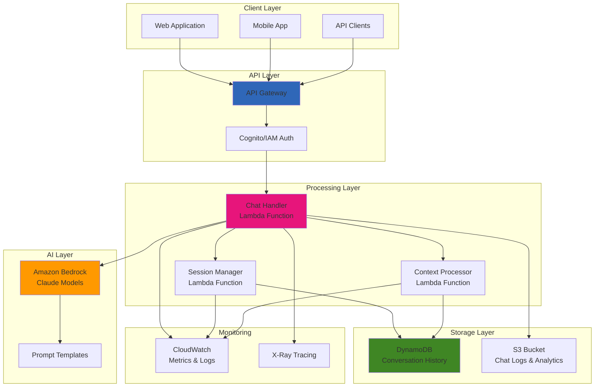

# Conversational AI Applications with Bedrock

## Problem

Your organization needs to build intelligent conversational AI applications that can understand natural language, maintain context across conversations, and provide accurate responses to user queries. Traditional chatbot solutions require extensive machine learning expertise, model training, and infrastructure management. You need a solution that leverages state-of-the-art language models without the complexity of model deployment, provides conversation memory, handles multiple concurrent users, and can be easily integrated into existing applications through APIs.

## Solution

Implement a scalable conversational AI application using Amazon Bedrock's Claude models for natural language processing, DynamoDB for conversation state management, and Lambda functions for business logic orchestration. This architecture provides access to Anthropic's Claude models through a managed service, eliminating the need for model hosting and maintenance. The solution includes conversation memory, user session management, and a RESTful API interface that can be integrated into web applications, mobile apps, or other systems. The serverless design automatically scales with usage and provides cost-effective operation.

## Architecture Diagram



## Prerequisites

1. AWS account with permissions to use Amazon Bedrock, Lambda, API Gateway, and DynamoDB
2. AWS CLI v2 installed and configured with appropriate credentials
3. Access to Amazon Bedrock Claude models (requires model access request)
4. Python 3.9+ for Lambda function development
5. Basic understanding of conversational AI concepts and REST APIs
6. Estimated cost: Bedrock (~$0.008/1K input tokens, ~$0.024/1K output tokens), Lambda (~$0.20/million requests), DynamoDB (~$0.25/million requests)

> **Note**: You must request access to Bedrock models through the AWS console before using them. This process may take a few minutes to hours depending on the model. See [Amazon Bedrock Model Access](https://docs.aws.amazon.com/bedrock/latest/userguide/model-access.html) for detailed instructions.

## Preparation

```bash
# Set environment variables for the deployment
export AWS_REGION=$(aws configure get region)
export AWS_ACCOUNT_ID=$(aws sts get-caller-identity \
    --query Account --output text)

# Generate unique identifiers to avoid naming conflicts
RANDOM_SUFFIX=$(aws secretsmanager get-random-password \
    --exclude-punctuation --exclude-uppercase \
    --password-length 6 --require-each-included-type \
    --output text --query RandomPassword)

export TABLE_NAME="conversational-ai-${RANDOM_SUFFIX}"
export API_NAME="conversational-ai-api-${RANDOM_SUFFIX}"
export LAMBDA_FUNCTION_NAME="conversational-ai-handler-${RANDOM_SUFFIX}"

# Check Bedrock model availability and access
echo "Checking Bedrock model access..."
aws bedrock list-foundation-models \
    --query 'modelSummaries[?contains(modelId, `claude`)].{ModelId:modelId,ModelName:modelName}' \
    --output table

echo "✅ Environment variables configured"
```

## Steps

1. **Request access to Bedrock Claude models**:

   Amazon Bedrock requires explicit access requests for each foundation model to ensure responsible AI usage and compliance with model providers' terms. This gating mechanism helps prevent misuse and ensures users understand the capabilities and limitations of each model.

   ```bash
   # Note: Model access must be requested through the AWS Console
   echo "⚠️  IMPORTANT: Request Bedrock model access through AWS Console"
   echo "1. Go to AWS Console > Amazon Bedrock > Model access"
   echo "2. Request access to Claude models (Claude 3 Haiku, Sonnet, or Opus)"
   echo "3. Wait for approval (usually takes a few minutes)"
   echo ""
   echo "Continue with next steps after model access is granted..."
   
   # Test model access and identify available Claude model
   echo "Testing Bedrock access..."
   aws bedrock list-foundation-models \
       --query 'modelSummaries[?contains(modelId, `claude-3`)].modelId' \
       --output text | head -1 > /tmp/claude_model_id.txt
   
   if [ -s /tmp/claude_model_id.txt ]; then
       export CLAUDE_MODEL_ID=$(cat /tmp/claude_model_id.txt)
       echo "✅ Found Claude model: ${CLAUDE_MODEL_ID}"
   else
       echo "❌ No Claude models available. Please request access first."
       exit 1
   fi
   ```

2. **Create DynamoDB table for conversation storage**:

   DynamoDB provides fast, scalable storage for conversation history with the ability to query conversations by session ID and maintain chronological order through timestamp sorting.

   ```bash
   # Create DynamoDB table with composite key for efficient querying
   aws dynamodb create-table \
       --table-name ${TABLE_NAME} \
       --attribute-definitions \
           AttributeName=session_id,AttributeType=S \
           AttributeName=timestamp,AttributeType=N \
       --key-schema \
           AttributeName=session_id,KeyType=HASH \
           AttributeName=timestamp,KeyType=RANGE \
       --billing-mode PAY_PER_REQUEST \
       --stream-specification StreamEnabled=false
   
   # Wait for table to be ready for use
   aws dynamodb wait table-exists --table-name ${TABLE_NAME}
   
   echo "✅ Created DynamoDB table for conversation storage"
   echo "ℹ️  Table uses session_id as partition key and timestamp as sort key"
   ```

3. **Create IAM role for Lambda functions**:

   The Lambda function needs specific permissions to access Bedrock for AI inference, DynamoDB for conversation storage, and CloudWatch for logging and monitoring. IAM roles provide temporary, secure access to AWS services without requiring long-term credentials in your code. This approach follows the principle of least privilege, granting only the minimum permissions required for the function to operate successfully.

   ```bash
   # Create trust policy that allows Lambda service to assume this role
   cat > lambda-trust-policy.json << 'EOF'
   {
     "Version": "2012-10-17",
     "Statement": [
       {
         "Effect": "Allow",
         "Principal": {
           "Service": "lambda.amazonaws.com"
         },
         "Action": "sts:AssumeRole"
       }
     ]
   }
   EOF
   
   # Create IAM role with the trust policy
   aws iam create-role \
       --role-name ConversationalAILambdaRole \
       --assume-role-policy-document file://lambda-trust-policy.json
   
   echo "✅ Created IAM role for Lambda functions"
   ```

   The IAM role now exists but requires specific permissions policies to access AWS services. The trust policy allows the Lambda service to assume this role, but we need to attach policies that define what actions the role can perform. This separation of trust policy and permissions policies provides fine-grained access control.

   ```bash
   # Create custom policy with minimal required permissions
   cat > bedrock-dynamodb-policy.json << EOF
   {
     "Version": "2012-10-17",
     "Statement": [
       {
         "Effect": "Allow",
         "Action": [
           "bedrock:InvokeModel",
           "bedrock:InvokeModelWithResponseStream"
         ],
         "Resource": "*"
       },
       {
         "Effect": "Allow",
         "Action": [
           "dynamodb:GetItem",
           "dynamodb:PutItem",
           "dynamodb:Query",
           "dynamodb:UpdateItem",
           "dynamodb:DeleteItem"
         ],
         "Resource": "arn:aws:dynamodb:${AWS_REGION}:${AWS_ACCOUNT_ID}:table/${TABLE_NAME}"
       },
       {
         "Effect": "Allow",
         "Action": [
           "logs:CreateLogGroup",
           "logs:CreateLogStream",
           "logs:PutLogEvents"
         ],
         "Resource": "*"
       },
       {
         "Effect": "Allow",
         "Action": [
           "xray:PutTraceSegments",
           "xray:PutTelemetryRecords"
         ],
         "Resource": "*"
       }
     ]
   }
   EOF
   
   # Attach the custom policy and AWS managed policy to the role
   aws iam put-role-policy \
       --role-name ConversationalAILambdaRole \
       --policy-name BedrockDynamoDBPolicy \
       --policy-document file://bedrock-dynamodb-policy.json
   
   aws iam attach-role-policy \
       --role-name ConversationalAILambdaRole \
       --policy-arn arn:aws:iam::aws:policy/service-role/AWSLambdaBasicExecutionRole
   
   # Get the role ARN for later use
   LAMBDA_ROLE_ARN=$(aws iam get-role \
       --role-name ConversationalAILambdaRole \
       --query 'Role.Arn' --output text)
   
   echo "✅ Configured IAM permissions for Bedrock and DynamoDB access"
   ```

   The Lambda function now has secure access to the required AWS services. The custom policy grants specific permissions to invoke Bedrock models and interact with DynamoDB, while the AWS managed policy provides basic Lambda execution capabilities like logging. This configuration ensures the function can perform its AI processing tasks while maintaining security best practices. Reference the [IAM best practices documentation](https://docs.aws.amazon.com/IAM/latest/UserGuide/best-practices.html) for additional security considerations.

4. **Create the main conversational AI Lambda function**:

   This Lambda function orchestrates the conversational AI workflow: retrieving conversation history, calling the Claude model through Bedrock, and storing the conversation for future context. Lambda functions provide serverless compute that automatically scales with demand, making them ideal for AI applications with variable workloads. The function handles the complete conversation lifecycle, from parsing incoming requests to managing AI model interactions and persisting conversation state for context continuity.

   ```bash
   # Create comprehensive Lambda function for conversational AI
   cat > conversational_ai_handler.py << EOF
   import json
   import boto3
   import uuid
   import time
   from datetime import datetime
   import logging
   
   # Configure logging
   logger = logging.getLogger()
   logger.setLevel(logging.INFO)
   
   # Initialize AWS clients
   bedrock_runtime = boto3.client('bedrock-runtime')
   dynamodb = boto3.resource('dynamodb')
   table = dynamodb.Table('${TABLE_NAME}')
   
   # Claude model configuration
   CLAUDE_MODEL_ID = '${CLAUDE_MODEL_ID}'
   MAX_TOKENS = 1000
   TEMPERATURE = 0.7
   
   def lambda_handler(event, context):
       """Main handler for conversational AI requests"""
       
       try:
           # Parse request body from API Gateway
           body = json.loads(event.get('body', '{}'))
           user_message = body.get('message', '')
           session_id = body.get('session_id', str(uuid.uuid4()))
           user_id = body.get('user_id', 'anonymous')
           
           if not user_message:
               return {
                   'statusCode': 400,
                   'headers': {'Content-Type': 'application/json'},
                   'body': json.dumps({'error': 'Message is required'})
               }
           
           # Get conversation history for context
           conversation_history = get_conversation_history(session_id)
           
           # Build prompt with conversation context
           prompt = build_prompt_with_context(user_message, conversation_history)
           
           # Call Bedrock Claude model for AI response
           response = invoke_claude_model(prompt)
           
           # Save this conversation turn to DynamoDB
           save_conversation_turn(session_id, user_id, user_message, response)
           
           # Return successful response
           return {
               'statusCode': 200,
               'headers': {
                   'Content-Type': 'application/json',
                   'Access-Control-Allow-Origin': '*',
                   'Access-Control-Allow-Methods': 'POST, OPTIONS',
                   'Access-Control-Allow-Headers': 'Content-Type'
               },
               'body': json.dumps({
                   'response': response,
                   'session_id': session_id,
                   'timestamp': datetime.utcnow().isoformat()
               })
           }
           
       except Exception as e:
           logger.error(f"Error processing request: {str(e)}")
           return {
               'statusCode': 500,
               'headers': {'Content-Type': 'application/json'},
               'body': json.dumps({'error': 'Internal server error'})
           }
   
   def get_conversation_history(session_id, limit=10):
       """Retrieve recent conversation history for context"""
       
       try:
           response = table.query(
               KeyConditionExpression='session_id = :session_id',
               ExpressionAttributeValues={':session_id': session_id},
               ScanIndexForward=False,  # Most recent first
               Limit=limit * 2  # Get both user and assistant messages
           )
           
           # Format conversation history
           history = []
           for item in reversed(response['Items']):
               history.append({
                   'role': item['role'],
                   'content': item['content']
               })
           
           return history[-limit:] if len(history) > limit else history
           
       except Exception as e:
           logger.error(f"Error retrieving conversation history: {str(e)}")
           return []
   
   def build_prompt_with_context(user_message, conversation_history):
       """Build Claude prompt with conversation context"""
       
       # System prompt defines the AI's behavior and personality
       system_prompt = """You are a helpful AI assistant. You provide accurate, helpful, and engaging responses to user questions. You maintain context from previous messages in the conversation and provide personalized assistance."""
       
       # Build conversation context
       messages = [{"role": "system", "content": system_prompt}]
       
       # Add conversation history for context
       for turn in conversation_history:
           messages.append({
               "role": turn['role'],
               "content": turn['content']
           })
       
       # Add current user message
       messages.append({
           "role": "user",
           "content": user_message
       })
       
       return messages
   
   def invoke_claude_model(messages):
       """Invoke Claude model through Bedrock"""
       
       try:
           # Prepare request body for Claude API format
           request_body = {
               "anthropic_version": "bedrock-2023-05-31",
               "max_tokens": MAX_TOKENS,
               "temperature": TEMPERATURE,
               "messages": messages[1:]  # Exclude system message for Claude format
           }
           
           # Add system message if present
           if messages[0]["role"] == "system":
               request_body["system"] = messages[0]["content"]
           
           # Invoke model through Bedrock Runtime
           response = bedrock_runtime.invoke_model(
               modelId=CLAUDE_MODEL_ID,
               body=json.dumps(request_body),
               contentType='application/json'
           )
           
           # Parse response
           response_body = json.loads(response['body'].read())
           
           # Extract text from Claude response
           if 'content' in response_body and len(response_body['content']) > 0:
               return response_body['content'][0]['text']
           else:
               return "I apologize, but I couldn't generate a response. Please try again."
               
       except Exception as e:
           logger.error(f"Error invoking Claude model: {str(e)}")
           return "I'm experiencing technical difficulties. Please try again later."
   
   def save_conversation_turn(session_id, user_id, user_message, assistant_response):
       """Save conversation turn to DynamoDB"""
       
       try:
           timestamp = int(time.time() * 1000)  # Milliseconds for better sorting
           
           # Save user message
           table.put_item(
               Item={
                   'session_id': session_id,
                   'timestamp': timestamp,
                   'role': 'user',
                   'content': user_message,
                   'user_id': user_id,
                   'created_at': datetime.utcnow().isoformat()
               }
           )
           
           # Save assistant response
           table.put_item(
               Item={
                   'session_id': session_id,
                   'timestamp': timestamp + 1,  # Ensure assistant response comes after user message
                   'role': 'assistant',
                   'content': assistant_response,
                   'user_id': user_id,
                   'created_at': datetime.utcnow().isoformat()
               }
           )
           
           logger.info(f"Saved conversation turn for session {session_id}")
           
       except Exception as e:
           logger.error(f"Error saving conversation: {str(e)}")
   EOF
   
   # Create deployment package
   zip conversational_ai_handler.zip conversational_ai_handler.py
   
   echo "✅ Created Lambda function code with conversation management"
   ```

   > **Warning**: Be mindful of Bedrock token limits and costs. The MAX_TOKENS setting controls response length, and TEMPERATURE affects creativity. Adjust these parameters based on your use case and budget considerations. Monitor usage through [Amazon Bedrock pricing](https://aws.amazon.com/bedrock/pricing/) and implement rate limiting for production applications.

   ```bash
   # Deploy Lambda function with appropriate configuration
   LAMBDA_FUNCTION_ARN=$(aws lambda create-function \
       --function-name ${LAMBDA_FUNCTION_NAME} \
       --runtime python3.9 \
       --role ${LAMBDA_ROLE_ARN} \
       --handler conversational_ai_handler.lambda_handler \
       --zip-file fileb://conversational_ai_handler.zip \
       --timeout 30 \
       --memory-size 512 \
       --environment Variables="{TABLE_NAME=${TABLE_NAME},CLAUDE_MODEL_ID=${CLAUDE_MODEL_ID}}" \
       --tracing-config Mode=Active \
       --query 'FunctionArn' --output text)
   
   echo "✅ Deployed conversational AI Lambda function"
   echo "Function ARN: ${LAMBDA_FUNCTION_ARN}"
   ```

5. **Create API Gateway for REST API access**:

   API Gateway provides a managed HTTP API that handles authentication, CORS, request routing, and integrates seamlessly with Lambda functions for serverless architectures. This service acts as the front door for your conversational AI application, managing HTTP requests, implementing security controls, and providing features like rate limiting and request/response transformation. The gateway creates a scalable, secure entry point that can handle thousands of concurrent connections to your AI backend.

   ```bash
   # Create REST API with regional endpoint configuration
   API_ID=$(aws apigateway create-rest-api \
       --name ${API_NAME} \
       --description "Conversational AI API using Bedrock Claude" \
       --endpoint-configuration types=REGIONAL \
       --query 'id' --output text)
   
   # Get root resource ID for creating sub-resources
   ROOT_RESOURCE_ID=$(aws apigateway get-resources \
       --rest-api-id ${API_ID} \
       --query 'items[0].id' --output text)
   
   # Create /chat resource for conversational endpoints
   CHAT_RESOURCE_ID=$(aws apigateway create-resource \
       --rest-api-id ${API_ID} \
       --parent-id ${ROOT_RESOURCE_ID} \
       --path-part chat \
       --query 'id' --output text)
   
   echo "✅ Created API Gateway REST API structure"
   ```

   ```bash
   # Create POST method for chat functionality
   aws apigateway put-method \
       --rest-api-id ${API_ID} \
       --resource-id ${CHAT_RESOURCE_ID} \
       --http-method POST \
       --authorization-type NONE
   
   # Create OPTIONS method for CORS preflight requests
   aws apigateway put-method \
       --rest-api-id ${API_ID} \
       --resource-id ${CHAT_RESOURCE_ID} \
       --http-method OPTIONS \
       --authorization-type NONE
   
   # Set up Lambda proxy integration for POST method
   aws apigateway put-integration \
       --rest-api-id ${API_ID} \
       --resource-id ${CHAT_RESOURCE_ID} \
       --http-method POST \
       --type AWS_PROXY \
       --integration-http-method POST \
       --uri "arn:aws:apigateway:${AWS_REGION}:lambda:path/2015-03-31/functions/${LAMBDA_FUNCTION_ARN}/invocations"
   
   # Set up CORS integration for OPTIONS method
   aws apigateway put-integration \
       --rest-api-id ${API_ID} \
       --resource-id ${CHAT_RESOURCE_ID} \
       --http-method OPTIONS \
       --type MOCK \
       --request-templates '{"application/json": "{\"statusCode\":200}"}'
   
   echo "✅ Configured API Gateway methods and Lambda integration"
   ```

   The API Gateway now has HTTP methods configured for conversational AI interactions. The POST method handles chat requests using Lambda proxy integration, which automatically forwards all request details to your Lambda function. The OPTIONS method enables CORS preflight requests, allowing web browsers to make cross-origin requests to your API. This configuration follows REST API best practices and provides a foundation for web and mobile application integration. Learn more about [Lambda proxy integration](https://docs.aws.amazon.com/apigateway/latest/developerguide/set-up-lambda-proxy-integrations.html) for advanced configuration options.

   ```bash
   # Configure method responses for proper API documentation
   aws apigateway put-method-response \
       --rest-api-id ${API_ID} \
       --resource-id ${CHAT_RESOURCE_ID} \
       --http-method POST \
       --status-code 200
   
   aws apigateway put-method-response \
       --rest-api-id ${API_ID} \
       --resource-id ${CHAT_RESOURCE_ID} \
       --http-method OPTIONS \
       --status-code 200 \
       --response-parameters '{
         "method.response.header.Access-Control-Allow-Origin":false,
         "method.response.header.Access-Control-Allow-Methods": false,
         "method.response.header.Access-Control-Allow-Headers": false
       }'
   
   # Set up integration responses with CORS headers
   aws apigateway put-integration-response \
       --rest-api-id ${API_ID} \
       --resource-id ${CHAT_RESOURCE_ID} \
       --http-method POST \
       --status-code 200
   
   aws apigateway put-integration-response \
       --rest-api-id ${API_ID} \
       --resource-id ${CHAT_RESOURCE_ID} \
       --http-method OPTIONS \
       --status-code 200 \
       --response-parameters '{
         "method.response.header.Access-Control-Allow-Origin": "'"'"'*'"'"'",
         "method.response.header.Access-Control-Allow-Methods": "'"'"'POST,OPTIONS'"'"'",
         "method.response.header.Access-Control-Allow-Headers": "'"'"'Content-Type'"'"'"
       }'
   
   echo "✅ Configured API Gateway responses with CORS support"
   ```

6. **Grant API Gateway permission to invoke Lambda**:

   API Gateway needs explicit permission to invoke your Lambda function. This step creates the necessary resource-based policy on the Lambda function.

   ```bash
   # Add permission for API Gateway to invoke Lambda function
   aws lambda add-permission \
       --function-name ${LAMBDA_FUNCTION_NAME} \
       --statement-id apigateway-invoke \
       --action lambda:InvokeFunction \
       --principal apigateway.amazonaws.com \
       --source-arn "arn:aws:execute-api:${AWS_REGION}:${AWS_ACCOUNT_ID}:${API_ID}/*/*"
   
   echo "✅ Granted API Gateway permission to invoke Lambda function"
   ```

7. **Deploy the API**:

   Deploying the API makes it accessible via HTTP endpoints. The staging approach allows you to maintain multiple versions and environments of your API. API Gateway deployments create snapshots of your API configuration, enabling you to manage different versions (development, staging, production) and rollback capabilities. This deployment model supports continuous integration practices and provides the stable endpoints needed for production applications.

   ```bash
   # Create deployment to production stage
   aws apigateway create-deployment \
       --rest-api-id ${API_ID} \
       --stage-name prod \
       --stage-description "Production stage for Conversational AI API"
   
   # Construct the API endpoint URL
   API_ENDPOINT="https://${API_ID}.execute-api.${AWS_REGION}.amazonaws.com/prod"
   
   echo "✅ Deployed API to production stage"
   echo "🌐 API Endpoint: ${API_ENDPOINT}/chat"
   echo "ℹ️  Use this endpoint to send chat requests"
   ```

   Your conversational AI API is now live and accessible via HTTPS. The endpoint URL provided can be used by web applications, mobile apps, or any HTTP client to interact with your Claude-powered AI assistant. The API handles CORS automatically and supports JSON request/response formats, making it easy to integrate into modern applications.

8. **Create a test client script**:

   A test client helps validate the API functionality and provides examples for integrating the conversational AI into other applications. This Python script demonstrates proper API interaction patterns, including session management, error handling, and response processing. The test client serves as both a validation tool and a reference implementation for developers integrating the API into their applications.

   ```bash
   # Create comprehensive test client for the conversational AI API
   cat > test_conversational_ai.py << EOF
   #!/usr/bin/env python3
   import requests
   import json
   import uuid
   
   # Configuration
   API_ENDPOINT = "${API_ENDPOINT}/chat"
   
   def send_message(message, session_id=None, user_id="test_user"):
       """Send a message to the conversational AI API"""
       
       if not session_id:
           session_id = str(uuid.uuid4())
       
       payload = {
           "message": message,
           "session_id": session_id,
           "user_id": user_id
       }
       
       try:
           response = requests.post(
               API_ENDPOINT,
               json=payload,
               headers={"Content-Type": "application/json"},
               timeout=30
           )
           
           if response.status_code == 200:
               return response.json(), session_id
           else:
               print(f"Error: {response.status_code} - {response.text}")
               return None, session_id
               
       except Exception as e:
           print(f"Request failed: {e}")
           return None, session_id
   
   def interactive_chat():
       """Interactive chat session"""
       
       print("🤖 Conversational AI Chat")
       print("Type 'quit' to exit, 'new' to start a new session")
       print("-" * 50)
       
       session_id = str(uuid.uuid4())
       
       while True:
           user_input = input("You: ").strip()
           
           if user_input.lower() == 'quit':
               break
           elif user_input.lower() == 'new':
               session_id = str(uuid.uuid4())
               print("🔄 Started new conversation session")
               continue
           elif not user_input:
               continue
           
           print("🤖 Thinking...")
           
           response, session_id = send_message(user_input, session_id)
           
           if response:
               print(f"AI: {response['response']}")
               print(f"Session: {session_id[:8]}...")
           else:
               print("❌ Failed to get response")
           
           print()
   
   def run_test_conversation():
       """Run automated test conversation"""
       
       print("🧪 Running test conversation...")
       
       test_messages = [
           "Hello! What can you help me with?",
           "Can you explain what machine learning is?",
           "What are some practical applications of AI?",
           "Thank you for the information!"
       ]
       
       session_id = str(uuid.uuid4())
       
       for i, message in enumerate(test_messages, 1):
           print(f"\\n{i}. User: {message}")
           
           response, session_id = send_message(message, session_id)
           
           if response:
               print(f"   AI: {response['response']}")
           else:
               print("   ❌ Failed to get response")
   
   if __name__ == "__main__":
       import sys
       
       if len(sys.argv) > 1 and sys.argv[1] == "test":
           run_test_conversation()
       else:
           interactive_chat()
   EOF
   
   chmod +x test_conversational_ai.py
   
   echo "✅ Created test client script"
   echo "ℹ️  Run 'python3 test_conversational_ai.py test' for automated testing"
   echo "ℹ️  Run 'python3 test_conversational_ai.py' for interactive chat"
   ```

## Validation & Testing

1. **Test the API with automated conversation**:

   ```bash
   # Install required Python package for HTTP requests
   pip3 install requests
   
   # Run automated test conversation
   python3 test_conversational_ai.py test
   
   echo "✅ Completed automated test conversation"
   ```

   Expected output: Four-message conversation showing AI responses to greetings, technical questions, and follow-ups.

2. **Test conversation memory and context**:

   ```bash
   # Create context test script to verify memory functionality
   cat > test_context.py << EOF
   import requests
   import json
   import uuid
   
   API_ENDPOINT = "${API_ENDPOINT}/chat"
   
   def test_conversation_memory():
       """Test that the AI remembers context within a session"""
       
       session_id = str(uuid.uuid4())
       
       # First message - establish context
       response1 = requests.post(API_ENDPOINT, json={
           "message": "My name is Alice and I work as a software engineer.",
           "session_id": session_id,
           "user_id": "alice_test"
       })
       
       print("1. User: My name is Alice and I work as a software engineer.")
       if response1.status_code == 200:
           print(f"   AI: {response1.json()['response']}")
       
       # Second message - test memory
       response2 = requests.post(API_ENDPOINT, json={
           "message": "What is my name and profession?",
           "session_id": session_id,
           "user_id": "alice_test"
       })
       
       print("\\n2. User: What is my name and profession?")
       if response2.status_code == 200:
           print(f"   AI: {response2.json()['response']}")
           
           # Check if AI remembered the context
           response_text = response2.json()['response'].lower()
           if 'alice' in response_text and ('software' in response_text or 'engineer' in response_text):
               print("✅ Context memory test PASSED")
           else:
               print("❌ Context memory test FAILED")
       
       # Test new session (should not remember)
       new_session_id = str(uuid.uuid4())
       response3 = requests.post(API_ENDPOINT, json={
           "message": "What is my name?",
           "session_id": new_session_id,
           "user_id": "alice_test"
       })
       
       print("\\n3. User (new session): What is my name?")
       if response3.status_code == 200:
           print(f"   AI: {response3.json()['response']}")
           
           response_text = response3.json()['response'].lower()
           if 'alice' not in response_text:
               print("✅ Session isolation test PASSED")
           else:
               print("❌ Session isolation test FAILED")
   
   if __name__ == "__main__":
       test_conversation_memory()
   EOF
   
   python3 test_context.py
   ```

   Expected output: Successful context memory within session and proper isolation between sessions.

3. **Check DynamoDB conversation storage**:

   ```bash
   # Query recent conversations to verify storage
   echo "Recent conversations in DynamoDB:"
   aws dynamodb scan \
       --table-name ${TABLE_NAME} \
       --max-items 10 \
       --query 'Items[].{SessionId:session_id.S,Role:role.S,Content:content.S,Timestamp:timestamp.N}' \
       --output table
   ```

   Expected output: Table showing stored conversation turns with session IDs, user/assistant roles, and timestamps.

4. **Monitor Lambda function performance**:

   ```bash
   # Check Lambda function invocation metrics
   echo "Lambda function metrics (last 5 minutes):"
   aws cloudwatch get-metric-statistics \
       --namespace AWS/Lambda \
       --metric-name Invocations \
       --dimensions Name=FunctionName,Value=${LAMBDA_FUNCTION_NAME} \
       --start-time $(date -u -d '5 minutes ago' +%Y-%m-%dT%H:%M:%S) \
       --end-time $(date -u +%Y-%m-%dT%H:%M:%S) \
       --period 300 \
       --statistics Sum \
       --query 'Datapoints[0].Sum' --output text
   ```

   Expected output: Number showing recent Lambda invocations, confirming API requests are reaching the function.

## Cleanup

1. **Delete API Gateway and Lambda function**:

   ```bash
   # Delete API Gateway deployment and API
   aws apigateway delete-rest-api --rest-api-id ${API_ID}
   
   # Delete Lambda function
   aws lambda delete-function --function-name ${LAMBDA_FUNCTION_NAME}
   
   echo "✅ Deleted API Gateway and Lambda function"
   ```

2. **Delete DynamoDB table**:

   ```bash
   # Delete DynamoDB table and all stored conversations
   aws dynamodb delete-table --table-name ${TABLE_NAME}
   
   echo "✅ Deleted DynamoDB table"
   ```

3. **Delete IAM role and policies**:

   ```bash
   # Delete custom policy and detach managed policies
   aws iam delete-role-policy \
       --role-name ConversationalAILambdaRole \
       --policy-name BedrockDynamoDBPolicy
   
   aws iam detach-role-policy \
       --role-name ConversationalAILambdaRole \
       --policy-arn arn:aws:iam::aws:policy/service-role/AWSLambdaBasicExecutionRole
   
   # Delete IAM role
   aws iam delete-role --role-name ConversationalAILambdaRole
   
   echo "✅ Deleted IAM resources"
   ```

4. **Clean up local files**:

   ```bash
   # Remove all created files and environment variables
   rm -f conversational_ai_handler.py conversational_ai_handler.zip
   rm -f test_conversational_ai.py test_context.py
   rm -f lambda-trust-policy.json bedrock-dynamodb-policy.json
   rm -f /tmp/claude_model_id.txt
   
   # Clear environment variables
   unset TABLE_NAME API_NAME LAMBDA_FUNCTION_NAME
   unset CLAUDE_MODEL_ID LAMBDA_ROLE_ARN API_ID
   unset LAMBDA_FUNCTION_ARN API_ENDPOINT
   
   echo "✅ Cleaned up local files and environment variables"
   ```

## Discussion

This conversational AI application demonstrates the power of Amazon Bedrock for building sophisticated AI-powered applications without the complexity of model management. By leveraging Claude's advanced language understanding capabilities, the solution provides natural, context-aware conversations that can be easily integrated into existing applications.

The architecture separates concerns effectively: API Gateway handles HTTP requests and CORS, Lambda functions manage business logic and orchestration, DynamoDB provides fast and scalable conversation storage, and Bedrock delivers state-of-the-art AI capabilities. This separation allows for independent scaling and maintenance of each component.

The conversation memory system stores both user messages and AI responses, enabling the system to maintain context across multiple turns in a conversation. The session-based approach allows multiple concurrent users while keeping their conversations isolated. For production deployments, consider implementing user authentication with Amazon Cognito, adding rate limiting to prevent abuse, implementing conversation analytics with Amazon QuickSight, and adding content filtering for safety.

> **Tip**: Experiment with different Claude models (Haiku for speed, Sonnet for balance, Opus for complex reasoning) based on your use case requirements and cost considerations. Reference the [Anthropic Claude models documentation](https://docs.aws.amazon.com/bedrock/latest/userguide/model-parameters-claude.html) for detailed model specifications and capabilities.

## Challenge

Extend this solution by implementing these enhancements:

1. **Add streaming responses** using Bedrock's streaming API and WebSocket connections through API Gateway for real-time conversation experiences
2. **Implement conversation summarization** using Claude to automatically summarize long conversations and maintain context while reducing token usage
3. **Build a web interface** with React or Vue.js that provides a chat UI with conversation history, typing indicators, and message formatting
4. **Add multi-modal capabilities** by integrating with Bedrock's vision models to allow users to upload and discuss images within conversations
5. **Create conversation analytics** with CloudWatch dashboards to track usage patterns, popular topics, user satisfaction, and system performance metrics

## Infrastructure Code

*Infrastructure code will be generated after recipe approval.*