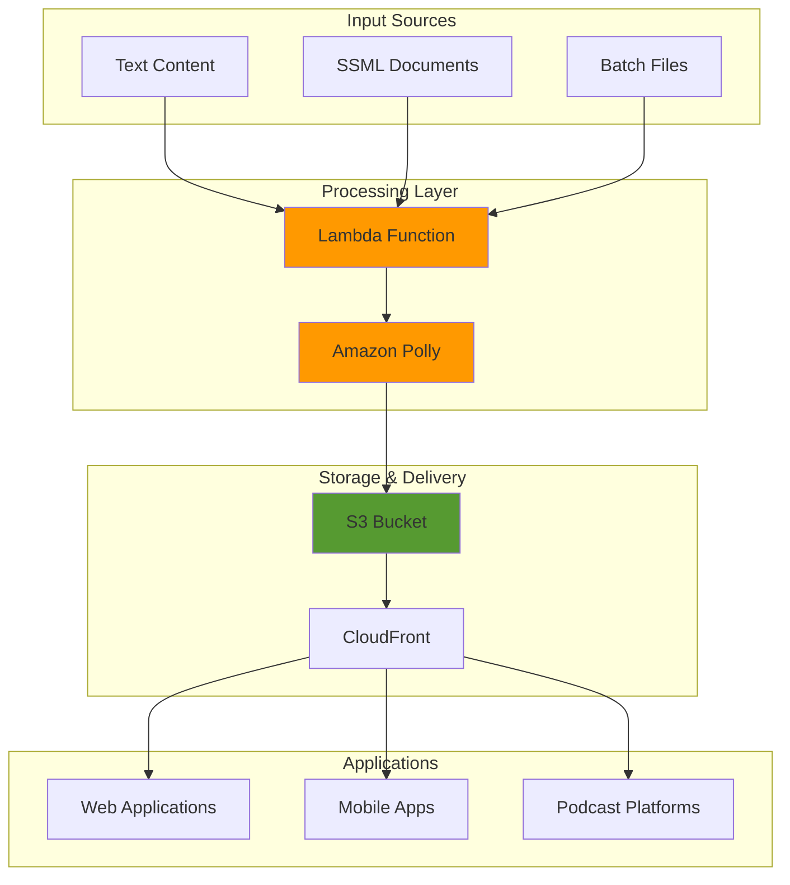

# Converting Text to Speech with Polly

## Problem

Organizations need to make their content accessible to visually impaired users, create audio versions of written content for podcasts and training materials, and provide voice-enabled features in applications. Traditional text-to-speech solutions are expensive, require complex infrastructure, lack natural-sounding voices, and don't scale effectively. Companies struggle to implement consistent, high-quality voice narration across multiple languages and platforms while maintaining cost efficiency.

## Solution

Amazon Polly provides a managed text-to-speech service that converts text into lifelike speech using advanced neural networks. This solution demonstrates how to implement comprehensive text-to-speech capabilities including voice selection, SSML customization, batch processing, and real-time streaming. The architecture leverages neural voices for natural-sounding speech, S3 for audio storage, and Lambda for processing automation.

## Architecture Diagram



## Prerequisites

1. AWS account with appropriate permissions for Polly, S3, Lambda, and IAM
2. AWS CLI v2 installed and configured (or AWS CloudShell)
3. Basic understanding of text-to-speech concepts and SSML
4. Knowledge of audio formats (MP3, OGG, PCM)
5. Estimated cost: $0.10-2.00 per hour for testing (varies by voice type and character count)

> **Note**: Neural voices cost more than standard voices but provide significantly better quality. Long-form and generative voices have higher costs but excel at longer content.

## Preparation

```bash
# Set environment variables
export AWS_REGION=$(aws configure get region)
export AWS_ACCOUNT_ID=$(aws sts get-caller-identity \
    --query Account --output text)

# Generate unique identifiers for resources
RANDOM_SUFFIX=$(aws secretsmanager get-random-password \
    --exclude-punctuation --exclude-uppercase \
    --password-length 6 --require-each-included-type \
    --output text --query RandomPassword)

export BUCKET_NAME="polly-audio-storage-${RANDOM_SUFFIX}"
export LAMBDA_FUNCTION_NAME="polly-batch-processor-${RANDOM_SUFFIX}"
export IAM_ROLE_NAME="PollyProcessorRole-${RANDOM_SUFFIX}"

# Create S3 bucket for audio storage
aws s3 mb s3://${BUCKET_NAME} --region ${AWS_REGION}

# Create IAM role for Lambda function
aws iam create-role \
    --role-name ${IAM_ROLE_NAME} \
    --assume-role-policy-document '{
        "Version": "2012-10-17",
        "Statement": [
            {
                "Effect": "Allow",
                "Principal": {
                    "Service": "lambda.amazonaws.com"
                },
                "Action": "sts:AssumeRole"
            }
        ]
    }'

# Attach necessary policies
aws iam attach-role-policy \
    --role-name ${IAM_ROLE_NAME} \
    --policy-arn arn:aws:iam::aws:policy/service-role/AWSLambdaBasicExecutionRole

aws iam attach-role-policy \
    --role-name ${IAM_ROLE_NAME} \
    --policy-arn arn:aws:iam::aws:policy/AmazonPollyFullAccess

aws iam attach-role-policy \
    --role-name ${IAM_ROLE_NAME} \
    --policy-arn arn:aws:iam::aws:policy/AmazonS3FullAccess

echo "✅ Environment prepared successfully"
```

## Steps

1. **Explore Available Voices and Languages**:

   Understanding Amazon Polly's voice capabilities is crucial for selecting the right voice for your application. Polly offers over 60 voices across multiple languages, with neural voices providing the most natural-sounding speech. The voice selection impacts user experience, accessibility, and brand perception, making this exploration step essential for successful implementation.

   ```bash
   # List all available voices
   aws polly describe-voices \
       --region ${AWS_REGION} \
       --query 'Voices[?Engine==`neural`][VoiceId,Gender,LanguageCode,Engine]' \
       --output table
   
   # Get specific voice details for English US
   aws polly describe-voices \
       --region ${AWS_REGION} \
       --language-code en-US \
       --query 'Voices[?Engine==`neural`]' \
       --output json
   
   echo "✅ Voice catalog retrieved successfully"
   ```

   This voice catalog provides the foundation for all text-to-speech operations. Neural voices like Joanna, Matthew, and Kevin offer superior quality with natural inflections and emotional expression, making them ideal for customer-facing applications and professional content.

2. **Create Basic Text-to-Speech Synthesis**:

   This step demonstrates the core functionality of Amazon Polly by converting text into high-quality audio. The synthesize-speech API is the foundation of all text-to-speech operations, enabling applications to generate spoken content dynamically. This capability transforms static text into engaging audio experiences for accessibility, entertainment, and education.

   ```bash
   # Create sample text file
   cat > sample_text.txt << 'EOF'
   Welcome to Amazon Polly! This is a demonstration of high-quality text-to-speech synthesis using neural voices. Amazon Polly can convert this text into natural-sounding speech in multiple languages and voices.
   EOF
   
   # Synthesize speech using neural voice
   aws polly synthesize-speech \
       --text file://sample_text.txt \
       --output-format mp3 \
       --voice-id Joanna \
       --engine neural \
       --region ${AWS_REGION} \
       basic_speech.mp3
   
   echo "✅ Basic speech synthesis completed"
   ```

   The generated MP3 file demonstrates Polly's neural voice quality, which uses deep learning models to produce speech that closely mimics human conversation patterns. This foundational synthesis capability enables everything from simple announcements to complex narrative content.

3. **Implement SSML for Advanced Voice Control**:

   Speech Synthesis Markup Language (SSML) provides granular control over voice characteristics, enabling professional-quality audio production. SSML allows fine-tuning of speech rate, pitch, volume, emphasis, and pauses, creating more engaging and natural-sounding content. This advanced control is essential for creating branded audio experiences and ensuring proper pronunciation of technical terms.

   ```bash
   # Create SSML document with advanced features
   cat > ssml_example.xml << 'EOF'
   <speak>
   <prosody rate="medium" pitch="medium">
   Welcome to our <emphasis level="strong">premium</emphasis> service.
   </prosody>
   
   <break time="1s"/>
   
   <prosody rate="slow">
   Please note that our phone number is <say-as interpret-as="telephone">+1-555-123-4567</say-as>.
   </prosody>
   
   <break time="500ms"/>
   
   <prosody volume="soft">
   Thank you for choosing our service. Have a wonderful day!
   </prosody>
   </speak>
   EOF
   
   # Synthesize SSML document
   aws polly synthesize-speech \
       --text-type ssml \
       --text file://ssml_example.xml \
       --output-format mp3 \
       --voice-id Joanna \
       --engine neural \
       --region ${AWS_REGION} \
       ssml_speech.mp3
   
   echo "✅ SSML synthesis completed"
   ```

   The SSML-enhanced audio demonstrates professional-quality speech control with appropriate pacing, emphasis, and formatting. This level of control enables applications to deliver consistent brand experiences and ensure critical information like phone numbers is clearly communicated.

   > **Warning**: Always validate SSML syntax before processing, as malformed markup can cause synthesis failures or unexpected audio output.

4. **Create Batch Processing Lambda Function**:

   Serverless batch processing enables scalable text-to-speech conversion without managing infrastructure. AWS Lambda provides automatic scaling, pay-per-use pricing, and seamless integration with other AWS services. This approach handles varying workloads efficiently, from single document processing to high-volume content conversion, making it ideal for enterprise applications.

   ```bash
   # Create Lambda function code
   cat > lambda_function.py << 'EOF'
   import boto3
   import json
   import os
   from urllib.parse import unquote_plus
   
   def lambda_handler(event, context):
       polly = boto3.client('polly')
       s3 = boto3.client('s3')
       
       # Get bucket name from environment
       bucket_name = os.environ['BUCKET_NAME']
       
       try:
           # Handle S3 event or direct invocation
           if 'Records' in event:
               # S3 event trigger
               record = event['Records'][0]
               bucket = record['s3']['bucket']['name']
               key = unquote_plus(record['s3']['object']['key'])
               
               # Read text content from S3
               response = s3.get_object(Bucket=bucket, Key=key)
               text_content = response['Body'].read().decode('utf-8')
           else:
               # Direct invocation
               text_content = event.get('text', 'Hello from Amazon Polly!')
           
           # Synthesize speech
           response = polly.synthesize_speech(
               Text=text_content,
               OutputFormat='mp3',
               VoiceId=event.get('voice_id', 'Joanna'),
               Engine='neural'
           )
           
           # Generate output filename
           output_key = f"audio/{context.aws_request_id}.mp3"
           
           # Save to S3
           s3.put_object(
               Bucket=bucket_name,
               Key=output_key,
               Body=response['AudioStream'].read(),
               ContentType='audio/mpeg'
           )
           
           return {
               'statusCode': 200,
               'body': json.dumps({
                   'message': 'Speech synthesis completed',
                   'audio_url': f"s3://{bucket_name}/{output_key}",
                   'characters_processed': len(text_content)
               })
           }
           
       except Exception as e:
           return {
               'statusCode': 500,
               'body': json.dumps({
                   'error': str(e)
               })
           }
   EOF
   
   # Create deployment package
   zip lambda_function.zip lambda_function.py
   
   # Create Lambda function
   aws lambda create-function \
       --function-name ${LAMBDA_FUNCTION_NAME} \
       --runtime python3.12 \
       --role arn:aws:iam::${AWS_ACCOUNT_ID}:role/${IAM_ROLE_NAME} \
       --handler lambda_function.lambda_handler \
       --zip-file fileb://lambda_function.zip \
       --environment Variables="{BUCKET_NAME=${BUCKET_NAME}}" \
       --timeout 60 \
       --region ${AWS_REGION}
   
   echo "✅ Lambda function created successfully"
   ```

   The Lambda function now provides automated speech synthesis with intelligent event handling, supporting both S3-triggered and direct invocation patterns. This serverless architecture eliminates infrastructure management while providing automatic scaling and cost optimization for text-to-speech workloads.

5. **Configure Voice Selection and Customization**:

   Voice selection significantly impacts user experience and brand perception. Different voices convey distinct personalities and emotional tones, making voice testing essential for applications requiring specific audience engagement. Neural voices provide nuanced expression and emotional depth, enabling applications to match voice characteristics with content type and target demographics.

   ```bash
   # Create voice comparison samples
   VOICES=("Joanna" "Matthew" "Ivy" "Kevin")
   SAMPLE_TEXT="This is a voice comparison test. Each voice has its own unique characteristics and tone."
   
   for voice in "${VOICES[@]}"; do
       aws polly synthesize-speech \
           --text "${SAMPLE_TEXT}" \
           --output-format mp3 \
           --voice-id ${voice} \
           --engine neural \
           --region ${AWS_REGION} \
           voice_${voice}.mp3
       
       # Upload to S3 for comparison
       aws s3 cp voice_${voice}.mp3 s3://${BUCKET_NAME}/voice-samples/
   done
   
   echo "✅ Voice samples created and uploaded"
   ```

   These voice samples enable A/B testing and stakeholder review, ensuring optimal voice selection for your specific use case. The organized S3 storage facilitates easy sharing and comparison across teams, supporting data-driven voice selection decisions.

6. **Implement Streaming Text-to-Speech**:

   Real-time audio streaming enables immediate playback of synthesized speech, crucial for interactive applications and conversational interfaces. This approach minimizes latency between text input and audio output, providing seamless user experiences in chatbots, voice assistants, and accessibility tools.

   ```bash
   # Create streaming synthesis example
   cat > streaming_example.py << 'EOF'
   import boto3
   import json
   import io
   
   def stream_polly_audio(text, voice_id='Joanna'):
       polly = boto3.client('polly')
       
       # Synthesize speech
       response = polly.synthesize_speech(
           Text=text,
           OutputFormat='mp3',
           VoiceId=voice_id,
           Engine='neural'
       )
       
       # Get audio stream
       audio_stream = response['AudioStream']
       
       # Save to temporary file for playback
       with open('temp_audio.mp3', 'wb') as f:
           f.write(audio_stream.read())
       
       return 'temp_audio.mp3'
   
   # Example usage
   if __name__ == "__main__":
       text = "This is a streaming text-to-speech example using Amazon Polly."
       audio_file = stream_polly_audio(text)
       print(f"Audio saved to: {audio_file}")
   EOF
   
   echo "✅ Streaming example created"
   ```

   This streaming implementation provides the foundation for real-time audio applications, enabling developers to integrate immediate speech synthesis into their applications with minimal development overhead.

7. **Set Up Long-Form Content Processing**:

   Long-form content requires specialized voice engines optimized for extended listening experiences. Amazon Polly's long-form engine provides enhanced prosody, natural breathing patterns, and improved sentence flow for content exceeding several paragraphs. This capability is essential for audiobooks, training materials, and podcast generation where listener engagement over extended periods is crucial.

   ```bash
   # Create long-form content sample
   cat > long_content.txt << 'EOF'
   Welcome to our comprehensive guide on sustainable business practices. In today's rapidly evolving marketplace, organizations must balance profitability with environmental responsibility. This presentation will explore innovative strategies that successful companies have implemented to reduce their carbon footprint while maintaining competitive advantages.
   
   Our first topic covers renewable energy adoption in corporate environments. Many Fortune 500 companies have successfully transitioned to solar and wind power, resulting in significant cost savings and improved public perception. The initial investment in renewable infrastructure typically pays for itself within five to seven years through reduced energy costs.
   
   The second area we'll examine is supply chain optimization. By implementing data-driven logistics solutions and partnering with environmentally conscious suppliers, companies can reduce transportation costs while minimizing environmental impact. This approach often leads to improved efficiency and stronger supplier relationships.
   EOF
   
   # Process long-form content with appropriate voice
   aws polly start-speech-synthesis-task \
       --text file://long_content.txt \
       --output-format mp3 \
       --voice-id Joanna \
       --engine long-form \
       --output-s3-bucket-name ${BUCKET_NAME} \
       --output-s3-key-prefix "long-form/" \
       --region ${AWS_REGION}
   
   echo "✅ Long-form synthesis task started"
   ```

   The asynchronous task processing enables handling of extensive content without timeout limitations. This approach is particularly valuable for enterprise content conversion where documents may contain thousands of words requiring professional-quality narration.

8. **Test Batch Processing with Lambda**:

   ```bash
   # Test Lambda function with sample text
   aws lambda invoke \
       --function-name ${LAMBDA_FUNCTION_NAME} \
       --payload '{"text": "This is a test of the batch processing system. Amazon Polly is converting this text to speech automatically.", "voice_id": "Matthew"}' \
       --region ${AWS_REGION} \
       lambda_response.json
   
   # Display response
   cat lambda_response.json
   
   echo "✅ Batch processing test completed"
   ```

9. **Create Pronunciation Lexicon**:

   Custom pronunciation lexicons ensure consistent and accurate pronunciation of technical terms, brand names, and domain-specific vocabulary. This capability is crucial for professional applications where mispronunciation could damage credibility or confuse users. Organizations can standardize pronunciation across all audio content, maintaining brand consistency and technical accuracy.

   ```bash
   # Create custom pronunciation lexicon
   cat > custom_lexicon.xml << 'EOF'
   <?xml version="1.0" encoding="UTF-8"?>
   <lexicon version="1.0" xmlns="http://www.w3.org/2005/01/pronunciation-lexicon" 
            xmlns:xsi="http://www.w3.org/2001/XMLSchema-instance"
            xsi:schemaLocation="http://www.w3.org/2005/01/pronunciation-lexicon 
                                http://www.w3.org/TR/2007/CR-pronunciation-lexicon-20071212/pls.xsd"
            alphabet="ipa" xml:lang="en-US">
       <lexeme>
           <grapheme>AWS</grapheme>
           <phoneme>eɪ dʌbljuː ɛs</phoneme>
       </lexeme>
       <lexeme>
           <grapheme>Polly</grapheme>
           <phoneme>pɑli</phoneme>
       </lexeme>
       <lexeme>
           <grapheme>API</grapheme>
           <phoneme>eɪ piː aɪ</phoneme>
       </lexeme>
   </lexicon>
   EOF
   
   # Upload lexicon to Polly
   aws polly put-lexicon \
       --name CustomPronunciations \
       --content file://custom_lexicon.xml \
       --region ${AWS_REGION}
   
   # Test with custom lexicon
   aws polly synthesize-speech \
       --text "AWS Polly API provides excellent text-to-speech capabilities." \
       --output-format mp3 \
       --voice-id Joanna \
       --engine neural \
       --lexicon-names CustomPronunciations \
       --region ${AWS_REGION} \
       lexicon_test.mp3
   
   echo "✅ Custom lexicon created and tested"
   ```

   The custom lexicon now ensures accurate pronunciation of technical terms, improving audio quality and user comprehension. This standardization is particularly valuable for training materials, customer service applications, and technical documentation where precision is essential.

   > **Tip**: Use the International Phonetic Alphabet (IPA) notation for precise pronunciation control. Consider creating separate lexicons for different content domains to maintain organization and flexibility.

10. **Implement Speech Marks for Synchronization**:

    Speech marks provide precise timing information for synchronizing visual elements with audio playback. This capability enables sophisticated applications including lip-sync animations, real-time captioning, and interactive learning experiences. The metadata includes word-level timing, phoneme information, and sentence boundaries, supporting advanced multimedia applications.

    ```bash
    # Generate speech marks for lip-sync applications
    aws polly synthesize-speech \
        --text "This text will generate speech marks for synchronization purposes." \
        --output-format json \
        --voice-id Joanna \
        --engine neural \
        --speech-mark-types '["sentence", "word", "viseme", "ssml"]' \
        --region ${AWS_REGION} \
        speech_marks.json
    
    # Display speech marks
    head -20 speech_marks.json
    
    echo "✅ Speech marks generated successfully"
    ```

    The generated speech marks enable precise synchronization between audio and visual elements, opening possibilities for interactive educational content, accessible applications, and immersive user experiences that respond to speech timing and pronunciation.

## Validation & Testing

1. **Verify Audio Quality and Voice Selection**:

   ```bash
   # List generated audio files
   ls -la *.mp3
   
   # Check S3 storage
   aws s3 ls s3://${BUCKET_NAME}/ --recursive
   ```

   Expected output: Multiple MP3 files with different voices and processing types

2. **Test Lambda Function Performance**:

   ```bash
   # Check Lambda function logs
   aws logs describe-log-groups \
       --log-group-name-prefix "/aws/lambda/${LAMBDA_FUNCTION_NAME}" \
       --region ${AWS_REGION}
   
   # Get recent execution metrics
   aws lambda get-function \
       --function-name ${LAMBDA_FUNCTION_NAME} \
       --region ${AWS_REGION} \
       --query 'Configuration.[FunctionName,Runtime,Timeout,MemorySize]'
   ```

3. **Validate SSML Processing**:

   ```bash
   # Test SSML parsing
   aws polly synthesize-speech \
       --text-type ssml \
       --text '<speak>Testing <break time="500ms"/> SSML parsing</speak>' \
       --output-format mp3 \
       --voice-id Joanna \
       --engine neural \
       --region ${AWS_REGION} \
       ssml_validation.mp3
   
   echo "✅ SSML validation completed"
   ```

4. **Check Long-Form Processing Status**:

   ```bash
   # List speech synthesis tasks
   aws polly list-speech-synthesis-tasks \
       --region ${AWS_REGION} \
       --query 'SynthesisTasks[0].[TaskStatus,CreationTime,OutputUri]'
   ```

## Cleanup

1. **Remove Lambda function and related resources**:

   ```bash
   # Delete Lambda function
   aws lambda delete-function \
       --function-name ${LAMBDA_FUNCTION_NAME} \
       --region ${AWS_REGION}
   
   echo "✅ Lambda function deleted"
   ```

2. **Clean up IAM resources**:

   ```bash
   # Detach policies from role
   aws iam detach-role-policy \
       --role-name ${IAM_ROLE_NAME} \
       --policy-arn arn:aws:iam::aws:policy/service-role/AWSLambdaBasicExecutionRole
   
   aws iam detach-role-policy \
       --role-name ${IAM_ROLE_NAME} \
       --policy-arn arn:aws:iam::aws:policy/AmazonPollyFullAccess
   
   aws iam detach-role-policy \
       --role-name ${IAM_ROLE_NAME} \
       --policy-arn arn:aws:iam::aws:policy/AmazonS3FullAccess
   
   # Delete IAM role
   aws iam delete-role --role-name ${IAM_ROLE_NAME}
   
   echo "✅ IAM resources cleaned up"
   ```

3. **Remove S3 bucket and contents**:

   ```bash
   # Delete all objects in bucket
   aws s3 rm s3://${BUCKET_NAME} --recursive
   
   # Delete bucket
   aws s3 rb s3://${BUCKET_NAME}
   
   echo "✅ S3 resources deleted"
   ```

4. **Delete Polly lexicon**:

   ```bash
   # Remove custom lexicon
   aws polly delete-lexicon \
       --name CustomPronunciations \
       --region ${AWS_REGION}
   
   echo "✅ Custom lexicon deleted"
   ```

5. **Clean up local files**:

   ```bash
   # Remove generated files
   rm -f *.mp3 *.json *.txt *.xml *.py *.zip
   
   # Clear environment variables
   unset BUCKET_NAME LAMBDA_FUNCTION_NAME IAM_ROLE_NAME
   
   echo "✅ Local cleanup completed"
   ```

## Discussion

Amazon Polly revolutionizes text-to-speech applications by providing high-quality, natural-sounding voices through advanced neural network technology. The service offers multiple voice engines including standard, neural, long-form, and generative voices, each optimized for different use cases. Neural voices provide the most natural-sounding speech for general applications, while long-form voices excel at longer content like audiobooks and training materials. The generative voices offer the most human-like and emotionally expressive speech for conversational applications, following the [AWS Well-Architected Framework](https://docs.aws.amazon.com/wellarchitected/latest/framework/welcome.html) principles for performance and cost optimization.

The SSML (Speech Synthesis Markup Language) capabilities enable fine-grained control over speech characteristics including pronunciation, emphasis, pauses, and speaking rate. This level of control makes it possible to create professional-quality audio content that rivals human narration. The custom lexicon feature allows organizations to define specific pronunciations for technical terms, brand names, and domain-specific vocabulary, ensuring consistent and accurate speech output across all applications.

The integration with other AWS services creates powerful automation possibilities. Lambda functions can process text content from various sources, apply appropriate voice settings, and store the resulting audio files in S3 for distribution. This serverless approach scales automatically and only charges for actual usage, making it cost-effective for both small applications and enterprise-scale deployments. The speech marks feature enables sophisticated applications like lip-sync animations and real-time visual feedback during speech playback, as detailed in the [Amazon Polly documentation](https://docs.aws.amazon.com/polly/latest/dg/speechmarks.html).

> **Tip**: Use neural voices for customer-facing applications and long-form voices for content longer than a few paragraphs. Consider implementing caching strategies to avoid re-synthesizing the same content multiple times, following [AWS cost optimization best practices](https://docs.aws.amazon.com/wellarchitected/latest/cost-optimization-pillar/welcome.html).

## Challenge

Extend this solution by implementing these enhancements:

1. **Multi-Language Content Detection**: Build a system that automatically detects text language and selects appropriate voices, handling mixed-language content seamlessly using Amazon Comprehend for language detection.

2. **Real-Time Voice Cloning**: Implement voice cloning capabilities using Amazon Polly's generative voices to create custom brand voices for consistent audio branding across all customer touchpoints.

3. **Interactive Voice Response (IVR) System**: Create a complete IVR system that combines Polly with Amazon Lex for natural language understanding and dynamic speech generation in customer service applications.

4. **Podcast Generation Pipeline**: Build an automated pipeline that converts blog posts or articles into podcast episodes with intro/outro music, chapter markers, and RSS feed generation using Step Functions for orchestration.

5. **Accessibility Integration**: Develop a web browser extension that automatically converts web page content to speech with customizable voice settings and reading speed controls for visually impaired users.

## Infrastructure Code

### Available Infrastructure as Code:

- [Infrastructure Code Overview](code/README.md) - Detailed description of all infrastructure components
- [AWS CDK (Python)](code/cdk-python/) - AWS CDK Python implementation
- [AWS CDK (TypeScript)](code/cdk-typescript/) - AWS CDK TypeScript implementation
- [CloudFormation](code/cloudformation.yaml) - AWS CloudFormation template
- [Bash CLI Scripts](code/scripts/) - Example bash scripts using AWS CLI commands to deploy infrastructure
- [Terraform](code/terraform/) - Terraform configuration files