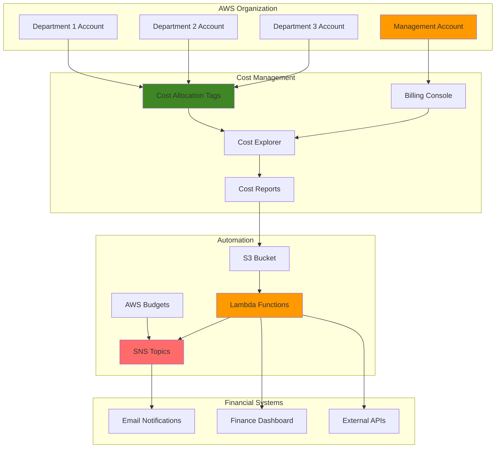

# Cost Allocation and Chargeback Systems


## Problem

Large enterprises with multiple departments, teams, and projects struggle to accurately track and allocate cloud costs to specific business units. Without proper cost allocation mechanisms, finance teams cannot perform accurate chargeback billing, departments lack visibility into their cloud spending, and cost optimization efforts are hindered by unclear cost ownership. This leads to budget overruns, inefficient resource utilization, and difficulty in making data-driven decisions about cloud investments.

## Solution

This recipe implements a comprehensive cost allocation and chargeback system using AWS native billing and cost management tools. The solution establishes a structured tagging strategy, creates automated cost reports, implements budget alerts, and provides mechanisms for distributing costs to internal departments. The system uses AWS Organizations for consolidated billing, Cost Explorer API for data extraction, and SNS for automated notifications to create a complete financial governance framework.

## Architecture Diagram



## Prerequisites

1. AWS Organizations with consolidated billing enabled
2. Management account access with billing permissions
3. AWS CLI v2 installed and configured (or AWS CloudShell)
4. Member accounts for different departments/cost centers
5. Basic understanding of AWS tagging strategies
6. Estimated cost: $5-20/month for automation resources (Lambda, SNS, S3 storage)

> **Note**: This recipe requires management account access to fully implement cost allocation features. Some features may take 24-48 hours to become available after activation. For detailed guidance on AWS Organizations setup, see the [AWS Organizations User Guide](https://docs.aws.amazon.com/organizations/latest/userguide/orgs_introduction.html).

## Preparation

```bash
# Set environment variables
export AWS_REGION=$(aws configure get region)
export AWS_ACCOUNT_ID=$(aws sts get-caller-identity \
    --query Account --output text)

# Generate unique identifier for resources
RANDOM_SUFFIX=$(aws secretsmanager get-random-password \
    --exclude-punctuation --exclude-uppercase \
    --password-length 6 --require-each-included-type \
    --output text --query RandomPassword 2>/dev/null || \
    echo $(date +%s | tail -c 6))

# Set resource names
export COST_BUCKET_NAME="cost-allocation-reports-${RANDOM_SUFFIX}"
export SNS_TOPIC_NAME="cost-allocation-alerts-${RANDOM_SUFFIX}"
export LAMBDA_FUNCTION_NAME="cost-allocation-processor-${RANDOM_SUFFIX}"

# Create S3 bucket for cost reports
aws s3 mb s3://${COST_BUCKET_NAME} --region ${AWS_REGION}

echo "✅ Environment prepared with bucket: ${COST_BUCKET_NAME}"
```

## Steps

1. **Enable Cost Allocation Tags**:

   Cost allocation tags are fundamental to AWS cost management, enabling organizations to track and allocate costs across departments, projects, and business units. AWS Cost Categories provide a structured way to group costs based on tag values, creating standardized cost centers that persist even when individual resource tags vary. This foundational step establishes the framework for all subsequent cost allocation activities.

   ```bash
   # Create standardized cost allocation tags
   aws ce create-cost-category-definition \
       --name "CostCenter" \
       --rules '[
           {
               "Value": "Engineering",
               "Rule": {
                   "Tags": {
                       "Key": "Department",
                       "Values": ["Engineering", "Development", "DevOps"]
                   }
               }
           },
           {
               "Value": "Marketing",
               "Rule": {
                   "Tags": {
                       "Key": "Department",
                       "Values": ["Marketing", "Sales", "Customer Success"]
                   }
               }
           },
           {
               "Value": "Operations",
               "Rule": {
                   "Tags": {
                       "Key": "Department",
                       "Values": ["Operations", "Finance", "HR"]
                   }
               }
           }
       ]' \
       --rule-version "CostCategoryExpression.v1"
   
   echo "✅ Cost category definitions created"
   ```

   These cost categories automatically group resources based on department tags, creating consistent cost allocation even when tagging practices vary across teams. The categories will be available in Cost Explorer and other AWS billing tools for reporting and analysis.

2. **Create Cost and Usage Report**:

   Cost and Usage Reports (CUR) provide the most detailed billing data available in AWS. These reports include resource-level information and support custom analysis with tools like Athena and Redshift for sophisticated cost allocation.

   ```bash
   # Create CUR report for detailed billing analysis
   aws cur put-report-definition \
       --report-definition '{
           "ReportName": "cost-allocation-report",
           "TimeUnit": "DAILY",
           "Format": "textORcsv",
           "Compression": "GZIP",
           "AdditionalSchemaElements": [
               "RESOURCES"
           ],
           "S3Bucket": "'${COST_BUCKET_NAME}'",
           "S3Prefix": "cost-reports/",
           "S3Region": "'${AWS_REGION}'",
           "AdditionalArtifacts": [
               "REDSHIFT",
               "ATHENA"
           ],
           "RefreshClosedReports": true,
           "ReportVersioning": "OVERWRITE_REPORT"
       }'
   
   echo "✅ Cost and Usage Report configured"
   ```

   The CUR report includes additional schema elements for resource tracking and generates daily reports with Athena integration for SQL-based analysis. This enables detailed chargeback calculations based on actual resource usage.

3. **Set Up SNS Topic for Notifications**:

   SNS topics enable automated notifications when budget thresholds are exceeded. This proactive alerting helps departments stay within their allocated budgets and take corrective action before costs spiral out of control.

   ```bash
   # Create SNS topic for cost alerts
   SNS_TOPIC_ARN=$(aws sns create-topic \
       --name ${SNS_TOPIC_NAME} \
       --query TopicArn --output text)
   
   # Create topic policy for budget notifications
   aws sns set-topic-attributes \
       --topic-arn ${SNS_TOPIC_ARN} \
       --attribute-name Policy \
       --attribute-value '{
           "Version": "2012-10-17",
           "Statement": [
               {
                   "Effect": "Allow",
                   "Principal": {
                       "Service": "budgets.amazonaws.com"
                   },
                   "Action": "SNS:Publish",
                   "Resource": "'${SNS_TOPIC_ARN}'"
               }
           ]
       }'
   
   echo "✅ SNS topic created: ${SNS_TOPIC_ARN}"
   ```

   The topic policy grants AWS Budgets permission to publish notifications, enabling automated alerts when budget thresholds are breached. This ensures stakeholders receive timely cost overrun notifications.

4. **Create Department-Specific Budgets**:

   Department-specific budgets track spending against allocated amounts and trigger alerts when thresholds are exceeded. These budgets use cost filters based on tagging to isolate spending by organizational units.

   ```bash
   # Create budget for Engineering department
   aws budgets create-budget \
       --account-id ${AWS_ACCOUNT_ID} \
       --budget '{
           "BudgetName": "Engineering-Monthly-Budget",
           "BudgetLimit": {
               "Amount": "1000",
               "Unit": "USD"
           },
           "TimeUnit": "MONTHLY",
           "BudgetType": "COST",
           "CostFilters": {
               "TagKey": ["Department"],
               "TagValue": ["Engineering"]
           }
       }' \
       --notifications-with-subscribers '[
           {
               "Notification": {
                   "NotificationType": "ACTUAL",
                   "ComparisonOperator": "GREATER_THAN",
                   "Threshold": 80,
                   "ThresholdType": "PERCENTAGE"
               },
               "Subscribers": [
                   {
                       "SubscriptionType": "SNS",
                       "Address": "'${SNS_TOPIC_ARN}'"
                   }
               ]
           }
       ]'
   
   # Create budget for Marketing department
   aws budgets create-budget \
       --account-id ${AWS_ACCOUNT_ID} \
       --budget '{
           "BudgetName": "Marketing-Monthly-Budget",
           "BudgetLimit": {
               "Amount": "500",
               "Unit": "USD"
           },
           "TimeUnit": "MONTHLY",
           "BudgetType": "COST",
           "CostFilters": {
               "TagKey": ["Department"],
               "TagValue": ["Marketing"]
           }
       }' \
       --notifications-with-subscribers '[
           {
               "Notification": {
                   "NotificationType": "ACTUAL",
                   "ComparisonOperator": "GREATER_THAN",
                   "Threshold": 75,
                   "ThresholdType": "PERCENTAGE"
               },
               "Subscribers": [
                   {
                       "SubscriptionType": "SNS",
                       "Address": "'${SNS_TOPIC_ARN}'"
                   }
               ]
           }
       ]'
   
   echo "✅ Department budgets created with notifications"
   ```

5. **Create Cost Allocation Processing Lambda**:

   Lambda functions provide serverless compute capabilities for automating cost allocation processes. This function will query the Cost Explorer API to retrieve department-specific cost data, process it into chargeback reports, and distribute the results to stakeholders. The serverless model ensures cost-effective execution that scales with your organization's needs while maintaining consistent processing schedules.

   ```bash
   # Create IAM role for Lambda function
   aws iam create-role \
       --role-name ${LAMBDA_FUNCTION_NAME}-role \
       --assume-role-policy-document '{
           "Version": "2012-10-17",
           "Statement": [
               {
                   "Effect": "Allow",
                   "Principal": {
                       "Service": "lambda.amazonaws.com"
                   },
                   "Action": "sts:AssumeRole"
               }
           ]
       }'
   
   # Attach necessary permissions
   aws iam attach-role-policy \
       --role-name ${LAMBDA_FUNCTION_NAME}-role \
       --policy-arn arn:aws:iam::aws:policy/service-role/AWSLambdaBasicExecutionRole
   
   aws iam attach-role-policy \
       --role-name ${LAMBDA_FUNCTION_NAME}-role \
       --policy-arn arn:aws:iam::aws:policy/AWSBillingReadOnlyAccess
   
   # Create inline policy for S3 and SNS access
   aws iam put-role-policy \
       --role-name ${LAMBDA_FUNCTION_NAME}-role \
       --policy-name CostAllocationPolicy \
       --policy-document '{
           "Version": "2012-10-17",
           "Statement": [
               {
                   "Effect": "Allow",
                   "Action": [
                       "s3:GetObject",
                       "s3:PutObject",
                       "s3:ListBucket"
                   ],
                   "Resource": [
                       "arn:aws:s3:::'${COST_BUCKET_NAME}'",
                       "arn:aws:s3:::'${COST_BUCKET_NAME}'/*"
                   ]
               },
               {
                   "Effect": "Allow",
                   "Action": [
                       "sns:Publish"
                   ],
                   "Resource": "'${SNS_TOPIC_ARN}'"
               }
           ]
       }'
   
   echo "✅ Lambda IAM role created"
   ```

   The IAM role follows the principle of least privilege, granting only the necessary permissions for Cost Explorer API access, S3 report storage, and SNS notifications. This security-first approach ensures automated cost processing while maintaining appropriate access controls.

6. **Deploy Cost Processing Lambda Function**:

   This Lambda function implements the core cost allocation logic by querying AWS Cost Explorer API for department-specific spending data. It processes the raw cost data into structured chargeback reports and automatically distributes summaries via SNS notifications. The function handles error conditions gracefully and provides detailed logging for troubleshooting cost allocation issues.

   ```bash
   # Create Lambda function code
   cat > /tmp/cost_processor.py << 'EOF'
import json
import boto3
import csv
from datetime import datetime, timedelta
from decimal import Decimal

def lambda_handler(event, context):
    ce_client = boto3.client('ce')
    sns_client = boto3.client('sns')
    
    # Get cost data for the last 30 days
    end_date = datetime.now().strftime('%Y-%m-%d')
    start_date = (datetime.now() - timedelta(days=30)).strftime('%Y-%m-%d')
    
    try:
        # Query costs by department
        response = ce_client.get_cost_and_usage(
            TimePeriod={
                'Start': start_date,
                'End': end_date
            },
            Granularity='MONTHLY',
            Metrics=['BlendedCost'],
            GroupBy=[
                {
                    'Type': 'TAG',
                    'Key': 'Department'
                }
            ]
        )
        
        # Process cost data
        department_costs = {}
        for result in response['ResultsByTime']:
            for group in result['Groups']:
                dept = group['Keys'][0] if group['Keys'][0] != 'No Department' else 'Untagged'
                cost = float(group['Metrics']['BlendedCost']['Amount'])
                department_costs[dept] = department_costs.get(dept, 0) + cost
        
        # Create chargeback report
        report = {
            'report_date': end_date,
            'period': f"{start_date} to {end_date}",
            'department_costs': department_costs,
            'total_cost': sum(department_costs.values())
        }
        
        # Send notification with summary
        message = f"""
Cost Allocation Report - {end_date}

Department Breakdown:
"""
        for dept, cost in department_costs.items():
            message += f"• {dept}: ${cost:.2f}\n"
        
        message += f"\nTotal Cost: ${report['total_cost']:.2f}"
        
        sns_client.publish(
            TopicArn=context.invoked_function_arn.replace(':function:', ':sns:').replace(context.function_name, 'cost-allocation-alerts'),
            Subject='Monthly Cost Allocation Report',
            Message=message
        )
        
        return {
            'statusCode': 200,
            'body': json.dumps(report, default=str)
        }
        
    except Exception as e:
        print(f"Error: {str(e)}")
        return {
            'statusCode': 500,
            'body': json.dumps(f"Error processing costs: {str(e)}")
        }
EOF
   
   # Create deployment package
   cd /tmp && zip cost_processor.zip cost_processor.py
   
   # Create Lambda function
   LAMBDA_ROLE_ARN=$(aws iam get-role \
       --role-name ${LAMBDA_FUNCTION_NAME}-role \
       --query Role.Arn --output text)
   
   aws lambda create-function \
       --function-name ${LAMBDA_FUNCTION_NAME} \
       --runtime python3.9 \
       --role ${LAMBDA_ROLE_ARN} \
       --handler cost_processor.lambda_handler \
       --zip-file fileb://cost_processor.zip \
       --timeout 60 \
       --memory-size 256
   
   echo "✅ Cost processing Lambda function deployed"
   ```

   The deployed function is now ready to process cost data on-demand or via scheduled execution. It integrates with the Cost Explorer API to provide accurate, real-time cost allocation based on your organization's tagging strategy and cost categories.

7. **Create Automated Cost Allocation Schedule**:

   EventBridge (formerly CloudWatch Events) provides reliable, serverless scheduling for automated cost allocation processing. The monthly schedule ensures consistent chargeback report generation without manual intervention. This automation is crucial for maintaining accurate financial governance in large organizations where manual cost allocation would be time-intensive and error-prone.

   ```bash
   # Create EventBridge rule for monthly cost processing
   aws events put-rule \
       --name cost-allocation-schedule \
       --schedule-expression "cron(0 9 1 * ? *)" \
       --description "Monthly cost allocation processing"
   
   # Add Lambda permission for EventBridge
   aws lambda add-permission \
       --function-name ${LAMBDA_FUNCTION_NAME} \
       --statement-id cost-allocation-schedule \
       --action lambda:InvokeFunction \
       --principal events.amazonaws.com \
       --source-arn arn:aws:events:${AWS_REGION}:${AWS_ACCOUNT_ID}:rule/cost-allocation-schedule
   
   # Add Lambda target to EventBridge rule
   aws events put-targets \
       --rule cost-allocation-schedule \
       --targets "Id"="1","Arn"="arn:aws:lambda:${AWS_REGION}:${AWS_ACCOUNT_ID}:function:${LAMBDA_FUNCTION_NAME}"
   
   echo "✅ Monthly cost allocation schedule created"
   ```

   The automated schedule ensures cost allocation reports are generated consistently on the first day of each month, providing timely financial data for departmental budget reviews and chargeback processing.

8. **Set Up Cost Anomaly Detection**:

   AWS Cost Anomaly Detection uses machine learning to identify unusual spending patterns that may indicate cost optimization opportunities or unintended resource usage. By monitoring department-level spending, it provides early warning of budget overruns and helps identify cost spikes before they impact monthly budgets. This proactive approach to cost management complements reactive budget alerts.

   ```bash
   # Create cost anomaly detector for unusual spending
   aws ce create-anomaly-detector \
       --anomaly-detector '{
           "DetectorName": "DepartmentCostAnomalyDetector",
           "MonitorType": "DIMENSIONAL",
           "DimensionKey": "TAG",
           "MatchOptions": ["EQUALS"],
           "MonitorSpecification": "Department"
       }'
   
   # Create anomaly subscription
   aws ce create-anomaly-subscription \
       --anomaly-subscription '{
           "SubscriptionName": "CostAnomalyAlerts",
           "MonitorArnList": [],
           "Subscribers": [
               {
                   "Address": "'${SNS_TOPIC_ARN}'",
                   "Type": "SNS"
               }
           ],
           "Threshold": 100,
           "Frequency": "DAILY"
       }'
   
   echo "✅ Cost anomaly detection configured"
   ```

   The anomaly detection system will now monitor department-level spending patterns and alert stakeholders when unusual cost patterns are detected, enabling proactive cost management and rapid response to unexpected charges.

9. **Create Cost Allocation Dashboard Query**:

   Cost Explorer API queries provide programmatic access to detailed cost and usage data for custom reporting and analysis. This example query demonstrates how to retrieve department-specific costs for dashboard visualization or integration with external financial systems. The API supports various grouping options, time periods, and filters for comprehensive cost analysis.

   ```bash
   # Create a sample Cost Explorer query for department costs
   aws ce get-cost-and-usage \
       --time-period Start=$(date -d '1 month ago' +%Y-%m-%d),End=$(date +%Y-%m-%d) \
       --granularity MONTHLY \
       --metrics BlendedCost \
       --group-by Type=TAG,Key=Department \
       --query 'ResultsByTime[*].Groups[*].[Keys[0],Metrics.BlendedCost.Amount]' \
       --output table
   
   echo "✅ Cost allocation query example executed"
   ```

   This query template can be adapted for various reporting needs, including real-time dashboards, historical trend analysis, and integration with business intelligence tools for comprehensive cost visibility.

10. **Test Cost Allocation System**:

    Comprehensive testing ensures the cost allocation system functions correctly before deploying to production. This includes validating Lambda function execution, budget alert configurations, and notification delivery. Testing also verifies that cost data is being processed accurately and that all stakeholders receive appropriate notifications.

    ```bash
    # Manually trigger Lambda function for testing
    aws lambda invoke \
        --function-name ${LAMBDA_FUNCTION_NAME} \
        --payload '{"test": true}' \
        --cli-binary-format raw-in-base64-out \
        /tmp/lambda_response.json
    
    # Display response
    cat /tmp/lambda_response.json
    
    # Test budget alerts (this will show current budget status)
    aws budgets describe-budgets \
        --account-id ${AWS_ACCOUNT_ID} \
        --query 'Budgets[*].[BudgetName,BudgetLimit.Amount,CalculatedSpend.ActualSpend.Amount]' \
        --output table
    
    echo "✅ Cost allocation system tested successfully"
    ```

    The system is now fully operational and ready for production use. All components have been validated, including cost data processing, budget monitoring, and notification delivery mechanisms.

## Validation & Testing

1. **Verify Cost Allocation Tags Are Active**:

   ```bash
   # Check cost allocation tag status
   aws ce list-cost-allocation-tags \
       --query 'CostAllocationTags[*].[TagKey,Status]' \
       --output table
   ```

   Expected output: Shows activated cost allocation tags with "Active" status

2. **Test Cost and Usage Report Generation**:

   ```bash
   # Check CUR report status
   aws cur describe-report-definitions \
       --query 'ReportDefinitions[*].[ReportName,S3Bucket,TimeUnit]' \
       --output table
   
   # List objects in cost reports bucket
   aws s3 ls s3://${COST_BUCKET_NAME}/cost-reports/ --recursive
   ```

3. **Validate Budget Configurations**:

   ```bash
   # Check budget details and thresholds
   aws budgets describe-budget \
       --account-id ${AWS_ACCOUNT_ID} \
       --budget-name "Engineering-Monthly-Budget" \
       --query 'Budget.[BudgetName,BudgetLimit.Amount,CostFilters]'
   ```

4. **Test Notification System**:

   ```bash
   # Send test notification
   aws sns publish \
       --topic-arn ${SNS_TOPIC_ARN} \
       --message "Test cost allocation notification" \
       --subject "Cost Allocation Test"
   ```

## Cleanup

1. **Remove EventBridge Schedule**:

   ```bash
   # Remove targets and rule
   aws events remove-targets \
       --rule cost-allocation-schedule \
       --ids "1"
   
   aws events delete-rule \
       --name cost-allocation-schedule
   
   echo "✅ EventBridge schedule removed"
   ```

2. **Delete Lambda Function and Role**:

   ```bash
   # Delete Lambda function
   aws lambda delete-function \
       --function-name ${LAMBDA_FUNCTION_NAME}
   
   # Delete IAM role and policies
   aws iam delete-role-policy \
       --role-name ${LAMBDA_FUNCTION_NAME}-role \
       --policy-name CostAllocationPolicy
   
   aws iam detach-role-policy \
       --role-name ${LAMBDA_FUNCTION_NAME}-role \
       --policy-arn arn:aws:iam::aws:policy/service-role/AWSLambdaBasicExecutionRole
   
   aws iam detach-role-policy \
       --role-name ${LAMBDA_FUNCTION_NAME}-role \
       --policy-arn arn:aws:iam::aws:policy/AWSBillingReadOnlyAccess
   
   aws iam delete-role \
       --role-name ${LAMBDA_FUNCTION_NAME}-role
   
   echo "✅ Lambda function and role deleted"
   ```

3. **Remove Budgets and Anomaly Detection**:

   ```bash
   # Delete budgets
   aws budgets delete-budget \
       --account-id ${AWS_ACCOUNT_ID} \
       --budget-name "Engineering-Monthly-Budget"
   
   aws budgets delete-budget \
       --account-id ${AWS_ACCOUNT_ID} \
       --budget-name "Marketing-Monthly-Budget"
   
   # Delete anomaly detection (requires getting detector ARN first)
   DETECTOR_ARN=$(aws ce get-anomaly-detectors \
       --query 'AnomalyDetectors[0].DetectorArn' --output text)
   
   if [ "$DETECTOR_ARN" != "None" ]; then
       aws ce delete-anomaly-detector \
           --detector-arn ${DETECTOR_ARN}
   fi
   
   echo "✅ Budgets and anomaly detection removed"
   ```

4. **Clean Up S3 and SNS Resources**:

   ```bash
   # Empty and delete S3 bucket
   aws s3 rm s3://${COST_BUCKET_NAME} --recursive
   aws s3 rb s3://${COST_BUCKET_NAME}
   
   # Delete SNS topic
   aws sns delete-topic \
       --topic-arn ${SNS_TOPIC_ARN}
   
   # Clean up temporary files
   rm -f /tmp/lambda_response.json /tmp/cost_processor.py /tmp/cost_processor.zip
   
   echo "✅ All resources cleaned up"
   ```

## Discussion

Building an effective cost allocation and chargeback system requires a comprehensive approach that combines proper tagging strategies, automated reporting, and proactive monitoring. The solution presented here leverages AWS native billing services to create a robust financial governance framework that can scale with organizational growth.

The key architectural decision in this implementation is using AWS Organizations for consolidated billing while maintaining granular cost visibility through cost allocation tags. This approach provides the benefit of volume discounts while enabling accurate cost attribution to specific departments or projects. The Cost and Usage Reports (CUR) provide the foundational data layer, while Cost Explorer APIs enable real-time cost analysis and automated processing.

The automation layer, built with Lambda and EventBridge, ensures that cost allocation processing occurs consistently without manual intervention. This is particularly important for large organizations where manual cost allocation would be time-intensive and error-prone. The SNS integration provides immediate notifications for budget thresholds and cost anomalies, enabling proactive cost management rather than reactive responses to unexpected charges.

Cost allocation tags are the cornerstone of this system, and their consistent application across all AWS resources is critical for accurate chargeback calculations. Organizations should establish clear tagging governance policies and use tools like AWS Config to enforce tag compliance. The cost category definitions help standardize how costs are grouped and allocated, even when tagging is inconsistent across different teams or projects.

> **Warning**: Cost and Usage Reports can take up to 24 hours to deliver initial data and may incur additional charges based on data volume. Monitor S3 storage costs and implement appropriate lifecycle policies as detailed in the [AWS Cost and Usage Reports User Guide](https://docs.aws.amazon.com/cur/latest/userguide/what-is-cur.html).

> **Tip**: Implement tag-based resource policies to prevent resource creation without required cost allocation tags, ensuring comprehensive cost tracking from day one. For advanced tagging strategies, refer to the [AWS Cost Management Best Practices](https://docs.aws.amazon.com/cost-management/latest/userguide/budgets-managing-costs.html).

## Challenge

Extend this cost allocation system by implementing these enhancements:

1. **Advanced Analytics Integration**: Connect the cost data to Amazon QuickSight for interactive cost dashboards and trend analysis, enabling department heads to visualize their spending patterns and identify optimization opportunities.

2. **Multi-Cloud Cost Allocation**: Integrate costs from other cloud providers (Azure, GCP) using third-party tools or custom APIs to create a unified view of total cloud spending across all platforms.

3. **Predictive Cost Modeling**: Implement machine learning models using Amazon SageMaker to predict future costs based on historical usage patterns, resource lifecycle, and seasonal trends.

4. **Automated Cost Optimization**: Build automated recommendations and actions based on cost allocation data, such as suggesting right-sizing opportunities or identifying unused resources within each department.

5. **Financial System Integration**: Create API integrations with enterprise financial systems (SAP, Oracle Financials) to automatically generate journal entries and invoices based on cost allocation data.

## Infrastructure Code

*Infrastructure code will be generated after recipe approval.*