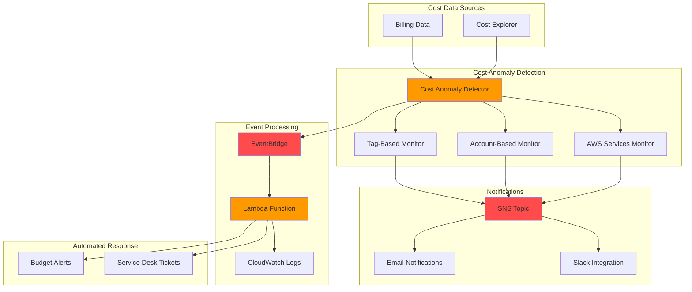

# Cost Anomaly Detection with Machine Learning

## Problem

Organizations often struggle with unexpected cost spikes and budget overruns that can significantly impact their financial planning and operational efficiency. Traditional cost monitoring approaches rely on static thresholds and manual review processes, making it difficult to detect subtle anomalies or unusual spending patterns that emerge gradually. Without automated anomaly detection, finance teams spend considerable time manually analyzing cost reports, often discovering anomalies days or weeks after they occur, when the financial impact has already been realized.

## Solution

AWS Cost Anomaly Detection uses advanced machine learning models to automatically identify unusual spending patterns across your AWS services, accounts, and cost categories. This solution establishes intelligent baseline spending patterns, detects deviations from normal behavior, and provides automated notifications with root cause analysis. By implementing cost anomaly detection with customizable monitors and alert subscriptions, organizations can proactively identify cost issues before they become significant budget problems.

## Architecture Diagram



## Prerequisites

1. AWS account with appropriate permissions for Cost Explorer and Cost Anomaly Detection
2. AWS CLI v2 installed and configured (or AWS CloudShell)
3. Basic understanding of AWS billing and cost management concepts
4. SNS topic creation and email subscription permissions
5. Estimated cost: $5-15/month for SNS notifications and minimal CloudWatch charges

> **Note**: Cost Anomaly Detection service itself is free. You only pay for the underlying AWS services used for notifications and automation.

## Preparation

```bash
# Set environment variables
export AWS_REGION=$(aws configure get region)
export AWS_ACCOUNT_ID=$(aws sts get-caller-identity \
    --query Account --output text)

# Generate unique identifier for resources
RANDOM_SUFFIX=$(aws secretsmanager get-random-password \
    --exclude-punctuation --exclude-uppercase \
    --password-length 6 --require-each-included-type \
    --output text --query RandomPassword)

# Set resource names
export COST_ANOMALY_TOPIC_NAME="cost-anomaly-alerts-${RANDOM_SUFFIX}"
export COST_ANOMALY_EMAIL="your-email@example.com"  # Replace with your email

# Verify Cost Explorer is enabled (required for Cost Anomaly Detection)
echo "Verifying Cost Explorer access..."
aws ce get-cost-and-usage \
    --time-period Start=2024-01-01,End=2024-01-02 \
    --granularity MONTHLY \
    --metrics BlendedCost \
    --group-by Type=DIMENSION,Key=SERVICE \
    --query 'ResultsByTime[0].Total' 2>/dev/null || \
    echo "⚠️  Cost Explorer may not be enabled. Please enable it in the AWS Console first."
```

## Steps

1. **Create SNS Topic for Cost Anomaly Notifications**:

   Amazon SNS (Simple Notification Service) provides a fully managed messaging service that enables asynchronous communication between distributed systems, applications, and services. For cost anomaly detection, SNS acts as the central notification hub, ensuring that anomaly alerts reach the appropriate stakeholders promptly. SNS supports multiple endpoint types including email, SMS, and application integrations, making it ideal for enterprise notification requirements. Learn more about SNS capabilities in the [Amazon SNS documentation](https://docs.aws.amazon.com/sns/latest/dg/welcome.html).

   ```bash
   # Create SNS topic for cost anomaly alerts
   TOPIC_ARN=$(aws sns create-topic \
       --name "$COST_ANOMALY_TOPIC_NAME" \
       --query 'TopicArn' --output text)
   
   echo "✅ Created SNS topic: $TOPIC_ARN"
   
   # Subscribe your email to the topic
   aws sns subscribe \
       --topic-arn "$TOPIC_ARN" \
       --protocol email \
       --notification-endpoint "$COST_ANOMALY_EMAIL"
   
   echo "✅ Email subscription created. Check your email to confirm subscription."
   ```

   The SNS topic is now ready to receive cost anomaly notifications from AWS Cost Anomaly Detection. This foundational messaging infrastructure ensures that when anomalies are detected, stakeholders receive immediate notifications, enabling rapid response to unexpected cost spikes.

2. **Create AWS Services Cost Anomaly Monitor**:

   AWS Cost Anomaly Detection monitors use machine learning algorithms to establish baseline spending patterns and detect deviations from normal behavior. Service-based monitors analyze spending patterns across individual AWS services, enabling detection of unusual usage patterns in specific services like EC2, S3, or Lambda. This granular monitoring approach is essential because different services have distinct usage patterns - for example, EC2 costs may spike due to auto-scaling events, while S3 costs might increase gradually due to data growth. By segmenting monitoring by service, the system reduces false positive alerts and improves detection accuracy. For detailed information about monitor types, see the [AWS Cost Anomaly Detection documentation](https://docs.aws.amazon.com/cost-management/latest/userguide/getting-started-ad.html).

   ```bash
   # Create a monitor for all AWS services
   SERVICES_MONITOR_ARN=$(aws ce create-anomaly-monitor \
       --anomaly-monitor '{
           "MonitorName": "AWS-Services-Monitor",
           "MonitorType": "DIMENSIONAL",
           "MonitorDimension": "SERVICE"
       }' \
       --query 'MonitorArn' --output text)
   
   echo "✅ Created AWS Services monitor: $SERVICES_MONITOR_ARN"
   ```

   The service-based monitor is now analyzing spending patterns across all AWS services in your account. This monitor will learn normal usage patterns for each service and detect anomalies specific to individual services, providing more accurate and actionable cost anomaly detection.

3. **Create Account-Based Cost Anomaly Monitor**:

   Account-based monitors are particularly valuable for organizations using AWS Organizations, where multiple member accounts operate under a single management account. These monitors analyze spending patterns within specific linked accounts, enabling detection of anomalies that might be masked when viewing aggregated costs across all accounts. For example, a development account might normally spend $500/month, but an account-based monitor would detect if spending suddenly jumps to $2,000 due to misconfigured resources or runaway processes. This granular monitoring is essential for cost governance and accountability in multi-account environments.

   ```bash
   # Create a monitor for specific AWS accounts
   ACCOUNT_MONITOR_ARN=$(aws ce create-anomaly-monitor \
       --anomaly-monitor '{
           "MonitorName": "Account-Based-Monitor",
           "MonitorType": "DIMENSIONAL",
           "MonitorDimension": "LINKED_ACCOUNT"
       }' \
       --query 'MonitorArn' --output text)
   
   echo "✅ Created Account-Based monitor: $ACCOUNT_MONITOR_ARN"
   ```

   The account-based monitor now tracks spending patterns across your linked accounts, providing visibility into account-specific anomalies. This enables better cost attribution and helps identify which accounts or teams are responsible for unexpected cost increases.

4. **Create Tag-Based Cost Anomaly Monitor**:

   Tag-based monitors provide the most granular control over cost anomaly detection by focusing on specific environments, projects, or cost centers based on resource tagging strategies. This approach is particularly powerful for organizations with mature tagging practices, as it enables monitoring of specific workloads or business units. For example, you might want to monitor production workloads more closely than development environments, or track costs for specific projects or customer deployments. Tag-based monitors help ensure that cost anomalies are detected in the context that matters most to your business operations.

   ```bash
   # Create a monitor for resources with specific tags
   TAG_MONITOR_ARN=$(aws ce create-anomaly-monitor \
       --anomaly-monitor '{
           "MonitorName": "Environment-Tag-Monitor",
           "MonitorType": "CUSTOM",
           "MonitorSpecification": {
               "Tags": {
                   "Key": "Environment",
                   "Values": ["Production", "Staging"],
                   "MatchOptions": ["EQUALS"]
               }
           }
       }' \
       --query 'MonitorArn' --output text)
   
   echo "✅ Created Tag-Based monitor: $TAG_MONITOR_ARN"
   ```

   The tag-based monitor now focuses on resources tagged with specific environment values, providing targeted anomaly detection for your most critical workloads. This selective monitoring approach reduces noise while ensuring comprehensive coverage of business-critical resources.

> **Warning**: Cost Anomaly Detection requires at least 10 days of historical data before it can detect anomalies for new services or monitors. Ensure your AWS account has sufficient cost history, or consider enabling Cost Explorer if it's not already active.

5. **Create Daily Summary Alert Subscription**:

   Alert subscriptions define how and when stakeholders receive notifications about detected cost anomalies. Daily summary subscriptions provide a consolidated view of anomalies detected over the previous 24 hours, reducing notification fatigue while ensuring comprehensive visibility into cost deviations. This approach is particularly valuable for finance teams who need regular oversight without being overwhelmed by individual alerts. The threshold expression uses absolute dollar amounts to filter anomalies, ensuring that only financially significant deviations trigger notifications. For more information about alert frequencies and thresholds, see the [Cost Anomaly Detection alert documentation](https://docs.aws.amazon.com/cost-management/latest/userguide/getting-started-ad.html).

   ```bash
   # Create subscription for daily summary alerts
   DAILY_SUBSCRIPTION_ARN=$(aws ce create-anomaly-subscription \
       --anomaly-subscription '{
           "SubscriptionName": "Daily-Cost-Summary",
           "Frequency": "DAILY",
           "MonitorArnList": [
               "'$SERVICES_MONITOR_ARN'",
               "'$ACCOUNT_MONITOR_ARN'"
           ],
           "Subscribers": [
               {
                   "Address": "'$COST_ANOMALY_EMAIL'",
                   "Type": "EMAIL"
               }
           ],
           "ThresholdExpression": {
               "And": [
                   {
                       "Dimensions": {
                           "Key": "ANOMALY_TOTAL_IMPACT_ABSOLUTE",
                           "Values": ["100"]
                       }
                   }
               ]
           }
       }' \
       --query 'SubscriptionArn' --output text)
   
   echo "✅ Created Daily Summary subscription: $DAILY_SUBSCRIPTION_ARN"
   ```

   The daily summary subscription is now active and will send consolidated anomaly reports to your email address. This provides regular oversight of cost anomalies without overwhelming stakeholders with individual alerts, while the $100 threshold ensures that only significant anomalies are reported.

6. **Create Individual Alert Subscription with SNS**:

   Individual alert subscriptions provide immediate notifications as soon as anomalies are detected, enabling rapid response to cost spikes. Unlike daily summaries, individual alerts are designed for time-sensitive scenarios where immediate action may be required to prevent further cost escalation. By using SNS as the delivery mechanism, these alerts can be integrated with chat applications, service desk systems, or automated response workflows. The lower threshold ($50) for individual alerts ensures that even moderate anomalies receive attention, while the immediate frequency enables proactive cost management.

   ```bash
   # Create subscription for individual alerts via SNS
   INDIVIDUAL_SUBSCRIPTION_ARN=$(aws ce create-anomaly-subscription \
       --anomaly-subscription '{
           "SubscriptionName": "Individual-Cost-Alerts",
           "Frequency": "IMMEDIATE",
           "MonitorArnList": [
               "'$TAG_MONITOR_ARN'"
           ],
           "Subscribers": [
               {
                   "Address": "'$TOPIC_ARN'",
                   "Type": "SNS"
               }
           ],
           "ThresholdExpression": {
               "And": [
                   {
                       "Dimensions": {
                           "Key": "ANOMALY_TOTAL_IMPACT_ABSOLUTE",
                           "Values": ["50"]
                       }
                   }
               ]
           }
       }' \
       --query 'SubscriptionArn' --output text)
   
   echo "✅ Created Individual Alerts subscription: $INDIVIDUAL_SUBSCRIPTION_ARN"
   ```

   The individual alerts subscription is now configured to send immediate notifications via SNS when anomalies are detected in your tag-based monitor. This enables rapid response to cost anomalies, particularly important for production environments where quick intervention can prevent significant cost impact.

7. **Create EventBridge Rule for Cost Anomaly Events**:

   Amazon EventBridge provides a serverless event bus that enables applications to communicate using events from AWS services, integrated applications, and custom sources. For cost anomaly detection, EventBridge serves as the integration point for building sophisticated automated response workflows beyond simple notifications. Cost Anomaly Detection automatically publishes events to EventBridge when anomalies are detected, enabling downstream processing by Lambda functions, Step Functions, or other AWS services. This event-driven architecture allows organizations to implement automated cost governance actions, such as creating tickets, sending custom notifications, or triggering cost optimization workflows. Learn more about EventBridge integration in the [Cost Anomaly Detection EventBridge documentation](https://docs.aws.amazon.com/cost-management/latest/userguide/cad-eventbridge.html).

   ```bash
   # Create EventBridge rule to capture cost anomaly events
   aws events put-rule \
       --name "cost-anomaly-detection-rule" \
       --event-pattern '{
           "source": ["aws.ce"],
           "detail-type": ["Cost Anomaly Detection"]
       }' \
       --description "Capture AWS Cost Anomaly Detection events"
   
   echo "✅ Created EventBridge rule for cost anomaly events"
   ```

   The EventBridge rule is now configured to capture cost anomaly events from AWS Cost Explorer (aws.ce), providing the foundation for automated response workflows. This rule will trigger whenever cost anomalies are detected, enabling sophisticated downstream processing and automation.

8. **Create Lambda Function for Automated Response**:

   AWS Lambda provides serverless compute capabilities that enable you to run code in response to events without provisioning or managing servers. For cost anomaly detection, Lambda functions serve as the processing engine for automated responses to anomaly events. This function will receive cost anomaly events from EventBridge, analyze the anomaly details, categorize the severity, and take appropriate automated actions. The serverless nature of Lambda ensures that you only pay for the compute time consumed when processing anomalies, making it a cost-effective solution for automated cost governance.

   ```bash
   # Create Lambda function for processing anomaly events
   cat > /tmp/anomaly-processor.py << 'EOF'
import json
import boto3
import logging
from datetime import datetime

logger = logging.getLogger()
logger.setLevel(logging.INFO)

def lambda_handler(event, context):
    """Process cost anomaly detection events and take automated actions"""
    
    try:
        # Log the incoming event
        logger.info(f"Received cost anomaly event: {json.dumps(event)}")
        
        # Extract anomaly details
        detail = event.get('detail', {})
        anomaly_score = detail.get('anomalyScore', 0)
        impact = detail.get('impact', {})
        total_impact = impact.get('totalImpact', 0)
        
        # Determine severity level
        if total_impact > 500:
            severity = "HIGH"
        elif total_impact > 100:
            severity = "MEDIUM"
        else:
            severity = "LOW"
        
        # Log anomaly details
        logger.info(f"Anomaly detected - Score: {anomaly_score}, Impact: ${total_impact}, Severity: {severity}")
        
        # Send to CloudWatch Logs for further analysis
        cloudwatch = boto3.client('logs')
        log_group = '/aws/lambda/cost-anomaly-processor'
        log_stream = f"anomaly-{datetime.now().strftime('%Y-%m-%d')}"
        
        try:
            cloudwatch.create_log_group(logGroupName=log_group)
        except cloudwatch.exceptions.ResourceAlreadyExistsException:
            pass
        
        try:
            cloudwatch.create_log_stream(
                logGroupName=log_group,
                logStreamName=log_stream
            )
        except cloudwatch.exceptions.ResourceAlreadyExistsException:
            pass
        
        # Log structured anomaly data
        structured_log = {
            "timestamp": datetime.now().isoformat(),
            "anomaly_score": anomaly_score,
            "total_impact": total_impact,
            "severity": severity,
            "event_detail": detail
        }
        
        cloudwatch.put_log_events(
            logGroupName=log_group,
            logStreamName=log_stream,
            logEvents=[
                {
                    'timestamp': int(datetime.now().timestamp() * 1000),
                    'message': json.dumps(structured_log)
                }
            ]
        )
        
        return {
            'statusCode': 200,
            'body': json.dumps({
                'message': 'Cost anomaly processed successfully',
                'severity': severity,
                'impact': total_impact
            })
        }
        
    except Exception as e:
        logger.error(f"Error processing cost anomaly: {str(e)}")
        return {
            'statusCode': 500,
            'body': json.dumps({
                'message': 'Error processing cost anomaly',
                'error': str(e)
            })
        }
EOF
   
   # Create deployment package
   cd /tmp && zip anomaly-processor.zip anomaly-processor.py
   
   # Create Lambda function
   LAMBDA_ARN=$(aws lambda create-function \
       --function-name "cost-anomaly-processor" \
       --runtime python3.9 \
       --role "arn:aws:iam::${AWS_ACCOUNT_ID}:role/lambda-execution-role" \
       --handler anomaly-processor.lambda_handler \
       --zip-file fileb://anomaly-processor.zip \
       --description "Process cost anomaly detection events" \
       --timeout 60 \
       --query 'FunctionArn' --output text)
   
   echo "✅ Created Lambda function: $LAMBDA_ARN"
   ```

   The Lambda function is now deployed and ready to process cost anomaly events from EventBridge. This function provides intelligent anomaly categorization based on financial impact, structured logging for analysis, and extensible architecture for implementing custom automated responses. The function's ability to analyze anomaly severity enables different response strategies based on the significance of cost deviations.

9. **Configure EventBridge Target for Lambda**:

   EventBridge targets define where events should be sent when rules are triggered. By configuring the Lambda function as a target for our cost anomaly detection rule, we establish the connection between anomaly events and automated processing. The permission configuration is crucial for security, as it grants EventBridge the specific permission to invoke the Lambda function while maintaining least privilege access. This configuration ensures that cost anomaly events automatically trigger the Lambda function for processing and response.

   ```bash
   # Add Lambda function as EventBridge target
   aws events put-targets \
       --rule "cost-anomaly-detection-rule" \
       --targets "Id"="1","Arn"="$LAMBDA_ARN"
   
   # Grant EventBridge permission to invoke Lambda
   aws lambda add-permission \
       --function-name "cost-anomaly-processor" \
       --statement-id "allow-eventbridge-invoke" \
       --action "lambda:InvokeFunction" \
       --principal events.amazonaws.com \
       --source-arn "arn:aws:events:${AWS_REGION}:${AWS_ACCOUNT_ID}:rule/cost-anomaly-detection-rule"
   
   echo "✅ Configured EventBridge to invoke Lambda function"
   ```

   The EventBridge integration is now complete, establishing an automated pipeline from cost anomaly detection to intelligent processing. When anomalies are detected, EventBridge will automatically invoke the Lambda function, enabling immediate analysis and response to cost deviations.

10. **Create CloudWatch Dashboard for Cost Anomaly Monitoring**:

    CloudWatch dashboards provide centralized visualization of metrics, logs, and insights from AWS services. For cost anomaly detection, dashboards enable stakeholders to monitor anomaly trends, analyze severity distributions, and track the effectiveness of cost governance measures. The dashboard uses CloudWatch Logs Insights queries to analyze structured log data from the Lambda function, providing real-time visibility into cost anomaly patterns. This operational intelligence is essential for understanding cost behaviors and refining anomaly detection strategies.

    ```bash
    # Create CloudWatch dashboard for cost anomaly visualization
    aws cloudwatch put-dashboard \
        --dashboard-name "Cost-Anomaly-Detection-Dashboard" \
        --dashboard-body '{
            "widgets": [
                {
                    "type": "log",
                    "x": 0,
                    "y": 0,
                    "width": 12,
                    "height": 6,
                    "properties": {
                        "query": "SOURCE \"/aws/lambda/cost-anomaly-processor\"\n| fields @timestamp, severity, total_impact, anomaly_score\n| filter severity = \"HIGH\"\n| sort @timestamp desc\n| limit 20",
                        "region": "'$AWS_REGION'",
                        "title": "High Impact Cost Anomalies",
                        "view": "table"
                    }
                },
                {
                    "type": "log",
                    "x": 0,
                    "y": 6,
                    "width": 12,
                    "height": 6,
                    "properties": {
                        "query": "SOURCE \"/aws/lambda/cost-anomaly-processor\"\n| fields @timestamp, severity, total_impact\n| stats count() by severity\n| sort severity desc",
                        "region": "'$AWS_REGION'",
                        "title": "Anomaly Count by Severity",
                        "view": "table"
                    }
                }
            ]
        }'
    
    echo "✅ Created CloudWatch dashboard for cost anomaly monitoring"
    ```

    The CloudWatch dashboard is now providing real-time visibility into cost anomaly patterns and trends. This centralized monitoring capability enables stakeholders to understand anomaly severity distributions, track high-impact events, and make data-driven decisions about cost governance strategies.

## Validation & Testing

1. **Verify Cost Anomaly Monitors are Active**:

   ```bash
   # List all anomaly monitors
   aws ce get-anomaly-monitors \
       --query 'AnomalyMonitors[*].{Name:MonitorName,Type:MonitorType,ARN:MonitorArn}' \
       --output table
   ```

   Expected output: Table showing your three monitors (AWS Services, Account-Based, and Tag-Based)

2. **Check Anomaly Subscriptions**:

   ```bash
   # List all anomaly subscriptions
   aws ce get-anomaly-subscriptions \
       --query 'AnomalySubscriptions[*].{Name:SubscriptionName,Frequency:Frequency,ARN:SubscriptionArn}' \
       --output table
   ```

   Expected output: Table showing your two subscriptions (Daily Summary and Individual Alerts)

3. **Test SNS Topic Configuration**:

   ```bash
   # Test SNS topic by publishing a test message
   aws sns publish \
       --topic-arn "$TOPIC_ARN" \
       --message "Test message from Cost Anomaly Detection setup" \
       --subject "Cost Anomaly Detection Test"
   
   echo "✅ Test message sent to SNS topic"
   ```

4. **Verify EventBridge Rule Configuration**:

   ```bash
   # Check EventBridge rule status
   aws events describe-rule \
       --name "cost-anomaly-detection-rule" \
       --query '{Name:Name,State:State,EventPattern:EventPattern}'
   ```

   Expected output: Rule details showing ENABLED state

5. **Test Lambda Function**:

   ```bash
   # Test Lambda function with sample event
   aws lambda invoke \
       --function-name "cost-anomaly-processor" \
       --payload '{"detail":{"anomalyScore":0.8,"impact":{"totalImpact":150}}}' \
       --log-type Tail \
       /tmp/lambda-response.json
   
   # Check the response
   cat /tmp/lambda-response.json
   ```

   Expected output: JSON response with successful processing status

## Cleanup

1. **Delete Anomaly Subscriptions**:

   ```bash
   # Delete anomaly subscriptions
   aws ce delete-anomaly-subscription \
       --subscription-arn "$DAILY_SUBSCRIPTION_ARN"
   
   aws ce delete-anomaly-subscription \
       --subscription-arn "$INDIVIDUAL_SUBSCRIPTION_ARN"
   
   echo "✅ Deleted anomaly subscriptions"
   ```

2. **Delete Anomaly Monitors**:

   ```bash
   # Delete anomaly monitors
   aws ce delete-anomaly-monitor \
       --monitor-arn "$SERVICES_MONITOR_ARN"
   
   aws ce delete-anomaly-monitor \
       --monitor-arn "$ACCOUNT_MONITOR_ARN"
   
   aws ce delete-anomaly-monitor \
       --monitor-arn "$TAG_MONITOR_ARN"
   
   echo "✅ Deleted anomaly monitors"
   ```

3. **Remove Lambda Function and EventBridge Rule**:

   ```bash
   # Delete Lambda function
   aws lambda delete-function \
       --function-name "cost-anomaly-processor"
   
   # Remove EventBridge targets and rule
   aws events remove-targets \
       --rule "cost-anomaly-detection-rule" \
       --ids "1"
   
   aws events delete-rule \
       --name "cost-anomaly-detection-rule"
   
   echo "✅ Deleted Lambda function and EventBridge rule"
   ```

4. **Delete SNS Topic and CloudWatch Dashboard**:

   ```bash
   # Delete SNS topic
   aws sns delete-topic \
       --topic-arn "$TOPIC_ARN"
   
   # Delete CloudWatch dashboard
   aws cloudwatch delete-dashboards \
       --dashboard-names "Cost-Anomaly-Detection-Dashboard"
   
   echo "✅ Deleted SNS topic and CloudWatch dashboard"
   ```

5. **Remove Log Groups**:

   ```bash
   # Delete CloudWatch log groups
   aws logs delete-log-group \
       --log-group-name "/aws/lambda/cost-anomaly-processor"
   
   echo "✅ Deleted CloudWatch log groups"
   ```

## Discussion

AWS Cost Anomaly Detection leverages machine learning algorithms to establish baseline spending patterns and automatically detect deviations from normal behavior. Unlike traditional threshold-based monitoring, this approach adapts to your organization's unique spending patterns, seasonal variations, and natural growth trends, significantly reducing false positive alerts while catching genuine anomalies that might otherwise go unnoticed.

The solution implements a multi-layered monitoring approach with three distinct monitor types. Service-based monitors track anomalies across individual AWS services, enabling detection of unusual usage patterns in specific services like EC2, S3, or Lambda. Account-based monitors are particularly valuable for organizations using AWS Organizations, allowing detection of anomalies within specific member accounts. Tag-based monitors provide the most granular control, enabling monitoring of specific environments, projects, or cost centers based on resource tagging strategies.

The integration with EventBridge enables sophisticated automated response workflows beyond simple notifications. Organizations can implement automated cost governance actions such as creating service desk tickets, sending Slack notifications with custom formatting, or even triggering cost optimization Lambda functions. The machine learning models continuously learn from your spending patterns, improving detection accuracy over time while maintaining sensitivity to both gradual increases and sudden spikes in spending.

Cost Anomaly Detection analyzes net unblended costs, meaning it accounts for discounts, credits, and reserved instance pricing in its calculations. This provides a more accurate representation of actual spending anomalies compared to analyzing gross costs. The service requires at least 10 days of historical data for new services before it can detect anomalies, ensuring the machine learning models have sufficient data to establish reliable baselines.

> **Tip**: Configure different threshold values for different environments or business units. Production environments might warrant lower thresholds ($50-100) for immediate alerts, while development environments might use higher thresholds ($200-500) to reduce notification noise.

> **Note**: Consider implementing anomaly detection alongside AWS Budgets for comprehensive cost governance. While Cost Anomaly Detection identifies unusual patterns, budgets provide absolute spending limits and can trigger automated actions when thresholds are exceeded. See the [AWS Budgets documentation](https://docs.aws.amazon.com/awsaccountbilling/latest/aboutv2/budgets-managing-costs.html) for integration strategies.

## Challenge

Extend this solution by implementing these advanced cost anomaly detection capabilities:

1. **Multi-Region Cost Anomaly Aggregation**: Create a centralized dashboard that aggregates cost anomaly data from multiple AWS regions, providing a unified view of spending anomalies across your global infrastructure.

2. **Predictive Cost Modeling Integration**: Combine Cost Anomaly Detection with Amazon Forecast to create predictive models that not only detect current anomalies but also predict potential future cost spikes based on historical patterns and detected anomalies.

3. **Automated Cost Optimization Triggers**: Implement Lambda functions that automatically respond to specific types of cost anomalies by triggering cost optimization actions, such as rightsizing recommendations, unused resource cleanup, or automatic scaling adjustments.

4. **Custom Machine Learning Enhancement**: Integrate Amazon SageMaker to build custom anomaly detection models that incorporate business-specific factors like marketing campaign schedules, seasonal patterns, or product launch timelines to improve detection accuracy.

5. **Cost Anomaly Root Cause Analysis**: Develop an automated root cause analysis system using AWS X-Ray and CloudWatch Logs Insights that correlates cost anomalies with application performance metrics, deployment events, and infrastructure changes to provide deeper insights into spending deviations.

## Infrastructure Code

*Infrastructure code will be generated after recipe approval.*