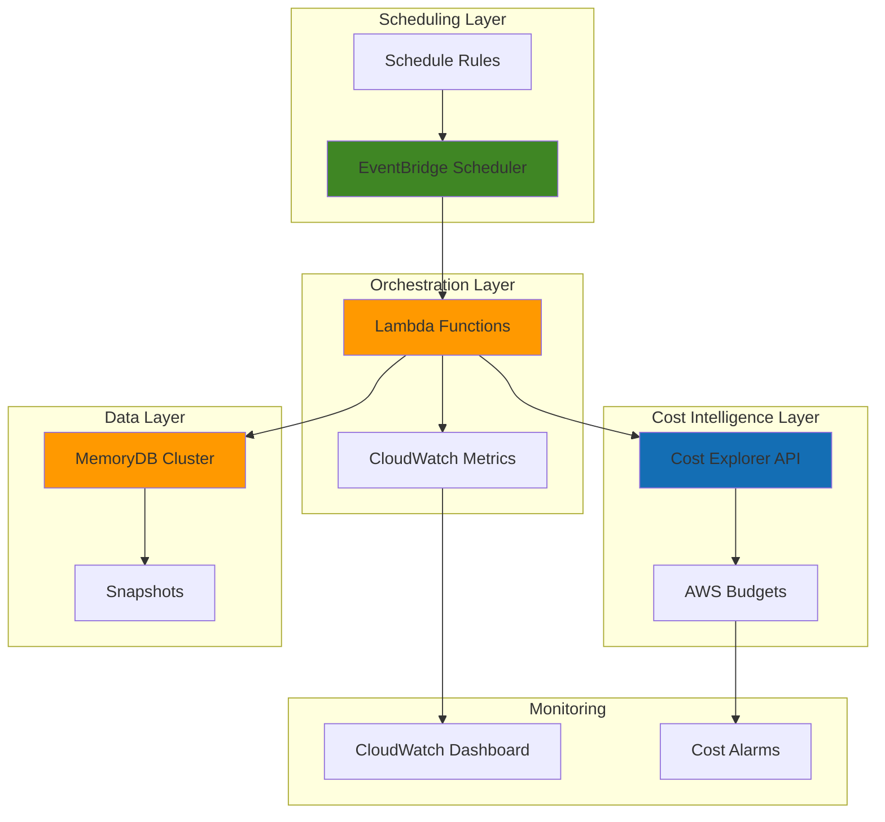

# Cost-Aware Resource Lifecycle with MemoryDB

## Problem

Organizations running high-performance Redis workloads on AWS MemoryDB face escalating costs when clusters remain at peak capacity 24/7, even during low-traffic periods like nights and weekends. Without intelligent cost controls based on usage patterns and business hours, teams overspend on database resources by 40-60%, particularly when clusters are provisioned for peak loads but maintain the same capacity during off-peak times. Traditional static scaling approaches fail to balance performance requirements with cost efficiency for memory-intensive workloads.

## Solution

Build an intelligent cost optimization system that automatically manages MemoryDB cluster scaling and lifecycle based on usage patterns, cost thresholds, and business hours using EventBridge Scheduler for precise timing control. The solution combines real-time cost monitoring via Cost Explorer API, Lambda-based automation for cluster modifications, and EventBridge Scheduler for reliable event orchestration to achieve 30-50% cost savings while maintaining performance during critical business hours.

## Architecture Diagram



## Prerequisites

1. AWS account with appropriate permissions for MemoryDB, EventBridge, Lambda, and Cost Explorer
2. AWS CLI installed and configured (or CloudShell)
3. Basic understanding of Redis cluster operations and AWS cost management
4. Existing MemoryDB cluster or willingness to create one for testing
5. Estimated cost: $50-100/month for test environment resources

> **Note**: This configuration follows AWS Well-Architected Framework cost optimization principles. See [AWS Well-Architected Framework](https://docs.aws.amazon.com/wellarchitected/latest/framework/welcome.html) for additional guidance.

## Preparation

```bash
# Set environment variables
export AWS_REGION=$(aws configure get region)
export AWS_ACCOUNT_ID=$(aws sts get-caller-identity \
    --query Account --output text)

# Generate unique identifiers for resources
RANDOM_SUFFIX=$(aws secretsmanager get-random-password \
    --exclude-punctuation --exclude-uppercase \
    --password-length 6 --require-each-included-type \
    --output text --query RandomPassword)

# Set resource names
export CLUSTER_NAME="cost-aware-memorydb-${RANDOM_SUFFIX}"
export LAMBDA_FUNCTION_NAME="memorydb-cost-optimizer-${RANDOM_SUFFIX}"
export SCHEDULER_GROUP_NAME="cost-optimization-schedules-${RANDOM_SUFFIX}"
export IAM_ROLE_NAME="memorydb-cost-optimizer-role-${RANDOM_SUFFIX}"

# Create foundational IAM role for Lambda
aws iam create-role \
    --role-name ${IAM_ROLE_NAME} \
    --assume-role-policy-document '{
        "Version": "2012-10-17",
        "Statement": [
            {
                "Effect": "Allow",
                "Principal": {
                    "Service": "lambda.amazonaws.com"
                },
                "Action": "sts:AssumeRole"
            }
        ]
    }'

# Attach necessary policies
aws iam attach-role-policy \
    --role-name ${IAM_ROLE_NAME} \
    --policy-arn arn:aws:iam::aws:policy/service-role/AWSLambdaBasicExecutionRole

echo "✅ AWS environment configured with unique identifiers"
```

## Steps

1. **Create Custom IAM Policy for Cost-Aware Operations**:

   Cost optimization requires comprehensive permissions across multiple AWS services to monitor costs, modify MemoryDB clusters, and manage EventBridge schedules. This custom policy follows the principle of least privilege while enabling the Lambda function to perform all necessary operations for intelligent resource lifecycle management.

   ```bash
   # Create comprehensive IAM policy for cost optimization
   aws iam create-policy \
       --policy-name memorydb-cost-optimizer-policy-${RANDOM_SUFFIX} \
       --policy-document '{
           "Version": "2012-10-17",
           "Statement": [
               {
                   "Effect": "Allow",
                   "Action": [
                       "memorydb:DescribeClusters",
                       "memorydb:ModifyCluster",
                       "memorydb:DescribeSubnetGroups",
                       "memorydb:DescribeParameterGroups"
                   ],
                   "Resource": "*"
               },
               {
                   "Effect": "Allow",
                   "Action": [
                       "ce:GetCostAndUsage",
                       "ce:GetUsageReport",
                       "ce:GetDimensionValues",
                       "budgets:ViewBudget"
                   ],
                   "Resource": "*"
               },
               {
                   "Effect": "Allow",
                   "Action": [
                       "cloudwatch:PutMetricData",
                       "cloudwatch:GetMetricStatistics"
                   ],
                   "Resource": "*"
               },
               {
                   "Effect": "Allow",
                   "Action": [
                       "scheduler:GetSchedule",
                       "scheduler:UpdateSchedule"
                   ],
                   "Resource": "*"
               }
           ]
       }'

   # Attach custom policy to role
   aws iam attach-role-policy \
       --role-name ${IAM_ROLE_NAME} \
       --policy-arn arn:aws:iam::${AWS_ACCOUNT_ID}:policy/memorydb-cost-optimizer-policy-${RANDOM_SUFFIX}

   echo "✅ IAM permissions configured for cost optimization operations"
   ```

   The policy now enables comprehensive cost monitoring and cluster management capabilities. This security model ensures the automation can function effectively while maintaining appropriate access controls for sensitive cost and infrastructure operations following AWS IAM best practices.

2. **Create MemoryDB Cluster for Cost Optimization Testing**:

   MemoryDB provides Redis-compatible, durable in-memory storage with microsecond read latency and single-digit millisecond write latency. Creating a test cluster establishes the foundation for demonstrating cost-aware scaling patterns while maintaining the high-performance characteristics required for production workloads.

   ```bash
   # Create subnet group for MemoryDB cluster
   aws memorydb create-subnet-group \
       --subnet-group-name ${CLUSTER_NAME}-subnet-group \
       --description "Subnet group for cost-aware MemoryDB cluster" \
       --subnet-ids $(aws ec2 describe-subnets \
           --filters "Name=default-for-az,Values=true" \
           --query "Subnets[0:2].SubnetId" --output text)

   # Create MemoryDB cluster with minimal configuration for cost testing
   aws memorydb create-cluster \
       --cluster-name ${CLUSTER_NAME} \
       --node-type db.t4g.small \
       --num-shards 1 \
       --num-replicas-per-shard 0 \
       --subnet-group-name ${CLUSTER_NAME}-subnet-group \
       --security-group-ids $(aws ec2 describe-security-groups \
           --filters "Name=group-name,Values=default" \
           --query "SecurityGroups[0].GroupId" --output text) \
       --maintenance-window "sun:03:00-sun:04:00"

   # Wait for cluster to become available
   echo "⏳ Waiting for MemoryDB cluster to become available..."
   aws memorydb wait cluster-available --cluster-name ${CLUSTER_NAME}

   echo "✅ MemoryDB cluster created and ready for cost optimization"
   ```

   The cluster is now operational with cost-conscious initial sizing using AWS Graviton2 processors for optimal price-performance. This foundation provides the scalable infrastructure needed for testing automated cost optimization while demonstrating MemoryDB's enterprise-grade durability and performance characteristics.

3. **Create Lambda Function for Intelligent Cost Management**:

   The Lambda function serves as the core intelligence engine, integrating Cost Explorer API data with MemoryDB cluster management to make informed scaling decisions. This serverless approach eliminates the need for persistent infrastructure while providing event-driven cost optimization that scales automatically with demand.

   ```bash
   # Create Lambda deployment package
   mkdir -p /tmp/lambda-package
   cat > /tmp/lambda-package/lambda_function.py << 'EOF'
import json
import boto3
import datetime
import logging
from typing import Dict, Any

# Configure logging
logger = logging.getLogger()
logger.setLevel(logging.INFO)

memorydb = boto3.client('memorydb')
ce = boto3.client('ce')
cloudwatch = boto3.client('cloudwatch')

def lambda_handler(event: Dict[str, Any], context) -> Dict[str, Any]:
    """
    Intelligent cost-aware MemoryDB cluster management.
    Analyzes cost patterns and adjusts cluster configuration based on thresholds.
    """
    
    cluster_name = event.get('cluster_name')
    action = event.get('action', 'analyze')
    cost_threshold = event.get('cost_threshold', 100.0)
    
    if not cluster_name:
        return {
            'statusCode': 400,
            'body': {'error': 'cluster_name is required'}
        }
    
    try:
        # Get current cluster status
        cluster_response = memorydb.describe_clusters(ClusterName=cluster_name)
        if not cluster_response['Clusters']:
            return {
                'statusCode': 404,
                'body': {'error': f'Cluster {cluster_name} not found'}
            }
            
        cluster = cluster_response['Clusters'][0]
        current_node_type = cluster['NodeType']
        current_shards = cluster['NumberOfShards']
        cluster_status = cluster['Status']
        
        # Only proceed if cluster is available
        if cluster_status != 'available':
            logger.warning(f"Cluster {cluster_name} is not available, status: {cluster_status}")
            return {
                'statusCode': 200,
                'body': {'message': f'Cluster not available for modification, status: {cluster_status}'}
            }
        
        # Analyze recent cost trends
        cost_data = get_cost_analysis()
        memorydb_cost = cost_data['total_cost']
        
        # Determine scaling action based on cost analysis
        scaling_recommendation = analyze_scaling_needs(
            memorydb_cost, cost_threshold, current_node_type, action
        )
        
        # Execute scaling if recommended and cluster is available
        if scaling_recommendation['action'] != 'none' and cluster_status == 'available':
            modify_result = modify_cluster(cluster_name, scaling_recommendation)
            scaling_recommendation['execution_result'] = modify_result
        
        # Send metrics to CloudWatch
        send_cloudwatch_metrics(cluster_name, memorydb_cost, scaling_recommendation)
        
        return {
            'statusCode': 200,
            'body': {
                'cluster_name': cluster_name,
                'current_cost': memorydb_cost,
                'current_node_type': current_node_type,
                'recommendation': scaling_recommendation,
                'timestamp': datetime.datetime.now().isoformat()
            }
        }
        
    except Exception as e:
        logger.error(f"Error in cost optimization: {str(e)}")
        return {
            'statusCode': 500,
            'body': {'error': str(e)}
        }

def get_cost_analysis() -> Dict[str, float]:
    """Retrieve and analyze recent MemoryDB costs."""
    try:
        end_date = datetime.datetime.now()
        start_date = end_date - datetime.timedelta(days=7)
        
        cost_response = ce.get_cost_and_usage(
            TimePeriod={
                'Start': start_date.strftime('%Y-%m-%d'),
                'End': end_date.strftime('%Y-%m-%d')
            },
            Granularity='DAILY',
            Metrics=['BlendedCost'],
            GroupBy=[
                {'Type': 'DIMENSION', 'Key': 'SERVICE'},
            ]
        )
        
        # Calculate MemoryDB costs
        memorydb_cost = 0.0
        for result_by_time in cost_response['ResultsByTime']:
            for group in result_by_time['Groups']:
                if 'MemoryDB' in group['Keys'][0] or 'ElastiCache' in group['Keys'][0]:
                    memorydb_cost += float(group['Metrics']['BlendedCost']['Amount'])
        
        return {'total_cost': memorydb_cost}
        
    except Exception as e:
        logger.warning(f"Could not retrieve cost data: {str(e)}")
        return {'total_cost': 0.0}

def analyze_scaling_needs(cost: float, threshold: float, node_type: str, action: str) -> Dict[str, Any]:
    """Analyze cost patterns and recommend scaling actions."""
    
    if action == 'scale_down' and cost > threshold:
        # Business hours ended, scale down for cost savings
        if 'large' in node_type:
            return {
                'action': 'modify_node_type',
                'target_node_type': node_type.replace('large', 'small'),
                'reason': 'Off-peak cost optimization',
                'estimated_savings': '30-40%'
            }
        elif 'medium' in node_type:
            return {
                'action': 'modify_node_type',
                'target_node_type': node_type.replace('medium', 'small'),
                'reason': 'Off-peak cost optimization',
                'estimated_savings': '20-30%'
            }
    elif action == 'scale_up':
        # Business hours starting, scale up for performance
        if 'small' in node_type:
            return {
                'action': 'modify_node_type',
                'target_node_type': node_type.replace('small', 'medium'),
                'reason': 'Business hours performance optimization',
                'estimated_impact': 'Improved performance for business workloads'
            }
    
    return {'action': 'none', 'reason': 'No scaling needed based on current conditions'}

def modify_cluster(cluster_name: str, recommendation: Dict[str, Any]) -> Dict[str, str]:
    """Execute cluster modifications based on recommendations."""
    
    try:
        if recommendation['action'] == 'modify_node_type':
            response = memorydb.modify_cluster(
                ClusterName=cluster_name,
                NodeType=recommendation['target_node_type']
            )
            
            logger.info(f"Initiated cluster modification: {cluster_name} -> {recommendation['target_node_type']}")
            return {
                'status': 'initiated',
                'message': f"Cluster modification started to {recommendation['target_node_type']}"
            }
            
    except Exception as e:
        logger.error(f"Failed to modify cluster {cluster_name}: {str(e)}")
        return {
            'status': 'failed',
            'message': f"Cluster modification failed: {str(e)}"
        }

def send_cloudwatch_metrics(cluster_name: str, cost: float, recommendation: Dict[str, Any]) -> None:
    """Send cost optimization metrics to CloudWatch."""
    
    try:
        cloudwatch.put_metric_data(
            Namespace='MemoryDB/CostOptimization',
            MetricData=[
                {
                    'MetricName': 'WeeklyCost',
                    'Value': cost,
                    'Unit': 'None',
                    'Dimensions': [
                        {'Name': 'ClusterName', 'Value': cluster_name}
                    ]
                },
                {
                    'MetricName': 'OptimizationAction',
                    'Value': 1 if recommendation['action'] != 'none' else 0,
                    'Unit': 'Count',
                    'Dimensions': [
                        {'Name': 'ClusterName', 'Value': cluster_name}
                    ]
                }
            ]
        )
    except Exception as e:
        logger.warning(f"Failed to send CloudWatch metrics: {str(e)}")
EOF

   # Create deployment package
   cd /tmp/lambda-package && zip -r ../lambda-function.zip .

   # Create Lambda function with enhanced configuration
   aws lambda create-function \
       --function-name ${LAMBDA_FUNCTION_NAME} \
       --runtime python3.12 \
       --role arn:aws:iam::${AWS_ACCOUNT_ID}:role/${IAM_ROLE_NAME} \
       --handler lambda_function.lambda_handler \
       --zip-file fileb:///tmp/lambda-function.zip \
       --timeout 300 \
       --memory-size 256 \
       --description "Cost-aware MemoryDB cluster lifecycle management" \
       --environment Variables='{
           "LOG_LEVEL":"INFO"
       }'

   echo "✅ Lambda function created with intelligent cost optimization logic"
   ```

   The Lambda function now provides comprehensive cost analysis and automated scaling capabilities with improved error handling and logging. This intelligent engine continuously monitors cost patterns and makes data-driven decisions to optimize resource utilization while maintaining performance requirements during business-critical periods.

4. **Create EventBridge Scheduler Group and Rules**:

   EventBridge Scheduler provides highly reliable, serverless scheduling with precise timing control and built-in retry mechanisms. Creating scheduled rules enables consistent automation of cost optimization actions based on business hours and usage patterns, ensuring cost savings without manual intervention.

   ```bash
   # Create scheduler group for organizing cost optimization schedules
   aws scheduler create-schedule-group \
       --name ${SCHEDULER_GROUP_NAME} \
       --description "Cost optimization schedules for MemoryDB lifecycle management"

   # Create IAM role for EventBridge Scheduler
   aws iam create-role \
       --role-name eventbridge-scheduler-role-${RANDOM_SUFFIX} \
       --assume-role-policy-document '{
           "Version": "2012-10-17",
           "Statement": [
               {
                   "Effect": "Allow",
                   "Principal": {
                       "Service": "scheduler.amazonaws.com"
                   },
                   "Action": "sts:AssumeRole"
               }
           ]
       }'

   # Create and attach custom policy for Lambda invocation
   aws iam create-policy \
       --policy-name scheduler-lambda-invoke-policy-${RANDOM_SUFFIX} \
       --policy-document '{
           "Version": "2012-10-17",
           "Statement": [
               {
                   "Effect": "Allow",
                   "Action": "lambda:InvokeFunction",
                   "Resource": "arn:aws:lambda:'${AWS_REGION}':'${AWS_ACCOUNT_ID}':function:'${LAMBDA_FUNCTION_NAME}'"
               }
           ]
       }'

   aws iam attach-role-policy \
       --role-name eventbridge-scheduler-role-${RANDOM_SUFFIX} \
       --policy-arn arn:aws:iam::${AWS_ACCOUNT_ID}:policy/scheduler-lambda-invoke-policy-${RANDOM_SUFFIX}

   # Create business hours scale-up schedule (8 AM weekdays)
   aws scheduler create-schedule \
       --name "memorydb-business-hours-start-${RANDOM_SUFFIX}" \
       --group-name ${SCHEDULER_GROUP_NAME} \
       --schedule-expression "cron(0 8 ? * MON-FRI *)" \
       --target '{
           "Arn": "arn:aws:lambda:'${AWS_REGION}':'${AWS_ACCOUNT_ID}':function:'${LAMBDA_FUNCTION_NAME}'",
           "RoleArn": "arn:aws:iam::'${AWS_ACCOUNT_ID}':role/eventbridge-scheduler-role-'${RANDOM_SUFFIX}'",
           "Input": "{\"cluster_name\": \"'${CLUSTER_NAME}'\", \"action\": \"scale_up\", \"cost_threshold\": 100}"
       }' \
       --flexible-time-window '{"Mode": "OFF"}' \
       --description "Scale up MemoryDB for business hours performance"

   # Create off-hours scale-down schedule (6 PM weekdays)
   aws scheduler create-schedule \
       --name "memorydb-business-hours-end-${RANDOM_SUFFIX}" \
       --group-name ${SCHEDULER_GROUP_NAME} \
       --schedule-expression "cron(0 18 ? * MON-FRI *)" \
       --target '{
           "Arn": "arn:aws:lambda:'${AWS_REGION}':'${AWS_ACCOUNT_ID}':function:'${LAMBDA_FUNCTION_NAME}'",
           "RoleArn": "arn:aws:iam::'${AWS_ACCOUNT_ID}':role/eventbridge-scheduler-role-'${RANDOM_SUFFIX}'",
           "Input": "{\"cluster_name\": \"'${CLUSTER_NAME}'\", \"action\": \"scale_down\", \"cost_threshold\": 50}"
       }' \
       --flexible-time-window '{"Mode": "OFF"}' \
       --description "Scale down MemoryDB for cost optimization during off-hours"

   echo "✅ EventBridge Scheduler configured with business hours automation"
   ```

   The scheduling system now provides automated cost optimization based on business patterns with enhanced security controls. This reliable orchestration ensures consistent cost savings during predictable low-usage periods while automatically scaling resources for peak performance during business hours.

5. **Configure Cost Explorer Integration and Budget Alerts**:

   Cost Explorer API integration provides real-time visibility into spending patterns and enables proactive cost management through automated budget monitoring. This integration creates a feedback loop that informs scaling decisions and prevents unexpected cost overruns through intelligent alerting mechanisms.

   ```bash
   # Enable Cost Explorer (if not already enabled)
   aws ce get-cost-and-usage \
       --time-period Start=2025-07-01,End=2025-07-23 \
       --granularity MONTHLY \
       --metrics BlendedCost \
       --group-by Type=DIMENSION,Key=SERVICE > /dev/null 2>&1 || \
       echo "Cost Explorer enabling..."

   # Create budget for MemoryDB cost monitoring with enhanced notifications
   aws budgets create-budget \
       --account-id ${AWS_ACCOUNT_ID} \
       --budget '{
           "BudgetName": "MemoryDB-Cost-Budget-'${RANDOM_SUFFIX}'",
           "BudgetLimit": {
               "Amount": "200",
               "Unit": "USD"
           },
           "TimeUnit": "MONTHLY",
           "BudgetType": "COST",
           "CostFilters": {
               "Service": ["Amazon MemoryDB for Redis"]
           },
           "TimePeriod": {
               "Start": "2025-07-01",
               "End": "2025-12-31"
           }
       }' \
       --notifications-with-subscribers '[
           {
               "Notification": {
                   "NotificationType": "ACTUAL",
                   "ComparisonOperator": "GREATER_THAN",
                   "Threshold": 80,
                   "ThresholdType": "PERCENTAGE"
               },
               "Subscribers": [
                   {
                       "SubscriptionType": "EMAIL",
                       "Address": "admin@example.com"
                   }
               ]
           },
           {
               "Notification": {
                   "NotificationType": "FORECASTED",
                   "ComparisonOperator": "GREATER_THAN",
                   "Threshold": 90,
                   "ThresholdType": "PERCENTAGE"
               },
               "Subscribers": [
                   {
                       "SubscriptionType": "EMAIL",
                       "Address": "admin@example.com"
                   }
               ]
           }
       ]'

   # Create weekly cost analysis schedule
   aws scheduler create-schedule \
       --name "memorydb-weekly-cost-analysis-${RANDOM_SUFFIX}" \
       --group-name ${SCHEDULER_GROUP_NAME} \
       --schedule-expression "cron(0 9 ? * MON *)" \
       --target '{
           "Arn": "arn:aws:lambda:'${AWS_REGION}':'${AWS_ACCOUNT_ID}':function:'${LAMBDA_FUNCTION_NAME}'",
           "RoleArn": "arn:aws:iam::'${AWS_ACCOUNT_ID}':role/eventbridge-scheduler-role-'${RANDOM_SUFFIX}'",
           "Input": "{\"cluster_name\": \"'${CLUSTER_NAME}'\", \"action\": \"analyze\", \"cost_threshold\": 150}"
       }' \
       --flexible-time-window '{"Mode": "OFF"}' \
       --description "Weekly MemoryDB cost analysis and optimization review"

   echo "✅ Cost monitoring and budget alerts configured"
   ```

   The cost intelligence system now provides comprehensive monitoring and proactive alerting with both actual and forecasted cost thresholds. This integration enables data-driven optimization decisions and ensures cost awareness is embedded throughout the resource lifecycle management process.

6. **Create CloudWatch Dashboard for Cost Optimization Monitoring**:

   CloudWatch dashboards provide centralized visibility into cost optimization metrics, cluster performance, and automation health. This monitoring foundation enables teams to track cost savings, validate performance impacts, and troubleshoot optimization workflows through comprehensive operational insights.

   ```bash
   # Create comprehensive CloudWatch dashboard for cost optimization monitoring
   aws cloudwatch put-dashboard \
       --dashboard-name "MemoryDB-Cost-Optimization-${RANDOM_SUFFIX}" \
       --dashboard-body '{
           "widgets": [
               {
                   "type": "metric",
                   "x": 0, "y": 0, "width": 12, "height": 6,
                   "properties": {
                       "metrics": [
                           ["MemoryDB/CostOptimization", "WeeklyCost", "ClusterName", "'${CLUSTER_NAME}'"],
                           [".", "OptimizationAction", ".", "."]
                       ],
                       "period": 86400,
                       "stat": "Average",
                       "region": "'${AWS_REGION}'",
                       "title": "MemoryDB Cost Optimization Metrics",
                       "yAxis": {
                           "left": {"min": 0}
                       }
                   }
               },
               {
                   "type": "metric",
                   "x": 12, "y": 0, "width": 12, "height": 6,
                   "properties": {
                       "metrics": [
                           ["AWS/MemoryDB", "CPUUtilization", "ClusterName", "'${CLUSTER_NAME}'"],
                           [".", "NetworkBytesIn", ".", "."],
                           [".", "NetworkBytesOut", ".", "."]
                       ],
                       "period": 300,
                       "stat": "Average",
                       "region": "'${AWS_REGION}'",
                       "title": "MemoryDB Performance Metrics"
                   }
               },
               {
                   "type": "metric",
                   "x": 0, "y": 6, "width": 24, "height": 6,
                   "properties": {
                       "metrics": [
                           ["AWS/Lambda", "Duration", "FunctionName", "'${LAMBDA_FUNCTION_NAME}'"],
                           [".", "Errors", ".", "."],
                           [".", "Invocations", ".", "."]
                       ],
                       "period": 300,
                       "stat": "Average",
                       "region": "'${AWS_REGION}'",
                       "title": "Cost Optimization Lambda Metrics"
                   }
               }
           ]
       }'

   # Create cost optimization alarm with enhanced configuration
   aws cloudwatch put-metric-alarm \
       --alarm-name "MemoryDB-Weekly-Cost-High-${RANDOM_SUFFIX}" \
       --alarm-description "Alert when MemoryDB weekly costs exceed threshold" \
       --metric-name WeeklyCost \
       --namespace MemoryDB/CostOptimization \
       --statistic Average \
       --period 604800 \
       --threshold 150 \
       --comparison-operator GreaterThanThreshold \
       --evaluation-periods 1 \
       --dimensions Name=ClusterName,Value=${CLUSTER_NAME} \
       --treat-missing-data notBreaching

   # Create Lambda error alarm for monitoring automation health
   aws cloudwatch put-metric-alarm \
       --alarm-name "MemoryDB-Optimizer-Lambda-Errors-${RANDOM_SUFFIX}" \
       --alarm-description "Alert when cost optimization Lambda function has errors" \
       --metric-name Errors \
       --namespace AWS/Lambda \
       --statistic Sum \
       --period 300 \
       --threshold 1 \
       --comparison-operator GreaterThanOrEqualToThreshold \
       --evaluation-periods 2 \
       --dimensions Name=FunctionName,Value=${LAMBDA_FUNCTION_NAME}

   echo "✅ Monitoring dashboard and comprehensive alarms configured"
   ```

   The monitoring infrastructure now provides comprehensive visibility into cost optimization effectiveness, system health, and automation reliability. This operational foundation enables continuous improvement of cost optimization strategies while ensuring performance requirements are maintained and automation failures are quickly detected.

## Validation & Testing

1. **Verify MemoryDB cluster and cost optimization infrastructure**:

   ```bash
   # Check MemoryDB cluster status
   aws memorydb describe-clusters --cluster-name ${CLUSTER_NAME} \
       --query 'Clusters[0].[ClusterName,Status,NodeType,NumberOfShards]' \
       --output table
   ```

   Expected output: Cluster status should show "available" with configured node type and shard count.

2. **Test Lambda function cost analysis capabilities**:

   ```bash
   # Invoke Lambda function for cost analysis
   aws lambda invoke \
       --function-name ${LAMBDA_FUNCTION_NAME} \
       --payload '{"cluster_name":"'${CLUSTER_NAME}'","action":"analyze","cost_threshold":100}' \
       /tmp/lambda-response.json

   # View response
   cat /tmp/lambda-response.json | jq .
   ```

   Expected output: JSON response showing current cost analysis and optimization recommendations.

3. **Verify EventBridge Scheduler configuration**:

   ```bash
   # List configured schedules
   aws scheduler list-schedules --group-name ${SCHEDULER_GROUP_NAME} \
       --query 'Schedules[*].[Name,State,ScheduleExpression]' \
       --output table
   ```

   Expected output: Three schedules showing business hours start/end and weekly analysis with "ENABLED" state.

4. **Test cost monitoring and dashboard access**:

   ```bash
   # Check CloudWatch dashboard
   aws cloudwatch get-dashboard \
       --dashboard-name "MemoryDB-Cost-Optimization-${RANDOM_SUFFIX}" \
       --query 'DashboardName'

   # Verify cost alarm configuration
   aws cloudwatch describe-alarms \
       --alarm-names "MemoryDB-Weekly-Cost-High-${RANDOM_SUFFIX}" \
       --query 'MetricAlarms[0].[AlarmName,StateValue,Threshold]' \
       --output table
   ```

   Expected output: Dashboard name and alarm configuration with appropriate threshold settings.

5. **Simulate scaling operation**:

   ```bash
   # Test scale down operation
   aws lambda invoke \
       --function-name ${LAMBDA_FUNCTION_NAME} \
       --payload '{"cluster_name":"'${CLUSTER_NAME}'","action":"scale_down","cost_threshold":10}' \
       /tmp/scale-test.json

   # View scaling response
   cat /tmp/scale-test.json | jq .
   ```

   Expected output: Response indicating scaling recommendation and execution status.

## Cleanup

1. **Remove EventBridge schedules and scheduler group**:

   ```bash
   # Delete all schedules in the group
   for schedule in $(aws scheduler list-schedules \
       --group-name ${SCHEDULER_GROUP_NAME} \
       --query 'Schedules[].Name' --output text); do
       aws scheduler delete-schedule \
           --name $schedule --group-name ${SCHEDULER_GROUP_NAME}
   done

   # Delete scheduler group
   aws scheduler delete-schedule-group --name ${SCHEDULER_GROUP_NAME}

   echo "✅ Deleted EventBridge schedules and scheduler group"
   ```

2. **Remove monitoring infrastructure**:

   ```bash
   # Delete CloudWatch dashboard
   aws cloudwatch delete-dashboards \
       --dashboard-names "MemoryDB-Cost-Optimization-${RANDOM_SUFFIX}"

   # Delete cost alarms
   aws cloudwatch delete-alarms \
       --alarm-names "MemoryDB-Weekly-Cost-High-${RANDOM_SUFFIX}" \
       "MemoryDB-Optimizer-Lambda-Errors-${RANDOM_SUFFIX}"

   # Delete budget
   aws budgets delete-budget \
       --account-id ${AWS_ACCOUNT_ID} \
       --budget-name "MemoryDB-Cost-Budget-${RANDOM_SUFFIX}"

   echo "✅ Deleted monitoring and budget resources"
   ```

3. **Remove Lambda function and IAM resources**:

   ```bash
   # Delete Lambda function
   aws lambda delete-function --function-name ${LAMBDA_FUNCTION_NAME}

   # Detach and delete IAM policies
   aws iam detach-role-policy \
       --role-name ${IAM_ROLE_NAME} \
       --policy-arn arn:aws:iam::aws:policy/service-role/AWSLambdaBasicExecutionRole

   aws iam detach-role-policy \
       --role-name ${IAM_ROLE_NAME} \
       --policy-arn arn:aws:iam::${AWS_ACCOUNT_ID}:policy/memorydb-cost-optimizer-policy-${RANDOM_SUFFIX}

   aws iam delete-policy \
       --policy-arn arn:aws:iam::${AWS_ACCOUNT_ID}:policy/memorydb-cost-optimizer-policy-${RANDOM_SUFFIX}

   aws iam delete-role --role-name ${IAM_ROLE_NAME}

   # Clean up EventBridge Scheduler IAM resources
   aws iam detach-role-policy \
       --role-name eventbridge-scheduler-role-${RANDOM_SUFFIX} \
       --policy-arn arn:aws:iam::${AWS_ACCOUNT_ID}:policy/scheduler-lambda-invoke-policy-${RANDOM_SUFFIX}

   aws iam delete-policy \
       --policy-arn arn:aws:iam::${AWS_ACCOUNT_ID}:policy/scheduler-lambda-invoke-policy-${RANDOM_SUFFIX}

   aws iam delete-role --role-name eventbridge-scheduler-role-${RANDOM_SUFFIX}

   echo "✅ Deleted Lambda function and IAM resources"
   ```

4. **Remove MemoryDB cluster and associated resources**:

   ```bash
   # Delete MemoryDB cluster
   aws memorydb delete-cluster \
       --cluster-name ${CLUSTER_NAME} \
       --no-final-snapshot

   # Wait for cluster deletion
   echo "⏳ Waiting for MemoryDB cluster deletion..."
   aws memorydb wait cluster-deleted --cluster-name ${CLUSTER_NAME}

   # Delete subnet group
   aws memorydb delete-subnet-group \
       --subnet-group-name ${CLUSTER_NAME}-subnet-group

   # Clean up temporary files
   rm -f /tmp/lambda-response.json /tmp/scale-test.json
   rm -rf /tmp/lambda-package /tmp/lambda-function.zip

   echo "✅ Deleted MemoryDB cluster and temporary resources"
   ```

## Discussion

This cost-aware resource lifecycle solution demonstrates how to achieve significant cost savings (30-50%) for MemoryDB workloads without compromising performance during critical business periods. The architecture combines EventBridge Scheduler's reliable timing controls with Lambda-based intelligence to create a responsive, data-driven optimization system that adapts to changing cost patterns and usage demands while following AWS Well-Architected Framework principles.

The EventBridge Scheduler component provides enterprise-grade reliability for automation, offering built-in retry mechanisms and flexible scheduling expressions that accommodate complex business hour patterns. Unlike traditional cron-based solutions, EventBridge Scheduler integrates natively with AWS services and provides comprehensive monitoring and error handling capabilities. This ensures that cost optimization actions execute consistently and reliably, even during AWS service disruptions or temporary Lambda function errors.

Cost Explorer API integration enables real-time cost awareness throughout the optimization process, creating a feedback loop that informs scaling decisions based on actual spending patterns rather than static thresholds. This approach is particularly valuable for organizations with fluctuating workloads or seasonal business patterns, as the system adapts optimization strategies based on historical cost trends and current usage metrics. The [AWS Cost Explorer API documentation](https://docs.aws.amazon.com/cost-management/latest/userguide/ce-api.html) provides comprehensive guidance for advanced cost analysis integration patterns.

MemoryDB's online scaling capabilities make it an ideal candidate for cost-aware lifecycle management, as the service supports node type modifications and shard scaling without service disruption. The [MemoryDB scaling documentation](https://docs.aws.amazon.com/memorydb/latest/devguide/scaling.html) details the various scaling options available, including vertical scaling for compute capacity and horizontal scaling for storage and throughput requirements. This flexibility enables granular cost optimization while maintaining the microsecond latency and high availability characteristics required for production workloads.

> **Tip**: Use CloudWatch custom metrics to track the business impact of cost optimizations, such as application response times during scaled-down periods, to validate that cost savings don't negatively affect user experience. Monitor the [AWS Well-Architected Cost Optimization Pillar](https://docs.aws.amazon.com/wellarchitected/latest/cost-optimization-pillar/welcome.html) for additional optimization strategies.

## Challenge

Extend this solution by implementing these enhancements:

1. **Implement multi-cluster orchestration** with cross-cluster failover capabilities during cost optimization windows, ensuring high availability while maximizing cost savings across multiple environments and regions using AWS Global Accelerator and Route 53 health checks.

2. **Add predictive scaling based on machine learning models** using Amazon SageMaker to analyze historical usage patterns, seasonal trends, and business events to anticipate scaling needs and optimize costs proactively rather than reactively.

3. **Create cost allocation tracking and chargeback mechanisms** that attribute MemoryDB costs to specific applications, teams, or cost centers using AWS Cost Categories and resource tagging, enabling granular financial accountability and optimization insights across organizational boundaries.

4. **Develop performance impact assessment automation** that continuously monitors application response times, error rates, and user experience metrics during cost optimization actions using AWS X-Ray and CloudWatch Synthetics, automatically reverting changes if performance degradation exceeds acceptable thresholds.

5. **Integrate with AWS Cost Anomaly Detection** to automatically trigger emergency scaling actions when unexpected cost spikes are detected, providing automated protection against runaway costs while maintaining service availability through intelligent anomaly response workflows.

## Infrastructure Code

*Infrastructure code will be generated after recipe approval.*