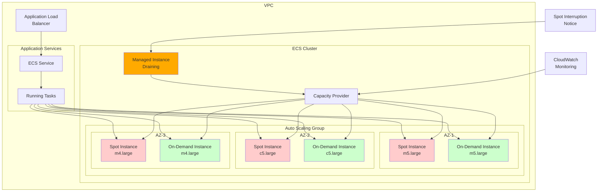

# Cost-Effective ECS Clusters with Spot Instances

## Problem

Your organization is running containerized applications on Amazon ECS with EC2 instances, but the infrastructure costs are becoming a significant portion of your cloud bill. You need to reduce EC2 costs by 50-70% while maintaining high availability and service reliability. Traditional cost optimization approaches like Reserved Instances require long-term commitments, and you want a flexible solution that can handle varying workloads without compromising application performance during peak usage periods.

## Solution

Implement Amazon ECS clusters that leverage EC2 Spot Instances through capacity providers with mixed instance types and automated scaling policies. This solution combines Spot Instances (up to 70% cost savings) with On-Demand instances for critical workloads, using managed instance draining to handle Spot interruptions gracefully. The setup includes multiple instance types across availability zones, intelligent task placement, and automatic failover mechanisms to ensure high availability despite the potential for Spot Instance interruptions.

## Architecture Diagram



## Prerequisites

1. AWS CLI v2 installed and configured with appropriate permissions
2. Existing VPC with subnets in multiple Availability Zones (3+ recommended)
3. IAM permissions for ECS, EC2, Auto Scaling, CloudWatch, and IAM services
4. Understanding of containerized applications and ECS concepts
5. Application designed to handle instance failures gracefully (stateless preferred)
6. Estimated cost: $50-150/month depending on instance types and scale (50-70% savings vs On-Demand)

> **Note**: Spot Instances can be interrupted with a 2-minute notice when AWS needs capacity back. Ensure your applications can handle restarts and maintain state externally. Review the [AWS Well-Architected Framework](https://docs.aws.amazon.com/wellarchitected/latest/framework/welcome.html) for best practices.

## Preparation

Set up the environment and create necessary IAM roles:

```bash
# Set AWS environment variables
export AWS_REGION=$(aws configure get region)
export AWS_ACCOUNT_ID=$(aws sts get-caller-identity \
    --query Account --output text)

# Generate unique identifiers for resources
RANDOM_SUFFIX=$(aws secretsmanager get-random-password \
    --exclude-punctuation --exclude-uppercase \
    --password-length 6 --require-each-included-type \
    --output text --query RandomPassword)

# Create IAM role for ECS task execution
cat > ecs-task-execution-role-policy.json << 'EOF'
{
  "Version": "2012-10-17",
  "Statement": [
    {
      "Effect": "Allow",
      "Principal": {
        "Service": "ecs-tasks.amazonaws.com"
      },
      "Action": "sts:AssumeRole"
    }
  ]
}
EOF

aws iam create-role --role-name ecsTaskExecutionRole \
    --assume-role-policy-document \
    file://ecs-task-execution-role-policy.json

aws iam attach-role-policy --role-name ecsTaskExecutionRole \
    --policy-arn arn:aws:iam::aws:policy/service-role/AmazonECSTaskExecutionRolePolicy

# Create IAM role for EC2 instances
cat > ec2-role-policy.json << 'EOF'
{
  "Version": "2012-10-17",
  "Statement": [
    {
      "Effect": "Allow",
      "Principal": {
        "Service": "ec2.amazonaws.com"
      },
      "Action": "sts:AssumeRole"
    }
  ]
}
EOF

aws iam create-role --role-name ecsInstanceRole \
    --assume-role-policy-document file://ec2-role-policy.json

aws iam attach-role-policy --role-name ecsInstanceRole \
    --policy-arn arn:aws:iam::aws:policy/service-role/AmazonEC2ContainerServiceforEC2Role

# Create instance profile
aws iam create-instance-profile \
    --instance-profile-name ecsInstanceProfile

aws iam add-role-to-instance-profile \
    --instance-profile-name ecsInstanceProfile \
    --role-name ecsInstanceRole

# Get VPC and subnet information (using default VPC for example)
VPC_ID=$(aws ec2 describe-vpcs --filters \
    "Name=is-default,Values=true" \
    --query 'Vpcs[0].VpcId' --output text)

SUBNET_IDS=$(aws ec2 describe-subnets --filters \
    "Name=vpc-id,Values=${VPC_ID}" \
    --query 'Subnets[].SubnetId' --output text)

SUBNET_1=$(echo $SUBNET_IDS | cut -d' ' -f1)
SUBNET_2=$(echo $SUBNET_IDS | cut -d' ' -f2)
SUBNET_3=$(echo $SUBNET_IDS | cut -d' ' -f3)

export VPC_ID SUBNET_1 SUBNET_2 SUBNET_3 RANDOM_SUFFIX

echo "✅ Environment configured"
echo "Using VPC: $VPC_ID"
echo "Using Subnets: $SUBNET_1, $SUBNET_2, $SUBNET_3"
```

## Steps

1. **Create an ECS cluster with Container Insights enabled**:

   Amazon ECS clusters serve as the foundational compute layer for your containerized applications, providing the logical grouping of compute resources where your tasks and services run. Container Insights enables deep visibility into your cluster's performance metrics, resource utilization patterns, and container health status through CloudWatch, which is essential for optimizing cost and performance in a mixed Spot/On-Demand environment.

   ```bash
   CLUSTER_NAME="cost-optimized-cluster-${RANDOM_SUFFIX}"
   
   aws ecs create-cluster --cluster-name $CLUSTER_NAME \
       --settings name=containerInsights,value=enabled \
       --tags key=Environment,value=production \
       key=CostOptimized,value=true
   
   export CLUSTER_NAME
   echo "✅ Created ECS cluster: $CLUSTER_NAME"
   ```

   The cluster is now established and ready to receive compute capacity from your capacity providers. Container Insights will begin collecting metrics that help you understand how Spot Instance interruptions affect your workload performance, enabling data-driven decisions about instance type selection and capacity planning. This monitoring foundation is crucial for maintaining service quality while maximizing cost savings, though it incurs additional CloudWatch charges for the detailed visibility it provides.

2. **Create a launch template for EC2 instances with mixed instance types**:

   Launch templates provide a standardized configuration blueprint for EC2 instances, ensuring consistency across your Auto Scaling Group while enabling advanced features like mixed instance policies. The ECS-optimized AMI includes the ECS container agent pre-configured to communicate with your cluster, significantly reducing instance startup time and eliminating manual configuration steps.

   ```bash
   # Get the latest ECS-optimized AMI ID
   ECS_AMI_ID=$(aws ssm get-parameters \
       --names /aws/service/ecs/optimized-ami/amazon-linux-2/recommended \
       --query 'Parameters[0].Value' --output text | \
       python3 -c "import sys, json; print(json.load(sys.stdin)['image_id'])")
   
   # Create security group for ECS instances
   SG_ID=$(aws ec2 create-security-group \
       --group-name ecs-spot-cluster-sg-${RANDOM_SUFFIX} \
       --description "Security group for ECS spot cluster" \
       --vpc-id $VPC_ID \
       --query 'GroupId' --output text)
   
   # Allow HTTP and HTTPS traffic
   aws ec2 authorize-security-group-ingress \
       --group-id $SG_ID \
       --protocol tcp --port 80 --cidr 0.0.0.0/0
   
   aws ec2 authorize-security-group-ingress \
       --group-id $SG_ID \
       --protocol tcp --port 443 --cidr 0.0.0.0/0
   
   # Allow dynamic port range for ECS tasks
   aws ec2 authorize-security-group-ingress \
       --group-id $SG_ID \
       --protocol tcp --port 32768-65535 --cidr 0.0.0.0/0
   
   # Create user data script with Spot Instance draining enabled
   cat > user-data.sh << EOF
   #!/bin/bash
   echo ECS_CLUSTER=${CLUSTER_NAME} >> /etc/ecs/ecs.config
   echo ECS_ENABLE_SPOT_INSTANCE_DRAINING=true >> /etc/ecs/ecs.config
   echo ECS_CONTAINER_STOP_TIMEOUT=60s >> /etc/ecs/ecs.config
   EOF
   
   USER_DATA=$(base64 -w 0 user-data.sh)
   
   # Create launch template
   LAUNCH_TEMPLATE_ID=$(aws ec2 create-launch-template \
       --launch-template-name ecs-spot-template-${RANDOM_SUFFIX} \
       --launch-template-data '{
           "ImageId": "'$ECS_AMI_ID'",
           "SecurityGroupIds": ["'$SG_ID'"],
           "IamInstanceProfile": {
               "Name": "ecsInstanceProfile"
           },
           "UserData": "'$USER_DATA'",
           "TagSpecifications": [{
               "ResourceType": "instance",
               "Tags": [
                   {"Key": "Name", "Value": "ECS-Spot-Instance"},
                   {"Key": "Environment", "Value": "production"},
                   {"Key": "CostOptimized", "Value": "true"}
               ]
           }]
       }' \
       --query 'LaunchTemplate.LaunchTemplateId' --output text)
   
   export ECS_AMI_ID SG_ID LAUNCH_TEMPLATE_ID
   echo "✅ Created launch template: $LAUNCH_TEMPLATE_ID"
   ```

   The launch template is now ready to provision instances with the optimal configuration for Spot Instance usage. The `ECS_ENABLE_SPOT_INSTANCE_DRAINING=true` setting enables [managed instance draining](https://docs.aws.amazon.com/AmazonECS/latest/developerguide/managed-instance-draining.html), which gracefully relocates running tasks before Spot Instance termination, ensuring minimal service disruption and maintaining your application's availability SLA.

3. **Create an Auto Scaling Group with mixed instance policy**:

   Auto Scaling Groups with mixed instance policies represent the cornerstone of cost-effective infrastructure, enabling you to combine the reliability of On-Demand instances with the cost savings of Spot Instances. The diversified allocation strategy spreads your workload across multiple instance types and Availability Zones, significantly reducing the risk of simultaneous interruptions that could impact service availability.

   ```bash
   # Create mixed instance policy configuration
   cat > mixed-instances-policy.json << EOF
   {
     "LaunchTemplate": {
       "LaunchTemplateSpecification": {
         "LaunchTemplateId": "$LAUNCH_TEMPLATE_ID",
         "Version": "\$Latest"
       },
       "Overrides": [
         {
           "InstanceType": "m5.large",
           "SubnetId": "$SUBNET_1"
         },
         {
           "InstanceType": "m4.large",
           "SubnetId": "$SUBNET_1"
         },
         {
           "InstanceType": "c5.large",
           "SubnetId": "$SUBNET_2"
         },
         {
           "InstanceType": "c4.large",
           "SubnetId": "$SUBNET_2"
         },
         {
           "InstanceType": "m5.large",
           "SubnetId": "$SUBNET_3"
         },
         {
           "InstanceType": "r5.large",
           "SubnetId": "$SUBNET_3"
         }
       ]
     },
     "InstancesDistribution": {
       "OnDemandAllocationStrategy": "prioritized",
       "OnDemandBaseCapacity": 1,
       "OnDemandPercentageAboveBaseCapacity": 20,
       "SpotAllocationStrategy": "diversified",
       "SpotInstancePools": 4,
       "SpotMaxPrice": "0.10"
     }
   }
   EOF
   
   # Create Auto Scaling Group
   ASG_NAME="ecs-spot-asg-${RANDOM_SUFFIX}"
   
   aws autoscaling create-auto-scaling-group \
       --auto-scaling-group-name $ASG_NAME \
       --min-size 1 \
       --max-size 10 \
       --desired-capacity 3 \
       --vpc-zone-identifier "$SUBNET_1,$SUBNET_2,$SUBNET_3" \
       --mixed-instances-policy file://mixed-instances-policy.json \
       --health-check-type ECS \
       --health-check-grace-period 300 \
       --tags "Key=Name,Value=ECS-Spot-ASG,PropagateAtLaunch=true,ResourceId=$ASG_NAME,ResourceType=auto-scaling-group" \
       "Key=Environment,Value=production,PropagateAtLaunch=true,ResourceId=$ASG_NAME,ResourceType=auto-scaling-group"
   
   export ASG_NAME
   echo "✅ Created Auto Scaling Group: $ASG_NAME"
   ```

   Your Auto Scaling Group now provides the intelligent instance management necessary for optimal cost-performance balance. The 20% On-Demand base capacity ensures critical workloads maintain availability, while the 80% Spot allocation delivers substantial cost savings. The diversified strategy across multiple instance types and Availability Zones minimizes interruption risk, creating a resilient foundation for your containerized applications.

   > **Tip**: The mixed instance policy ensures 20% On-Demand instances for baseline capacity while using 80% Spot Instances for cost savings. The diversified strategy spreads instances across multiple pools to reduce interruption risk. For production workloads requiring higher availability, consider increasing OnDemandPercentageAboveBaseCapacity to 30-40%. Learn more about [mixed instance groups](https://docs.aws.amazon.com/autoscaling/ec2/userguide/mixed-instances-groups-set-up-overview.html).

4. **Create an ECS capacity provider linked to the Auto Scaling Group**:

   ECS capacity providers bridge the gap between your cluster's task requirements and the underlying EC2 infrastructure, providing intelligent scaling decisions based on actual container resource needs. Managed scaling automatically adjusts your Auto Scaling Group size based on the resource requirements of pending tasks, ensuring optimal resource utilization while maintaining cost efficiency.

   ```bash
   CAPACITY_PROVIDER_NAME="spot-capacity-provider-${RANDOM_SUFFIX}"
   
   aws ecs create-capacity-provider \
       --name $CAPACITY_PROVIDER_NAME \
       --auto-scaling-group-provider '{
           "autoScalingGroupArn": "arn:aws:autoscaling:'$AWS_REGION':'$AWS_ACCOUNT_ID':autoScalingGroup:*:autoScalingGroupName/'$ASG_NAME'",
           "managedScaling": {
               "status": "ENABLED",
               "targetCapacity": 80,
               "minimumScalingStepSize": 1,
               "maximumScalingStepSize": 3
           },
           "managedTerminationProtection": "ENABLED"
       }' \
       --tags key=Environment,value=production \
       key=CostOptimized,value=true
   
   export CAPACITY_PROVIDER_NAME
   echo "✅ Created capacity provider: $CAPACITY_PROVIDER_NAME"
   ```

   The capacity provider now enables ECS to automatically manage infrastructure scaling based on actual workload demands. Managed termination protection ensures instances running tasks are not terminated during scale-in events, while the 80% target capacity setting maintains optimal resource utilization. This intelligent scaling mechanism adapts to changing application requirements while preserving the cost benefits of your mixed instance strategy.

5. **Configure cluster to use the capacity provider**:

   Associating the capacity provider with your cluster establishes the connection between your ECS services and the underlying compute infrastructure. This configuration enables ECS to make intelligent placement decisions for your tasks based on available capacity, instance health, and cost optimization goals.

   ```bash
   aws ecs put-cluster-capacity-providers \
       --cluster $CLUSTER_NAME \
       --capacity-providers $CAPACITY_PROVIDER_NAME \
       --default-capacity-provider-strategy '[{
           "capacityProvider": "'$CAPACITY_PROVIDER_NAME'",
           "weight": 1,
           "base": 0
       }]'
   
   echo "✅ Associated capacity provider with cluster"
   ```

   Your cluster is now equipped with intelligent capacity management that automatically adapts to workload demands. The capacity provider strategy directs all tasks to use your cost-optimized infrastructure, ensuring maximum utilization of Spot Instances while maintaining the reliability safeguards you've configured.

6. **Create a task definition optimized for Spot interruptions**:

   Task definitions serve as the blueprint for your containerized applications, defining resource requirements, networking configuration, and operational parameters. For Spot Instance environments, robust health checks and comprehensive logging are essential for maintaining application availability during infrastructure changes and enabling rapid problem diagnosis.

   ```bash
   cat > task-definition.json << 'EOF'
   {
     "family": "spot-resilient-app",
     "cpu": "256",
     "memory": "512",
     "networkMode": "bridge",
     "requiresCompatibilities": ["EC2"],
     "executionRoleArn": "arn:aws:iam::ACCOUNT_ID:role/ecsTaskExecutionRole",
     "containerDefinitions": [
       {
         "name": "web-server",
         "image": "public.ecr.aws/docker/library/nginx:latest",
         "cpu": 256,
         "memory": 512,
         "essential": true,
         "portMappings": [
           {
             "containerPort": 80,
             "hostPort": 0,
             "protocol": "tcp"
           }
         ],
         "logConfiguration": {
           "logDriver": "awslogs",
           "options": {
             "awslogs-group": "/ecs/spot-resilient-app",
             "awslogs-region": "REGION",
             "awslogs-stream-prefix": "ecs",
             "awslogs-create-group": "true"
           }
         },
         "healthCheck": {
           "command": ["CMD-SHELL", "curl -f http://localhost/ || exit 1"],
           "interval": 30,
           "timeout": 5,
           "retries": 3,
           "startPeriod": 60
         }
       }
     ]
   }
   EOF
   
   # Replace placeholders with actual values
   sed -i "s/ACCOUNT_ID/$AWS_ACCOUNT_ID/g" task-definition.json
   sed -i "s/REGION/$AWS_REGION/g" task-definition.json
   
   # Register task definition
   TASK_DEFINITION_ARN=$(aws ecs register-task-definition \
       --cli-input-json file://task-definition.json \
       --query 'taskDefinition.taskDefinitionArn' --output text)
   
   export TASK_DEFINITION_ARN
   echo "✅ Registered task definition: $TASK_DEFINITION_ARN"
   ```

   Your task definition now provides the resilient foundation needed for Spot Instance environments. The comprehensive health checks enable ECS to quickly detect and replace unhealthy tasks, while the centralized logging through CloudWatch facilitates operational monitoring. Dynamic port mapping maximizes instance utilization by allowing multiple tasks to coexist on the same host, increasing cost efficiency.

7. **Create an ECS service with appropriate scaling configuration**:

   ECS services provide the high-level orchestration layer that maintains your desired application state, automatically replacing failed tasks and managing deployments. The deployment configuration parameters are crucial for Spot Instance environments, where you need sufficient flexibility to handle interruptions while maintaining service availability throughout the process.

   ```bash
   SERVICE_NAME="spot-resilient-service-${RANDOM_SUFFIX}"
   
   aws ecs create-service \
       --cluster $CLUSTER_NAME \
       --service-name $SERVICE_NAME \
       --task-definition spot-resilient-app \
       --desired-count 6 \
       --capacity-provider-strategy '[{
           "capacityProvider": "'$CAPACITY_PROVIDER_NAME'",
           "weight": 1,
           "base": 2
       }]' \
       --deployment-configuration '{
           "maximumPercent": 200,
           "minimumHealthyPercent": 50,
           "deploymentCircuitBreaker": {
               "enable": true,
               "rollback": true
           }
       }' \
       --tags key=Environment,value=production \
       key=CostOptimized,value=true
   
   export SERVICE_NAME
   echo "✅ Created ECS service: $SERVICE_NAME"
   ```

   Your service is now actively maintaining the desired application state with built-in resilience for Spot Instance interruptions. The 50% minimum healthy percent provides sufficient flexibility for task replacement during interruptions, while the circuit breaker automatically prevents and rolls back problematic deployments. This configuration ensures continuous service availability even during infrastructure changes.

   > **Warning**: During Spot interruptions, tasks may be forcibly stopped with only 2 minutes notice. Ensure your application can handle abrupt terminations and maintain state externally (e.g., in databases or external storage). Configure appropriate health checks and implement graceful shutdown handlers in your containers. Review the [managed instance draining documentation](https://docs.aws.amazon.com/AmazonECS/latest/developerguide/managed-instance-draining.html) for best practices.

8. **Set up service auto scaling to handle capacity changes**:

   Application Auto Scaling provides dynamic capacity management that responds to actual workload demands, ensuring optimal resource utilization while maintaining performance standards. In Spot Instance environments, responsive scaling is particularly important as it enables rapid recovery from interruptions and adapts to changing instance availability across different pools.

   ```bash
   # Register scalable target
   aws application-autoscaling register-scalable-target \
       --service-namespace ecs \
       --resource-id service/$CLUSTER_NAME/$SERVICE_NAME \
       --scalable-dimension ecs:service:DesiredCount \
       --min-capacity 2 \
       --max-capacity 20
   
   # Create target tracking scaling policy
   aws application-autoscaling put-scaling-policy \
       --service-namespace ecs \
       --resource-id service/$CLUSTER_NAME/$SERVICE_NAME \
       --scalable-dimension ecs:service:DesiredCount \
       --policy-name cpu-target-tracking-${RANDOM_SUFFIX} \
       --policy-type TargetTrackingScaling \
       --target-tracking-scaling-policy-configuration '{
           "TargetValue": 60.0,
           "PredefinedMetricSpecification": {
               "PredefinedMetricType": "ECSServiceAverageCPUUtilization"
           },
           "ScaleOutCooldown": 300,
           "ScaleInCooldown": 300
       }'
   
   echo "✅ Configured auto scaling for service"
   ```

   Your application now automatically maintains optimal performance levels regardless of traffic variations or infrastructure changes. The target tracking policy ensures consistent resource utilization at 60% CPU, providing headroom for traffic spikes while maximizing cost efficiency. During Spot interruptions, the scaling system rapidly replaces lost capacity, maintaining service quality and user experience.

## Validation & Testing

1. **Verify that the cluster and capacity provider are properly configured**:

   ```bash
   # Check cluster status
   aws ecs describe-clusters --clusters $CLUSTER_NAME \
       --query 'clusters[0].[clusterName,status,capacityProviders[0]]' \
       --output table
   
   # Verify capacity provider details
   aws ecs describe-capacity-providers \
       --capacity-providers $CAPACITY_PROVIDER_NAME \
       --query 'capacityProviders[0].[name,status,autoScalingGroupProvider.managedScaling.status]' \
       --output table
   ```

   Expected output should show cluster as "ACTIVE" and capacity provider as "ACTIVE" with managed scaling "ENABLED".

2. **Confirm that instances are running with mixed Spot and On-Demand**:

   ```bash
   # Check Auto Scaling Group instances
   aws autoscaling describe-auto-scaling-groups \
       --auto-scaling-group-names $ASG_NAME \
       --query 'AutoScalingGroups[0].Instances[*].[InstanceId,InstanceType,LifecycleState]' \
       --output table
   
   # Check instance lifecycle (Spot vs On-Demand)
   ASG_INSTANCE_IDS=$(aws autoscaling describe-auto-scaling-groups \
       --auto-scaling-group-names $ASG_NAME \
       --query 'AutoScalingGroups[0].Instances[*].InstanceId' \
       --output text)
   
   for instance in $ASG_INSTANCE_IDS; do
       LIFECYCLE=$(aws ec2 describe-instances \
           --instance-ids $instance \
           --query 'Reservations[0].Instances[0].InstanceLifecycle' \
           --output text)
       INSTANCE_TYPE=$(aws ec2 describe-instances \
           --instance-ids $instance \
           --query 'Reservations[0].Instances[0].InstanceType' \
           --output text)
       echo "Instance $instance: Type=$INSTANCE_TYPE, Lifecycle=${LIFECYCLE:-on-demand}"
   done
   ```

3. **Verify that ECS tasks are running and properly distributed**:

   ```bash
   # Check service status
   aws ecs describe-services \
       --cluster $CLUSTER_NAME \
       --services $SERVICE_NAME \
       --query 'services[0].[serviceName,status,runningCount,pendingCount,desiredCount]' \
       --output table
   
   # Check task distribution across instances
   aws ecs list-tasks --cluster $CLUSTER_NAME \
       --service-name $SERVICE_NAME \
       --query 'taskArns[*]' --output text | \
       xargs -I {} aws ecs describe-tasks \
       --cluster $CLUSTER_NAME --tasks {} \
       --query 'tasks[*].[taskArn,lastStatus,containerInstanceArn]' \
       --output table
   ```

4. **Test cost savings by comparing current costs**:

   ```bash
   # Get current Spot price information
   aws ec2 describe-spot-price-history \
       --instance-types m5.large c5.large m4.large r5.large c4.large \
       --product-descriptions "Linux/UNIX" \
       --max-items 10 \
       --query 'SpotPriceHistory[*].[InstanceType,SpotPrice,AvailabilityZone]' \
       --output table
   
   echo "💰 Cost Analysis:"
   echo "Spot instances can provide 50-70% savings compared to On-Demand pricing"
   echo "Monitor AWS Cost Explorer for actual savings over time"
   ```

5. **Verify managed instance draining is working**:

   ```bash
   # Check ECS agent configuration on instances
   CONTAINER_INSTANCE_ARN=$(aws ecs list-container-instances \
       --cluster $CLUSTER_NAME \
       --query 'containerInstanceArns[0]' --output text)
   
   if [ "$CONTAINER_INSTANCE_ARN" != "None" ]; then
       aws ecs describe-container-instances \
           --cluster $CLUSTER_NAME \
           --container-instances $CONTAINER_INSTANCE_ARN \
           --query 'containerInstances[0].[containerInstanceArn,status,runningTasksCount]' \
           --output table
       echo "✅ Container instances are properly registered"
   fi
   ```

## Cleanup

1. **Scale down and delete the ECS service**:

   ```bash
   # Scale service to 0
   aws ecs update-service \
       --cluster $CLUSTER_NAME \
       --service $SERVICE_NAME \
       --desired-count 0
   
   # Wait for tasks to stop
   aws ecs wait services-stable \
       --cluster $CLUSTER_NAME \
       --services $SERVICE_NAME
   
   # Delete the service
   aws ecs delete-service \
       --cluster $CLUSTER_NAME \
       --service $SERVICE_NAME
   
   echo "✅ ECS service deleted"
   ```

2. **Remove auto scaling configuration**:

   ```bash
   # Deregister scalable target
   aws application-autoscaling deregister-scalable-target \
       --service-namespace ecs \
       --resource-id service/$CLUSTER_NAME/$SERVICE_NAME \
       --scalable-dimension ecs:service:DesiredCount
   
   echo "✅ Auto scaling configuration removed"
   ```

3. **Delete capacity provider and cluster**:

   ```bash
   # Remove capacity provider from cluster
   aws ecs put-cluster-capacity-providers \
       --cluster $CLUSTER_NAME \
       --capacity-providers \
       --default-capacity-provider-strategy
   
   # Delete capacity provider
   aws ecs delete-capacity-provider \
       --capacity-provider $CAPACITY_PROVIDER_NAME
   
   # Delete cluster
   aws ecs delete-cluster --cluster $CLUSTER_NAME
   
   echo "✅ ECS cluster and capacity provider deleted"
   ```

4. **Delete Auto Scaling Group and launch template**:

   ```bash
   # Update ASG to 0 instances
   aws autoscaling update-auto-scaling-group \
       --auto-scaling-group-name $ASG_NAME \
       --min-size 0 --max-size 0 --desired-capacity 0
   
   # Wait for instances to terminate
   echo "Waiting for instances to terminate..."
   sleep 120
   
   # Delete Auto Scaling Group
   aws autoscaling delete-auto-scaling-group \
       --auto-scaling-group-name $ASG_NAME
   
   # Delete launch template
   aws ec2 delete-launch-template \
       --launch-template-id $LAUNCH_TEMPLATE_ID
   
   echo "✅ Auto Scaling Group and launch template deleted"
   ```

5. **Clean up IAM roles and security groups**:

   ```bash
   # Remove role from instance profile
   aws iam remove-role-from-instance-profile \
       --instance-profile-name ecsInstanceProfile \
       --role-name ecsInstanceRole
   
   # Delete instance profile
   aws iam delete-instance-profile \
       --instance-profile-name ecsInstanceProfile
   
   # Detach policies and delete roles
   aws iam detach-role-policy --role-name ecsInstanceRole \
       --policy-arn arn:aws:iam::aws:policy/service-role/AmazonEC2ContainerServiceforEC2Role
   
   aws iam detach-role-policy --role-name ecsTaskExecutionRole \
       --policy-arn arn:aws:iam::aws:policy/service-role/AmazonECSTaskExecutionRolePolicy
   
   aws iam delete-role --role-name ecsInstanceRole
   aws iam delete-role --role-name ecsTaskExecutionRole
   
   # Delete security group
   aws ec2 delete-security-group --group-id $SG_ID
   
   # Clean up files
   rm -f ecs-task-execution-role-policy.json
   rm -f ec2-role-policy.json
   rm -f mixed-instances-policy.json
   rm -f task-definition.json
   rm -f user-data.sh
   
   echo "✅ IAM roles, security groups, and files cleaned up"
   ```

6. **Verify cleanup completion**:

   ```bash
   echo "Verifying cleanup..."
   
   # Check if cluster still exists
   aws ecs describe-clusters --clusters $CLUSTER_NAME \
       --query 'clusters[0].status' --output text 2>/dev/null || \
       echo "✅ ECS cluster successfully deleted"
   
   # Check if Auto Scaling Group still exists
   aws autoscaling describe-auto-scaling-groups \
       --auto-scaling-group-names $ASG_NAME \
       --query 'AutoScalingGroups[0].AutoScalingGroupName' \
       --output text 2>/dev/null || \
       echo "✅ Auto Scaling Group successfully deleted"
   
   echo "✅ Cleanup verification complete"
   ```

## Discussion

This recipe demonstrates how to achieve significant cost savings (50-70%) by leveraging EC2 Spot Instances within Amazon ECS clusters while maintaining high availability and service reliability. The key to success with Spot Instances lies in implementing proper diversification strategies and graceful handling of interruptions, following AWS Well-Architected Framework principles.

The mixed instance policy spreads your workload across multiple instance types and Availability Zones, reducing the risk of simultaneous interruptions. By maintaining a small base of On-Demand instances (20% in this example), you ensure that critical services remain available even during Spot capacity shortages. The capacity provider's managed scaling automatically adjusts the infrastructure based on task requirements, while [managed instance draining](https://docs.aws.amazon.com/AmazonECS/latest/developerguide/managed-instance-draining.html) ensures that running tasks are gracefully moved before Spot Instances are terminated.

The managed termination protection feature prevents ECS from terminating instances that are running tasks during scale-in events, while still allowing natural replacement through Spot interruptions or instance refresh. This balance ensures cost optimization without sacrificing application availability. Organizations implementing this pattern typically see 50-70% cost reduction compared to pure On-Demand deployments, with the exact savings depending on Spot availability in their chosen regions and instance types.

When designing applications for Spot Instance usage, consider implementing circuit breakers, external state management, and health checks that can quickly detect and recover from instance interruptions. Applications should be stateless where possible, with any persistent data stored in external services like RDS, DynamoDB, or EFS. The auto scaling configuration ensures that service capacity automatically adjusts when Spot interruptions occur, maintaining the desired service levels while AWS launches replacement instances. Review the [AWS Cost Optimization Pillar](https://docs.aws.amazon.com/wellarchitected/latest/cost-optimization-pillar/welcome.html) for additional cost management strategies.

> **Note**: This configuration follows AWS Well-Architected Framework principles for cost optimization and reliability. Monitor your application's performance metrics and Spot interruption rates to fine-tune the On-Demand percentage and instance type selection for optimal results.

## Challenge

Extend this setup to implement advanced cost optimization and resilience patterns:

1. **Blue/Green Deployment Strategy**: Create a secondary capacity provider using a different set of instance types and availability zones, then implement automated failover between the two capacity providers during deployments.

2. **Dynamic Spot Pricing Optimization**: Set up CloudWatch alarms and Lambda functions to monitor Spot interruption rates and automatically adjust the On-Demand percentage when interruption rates exceed acceptable thresholds for your application's SLA requirements.

3. **Multi-Region Failover**: Implement a cross-region ECS setup with automatic failover capabilities using Route 53 health checks and weighted routing policies.

4. **Advanced Monitoring Dashboard**: Create a comprehensive CloudWatch dashboard that tracks cost savings, interruption rates, task health, and performance metrics with automated alerting for operational issues.

5. **Container Image Optimization**: Implement automated container image scanning and optimization using Amazon ECR with lifecycle policies to reduce storage costs and improve deployment speed.

## Infrastructure Code

*Infrastructure code will be generated after recipe approval.*