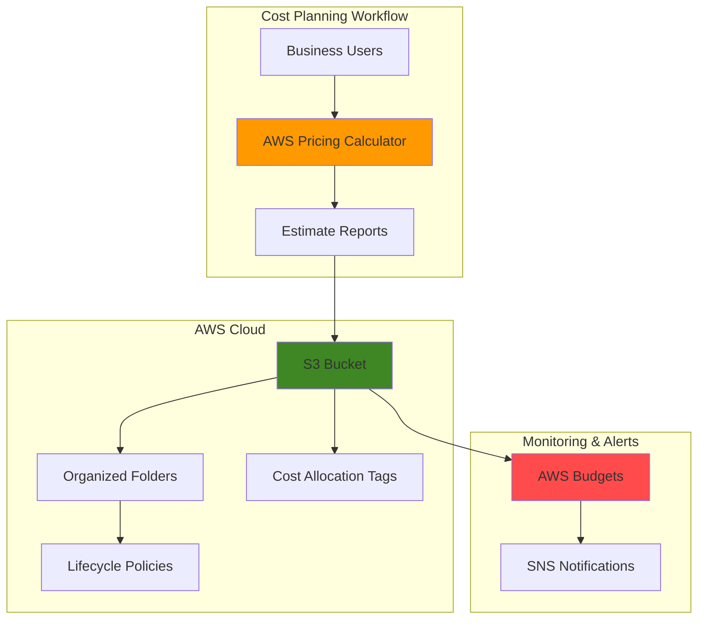

# Cost Estimation Planning with Pricing Calculator and S3

## Problem

Organizations struggle to accurately predict AWS costs before deploying resources, leading to budget overruns and unexpected billing surprises. Finance teams need detailed cost estimates for planning and approval processes, but these estimates are often scattered across email attachments and local spreadsheets, making them difficult to track, version, and share with stakeholders for informed decision-making.

## Solution

Use AWS Pricing Calculator to create detailed cost estimates for planned AWS resources, then automatically store these estimates in S3 with organized folder structures and lifecycle policies. This approach centralizes cost planning documentation, enables version control of estimates, and provides a searchable repository of historical pricing data for future reference and budget planning.

## Architecture Diagram



## Prerequisites

1. AWS account with appropriate permissions for S3, Budgets, and SNS
2. AWS CLI installed and configured (or AWS CloudShell access)
3. Basic understanding of AWS services and cost optimization concepts
4. Web browser to access AWS Pricing Calculator console
5. Estimated cost: $0.50-$2.00/month for S3 storage and minimal budget alerts

> **Note**: AWS Pricing Calculator is free to use. Costs are only for S3 storage of estimate files and optional budget notifications.

## Preparation

```bash
# Set environment variables
export AWS_REGION=$(aws configure get region)
export AWS_ACCOUNT_ID=$(aws sts get-caller-identity \
    --query Account --output text)

# Generate unique identifiers for resources
RANDOM_SUFFIX=$(aws secretsmanager get-random-password \
    --exclude-punctuation --exclude-uppercase \
    --password-length 6 --require-each-included-type \
    --output text --query RandomPassword)

# Set bucket name for cost estimates
export BUCKET_NAME="cost-estimates-${RANDOM_SUFFIX}"
export PROJECT_NAME="web-app-migration"

echo "✅ AWS environment configured for cost estimation planning"
echo "Bucket name: ${BUCKET_NAME}"
echo "Project: ${PROJECT_NAME}"
```

## Steps

1. **Create S3 Bucket for Cost Estimates Storage**:

   S3 provides the ideal repository for cost estimation documents with its 99.999999999% (11 9's) durability and flexible access controls. Creating a dedicated bucket establishes centralized storage for all pricing estimates, supporting version control and team collaboration while enabling automated lifecycle management to optimize storage costs over time.

   ```bash
   # Create S3 bucket for cost estimates
   aws s3api create-bucket \
       --bucket ${BUCKET_NAME} \
       --region ${AWS_REGION}
   
   # Enable versioning for estimate history tracking
   aws s3api put-bucket-versioning \
       --bucket ${BUCKET_NAME} \
       --versioning-configuration Status=Enabled
   
   # Apply server-side encryption for security
   aws s3api put-bucket-encryption \
       --bucket ${BUCKET_NAME} \
       --server-side-encryption-configuration \
       'Rules=[{ApplyServerSideEncryptionByDefault:{SSEAlgorithm:AES256}}]'
   
   echo "✅ S3 bucket created with security and versioning enabled"
   ```

2. **Create Organized Folder Structure for Cost Estimates**:

   Implementing a logical folder structure enables systematic organization of cost estimates by project, department, or timeline. This organizational approach supports easy retrieval of historical estimates and facilitates cross-project cost comparisons for better budgeting accuracy and financial planning processes.

   ```bash
   # Create folder structure for cost estimates
   aws s3api put-object \
       --bucket ${BUCKET_NAME} \
       --key "estimates/2025/Q1/" \
       --content-length 0
   
   aws s3api put-object \
       --bucket ${BUCKET_NAME} \
       --key "estimates/2025/Q2/" \
       --content-length 0
   
   aws s3api put-object \
       --bucket ${BUCKET_NAME} \
       --key "projects/${PROJECT_NAME}/" \
       --content-length 0
   
   aws s3api put-object \
       --bucket ${BUCKET_NAME} \
       --key "archived/" \
       --content-length 0
   
   echo "✅ Organized folder structure created for cost estimates"
   ```

3. **Configure Lifecycle Policy for Cost Optimization**:

   S3 lifecycle policies automatically transition estimate files to lower-cost storage classes as they age, optimizing storage costs while maintaining accessibility. This configuration ensures recent estimates remain immediately accessible while older historical data moves to more cost-effective storage tiers, supporting long-term cost management best practices.

   ```bash
   # Create lifecycle policy for cost optimization
   cat > lifecycle-policy.json << 'EOF'
   {
       "Rules": [
           {
               "ID": "CostEstimateLifecycle",
               "Status": "Enabled",
               "Filter": {"Prefix": "estimates/"},
               "Transitions": [
                   {
                       "Days": 30,
                       "StorageClass": "STANDARD_IA"
                   },
                   {
                       "Days": 90,
                       "StorageClass": "GLACIER"
                   },
                   {
                       "Days": 365,
                       "StorageClass": "DEEP_ARCHIVE"
                   }
               ]
           }
       ]
   }
   EOF
   
   # Apply lifecycle policy to bucket
   aws s3api put-bucket-lifecycle-configuration \
       --bucket ${BUCKET_NAME} \
       --lifecycle-configuration file://lifecycle-policy.json
   
   echo "✅ Lifecycle policy configured for automatic cost optimization"
   ```

4. **Create Cost Estimate Using AWS Pricing Calculator**:

   AWS Pricing Calculator provides transparent, detailed cost modeling for AWS services without requiring any prior cloud experience. This web-based tool enables exploration of different service configurations, payment options, and architectural scenarios to generate accurate estimates that include upfront, monthly, and annual costs for informed decision-making.

   ```bash
   # Display instructions for manual Pricing Calculator usage
   echo "=== AWS Pricing Calculator Instructions ==="
   echo "1. Open web browser to: https://calculator.aws/#/"
   echo "2. Click 'Create estimate' to start new calculation"
   echo "3. Add services for your ${PROJECT_NAME} project:"
   echo "   - Select 'Amazon EC2' for compute resources"
   echo "   - Choose instance type (e.g., t3.medium)"
   echo "   - Set quantity and usage pattern"
   echo "   - Add 'Amazon S3' for storage needs"
   echo "   - Configure storage amount and access pattern"
   echo "4. Review estimate details and calculations"
   echo "5. Save estimate with name: ${PROJECT_NAME}-$(date +%Y%m%d)"
   echo "6. Export estimate as PDF and CSV"
   echo ""
   echo "✅ Pricing Calculator instructions prepared"
   
   # Create placeholder file for estimate tracking
   echo "Estimate created on $(date)" > estimate-tracking.txt
   echo "Project: ${PROJECT_NAME}" >> estimate-tracking.txt
   echo "Calculator URL: https://calculator.aws/#/" >> estimate-tracking.txt
   ```

5. **Upload Cost Estimates to S3 with Metadata Tags**:

   Uploading estimate files to S3 with comprehensive metadata tags enables powerful cost tracking and allocation capabilities. Tagging supports automated billing reports, department chargebacks, and project cost analysis while providing searchable attributes for quick estimate retrieval across large organizations.

   ```bash
   # Create sample estimate file for demonstration
   cat > sample-estimate.csv << 'EOF'
   Service,Configuration,Monthly Cost,Annual Cost
   Amazon EC2,t3.medium Linux,30.37,364.44
   Amazon S3,100GB Standard Storage,2.30,27.60
   Amazon RDS,db.t3.micro PostgreSQL,13.32,159.84
   Total,,46.99,563.88
   EOF
   
   # Upload estimate with tags and metadata
   aws s3 cp sample-estimate.csv \
       s3://${BUCKET_NAME}/projects/${PROJECT_NAME}/estimate-$(date +%Y%m%d).csv \
       --metadata "project=${PROJECT_NAME},created-by=cost-team,estimate-date=$(date +%Y-%m-%d)" \
       --tagging "Project=${PROJECT_NAME}&Department=Finance&EstimateType=Monthly"
   
   # Create estimate summary document
   cat > estimate-summary.txt << EOF
   Cost Estimate Summary - ${PROJECT_NAME}
   Generated: $(date)
   
   Estimated Monthly Cost: $46.99
   Estimated Annual Cost: $563.88
   
   Services Included:
   - EC2 t3.medium instance
   - S3 storage (100GB)
   - RDS PostgreSQL database
   
   Notes: This estimate assumes standard usage patterns
   EOF
   
   aws s3 cp estimate-summary.txt \
       s3://${BUCKET_NAME}/projects/${PROJECT_NAME}/summary-$(date +%Y%m%d).txt
   
   echo "✅ Cost estimates uploaded to S3 with metadata and tags"
   ```

6. **Create Budget Alert for Estimate Tracking**:

   AWS Budgets provides proactive cost monitoring by sending alerts when spending approaches estimated amounts. Setting up budget alerts creates an early warning system that helps teams stay within planned costs and enables rapid response to unexpected usage spikes or cost overruns before they impact the organization significantly.

   ```bash
   # Create budget for the estimated project costs
   cat > budget-policy.json << EOF
   {
       "BudgetName": "${PROJECT_NAME}-budget",
       "BudgetLimit": {
           "Amount": "50.00",
           "Unit": "USD"
       },
       "TimeUnit": "MONTHLY",
       "BudgetType": "COST",
       "CostFilters": {
           "TagKey": ["Project"],
           "TagValue": ["${PROJECT_NAME}"]
       }
   }
   EOF
   
   # Create SNS topic for budget notifications
   aws sns create-topic --name ${PROJECT_NAME}-budget-alerts
   
   # Get SNS topic ARN
   TOPIC_ARN=$(aws sns get-topic-attributes \
       --topic-arn arn:aws:sns:${AWS_REGION}:${AWS_ACCOUNT_ID}:${PROJECT_NAME}-budget-alerts \
       --query 'Attributes.TopicArn' --output text)
   
   # Create budget with notification
   aws budgets create-budget \
       --account-id ${AWS_ACCOUNT_ID} \
       --budget file://budget-policy.json \
       --notifications-with-subscribers '[{
           "Notification": {
               "NotificationType": "ACTUAL",
               "ComparisonOperator": "GREATER_THAN",
               "Threshold": 80,
               "ThresholdType": "PERCENTAGE"
           },
           "Subscribers": [{
               "SubscriptionType": "SNS",
               "Address": "'${TOPIC_ARN}'"
           }]
       }]'
   
   echo "✅ Budget created with 80% threshold alert for estimated costs"
   ```

## Validation & Testing

1. **Verify S3 bucket and folder structure**:

   ```bash
   # List bucket contents to verify organization
   aws s3 ls s3://${BUCKET_NAME}/ --recursive
   ```

   Expected output: Folder structure with estimates/, projects/, and archived/ directories

2. **Test estimate file uploads and metadata**:

   ```bash
   # Verify uploaded files with metadata
   aws s3api head-object \
       --bucket ${BUCKET_NAME} \
       --key "projects/${PROJECT_NAME}/estimate-$(date +%Y%m%d).csv"
   ```

   Expected output: Object metadata including project tags and creation date

3. **Validate lifecycle policy configuration**:

   ```bash
   # Check lifecycle configuration
   aws s3api get-bucket-lifecycle-configuration \
       --bucket ${BUCKET_NAME}
   ```

   Expected output: Lifecycle rules showing transition policies for cost optimization

4. **Confirm budget and alert setup**:

   ```bash
   # Verify budget creation
   aws budgets describe-budget \
       --account-id ${AWS_ACCOUNT_ID} \
       --budget-name ${PROJECT_NAME}-budget
   ```

   Expected output: Budget details with $50 monthly limit and 80% alert threshold

## Cleanup

1. **Remove budget and SNS topic**:

   ```bash
   # Delete budget
   aws budgets delete-budget \
       --account-id ${AWS_ACCOUNT_ID} \
       --budget-name ${PROJECT_NAME}-budget
   
   # Delete SNS topic
   aws sns delete-topic \
       --topic-arn arn:aws:sns:${AWS_REGION}:${AWS_ACCOUNT_ID}:${PROJECT_NAME}-budget-alerts
   
   echo "✅ Budget and notifications cleaned up"
   ```

2. **Remove S3 bucket and all contents**:

   ```bash
   # Delete all objects in bucket (including versions)
   aws s3 rm s3://${BUCKET_NAME} --recursive
   
   # Delete all object versions and delete markers
   aws s3api delete-objects \
       --bucket ${BUCKET_NAME} \
       --delete "$(aws s3api list-object-versions \
           --bucket ${BUCKET_NAME} \
           --query '{Objects: Versions[].{Key:Key,VersionId:VersionId}}')"
   
   # Delete bucket
   aws s3api delete-bucket --bucket ${BUCKET_NAME} --region ${AWS_REGION}
   
   echo "✅ S3 bucket and all estimate files deleted"
   ```

3. **Clean up local files**:

   ```bash
   # Remove local temporary files
   rm -f lifecycle-policy.json budget-policy.json
   rm -f sample-estimate.csv estimate-summary.txt estimate-tracking.txt
   
   echo "✅ Local temporary files cleaned up"
   ```

## Discussion

AWS Pricing Calculator serves as the foundation for accurate cost planning by providing transparent, detailed estimates without requiring AWS experience or resource deployment. The tool's web-based interface enables exploration of different service configurations, payment options, and architectural scenarios to generate comprehensive cost models. By systematically storing these estimates in S3, organizations create a centralized repository of pricing intelligence that supports informed decision-making and budget planning processes.

The integration of S3 storage classes and lifecycle policies demonstrates AWS cost optimization principles in practice. Recent estimates remain in S3 Standard for immediate access, while older historical data automatically transitions to more cost-effective storage tiers like Standard-IA, Glacier, and Deep Archive. This approach balances accessibility requirements with cost efficiency, ensuring long-term estimate retention without excessive storage expenses while following the AWS Well-Architected Framework's cost optimization pillar.

The combination of detailed cost estimates, organized storage, and proactive budget monitoring creates a comprehensive cost management framework that aligns with enterprise financial governance requirements. AWS Budgets provides early warning capabilities that help teams stay within planned spending limits, while SNS notifications ensure rapid response to cost anomalies. This systematic approach to cost planning and monitoring supports both operational efficiency and financial governance across cloud deployments.

The tagging strategy implemented in this solution enables powerful cost allocation and reporting capabilities that integrate with AWS Cost Explorer and billing reports. By consistently applying project, department, and estimate type tags, organizations can generate detailed billing reports, implement chargeback systems, and analyze spending patterns across different business units. This metadata-driven approach supports enterprise cost management requirements while maintaining flexibility for various organizational structures and reporting needs.

> **Tip**: Use AWS Cost Explorer to analyze actual spending against your estimates and refine future pricing predictions based on real usage patterns. This creates a feedback loop for improving estimate accuracy over time.

**Documentation Sources:**
- [AWS Pricing Calculator User Guide](https://docs.aws.amazon.com/pricing-calculator/latest/userguide/what-is-pricing-calculator.html)
- [Amazon S3 Cost Optimization](https://docs.aws.amazon.com/AmazonS3/latest/userguide/cost-optimization.html)
- [AWS Budgets Managing Costs](https://docs.aws.amazon.com/cost-management/latest/userguide/budgets-managing-costs.html)
- [S3 Object Lifecycle Management](https://docs.aws.amazon.com/AmazonS3/latest/userguide/object-lifecycle-mgmt.html)
- [AWS Well-Architected Cost Optimization Pillar](https://docs.aws.amazon.com/wellarchitected/latest/cost-optimization-pillar/welcome.html)

## Challenge

Extend this cost estimation solution by implementing these enhancements in order of increasing complexity:

1. **Automated Report Generation**: Create Lambda functions that periodically scrape saved Pricing Calculator estimates and generate executive summary reports in PDF format using libraries like ReportLab
2. **Multi-Account Cost Aggregation**: Use AWS Organizations to collect estimates from multiple AWS accounts and create consolidated cost planning dashboards using CrossAccountRole permissions
3. **Historical Cost Analysis**: Build analytics pipelines using Athena and QuickSight to analyze estimate accuracy against actual spending over time, identifying patterns and improving forecasting models
4. **Integration with ITSM Tools**: Connect the S3 estimate repository with ServiceNow or Jira Service Management to automatically attach cost estimates to infrastructure change requests and approval workflows
5. **Advanced Alerting with Machine Learning**: Implement CloudWatch custom metrics and Amazon Forecast to monitor estimate file updates and predict cost overruns using historical data patterns

## Infrastructure Code

### Available Infrastructure as Code:

- [Infrastructure Code Overview](code/README.md) - Detailed description of all infrastructure components
- [AWS CDK (Python)](code/cdk-python/) - AWS CDK Python implementation
- [AWS CDK (TypeScript)](code/cdk-typescript/) - AWS CDK TypeScript implementation
- [CloudFormation](code/cloudformation.yaml) - AWS CloudFormation template
- [Bash CLI Scripts](code/scripts/) - Example bash scripts using AWS CLI commands to deploy infrastructure
- [Terraform](code/terraform/) - Terraform configuration files