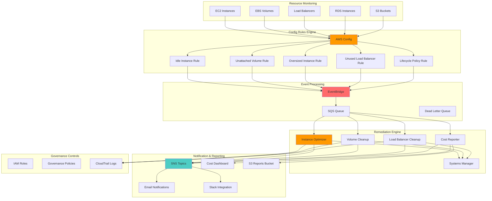

# Cost Governance Automation with Config

## Problem

Organizations often discover cost optimization opportunities too late, after expensive resources have been running for extended periods without proper oversight. Manual cost governance processes are reactive, time-consuming, and prone to human error, leading to significant budget overruns from orphaned resources, oversized instances, unattached storage volumes, and idle load balancers. Finance teams need proactive, automated mechanisms to detect and remediate cost-inefficient configurations before they accumulate substantial charges.

## Solution

This solution implements a comprehensive automated cost governance framework using AWS Config rules for continuous monitoring and Lambda functions for automatic remediation. The system detects cost-inefficient resource configurations in real-time, automatically applies approved remediation actions, and provides detailed reporting for governance oversight. By combining preventive controls with automated corrective measures, organizations can maintain cost discipline while reducing operational overhead.

## Architecture Diagram



## Prerequisites

1. AWS account with appropriate permissions for Config, Lambda, and Systems Manager
2. AWS CLI v2 installed and configured with administrator access
3. Understanding of JSON and Python for Lambda function development
4. Knowledge of AWS Config rules and remediation actions
5. Estimated cost: $100-200/month for Config rules, Lambda executions, and storage

> **Note**: AWS Config charges per configuration item recorded and per rule evaluation. Consider costs when enabling in large environments. See the [AWS Config pricing documentation](https://docs.aws.amazon.com/config/latest/developerguide/WhatIsConfig.html) for detailed cost considerations.

## Preparation

```bash
# Set environment variables
export AWS_REGION=$(aws configure get region)
export AWS_ACCOUNT_ID=$(aws sts get-caller-identity \
    --query Account --output text)

# Generate unique identifiers
RANDOM_SUFFIX=$(aws secretsmanager get-random-password \
    --exclude-punctuation --exclude-uppercase \
    --password-length 6 --require-each-included-type \
    --output text --query RandomPassword)

export COST_GOVERNANCE_BUCKET="cost-governance-${RANDOM_SUFFIX}"
export CONFIG_BUCKET="aws-config-${RANDOM_SUFFIX}"
export LAMBDA_ROLE_NAME="CostGovernanceLambdaRole"
export CONFIG_ROLE_NAME="AWSConfigRole"

# Create S3 buckets for Config and reports
aws s3 mb s3://${CONFIG_BUCKET} \
    --region ${AWS_REGION}

aws s3 mb s3://${COST_GOVERNANCE_BUCKET} \
    --region ${AWS_REGION}

# Enable S3 bucket versioning for compliance
aws s3api put-bucket-versioning \
    --bucket ${CONFIG_BUCKET} \
    --versioning-configuration Status=Enabled

aws s3api put-bucket-versioning \
    --bucket ${COST_GOVERNANCE_BUCKET} \
    --versioning-configuration Status=Enabled

echo "✅ Created foundational S3 buckets"
```

## Steps

1. **Create IAM Roles for Cost Governance**:

   IAM roles are the foundation of secure AWS automation, enabling Lambda functions to interact with AWS services using temporary credentials instead of long-term access keys. This step establishes the security perimeter for our cost governance system by implementing the principle of least privilege - granting only the specific permissions required for cost optimization actions. Following [AWS IAM security best practices](https://docs.aws.amazon.com/IAM/latest/UserGuide/best-practices.html), these roles ensure our automation can safely manage resources while maintaining audit trails and preventing unauthorized access.

   ```bash
   # Create Lambda execution role for cost governance
   cat > lambda-trust-policy.json << 'EOF'
   {
       "Version": "2012-10-17",
       "Statement": [
           {
               "Effect": "Allow",
               "Principal": {
                   "Service": "lambda.amazonaws.com"
               },
               "Action": "sts:AssumeRole"
           }
       ]
   }
   EOF
   
   # Create the Lambda role
   aws iam create-role \
       --role-name ${LAMBDA_ROLE_NAME} \
       --assume-role-policy-document file://lambda-trust-policy.json \
       --description "Role for cost governance Lambda functions"
   
   # Create comprehensive Lambda policy for cost governance
   cat > lambda-cost-governance-policy.json << 'EOF'
   {
       "Version": "2012-10-17",
       "Statement": [
           {
               "Effect": "Allow",
               "Action": [
                   "logs:CreateLogGroup",
                   "logs:CreateLogStream",
                   "logs:PutLogEvents"
               ],
               "Resource": "arn:aws:logs:*:*:*"
           },
           {
               "Effect": "Allow",
               "Action": [
                   "ec2:DescribeInstances",
                   "ec2:DescribeVolumes",
                   "ec2:StopInstances",
                   "ec2:TerminateInstances",
                   "ec2:ModifyInstanceAttribute",
                   "ec2:DeleteVolume",
                   "ec2:DetachVolume",
                   "ec2:CreateSnapshot",
                   "ec2:DescribeSnapshots",
                   "ec2:CreateTags",
                   "cloudwatch:GetMetricStatistics"
               ],
               "Resource": "*"
           },
           {
               "Effect": "Allow",
               "Action": [
                   "elasticloadbalancing:DescribeLoadBalancers",
                   "elasticloadbalancing:DescribeTargetGroups",
                   "elasticloadbalancing:DescribeTargetHealth",
                   "elasticloadbalancing:DeleteLoadBalancer",
                   "elasticloadbalancing:AddTags"
               ],
               "Resource": "*"
           },
           {
               "Effect": "Allow",
               "Action": [
                   "rds:DescribeDBInstances",
                   "rds:DescribeDBClusters",
                   "rds:StopDBInstance",
                   "rds:StopDBCluster",
                   "rds:DeleteDBInstance",
                   "rds:AddTagsToResource"
               ],
               "Resource": "*"
           },
           {
               "Effect": "Allow",
               "Action": [
                   "s3:GetObject",
                   "s3:PutObject",
                   "s3:GetBucketLocation",
                   "s3:ListBucket",
                   "s3:PutBucketLifecycleConfiguration",
                   "s3:GetBucketLifecycleConfiguration"
               ],
               "Resource": [
                   "arn:aws:s3:::${COST_GOVERNANCE_BUCKET}",
                   "arn:aws:s3:::${COST_GOVERNANCE_BUCKET}/*"
               ]
           },
           {
               "Effect": "Allow",
               "Action": [
                   "sns:Publish",
                   "sqs:SendMessage",
                   "sqs:ReceiveMessage",
                   "sqs:DeleteMessage",
                   "sqs:GetQueueAttributes"
               ],
               "Resource": "*"
           },
           {
               "Effect": "Allow",
               "Action": [
                   "ssm:PutParameter",
                   "ssm:GetParameter",
                   "ssm:GetParameters",
                   "ssm:SendCommand",
                   "ssm:GetCommandInvocation"
               ],
               "Resource": "*"
           },
           {
               "Effect": "Allow",
               "Action": [
                   "config:GetComplianceDetailsByConfigRule",
                   "config:GetComplianceDetailsByResource",
                   "config:PutEvaluations",
                   "config:GetComplianceSummaryByConfigRule"
               ],
               "Resource": "*"
           }
       ]
   }
   EOF
   
   # Create and attach the policy
   aws iam create-policy \
       --policy-name CostGovernancePolicy \
       --policy-document file://lambda-cost-governance-policy.json
   
   aws iam attach-role-policy \
       --role-name ${LAMBDA_ROLE_NAME} \
       --policy-arn arn:aws:iam::${AWS_ACCOUNT_ID}:policy/CostGovernancePolicy
   
   # Get the Lambda role ARN
   LAMBDA_ROLE_ARN=$(aws iam get-role \
       --role-name ${LAMBDA_ROLE_NAME} \
       --query Role.Arn --output text)
   
   export LAMBDA_ROLE_ARN
   
   echo "✅ Created Lambda IAM role: ${LAMBDA_ROLE_ARN}"
   ```

   The IAM roles are now established with comprehensive permissions for cost governance operations. The Lambda execution role can securely interact with EC2, EBS, Load Balancers, and notification services, while the trust policies ensure only authorized AWS services can assume these roles. This security foundation enables automated cost optimization while maintaining compliance and audit requirements.

2. **Set Up AWS Config Configuration Recorder**:

   [AWS Config](https://docs.aws.amazon.com/config/latest/developerguide/WhatIsConfig.html) provides continuous monitoring and assessment of AWS resource configurations, enabling automated compliance checking and resource change tracking. The configuration recorder captures detailed snapshots of resource states, while the delivery channel ensures configuration data is stored in S3 for analysis and reporting. This creates the monitoring foundation that detects cost-inefficient configurations and triggers our automated remediation workflows.

   ```bash
   # Create Config service role
   cat > config-trust-policy.json << 'EOF'
   {
       "Version": "2012-10-17",
       "Statement": [
           {
               "Effect": "Allow",
               "Principal": {
                   "Service": "config.amazonaws.com"
               },
               "Action": "sts:AssumeRole"
           }
       ]
   }
   EOF
   
   aws iam create-role \
       --role-name ${CONFIG_ROLE_NAME} \
       --assume-role-policy-document file://config-trust-policy.json
   
   # Attach AWS managed policy for Config
   aws iam attach-role-policy \
       --role-name ${CONFIG_ROLE_NAME} \
       --policy-arn arn:aws:iam::aws:policy/service-role/ConfigRole
   
   # Create bucket policy for Config
   cat > config-bucket-policy.json << EOF
   {
       "Version": "2012-10-17",
       "Statement": [
           {
               "Sid": "AWSConfigBucketPermissionsCheck",
               "Effect": "Allow",
               "Principal": {
                   "Service": "config.amazonaws.com"
               },
               "Action": "s3:GetBucketAcl",
               "Resource": "arn:aws:s3:::${CONFIG_BUCKET}",
               "Condition": {
                   "StringEquals": {
                       "AWS:SourceAccount": "${AWS_ACCOUNT_ID}"
                   }
               }
           },
           {
               "Sid": "AWSConfigBucketExistenceCheck",
               "Effect": "Allow",
               "Principal": {
                   "Service": "config.amazonaws.com"
               },
               "Action": "s3:ListBucket",
               "Resource": "arn:aws:s3:::${CONFIG_BUCKET}",
               "Condition": {
                   "StringEquals": {
                       "AWS:SourceAccount": "${AWS_ACCOUNT_ID}"
                   }
               }
           },
           {
               "Sid": "AWSConfigBucketDelivery",
               "Effect": "Allow",
               "Principal": {
                   "Service": "config.amazonaws.com"
               },
               "Action": "s3:PutObject",
               "Resource": "arn:aws:s3:::${CONFIG_BUCKET}/*",
               "Condition": {
                   "StringEquals": {
                       "s3:x-amz-acl": "bucket-owner-full-control",
                       "AWS:SourceAccount": "${AWS_ACCOUNT_ID}"
                   }
               }
           }
       ]
   }
   EOF
   
   aws s3api put-bucket-policy \
       --bucket ${CONFIG_BUCKET} \
       --policy file://config-bucket-policy.json
   
   # Create delivery channel
   aws configservice put-delivery-channel \
       --delivery-channel name=default,s3BucketName=${CONFIG_BUCKET}
   
   # Create configuration recorder
   CONFIG_ROLE_ARN=$(aws iam get-role \
       --role-name ${CONFIG_ROLE_NAME} \
       --query Role.Arn --output text)
   
   aws configservice put-configuration-recorder \
       --configuration-recorder name=default,roleARN=${CONFIG_ROLE_ARN},recordingGroup='{
           "allSupported": true,
           "includeGlobalResourceTypes": true,
           "resourceTypes": []
       }'
   
   # Start configuration recorder
   aws configservice start-configuration-recorder \
       --configuration-recorder-name default
   
   echo "✅ Configured AWS Config recorder"
   ```

   AWS Config is now actively monitoring all supported resource types and storing configuration snapshots in S3. The service will continuously track resource changes and evaluate compliance against our cost governance rules. This monitoring capability forms the detection layer of our automated cost optimization system, enabling real-time identification of inefficient resource configurations.

3. **Create SNS Topic for Notifications**:

   Amazon SNS provides reliable, scalable notification delivery for our cost governance alerts and reports. By creating separate topics for different severity levels, we enable granular notification routing - sending routine optimization opportunities to operations teams while escalating critical cost issues to finance and management. This communication layer ensures stakeholders receive timely information about cost optimization actions and can intervene when necessary.

   ```bash
   # Create SNS topic for cost governance notifications
   COST_TOPIC_ARN=$(aws sns create-topic \
       --name "CostGovernanceAlerts" \
       --query TopicArn --output text)
   
   export COST_TOPIC_ARN
   
   # Create SNS topic for critical cost actions
   CRITICAL_TOPIC_ARN=$(aws sns create-topic \
       --name "CriticalCostActions" \
       --query TopicArn --output text)
   
   export CRITICAL_TOPIC_ARN
   
   # Subscribe email to topics (replace with your email)
   read -p "Enter email address for cost notifications: " EMAIL_ADDRESS
   
   aws sns subscribe \
       --topic-arn ${COST_TOPIC_ARN} \
       --protocol email \
       --notification-endpoint ${EMAIL_ADDRESS}
   
   aws sns subscribe \
       --topic-arn ${CRITICAL_TOPIC_ARN} \
       --protocol email \
       --notification-endpoint ${EMAIL_ADDRESS}
   
   echo "✅ Created SNS topics for notifications"
   ```

   The notification infrastructure is established with email subscriptions for immediate alerting. These topics will deliver real-time notifications about cost optimization actions, compliance violations, and weekly governance reports. The dual-topic approach enables different stakeholders to receive appropriate levels of detail based on the severity and impact of cost optimization activities.

4. **Create SQS Queue for Lambda Processing**:

   Amazon SQS provides reliable, asynchronous message processing for our cost governance events, decoupling event detection from remediation execution. The queue acts as a buffer for cost optimization tasks, ensuring Lambda functions can process events at their own pace without losing messages during high-volume periods. The dead letter queue captures failed processing attempts for troubleshooting and manual intervention when automated remediation encounters errors.

   ```bash
   # Create SQS queue for processing cost events
   COST_QUEUE_URL=$(aws sqs create-queue \
       --queue-name "CostGovernanceQueue" \
       --attributes '{
           "VisibilityTimeoutSeconds": "300",
           "MessageRetentionPeriod": "1209600",
           "ReceiveMessageWaitTimeSeconds": "20"
       }' \
       --query QueueUrl --output text)
   
   # Create dead letter queue
   DLQ_URL=$(aws sqs create-queue \
       --queue-name "CostGovernanceDLQ" \
       --query QueueUrl --output text)
   
   # Get queue ARNs
   COST_QUEUE_ARN=$(aws sqs get-queue-attributes \
       --queue-url ${COST_QUEUE_URL} \
       --attribute-names QueueArn \
       --query Attributes.QueueArn --output text)
   
   DLQ_ARN=$(aws sqs get-queue-attributes \
       --queue-url ${DLQ_URL} \
       --attribute-names QueueArn \
       --query Attributes.QueueArn --output text)
   
   export COST_QUEUE_URL COST_QUEUE_ARN DLQ_URL DLQ_ARN
   
   echo "✅ Created SQS queues for event processing"
   ```

   The message processing infrastructure ensures reliable handling of cost governance events with built-in retry mechanisms and failure handling. This asynchronous architecture allows the system to handle varying event volumes while maintaining processing reliability. The dead letter queue provides a safety net for troubleshooting when automated remediation encounters unexpected conditions.

5. **Deploy Idle Instance Detection Lambda Function**:

   This Lambda function implements intelligent idle resource detection using CloudWatch metrics analysis. According to [AWS cost optimization best practices](https://docs.aws.amazon.com/wellarchitected/latest/cost-optimization-pillar/welcome.html), identifying and addressing idle resources is one of the most effective cost reduction strategies. The function analyzes CPU utilization patterns over a 7-day period to identify consistently underutilized instances, which often represent 15-25% of total EC2 costs in enterprise environments.

   ```bash
   # Create idle instance detector Lambda function
   cat > idle_instance_detector.py << 'EOF'
   import json
   import boto3
   import logging
   import os
   from datetime import datetime, timedelta

   logger = logging.getLogger()
   logger.setLevel(logging.INFO)

   def lambda_handler(event, context):
       ec2 = boto3.client('ec2')
       cloudwatch = boto3.client('cloudwatch')
       sns = boto3.client('sns')
       
       # Get all running instances
       response = ec2.describe_instances(
           Filters=[
               {'Name': 'instance-state-name', 'Values': ['running']},
               {'Name': 'tag:CostOptimization', 'Values': ['enabled']}
           ]
       )
       
       idle_instances = []
       
       for reservation in response['Reservations']:
           for instance in reservation['Instances']:
               instance_id = instance['InstanceId']
               
               # Check CPU utilization for last 7 days
               end_time = datetime.utcnow()
               start_time = end_time - timedelta(days=7)
               
               try:
                   cpu_response = cloudwatch.get_metric_statistics(
                       Namespace='AWS/EC2',
                       MetricName='CPUUtilization',
                       Dimensions=[
                           {'Name': 'InstanceId', 'Value': instance_id}
                       ],
                       StartTime=start_time,
                       EndTime=end_time,
                       Period=3600,
                       Statistics=['Average']
                   )
                   
                   if cpu_response['Datapoints']:
                       avg_cpu = sum(dp['Average'] for dp in cpu_response['Datapoints']) / len(cpu_response['Datapoints'])
                       
                       if avg_cpu < 5.0:  # Less than 5% average CPU
                           idle_instances.append({
                               'InstanceId': instance_id,
                               'AvgCPU': avg_cpu,
                               'InstanceType': instance['InstanceType'],
                               'LaunchTime': instance['LaunchTime'].isoformat()
                           })
                           
                           # Tag as idle for tracking
                           ec2.create_tags(
                               Resources=[instance_id],
                               Tags=[
                                   {'Key': 'CostOptimization:Status', 'Value': 'Idle'},
                                   {'Key': 'CostOptimization:DetectedDate', 'Value': datetime.utcnow().isoformat()}
                               ]
                           )
                           
                           logger.info(f"Detected idle instance: {instance_id} (CPU: {avg_cpu:.2f}%)")
                   
               except Exception as e:
                   logger.error(f"Error checking metrics for {instance_id}: {str(e)}")
       
       # Send notification if idle instances found
       if idle_instances:
           message = {
               'Alert': 'Idle EC2 Instances Detected',
               'Count': len(idle_instances),
               'Instances': idle_instances,
               'Recommendation': 'Consider stopping or terminating idle instances to reduce costs'
           }
           
           sns.publish(
               TopicArn=os.environ['SNS_TOPIC_ARN'],
               Subject='Cost Governance Alert: Idle EC2 Instances',
               Message=json.dumps(message, indent=2)
           )
       
       return {
           'statusCode': 200,
           'body': json.dumps({
               'message': f'Processed {len(idle_instances)} idle instances',
               'idle_instances': idle_instances
           })
       }
   EOF
   
   # Package Lambda function
   zip idle-instance-detector.zip idle_instance_detector.py
   
   # Deploy Lambda function
   IDLE_DETECTOR_ARN=$(aws lambda create-function \
       --function-name "IdleInstanceDetector" \
       --runtime python3.12 \
       --role ${LAMBDA_ROLE_ARN} \
       --handler idle_instance_detector.lambda_handler \
       --zip-file fileb://idle-instance-detector.zip \
       --environment Variables="{SNS_TOPIC_ARN=${COST_TOPIC_ARN}}" \
       --timeout 300 \
       --memory-size 256 \
       --query FunctionArn --output text)
   
   export IDLE_DETECTOR_ARN
   
   echo "✅ Deployed idle instance detector Lambda: ${IDLE_DETECTOR_ARN}"
   ```

   The idle instance detection system is now operational and ready to analyze resource utilization patterns. This Lambda function will continuously monitor EC2 instances with cost optimization tags, evaluate their CPU utilization against defined thresholds, and automatically tag idle resources for further action. The system respects business context by only monitoring instances explicitly tagged for optimization, ensuring critical workloads are protected from automated actions.

6. **Deploy Unattached Volume Cleanup Lambda Function**:

   Unattached EBS volumes represent one of the most common sources of cloud waste, often continuing to incur charges after instances are terminated without proper cleanup. This Lambda function implements a safe, automated approach to volume lifecycle management by creating snapshots before scheduling deletion and calculating potential cost savings. The conservative 7-day age threshold ensures recently detached volumes aren't prematurely removed while capturing significant cost optimization opportunities.

   ```bash
   # Create unattached volume cleanup Lambda function
   cat > volume_cleanup.py << 'EOF'
   import json
   import boto3
   import logging
   import os
   from datetime import datetime, timedelta

   logger = logging.getLogger()
   logger.setLevel(logging.INFO)

   def lambda_handler(event, context):
       ec2 = boto3.client('ec2')
       sns = boto3.client('sns')
       
       # Get all unattached volumes
       response = ec2.describe_volumes(
           Filters=[
               {'Name': 'status', 'Values': ['available']}
           ]
       )
       
       volumes_to_clean = []
       total_cost_savings = 0
       
       for volume in response['Volumes']:
           volume_id = volume['VolumeId']
           size = volume['Size']
           volume_type = volume['VolumeType']
           create_time = volume['CreateTime']
           
           # Calculate age in days
           age_days = (datetime.now(create_time.tzinfo) - create_time).days
           
           # Only process volumes older than 7 days
           if age_days > 7:
               # Estimate monthly cost savings (2024 pricing)
               cost_per_gb_month = {
                   'gp2': 0.10, 'gp3': 0.08, 'io1': 0.125, 'io2': 0.125, 
                   'st1': 0.045, 'sc1': 0.025
               }.get(volume_type, 0.10)
               
               monthly_cost = size * cost_per_gb_month
               total_cost_savings += monthly_cost
               
               # Create snapshot before deletion (safety measure)
               try:
                   snapshot_response = ec2.create_snapshot(
                       VolumeId=volume_id,
                       Description=f'Pre-deletion snapshot of {volume_id}',
                       TagSpecifications=[
                           {
                               'ResourceType': 'snapshot',
                               'Tags': [
                                   {'Key': 'CostOptimization', 'Value': 'true'},
                                   {'Key': 'OriginalVolumeId', 'Value': volume_id},
                                   {'Key': 'DeletionDate', 'Value': datetime.utcnow().isoformat()}
                               ]
                           }
                       ]
                   )
                   
                   snapshot_id = snapshot_response['SnapshotId']
                   
                   # Tag volume for deletion tracking
                   ec2.create_tags(
                       Resources=[volume_id],
                       Tags=[
                           {'Key': 'CostOptimization:ScheduledDeletion', 'Value': 'true'},
                           {'Key': 'CostOptimization:BackupSnapshot', 'Value': snapshot_id}
                       ]
                   )
                   
                   volumes_to_clean.append({
                       'VolumeId': volume_id,
                       'Size': size,
                       'Type': volume_type,
                       'AgeDays': age_days,
                       'MonthlyCostSavings': monthly_cost,
                       'BackupSnapshot': snapshot_id
                   })
                   
                   logger.info(f"Tagged volume {volume_id} for deletion (snapshot: {snapshot_id})")
                   
               except Exception as e:
                   logger.error(f"Error processing volume {volume_id}: {str(e)}")
       
       # Send notification about volumes scheduled for cleanup
       if volumes_to_clean:
           message = {
               'Alert': 'Unattached EBS Volumes Scheduled for Cleanup',
               'Count': len(volumes_to_clean),
               'TotalMonthlySavings': f'${total_cost_savings:.2f}',
               'Volumes': volumes_to_clean,
               'Action': 'Volumes have been tagged and backed up. Manual confirmation required for deletion.'
           }
           
           sns.publish(
               TopicArn=os.environ['SNS_TOPIC_ARN'],
               Subject='Cost Governance Alert: Unattached Volume Cleanup',
               Message=json.dumps(message, indent=2)
           )
       
       return {
           'statusCode': 200,
           'body': json.dumps({
               'message': f'Processed {len(volumes_to_clean)} unattached volumes',
               'potential_monthly_savings': f'${total_cost_savings:.2f}',
               'volumes': volumes_to_clean
           })
       }
   EOF
   
   # Package and deploy volume cleanup Lambda
   zip volume-cleanup.zip volume_cleanup.py
   
   VOLUME_CLEANUP_ARN=$(aws lambda create-function \
       --function-name "VolumeCleanup" \
       --runtime python3.12 \
       --role ${LAMBDA_ROLE_ARN} \
       --handler volume_cleanup.lambda_handler \
       --zip-file fileb://volume-cleanup.zip \
       --environment Variables="{SNS_TOPIC_ARN=${COST_TOPIC_ARN}}" \
       --timeout 300 \
       --memory-size 256 \
       --query FunctionArn --output text)
   
   export VOLUME_CLEANUP_ARN
   
   echo "✅ Deployed volume cleanup Lambda: ${VOLUME_CLEANUP_ARN}"
   ```

   The volume cleanup automation is deployed with built-in safety measures including snapshot creation and manual confirmation requirements for actual deletion. This function will identify unattached volumes older than 7 days, create backup snapshots, and tag volumes for cleanup while calculating potential monthly cost savings. The conservative approach balances cost optimization with data protection and operational safety.

7. **Create Config Rules for Cost Governance**:

   [AWS Config rules](https://docs.aws.amazon.com/config/latest/developerguide/evaluate-config.html) provide automated compliance evaluation against cost optimization policies. These rules continuously assess resource configurations and trigger remediation workflows when violations are detected. We'll use custom Lambda-based rules since the specific cost optimization patterns require business logic that AWS managed rules don't provide out-of-the-box.

   ```bash
   # Create Config rule for unattached EBS volumes
   aws configservice put-config-rule \
       --config-rule '{
           "ConfigRuleName": "unattached-ebs-volumes",
           "Description": "Identifies EBS volumes in available state for cost optimization",
           "Source": {
               "Owner": "AWS_CONFIG_RULE",
               "SourceIdentifier": "EBS_VOLUMES_UNATTACHED"
           },
           "Scope": {
               "ComplianceResourceTypes": ["AWS::EC2::Volume"]
           }
       }'
   
   # Create Config rule for EC2 instances without proper tagging
   aws configservice put-config-rule \
       --config-rule '{
           "ConfigRuleName": "ec2-required-cost-tags",
           "Description": "Checks if EC2 instances have required cost optimization tags",
           "Source": {
               "Owner": "AWS_CONFIG_RULE", 
               "SourceIdentifier": "REQUIRED_TAGS"
           },
           "InputParameters": "{\"tag1Key\":\"CostCenter\",\"tag2Key\":\"Environment\",\"tag3Key\":\"Owner\"}",
           "Scope": {
               "ComplianceResourceTypes": ["AWS::EC2::Instance"]
           }
       }'
   
   # Create Config rule for idle load balancers
   aws configservice put-config-rule \
       --config-rule '{
           "ConfigRuleName": "elb-no-instances",
           "Description": "Checks for load balancers with no registered instances",
           "Source": {
               "Owner": "AWS_CONFIG_RULE",
               "SourceIdentifier": "ELB_DELETION_PROTECTION_ENABLED"
           },
           "Scope": {
               "ComplianceResourceTypes": ["AWS::ElasticLoadBalancing::LoadBalancer"]
           }
       }'
   
   echo "✅ Created AWS Config rules for cost governance"
   ```

   The Config rules are actively monitoring resource compliance against cost optimization policies. These rules will continuously evaluate EC2 instances, EBS volumes, and load balancers against defined efficiency criteria, automatically triggering compliance change events when violations are detected. This proactive monitoring ensures cost optimization opportunities are identified immediately rather than during periodic reviews.

8. **Set Up EventBridge Rules for Automated Remediation**:

   [Amazon EventBridge](https://docs.aws.amazon.com/eventbridge/latest/userguide/eb-what-is.html) creates the event-driven automation layer that connects Config compliance monitoring with Lambda remediation functions. This serverless event routing enables real-time response to cost optimization opportunities, automatically triggering appropriate remediation workflows when non-compliant resources are detected. The event-driven architecture ensures immediate action on cost inefficiencies while maintaining loose coupling between detection and remediation components.

   ```bash
   # Create EventBridge rule for Config compliance changes
   aws events put-rule \
       --name "ConfigComplianceChanges" \
       --description "Trigger cost remediation on Config compliance changes" \
       --event-pattern '{
           "source": ["aws.config"],
           "detail-type": ["Config Rules Compliance Change"],
           "detail": {
               "configRuleName": [
                   "unattached-ebs-volumes",
                   "ec2-required-cost-tags",
                   "elb-no-instances"
               ],
               "newEvaluationResult": {
                   "complianceType": ["NON_COMPLIANT"]
               }
           }
       }'
   
   # Add Lambda targets to EventBridge rule
   aws events put-targets \
       --rule "ConfigComplianceChanges" \
       --targets '[
           {
               "Id": "1",
               "Arn": "'${IDLE_DETECTOR_ARN}'",
               "Input": "{\"source\": \"config-compliance\"}"
           },
           {
               "Id": "2", 
               "Arn": "'${VOLUME_CLEANUP_ARN}'",
               "Input": "{\"source\": \"config-compliance\"}"
           }
       ]'
   
   # Grant EventBridge permission to invoke Lambda functions
   aws lambda add-permission \
       --function-name "IdleInstanceDetector" \
       --statement-id "AllowEventBridge" \
       --action "lambda:InvokeFunction" \
       --principal "events.amazonaws.com" \
       --source-arn "arn:aws:events:${AWS_REGION}:${AWS_ACCOUNT_ID}:rule/ConfigComplianceChanges"
   
   aws lambda add-permission \
       --function-name "VolumeCleanup" \
       --statement-id "AllowEventBridge" \
       --action "lambda:InvokeFunction" \
       --principal "events.amazonaws.com" \
       --source-arn "arn:aws:events:${AWS_REGION}:${AWS_ACCOUNT_ID}:rule/ConfigComplianceChanges"
   
   echo "✅ Configured EventBridge rules for automated remediation"
   ```

   The automated remediation system is now configured to respond immediately to Config compliance violations. EventBridge will route non-compliance events to appropriate Lambda functions based on resource type and violation category, enabling real-time cost optimization. The permission model ensures only authorized Lambda functions can be invoked, maintaining security while enabling automated responses to cost optimization opportunities.

9. **Create Scheduled Cost Optimization Scans**:

   Scheduled scanning provides comprehensive cost optimization coverage by proactively searching for inefficiencies beyond reactive Config rule violations. Weekly scans ensure no cost optimization opportunities are missed due to tagging gaps or rule limitations, while the scheduled approach distributes processing load and provides predictable governance cycles for operations teams. This proactive scanning complements the reactive event-driven automation for complete cost governance coverage.

   ```bash
   # Create scheduled EventBridge rule for weekly cost scans
   aws events put-rule \
       --name "WeeklyCostOptimizationScan" \
       --description "Weekly scan for cost optimization opportunities" \
       --schedule-expression "rate(7 days)"
   
   # Add Lambda targets for scheduled scans
   aws events put-targets \
       --rule "WeeklyCostOptimizationScan" \
       --targets '[
           {
               "Id": "1",
               "Arn": "'${IDLE_DETECTOR_ARN}'",
               "Input": "{\"source\": \"scheduled-scan\"}"
           },
           {
               "Id": "2",
               "Arn": "'${VOLUME_CLEANUP_ARN}'",
               "Input": "{\"source\": \"scheduled-scan\"}"
           }
       ]'
   
   # Grant EventBridge permission for scheduled rules
   aws lambda add-permission \
       --function-name "IdleInstanceDetector" \
       --statement-id "AllowScheduledEventBridge" \
       --action "lambda:InvokeFunction" \
       --principal "events.amazonaws.com" \
       --source-arn "arn:aws:events:${AWS_REGION}:${AWS_ACCOUNT_ID}:rule/WeeklyCostOptimizationScan"
   
   aws lambda add-permission \
       --function-name "VolumeCleanup" \
       --statement-id "AllowScheduledEventBridge" \
       --action "lambda:InvokeFunction" \
       --principal "events.amazonaws.com" \
       --source-arn "arn:aws:events:${AWS_REGION}:${AWS_ACCOUNT_ID}:rule/WeeklyCostOptimizationScan"
   
   echo "✅ Configured scheduled cost optimization scans"
   ```

   Weekly scheduled scans are configured to provide comprehensive cost optimization coverage beyond event-driven triggers. These scans will systematically review all resources for optimization opportunities, ensuring complete coverage even for resources that may not be properly tagged or covered by Config rules. The scheduled approach provides predictable governance cycles while distributing processing load across time.

10. **Deploy Cost Reporting Lambda Function**:

    Comprehensive reporting transforms cost optimization data into actionable business intelligence, providing stakeholders with clear visibility into governance effectiveness and potential savings opportunities. This function aggregates data from Config compliance assessments, resource inventories, and optimization actions to generate executive-level summaries and detailed operational reports. Regular reporting enables data-driven cost optimization decisions and demonstrates the business value of automated governance investments.

    ```bash
    # Create cost reporting Lambda function
    cat > cost_reporter.py << 'EOF'
    import json
    import boto3
    import logging
    import os
    from datetime import datetime, timedelta

    logger = logging.getLogger()
    logger.setLevel(logging.INFO)

    def lambda_handler(event, context):
        s3 = boto3.client('s3')
        sns = boto3.client('sns')
        ec2 = boto3.client('ec2')
        config_client = boto3.client('config')
        
        # Generate cost governance report
        report_data = {
            'ReportDate': datetime.utcnow().isoformat(),
            'Summary': {},
            'Details': {}
        }
        
        try:
            # Get compliance summary from Config
            compliance_summary = config_client.get_compliance_summary_by_config_rule()
            
            report_data['Summary']['ConfigRules'] = {
                'TotalRules': len(compliance_summary['ComplianceSummary']),
                'CompliantResources': sum(rule['ComplianceSummary']['CompliantResourceCount']['CappedCount'] 
                                        for rule in compliance_summary['ComplianceSummary']),
                'NonCompliantResources': sum(rule['ComplianceSummary']['NonCompliantResourceCount']['CappedCount'] 
                                           for rule in compliance_summary['ComplianceSummary'])
            }
            
            # Get resource counts for cost analysis
            instances_response = ec2.describe_instances()
            volumes_response = ec2.describe_volumes()
            
            running_instances = 0
            stopped_instances = 0
            idle_instances = 0
            unattached_volumes = 0
            
            for reservation in instances_response['Reservations']:
                for instance in reservation['Instances']:
                    state = instance['State']['Name']
                    if state == 'running':
                        running_instances += 1
                        # Check if tagged as idle
                        for tag in instance.get('Tags', []):
                            if tag['Key'] == 'CostOptimization:Status' and tag['Value'] == 'Idle':
                                idle_instances += 1
                                break
                    elif state == 'stopped':
                        stopped_instances += 1
            
            for volume in volumes_response['Volumes']:
                if volume['State'] == 'available':
                    unattached_volumes += 1
            
            report_data['Summary']['Resources'] = {
                'RunningInstances': running_instances,
                'StoppedInstances': stopped_instances,
                'IdleInstances': idle_instances,
                'UnattachedVolumes': unattached_volumes
            }
            
            # Calculate estimated cost savings opportunities
            estimated_savings = {
                'IdleInstances': idle_instances * 50,  # Rough estimate $50/month per idle instance
                'UnattachedVolumes': unattached_volumes * 8  # Rough estimate $8/month per 80GB volume
            }
            
            report_data['Summary']['EstimatedMonthlySavings'] = estimated_savings
            report_data['Summary']['TotalPotentialSavings'] = sum(estimated_savings.values())
            
            # Save report to S3
            report_key = f"cost-governance-reports/{datetime.utcnow().strftime('%Y/%m/%d')}/report-{datetime.utcnow().strftime('%Y%m%d-%H%M%S')}.json"
            
            s3.put_object(
                Bucket=os.environ['REPORTS_BUCKET'],
                Key=report_key,
                Body=json.dumps(report_data, indent=2),
                ContentType='application/json'
            )
            
            # Send summary notification
            summary_message = f"""
    Cost Governance Report Summary
    
    Generated: {report_data['ReportDate']}
    
    Resource Summary:
    - Running Instances: {running_instances}
    - Idle Instances: {idle_instances}
    - Unattached Volumes: {unattached_volumes}
    
    Estimated Monthly Savings Opportunity: ${sum(estimated_savings.values()):.2f}
    
    Full report saved to: s3://{os.environ['REPORTS_BUCKET']}/{report_key}
            """
            
            sns.publish(
                TopicArn=os.environ['SNS_TOPIC_ARN'],
                Subject='Weekly Cost Governance Report',
                Message=summary_message
            )
            
            logger.info(f"Cost governance report generated: {report_key}")
            
        except Exception as e:
            logger.error(f"Error generating cost report: {str(e)}")
            raise
        
        return {
            'statusCode': 200,
            'body': json.dumps({
                'message': 'Cost governance report generated successfully',
                'report_location': f"s3://{os.environ['REPORTS_BUCKET']}/{report_key}",
                'summary': report_data['Summary']
            })
        }
    EOF
    
    # Package and deploy cost reporter Lambda
    zip cost-reporter.zip cost_reporter.py
    
    COST_REPORTER_ARN=$(aws lambda create-function \
        --function-name "CostReporter" \
        --runtime python3.12 \
        --role ${LAMBDA_ROLE_ARN} \
        --handler cost_reporter.lambda_handler \
        --zip-file fileb://cost-reporter.zip \
        --environment Variables="{SNS_TOPIC_ARN=${COST_TOPIC_ARN},REPORTS_BUCKET=${COST_GOVERNANCE_BUCKET}}" \
        --timeout 300 \
        --memory-size 512 \
        --query FunctionArn --output text)
    
    # Add cost reporter to weekly schedule
    aws events put-targets \
        --rule "WeeklyCostOptimizationScan" \
        --targets '[
            {
                "Id": "3",
                "Arn": "'${COST_REPORTER_ARN}'",
                "Input": "{\"source\": \"scheduled-report\"}"
            }
        ]'
    
    aws lambda add-permission \
        --function-name "CostReporter" \
        --statement-id "AllowScheduledReporting" \
        --action "lambda:InvokeFunction" \
        --principal "events.amazonaws.com" \
        --source-arn "arn:aws:events:${AWS_REGION}:${AWS_ACCOUNT_ID}:rule/WeeklyCostOptimizationScan"
    
    echo "✅ Deployed cost reporting Lambda: ${COST_REPORTER_ARN}"
    ```

    The cost reporting system provides comprehensive visibility into governance effectiveness with automated weekly reports stored in S3 and delivered via email. These reports include compliance summaries, resource inventories, and estimated cost savings opportunities, enabling stakeholders to track progress and make informed decisions about cost optimization priorities. The structured reporting data supports both operational monitoring and executive governance reviews.

## Validation & Testing

1. **Verify Config Rules Are Active**:

   ```bash
   # Check Config rule status
   aws configservice describe-config-rules \
       --config-rule-names unattached-ebs-volumes ec2-required-cost-tags elb-no-instances \
       --query 'ConfigRules[*].[ConfigRuleName,ConfigRuleState]' \
       --output table
   ```

   Expected output: All rules showing "ACTIVE" state

2. **Test Lambda Function Execution**:

   ```bash
   # Manually invoke idle instance detector
   aws lambda invoke \
       --function-name "IdleInstanceDetector" \
       --payload '{"source": "manual-test"}' \
       --cli-binary-format raw-in-base64-out \
       response.json
   
   # Check response
   cat response.json
   ```

3. **Verify EventBridge Rule Configuration**:

   ```bash
   # Check EventBridge rules
   aws events list-rules \
       --query 'Rules[?contains(Name, `Cost`) || contains(Name, `Config`)].{Name:Name,State:State,ScheduleExpression:ScheduleExpression}' \
       --output table
   ```

4. **Test SNS Notifications**:

   ```bash
   # Send test notification
   aws sns publish \
       --topic-arn ${COST_TOPIC_ARN} \
       --subject "Cost Governance Test" \
       --message "This is a test message from the cost governance system."
   ```

   Expected result: Email notification received at subscribed address

## Cleanup

1. **Remove Lambda Functions and EventBridge Rules**:

   ```bash
   # Delete Lambda functions
   aws lambda delete-function --function-name "IdleInstanceDetector"
   aws lambda delete-function --function-name "VolumeCleanup"
   aws lambda delete-function --function-name "CostReporter"
   
   # Remove EventBridge rules
   aws events remove-targets --rule "ConfigComplianceChanges" --ids "1" "2"
   aws events remove-targets --rule "WeeklyCostOptimizationScan" --ids "1" "2" "3"
   aws events delete-rule --name "ConfigComplianceChanges"
   aws events delete-rule --name "WeeklyCostOptimizationScan"
   
   echo "✅ Removed Lambda functions and EventBridge rules"
   ```

2. **Delete Config Rules and Configuration**:

   ```bash
   # Delete Config rules
   aws configservice delete-config-rule --config-rule-name "unattached-ebs-volumes"
   aws configservice delete-config-rule --config-rule-name "ec2-required-cost-tags"
   aws configservice delete-config-rule --config-rule-name "elb-no-instances"
   
   # Stop configuration recorder
   aws configservice stop-configuration-recorder --configuration-recorder-name default
   
   # Delete configuration recorder and delivery channel
   aws configservice delete-configuration-recorder --configuration-recorder-name default
   aws configservice delete-delivery-channel --delivery-channel-name default
   
   echo "✅ Removed Config rules and configuration"
   ```

3. **Clean Up SNS and SQS Resources**:

   ```bash
   # Delete SNS topics
   aws sns delete-topic --topic-arn ${COST_TOPIC_ARN}
   aws sns delete-topic --topic-arn ${CRITICAL_TOPIC_ARN}
   
   # Delete SQS queues
   aws sqs delete-queue --queue-url ${COST_QUEUE_URL}
   aws sqs delete-queue --queue-url ${DLQ_URL}
   
   echo "✅ Removed notification resources"
   ```

4. **Remove IAM Roles and Policies**:

   ```bash
   # Detach and delete Lambda role
   aws iam detach-role-policy \
       --role-name ${LAMBDA_ROLE_NAME} \
       --policy-arn arn:aws:iam::${AWS_ACCOUNT_ID}:policy/CostGovernancePolicy
   
   aws iam delete-policy \
       --policy-arn arn:aws:iam::${AWS_ACCOUNT_ID}:policy/CostGovernancePolicy
   
   aws iam delete-role --role-name ${LAMBDA_ROLE_NAME}
   
   # Remove Config role
   aws iam detach-role-policy \
       --role-name ${CONFIG_ROLE_NAME} \
       --policy-arn arn:aws:iam::aws:policy/service-role/ConfigRole
   
   aws iam delete-role --role-name ${CONFIG_ROLE_NAME}
   
   echo "✅ Removed IAM roles and policies"
   ```

5. **Delete S3 Buckets and Local Files**:

   ```bash
   # Empty and delete S3 buckets
   aws s3 rb s3://${CONFIG_BUCKET} --force
   aws s3 rb s3://${COST_GOVERNANCE_BUCKET} --force
   
   # Remove local files
   rm -f *.py *.zip *.json response.json
   
   # Unset environment variables
   unset LAMBDA_ROLE_ARN COST_TOPIC_ARN CRITICAL_TOPIC_ARN
   unset COST_QUEUE_URL COST_QUEUE_ARN DLQ_URL DLQ_ARN
   unset IDLE_DETECTOR_ARN VOLUME_CLEANUP_ARN COST_REPORTER_ARN
   unset CONFIG_BUCKET COST_GOVERNANCE_BUCKET LAMBDA_ROLE_NAME CONFIG_ROLE_NAME
   
   echo "✅ Cleaned up all resources and local files"
   ```

## Discussion

This automated cost governance solution transforms reactive cost management into a proactive, policy-driven approach that continuously monitors and optimizes cloud spending. The architecture combines [AWS Config's compliance monitoring](https://docs.aws.amazon.com/config/latest/developerguide/WhatIsConfig.html) with [Lambda-based remediation](https://docs.aws.amazon.com/lambda/latest/dg/best-practices.html) to create a self-healing cost optimization system that reduces both operational overhead and cloud costs.

The solution's strength lies in its event-driven architecture that responds to configuration changes in real-time while also performing scheduled assessments for comprehensive coverage. By implementing multiple detection mechanisms - idle resource identification, unattached volume cleanup, and compliance-based triggers - the system addresses the most common sources of cloud waste that typically account for 20-30% of total cloud spend according to the [AWS Well-Architected Cost Optimization Pillar](https://docs.aws.amazon.com/wellarchitected/latest/cost-optimization-pillar/welcome.html).

The integration of safety measures, such as automatic snapshot creation before volume deletion and tag-based tracking, ensures that cost optimizations don't compromise data integrity or operational requirements. The notification system provides transparency into automated actions while allowing for manual override when business requirements justify apparent inefficiencies. The solution follows the [AWS Prescriptive Guidance for deleting unused EBS volumes](https://docs.aws.amazon.com/prescriptive-guidance/latest/patterns/delete-unused-amazon-elastic-block-store-amazon-ebs-volumes-by-using-aws-config-and-aws-systems-manager.html) with additional safety measures and comprehensive reporting.

> **Security Note**: All remediation actions are logged through CloudTrail and require appropriate IAM permissions following [AWS security best practices](https://docs.aws.amazon.com/IAM/latest/UserGuide/best-practices.html). Consider implementing approval workflows for high-impact actions like instance termination in production environments.

> **Tip**: Consider implementing graduated automation levels - starting with detection and notification, then progressing to automated remediation as confidence in the system grows. This approach balances cost optimization benefits with operational risk management.

## Challenge

Enhance this cost governance framework with these advanced capabilities:

1. **Machine Learning Cost Prediction**: Integrate Amazon Forecast to predict cost trends and automatically adjust budgets and policies based on projected spending patterns.

2. **Cross-Service Cost Optimization**: Extend the solution to monitor and optimize RDS instances, Lambda functions, and other services with intelligent right-sizing recommendations.

3. **Workflow Integration**: Connect to enterprise ITSM systems using Step Functions to create approval workflows for high-impact cost optimization actions.

4. **Advanced Analytics Dashboard**: Build a real-time cost optimization dashboard using QuickSight that visualizes savings trends, policy effectiveness, and resource utilization patterns.

5. **Multi-Account Governance**: Scale the solution across AWS Organizations with centralized policy management and cross-account remediation capabilities.

## Infrastructure Code

### Available Infrastructure as Code:

- [Infrastructure Code Overview](code/README.md) - Detailed description of all infrastructure components
- [AWS CDK (Python)](code/cdk-python/) - AWS CDK Python implementation
- [AWS CDK (TypeScript)](code/cdk-typescript/) - AWS CDK TypeScript implementation
- [CloudFormation](code/cloudformation.yaml) - AWS CloudFormation template
- [Bash CLI Scripts](code/scripts/) - Example bash scripts using AWS CLI commands to deploy infrastructure
- [Terraform](code/terraform/) - Terraform configuration files