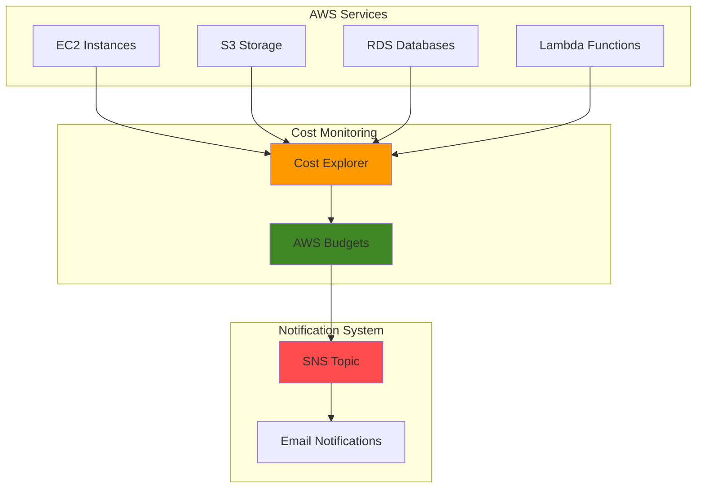

# Cost Monitoring with Cost Explorer and Budgets

## Problem

Organizations often experience unexpected AWS bill spikes due to unmonitored resource usage, lack of proactive cost alerts, and insufficient visibility into spending patterns across services. Without automated cost monitoring, businesses face budget overruns that can significantly impact project profitability and operational efficiency.

## Solution

Implement comprehensive cost monitoring using AWS Cost Explorer for spending analysis and AWS Budgets for proactive alerts. This solution provides real-time cost visibility, automated threshold notifications via SNS, and forecasting capabilities to prevent budget overruns while maintaining operational control.

## Architecture Diagram



## Prerequisites

1. AWS account with billing access and Cost Explorer permissions
2. AWS CLI installed and configured (or AWS CloudShell)
3. Basic understanding of AWS cost structure and billing concepts
4. Email address for budget notifications
5. Estimated cost: $0.01 per API request (Cost Explorer API usage only)

> **Note**: Cost Explorer is free to use through the console, but API requests incur charges of $0.01 per paginated request.

## Preparation

```bash
# Set environment variables
export AWS_REGION=$(aws configure get region)
export AWS_ACCOUNT_ID=$(aws sts get-caller-identity \
    --query Account --output text)

# Set notification email address (replace with your email)
export NOTIFICATION_EMAIL="your-email@example.com"

# Generate unique identifiers for resources
RANDOM_SUFFIX=$(aws secretsmanager get-random-password \
    --exclude-punctuation --exclude-uppercase \
    --password-length 6 --require-each-included-type \
    --output text --query RandomPassword)

# Set budget names with unique suffix
export MONTHLY_BUDGET_NAME="monthly-cost-budget-${RANDOM_SUFFIX}"
export SNS_TOPIC_NAME="budget-alerts-${RANDOM_SUFFIX}"

# Set current date for time periods
export CURRENT_DATE=$(date +%Y-%m-%d)
export FIRST_OF_MONTH=$(date +%Y-%m-01)

echo "✅ AWS environment configured for cost monitoring setup"
```

## Steps

1. **Enable Cost Explorer for Account Analysis**:

   AWS Cost Explorer provides comprehensive cost and usage analysis with up to 13 months of historical data and 12 months of forecasting. Enabling Cost Explorer is the foundation for all cost monitoring activities, providing the data source that AWS Budgets uses for threshold monitoring and alerts.

   ```bash
   # Test Cost Explorer access (this enables it if not already enabled)
   aws ce get-cost-and-usage \
       --time-period Start=${FIRST_OF_MONTH},End=${CURRENT_DATE} \
       --granularity MONTHLY \
       --metrics BlendedCost \
       --group-by Type=DIMENSION,Key=SERVICE
   
   echo "✅ Cost Explorer enabled and accessible"
   ```

   Cost Explorer now provides detailed cost breakdowns by service, enabling you to identify spending patterns and optimize resource allocation. The service automatically processes billing data and makes it available for analysis within 24 hours of resource usage.

2. **Create SNS Topic for Budget Notifications**:

   SNS enables real-time budget alerts through multiple delivery channels including email, SMS, and application endpoints. Creating a dedicated topic for budget notifications ensures reliable alert delivery and supports future integration with automated cost management workflows.

   ```bash
   # Create SNS topic for budget alerts
   SNS_TOPIC_ARN=$(aws sns create-topic \
       --name ${SNS_TOPIC_NAME} \
       --query TopicArn --output text)
   
   # Subscribe email address to topic
   aws sns subscribe \
       --topic-arn ${SNS_TOPIC_ARN} \
       --protocol email \
       --notification-endpoint ${NOTIFICATION_EMAIL}
   
   echo "✅ SNS topic created: ${SNS_TOPIC_ARN}"
   echo "⚠️  Check your email and confirm the SNS subscription"
   ```

   The SNS topic is now configured to deliver budget alerts to your specified email address. You must confirm the subscription through the email verification link to receive notifications.

3. **Create Monthly Cost Budget with Multiple Thresholds**:

   AWS Budgets provides proactive cost management by monitoring actual and forecasted spending against defined thresholds. Creating a budget with multiple alert thresholds enables graduated response to cost increases, from early warnings to critical alerts before budget limits are exceeded.

   ```bash
   # Create budget configuration file
   cat > budget-config.json << EOF
   {
       "BudgetName": "${MONTHLY_BUDGET_NAME}",
       "BudgetLimit": {
           "Amount": "100.00",
           "Unit": "USD"
       },
       "TimeUnit": "MONTHLY",
       "TimePeriod": {
           "Start": "${FIRST_OF_MONTH}T00:00:00Z",
           "End": "2087-06-15T00:00:00Z"
       },
       "BudgetType": "COST",
       "CostFilters": {},
       "CostTypes": {
           "IncludeTax": true,
           "IncludeSubscription": true,
           "UseBlended": false,
           "IncludeRefund": false,
           "IncludeCredit": false,
           "IncludeUpfront": true,
           "IncludeRecurring": true,
           "IncludeOtherSubscription": true,
           "IncludeSupport": true,
           "IncludeDiscount": true,
           "UseAmortized": false
       }
   }
   EOF
   
   # Create the budget
   aws budgets create-budget \
       --account-id ${AWS_ACCOUNT_ID} \
       --budget file://budget-config.json
   
   echo "✅ Monthly budget created: ${MONTHLY_BUDGET_NAME}"
   ```

   The budget is now actively monitoring your account's monthly spending against a $100 threshold. This foundation budget tracks all cost types including taxes, subscriptions, and recurring charges for comprehensive cost visibility.

4. **Configure Budget Alerts with Graduated Thresholds**:

   Multiple alert thresholds provide early warning systems that enable proactive cost management before critical budget limits are reached. This configuration implements a three-tier alert system: early warning at 50%, serious concern at 75%, and critical alert at 90% of budget.

   ```bash
   # Create notification configuration for 50% threshold
   cat > notification-50.json << EOF
   {
       "Notification": {
           "NotificationType": "ACTUAL",
           "ComparisonOperator": "GREATER_THAN",
           "Threshold": 50.0,
           "ThresholdType": "PERCENTAGE",
           "NotificationState": "ALARM"
       },
       "Subscribers": [
           {
               "SubscriptionType": "SNS",
               "Address": "${SNS_TOPIC_ARN}"
           }
       ]
   }
   EOF
   
   # Create notification configuration for 75% threshold  
   cat > notification-75.json << EOF
   {
       "Notification": {
           "NotificationType": "ACTUAL",
           "ComparisonOperator": "GREATER_THAN",
           "Threshold": 75.0,
           "ThresholdType": "PERCENTAGE",
           "NotificationState": "ALARM"
       },
       "Subscribers": [
           {
               "SubscriptionType": "SNS",
               "Address": "${SNS_TOPIC_ARN}"
           }
       ]
   }
   EOF
   
   # Create notification configuration for 90% threshold
   cat > notification-90.json << EOF
   {
       "Notification": {
           "NotificationType": "ACTUAL",
           "ComparisonOperator": "GREATER_THAN",
           "Threshold": 90.0,
           "ThresholdType": "PERCENTAGE",
           "NotificationState": "ALARM"
       },
       "Subscribers": [
           {
               "SubscriptionType": "SNS",
               "Address": "${SNS_TOPIC_ARN}"
           }
       ]
   }
   EOF
   
   # Add notifications to budget
   aws budgets create-notification \
       --account-id ${AWS_ACCOUNT_ID} \
       --budget-name ${MONTHLY_BUDGET_NAME} \
       --cli-input-json file://notification-50.json
   
   aws budgets create-notification \
       --account-id ${AWS_ACCOUNT_ID} \
       --budget-name ${MONTHLY_BUDGET_NAME} \
       --cli-input-json file://notification-75.json
   
   aws budgets create-notification \
       --account-id ${AWS_ACCOUNT_ID} \
       --budget-name ${MONTHLY_BUDGET_NAME} \
       --cli-input-json file://notification-90.json
   
   echo "✅ Budget notifications configured at 50%, 75%, and 90% thresholds"
   ```

   Your budget now includes graduated alerts that provide increasing urgency as spending approaches the budget limit. This proactive notification system enables timely intervention before cost overruns occur.

5. **Create Forecasting Budget Alert**:

   Forecasting alerts leverage AWS machine learning algorithms to predict future spending based on historical usage patterns. This proactive approach enables cost management actions before actual spending exceeds thresholds, providing additional time for resource optimization.

   ```bash
   # Create forecasted notification configuration
   cat > notification-forecast.json << EOF
   {
       "Notification": {
           "NotificationType": "FORECASTED",
           "ComparisonOperator": "GREATER_THAN",
           "Threshold": 100.0,
           "ThresholdType": "PERCENTAGE",
           "NotificationState": "ALARM"
       },
       "Subscribers": [
           {
               "SubscriptionType": "SNS",
               "Address": "${SNS_TOPIC_ARN}"
           }
       ]
   }
   EOF
   
   # Add forecasted notification to budget
   aws budgets create-notification \
       --account-id ${AWS_ACCOUNT_ID} \
       --budget-name ${MONTHLY_BUDGET_NAME} \
       --cli-input-json file://notification-forecast.json
   
   echo "✅ Forecasted budget alert configured at 100% threshold"
   ```

   The forecasting alert now provides early warning when AWS predicts your monthly spending will exceed the budget limit, enabling proactive cost management before actual overruns occur.

## Validation & Testing

1. **Verify Budget Configuration**:

   ```bash
   # Check budget details
   aws budgets describe-budget \
       --account-id ${AWS_ACCOUNT_ID} \
       --budget-name ${MONTHLY_BUDGET_NAME}
   ```

   Expected output: Budget details showing $100 limit, MONTHLY time unit, and COST type.

2. **Validate Notification Setup**:

   ```bash
   # List all notifications for the budget
   aws budgets describe-notifications-for-budget \
       --account-id ${AWS_ACCOUNT_ID} \
       --budget-name ${MONTHLY_BUDGET_NAME}
   ```

   Expected output: Four notifications (50%, 75%, 90% actual, and 100% forecasted).

3. **Test Cost Explorer Data Access**:

   ```bash
   # Query current month costs by service
   aws ce get-cost-and-usage \
       --time-period Start=${FIRST_OF_MONTH},End=${CURRENT_DATE} \
       --granularity MONTHLY \
       --metrics BlendedCost \
       --group-by Type=DIMENSION,Key=SERVICE
   ```

   Expected output: Cost breakdown by AWS service for the current month.

4. **Verify SNS Topic Subscription**:

   ```bash
   # Check SNS topic subscriptions
   aws sns list-subscriptions-by-topic \
       --topic-arn ${SNS_TOPIC_ARN}
   ```

   Expected output: Email subscription with "Confirmed" status.

## Cleanup

1. **Remove Budget Notifications**:

   ```bash
   # Delete all notifications (requires individual deletion)
   aws budgets delete-notification \
       --account-id ${AWS_ACCOUNT_ID} \
       --budget-name ${MONTHLY_BUDGET_NAME} \
       --notification NotificationType=ACTUAL,ComparisonOperator=GREATER_THAN,Threshold=50.0,ThresholdType=PERCENTAGE
   
   aws budgets delete-notification \
       --account-id ${AWS_ACCOUNT_ID} \
       --budget-name ${MONTHLY_BUDGET_NAME} \
       --notification NotificationType=ACTUAL,ComparisonOperator=GREATER_THAN,Threshold=75.0,ThresholdType=PERCENTAGE
   
   aws budgets delete-notification \
       --account-id ${AWS_ACCOUNT_ID} \
       --budget-name ${MONTHLY_BUDGET_NAME} \
       --notification NotificationType=ACTUAL,ComparisonOperator=GREATER_THAN,Threshold=90.0,ThresholdType=PERCENTAGE
   
   aws budgets delete-notification \
       --account-id ${AWS_ACCOUNT_ID} \
       --budget-name ${MONTHLY_BUDGET_NAME} \
       --notification NotificationType=FORECASTED,ComparisonOperator=GREATER_THAN,Threshold=100.0,ThresholdType=PERCENTAGE
   
   echo "✅ Budget notifications deleted"
   ```

2. **Delete Budget**:

   ```bash
   # Delete the budget
   aws budgets delete-budget \
       --account-id ${AWS_ACCOUNT_ID} \
       --budget-name ${MONTHLY_BUDGET_NAME}
   
   echo "✅ Budget deleted"
   ```

3. **Remove SNS Resources**:

   ```bash
   # Delete SNS topic (this also removes subscriptions)
   aws sns delete-topic --topic-arn ${SNS_TOPIC_ARN}
   
   echo "✅ SNS topic deleted"
   ```

4. **Clean Up Configuration Files**:

   ```bash
   # Remove temporary files
   rm -f budget-config.json notification-*.json
   
   echo "✅ Configuration files cleaned up"
   ```

## Discussion

AWS Cost Explorer and Budgets provide a comprehensive foundation for financial governance in cloud environments. Cost Explorer delivers detailed cost and usage analytics with machine learning-powered forecasting, while AWS Budgets enables proactive monitoring with customizable thresholds and automated notifications. This combination supports the [AWS Well-Architected Framework's Cost Optimization pillar](https://docs.aws.amazon.com/wellarchitected/latest/cost-optimization-pillar/welcome.html) by providing visibility, accountability, and automated controls for cloud spending.

The graduated alert system implemented in this recipe follows cost management best practices by providing early warnings before critical thresholds are reached. The 50% threshold serves as an early warning for monthly spend tracking, 75% indicates serious budget concerns requiring immediate attention, and 90% represents a critical alert for emergency cost reduction measures. The forecasted alert adds predictive capabilities that leverage AWS's machine learning algorithms to identify potential budget overruns before they occur.

SNS integration enables real-time notifications and supports future automation through AWS Lambda functions or third-party integrations. Organizations can extend this foundation by implementing automated responses such as resource shutdown, access restrictions, or approval workflows when budget thresholds are exceeded. The flexible notification system supports multiple delivery channels including email, SMS, HTTP endpoints, and AWS Lambda functions for comprehensive alert management.

Budget configuration supports various cost tracking scenarios including service-specific budgets, tag-based cost allocation, and Reserved Instance utilization monitoring. Advanced implementations can include planned budget limits for seasonal spending variations, multiple budget types for different organizational units, and integration with [AWS Cost Categories](https://docs.aws.amazon.com/aws-cost-management/latest/userguide/manage-cost-categories.html) for detailed cost attribution across business units or projects.

> **Tip**: Use [AWS Cost Anomaly Detection](https://docs.aws.amazon.com/aws-cost-management/latest/userguide/getting-started-ad.html) alongside budgets for intelligent anomaly identification that goes beyond simple threshold monitoring. This service uses machine learning to identify unusual spending patterns and provides root cause analysis for cost spikes.

## Challenge

Extend this cost monitoring solution by implementing these enhancements:

1. **Service-Specific Budgets**: Create individual budgets for high-cost services like EC2, RDS, and S3 with service-specific thresholds and optimization recommendations.

2. **Tag-Based Cost Allocation**: Implement cost tracking by project, department, or environment using resource tags and create corresponding budget categories for organizational chargeback.

3. **Automated Cost Response**: Develop Lambda functions that automatically respond to budget alerts by stopping non-production resources, sending detailed cost reports, or creating support tickets.

4. **Cost Anomaly Integration**: Combine AWS Cost Anomaly Detection with budgets to identify unusual spending patterns that may not trigger traditional threshold alerts.

5. **Multi-Account Budget Consolidation**: Extend monitoring to AWS Organizations with consolidated billing and create budget rollups across multiple accounts for enterprise cost governance.

## Infrastructure Code

*Infrastructure code will be generated after recipe approval.*