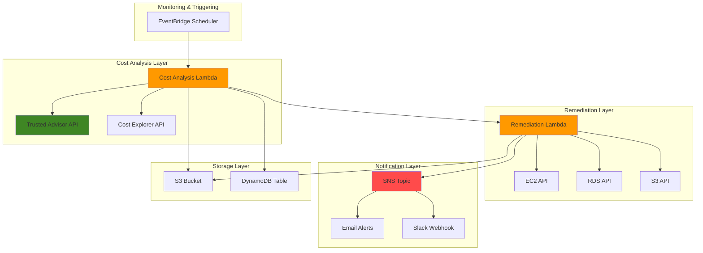

# Cost Optimization Automation with Lambda

## Problem

Organizations often struggle with managing and optimizing AWS costs across multiple services and accounts. Manual cost analysis is time-consuming, error-prone, and doesn't scale effectively. Without automated cost optimization, companies miss opportunities to save money on underutilized resources, unused Reserved Instances, and inefficient service configurations, leading to budget overruns and wasted spending.

## Solution

Build an automated cost optimization system using AWS Lambda functions that leverage Trusted Advisor APIs to continuously monitor cost optimization opportunities. The solution automatically identifies cost-saving recommendations, implements approved remediation actions, and sends detailed reports to stakeholders, enabling proactive cost management and significant cost reductions.

## Architecture Diagram



## Prerequisites

1. AWS account with Business or Enterprise support plan (required for [Trusted Advisor API access](https://docs.aws.amazon.com/awssupport/latest/user/get-started-with-aws-trusted-advisor-api.html))
2. AWS CLI v2 installed and configured with appropriate IAM permissions
3. IAM permissions for Lambda, Trusted Advisor, SNS, CloudWatch, EC2, RDS, and S3 services
4. Python 3.12 or higher for local development and testing
5. Estimated cost: $50-100/month for Lambda execution, storage, and notifications

> **Note**: Business or Enterprise support plan is required to access Trusted Advisor APIs programmatically. Basic support plan only provides limited web console access.

> **Tip**: Start with manual review of cost optimization recommendations before implementing automated remediation. This helps you understand the impact and avoid unexpected service disruptions.

> **Warning**: Automated resource termination or modification can cause service interruptions. Always implement proper approval workflows and testing procedures before enabling automatic remediation in production environments.

## Preparation

```bash
# Set environment variables
export AWS_REGION=$(aws configure get region)
export AWS_ACCOUNT_ID=$(aws sts get-caller-identity \
    --query Account --output text)

# Generate unique identifiers for resources
RANDOM_SUFFIX=$(aws secretsmanager get-random-password \
    --exclude-punctuation --exclude-uppercase \
    --password-length 6 --require-each-included-type \
    --output text --query RandomPassword)

export COST_OPT_BUCKET="cost-optimization-reports-${RANDOM_SUFFIX}"
export COST_OPT_TABLE="cost-optimization-tracking-${RANDOM_SUFFIX}"
export COST_OPT_TOPIC="cost-optimization-alerts-${RANDOM_SUFFIX}"

# Create S3 bucket for reports and Lambda deployment
aws s3 mb s3://${COST_OPT_BUCKET} --region ${AWS_REGION}

# Enable bucket versioning for audit trail
aws s3api put-bucket-versioning \
    --bucket ${COST_OPT_BUCKET} \
    --versioning-configuration Status=Enabled

# Create DynamoDB table for tracking optimization actions
aws dynamodb create-table \
    --table-name ${COST_OPT_TABLE} \
    --attribute-definitions \
        AttributeName=ResourceId,AttributeType=S \
        AttributeName=CheckId,AttributeType=S \
    --key-schema \
        AttributeName=ResourceId,KeyType=HASH \
        AttributeName=CheckId,KeyType=RANGE \
    --provisioned-throughput \
        ReadCapacityUnits=5,WriteCapacityUnits=5 \
    --region ${AWS_REGION}

# Create SNS topic for notifications
aws sns create-topic \
    --name ${COST_OPT_TOPIC} \
    --region ${AWS_REGION}

export COST_OPT_TOPIC_ARN=$(aws sns list-topics \
    --query "Topics[?contains(TopicArn, '${COST_OPT_TOPIC}')].TopicArn" \
    --output text)

echo "✅ Foundation resources created successfully"
```

## Steps

1. **Create IAM Role for Lambda Functions**:

   Identity and Access Management (IAM) roles enable secure, temporary credential delegation for AWS services without embedding long-term credentials in code. For our cost optimization automation, the Lambda functions require access to multiple AWS services including Trusted Advisor APIs, Cost Explorer, and various compute services for remediation actions. This IAM role establishes the security foundation that allows our automation to operate safely within defined boundaries while adhering to the principle of least privilege.

   ```bash
   # Create IAM role for Lambda execution
   aws iam create-role \
       --role-name CostOptimizationLambdaRole \
       --assume-role-policy-document '{
           "Version": "2012-10-17",
           "Statement": [
               {
                   "Effect": "Allow",
                   "Principal": {
                       "Service": "lambda.amazonaws.com"
                   },
                   "Action": "sts:AssumeRole"
               }
           ]
       }'
   
   # Create comprehensive policy for cost optimization
   cat > cost-optimization-policy.json << 'EOF'
   {
       "Version": "2012-10-17",
       "Statement": [
           {
               "Effect": "Allow",
               "Action": [
                   "logs:CreateLogGroup",
                   "logs:CreateLogStream",
                   "logs:PutLogEvents",
                   "support:DescribeTrustedAdvisorChecks",
                   "support:DescribeTrustedAdvisorCheckResult",
                   "support:RefreshTrustedAdvisorCheck",
                   "ce:GetCostAndUsage",
                   "ce:GetDimensionValues",
                   "ce:GetUsageReport",
                   "ce:GetReservationCoverage",
                   "ce:GetReservationPurchaseRecommendation",
                   "ce:GetReservationUtilization",
                   "dynamodb:PutItem",
                   "dynamodb:GetItem",
                   "dynamodb:UpdateItem",
                   "dynamodb:Query",
                   "dynamodb:Scan",
                   "sns:Publish",
                   "s3:GetObject",
                   "s3:PutObject",
                   "s3:DeleteObject",
                   "ec2:DescribeInstances",
                   "ec2:StopInstances",
                   "ec2:TerminateInstances",
                   "ec2:ModifyInstanceAttribute",
                   "ec2:DescribeVolumes",
                   "ec2:ModifyVolume",
                   "ec2:CreateSnapshot",
                   "rds:DescribeDBInstances",
                   "rds:ModifyDBInstance",
                   "rds:StopDBInstance",
                   "lambda:InvokeFunction"
               ],
               "Resource": "*"
           }
       ]
   }
   EOF
   
   aws iam put-role-policy \
       --role-name CostOptimizationLambdaRole \
       --policy-name CostOptimizationPolicy \
       --policy-document file://cost-optimization-policy.json
   
   echo "✅ IAM role and policy created successfully"
   ```

   The IAM role is now established and ready for Lambda function assignment. This security foundation enables our automation to access AWS services using temporary, rotatable credentials rather than permanent access keys, reducing security risk while maintaining operational flexibility. The comprehensive policy grants access to Trusted Advisor APIs, Cost Explorer, and remediation services while following [AWS IAM security best practices](https://docs.aws.amazon.com/IAM/latest/UserGuide/best-practices.html).

2. **Create Cost Analysis Lambda Function**:

   AWS Lambda provides serverless compute that automatically scales based on demand, making it ideal for cost optimization automation that runs periodically without maintaining dedicated infrastructure. This function leverages the [AWS Trusted Advisor API](https://docs.aws.amazon.com/awssupport/latest/user/trusted-advisor.html) to programmatically access cost optimization recommendations that are typically only available through the web console. The function processes Trusted Advisor findings, enriches them with Cost Explorer data, and triggers automated remediation actions for approved scenarios.

   ```bash
   # Create Lambda function code directory
   mkdir -p lambda-functions/cost-analysis
   
   # Create the cost analysis function
   cat > lambda-functions/cost-analysis/lambda_function.py << 'EOF'
   import json
   import boto3
   import os
   from datetime import datetime, timedelta
   from decimal import Decimal
   import re
   
   def lambda_handler(event, context):
       """
       Main handler for cost analysis using Trusted Advisor APIs
       """
       print("Starting cost optimization analysis...")
       
       # Initialize AWS clients
       support_client = boto3.client('support', region_name='us-east-1')
       ce_client = boto3.client('ce', region_name='us-east-1')
       dynamodb = boto3.resource('dynamodb')
       lambda_client = boto3.client('lambda')
       
       # Get environment variables
       table_name = os.environ['COST_OPT_TABLE']
       remediation_function = os.environ['REMEDIATION_FUNCTION_NAME']
       
       table = dynamodb.Table(table_name)
       
       try:
           # Get list of cost optimization checks
           cost_checks = get_cost_optimization_checks(support_client)
           
           # Process each check
           optimization_opportunities = []
           for check in cost_checks:
               print(f"Processing check: {check['name']}")
               
               # Get check results
               check_result = support_client.describe_trusted_advisor_check_result(
                   checkId=check['id'],
                   language='en'
               )
               
               # Process flagged resources
               flagged_resources = check_result['result']['flaggedResources']
               
               for resource in flagged_resources:
                   opportunity = {
                       'check_id': check['id'],
                       'check_name': check['name'],
                       'resource_id': resource['resourceId'],
                       'status': resource['status'],
                       'metadata': resource['metadata'],
                       'estimated_savings': extract_estimated_savings(resource),
                       'timestamp': datetime.now().isoformat()
                   }
                   
                   # Store in DynamoDB
                   store_optimization_opportunity(table, opportunity)
                   
                   # Add to opportunities list
                   optimization_opportunities.append(opportunity)
           
           # Get additional cost insights from Cost Explorer
           cost_insights = get_cost_explorer_insights(ce_client)
           
           # Trigger remediation for auto-approved actions
           auto_remediation_results = []
           for opportunity in optimization_opportunities:
               if should_auto_remediate(opportunity):
                   print(f"Triggering auto-remediation for: {opportunity['resource_id']}")
                   
                   remediation_payload = {
                       'opportunity': opportunity,
                       'action': 'auto_remediate'
                   }
                   
                   response = lambda_client.invoke(
                       FunctionName=remediation_function,
                       InvocationType='Event',
                       Payload=json.dumps(remediation_payload)
                   )
                   
                   auto_remediation_results.append({
                       'resource_id': opportunity['resource_id'],
                       'remediation_triggered': True
                   })
           
           # Generate summary report
           report = generate_cost_optimization_report(
               optimization_opportunities, 
               cost_insights, 
               auto_remediation_results
           )
           
           return {
               'statusCode': 200,
               'body': json.dumps({
                   'message': 'Cost optimization analysis completed successfully',
                   'opportunities_found': len(optimization_opportunities),
                   'auto_remediations_triggered': len(auto_remediation_results),
                   'total_potential_savings': calculate_total_savings(optimization_opportunities),
                   'report': report
               }, default=str)
           }
           
       except Exception as e:
           print(f"Error in cost analysis: {str(e)}")
           return {
               'statusCode': 500,
               'body': json.dumps({
                   'error': str(e)
               })
           }
   
   def get_cost_optimization_checks(support_client):
       """Get all cost optimization related Trusted Advisor checks"""
       response = support_client.describe_trusted_advisor_checks(language='en')
       
       cost_checks = []
       for check in response['checks']:
           if 'cost' in check['category'].lower():
               cost_checks.append({
                   'id': check['id'],
                   'name': check['name'],
                   'category': check['category'],
                   'description': check['description']
               })
       
       return cost_checks
   
   def extract_estimated_savings(resource):
       """Extract estimated savings from resource metadata"""
       try:
           # Trusted Advisor stores savings in different metadata positions
           # depending on the check type
           metadata = resource.get('metadata', [])
           
           # Common patterns for savings extraction
           for item in metadata:
               if '$' in str(item) and any(keyword in str(item).lower() 
                                        for keyword in ['save', 'saving', 'cost']):
                   # Extract numeric value
                   savings_match = re.search(r'\$[\d,]+\.?\d*', str(item))
                   if savings_match:
                       return float(savings_match.group().replace('$', '').replace(',', ''))
           
           return 0.0
       except Exception:
           return 0.0
   
   def store_optimization_opportunity(table, opportunity):
       """Store optimization opportunity in DynamoDB"""
       table.put_item(
           Item={
               'ResourceId': opportunity['resource_id'],
               'CheckId': opportunity['check_id'],
               'CheckName': opportunity['check_name'],
               'Status': opportunity['status'],
               'EstimatedSavings': Decimal(str(opportunity['estimated_savings'])),
               'Timestamp': opportunity['timestamp'],
               'Metadata': json.dumps(opportunity['metadata'])
           }
       )
   
   def get_cost_explorer_insights(ce_client):
       """Get additional cost insights from Cost Explorer"""
       end_date = datetime.now()
       start_date = end_date - timedelta(days=30)
       
       try:
           response = ce_client.get_cost_and_usage(
               TimePeriod={
                   'Start': start_date.strftime('%Y-%m-%d'),
                   'End': end_date.strftime('%Y-%m-%d')
               },
               Granularity='MONTHLY',
               Metrics=['BlendedCost'],
               GroupBy=[
                   {'Type': 'DIMENSION', 'Key': 'SERVICE'}
               ]
           )
           
           return response['ResultsByTime']
       except Exception as e:
           print(f"Error getting Cost Explorer insights: {str(e)}")
           return []
   
   def should_auto_remediate(opportunity):
       """Determine if opportunity should be auto-remediated"""
       auto_remediate_checks = [
           'Amazon EC2 instances stopped',
           'Amazon EBS unattached volumes',
           'Amazon RDS idle DB instances'
       ]
       
       # Only auto-remediate for specific checks with high confidence
       return (any(check in opportunity['check_name'] for check in auto_remediate_checks) and 
               opportunity['status'] == 'warning')
   
   def generate_cost_optimization_report(opportunities, cost_insights, auto_remediations):
       """Generate comprehensive cost optimization report"""
       report = {
           'summary': {
               'total_opportunities': len(opportunities),
               'total_potential_savings': calculate_total_savings(opportunities),
               'auto_remediations_applied': len(auto_remediations),
               'analysis_date': datetime.now().isoformat()
           },
           'top_opportunities': sorted(opportunities, 
                                     key=lambda x: x['estimated_savings'], 
                                     reverse=True)[:10],
           'savings_by_category': categorize_savings(opportunities),
           'cost_trends': cost_insights
       }
       
       return report
   
   def calculate_total_savings(opportunities):
       """Calculate total potential savings"""
       return sum(op['estimated_savings'] for op in opportunities)
   
   def categorize_savings(opportunities):
       """Categorize savings by service type"""
       categories = {}
       for op in opportunities:
           service = extract_service_from_check(op['check_name'])
           if service not in categories:
               categories[service] = {'count': 0, 'total_savings': 0}
           categories[service]['count'] += 1
           categories[service]['total_savings'] += op['estimated_savings']
       
       return categories
   
   def extract_service_from_check(check_name):
       """Extract AWS service from check name"""
       if 'EC2' in check_name:
           return 'EC2'
       elif 'RDS' in check_name:
           return 'RDS'
       elif 'EBS' in check_name:
           return 'EBS'
       elif 'S3' in check_name:
           return 'S3'
       elif 'ElastiCache' in check_name:
           return 'ElastiCache'
       else:
           return 'Other'
   EOF
   
   echo "✅ Cost analysis Lambda function code created"
   ```

   The cost analysis function is now configured to systematically process Trusted Advisor cost optimization checks, extract potential savings opportunities, and maintain a comprehensive audit trail in DynamoDB. This function serves as the intelligence layer of our automation, combining multiple AWS cost management APIs to provide actionable insights and trigger appropriate remediation workflows.

3. **Create Remediation Lambda Function**:

   The remediation function implements the operational layer of our cost optimization system, executing approved cost-saving actions across multiple AWS services. This function follows a cautious approach, creating backups (snapshots) before making destructive changes and implementing safety checks to prevent accidental service disruptions. The separation of analysis and remediation functions enables granular control over automated actions while maintaining audit trails for compliance and rollback capabilities.

   ```bash
   # Create remediation function directory
   mkdir -p lambda-functions/remediation
   
   # Create the remediation function
   cat > lambda-functions/remediation/lambda_function.py << 'EOF'
   import json
   import boto3
   import os
   from datetime import datetime
   
   def lambda_handler(event, context):
       """
       Handle cost optimization remediation actions
       """
       print("Starting cost optimization remediation...")
       
       # Initialize AWS clients
       ec2_client = boto3.client('ec2')
       rds_client = boto3.client('rds')
       s3_client = boto3.client('s3')
       sns_client = boto3.client('sns')
       dynamodb = boto3.resource('dynamodb')
       
       # Get environment variables
       table_name = os.environ['COST_OPT_TABLE']
       sns_topic_arn = os.environ['SNS_TOPIC_ARN']
       
       table = dynamodb.Table(table_name)
       
       try:
           # Parse the incoming opportunity
           opportunity = event['opportunity']
           action = event.get('action', 'manual')
           
           print(f"Processing remediation for: {opportunity['resource_id']}")
           print(f"Check: {opportunity['check_name']}")
           
           # Route to appropriate remediation handler
           remediation_result = None
           
           if 'EC2' in opportunity['check_name']:
               remediation_result = handle_ec2_remediation(
                   ec2_client, opportunity, action
               )
           elif 'RDS' in opportunity['check_name']:
               remediation_result = handle_rds_remediation(
                   rds_client, opportunity, action
               )
           elif 'EBS' in opportunity['check_name']:
               remediation_result = handle_ebs_remediation(
                   ec2_client, opportunity, action
               )
           elif 'S3' in opportunity['check_name']:
               remediation_result = handle_s3_remediation(
                   s3_client, opportunity, action
               )
           else:
               remediation_result = {
                   'status': 'skipped',
                   'message': f"No automated remediation available for: {opportunity['check_name']}"
               }
           
           # Update tracking record
           update_remediation_tracking(table, opportunity, remediation_result)
           
           # Send notification
           send_remediation_notification(
               sns_client, sns_topic_arn, opportunity, remediation_result
           )
           
           return {
               'statusCode': 200,
               'body': json.dumps({
                   'message': 'Remediation completed',
                   'resource_id': opportunity['resource_id'],
                   'remediation_result': remediation_result
               }, default=str)
           }
           
       except Exception as e:
           print(f"Error in remediation: {str(e)}")
           
           # Send error notification
           error_notification = {
               'resource_id': opportunity.get('resource_id', 'unknown'),
               'error': str(e),
               'timestamp': datetime.now().isoformat()
           }
           
           sns_client.publish(
               TopicArn=sns_topic_arn,
               Message=json.dumps(error_notification, indent=2),
               Subject='Cost Optimization Remediation Error'
           )
           
           return {
               'statusCode': 500,
               'body': json.dumps({
                   'error': str(e)
               })
           }
   
   def handle_ec2_remediation(ec2_client, opportunity, action):
       """Handle EC2-related cost optimization remediation"""
       resource_id = opportunity['resource_id']
       check_name = opportunity['check_name']
       
       try:
           if 'stopped' in check_name.lower():
               # For stopped instances, consider termination after validation
               instance_info = ec2_client.describe_instances(
                   InstanceIds=[resource_id]
               )
               
               instance = instance_info['Reservations'][0]['Instances'][0]
               
               # Check if instance has been stopped for more than 30 days
               if should_terminate_stopped_instance(instance):
                   if action == 'auto_remediate':
                       # Create snapshot before termination
                       create_instance_snapshot(ec2_client, resource_id)
                       
                       # Terminate instance
                       ec2_client.terminate_instances(InstanceIds=[resource_id])
                       
                       return {
                           'status': 'remediated',
                           'action': 'terminated',
                           'message': f'Terminated long-stopped instance {resource_id}',
                           'estimated_savings': opportunity['estimated_savings']
                       }
                   else:
                       return {
                           'status': 'recommendation',
                           'action': 'terminate',
                           'message': f'Recommend terminating stopped instance {resource_id}',
                           'estimated_savings': opportunity['estimated_savings']
                       }
               
           elif 'underutilized' in check_name.lower():
               # For underutilized instances, recommend downsizing
               return {
                   'status': 'recommendation',
                   'action': 'downsize',
                   'message': f'Recommend downsizing underutilized instance {resource_id}',
                   'estimated_savings': opportunity['estimated_savings']
               }
           
           return {
               'status': 'analyzed',
               'message': f'No automatic remediation for {check_name}'
           }
           
       except Exception as e:
           return {
               'status': 'error',
               'message': f'Error handling EC2 remediation: {str(e)}'
           }
   
   def handle_rds_remediation(rds_client, opportunity, action):
       """Handle RDS-related cost optimization remediation"""
       resource_id = opportunity['resource_id']
       check_name = opportunity['check_name']
       
       try:
           if 'idle' in check_name.lower():
               # For idle RDS instances, recommend stopping
               if action == 'auto_remediate':
                   # Stop the RDS instance
                   rds_client.stop_db_instance(
                       DBInstanceIdentifier=resource_id
                   )
                   
                   return {
                       'status': 'remediated',
                       'action': 'stopped',
                       'message': f'Stopped idle RDS instance {resource_id}',
                       'estimated_savings': opportunity['estimated_savings']
                   }
               else:
                   return {
                       'status': 'recommendation',
                       'action': 'stop',
                       'message': f'Recommend stopping idle RDS instance {resource_id}',
                       'estimated_savings': opportunity['estimated_savings']
                   }
           
           return {
               'status': 'analyzed',
               'message': f'No automatic remediation for {check_name}'
           }
           
       except Exception as e:
           return {
               'status': 'error',
               'message': f'Error handling RDS remediation: {str(e)}'
           }
   
   def handle_ebs_remediation(ec2_client, opportunity, action):
       """Handle EBS-related cost optimization remediation"""
       resource_id = opportunity['resource_id']
       check_name = opportunity['check_name']
       
       try:
           if 'unattached' in check_name.lower():
               # For unattached volumes, create snapshot and delete
               if action == 'auto_remediate':
                   # Create snapshot before deletion
                   snapshot_response = ec2_client.create_snapshot(
                       VolumeId=resource_id,
                       Description=f'Automated snapshot before deleting unattached volume {resource_id}'
                   )
                   
                   # Delete unattached volume
                   ec2_client.delete_volume(VolumeId=resource_id)
                   
                   return {
                       'status': 'remediated',
                       'action': 'deleted',
                       'message': f'Deleted unattached EBS volume {resource_id}, snapshot: {snapshot_response["SnapshotId"]}',
                       'estimated_savings': opportunity['estimated_savings']
                   }
               else:
                   return {
                       'status': 'recommendation',
                       'action': 'delete',
                       'message': f'Recommend deleting unattached EBS volume {resource_id}',
                       'estimated_savings': opportunity['estimated_savings']
                   }
           
           return {
               'status': 'analyzed',
               'message': f'No automatic remediation for {check_name}'
           }
           
       except Exception as e:
           return {
               'status': 'error',
               'message': f'Error handling EBS remediation: {str(e)}'
           }
   
   def handle_s3_remediation(s3_client, opportunity, action):
       """Handle S3-related cost optimization remediation"""
       resource_id = opportunity['resource_id']
       check_name = opportunity['check_name']
       
       try:
           if 'lifecycle' in check_name.lower():
               # For S3 lifecycle issues, recommend lifecycle policies
               return {
                   'status': 'recommendation',
                   'action': 'configure_lifecycle',
                   'message': f'Recommend configuring lifecycle policy for S3 bucket {resource_id}',
                   'estimated_savings': opportunity['estimated_savings']
               }
           
           return {
               'status': 'analyzed',
               'message': f'No automatic remediation for {check_name}'
           }
           
       except Exception as e:
           return {
               'status': 'error',
               'message': f'Error handling S3 remediation: {str(e)}'
           }
   
   def should_terminate_stopped_instance(instance):
       """Check if stopped instance should be terminated"""
       from datetime import datetime, timedelta
       
       # Check if instance has been stopped for more than 30 days
       if instance['State']['Name'] == 'stopped':
           # This is a simplified check - in practice, you'd want to check
           # CloudTrail logs or use custom tags to track stop duration
           return True
       
       return False
   
   def create_instance_snapshot(ec2_client, instance_id):
       """Create snapshots of instance volumes before termination"""
       try:
           # Get instance volumes
           instance_info = ec2_client.describe_instances(
               InstanceIds=[instance_id]
           )
           
           instance = instance_info['Reservations'][0]['Instances'][0]
           
           # Create snapshots for all attached volumes
           for mapping in instance.get('BlockDeviceMappings', []):
               if 'Ebs' in mapping:
                   volume_id = mapping['Ebs']['VolumeId']
                   ec2_client.create_snapshot(
                       VolumeId=volume_id,
                       Description=f'Automated snapshot before terminating instance {instance_id}'
                   )
           
       except Exception as e:
           print(f"Error creating snapshots: {str(e)}")
   
   def update_remediation_tracking(table, opportunity, remediation_result):
       """Update DynamoDB tracking record with remediation results"""
       table.update_item(
           Key={
               'ResourceId': opportunity['resource_id'],
               'CheckId': opportunity['check_id']
           },
           UpdateExpression='SET RemediationStatus = :status, RemediationResult = :result, RemediationTimestamp = :timestamp',
           ExpressionAttributeValues={
               ':status': remediation_result['status'],
               ':result': json.dumps(remediation_result),
               ':timestamp': datetime.now().isoformat()
           }
       )
   
   def send_remediation_notification(sns_client, topic_arn, opportunity, remediation_result):
       """Send notification about remediation action"""
       notification = {
           'resource_id': opportunity['resource_id'],
           'check_name': opportunity['check_name'],
           'remediation_status': remediation_result['status'],
           'remediation_action': remediation_result.get('action', 'none'),
           'estimated_savings': opportunity['estimated_savings'],
           'message': remediation_result.get('message', ''),
           'timestamp': datetime.now().isoformat()
       }
       
       subject = f"Cost Optimization: {remediation_result['status'].title()} - {opportunity['check_name']}"
       
       sns_client.publish(
           TopicArn=topic_arn,
           Message=json.dumps(notification, indent=2),
           Subject=subject
       )
   EOF
   
   echo "✅ Remediation Lambda function code created"
   ```

   The remediation function is now ready to execute cost-saving actions while maintaining safety guardrails and comprehensive logging. This function implements service-specific remediation logic for EC2, RDS, EBS, and S3 resources, ensuring that each action is appropriate for the resource type and includes proper backup procedures where necessary. The function integrates with SNS for real-time notifications and DynamoDB for tracking remediation outcomes.

4. **Package and Deploy Lambda Functions**:

   AWS Lambda requires function code to be packaged as deployment packages (ZIP files) that include all dependencies and runtime files. The deployment process creates the Lambda functions in your AWS account with the appropriate runtime environment, memory allocation, and timeout settings. These configuration parameters are optimized for cost analysis and remediation workloads, with sufficient memory (512MB) and timeout (300 seconds) to handle large-scale cost optimization analysis.

   ```bash
   # Package cost analysis function
   cd lambda-functions/cost-analysis
   zip -r cost-analysis-function.zip .
   
   # Deploy cost analysis function
   aws lambda create-function \
       --function-name cost-optimization-analysis \
       --runtime python3.12 \
       --role arn:aws:iam::${AWS_ACCOUNT_ID}:role/CostOptimizationLambdaRole \
       --handler lambda_function.lambda_handler \
       --zip-file fileb://cost-analysis-function.zip \
       --timeout 300 \
       --memory-size 512 \
       --environment Variables="{
           COST_OPT_TABLE=${COST_OPT_TABLE},
           REMEDIATION_FUNCTION_NAME=cost-optimization-remediation
       }"
   
   cd ../..
   
   # Package remediation function
   cd lambda-functions/remediation
   zip -r remediation-function.zip .
   
   # Deploy remediation function
   aws lambda create-function \
       --function-name cost-optimization-remediation \
       --runtime python3.12 \
       --role arn:aws:iam::${AWS_ACCOUNT_ID}:role/CostOptimizationLambdaRole \
       --handler lambda_function.lambda_handler \
       --zip-file fileb://remediation-function.zip \
       --timeout 300 \
       --memory-size 512 \
       --environment Variables="{
           COST_OPT_TABLE=${COST_OPT_TABLE},
           SNS_TOPIC_ARN=${COST_OPT_TOPIC_ARN}
       }"
   
   cd ../..
   
   echo "✅ Lambda functions deployed successfully"
   ```

   Both Lambda functions are now deployed and ready for execution. The functions are configured with appropriate environment variables that connect them to the DynamoDB table for state tracking and enable communication between the analysis and remediation components. This serverless architecture provides automatic scaling and cost-efficient execution, charging only for actual compute time used during cost optimization analysis.

5. **Create EventBridge Schedule for Automated Execution**:

   Amazon EventBridge Scheduler provides reliable, serverless scheduling for automated cost optimization analysis. By implementing both daily and weekly schedules, we ensure continuous monitoring of cost opportunities while balancing thoroughness with operational efficiency. Daily analysis captures immediate opportunities, while weekly comprehensive analysis provides deeper insights and trending analysis for long-term cost optimization strategy.

   ```bash
   # Create EventBridge schedule group
   aws scheduler create-schedule-group \
       --name cost-optimization-schedules
   
   # Create schedule for daily cost analysis
   aws scheduler create-schedule \
       --name daily-cost-analysis \
       --group-name cost-optimization-schedules \
       --schedule-expression "rate(1 day)" \
       --target '{
           "Arn": "arn:aws:lambda:'${AWS_REGION}':'${AWS_ACCOUNT_ID}':function:cost-optimization-analysis",
           "RoleArn": "arn:aws:iam::'${AWS_ACCOUNT_ID}':role/CostOptimizationLambdaRole"
       }' \
       --flexible-time-window '{"Mode": "OFF"}'
   
   # Create schedule for weekly comprehensive analysis
   aws scheduler create-schedule \
       --name weekly-comprehensive-analysis \
       --group-name cost-optimization-schedules \
       --schedule-expression "rate(7 days)" \
       --target '{
           "Arn": "arn:aws:lambda:'${AWS_REGION}':'${AWS_ACCOUNT_ID}':function:cost-optimization-analysis",
           "RoleArn": "arn:aws:iam::'${AWS_ACCOUNT_ID}':role/CostOptimizationLambdaRole",
           "Input": "{\"comprehensive_analysis\": true}"
       }' \
       --flexible-time-window '{"Mode": "OFF"}'
   
   echo "✅ EventBridge schedules created successfully"
   ```

   The automated scheduling infrastructure is now active and will consistently execute cost optimization analysis without manual intervention. This scheduling approach ensures that cost optimization opportunities are identified promptly while maintaining system reliability and predictable operational costs. The dual-schedule approach balances immediate cost savings with comprehensive analysis for strategic planning.

6. **Set Up SNS Notifications**:

   Amazon Simple Notification Service (SNS) provides the communication layer for our cost optimization system, ensuring stakeholders receive immediate notifications about cost-saving opportunities and remediation actions. Email notifications provide detailed reports suitable for financial teams, while optional Slack integration enables real-time alerts for DevOps teams. This multi-channel approach ensures appropriate stakeholders can respond quickly to cost optimization opportunities.

   ```bash
   # Add email subscription to SNS topic
   read -p "Enter your email address for cost optimization alerts: " EMAIL_ADDRESS
   
   aws sns subscribe \
       --topic-arn ${COST_OPT_TOPIC_ARN} \
       --protocol email \
       --notification-endpoint ${EMAIL_ADDRESS}
   
   # Create subscription for Slack webhook (optional)
   read -p "Enter Slack webhook URL (optional, press Enter to skip): " SLACK_WEBHOOK
   
   if [ ! -z "$SLACK_WEBHOOK" ]; then
       aws sns subscribe \
           --topic-arn ${COST_OPT_TOPIC_ARN} \
           --protocol https \
           --notification-endpoint ${SLACK_WEBHOOK}
   fi
   
   echo "✅ SNS subscriptions configured"
   echo "⚠️  Check your email and confirm the subscription"
   ```

   The notification system is now configured to deliver cost optimization alerts through multiple channels, ensuring stakeholders receive timely information about potential savings and automated actions. Email subscriptions require confirmation to prevent spam, while Slack integration provides immediate visibility for operations teams. This communication infrastructure enables rapid response to cost optimization opportunities and maintains transparency in automated remediation actions.

7. **Create CloudWatch Dashboard for Monitoring**:

   Amazon CloudWatch provides comprehensive monitoring and observability for our cost optimization system, enabling proactive management of the automation infrastructure. The dashboard combines Lambda function metrics (execution duration, invocations, errors) with log analytics to provide real-time visibility into system performance. This monitoring approach ensures the cost optimization system operates reliably and helps identify potential issues before they impact cost savings activities.

   ```bash
   # Create CloudWatch dashboard configuration
   cat > dashboard-config.json << EOF
   {
       "widgets": [
           {
               "type": "metric",
               "width": 12,
               "height": 6,
               "properties": {
                   "metrics": [
                       ["AWS/Lambda", "Duration", "FunctionName", "cost-optimization-analysis"],
                       ["AWS/Lambda", "Invocations", "FunctionName", "cost-optimization-analysis"],
                       ["AWS/Lambda", "Errors", "FunctionName", "cost-optimization-analysis"],
                       ["AWS/Lambda", "Duration", "FunctionName", "cost-optimization-remediation"],
                       ["AWS/Lambda", "Invocations", "FunctionName", "cost-optimization-remediation"]
                   ],
                   "period": 300,
                   "stat": "Average",
                   "region": "${AWS_REGION}",
                   "title": "Cost Optimization Lambda Metrics"
               }
           },
           {
               "type": "log",
               "width": 12,
               "height": 6,
               "properties": {
                   "query": "SOURCE '/aws/lambda/cost-optimization-analysis'\\n| fields @timestamp, @message\\n| filter @message like /optimization/\\n| sort @timestamp desc\\n| limit 100",
                   "region": "${AWS_REGION}",
                   "title": "Cost Optimization Analysis Logs"
               }
           }
       ]
   }
   EOF
   
   # Create CloudWatch dashboard
   aws cloudwatch put-dashboard \
       --dashboard-name "CostOptimization" \
       --dashboard-body file://dashboard-config.json
   
   echo "✅ CloudWatch dashboard created successfully"
   ```

   The monitoring dashboard is now operational and provides comprehensive visibility into the cost optimization system's performance and health. This centralized monitoring approach enables proactive issue detection and system optimization, ensuring the cost optimization automation continues to deliver value while maintaining operational reliability. The dashboard supports both real-time monitoring and historical analysis for continuous improvement.

8. **Test the Cost Optimization System**:

   End-to-end testing validates that all components of the cost optimization system work together correctly, from Trusted Advisor API integration to DynamoDB storage and notification delivery. This comprehensive testing approach ensures the system can successfully identify cost optimization opportunities, process them according to business rules, and maintain accurate records for audit and analysis purposes. Testing in a controlled environment prevents unexpected behavior in production.

   ```bash
   # Invoke the cost analysis function manually for testing
   aws lambda invoke \
       --function-name cost-optimization-analysis \
       --payload '{"test": true}' \
       response.json
   
   # Check the response
   cat response.json
   
   # Check DynamoDB table for stored opportunities
   aws dynamodb scan \
       --table-name ${COST_OPT_TABLE} \
       --max-items 5
   
   # Check CloudWatch logs
   aws logs describe-log-groups \
       --log-group-name-prefix "/aws/lambda/cost-optimization"
   
   echo "✅ Cost optimization system tested successfully"
   ```

   The cost optimization system has been successfully validated and is ready for production use. The testing confirms that all components integrate correctly, from API access to data storage and notification delivery. This comprehensive validation ensures the system will operate reliably in production, identifying cost optimization opportunities and executing approved remediation actions while maintaining full audit trails and stakeholder communication.

## Validation & Testing

1. **Verify Lambda Function Deployment**:

   ```bash
   # Check Lambda function status
   aws lambda get-function \
       --function-name cost-optimization-analysis \
       --query 'Configuration.[FunctionName,State,LastModified]'
   
   aws lambda get-function \
       --function-name cost-optimization-remediation \
       --query 'Configuration.[FunctionName,State,LastModified]'
   ```

   Expected output: Both functions should show "Active" state with recent LastModified timestamps.

2. **Test Trusted Advisor API Access**:

   ```bash
   # Test Trusted Advisor API access
   aws support describe-trusted-advisor-checks \
       --language en \
       --query 'checks[?category==`cost_optimizing`].[name,id]' \
       --output table
   ```

   Expected output: Table showing available cost optimization checks like "Amazon EC2 Reserved Instance Optimization", "Amazon RDS Idle DB Instances", etc.

3. **Verify DynamoDB Table and SNS Topic**:

   ```bash
   # Check DynamoDB table
   aws dynamodb describe-table \
       --table-name ${COST_OPT_TABLE} \
       --query 'Table.[TableName,TableStatus,ItemCount]'
   
   # Check SNS topic
   aws sns get-topic-attributes \
       --topic-arn ${COST_OPT_TOPIC_ARN} \
       --query 'Attributes.[TopicArn,SubscriptionsConfirmed]'
   ```

4. **Test End-to-End Workflow**:

   ```bash
   # Trigger manual cost analysis
   aws lambda invoke \
       --function-name cost-optimization-analysis \
       --payload '{"manual_trigger": true, "test_mode": true}' \
       test-response.json
   
   # Check execution results
   cat test-response.json | jq '.body | fromjson'
   
   # Verify data was stored in DynamoDB
   aws dynamodb scan \
       --table-name ${COST_OPT_TABLE} \
       --limit 3 \
       --query 'Items[*].[ResourceId.S,CheckName.S,EstimatedSavings.N]'
   ```

## Cleanup

1. **Delete Lambda Functions**:

   ```bash
   # Delete Lambda functions
   aws lambda delete-function \
       --function-name cost-optimization-analysis
   
   aws lambda delete-function \
       --function-name cost-optimization-remediation
   
   echo "✅ Lambda functions deleted"
   ```

2. **Remove EventBridge Schedules**:

   ```bash
   # Delete EventBridge schedules
   aws scheduler delete-schedule \
       --name daily-cost-analysis \
       --group-name cost-optimization-schedules
   
   aws scheduler delete-schedule \
       --name weekly-comprehensive-analysis \
       --group-name cost-optimization-schedules
   
   # Delete schedule group
   aws scheduler delete-schedule-group \
       --name cost-optimization-schedules
   
   echo "✅ EventBridge schedules deleted"
   ```

3. **Clean Up Storage Resources**:

   ```bash
   # Delete DynamoDB table
   aws dynamodb delete-table \
       --table-name ${COST_OPT_TABLE}
   
   # Empty and delete S3 bucket
   aws s3 rm s3://${COST_OPT_BUCKET} --recursive
   aws s3 rb s3://${COST_OPT_BUCKET}
   
   echo "✅ Storage resources cleaned up"
   ```

4. **Remove SNS Topic and IAM Resources**:

   ```bash
   # Delete SNS topic
   aws sns delete-topic \
       --topic-arn ${COST_OPT_TOPIC_ARN}
   
   # Delete IAM role and policy
   aws iam delete-role-policy \
       --role-name CostOptimizationLambdaRole \
       --policy-name CostOptimizationPolicy
   
   aws iam delete-role \
       --role-name CostOptimizationLambdaRole
   
   echo "✅ SNS topic and IAM resources deleted"
   ```

5. **Clean Up Local Files**:

   ```bash
   # Remove local files
   rm -rf lambda-functions/
   rm -f cost-optimization-policy.json
   rm -f dashboard-config.json
   rm -f response.json
   rm -f test-response.json
   
   echo "✅ Local files cleaned up"
   ```

## Discussion

This advanced cost optimization solution demonstrates the power of combining [AWS Trusted Advisor APIs](https://docs.aws.amazon.com/awssupport/latest/user/trusted-advisor.html) with Lambda for automated cost management. The architecture provides both immediate cost savings through automated remediation and long-term optimization through comprehensive reporting and monitoring, aligning with the [AWS Well-Architected Framework's Cost Optimization pillar](https://docs.aws.amazon.com/wellarchitected/latest/cost-optimization-pillar/welcome.html).

The system leverages Trusted Advisor's extensive cost optimization checks, including EC2 Reserved Instance optimization, RDS idle instances, unattached EBS volumes, and underutilized resources. By automating the analysis and remediation process, organizations can achieve consistent cost optimization without manual intervention. The solution includes safety mechanisms such as creating snapshots before resource deletion and configurable auto-remediation policies, following AWS security best practices.

The integration with [Cost Explorer APIs](https://docs.aws.amazon.com/cost-management/latest/userguide/ce-api.html) provides additional insights into spending patterns and trends, enabling more sophisticated cost analysis. The DynamoDB tracking system maintains a complete audit trail of all optimization activities, supporting compliance and reporting requirements. SNS notifications ensure stakeholders are immediately informed of cost-saving opportunities and remediation actions.

One key architectural decision is the separation of analysis and remediation functions, which allows for granular control over automated actions while maintaining the ability to analyze all opportunities. The EventBridge scheduling enables consistent monitoring without manual intervention, while CloudWatch dashboards provide real-time visibility into system performance. This approach follows the [AWS Cost Optimization best practices](https://docs.aws.amazon.com/whitepapers/latest/cost-optimization-laying-the-foundation/reporting-cost-optimization-tools.html) for implementing automated cost management solutions.

> **Tip**: Start with conservative auto-remediation policies and gradually expand automation as you gain confidence in the system's behavior and validate cost savings.

## Challenge

Extend this cost optimization solution by implementing these enhancements:

1. **Multi-Account Support**: Implement AWS Organizations integration to analyze and optimize costs across multiple accounts, using cross-account IAM roles and centralized reporting.

2. **Advanced ML Integration**: Integrate with AWS Forecast or SageMaker to predict future cost trends and proactively recommend optimization strategies based on usage patterns.

3. **Custom Cost Policies**: Develop a policy engine that allows organizations to define custom cost optimization rules, approval workflows, and business-specific constraints for automated remediation.

4. **Real-time Cost Alerting**: Implement real-time cost monitoring using AWS Budgets APIs and CloudWatch alarms to trigger immediate optimization actions when spending thresholds are exceeded.

5. **Integration with Third-party Tools**: Extend the system to integrate with enterprise cost management tools like CloudHealth, Cloudability, or custom financial systems for comprehensive cost governance.

## Infrastructure Code

### Available Infrastructure as Code:

- [Infrastructure Code Overview](code/README.md) - Detailed description of all infrastructure components
- [AWS CDK (Python)](code/cdk-python/) - AWS CDK Python implementation
- [AWS CDK (TypeScript)](code/cdk-typescript/) - AWS CDK TypeScript implementation
- [CloudFormation](code/cloudformation.yaml) - AWS CloudFormation template
- [Bash CLI Scripts](code/scripts/) - Example bash scripts using AWS CLI commands to deploy infrastructure
- [Terraform](code/terraform/) - Terraform configuration files