# Cost Optimization Workflows with Budgets

## Problem

Enterprise organizations struggle with escalating AWS costs due to resource sprawl, unused services, and lack of proactive cost monitoring across multiple accounts and regions. Without automated workflows to identify optimization opportunities and enforce budget controls, teams react to cost overruns after they occur, leading to budget surprises and inefficient resource utilization that impacts business profitability.

## Solution

Implement an automated cost optimization workflow that combines AWS Cost Optimization Hub for centralized recommendation management with AWS Budgets for proactive spending controls and SNS notifications for real-time alerts. This solution provides continuous cost monitoring, automated optimization recommendations, and immediate alerts when spending thresholds are exceeded, enabling proactive financial management and cost efficiency.

## Architecture Diagram

```mermaid
graph TB
    subgraph "Cost Monitoring Layer"
        COH[Cost Optimization Hub]
        CMP[AWS Compute Optimizer]
        BLS[AWS Billing & Cost Management]
    end
    
    subgraph "Budget Management"
        BUD[AWS Budgets]
        BAC[Budget Actions]
    end
    
    subgraph "Notification Layer"
        SNS[Amazon SNS]
        EMAIL[Email Notifications]
        SLACK[Slack Integration]
    end
    
    subgraph "Automation Layer"
        LAM[Lambda Functions]
        IAM[IAM Policies]
        CAM[Cost Anomaly Detection]
    end
    
    CMP-->COH
    BLS-->COH
    BLS-->BUD
    BLS-->CAM
    
    COH-->LAM
    BUD-->BAC
    BUD-->SNS
    CAM-->SNS
    BAC-->IAM
    
    SNS-->EMAIL
    SNS-->SLACK
    SNS-->LAM
    
    style COH fill:#FF9900
    style BUD fill:#3F8624
    style SNS fill:#232F3E
```



## Prerequisites

1. AWS account with administrative permissions for Cost Management, Budgets, SNS, and Lambda services
2. AWS CLI v2 installed and configured (or AWS CloudShell)
3. Basic understanding of AWS cost management concepts and IAM permissions
4. Valid email address for budget notifications
5. Estimated cost: $5-15 per month for budgets, SNS notifications, and Lambda execution

> **Note**: AWS Cost Optimization Hub is available at no additional charge, while AWS Budgets pricing starts at $0.02 per day per budget after the first two free budgets.

## Preparation

```bash
# Set environment variables
export AWS_REGION=$(aws configure get region)
export AWS_ACCOUNT_ID=$(aws sts get-caller-identity \
    --query Account --output text)

# Generate unique identifiers for resources
RANDOM_SUFFIX=$(aws secretsmanager get-random-password \
    --exclude-punctuation --exclude-uppercase \
    --password-length 6 --require-each-included-type \
    --output text --query RandomPassword)

# Set notification email (replace with your actual email)
export NOTIFICATION_EMAIL="your-email@example.com"

# Create SNS topic for budget notifications
aws sns create-topic \
    --name cost-optimization-alerts-${RANDOM_SUFFIX} \
    --region ${AWS_REGION}

# Store SNS topic ARN
export SNS_TOPIC_ARN=$(aws sns get-topic-attributes \
    --topic-arn arn:aws:sns:${AWS_REGION}:${AWS_ACCOUNT_ID}:cost-optimization-alerts-${RANDOM_SUFFIX} \
    --query 'Attributes.TopicArn' --output text)

echo "✅ Environment configured with SNS topic: ${SNS_TOPIC_ARN}"
```

## Steps

1. **Enable Cost Optimization Hub for Your Organization**:

   AWS Cost Optimization Hub consolidates cost optimization recommendations from multiple AWS services into a centralized dashboard. This service provides actionable insights for rightsizing EC2 instances, purchasing Reserved Instances, and adopting Savings Plans. Enabling the service creates a unified view of cost optimization opportunities across your entire AWS infrastructure.

   ```bash
   # Enable Cost Optimization Hub
   aws cost-optimization-hub update-preferences \
       --savings-estimation-mode AFTER_DISCOUNTS \
       --member-account-discount-visibility STANDARD
   
   # Wait for activation to complete
   sleep 30
   
   # Verify Cost Optimization Hub is enabled
   aws cost-optimization-hub get-preferences \
       --query 'SavingsEstimationMode'
   
   echo "✅ Cost Optimization Hub enabled with discount visibility"
   ```

   The Cost Optimization Hub is now active and will begin analyzing your AWS resources to generate cost optimization recommendations. This centralized approach enables data-driven decision making for cost optimization across your entire AWS environment.

2. **Subscribe to SNS Topic for Budget Notifications**:

   Amazon SNS provides the messaging backbone for real-time budget alerts and cost optimization notifications. The SNS topic acts as a central hub for all cost-related notifications, enabling integration with multiple endpoints including email, Slack, and custom applications for comprehensive alerting capabilities.

   ```bash
   # Subscribe email to SNS topic
   aws sns subscribe \
       --topic-arn ${SNS_TOPIC_ARN} \
       --protocol email \
       --notification-endpoint ${NOTIFICATION_EMAIL}
   
   # Set SNS topic policy for AWS Budgets service
   aws sns set-topic-attributes \
       --topic-arn ${SNS_TOPIC_ARN} \
       --attribute-name Policy \
       --attribute-value '{
         "Version": "2012-10-17",
         "Statement": [
           {
             "Effect": "Allow",
             "Principal": {
               "Service": "budgets.amazonaws.com"
             },
             "Action": "SNS:Publish",
             "Resource": "'${SNS_TOPIC_ARN}'"
           }
         ]
       }'
   
   echo "✅ SNS subscription configured for budget notifications"
   echo "📧 Please confirm your email subscription to receive alerts"
   ```

   SNS is now configured to deliver budget notifications with the proper permissions for AWS Budgets integration. The service policy ensures seamless message delivery from AWS cost monitoring services to your notification endpoints.

3. **Create Monthly Cost Budget with Automated Actions**:

   AWS Budgets provides proactive cost control through threshold-based monitoring and automated remediation actions. Monthly cost budgets track actual spending against predefined limits, enabling early intervention before cost overruns occur while maintaining operational flexibility.

   ```bash
   # Create monthly cost budget with multiple thresholds
   aws budgets create-budget \
       --account-id ${AWS_ACCOUNT_ID} \
       --budget '{
         "BudgetName": "monthly-cost-budget-'${RANDOM_SUFFIX}'",
         "BudgetLimit": {
           "Amount": "1000",
           "Unit": "USD"
         },
         "TimeUnit": "MONTHLY",
         "BudgetType": "COST",
         "CostFilters": {},
         "TimePeriod": {
           "Start": "'$(date -u +%Y-%m-01)'",
           "End": "'$(date -u -d "$(date +%Y-%m-01) +1 month -1 day" +%Y-%m-%d)'"
         }
       }'
   
   # Create notification for 80% threshold
   aws budgets create-notification \
       --account-id ${AWS_ACCOUNT_ID} \
       --budget-name monthly-cost-budget-${RANDOM_SUFFIX} \
       --notification '{
         "NotificationType": "ACTUAL",
         "ComparisonOperator": "GREATER_THAN",
         "Threshold": 80,
         "ThresholdType": "PERCENTAGE"
       }' \
       --subscribers '[{
         "SubscriptionType": "SNS",
         "Address": "'${SNS_TOPIC_ARN}'"
       }]'
   
   echo "✅ Monthly cost budget created with 80% threshold notification"
   ```

   The monthly budget now actively monitors your AWS spending with automated notifications at 80% of your budget limit. This proactive approach enables cost management teams to take corrective action before budget overruns impact business operations.

4. **Configure Budget Actions for Automated Cost Control**:

   Budget actions provide automated remediation capabilities when spending thresholds are exceeded. By creating IAM policies that restrict resource provisioning at critical budget levels, you can implement automated guardrails that prevent unexpected cost escalation while maintaining operational continuity.

   ```bash
   # Create IAM role for budget actions
   aws iam create-role \
       --role-name BudgetActionsRole-${RANDOM_SUFFIX} \
       --assume-role-policy-document '{
         "Version": "2012-10-17",
         "Statement": [
           {
             "Effect": "Allow",
             "Principal": {
               "Service": "budgets.amazonaws.com"
             },
             "Action": "sts:AssumeRole"
           }
         ]
       }'
   
   # Create restrictive policy for budget actions
   aws iam create-policy \
       --policy-name BudgetRestrictionPolicy-${RANDOM_SUFFIX} \
       --policy-document '{
         "Version": "2012-10-17",
         "Statement": [
           {
             "Effect": "Deny",
             "Action": [
               "ec2:RunInstances",
               "ec2:StartInstances",
               "rds:CreateDBInstance",
               "rds:CreateDBCluster"
             ],
             "Resource": "*"
           }
         ]
       }'
   
   # Attach policy to role
   aws iam attach-role-policy \
       --role-name BudgetActionsRole-${RANDOM_SUFFIX} \
       --policy-arn arn:aws:iam::${AWS_ACCOUNT_ID}:policy/BudgetRestrictionPolicy-${RANDOM_SUFFIX}
   
   echo "✅ Budget actions role and policy created"
   ```

   The budget actions infrastructure is now configured to automatically restrict resource provisioning when spending thresholds are exceeded. This automation follows AWS Well-Architected cost optimization principles by preventing cost overruns through proactive controls rather than reactive measures.

5. **Create Usage Budget for EC2 Instance Monitoring**:

   Usage budgets monitor resource consumption patterns independently of costs, providing early warning signals for capacity planning and optimization. EC2 usage budgets track instance hours across all instance types, enabling identification of usage trends that might indicate infrastructure inefficiencies or unexpected workload growth.

   ```bash
   # Create EC2 usage budget
   aws budgets create-budget \
       --account-id ${AWS_ACCOUNT_ID} \
       --budget '{
         "BudgetName": "ec2-usage-budget-'${RANDOM_SUFFIX}'",
         "BudgetLimit": {
           "Amount": "2000",
           "Unit": "HOURS"
         },
         "TimeUnit": "MONTHLY",
         "BudgetType": "USAGE",
         "CostFilters": {
           "Service": ["Amazon Elastic Compute Cloud - Compute"]
         },
         "TimePeriod": {
           "Start": "'$(date -u +%Y-%m-01)'",
           "End": "'$(date -u -d "$(date +%Y-%m-01) +1 month -1 day" +%Y-%m-%d)'"
         }
       }'
   
   # Create forecasted usage notification
   aws budgets create-notification \
       --account-id ${AWS_ACCOUNT_ID} \
       --budget-name ec2-usage-budget-${RANDOM_SUFFIX} \
       --notification '{
         "NotificationType": "FORECASTED",
         "ComparisonOperator": "GREATER_THAN",
         "Threshold": 90,
         "ThresholdType": "PERCENTAGE"
       }' \
       --subscribers '[{
         "SubscriptionType": "SNS",
         "Address": "'${SNS_TOPIC_ARN}'"
       }]'
   
   echo "✅ EC2 usage budget created with forecasted notifications"
   ```

   The usage budget now provides predictive monitoring of EC2 consumption patterns, enabling proactive capacity planning and cost optimization. Forecasted notifications help teams anticipate potential capacity needs before they impact service availability or costs.

6. **Set Up Reserved Instance Utilization Monitoring**:

   Reserved Instance (RI) utilization budgets ensure maximum value from your capacity reservations by monitoring actual usage against purchased capacity. This monitoring helps identify opportunities to optimize your reservation strategy and ensures you're maximizing the cost benefits of your Reserved Instance investments.

   ```bash
   # Create RI utilization budget
   aws budgets create-budget \
       --account-id ${AWS_ACCOUNT_ID} \
       --budget '{
         "BudgetName": "ri-utilization-budget-'${RANDOM_SUFFIX}'",
         "BudgetLimit": {
           "Amount": "80",
           "Unit": "PERCENT"
         },
         "TimeUnit": "MONTHLY",
         "BudgetType": "RI_UTILIZATION",
         "CostFilters": {
           "Service": ["Amazon Elastic Compute Cloud - Compute"]
         },
         "TimePeriod": {
           "Start": "'$(date -u +%Y-%m-01)'",
           "End": "'$(date -u -d "$(date +%Y-%m-01) +1 month -1 day" +%Y-%m-%d)'"
         }
       }'
   
   # Create notification for low RI utilization
   aws budgets create-notification \
       --account-id ${AWS_ACCOUNT_ID} \
       --budget-name ri-utilization-budget-${RANDOM_SUFFIX} \
       --notification '{
         "NotificationType": "ACTUAL",
         "ComparisonOperator": "LESS_THAN",
         "Threshold": 80,
         "ThresholdType": "PERCENTAGE"
       }' \
       --subscribers '[{
         "SubscriptionType": "SNS",
         "Address": "'${SNS_TOPIC_ARN}'"
       }]'
   
   echo "✅ Reserved Instance utilization budget configured"
   ```

   RI utilization monitoring is now active, providing alerts when Reserved Instance usage falls below optimal levels. This ensures maximum value from your capacity reservations and enables data-driven decisions for future Reserved Instance purchases.

7. **Configure Cost Anomaly Detection Integration**:

   AWS Cost Anomaly Detection uses machine learning algorithms to identify unusual spending patterns and integrates seamlessly with your notification system. This service complements traditional budgets by detecting cost anomalies that might not trigger budget thresholds but still represent significant deviations from normal spending patterns.

   ```bash
   # Create cost anomaly monitor for key services
   aws ce create-anomaly-monitor \
       --anomaly-monitor '{
         "MonitorName": "cost-anomaly-monitor-'${RANDOM_SUFFIX}'",
         "MonitorType": "DIMENSIONAL",
         "MonitorSpecification": "{\"DimensionKey\":\"SERVICE\",\"Values\":[\"Amazon Elastic Compute Cloud - Compute\",\"Amazon Relational Database Service\",\"Amazon Simple Storage Service\"]}"
       }'
   
   # Store the monitor ARN
   export ANOMALY_MONITOR_ARN=$(aws ce get-anomaly-monitors \
       --query 'AnomalyMonitors[?MonitorName==`cost-anomaly-monitor-'${RANDOM_SUFFIX}'`].MonitorArn' \
       --output text)
   
   # Create anomaly subscription
   aws ce create-anomaly-subscription \
       --anomaly-subscription '{
         "SubscriptionName": "cost-anomaly-subscription-'${RANDOM_SUFFIX}'",
         "MonitorArnList": ["'${ANOMALY_MONITOR_ARN}'"],
         "Subscribers": [
           {
             "Address": "'${SNS_TOPIC_ARN}'",
             "Type": "SNS"
           }
         ],
         "Threshold": 100.0,
         "Frequency": "DAILY"
       }'
   
   echo "✅ Cost anomaly detection configured with SNS integration"
   ```

   Cost Anomaly Detection now monitors your key services for unusual spending patterns using machine learning models trained on your historical usage data. This provides an additional layer of intelligent cost monitoring that adapts to your specific usage patterns and business cycles.

8. **Create Lambda Function for Cost Optimization Automation**:

   AWS Lambda provides the automation engine for processing cost optimization recommendations and implementing automated responses to budget alerts. This serverless approach ensures the cost optimization system itself doesn't add significant overhead while providing flexible automation capabilities for complex cost optimization scenarios.

   ```bash
   # Create Lambda execution role
   aws iam create-role \
       --role-name CostOptimizationLambdaRole-${RANDOM_SUFFIX} \
       --assume-role-policy-document '{
         "Version": "2012-10-17",
         "Statement": [
           {
             "Effect": "Allow",
             "Principal": {
               "Service": "lambda.amazonaws.com"
             },
             "Action": "sts:AssumeRole"
           }
         ]
       }'
   
   # Attach basic Lambda execution policy
   aws iam attach-role-policy \
       --role-name CostOptimizationLambdaRole-${RANDOM_SUFFIX} \
       --policy-arn arn:aws:iam::aws:policy/service-role/AWSLambdaBasicExecutionRole
   
   # Create custom policy for Cost Optimization Hub access
   aws iam create-policy \
       --policy-name CostOptimizationHubPolicy-${RANDOM_SUFFIX} \
       --policy-document '{
         "Version": "2012-10-17",
         "Statement": [
           {
             "Effect": "Allow",
             "Action": [
               "cost-optimization-hub:ListRecommendations",
               "cost-optimization-hub:GetRecommendation",
               "ce:GetAnomalies",
               "ce:GetAnomalyMonitors"
             ],
             "Resource": "*"
           }
         ]
       }'
   
   # Attach Cost Optimization Hub policy
   aws iam attach-role-policy \
       --role-name CostOptimizationLambdaRole-${RANDOM_SUFFIX} \
       --policy-arn arn:aws:iam::${AWS_ACCOUNT_ID}:policy/CostOptimizationHubPolicy-${RANDOM_SUFFIX}
   
   # Create Lambda function code
   cat > /tmp/cost_optimization_handler.py << 'EOF'
import json
import boto3
import logging

logger = logging.getLogger()
logger.setLevel(logging.INFO)

def lambda_handler(event, context):
    """
    Process Cost Optimization Hub recommendations and budget alerts
    """
    try:
        # Initialize AWS clients
        coh_client = boto3.client('cost-optimization-hub')
        ce_client = boto3.client('ce')
        sns_client = boto3.client('sns')
        
        # Process SNS message from budget alerts
        if 'Records' in event:
            for record in event['Records']:
                if record['EventSource'] == 'aws:sns':
                    message = json.loads(record['Sns']['Message'])
                    logger.info(f"Processing budget alert: {message}")
                    
                    # Get cost optimization recommendations
                    recommendations = coh_client.list_recommendations(
                        includeAllRecommendations=True,
                        maxResults=50
                    )
                    
                    # Process top recommendations
                    for rec in recommendations.get('items', []):
                        logger.info(f"Recommendation: {rec['recommendationId']} - {rec['actionType']}")
                        
                        # Example: Log potential savings
                        if 'estimatedMonthlySavings' in rec:
                            logger.info(f"Potential savings: ${rec['estimatedMonthlySavings']}")
        
        return {
            'statusCode': 200,
            'body': json.dumps('Cost optimization processing completed')
        }
        
    except Exception as e:
        logger.error(f"Error processing cost optimization: {str(e)}")
        return {
            'statusCode': 500,
            'body': json.dumps(f'Error: {str(e)}')
        }
EOF
   
   # Create deployment package
   cd /tmp
   zip cost_optimization_function.zip cost_optimization_handler.py
   
   # Create Lambda function
   aws lambda create-function \
       --function-name cost-optimization-handler-${RANDOM_SUFFIX} \
       --runtime python3.12 \
       --role arn:aws:iam::${AWS_ACCOUNT_ID}:role/CostOptimizationLambdaRole-${RANDOM_SUFFIX} \
       --handler cost_optimization_handler.lambda_handler \
       --zip-file fileb://cost_optimization_function.zip \
       --timeout 60 \
       --memory-size 256
   
   echo "✅ Lambda function created for cost optimization automation"
   ```

   The Lambda function is now deployed and ready to process cost optimization recommendations and budget alerts. This automation layer provides the foundation for implementing custom cost optimization logic, such as automated resource scheduling, Reserved Instance purchase recommendations, and intelligent cost anomaly response.

## Validation & Testing

1. **Verify Cost Optimization Hub is Active**:

   ```bash
   # Check Cost Optimization Hub status
   aws cost-optimization-hub get-preferences
   
   # List available recommendations
   aws cost-optimization-hub list-recommendations \
       --maxResults 10
   ```

   Expected output: Status showing enabled state and list of current recommendations if any resources are available for optimization.

2. **Test Budget Notification System**:

   ```bash
   # Verify budgets are created
   aws budgets describe-budgets \
       --account-id ${AWS_ACCOUNT_ID} \
       --query 'Budgets[?contains(BudgetName, `'${RANDOM_SUFFIX}'`)]'
   
   # Check SNS topic subscriptions
   aws sns list-subscriptions-by-topic \
       --topic-arn ${SNS_TOPIC_ARN}
   ```

   Expected output: List of created budgets with proper configuration and confirmed SNS subscriptions.

3. **Validate Cost Anomaly Detection**:

   ```bash
   # Check anomaly monitors
   aws ce get-anomaly-monitors \
       --query 'AnomalyMonitors[?contains(MonitorName, `'${RANDOM_SUFFIX}'`)]'
   
   # Verify anomaly subscriptions
   aws ce get-anomaly-subscriptions \
       --query 'AnomalySubscriptions[?contains(SubscriptionName, `'${RANDOM_SUFFIX}'`)]'
   ```

   Expected output: Active anomaly monitor and subscription configuration with proper SNS integration.

4. **Test Lambda Function Integration**:

   ```bash
   # Test Lambda function
   aws lambda invoke \
       --function-name cost-optimization-handler-${RANDOM_SUFFIX} \
       --payload '{"test": "manual trigger"}' \
       /tmp/lambda_response.json
   
   # Check function logs
   aws logs describe-log-groups \
       --log-group-name-prefix '/aws/lambda/cost-optimization-handler'
   ```

   Expected output: Successful function execution with HTTP 200 response and CloudWatch log group creation.

## Cleanup

1. **Remove Lambda Function and IAM Resources**:

   ```bash
   # Delete Lambda function
   aws lambda delete-function \
       --function-name cost-optimization-handler-${RANDOM_SUFFIX}
   
   # Delete IAM role and policies
   aws iam detach-role-policy \
       --role-name CostOptimizationLambdaRole-${RANDOM_SUFFIX} \
       --policy-arn arn:aws:iam::aws:policy/service-role/AWSLambdaBasicExecutionRole
   
   aws iam detach-role-policy \
       --role-name CostOptimizationLambdaRole-${RANDOM_SUFFIX} \
       --policy-arn arn:aws:iam::${AWS_ACCOUNT_ID}:policy/CostOptimizationHubPolicy-${RANDOM_SUFFIX}
   
   aws iam delete-policy \
       --policy-arn arn:aws:iam::${AWS_ACCOUNT_ID}:policy/CostOptimizationHubPolicy-${RANDOM_SUFFIX}
   
   aws iam delete-role \
       --role-name CostOptimizationLambdaRole-${RANDOM_SUFFIX}
   
   echo "✅ Lambda resources cleaned up"
   ```

2. **Remove Budget Actions and Policies**:

   ```bash
   # Delete budget actions IAM resources
   aws iam detach-role-policy \
       --role-name BudgetActionsRole-${RANDOM_SUFFIX} \
       --policy-arn arn:aws:iam::${AWS_ACCOUNT_ID}:policy/BudgetRestrictionPolicy-${RANDOM_SUFFIX}
   
   aws iam delete-policy \
       --policy-arn arn:aws:iam::${AWS_ACCOUNT_ID}:policy/BudgetRestrictionPolicy-${RANDOM_SUFFIX}
   
   aws iam delete-role \
       --role-name BudgetActionsRole-${RANDOM_SUFFIX}
   
   echo "✅ Budget actions resources cleaned up"
   ```

3. **Delete Cost Anomaly Detection Resources**:

   ```bash
   # Get subscription ARN
   export SUBSCRIPTION_ARN=$(aws ce get-anomaly-subscriptions \
       --query 'AnomalySubscriptions[?SubscriptionName==`cost-anomaly-subscription-'${RANDOM_SUFFIX}'`].SubscriptionArn' \
       --output text)
   
   # Delete anomaly subscription
   aws ce delete-anomaly-subscription \
       --subscription-arn ${SUBSCRIPTION_ARN}
   
   # Delete anomaly monitor
   aws ce delete-anomaly-monitor \
       --monitor-arn ${ANOMALY_MONITOR_ARN}
   
   echo "✅ Cost anomaly detection resources cleaned up"
   ```

4. **Remove All Budgets**:

   ```bash
   # Delete all created budgets
   aws budgets delete-budget \
       --account-id ${AWS_ACCOUNT_ID} \
       --budget-name monthly-cost-budget-${RANDOM_SUFFIX}
   
   aws budgets delete-budget \
       --account-id ${AWS_ACCOUNT_ID} \
       --budget-name ec2-usage-budget-${RANDOM_SUFFIX}
   
   aws budgets delete-budget \
       --account-id ${AWS_ACCOUNT_ID} \
       --budget-name ri-utilization-budget-${RANDOM_SUFFIX}
   
   echo "✅ All budgets deleted"
   ```

5. **Remove SNS Topic and Subscriptions**:

   ```bash
   # Delete SNS topic (automatically removes subscriptions)
   aws sns delete-topic \
       --topic-arn ${SNS_TOPIC_ARN}
   
   # Clean up temporary files
   rm -f /tmp/cost_optimization_handler.py
   rm -f /tmp/cost_optimization_function.zip
   rm -f /tmp/lambda_response.json
   
   echo "✅ SNS topic and temporary files cleaned up"
   ```

## Discussion

This comprehensive cost optimization workflow demonstrates the power of combining AWS Cost Optimization Hub with AWS Budgets and SNS for proactive financial management. The Cost Optimization Hub serves as a centralized command center for cost optimization recommendations, consolidating insights from AWS Compute Optimizer, Reserved Instance recommendations, and Savings Plans opportunities. By integrating these recommendations with automated budget controls and real-time notifications, organizations can shift from reactive cost management to proactive optimization.

The architecture implements multiple layers of cost control following AWS Well-Architected Framework principles: preventive measures through budgets and alerts, detective controls through anomaly detection, and responsive actions through Lambda automation. This multi-layered approach ensures comprehensive cost governance while maintaining operational flexibility. The solution scales automatically with your AWS usage and provides consistent cost governance across multi-account environments when deployed at the organization level.

Integration with Amazon SNS enables flexible notification routing, supporting not just email alerts but also integration with collaboration tools like Slack, ticketing systems, and custom applications. The Lambda function provides a foundation for advanced automation scenarios, such as automatically shutting down idle resources, purchasing Reserved Instances when utilization patterns justify them, or generating custom cost optimization reports. This serverless approach ensures the cost optimization system itself doesn't add significant overhead to your AWS bill while providing enterprise-grade automation capabilities.

The budget actions feature represents a significant advancement in automated cost control, allowing you to implement guardrails that prevent cost overruns without manual intervention. By automatically applying IAM policies when budgets are exceeded, you can ensure that development and testing environments don't accidentally incur production-level costs. This automation is particularly valuable for organizations with multiple development teams or dynamic workloads where traditional cost controls might be insufficient. For more information on AWS cost optimization best practices, see the [AWS Cost Optimization Pillar](https://docs.aws.amazon.com/wellarchitected/latest/cost-optimization-pillar/welcome.html).

> **Tip**: Consider implementing different budget thresholds for different environments (development, staging, production) and use tagging strategies to enable more granular cost allocation and budget management across teams and projects.

## Challenge

Extend this solution by implementing these enhancements:

1. **Multi-Account Cost Optimization**: Deploy the solution across an AWS Organization with consolidated billing, implementing organization-wide budget controls and centralized cost optimization recommendations for all member accounts.

2. **Automated Reserved Instance Purchase**: Enhance the Lambda function to automatically purchase Reserved Instances when Cost Optimization Hub recommendations indicate consistent usage patterns that would benefit from capacity reservations.

3. **Slack Integration for Team Collaboration**: Integrate the SNS notifications with Slack to create interactive cost optimization workflows where team members can acknowledge alerts, approve automated actions, and collaborate on cost optimization initiatives.

4. **Custom Cost Optimization Dashboard**: Build a custom dashboard using Amazon QuickSight that combines Cost Optimization Hub data with budget performance metrics, providing executive-level visibility into cost optimization progress and ROI.

5. **Intelligent Resource Scheduling**: Implement automated resource scheduling that uses Cost Optimization Hub recommendations to identify development and testing resources that can be automatically shut down during non-business hours, maximizing cost savings without impacting productivity.

## Infrastructure Code

*Infrastructure code will be generated after recipe approval.*