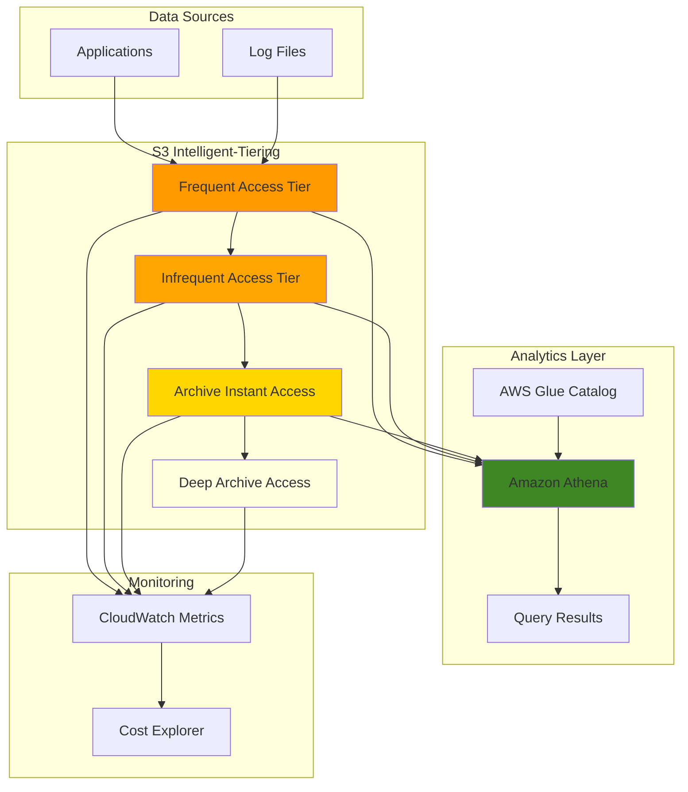

# Cost-Optimized Analytics with S3 Tiering

## Problem

A financial services company generates 2TB of transaction logs daily for fraud detection analytics. While they need frequent access to recent data for real-time analysis, older data is accessed infrequently but must remain available for compliance reporting. Manual storage management is consuming significant engineering resources, and storage costs are growing unsustainably without optimization, leading to budget overruns and inefficient resource allocation.

## Solution

Implement S3 Intelligent-Tiering with automatic archiving to optimize storage costs while maintaining analytics capabilities through Amazon Athena. This solution automatically moves data between access tiers based on usage patterns, enables deep archive options for long-term retention, and provides cost monitoring through CloudWatch metrics to ensure optimal spending without manual intervention.

## Architecture Diagram



## Prerequisites

1. AWS account with permissions for S3, Athena, Glue, and CloudWatch
2. AWS CLI v2 installed and configured (or AWS CloudShell)
3. Basic understanding of S3 storage classes and SQL queries
4. Sample log data or ability to generate test data
5. Estimated cost: $15-25/month for 100GB of data with mixed access patterns

> **Note**: S3 Intelligent-Tiering has a monthly monitoring fee of $0.0025 per 1,000 objects, but savings typically outweigh costs for data larger than 128KB. For detailed cost analysis, see [S3 Intelligent-Tiering pricing](https://docs.aws.amazon.com/AmazonS3/latest/userguide/intelligent-tiering-overview.html).

## Preparation

```bash
# Set environment variables
export AWS_REGION=$(aws configure get region)
export AWS_ACCOUNT_ID=$(aws sts get-caller-identity \
    --query Account --output text)

# Generate unique identifiers for resources
RANDOM_SUFFIX=$(aws secretsmanager get-random-password \
    --exclude-punctuation --exclude-uppercase \
    --password-length 6 --require-each-included-type \
    --output text --query RandomPassword)

export BUCKET_NAME="cost-optimized-analytics-${RANDOM_SUFFIX}"
export GLUE_DATABASE="analytics_database_${RANDOM_SUFFIX}"
export ATHENA_WORKGROUP="cost-optimized-workgroup-${RANDOM_SUFFIX}"

# Create S3 bucket with versioning and encryption
aws s3api create-bucket \
    --bucket $BUCKET_NAME \
    --region $AWS_REGION \
    --create-bucket-configuration LocationConstraint=$AWS_REGION

aws s3api put-bucket-versioning \
    --bucket $BUCKET_NAME \
    --versioning-configuration Status=Enabled

aws s3api put-bucket-encryption \
    --bucket $BUCKET_NAME \
    --server-side-encryption-configuration '{
        "Rules": [{
            "ApplyServerSideEncryptionByDefault": {
                "SSEAlgorithm": "AES256"
            }
        }]
    }'

echo "✅ Created bucket: $BUCKET_NAME"
```

## Steps

1. **Configure S3 Intelligent-Tiering with Deep Archive**:

   S3 Intelligent-Tiering automatically optimizes storage costs by monitoring access patterns and moving objects between frequent and infrequent access tiers. The configuration below enables automatic archiving to both Archive Instant Access (90 days) and Deep Archive Access (180 days) tiers, providing maximum cost savings for long-term data retention.

   ```bash
   # Create S3 Intelligent-Tiering configuration with all tiers
   aws s3api put-bucket-intelligent-tiering-configuration \
       --bucket $BUCKET_NAME \
       --id "cost-optimization-config" \
       --intelligent-tiering-configuration '{
           "Id": "cost-optimization-config",
           "Status": "Enabled",
           "Filter": {
               "Prefix": "analytics-data/"
           },
           "Tierings": [
               {
                   "Days": 90,
                   "AccessTier": "ARCHIVE_ACCESS"
               },
               {
                   "Days": 180,
                   "AccessTier": "DEEP_ARCHIVE_ACCESS"
               }
           ]
       }'
   
   echo "✅ Configured S3 Intelligent-Tiering with archive tiers"
   ```

2. **Create Lifecycle Policy for Automatic Transitions**:

   Lifecycle policies work in conjunction with Intelligent-Tiering to ensure new objects are automatically enrolled in cost optimization. Setting the transition to 0 days means objects are immediately enrolled in Intelligent-Tiering upon upload.

   ```bash
   # Create lifecycle policy for new objects
   aws s3api put-bucket-lifecycle-configuration \
       --bucket $BUCKET_NAME \
       --lifecycle-configuration '{
           "Rules": [{
               "ID": "intelligent-tiering-transition",
               "Status": "Enabled",
               "Filter": {
                   "Prefix": "analytics-data/"
               },
               "Transitions": [{
                   "Days": 0,
                   "StorageClass": "INTELLIGENT_TIERING"
               }]
           }]
       }'
   
   echo "✅ Created lifecycle policy for automatic transitions"
   ```

3. **Upload Sample Analytics Data**:

   This step creates representative data with different access patterns to demonstrate how S3 Intelligent-Tiering optimizes costs based on actual usage. Recent data simulates frequently accessed transaction logs for real-time fraud detection, while older data represents archived records needed for compliance reporting but accessed infrequently.

   ```bash
   # Create sample log data with different access patterns
   mkdir -p /tmp/analytics-data
   
   # Generate recent data (frequently accessed)
   for i in {1..10}; do
       echo "$(date -d "$i days ago" '+%Y-%m-%d %H:%M:%S'),user_$((RANDOM%1000)),transaction_$((RANDOM%10000)),amount_$((RANDOM%1000))" \
           > /tmp/analytics-data/recent-logs-day-$i.csv
   done
   
   # Generate older data (infrequently accessed)
   for i in {1..5}; do
       echo "$(date -d "$((i+30)) days ago" '+%Y-%m-%d %H:%M:%S'),user_$((RANDOM%1000)),transaction_$((RANDOM%10000)),amount_$((RANDOM%1000))" \
           > /tmp/analytics-data/archive-logs-month-$i.csv
   done
   
   # Upload data with Intelligent-Tiering storage class
   aws s3 sync /tmp/analytics-data s3://$BUCKET_NAME/analytics-data/ \
       --storage-class INTELLIGENT_TIERING
   
   echo "✅ Uploaded sample analytics data to S3"
   ```

   The data is now uploaded directly to the INTELLIGENT_TIERING storage class, where S3 will automatically monitor access patterns and optimize costs. This real-world simulation provides the foundation for testing analytical queries across different data access patterns while observing cost optimization in action.

4. **Create AWS Glue Database and Table**:

   AWS Glue Data Catalog acts as a central metadata repository that enables seamless integration between S3 storage and analytics services like Athena. Creating a Glue database and table definition allows Athena to query S3 data using standard SQL without requiring data movement or transformation, essential for cost-effective analytics across different storage tiers.

   ```bash
   # Create Glue database
   aws glue create-database \
       --database-input Name=$GLUE_DATABASE,Description="Cost-optimized analytics database"
   
   # Create Glue table for analytics data
   aws glue create-table \
       --database-name $GLUE_DATABASE \
       --table-input '{
           "Name": "transaction_logs",
           "StorageDescriptor": {
               "Columns": [
                   {"Name": "timestamp", "Type": "string"},
                   {"Name": "user_id", "Type": "string"},
                   {"Name": "transaction_id", "Type": "string"},
                   {"Name": "amount", "Type": "string"}
               ],
               "Location": "s3://'$BUCKET_NAME'/analytics-data/",
               "InputFormat": "org.apache.hadoop.mapred.TextInputFormat",
               "OutputFormat": "org.apache.hadoop.hive.ql.io.HiveIgnoreKeyTextOutputFormat",
               "SerdeInfo": {
                   "SerializationLibrary": "org.apache.hadoop.hive.serde2.lazy.LazySimpleSerDe",
                   "Parameters": {
                       "field.delim": ","
                   }
               }
           }
       }'
   
   echo "✅ Created Glue database and table"
   ```

   The Glue table schema now maps to your S3 data structure, enabling efficient querying regardless of which storage tier objects reside in. This metadata-driven approach ensures consistent query performance while S3 Intelligent-Tiering optimizes storage costs in the background. Learn more about [AWS Glue Data Catalog](https://docs.aws.amazon.com/glue/latest/dg/components-overview.html) and its role in analytics architectures.

5. **Configure Amazon Athena Workgroup**:

   Workgroups provide cost control and governance for Athena queries. The BytesScannedCutoffPerQuery setting (1GB here) prevents runaway query costs by canceling queries that scan excessive data, which is crucial when analyzing large datasets across multiple storage tiers.

   ```bash
   # Create Athena workgroup with cost controls
   aws athena create-work-group \
       --name $ATHENA_WORKGROUP \
       --description "Cost-optimized workgroup for analytics" \
       --configuration '{
           "ResultConfiguration": {
               "OutputLocation": "s3://'$BUCKET_NAME'/athena-results/"
           },
           "EnforceWorkGroupConfiguration": true,
           "PublishCloudWatchMetrics": true,
           "BytesScannedCutoffPerQuery": 1073741824
       }'
   
   echo "✅ Created Athena workgroup with cost controls"
   ```

   > **Warning**: Athena charges $5 per TB of data scanned. Use columnar formats like Parquet and partition your data to minimize scan costs, especially when querying archived data. For cost optimization strategies, see [Athena cost control best practices](https://docs.aws.amazon.com/athena/latest/ug/workgroups-manage-queries-control-costs.html).

6. **Set Up CloudWatch Monitoring**:

   CloudWatch monitoring provides essential visibility into S3 Intelligent-Tiering cost optimization and query performance. The custom dashboard tracks storage distribution across tiers, enabling data-driven decisions about archiving policies, while Cost Anomaly Detection proactively identifies unusual spending patterns that could indicate inefficient data access or configuration issues.

   ```bash
   # Create CloudWatch dashboard for cost monitoring
   aws cloudwatch put-dashboard \
       --dashboard-name "S3-Cost-Optimization-${RANDOM_SUFFIX}" \
       --dashboard-body '{
           "widgets": [
               {
                   "type": "metric",
                   "properties": {
                       "metrics": [
                           ["AWS/S3", "BucketSizeBytes", "BucketName", "'$BUCKET_NAME'", "StorageType", "IntelligentTieringFAStorage"],
                           [".", ".", ".", ".", ".", "IntelligentTieringIAStorage"],
                           [".", ".", ".", ".", ".", "IntelligentTieringAAStorage"],
                           [".", ".", ".", ".", ".", "IntelligentTieringAIAStorage"],
                           [".", ".", ".", ".", ".", "IntelligentTieringDAAStorage"]
                       ],
                       "period": 300,
                       "stat": "Average",
                       "region": "'$AWS_REGION'",
                       "title": "S3 Intelligent-Tiering Storage Distribution"
                   }
               }
           ]
       }'
   
   # Create cost anomaly detection
   aws ce put-anomaly-detector \
       --anomaly-detector '{
           "DetectorName": "S3-Cost-Anomaly-'$RANDOM_SUFFIX'",
           "MonitorType": "DIMENSIONAL",
           "DimensionSpecification": {
               "Dimension": "SERVICE",
               "Values": ["Amazon Simple Storage Service"]
           }
       }'
   
   echo "✅ Created CloudWatch monitoring and cost anomaly detection"
   ```

   The monitoring infrastructure is now active, providing real-time visibility into storage tier distribution and cost trends. This observability layer enables proactive cost management and helps validate that Intelligent-Tiering is delivering expected savings. For comprehensive monitoring guidance, see [CloudWatch S3 Metrics](https://docs.aws.amazon.com/AmazonS3/latest/userguide/cloudwatch-monitoring.html).

7. **Create Cost Optimization Script**:

   This custom monitoring script provides automated cost analysis by querying CloudWatch metrics for storage tier distribution and Athena query costs. Regular execution of this script helps track cost optimization progress, identify trends in data access patterns, and validate that Intelligent-Tiering is delivering expected business value through reduced storage expenses.

   ```bash
   # Create monitoring script for cost analysis
   cat > /tmp/cost-analysis.sh << 'EOF'
#!/bin/bash
   
BUCKET_NAME=$1
   
echo "=== S3 Intelligent-Tiering Cost Analysis ==="
echo "Bucket: $BUCKET_NAME"
echo "Date: $(date)"
echo
   
# Get storage metrics
echo "Storage Distribution by Tier:"
aws cloudwatch get-metric-statistics \
    --namespace AWS/S3 \
    --metric-name BucketSizeBytes \
    --dimensions Name=BucketName,Value=$BUCKET_NAME Name=StorageType,Value=IntelligentTieringFAStorage \
    --start-time $(date -d '1 day ago' -u +%Y-%m-%dT%H:%M:%S) \
    --end-time $(date -u +%Y-%m-%dT%H:%M:%S) \
    --period 3600 \
    --statistics Average \
    --query 'Datapoints[0].Average' \
    --output text | awk '{printf "Frequent Access: %.2f GB\n", $1/1024/1024/1024}'
   
# Get Athena query costs
echo -e "\nAthena Query Metrics:"
aws cloudwatch get-metric-statistics \
    --namespace AWS/Athena \
    --metric-name DataScannedInBytes \
    --start-time $(date -d '1 day ago' -u +%Y-%m-%dT%H:%M:%S) \
    --end-time $(date -u +%Y-%m-%dT%H:%M:%S) \
    --period 3600 \
    --statistics Sum \
    --query 'Datapoints[0].Sum' \
    --output text | awk '{printf "Data Scanned: %.2f GB\n", $1/1024/1024/1024}'
EOF
   
   chmod +x /tmp/cost-analysis.sh
   
   echo "✅ Created cost optimization monitoring script"
   ```

   The cost analysis script is now ready to provide ongoing insights into storage optimization effectiveness. This automated monitoring capability ensures continuous visibility into cost trends and helps identify opportunities for further optimization as data access patterns evolve over time.

8. **Test Analytics Performance Across Tiers**:

   Testing analytical query performance validates that S3 Intelligent-Tiering maintains consistent query capabilities across all storage tiers. This verification ensures that cost optimization doesn't compromise analytical capabilities, demonstrating that archived data in deeper tiers remains accessible for compliance reporting and historical analysis without performance degradation.

   ```bash
   # Test query performance on different data access patterns
   QUERY_ID=$(aws athena start-query-execution \
       --query-string "SELECT COUNT(*) as total_transactions FROM $GLUE_DATABASE.transaction_logs WHERE timestamp LIKE '$(date +%Y-%m-)%'" \
       --work-group $ATHENA_WORKGROUP \
       --query 'QueryExecutionId' \
       --output text)
   
   # Wait for query completion
   aws athena get-query-execution \
       --query-execution-id $QUERY_ID \
       --query 'QueryExecution.Status.State' \
       --output text
   
   echo "✅ Executed test query with ID: $QUERY_ID"
   ```

   The analytical query has been successfully executed, demonstrating that S3 Intelligent-Tiering enables seamless analytics across all storage tiers. This performance validation confirms that cost optimization doesn't compromise query capabilities, ensuring business continuity while reducing storage expenses. For advanced query optimization techniques, refer to [Athena cost control best practices](https://docs.aws.amazon.com/athena/latest/ug/workgroups-manage-queries-control-costs.html).

## Validation & Testing

1. **Verify S3 Intelligent-Tiering Configuration**:

   ```bash
   # Check Intelligent-Tiering configuration
   aws s3api get-bucket-intelligent-tiering-configuration \
       --bucket $BUCKET_NAME \
       --id "cost-optimization-config"
   ```

   Expected output: Configuration showing enabled status and archive tier settings.

2. **Test Data Access Patterns**:

   ```bash
   # Simulate frequent access to recent data
   aws s3 cp s3://$BUCKET_NAME/analytics-data/recent-logs-day-1.csv /tmp/test-download.csv
   
   # Check object storage class
   aws s3api head-object \
       --bucket $BUCKET_NAME \
       --key analytics-data/recent-logs-day-1.csv \
       --query 'StorageClass'
   ```

   Expected output: "INTELLIGENT_TIERING" storage class.

3. **Validate Athena Query Performance**:

   ```bash
   # Run analytical query and measure performance
   QUERY_ID=$(aws athena start-query-execution \
       --query-string "SELECT user_id, COUNT(*) as transaction_count FROM $GLUE_DATABASE.transaction_logs GROUP BY user_id ORDER BY transaction_count DESC LIMIT 10" \
       --work-group $ATHENA_WORKGROUP \
       --query 'QueryExecutionId' \
       --output text)
   
   # Check query execution details
   aws athena get-query-execution \
       --query-execution-id $QUERY_ID \
       --query 'QueryExecution.Statistics'
   ```

4. **Monitor Cost Metrics**:

   ```bash
   # Run cost analysis script
   /tmp/cost-analysis.sh $BUCKET_NAME
   
   # Check CloudWatch dashboard
   echo "View dashboard at: https://console.aws.amazon.com/cloudwatch/home?region=$AWS_REGION#dashboards:name=S3-Cost-Optimization-${RANDOM_SUFFIX}"
   ```

## Cleanup

1. **Remove Athena Resources**:

   ```bash
   # Delete Athena workgroup
   aws athena delete-work-group \
       --work-group $ATHENA_WORKGROUP \
       --recursive-delete-option
   
   echo "✅ Deleted Athena workgroup"
   ```

2. **Remove Glue Resources**:

   ```bash
   # Delete Glue table and database
   aws glue delete-table \
       --database-name $GLUE_DATABASE \
       --name transaction_logs
   
   aws glue delete-database \
       --name $GLUE_DATABASE
   
   echo "✅ Deleted Glue resources"
   ```

3. **Remove CloudWatch Resources**:

   ```bash
   # Delete CloudWatch dashboard
   aws cloudwatch delete-dashboards \
       --dashboard-names "S3-Cost-Optimization-${RANDOM_SUFFIX}"
   
   # Delete cost anomaly detector
   DETECTOR_ARN=$(aws ce get-anomaly-detectors \
       --query 'AnomalyDetectors[?DetectorName==`S3-Cost-Anomaly-'$RANDOM_SUFFIX'`].DetectorArn' \
       --output text)
   
   if [ ! -z "$DETECTOR_ARN" ]; then
       aws ce delete-anomaly-detector \
           --detector-arn $DETECTOR_ARN
   fi
   
   echo "✅ Deleted CloudWatch resources"
   ```

4. **Empty and Delete S3 Bucket**:

   ```bash
   # Remove all objects and versions
   aws s3 rm s3://$BUCKET_NAME --recursive
   
   # Remove delete markers and versions
   aws s3api delete-bucket \
       --bucket $BUCKET_NAME
   
   # Clean up local files
   rm -rf /tmp/analytics-data
   rm -f /tmp/cost-analysis.sh /tmp/test-download.csv
   
   echo "✅ Deleted S3 bucket and local files"
   ```

## Discussion

S3 Intelligent-Tiering provides automatic cost optimization by monitoring access patterns and moving objects between storage tiers without performance impact. The solution automatically transitions objects to Infrequent Access after 30 days of no access, then to Archive Instant Access after 90 days, with optional Deep Archive Access after 180 days. This eliminates the need for manual lifecycle management while ensuring data remains immediately accessible when needed. For detailed tier transition behavior, see [How S3 Intelligent-Tiering works](https://docs.aws.amazon.com/AmazonS3/latest/userguide/intelligent-tiering-overview.html).

The integration with Amazon Athena enables cost-effective analytics across all storage tiers. Unlike traditional archive solutions, Intelligent-Tiering's Archive Instant Access tier provides millisecond retrieval times, allowing analytical queries to run seamlessly across hot and cold data. The workgroup configuration with query limits prevents runaway costs while maintaining analytical capabilities. For more information on Athena-S3 integration, see [Querying S3 with Amazon Athena](https://docs.aws.amazon.com/athena/latest/ug/querying-s3.html).

Cost monitoring through CloudWatch metrics and Cost Explorer provides visibility into storage distribution and query costs. The anomaly detection helps identify unusual spending patterns, while the custom dashboard tracks tier distribution over time. Organizations typically see 20-40% cost reduction on analytics workloads with mixed access patterns, with savings increasing as data ages and moves to lower-cost tiers. For comprehensive monitoring guidance, see [CloudWatch Metrics concepts](https://docs.aws.amazon.com/AmazonCloudWatch/latest/monitoring/cloudwatch_concepts.html).

> **Tip**: Enable S3 Storage Class Analysis to understand access patterns before implementing Intelligent-Tiering, helping optimize the archive tier transition days for your specific workload. Learn more about [S3 Storage Class Analysis](https://docs.aws.amazon.com/AmazonS3/latest/userguide/analytics-storage-class.html) for data-driven storage optimization.

## Challenge

Extend this solution by implementing these enhancements:

1. **Implement Partitioned Analytics**: Create time-based partitions in Glue tables and configure partition projection in Athena to improve query performance and reduce costs for time-series analytics.

2. **Add Automated Cost Reporting**: Build a Lambda function that generates weekly cost reports comparing storage costs across tiers and sends notifications when savings thresholds are met.

3. **Implement Query Result Caching**: Configure Athena query result caching and create a S3 Select optimization layer to reduce data scanning costs for frequently run analytical queries.

4. **Create Multi-Region Analytics**: Extend the solution to support cross-region analytics with S3 Cross-Region Replication and regional Athena workgroups for global data analysis.

5. **Add ML-Powered Access Prediction**: Integrate with Amazon SageMaker to predict future access patterns and proactively optimize storage tier transitions based on business cycles and historical usage.

## Infrastructure Code

*Infrastructure code will be generated after recipe approval.*