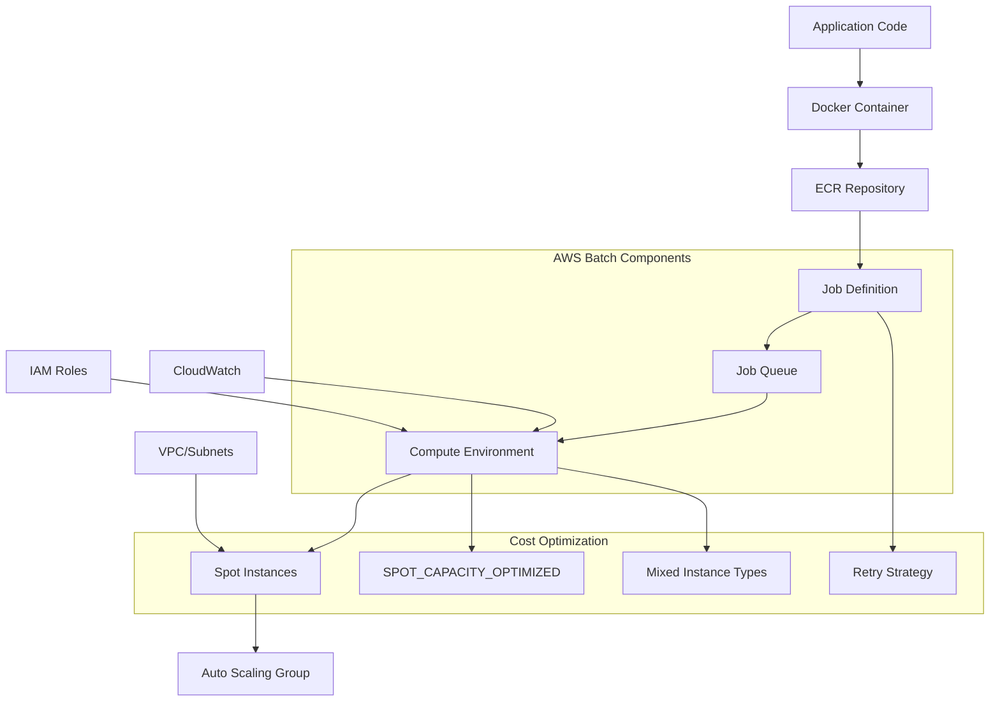

# Cost-Optimized Batch Processing with Spot

## Problem

You need to process large-scale computational workloads cost-effectively while maintaining reliability and fault tolerance. Traditional approaches using On-Demand instances can be expensive for batch workloads, and managing batch processing infrastructure requires significant operational overhead. You want to leverage the significant cost savings of Amazon EC2 Spot Instances while ensuring your batch jobs complete successfully despite potential interruptions.

## Solution

Configure AWS Batch with EC2 Spot Instances to process batch workloads at up to 90% cost savings compared to On-Demand instances. Implement intelligent retry strategies, job queue management, and fault tolerance mechanisms to handle Spot instance interruptions gracefully while maintaining job completion reliability.

## Architecture Diagram



## Prerequisites

1. AWS CLI installed and configured with appropriate permissions
2. Docker installed for containerizing batch applications
3. Basic understanding of containerization and batch processing concepts
4. An AWS account with permissions to create IAM roles, ECR repositories, and AWS Batch resources
5. A sample batch processing application (we'll provide a Python example)
6. Estimated cost: $5-15 for testing this recipe with small workloads

## Preparation

Set up the environment and create necessary resources:

```bash
export AWS_ACCOUNT_ID=$(aws sts get-caller-identity \
    --query Account --output text)
export AWS_REGION=$(aws configure get region)
export BATCH_SERVICE_ROLE_NAME=AWSBatchServiceRole
export INSTANCE_ROLE_NAME=ecsInstanceRole
export JOB_ROLE_NAME=BatchJobExecutionRole
```

```bash
RANDOM_STRING=$(aws secretsmanager get-random-password \
    --exclude-punctuation --exclude-uppercase \
    --password-length 6 --require-each-included-type \
    --output text --query RandomPassword)
export ECR_REPO_NAME=batch-demo-$RANDOM_STRING
export COMPUTE_ENV_NAME=spot-compute-env-$RANDOM_STRING
export JOB_QUEUE_NAME=spot-job-queue-$RANDOM_STRING
export JOB_DEFINITION_NAME=batch-job-def-$RANDOM_STRING
```

## Steps

1. **Create the IAM service role for AWS Batch**:

   AWS Batch requires a service role to manage compute resources on your behalf. This role enables AWS Batch to create, modify, and terminate EC2 instances, Auto Scaling groups, and other resources needed for your compute environments. The service role follows the principle of least privilege, granting only the permissions necessary for AWS Batch operations.

   ```bash
   aws iam create-role \
       --role-name $BATCH_SERVICE_ROLE_NAME \
       --assume-role-policy-document '{
           "Version": "2012-10-17",
           "Statement": [
               {
                   "Effect": "Allow",
                   "Principal": {
                       "Service": "batch.amazonaws.com"
                   },
                   "Action": "sts:AssumeRole"
               }
           ]
       }'
   ```

   ```bash
   aws iam attach-role-policy \
       --role-name $BATCH_SERVICE_ROLE_NAME \
       --policy-arn arn:aws:iam::aws:policy/service-role/AWSBatchServiceRole
   ```

   The service role is now configured with the necessary permissions to manage compute resources. This establishes the security foundation for AWS Batch to provision and manage Spot instances on your behalf.

   > **Note**: The `AWSBatchServiceRole` managed policy provides the minimum permissions required for AWS Batch to manage EC2 instances, Auto Scaling groups, and ECS clusters. This follows AWS Well-Architected security principles by granting only necessary permissions.

2. **Create the IAM instance role for EC2 instances**:

   EC2 instances in your compute environment need permissions to register with the ECS service and pull container images. The instance role provides secure, temporary credentials to EC2 instances without requiring long-term access keys. This role is crucial for container orchestration and enables instances to communicate with AWS services securely.

   ```bash
   aws iam create-role \
       --role-name $INSTANCE_ROLE_NAME \
       --assume-role-policy-document '{
           "Version": "2012-10-17",
           "Statement": [
               {
                   "Effect": "Allow",
                   "Principal": {
                       "Service": "ec2.amazonaws.com"
                   },
                   "Action": "sts:AssumeRole"
               }
           ]
       }'
   ```

   ```bash
   aws iam attach-role-policy \
       --role-name $INSTANCE_ROLE_NAME \
       --policy-arn arn:aws:iam::aws:policy/service-role/AmazonEC2ContainerServiceforEC2Role
   ```

   ```bash
   aws iam create-instance-profile \
       --instance-profile-name $INSTANCE_ROLE_NAME
   ```

   ```bash
   aws iam add-role-to-instance-profile \
       --instance-profile-name $INSTANCE_ROLE_NAME \
       --role-name $INSTANCE_ROLE_NAME
   ```

   The instance profile and role are now configured to enable EC2 instances to interact with ECS services. This security boundary ensures that compute instances have only the necessary permissions to execute batch jobs.

3. **Create the IAM job execution role**:

   The job execution role provides permissions for ECS tasks to pull container images from ECR and write logs to CloudWatch. This role operates at the task level, creating a security boundary between different batch jobs and enabling secure access to AWS services during job execution. This separation of concerns ensures that batch jobs can only access resources they're explicitly granted permission to use.

   ```bash
   aws iam create-role \
       --role-name $JOB_ROLE_NAME \
       --assume-role-policy-document '{
           "Version": "2012-10-17",
           "Statement": [
               {
                   "Effect": "Allow",
                   "Principal": {
                       "Service": "ecs-tasks.amazonaws.com"
                   },
                   "Action": "sts:AssumeRole"
               }
           ]
       }'
   ```

   ```bash
   aws iam attach-role-policy \
       --role-name $JOB_ROLE_NAME \
       --policy-arn arn:aws:iam::aws:policy/service-role/AmazonECSTaskExecutionRolePolicy
   ```

   The job execution role is now configured with the necessary permissions for container orchestration. This enables secure container image pulls and log management for your batch jobs.

4. **Create an ECR repository for the batch application**:

   Amazon ECR provides a secure, scalable container registry that integrates seamlessly with AWS Batch. By storing container images in ECR, you enable fast image pulls, reduce network latency, and maintain version control for your batch applications. ECR also provides vulnerability scanning and lifecycle policies to manage image storage costs.

   ```bash
   aws ecr create-repository --repository-name $ECR_REPO_NAME
   ```

   ```bash
   export ECR_URI=$(aws ecr describe-repositories \
       --repository-names $ECR_REPO_NAME \
       --query 'repositories[0].repositoryUri' --output text)
   ```

   The ECR repository is now ready to store your containerized batch application. This establishes a secure and reliable source for container images that AWS Batch can pull during job execution.

5. **Create a sample Python batch application**:

   Containerized applications provide consistency across different environments and enable efficient resource utilization. This sample application demonstrates batch processing patterns including progress tracking, proper logging, and graceful error handling. The application is designed to be resilient and observable, which are crucial qualities for batch workloads running on potentially interrupted Spot instances.

   ```bash
   cat > batch_app.py << 'EOF'
   import os
   import sys
   import time
   import random
   import logging
   
   # Configure logging
   logging.basicConfig(level=logging.INFO)
   logger = logging.getLogger(__name__)
   
   def simulate_batch_processing():
       """Simulate a batch processing job."""
       job_id = os.environ.get('AWS_BATCH_JOB_ID', 'local-test')
       logger.info(f"Starting batch job: {job_id}")
       
       # Simulate variable processing time (1-5 minutes)
       processing_time = random.randint(60, 300)
       logger.info(f"Processing will take {processing_time} seconds")
       
       # Process data in chunks to show progress
       chunks = 10
       chunk_time = processing_time / chunks
       
       for i in range(chunks):
           time.sleep(chunk_time)
           progress = ((i + 1) / chunks) * 100
           logger.info(f"Progress: {progress:.1f}%")
       
       logger.info(f"Batch job {job_id} completed successfully")
       return 0
   
   if __name__ == "__main__":
       try:
           exit_code = simulate_batch_processing()
           sys.exit(exit_code)
       except Exception as e:
           logger.error(f"Batch job failed: {str(e)}")
           sys.exit(1)
   EOF
   ```

   The batch application is now created with proper logging and error handling. This code serves as a foundation for your own batch processing logic and demonstrates best practices for containerized batch applications.

6. **Create a Dockerfile for the batch application**:

   Docker containers provide a consistent runtime environment that eliminates "works on my machine" issues and enables efficient resource utilization. The lightweight base image reduces container startup time and minimizes attack surface, which is particularly important for batch workloads that may run on frequently changing Spot instances.

   ```bash
   cat > Dockerfile << 'EOF'
   FROM python:3.9-slim
   
   WORKDIR /app
   
   COPY batch_app.py .
   
   CMD ["python", "batch_app.py"]
   EOF
   ```

   The Dockerfile is now ready for building a containerized version of your batch application. This establishes a portable, reproducible environment that can run consistently across different instance types and configurations.

7. **Build and push the Docker image to ECR**:

   The container image lifecycle involves authentication, building, tagging, and pushing to the registry. ECR provides secure, efficient image storage with built-in vulnerability scanning and lifecycle policies. Properly tagged images enable version control and rollback capabilities for your batch applications.

   ```bash
   aws ecr get-login-password --region $AWS_REGION | \
       docker login --username AWS --password-stdin $ECR_URI
   ```

   ```bash
   docker build -t $ECR_REPO_NAME .
   docker tag $ECR_REPO_NAME:latest $ECR_URI:latest
   docker push $ECR_URI:latest
   ```

   The container image is now available in ECR and ready for deployment. AWS Batch can efficiently pull this image across multiple instance types and availability zones for distributed batch processing.

8. **Get the default VPC and subnets**:

   AWS Batch compute environments require VPC configuration to provide network isolation and security. Using multiple subnets across different availability zones enables high availability and fault tolerance for your batch workloads. The default VPC provides a simple starting point, though production workloads typically use custom VPCs with specific security configurations.

   ```bash
   export VPC_ID=$(aws ec2 describe-vpcs \
       --filters "Name=is-default,Values=true" \
       --query 'Vpcs[0].VpcId' --output text)
   ```

   ```bash
   export SUBNET_IDS=$(aws ec2 describe-subnets \
       --filters "Name=vpc-id,Values=$VPC_ID" \
       --query 'Subnets[].SubnetId' --output text | tr '\t' ',')
   ```

   The VPC and subnet configuration is now available for the compute environment. This network foundation enables secure communication between batch instances and AWS services while supporting multi-AZ deployment for resilience.

9. **Create a security group for the batch instances**:

   Security groups act as virtual firewalls that control inbound and outbound traffic for your batch instances. For batch workloads, the primary requirement is outbound internet access to pull container images from ECR and send logs to CloudWatch. Properly configured security groups provide defense in depth and network-level security controls.

   ```bash
   export SECURITY_GROUP_ID=$(aws ec2 create-security-group \
       --group-name batch-sg-$RANDOM_STRING \
       --description "Security group for AWS Batch instances" \
       --vpc-id $VPC_ID \
       --query 'GroupId' --output text)
   ```

   The security group is now configured with default outbound rules allowing internet access. This enables container image pulls and log delivery while maintaining network security boundaries.

   > **Note**: This security group uses default egress rules which allow all outbound traffic. For production workloads, restrict egress rules to only necessary destinations for enhanced security. See the [EC2 Security Groups documentation](https://docs.aws.amazon.com/AWSEC2/latest/UserGuide/ec2-security-groups.html) for best practices on network security.

10. **Create the AWS Batch compute environment with Spot instances**:

    The compute environment is the core of your cost optimization strategy. By using Spot instances with the SPOT_CAPACITY_OPTIMIZED allocation strategy, AWS Batch automatically selects instance types from the deepest Spot capacity pools, minimizing interruption risk. The mixed instance type configuration provides flexibility and improves availability across different instance families.

    ```bash
    aws batch create-compute-environment \
        --compute-environment-name $COMPUTE_ENV_NAME \
        --type MANAGED \
        --state ENABLED \
        --compute-resources '{
            "type": "EC2",
            "minvCpus": 0,
            "maxvCpus": 100,
            "desiredvCpus": 0,
            "InstanceTypes": ["c5.large", "c5.xlarge", "c5.2xlarge", "m5.large", "m5.xlarge", "m5.2xlarge"],
            "allocationStrategy": "SPOT_CAPACITY_OPTIMIZED",
            "bidPercentage": 80,
            "ec2Configuration": [{
                "imageType": "ECS_AL2"
            }],
            "subnets": ["'$(echo $SUBNET_IDS | sed 's/,/", "/g')'"],
            "securityGroupIds": ["'$SECURITY_GROUP_ID'"],
            "instanceRole": "arn:aws:iam::'$AWS_ACCOUNT_ID':instance-profile/'$INSTANCE_ROLE_NAME'",
            "tags": {
                "Environment": "batch-demo",
                "CostCenter": "batch-processing"
            }
        }' \
        --service-role arn:aws:iam::$AWS_ACCOUNT_ID:role/$BATCH_SERVICE_ROLE_NAME
    ```

    The compute environment is now configured for cost-optimized batch processing. AWS Batch will automatically provision and manage Spot instances based on job demand, scaling from 0 to 100 vCPUs as needed while maintaining cost efficiency.

    > **Tip**: The `SPOT_CAPACITY_OPTIMIZED` allocation strategy helps AWS Batch choose instances from the deepest Spot capacity pools, reducing the likelihood of interruptions. The `bidPercentage` of 80 means you'll pay up to 80% of the On-Demand price. Learn more about allocation strategies in the [AWS Batch Best Practices documentation](https://docs.aws.amazon.com/batch/latest/userguide/bestpractice6.html).

11. **Create a job queue**:

    Job queues provide priority-based scheduling and resource allocation for batch workloads. The queue acts as a buffer between job submission and execution, enabling efficient resource utilization and workload management. Multiple queues can be configured with different priorities to handle various workload types and business requirements.

    ```bash
    aws batch create-job-queue \
        --job-queue-name $JOB_QUEUE_NAME \
        --state ENABLED \
        --priority 1 \
        --compute-environment-order '[{
            "order": 1,
            "computeEnvironment": "'$COMPUTE_ENV_NAME'"
        }]'
    ```

    The job queue is now ready to receive and schedule batch jobs. This establishes the scheduling foundation that will distribute workloads across your cost-optimized Spot instance compute environment.

12. **Create a job definition with retry strategy**:

    Job definitions specify the container configuration, resource requirements, and execution parameters for batch jobs. The intelligent retry strategy is crucial for Spot instance workloads, automatically retrying jobs that fail due to instance interruptions while avoiding retries for application-level failures. This configuration maximizes job completion rates while minimizing costs.

    ```bash
    aws batch register-job-definition \
        --job-definition-name $JOB_DEFINITION_NAME \
        --type container \
        --container-properties '{
            "image": "'$ECR_URI':latest",
            "vcpus": 1,
            "memory": 512,
            "jobRoleArn": "arn:aws:iam::'$AWS_ACCOUNT_ID':role/'$JOB_ROLE_NAME'"
        }' \
        --retry-strategy '{
            "attempts": 3,
            "evaluateOnExit": [{
                "onStatusReason": "Host EC2*",
                "action": "RETRY"
            }, {
                "onReason": "*",
                "action": "EXIT"
            }]
        }' \
        --timeout '{"attemptDurationSeconds": 3600}'
    ```

    The job definition is now configured with Spot-optimized retry logic and resource specifications. This template enables reliable job execution on cost-effective Spot instances while handling interruptions gracefully.

    > **Warning**: The retry strategy uses `onStatusReason: "Host EC2*"` to catch Spot instance interruptions, which are typically reported with status reasons beginning with "Host EC2". This pattern ensures jobs are retried only when host-level failures occur, not application failures. For more details, see the [AWS Batch retry strategy documentation](https://docs.aws.amazon.com/batch/latest/userguide/bestpractice6.html).

13. **Submit a test batch job**:

    Job submission initiates the batch processing workflow, moving jobs through the scheduling pipeline from submission to execution. The unique job ID enables tracking and monitoring throughout the job lifecycle, providing visibility into job status, resource utilization, and execution outcomes.

    ```bash
    export JOB_ID=$(aws batch submit-job \
        --job-name test-batch-job-$(date +%s) \
        --job-queue $JOB_QUEUE_NAME \
        --job-definition $JOB_DEFINITION_NAME \
        --query 'jobId' --output text)
    ```

    ```bash
    echo "Submitted job with ID: $JOB_ID"
    ```

    The batch job is now submitted and will progress through the scheduling queue. AWS Batch will automatically provision Spot instances and execute your containerized application based on the configured parameters.

14. **Monitor the job status**:

    Job monitoring provides real-time visibility into batch processing operations, enabling proactive management and troubleshooting. Understanding job states (SUBMITTED → PENDING → RUNNABLE → RUNNING → SUCCEEDED/FAILED) helps optimize resource allocation and identify performance bottlenecks in your batch processing pipeline.

    ```bash
    aws batch describe-jobs --jobs $JOB_ID \
        --query 'jobs[0].{Status:status,Queue:jobQueue,Def:jobDefinitionArn}' \
        --output table
    ```

    Job monitoring is now active and showing the current execution status. This visibility enables you to track job progress and verify that the cost optimization strategy is working effectively.

## Validation & Testing

Verify that your cost-optimized batch processing solution is working correctly:

1. Check the compute environment status:

```bash
aws batch describe-compute-environments \
    --compute-environments $COMPUTE_ENV_NAME \
    --query 'computeEnvironments[0].{Name:computeEnvironmentName,State:state,Status:status}' \
    --output table
```

You should see the compute environment in `VALID` status and `ENABLED` state.

2. Monitor job execution and verify Spot instance usage:

```bash
watch -n 30 'aws batch describe-jobs --jobs '$JOB_ID' --query "jobs[0].{Status:status,StartedAt:startedAt,StoppedAt:stoppedAt}" --output table'
```

3. Verify that Spot instances are being used:

```bash
aws ec2 describe-instances \
    --filters "Name=instance-lifecycle,Values=spot" \
    "Name=instance-state-name,Values=running" \
    --query 'Reservations[].Instances[].{InstanceId:InstanceId,InstanceType:InstanceType,SpotPrice:SpotInstanceRequestId}' \
    --output table
```

4. Check CloudWatch logs for job execution details:

```bash
aws logs describe-log-groups \
    --log-group-name-prefix /aws/batch/job \
    --query 'logGroups[].logGroupName' --output text
```

5. Submit multiple jobs to test scaling and cost optimization:

```bash
for i in {1..5}; do
    aws batch submit-job \
        --job-name batch-job-$i-$(date +%s) \
        --job-queue $JOB_QUEUE_NAME \
        --job-definition $JOB_DEFINITION_NAME
done
```

Expected results:
- Jobs should complete successfully despite potential Spot instance interruptions
- Multiple instance types should be utilized based on availability and cost
- Failed jobs due to Spot interruptions should automatically retry
- Total compute costs should be significantly lower than On-Demand equivalents

> **Warning**: If jobs consistently fail to start, check that your VPC has internet access (via Internet Gateway or NAT Gateway) for pulling container images from ECR. VPC networking requirements are detailed in the [AWS Batch networking documentation](https://docs.aws.amazon.com/batch/latest/userguide/vpc-endpoint-considerations.html).

## Cleanup

Remove all resources to avoid ongoing charges:

1. Cancel any running jobs:

```bash
aws batch list-jobs --job-queue $JOB_QUEUE_NAME \
    --job-status RUNNING \
    --query 'jobList[].jobId' --output text | \
    xargs -r -n1 aws batch cancel-job --job-id
```

2. Wait for jobs to terminate and disable the job queue:

```bash
aws batch update-job-queue \
    --job-queue $JOB_QUEUE_NAME \
    --state DISABLED
```

3. Delete the job queue:

```bash
aws batch delete-job-queue --job-queue $JOB_QUEUE_NAME
```

4. Disable and delete the compute environment:

```bash
aws batch update-compute-environment \
    --compute-environment $COMPUTE_ENV_NAME \
    --state DISABLED
```

```bash
aws batch delete-compute-environment \
    --compute-environment $COMPUTE_ENV_NAME
```

5. Deregister the job definition:

```bash
aws batch deregister-job-definition \
    --job-definition $JOB_DEFINITION_NAME
```

6. Delete the ECR repository:

```bash
aws ecr delete-repository \
    --repository-name $ECR_REPO_NAME \
    --force
```

7. Delete the security group:

```bash
aws ec2 delete-security-group \
    --group-id $SECURITY_GROUP_ID
```

8. Clean up IAM resources:

```bash
aws iam remove-role-from-instance-profile \
    --instance-profile-name $INSTANCE_ROLE_NAME \
    --role-name $INSTANCE_ROLE_NAME
```

```bash
aws iam delete-instance-profile \
    --instance-profile-name $INSTANCE_ROLE_NAME
```

```bash
aws iam detach-role-policy \
    --role-name $BATCH_SERVICE_ROLE_NAME \
    --policy-arn arn:aws:iam::aws:policy/service-role/AWSBatchServiceRole
```

```bash
aws iam detach-role-policy \
    --role-name $INSTANCE_ROLE_NAME \
    --policy-arn arn:aws:iam::aws:policy/service-role/AmazonEC2ContainerServiceforEC2Role
```

```bash
aws iam detach-role-policy \
    --role-name $JOB_ROLE_NAME \
    --policy-arn arn:aws:iam::aws:policy/service-role/AmazonECSTaskExecutionRolePolicy
```

```bash
aws iam delete-role --role-name $BATCH_SERVICE_ROLE_NAME
aws iam delete-role --role-name $INSTANCE_ROLE_NAME
aws iam delete-role --role-name $JOB_ROLE_NAME
```

9. Remove local files:

```bash
rm -f batch_app.py Dockerfile
```

## Discussion

AWS Batch with Spot Instances provides a powerful combination for cost-optimized batch processing. By leveraging Spot Instances, you can achieve cost savings of up to 90% compared to On-Demand instances, making it ideal for fault-tolerant, time-flexible workloads such as data processing, scientific computing, and machine learning training.

The key to successful Spot instance utilization in AWS Batch lies in proper configuration of allocation strategies and retry mechanisms. The `SPOT_CAPACITY_OPTIMIZED` allocation strategy automatically selects instance types from the deepest Spot capacity pools, significantly reducing interruption rates. By diversifying instance types and implementing intelligent retry strategies, you can achieve both cost optimization and reliability.

AWS Batch abstracts away the complexity of cluster management, auto-scaling, and job scheduling, allowing you to focus on your application logic rather than infrastructure concerns. The service automatically provisions compute resources based on job requirements and scales down when demand decreases, ensuring you only pay for the resources you actually use. This serverless approach to batch processing aligns with AWS Well-Architected Framework principles, particularly cost optimization and operational excellence.

For production workloads, consider implementing additional monitoring and alerting using CloudWatch metrics to track job success rates, cost savings, and performance metrics. You can also integrate AWS Batch with other services like AWS Step Functions for complex workflow orchestration or Amazon S3 for input/output data management. The retry strategy configuration shown in this recipe is specifically designed to handle Spot instance interruptions while avoiding unnecessary retries for application failures.

> **Tip**: AWS Batch automatically integrates with CloudWatch for logging and monitoring. Enable container insights and set up custom metrics to track cost savings and job performance. The [AWS Batch User Guide](https://docs.aws.amazon.com/batch/latest/userguide/what-is-batch.html) and [Amazon EC2 Spot Instance Best Practices](https://docs.aws.amazon.com/AWSEC2/latest/UserGuide/spot-best-practices.html) provide comprehensive guidance for optimizing your batch workloads.

## Challenge

Extend this solution by implementing these enhancements:

1. **Multi-Queue Architecture**: Implement a solution with separate job queues for different priority levels (high, medium, low) where high-priority jobs use On-Demand instances and lower-priority jobs use Spot instances with different bid percentages.

2. **Advanced Monitoring**: Create a comprehensive monitoring solution that tracks cost savings, job success rates, and Spot interruption patterns using CloudWatch custom metrics and alarms. Set up notifications when job failure rates exceed acceptable thresholds.

3. **Dynamic Scaling**: Configure CloudWatch alarms to automatically adjust compute environment capacity based on queue depth and job processing times, optimizing both cost and performance.

4. **Multi-Region Deployment**: Extend the solution to use multiple AWS regions for improved availability and cost optimization, with intelligent job distribution based on Spot pricing and capacity availability.

5. **Integration with Step Functions**: Build a complete workflow orchestration system using AWS Step Functions to coordinate complex batch processing pipelines with conditional logic and error handling.

## Infrastructure Code

*Infrastructure code will be generated after recipe approval.*