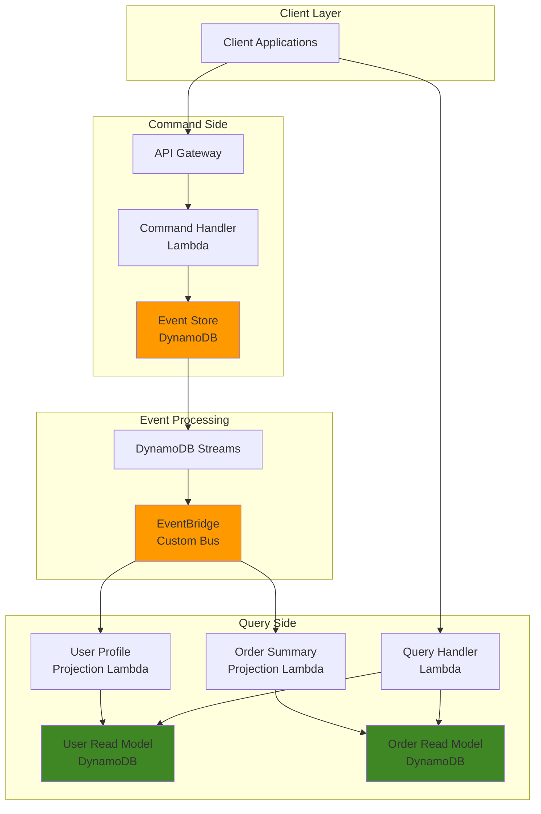

# CQRS and Event Sourcing with EventBridge

## Problem

Modern microservices architectures often struggle with maintaining data consistency across different read and write workloads while providing scalable query capabilities. Traditional CRUD operations tightly couple command and query responsibilities, making it difficult to optimize for different access patterns, scale independently, or maintain a complete audit trail of all system changes.

## Solution

Implement Command Query Responsibility Segregation (CQRS) with Event Sourcing using Amazon EventBridge as the event backbone and DynamoDB for both event storage and read model projections. This approach separates write commands from read queries, stores all state changes as immutable events, and enables building multiple optimized read models from the same event stream.

## Architecture Diagram



## Prerequisites

1. AWS account with permissions for EventBridge, DynamoDB, Lambda, API Gateway, and IAM
2. AWS CLI v2 installed and configured (or AWS CloudShell)
3. Basic understanding of CQRS, Event Sourcing, and microservices patterns
4. Familiarity with DynamoDB design patterns and Lambda functions
5. Estimated cost: $10-15 for testing resources (delete after completion)

> **Note**: This recipe implements enterprise-grade patterns suitable for production workloads with proper error handling and monitoring. For production deployments, consider implementing additional observability features as described in the [AWS Lambda monitoring best practices](https://docs.aws.amazon.com/lambda/latest/dg/monitoring-functions.html).

## Preparation

```bash
# Set environment variables
export AWS_REGION=$(aws configure get region)
export AWS_ACCOUNT_ID=$(aws sts get-caller-identity \
    --query Account --output text)

# Generate unique identifiers
RANDOM_SUFFIX=$(aws secretsmanager get-random-password \
    --exclude-punctuation --exclude-uppercase \
    --password-length 6 --require-each-included-type \
    --output text --query RandomPassword)

export PROJECT_NAME="cqrs-demo-${RANDOM_SUFFIX}"
export EVENT_BUS_NAME="${PROJECT_NAME}-events"
export EVENT_STORE_TABLE="${PROJECT_NAME}-event-store"
export USER_READ_MODEL_TABLE="${PROJECT_NAME}-user-profiles"
export ORDER_READ_MODEL_TABLE="${PROJECT_NAME}-order-summaries"

echo "✅ Environment configured with project: ${PROJECT_NAME}"
```

## Steps

1. **Create Event Store DynamoDB Table**:

   Event Sourcing requires an immutable event store that captures all state changes as a sequence of domain events. DynamoDB provides the perfect foundation with its strong consistency guarantees, automatic scaling, and built-in stream capabilities. The event store design uses a composite primary key (AggregateId, Version) to ensure events are ordered and prevent concurrent modifications through optimistic concurrency control.

   The Global Secondary Index on EventType and Timestamp enables efficient querying across event types and temporal patterns, supporting debugging, analytics, and event replay scenarios. DynamoDB Streams capture real-time changes to propagate events to downstream consumers without impacting write performance.

   ```bash
   # Create event store table with optimized design
   aws dynamodb create-table \
       --table-name ${EVENT_STORE_TABLE} \
       --attribute-definitions \
           AttributeName=AggregateId,AttributeType=S \
           AttributeName=Version,AttributeType=N \
           AttributeName=EventType,AttributeType=S \
           AttributeName=Timestamp,AttributeType=S \
       --key-schema \
           AttributeName=AggregateId,KeyType=HASH \
           AttributeName=Version,KeyType=RANGE \
       --global-secondary-indexes \
           IndexName=EventType-Timestamp-index,KeySchema="[{AttributeName=EventType,KeyType=HASH},{AttributeName=Timestamp,KeyType=RANGE}]",Projection="{ProjectionType=ALL}",ProvisionedThroughput="{ReadCapacityUnits=5,WriteCapacityUnits=5}" \
       --provisioned-throughput \
           ReadCapacityUnits=10,WriteCapacityUnits=10 \
       --stream-specification StreamEnabled=true,StreamViewType=NEW_IMAGE
   
   # Wait for table to become active
   aws dynamodb wait table-exists \
       --table-name ${EVENT_STORE_TABLE}
   
   echo "✅ Event store table created: ${EVENT_STORE_TABLE}"
   ```

   The event store is now ready to capture immutable domain events with strong consistency guarantees. The composite key structure ensures proper event ordering while the stream enables real-time event propagation to downstream consumers.

2. **Create Read Model Tables**:

   CQRS separates read and write models to optimize each for their specific access patterns. Read models are denormalized projections built from events, designed to serve specific query requirements efficiently. These tables represent the "Q" (Query) side of CQRS, storing data in formats optimized for application queries rather than transactional integrity.

   The user profiles table supports user lookup by ID and email, while the order summaries table enables queries by user, status, and order ID. [Global Secondary Indexes](https://docs.aws.amazon.com/amazondynamodb/latest/developerguide/GSI.html) provide alternate access patterns without the overhead of scanning entire tables.

   ```bash
   # Create user profiles read model
   aws dynamodb create-table \
       --table-name ${USER_READ_MODEL_TABLE} \
       --attribute-definitions \
           AttributeName=UserId,AttributeType=S \
           AttributeName=Email,AttributeType=S \
       --key-schema \
           AttributeName=UserId,KeyType=HASH \
       --global-secondary-indexes \
           IndexName=Email-index,KeySchema="[{AttributeName=Email,KeyType=HASH}]",Projection="{ProjectionType=ALL}",ProvisionedThroughput="{ReadCapacityUnits=5,WriteCapacityUnits=5}" \
       --provisioned-throughput \
           ReadCapacityUnits=5,WriteCapacityUnits=5
   
   # Create order summaries read model
   aws dynamodb create-table \
       --table-name ${ORDER_READ_MODEL_TABLE} \
       --attribute-definitions \
           AttributeName=OrderId,AttributeType=S \
           AttributeName=UserId,AttributeType=S \
           AttributeName=Status,AttributeType=S \
       --key-schema \
           AttributeName=OrderId,KeyType=HASH \
       --global-secondary-indexes \
           IndexName=UserId-index,KeySchema="[{AttributeName=UserId,KeyType=HASH}]",Projection="{ProjectionType=ALL}",ProvisionedThroughput="{ReadCapacityUnits=5,WriteCapacityUnits=5}" \
           IndexName=Status-index,KeySchema="[{AttributeName=Status,KeyType=HASH}]",Projection="{ProjectionType=ALL}",ProvisionedThroughput="{ReadCapacityUnits=5,WriteCapacityUnits=5}" \
       --provisioned-throughput \
           ReadCapacityUnits=5,WriteCapacityUnits=5
   
   # Wait for tables to become active
   aws dynamodb wait table-exists \
       --table-name ${USER_READ_MODEL_TABLE}
   aws dynamodb wait table-exists \
       --table-name ${ORDER_READ_MODEL_TABLE}
   
   echo "✅ Read model tables created"
   ```

   The read model tables are configured with optimized schemas for query performance. Each table supports multiple access patterns through carefully designed Global Secondary Indexes, enabling efficient data retrieval for various application scenarios.

3. **Create Custom EventBridge Bus**:

   Amazon EventBridge serves as the event distribution backbone in our CQRS architecture, enabling loose coupling between event publishers and consumers. A custom event bus isolates our domain events from AWS service events, providing better security, monitoring, and routing control.

   The event archive provides critical capabilities for debugging, testing new projections, and implementing event replay scenarios. This follows the [Event Sourcing pattern](https://docs.aws.amazon.com/prescriptive-guidance/latest/cloud-design-patterns/event-sourcing.html) by ensuring all domain events are retained and can be replayed for analysis or recovery purposes.

   ```bash
   # Create custom event bus for domain events
   aws events create-event-bus \
       --name ${EVENT_BUS_NAME}
   
   # Create event archive for replay capabilities
   aws events create-archive \
       --archive-name "${EVENT_BUS_NAME}-archive" \
       --event-source-arn "arn:aws:events:${AWS_REGION}:${AWS_ACCOUNT_ID}:event-bus/${EVENT_BUS_NAME}" \
       --retention-days 30 \
       --description "Archive for CQRS event sourcing demo"
   
   echo "✅ EventBridge bus and archive created: ${EVENT_BUS_NAME}"
   ```

   The custom EventBridge bus establishes the event distribution infrastructure with built-in archival capabilities. This creates a robust foundation for event-driven communication while maintaining the ability to replay events for testing and debugging purposes.

4. **Create IAM Roles for Lambda Functions**:

   Security in CQRS architectures requires careful separation of concerns between command processing and query handling. Command handlers need write access to the event store but no access to read models, while projection handlers need read access to events and write access to specific read models. This implements the principle of least privilege by granting only the minimum permissions required for each component's function.

   The role separation ensures that command handlers cannot accidentally corrupt read models, while projection handlers cannot modify the authoritative event store. This security model supports the architectural integrity of the CQRS pattern.

   ```bash
   # Create execution role for command handler
   aws iam create-role \
       --role-name "${PROJECT_NAME}-command-role" \
       --assume-role-policy-document '{
           "Version": "2012-10-17",
           "Statement": [{
               "Effect": "Allow",
               "Principal": {"Service": "lambda.amazonaws.com"},
               "Action": "sts:AssumeRole"
           }]
       }'
   
   # Attach policies for command handler
   aws iam attach-role-policy \
       --role-name "${PROJECT_NAME}-command-role" \
       --policy-arn "arn:aws:iam::aws:policy/service-role/AWSLambdaBasicExecutionRole"
   
   aws iam put-role-policy \
       --role-name "${PROJECT_NAME}-command-role" \
       --policy-name "DynamoDBEventStoreAccess" \
       --policy-document "{
           \"Version\": \"2012-10-17\",
           \"Statement\": [{
               \"Effect\": \"Allow\",
               \"Action\": [
                   \"dynamodb:PutItem\",
                   \"dynamodb:Query\",
                   \"dynamodb:GetItem\"
               ],
               \"Resource\": \"arn:aws:dynamodb:${AWS_REGION}:${AWS_ACCOUNT_ID}:table/${EVENT_STORE_TABLE}*\"
           }]
       }"
   
   # Create execution role for projection handlers
   aws iam create-role \
       --role-name "${PROJECT_NAME}-projection-role" \
       --assume-role-policy-document '{
           "Version": "2012-10-17",
           "Statement": [{
               "Effect": "Allow",
               "Principal": {"Service": "lambda.amazonaws.com"},
               "Action": "sts:AssumeRole"
           }]
       }'
   
   # Attach policies for projection handlers
   aws iam attach-role-policy \
       --role-name "${PROJECT_NAME}-projection-role" \
       --policy-arn "arn:aws:iam::aws:policy/service-role/AWSLambdaBasicExecutionRole"
   
   aws iam put-role-policy \
       --role-name "${PROJECT_NAME}-projection-role" \
       --policy-name "ReadModelAccess" \
       --policy-document "{
           \"Version\": \"2012-10-17\",
           \"Statement\": [{
               \"Effect\": \"Allow\",
               \"Action\": [
                   \"dynamodb:PutItem\",
                   \"dynamodb:UpdateItem\",
                   \"dynamodb:DeleteItem\",
                   \"dynamodb:GetItem\"
               ],
               \"Resource\": [
                   \"arn:aws:dynamodb:${AWS_REGION}:${AWS_ACCOUNT_ID}:table/${USER_READ_MODEL_TABLE}*\",
                   \"arn:aws:dynamodb:${AWS_REGION}:${AWS_ACCOUNT_ID}:table/${ORDER_READ_MODEL_TABLE}*\"
               ]
           }]
       }"
   
   echo "✅ IAM roles created with least privilege access patterns"
   ```

   The IAM roles are configured with minimal permissions that align with CQRS security principles. Command handlers can only interact with the event store, while projection handlers have targeted access to their specific read models, ensuring architectural integrity and security isolation.

5. **Create Command Handler Lambda Function**:

   Command handlers represent the "C" (Command) side of CQRS, responsible for processing business commands and generating domain events. This function validates business rules, implements optimistic concurrency control, and transforms commands into immutable events that capture the intent and outcome of each operation.

   The implementation uses [DynamoDB conditional expressions](https://docs.aws.amazon.com/amazondynamodb/latest/developerguide/Expressions.ConditionExpressions.html) to prevent concurrent modifications and ensure data consistency. Event versioning enables aggregate reconstruction and supports the Event Sourcing pattern's requirement for ordered event replay.

   ```bash
   # Create command handler deployment package
   cat > command_handler.py << 'EOF'
import json
import boto3
import uuid
import os
from datetime import datetime
from decimal import Decimal
from botocore.exceptions import ClientError

dynamodb = boto3.resource('dynamodb')

def lambda_handler(event, context):
    try:
        # Parse command from API Gateway
        command = json.loads(event['body']) if 'body' in event else event
        
        # Command validation
        command_type = command.get('commandType')
        aggregate_id = command.get('aggregateId', str(uuid.uuid4()))
        
        if not command_type:
            return {
                'statusCode': 400,
                'body': json.dumps({'error': 'commandType is required'})
            }
        
        # Get current version for optimistic concurrency
        table = dynamodb.Table(os.environ['EVENT_STORE_TABLE'])
        
        # Query existing events for this aggregate
        response = table.query(
            KeyConditionExpression='AggregateId = :id',
            ExpressionAttributeValues={':id': aggregate_id},
            ScanIndexForward=False,
            Limit=1
        )
        
        current_version = 0
        if response['Items']:
            current_version = int(response['Items'][0]['Version'])
        
        # Create domain event
        event_id = str(uuid.uuid4())
        new_version = current_version + 1
        timestamp = datetime.utcnow().isoformat()
        
        # Event payload based on command type
        event_data = create_event_from_command(command_type, command, aggregate_id)
        
        # Store event in event store with proper concurrency control
        try:
            table.put_item(
                Item={
                    'AggregateId': aggregate_id,
                    'Version': new_version,
                    'EventId': event_id,
                    'EventType': event_data['eventType'],
                    'Timestamp': timestamp,
                    'EventData': event_data['data'],
                    'CommandId': command.get('commandId', str(uuid.uuid4())),
                    'CorrelationId': command.get('correlationId', str(uuid.uuid4()))
                },
                ConditionExpression='attribute_not_exists(AggregateId) OR Version = :currentVersion',
                ExpressionAttributeValues={':currentVersion': current_version}
            )
        except ClientError as e:
            if e.response['Error']['Code'] == 'ConditionalCheckFailedException':
                return {
                    'statusCode': 409,
                    'body': json.dumps({'error': 'Concurrent modification detected'})
                }
            raise
        
        return {
            'statusCode': 201,
            'body': json.dumps({
                'aggregateId': aggregate_id,
                'version': new_version,
                'eventId': event_id
            })
        }
        
    except Exception as e:
        print(f"Error processing command: {str(e)}")
        return {
            'statusCode': 500,
            'body': json.dumps({'error': 'Internal server error'})
        }

def create_event_from_command(command_type, command, aggregate_id):
    """Transform commands into domain events"""
    
    if command_type == 'CreateUser':
        return {
            'eventType': 'UserCreated',
            'data': {
                'userId': aggregate_id,
                'email': command['email'],
                'name': command['name'],
                'createdAt': datetime.utcnow().isoformat()
            }
        }
    
    elif command_type == 'UpdateUserProfile':
        return {
            'eventType': 'UserProfileUpdated',
            'data': {
                'userId': aggregate_id,
                'changes': command['changes'],
                'updatedAt': datetime.utcnow().isoformat()
            }
        }
    
    elif command_type == 'CreateOrder':
        return {
            'eventType': 'OrderCreated',
            'data': {
                'orderId': aggregate_id,
                'userId': command['userId'],
                'items': command['items'],
                'totalAmount': command['totalAmount'],
                'createdAt': datetime.utcnow().isoformat()
            }
        }
    
    elif command_type == 'UpdateOrderStatus':
        return {
            'eventType': 'OrderStatusUpdated',
            'data': {
                'orderId': aggregate_id,
                'status': command['status'],
                'updatedAt': datetime.utcnow().isoformat()
            }
        }
    
    else:
        raise ValueError(f"Unknown command type: {command_type}")
EOF
   
   # Package and deploy command handler
   zip command_handler.zip command_handler.py
   
   COMMAND_ROLE_ARN=$(aws iam get-role \
       --role-name "${PROJECT_NAME}-command-role" \
       --query 'Role.Arn' --output text)
   
   aws lambda create-function \
       --function-name "${PROJECT_NAME}-command-handler" \
       --runtime python3.12 \
       --role ${COMMAND_ROLE_ARN} \
       --handler command_handler.lambda_handler \
       --zip-file fileb://command_handler.zip \
       --environment "Variables={EVENT_STORE_TABLE=${EVENT_STORE_TABLE}}" \
       --timeout 30
   
   echo "✅ Command handler Lambda created"
   ```

   The command handler is deployed and ready to process business commands. It transforms command requests into domain events while ensuring data consistency through optimistic concurrency control, forming the authoritative write side of our CQRS architecture.

6. **Create Event Stream Processor for EventBridge Integration**:

   The stream processor acts as an anti-corruption layer between DynamoDB Streams and EventBridge, transforming low-level database changes into meaningful domain events. This component ensures that every event stored in the event store is reliably propagated to all interested consumers without requiring command handlers to have knowledge of downstream projections.

   [DynamoDB Streams](https://docs.aws.amazon.com/amazondynamodb/latest/developerguide/Streams.html) provide guaranteed delivery of change events, while the processor normalizes the DynamoDB-specific format into clean domain events that can be consumed by various handlers across the system.

   ```bash
   # Create stream processor to publish events to EventBridge
   cat > stream_processor.py << 'EOF'
import json
import boto3
import os
from decimal import Decimal

eventbridge = boto3.client('events')

def lambda_handler(event, context):
    try:
        for record in event['Records']:
            if record['eventName'] in ['INSERT']:
                # Extract event from DynamoDB stream
                dynamodb_event = record['dynamodb']['NewImage']
                
                # Convert DynamoDB format to normal format
                domain_event = {
                    'EventId': dynamodb_event['EventId']['S'],
                    'AggregateId': dynamodb_event['AggregateId']['S'],
                    'EventType': dynamodb_event['EventType']['S'],
                    'Version': int(dynamodb_event['Version']['N']),
                    'Timestamp': dynamodb_event['Timestamp']['S'],
                    'EventData': deserialize_dynamodb_item(dynamodb_event['EventData']['M']),
                    'CommandId': dynamodb_event.get('CommandId', {}).get('S'),
                    'CorrelationId': dynamodb_event.get('CorrelationId', {}).get('S')
                }
                
                # Publish to EventBridge
                eventbridge.put_events(
                    Entries=[{
                        'Source': 'cqrs.demo',
                        'DetailType': domain_event['EventType'],
                        'Detail': json.dumps(domain_event, default=str),
                        'EventBusName': os.environ['EVENT_BUS_NAME']
                    }]
                )
                
                print(f"Published event {domain_event['EventId']} to EventBridge")
        
        return {'statusCode': 200}
        
    except Exception as e:
        print(f"Error processing stream: {str(e)}")
        raise

def deserialize_dynamodb_item(item):
    """Convert DynamoDB item format to regular Python objects"""
    if isinstance(item, dict):
        if len(item) == 1:
            key, value = next(iter(item.items()))
            if key == 'S':
                return value
            elif key == 'N':
                return Decimal(value)
            elif key == 'B':
                return value
            elif key == 'SS':
                return set(value)
            elif key == 'NS':
                return set(Decimal(v) for v in value)
            elif key == 'BS':
                return set(value)
            elif key == 'M':
                return {k: deserialize_dynamodb_item(v) for k, v in value.items()}
            elif key == 'L':
                return [deserialize_dynamodb_item(v) for v in value]
            elif key == 'NULL':
                return None
            elif key == 'BOOL':
                return value
        else:
            return {k: deserialize_dynamodb_item(v) for k, v in item.items()}
    return item
EOF
   
   # Package and deploy stream processor
   zip stream_processor.zip stream_processor.py
   
   aws lambda create-function \
       --function-name "${PROJECT_NAME}-stream-processor" \
       --runtime python3.12 \
       --role ${COMMAND_ROLE_ARN} \
       --handler stream_processor.lambda_handler \
       --zip-file fileb://stream_processor.zip \
       --environment "Variables={EVENT_BUS_NAME=${EVENT_BUS_NAME}}" \
       --timeout 60
   
   # Add EventBridge permissions to role
   aws iam put-role-policy \
       --role-name "${PROJECT_NAME}-command-role" \
       --policy-name "EventBridgePublish" \
       --policy-document "{
           \"Version\": \"2012-10-17\",
           \"Statement\": [{
               \"Effect\": \"Allow\",
               \"Action\": \"events:PutEvents\",
               \"Resource\": \"arn:aws:events:${AWS_REGION}:${AWS_ACCOUNT_ID}:event-bus/${EVENT_BUS_NAME}\"
           }]
       }"
   
   echo "✅ Stream processor Lambda created"
   ```

   The stream processor is configured to automatically transform DynamoDB change events into domain events and publish them to EventBridge. This establishes the event propagation mechanism that enables real-time projection updates and maintains eventual consistency across read models.

7. **Connect DynamoDB Stream to Lambda**:

   Event source mappings create the connection between DynamoDB Streams and Lambda functions, enabling real-time processing of database changes. This configuration ensures that every event written to the event store triggers downstream processing without requiring polling or manual coordination.

   The LATEST starting position ensures we only process new events, while the batch size controls processing throughput and cost optimization. This follows AWS best practices for [stream processing with Lambda](https://docs.aws.amazon.com/lambda/latest/dg/services-dynamodb-eventsourcemapping.html).

   ```bash
   # Get DynamoDB stream ARN
   STREAM_ARN=$(aws dynamodb describe-table \
       --table-name ${EVENT_STORE_TABLE} \
       --query 'Table.LatestStreamArn' --output text)
   
   # Create event source mapping
   aws lambda create-event-source-mapping \
       --function-name "${PROJECT_NAME}-stream-processor" \
       --event-source-arn ${STREAM_ARN} \
       --starting-position LATEST \
       --batch-size 10
   
   echo "✅ DynamoDB stream connected to Lambda"
   ```

   The event source mapping is active and will automatically invoke the stream processor whenever new events are written to the event store. This creates a reliable, low-latency event propagation mechanism that maintains the real-time characteristics required for effective CQRS implementations.

8. **Create Projection Lambda Functions**:

   Projection handlers implement the eventual consistency model of CQRS by updating read models in response to domain events. These functions transform events into optimized data structures that support specific query patterns, enabling the system to scale read operations independently from write operations.

   Each projection handler is specialized for a particular read model and implements idempotent event processing to handle potential duplicate events. The handlers demonstrate how to build [materialized views](https://docs.aws.amazon.com/amazondynamodb/latest/developerguide/bp-modeling-nosql-B.html) that can be optimized for specific access patterns without affecting the event store's design.

   ```bash
   # Create user profile projection handler
   cat > user_projection.py << 'EOF'
import json
import boto3
import os

dynamodb = boto3.resource('dynamodb')

def lambda_handler(event, context):
    try:
        detail = event['detail']
        event_type = detail['EventType']
        event_data = detail['EventData']
        
        table = dynamodb.Table(os.environ['USER_READ_MODEL_TABLE'])
        
        if event_type == 'UserCreated':
            # Create user profile projection
            table.put_item(
                Item={
                    'UserId': event_data['userId'],
                    'Email': event_data['email'],
                    'Name': event_data['name'],
                    'CreatedAt': event_data['createdAt'],
                    'UpdatedAt': event_data['createdAt'],
                    'Version': detail['Version']
                }
            )
            print(f"Created user profile for {event_data['userId']}")
            
        elif event_type == 'UserProfileUpdated':
            # Update user profile projection
            update_expression = "SET UpdatedAt = :updated, Version = :version"
            expression_values = {
                ':updated': event_data['updatedAt'],
                ':version': detail['Version']
            }
            
            # Build update expression for changes
            for field, value in event_data['changes'].items():
                if field in ['Name', 'Email']:  # Allow only certain fields
                    update_expression += f", {field} = :{field.lower()}"
                    expression_values[f":{field.lower()}"] = value
            
            table.update_item(
                Key={'UserId': event_data['userId']},
                UpdateExpression=update_expression,
                ExpressionAttributeValues=expression_values
            )
            print(f"Updated user profile for {event_data['userId']}")
        
        return {'statusCode': 200}
        
    except Exception as e:
        print(f"Error in user projection: {str(e)}")
        raise
EOF
   
   # Create order summary projection handler
   cat > order_projection.py << 'EOF'
import json
import boto3
import os
from decimal import Decimal

dynamodb = boto3.resource('dynamodb')

def lambda_handler(event, context):
    try:
        detail = event['detail']
        event_type = detail['EventType']
        event_data = detail['EventData']
        
        table = dynamodb.Table(os.environ['ORDER_READ_MODEL_TABLE'])
        
        if event_type == 'OrderCreated':
            # Create order summary projection
            table.put_item(
                Item={
                    'OrderId': event_data['orderId'],
                    'UserId': event_data['userId'],
                    'Items': event_data['items'],
                    'TotalAmount': Decimal(str(event_data['totalAmount'])),
                    'Status': 'Created',
                    'CreatedAt': event_data['createdAt'],
                    'UpdatedAt': event_data['createdAt'],
                    'Version': detail['Version']
                }
            )
            print(f"Created order summary for {event_data['orderId']}")
            
        elif event_type == 'OrderStatusUpdated':
            # Update order status in projection
            table.update_item(
                Key={'OrderId': event_data['orderId']},
                UpdateExpression="SET #status = :status, UpdatedAt = :updated, Version = :version",
                ExpressionAttributeNames={'#status': 'Status'},
                ExpressionAttributeValues={
                    ':status': event_data['status'],
                    ':updated': event_data['updatedAt'],
                    ':version': detail['Version']
                }
            )
            print(f"Updated order status for {event_data['orderId']}")
        
        return {'statusCode': 200}
        
    except Exception as e:
        print(f"Error in order projection: {str(e)}")
        raise
EOF
   
   # Package and deploy projection handlers
   zip user_projection.zip user_projection.py
   zip order_projection.zip order_projection.py
   
   PROJECTION_ROLE_ARN=$(aws iam get-role \
       --role-name "${PROJECT_NAME}-projection-role" \
       --query 'Role.Arn' --output text)
   
   aws lambda create-function \
       --function-name "${PROJECT_NAME}-user-projection" \
       --runtime python3.12 \
       --role ${PROJECTION_ROLE_ARN} \
       --handler user_projection.lambda_handler \
       --zip-file fileb://user_projection.zip \
       --environment "Variables={USER_READ_MODEL_TABLE=${USER_READ_MODEL_TABLE}}" \
       --timeout 30
   
   aws lambda create-function \
       --function-name "${PROJECT_NAME}-order-projection" \
       --runtime python3.12 \
       --role ${PROJECTION_ROLE_ARN} \
       --handler order_projection.lambda_handler \
       --zip-file fileb://order_projection.zip \
       --environment "Variables={ORDER_READ_MODEL_TABLE=${ORDER_READ_MODEL_TABLE}}" \
       --timeout 30
   
   echo "✅ Projection Lambda functions created"
   ```

   The projection handlers are deployed and ready to maintain read model consistency. These functions will automatically update their respective read models whenever relevant domain events are published, ensuring that query responses reflect the latest business state while maintaining independent scaling characteristics.

9. **Create EventBridge Rules for Projections**:

   EventBridge rules implement content-based routing, ensuring that each projection handler receives only the events it needs to process. This selective delivery improves performance and reduces costs by avoiding unnecessary function invocations.

   The [event patterns](https://docs.aws.amazon.com/eventbridge/latest/userguide/eb-event-patterns.html) use JSON-based matching to route events based on their type and source, enabling fine-grained control over event distribution. This decoupled architecture allows new projections to be added without modifying existing components.

   ```bash
   # Create rule for user events
   aws events put-rule \
       --name "${PROJECT_NAME}-user-events" \
       --event-pattern '{
           "source": ["cqrs.demo"],
           "detail-type": ["UserCreated", "UserProfileUpdated"]
       }' \
       --event-bus-name ${EVENT_BUS_NAME}
   
   # Create rule for order events  
   aws events put-rule \
       --name "${PROJECT_NAME}-order-events" \
       --event-pattern '{
           "source": ["cqrs.demo"],
           "detail-type": ["OrderCreated", "OrderStatusUpdated"]
       }' \
       --event-bus-name ${EVENT_BUS_NAME}
   
   # Add Lambda permissions for EventBridge
   aws lambda add-permission \
       --function-name "${PROJECT_NAME}-user-projection" \
       --statement-id "EventBridgeInvoke" \
       --action "lambda:InvokeFunction" \
       --principal "events.amazonaws.com" \
       --source-arn "arn:aws:events:${AWS_REGION}:${AWS_ACCOUNT_ID}:rule/${EVENT_BUS_NAME}/${PROJECT_NAME}-user-events"
   
   aws lambda add-permission \
       --function-name "${PROJECT_NAME}-order-projection" \
       --statement-id "EventBridgeInvoke" \
       --action "lambda:InvokeFunction" \
       --principal "events.amazonaws.com" \
       --source-arn "arn:aws:events:${AWS_REGION}:${AWS_ACCOUNT_ID}:rule/${EVENT_BUS_NAME}/${PROJECT_NAME}-order-events"
   
   # Add targets to rules
   aws events put-targets \
       --rule "${PROJECT_NAME}-user-events" \
       --event-bus-name ${EVENT_BUS_NAME} \
       --targets "Id=1,Arn=arn:aws:lambda:${AWS_REGION}:${AWS_ACCOUNT_ID}:function:${PROJECT_NAME}-user-projection"
   
   aws events put-targets \
       --rule "${PROJECT_NAME}-order-events" \
       --event-bus-name ${EVENT_BUS_NAME} \
       --targets "Id=1,Arn=arn:aws:lambda:${AWS_REGION}:${AWS_ACCOUNT_ID}:function:${PROJECT_NAME}-order-projection"
   
   echo "✅ EventBridge rules and targets configured"
   ```

   EventBridge rules are configured to route domain events to their appropriate projection handlers based on event type. This establishes the event distribution mechanism that maintains eventual consistency across all read models while supporting the addition of new projections without architectural changes.

10. **Create Query Handler for Read Models**:

    Query handlers serve the "Q" (Query) side of CQRS by providing optimized read access to the materialized views. These functions demonstrate how to implement various query patterns against denormalized data structures, enabling high-performance read operations that scale independently from write operations.

    The handler supports multiple query types and leverages [DynamoDB's secondary indexes](https://docs.aws.amazon.com/amazondynamodb/latest/developerguide/bp-indexes.html) to provide efficient access patterns. This design enables the system to serve complex queries without impacting the event store's write performance.

    ```bash
    # Create query handler for read operations
    cat > query_handler.py << 'EOF'
import json
import boto3
import os
from boto3.dynamodb.conditions import Key
from decimal import Decimal

dynamodb = boto3.resource('dynamodb')

def lambda_handler(event, context):
    try:
        # Parse query from API Gateway
        query = json.loads(event['body']) if 'body' in event else event
        query_type = query.get('queryType')
        
        if query_type == 'GetUserProfile':
            result = get_user_profile(query['userId'])
        elif query_type == 'GetUserByEmail':
            result = get_user_by_email(query['email'])
        elif query_type == 'GetOrdersByUser':
            result = get_orders_by_user(query['userId'])
        elif query_type == 'GetOrdersByStatus':
            result = get_orders_by_status(query['status'])
        else:
            return {
                'statusCode': 400,
                'body': json.dumps({'error': f'Unknown query type: {query_type}'})
            }
        
        return {
            'statusCode': 200,
            'body': json.dumps(result, default=decimal_encoder)
        }
        
    except Exception as e:
        print(f"Error processing query: {str(e)}")
        return {
            'statusCode': 500,
            'body': json.dumps({'error': 'Internal server error'})
        }

def get_user_profile(user_id):
    table = dynamodb.Table(os.environ['USER_READ_MODEL_TABLE'])
    response = table.get_item(Key={'UserId': user_id})
    return response.get('Item')

def get_user_by_email(email):
    table = dynamodb.Table(os.environ['USER_READ_MODEL_TABLE'])
    response = table.query(
        IndexName='Email-index',
        KeyConditionExpression=Key('Email').eq(email)
    )
    return response['Items'][0] if response['Items'] else None

def get_orders_by_user(user_id):
    table = dynamodb.Table(os.environ['ORDER_READ_MODEL_TABLE'])
    response = table.query(
        IndexName='UserId-index',
        KeyConditionExpression=Key('UserId').eq(user_id)
    )
    return response['Items']

def get_orders_by_status(status):
    table = dynamodb.Table(os.environ['ORDER_READ_MODEL_TABLE'])
    response = table.query(
        IndexName='Status-index',
        KeyConditionExpression=Key('Status').eq(status)
    )
    return response['Items']

def decimal_encoder(obj):
    if isinstance(obj, Decimal):
        return float(obj)
    raise TypeError
EOF
    
    # Package and deploy query handler
    zip query_handler.zip query_handler.py
    
    aws lambda create-function \
        --function-name "${PROJECT_NAME}-query-handler" \
        --runtime python3.12 \
        --role ${PROJECTION_ROLE_ARN} \
        --handler query_handler.lambda_handler \
        --zip-file fileb://query_handler.zip \
        --environment "Variables={USER_READ_MODEL_TABLE=${USER_READ_MODEL_TABLE},ORDER_READ_MODEL_TABLE=${ORDER_READ_MODEL_TABLE}}" \
        --timeout 30
    
    echo "✅ Query handler Lambda created"
    ```

    The query handler is deployed and ready to serve read requests from the optimized read models. This completes the CQRS architecture by providing high-performance query capabilities that operate independently from command processing, enabling the system to scale read and write operations according to their specific requirements.

## Validation & Testing

1. **Test Command Processing**:

   ```bash
   # Create a user command
   aws lambda invoke \
       --function-name "${PROJECT_NAME}-command-handler" \
       --payload '{
           "commandType": "CreateUser",
           "email": "john.doe@example.com",
           "name": "John Doe",
           "commandId": "cmd-001",
           "correlationId": "corr-001"
       }' \
       response.json
   
   USER_ID=$(cat response.json | jq -r '.aggregateId')
   echo "Created user with ID: ${USER_ID}"
   ```

2. **Verify Event Store**:

   ```bash
   # Check event was stored
   aws dynamodb query \
       --table-name ${EVENT_STORE_TABLE} \
       --key-condition-expression "AggregateId = :id" \
       --expression-attribute-values "{\":id\":{\"S\":\"${USER_ID}\"}}"
   ```

3. **Test Order Creation and Status Updates**:

   ```bash
   # Create an order
   aws lambda invoke \
       --function-name "${PROJECT_NAME}-command-handler" \
       --payload "{
           \"commandType\": \"CreateOrder\",
           \"userId\": \"${USER_ID}\",
           \"items\": [{\"product\": \"laptop\", \"quantity\": 1, \"price\": 999.99}],
           \"totalAmount\": 999.99
       }" \
       response.json
   
   ORDER_ID=$(cat response.json | jq -r '.aggregateId')
   echo "Created order with ID: ${ORDER_ID}"
   
   # Update order status
   aws lambda invoke \
       --function-name "${PROJECT_NAME}-command-handler" \
       --payload "{
           \"commandType\": \"UpdateOrderStatus\",
           \"aggregateId\": \"${ORDER_ID}\",
           \"status\": \"Processing\"
       }" \
       response.json
   ```

4. **Test Read Model Queries**:

   ```bash
   # Wait for eventual consistency
   sleep 10
   
   # Query user profile
   aws lambda invoke \
       --function-name "${PROJECT_NAME}-query-handler" \
       --payload "{
           \"queryType\": \"GetUserProfile\",
           \"userId\": \"${USER_ID}\"
       }" \
       user_query.json
   
   echo "User profile query result:"
   cat user_query.json | jq '.'
   
   # Query orders by user
   aws lambda invoke \
       --function-name "${PROJECT_NAME}-query-handler" \
       --payload "{
           \"queryType\": \"GetOrdersByUser\",
           \"userId\": \"${USER_ID}\"
       }" \
       order_query.json
   
   echo "Orders by user query result:"
   cat order_query.json | jq '.'
   ```

5. **Verify EventBridge Event Flow**:

   ```bash
   # Check CloudWatch logs for event processing
   echo "Checking recent Lambda logs..."
   
   aws logs describe-log-groups \
       --log-group-name-prefix "/aws/lambda/${PROJECT_NAME}" \
       --query 'logGroups[*].logGroupName'
   ```

## Cleanup

1. **Delete Lambda Functions**:

   ```bash
   # Delete all Lambda functions
   aws lambda delete-function \
       --function-name "${PROJECT_NAME}-command-handler"
   aws lambda delete-function \
       --function-name "${PROJECT_NAME}-stream-processor" 
   aws lambda delete-function \
       --function-name "${PROJECT_NAME}-user-projection"
   aws lambda delete-function \
       --function-name "${PROJECT_NAME}-order-projection"
   aws lambda delete-function \
       --function-name "${PROJECT_NAME}-query-handler"
   
   echo "✅ Lambda functions deleted"
   ```

2. **Delete EventBridge Resources**:

   ```bash
   # Remove targets from rules
   aws events remove-targets \
       --rule "${PROJECT_NAME}-user-events" \
       --event-bus-name ${EVENT_BUS_NAME} \
       --ids "1"
   aws events remove-targets \
       --rule "${PROJECT_NAME}-order-events" \
       --event-bus-name ${EVENT_BUS_NAME} \
       --ids "1"
   
   # Delete rules
   aws events delete-rule \
       --name "${PROJECT_NAME}-user-events" \
       --event-bus-name ${EVENT_BUS_NAME}
   aws events delete-rule \
       --name "${PROJECT_NAME}-order-events" \
       --event-bus-name ${EVENT_BUS_NAME}
   
   # Delete archive and event bus
   aws events delete-archive \
       --archive-name "${EVENT_BUS_NAME}-archive"
   aws events delete-event-bus \
       --name ${EVENT_BUS_NAME}
   
   echo "✅ EventBridge resources deleted"
   ```

3. **Delete DynamoDB Tables**:

   ```bash
   # Delete all tables
   aws dynamodb delete-table --table-name ${EVENT_STORE_TABLE}
   aws dynamodb delete-table --table-name ${USER_READ_MODEL_TABLE}
   aws dynamodb delete-table --table-name ${ORDER_READ_MODEL_TABLE}
   
   echo "✅ DynamoDB tables deleted"
   ```

4. **Delete IAM Roles and Policies**:

   ```bash
   # Detach and delete policies
   aws iam detach-role-policy \
       --role-name "${PROJECT_NAME}-command-role" \
       --policy-arn "arn:aws:iam::aws:policy/service-role/AWSLambdaBasicExecutionRole"
   aws iam delete-role-policy \
       --role-name "${PROJECT_NAME}-command-role" \
       --policy-name "DynamoDBEventStoreAccess"
   aws iam delete-role-policy \
       --role-name "${PROJECT_NAME}-command-role" \
       --policy-name "EventBridgePublish"
   aws iam delete-role \
       --role-name "${PROJECT_NAME}-command-role"
   
   aws iam detach-role-policy \
       --role-name "${PROJECT_NAME}-projection-role" \
       --policy-arn "arn:aws:iam::aws:policy/service-role/AWSLambdaBasicExecutionRole"
   aws iam delete-role-policy \
       --role-name "${PROJECT_NAME}-projection-role" \
       --policy-name "ReadModelAccess"
   aws iam delete-role \
       --role-name "${PROJECT_NAME}-projection-role"
   
   echo "✅ IAM roles and policies deleted"
   ```

5. **Clean up local files**:

   ```bash
   # Remove temporary files
   rm -f *.py *.zip *.json
   unset PROJECT_NAME EVENT_BUS_NAME EVENT_STORE_TABLE 
   unset USER_READ_MODEL_TABLE ORDER_READ_MODEL_TABLE
   
   echo "✅ Cleanup completed"
   ```

## Discussion

This implementation demonstrates a sophisticated CQRS and Event Sourcing architecture that addresses several enterprise challenges. The Command Query Responsibility Segregation pattern separates write operations (commands) from read operations (queries), allowing each side to be optimized independently. Commands are processed by dedicated handlers that validate business rules and generate domain events, while queries are served from purpose-built read models that can be optimized for specific access patterns.

Event Sourcing provides a complete audit trail by storing all state changes as immutable events in the event store. This approach offers several advantages over traditional CRUD operations: the ability to reconstruct any past state, support for temporal queries, and natural support for event-driven architectures. The use of DynamoDB for the event store leverages its strong consistency guarantees and automatic scaling capabilities, while the Global Secondary Index on EventType and Timestamp enables efficient event retrieval patterns.

The integration with Amazon EventBridge creates a robust event-driven backbone that supports loose coupling between bounded contexts. EventBridge's content-based routing allows different projections to subscribe to specific event types, enabling the system to evolve without breaking existing consumers. The archive functionality provides the ability to replay events for debugging, testing new projections, or recovering from failures as detailed in the [AWS prescriptive guidance for CQRS and event sourcing](https://docs.aws.amazon.com/prescriptive-guidance/latest/patterns/decompose-monoliths-into-microservices-by-using-cqrs-and-event-sourcing.html).

One key architectural decision is the use of DynamoDB Streams to automatically publish events to EventBridge. This ensures that every event stored in the event store is reliably propagated to all interested consumers without requiring the command handlers to have knowledge of downstream projections. The stream processor acts as an anti-corruption layer, transforming the DynamoDB-specific format into domain events that can be consumed by various handlers.

The eventual consistency model inherent in CQRS requires careful consideration of timing and ordering. While commands are processed synchronously with strong consistency guarantees, read model updates happen asynchronously through event processing. This trade-off enables superior scalability and performance characteristics while requiring applications to handle eventual consistency appropriately.

> **Tip**: Consider implementing event schema evolution strategies using versioned event types and backward-compatible event handlers to support long-term system evolution.

> **Warning**: Monitor DynamoDB Stream processing carefully in production environments, as failures in event propagation can lead to inconsistent read models. Implement dead letter queues and alerting for failed event processing as described in the [DynamoDB Streams best practices](https://docs.aws.amazon.com/amazondynamodb/latest/developerguide/Streams.html).

## Challenge

Extend this CQRS and Event Sourcing implementation with these advanced features:

1. **Implement Aggregate Snapshots** - Add snapshot creation and restoration for aggregates with many events to improve performance when rebuilding aggregate state.

2. **Add Saga Orchestration** - Implement distributed transaction management using the Saga pattern with Step Functions to coordinate complex business processes across multiple aggregates.

3. **Create Event Schema Registry** - Build an event schema management system using EventBridge Schema Registry to enforce event contracts and enable schema evolution.

4. **Implement Multi-tenant Event Stores** - Extend the design to support multi-tenant scenarios with proper data isolation and access controls.

5. **Add Event Replay Capabilities** - Create an administrative interface for replaying events from specific points in time to rebuild or test new projections.

## Infrastructure Code

### Available Infrastructure as Code:

- [Infrastructure Code Overview](code/README.md) - Detailed description of all infrastructure components
- [AWS CDK (Python)](code/cdk-python/) - AWS CDK Python implementation
- [AWS CDK (TypeScript)](code/cdk-typescript/) - AWS CDK TypeScript implementation
- [CloudFormation](code/cloudformation.yaml) - AWS CloudFormation template
- [Bash CLI Scripts](code/scripts/) - Example bash scripts using AWS CLI commands to deploy infrastructure
- [Terraform](code/terraform/) - Terraform configuration files