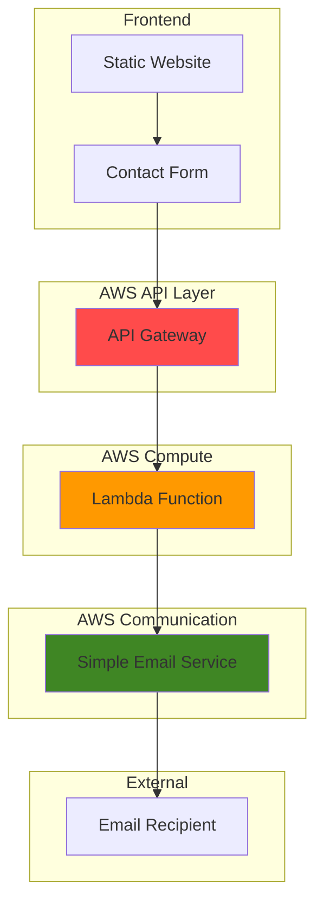

# Creating Contact Forms with SES and Lambda

## Problem

Small businesses and developers need a cost-effective way to handle contact form submissions on their websites without managing servers or complex infrastructure. Traditional web hosting solutions require backend servers, databases, and email configuration that can be expensive and difficult to maintain. Static websites hosted on services like S3 or Netlify cannot process form submissions natively, leaving website owners with limited options for collecting visitor inquiries and feedback.

## Solution

This serverless architecture leverages AWS Lambda to process contact form submissions, Amazon SES to send notification emails, and API Gateway to provide a secure HTTP endpoint. The solution eliminates server management overhead while providing automatic scaling, high availability, and pay-per-use pricing. This approach enables static websites to handle dynamic form submissions through a RESTful API that processes requests instantly and delivers email notifications reliably.

## Architecture Diagram



## Prerequisites

1. AWS account with appropriate permissions for Lambda, API Gateway, and SES
2. AWS CLI installed and configured (version 2.0 or later)
3. Basic knowledge of JSON, REST APIs, and Python programming
4. A valid email address for testing SES functionality
5. Estimated cost: $0.01-$0.05 per month for low-volume testing (first 1M Lambda requests free)

> **Note**: This tutorial uses AWS Free Tier eligible services. SES provides 62,000 free emails per month when sent from Lambda, and Lambda includes 1 million free requests monthly.

## Preparation

```bash
# Set environment variables
export AWS_REGION=$(aws configure get region)
export AWS_ACCOUNT_ID=$(aws sts get-caller-identity \
    --query Account --output text)

# Generate unique identifiers for resources
RANDOM_SUFFIX=$(aws secretsmanager get-random-password \
    --exclude-punctuation --exclude-uppercase \
    --password-length 6 --require-each-included-type \
    --output text --query RandomPassword)

# Set resource names
export LAMBDA_FUNCTION_NAME="contact-form-processor-${RANDOM_SUFFIX}"
export API_GATEWAY_NAME="contact-form-api-${RANDOM_SUFFIX}"
export IAM_ROLE_NAME="contact-form-lambda-role-${RANDOM_SUFFIX}"

# Verify SES service availability in your region
aws ses describe-configuration-set \
    --configuration-set-name default || true

echo "✅ AWS environment configured for region: ${AWS_REGION}"
echo "✅ Account ID: ${AWS_ACCOUNT_ID}"
echo "✅ Resource suffix: ${RANDOM_SUFFIX}"
```

## Steps

1. **Create IAM Role for Lambda Function**:

   AWS Lambda requires an execution role with specific permissions to interact with other AWS services. This role enables our Lambda function to send emails through SES and write logs to CloudWatch for debugging and monitoring. Following the principle of least privilege, we'll grant only the minimum permissions needed for our contact form functionality.

   ```bash
   # Create trust policy for Lambda service
   cat > trust-policy.json << 'EOF'
   {
     "Version": "2012-10-17",
     "Statement": [
       {
         "Effect": "Allow",
         "Principal": {
           "Service": "lambda.amazonaws.com"
         },
         "Action": "sts:AssumeRole"
       }
     ]
   }
   EOF
   
   # Create IAM role for Lambda function
   aws iam create-role \
       --role-name ${IAM_ROLE_NAME} \
       --assume-role-policy-document file://trust-policy.json
   
   # Attach basic Lambda execution policy
   aws iam attach-role-policy \
       --role-name ${IAM_ROLE_NAME} \
       --policy-arn arn:aws:iam::aws:policy/service-role/AWSLambdaBasicExecutionRole
   
   # Create custom policy for SES permissions
   cat > ses-policy.json << 'EOF'
   {
     "Version": "2012-10-17",
     "Statement": [
       {
         "Effect": "Allow",
         "Action": [
           "ses:SendEmail",
           "ses:SendRawEmail"
         ],
         "Resource": "*"
       }
     ]
   }
   EOF
   
   # Create and attach SES policy
   aws iam create-policy \
       --policy-name contact-form-ses-policy-${RANDOM_SUFFIX} \
       --policy-document file://ses-policy.json
   
   aws iam attach-role-policy \
       --role-name ${IAM_ROLE_NAME} \
       --policy-arn arn:aws:iam::${AWS_ACCOUNT_ID}:policy/contact-form-ses-policy-${RANDOM_SUFFIX}
   
   # Wait for role to be available
   sleep 10
   
   echo "✅ IAM role created with SES permissions"
   ```

   The IAM role now has the necessary permissions to execute Lambda functions and send emails through SES. This security configuration follows AWS best practices by using temporary credentials and service-specific permissions.

2. **Verify Email Address in SES**:

   Amazon SES requires email address verification before sending emails to prevent spam and ensure deliverability. New AWS accounts start in the SES sandbox environment, which restricts sending to verified addresses only. This verification process confirms you own the email address and can receive messages sent from your application.

   ```bash
   # Prompt for email address
   read -p "Enter your email address for SES verification: " EMAIL_ADDRESS
   export SENDER_EMAIL=${EMAIL_ADDRESS}
   
   # Verify email address identity
   aws ses verify-email-identity --email-address ${SENDER_EMAIL}
   
   echo "✅ Email verification initiated for ${SENDER_EMAIL}"
   echo "📧 Check your inbox and click the verification link"
   echo "⏳ Waiting for email verification..."
   
   # Wait for verification (check every 30 seconds)
   while true; do
     VERIFICATION_STATUS=$(aws ses get-identity-verification-attributes \
         --identities ${SENDER_EMAIL} \
         --query "VerificationAttributes.\"${SENDER_EMAIL}\".VerificationStatus" \
         --output text)
     
     if [ "$VERIFICATION_STATUS" = "Success" ]; then
       echo "✅ Email address verified successfully"
       break
     elif [ "$VERIFICATION_STATUS" = "Failed" ]; then
       echo "❌ Email verification failed"
       exit 1
     else
       echo "⏳ Verification status: ${VERIFICATION_STATUS}. Waiting..."
       sleep 30
     fi
   done
   ```

   Your email address is now verified and ready to send messages through SES. This verification establishes trust with AWS and enables reliable email delivery for your contact form submissions.

3. **Create Lambda Function Code**:

   The Lambda function serves as the core processing engine for our contact form. It receives form data from API Gateway, validates the input, formats the message, and sends it via SES. This serverless approach automatically scales with demand and provides built-in error handling and logging capabilities.

   ```bash
   # Create Lambda function code
   cat > lambda_function.py << 'EOF'
   import json
   import boto3
   import os
   from datetime import datetime
   
   def lambda_handler(event, context):
       # Initialize SES client
       ses_client = boto3.client('ses')
       
       try:
           # Parse the incoming request
           body = json.loads(event['body'])
           
           # Extract form data
           name = body.get('name', '')
           email = body.get('email', '')
           subject = body.get('subject', 'Contact Form Submission')
           message = body.get('message', '')
           
           # Validate required fields
           if not name or not email or not message:
               return {
                   'statusCode': 400,
                   'headers': {
                       'Access-Control-Allow-Origin': '*',
                       'Access-Control-Allow-Methods': 'POST',
                       'Access-Control-Allow-Headers': 'Content-Type'
                   },
                   'body': json.dumps({
                       'error': 'Name, email, and message are required fields'
                   })
               }
           
           # Prepare email content
           sender_email = os.environ['SENDER_EMAIL']
           timestamp = datetime.now().strftime('%Y-%m-%d %H:%M:%S UTC')
           
           email_body = f"""
           New Contact Form Submission
           
           Time: {timestamp}
           Name: {name}
           Email: {email}
           Subject: {subject}
           
           Message:
           {message}
           """
           
           # Send email using SES
           response = ses_client.send_email(
               Source=sender_email,
               Destination={
                   'ToAddresses': [sender_email]
               },
               Message={
                   'Subject': {
                       'Data': f'Contact Form: {subject}'
                   },
                   'Body': {
                       'Text': {
                           'Data': email_body
                       }
                   }
               }
           )
           
           # Return success response
           return {
               'statusCode': 200,
               'headers': {
                   'Access-Control-Allow-Origin': '*',
                   'Access-Control-Allow-Methods': 'POST',
                   'Access-Control-Allow-Headers': 'Content-Type'
               },
               'body': json.dumps({
                   'message': 'Email sent successfully',
                   'messageId': response['MessageId']
               })
           }
           
       except Exception as e:
           print(f"Error: {str(e)}")
           return {
               'statusCode': 500,
               'headers': {
                   'Access-Control-Allow-Origin': '*',
                   'Access-Control-Allow-Methods': 'POST',
                   'Access-Control-Allow-Headers': 'Content-Type'
               },
               'body': json.dumps({
                   'error': 'Internal server error'
               })
           }
   EOF
   
   # Create deployment package
   zip lambda-function.zip lambda_function.py
   
   echo "✅ Lambda function code created and packaged"
   ```

   The Lambda function code includes proper error handling, input validation, and CORS headers for web browser compatibility. This production-ready code follows AWS best practices for serverless development.

4. **Deploy Lambda Function**:

   Deploying the Lambda function creates a managed compute environment that can process thousands of concurrent requests without server management. AWS Lambda automatically handles infrastructure scaling, patching, and monitoring while providing millisecond billing granularity.

   ```bash
   # Get IAM role ARN
   ROLE_ARN=$(aws iam get-role --role-name ${IAM_ROLE_NAME} \
       --query Role.Arn --output text)
   
   # Create Lambda function
   aws lambda create-function \
       --function-name ${LAMBDA_FUNCTION_NAME} \
       --runtime python3.12 \
       --role ${ROLE_ARN} \
       --handler lambda_function.lambda_handler \
       --zip-file fileb://lambda-function.zip \
       --timeout 30 \
       --memory-size 128 \
       --environment Variables="{SENDER_EMAIL=${SENDER_EMAIL}}"
   
   # Wait for function to be ready
   aws lambda wait function-active \
       --function-name ${LAMBDA_FUNCTION_NAME}
   
   echo "✅ Lambda function deployed successfully"
   echo "📍 Function ARN: arn:aws:lambda:${AWS_REGION}:${AWS_ACCOUNT_ID}:function:${LAMBDA_FUNCTION_NAME}"
   ```

   Your Lambda function is now deployed and ready to process contact form submissions. The function uses minimal memory and timeout settings to optimize cost while maintaining responsive performance.

5. **Create API Gateway REST API**:

   Amazon API Gateway provides a fully managed REST API that serves as the entry point for your contact form. It handles request routing, authentication, rate limiting, and integration with Lambda functions while providing automatic scaling and high availability across multiple AWS regions.

   ```bash
   # Create REST API
   API_ID=$(aws apigateway create-rest-api \
       --name ${API_GATEWAY_NAME} \
       --description "Contact form API for serverless backend" \
       --endpoint-configuration types=REGIONAL \
       --query id --output text)
   
   # Get root resource ID
   ROOT_RESOURCE_ID=$(aws apigateway get-resources \
       --rest-api-id ${API_ID} \
       --query 'items[0].id' --output text)
   
   # Create 'contact' resource
   CONTACT_RESOURCE_ID=$(aws apigateway create-resource \
       --rest-api-id ${API_ID} \
       --parent-id ${ROOT_RESOURCE_ID} \
       --path-part contact \
       --query id --output text)
   
   echo "✅ API Gateway REST API created"
   echo "📍 API ID: ${API_ID}"
   echo "📍 Contact resource ID: ${CONTACT_RESOURCE_ID}"
   ```

   The API Gateway REST API provides a structured endpoint for your contact form with proper resource organization and regional deployment for optimal performance.

6. **Configure POST Method and Integration**:

   Setting up the POST method creates the HTTP interface that web browsers use to submit form data. The Lambda proxy integration enables seamless communication between API Gateway and Lambda while handling request/response transformation automatically.

   ```bash
   # Create POST method
   aws apigateway put-method \
       --rest-api-id ${API_ID} \
       --resource-id ${CONTACT_RESOURCE_ID} \
       --http-method POST \
       --authorization-type NONE
   
   # Create Lambda integration
   aws apigateway put-integration \
       --rest-api-id ${API_ID} \
       --resource-id ${CONTACT_RESOURCE_ID} \
       --http-method POST \
       --type AWS_PROXY \
       --integration-http-method POST \
       --uri arn:aws:apigateway:${AWS_REGION}:lambda:path/2015-03-31/functions/arn:aws:lambda:${AWS_REGION}:${AWS_ACCOUNT_ID}:function:${LAMBDA_FUNCTION_NAME}/invocations
   
   # Grant API Gateway permission to invoke Lambda
   aws lambda add-permission \
       --function-name ${LAMBDA_FUNCTION_NAME} \
       --statement-id api-gateway-invoke \
       --action lambda:InvokeFunction \
       --principal apigateway.amazonaws.com \
       --source-arn arn:aws:execute-api:${AWS_REGION}:${AWS_ACCOUNT_ID}:${API_ID}/*/*/*
   
   echo "✅ POST method configured with Lambda integration"
   ```

   The API Gateway now has a secure POST endpoint that can receive form submissions and forward them to your Lambda function for processing.

7. **Enable CORS for Web Browser Support**:

   Cross-Origin Resource Sharing (CORS) configuration enables web browsers to make requests to your API from different domains. This is essential for static websites hosted on different services to successfully submit form data to your serverless backend.

   ```bash
   # Create OPTIONS method for CORS preflight
   aws apigateway put-method \
       --rest-api-id ${API_ID} \
       --resource-id ${CONTACT_RESOURCE_ID} \
       --http-method OPTIONS \
       --authorization-type NONE
   
   # Create mock integration for OPTIONS
   aws apigateway put-integration \
       --rest-api-id ${API_ID} \
       --resource-id ${CONTACT_RESOURCE_ID} \
       --http-method OPTIONS \
       --type MOCK \
       --request-templates '{"application/json": "{\"statusCode\": 200}"}'
   
   # Configure OPTIONS method response
   aws apigateway put-method-response \
       --rest-api-id ${API_ID} \
       --resource-id ${CONTACT_RESOURCE_ID} \
       --http-method OPTIONS \
       --status-code 200 \
       --response-parameters method.response.header.Access-Control-Allow-Headers=false,method.response.header.Access-Control-Allow-Methods=false,method.response.header.Access-Control-Allow-Origin=false
   
   # Configure OPTIONS integration response with CORS headers
   aws apigateway put-integration-response \
       --rest-api-id ${API_ID} \
       --resource-id ${CONTACT_RESOURCE_ID} \
       --http-method OPTIONS \
       --status-code 200 \
       --response-parameters '{"method.response.header.Access-Control-Allow-Headers": "'"'"'Content-Type,X-Amz-Date,Authorization,X-Api-Key,X-Amz-Security-Token'"'"'", "method.response.header.Access-Control-Allow-Methods": "'"'"'POST,OPTIONS'"'"'", "method.response.header.Access-Control-Allow-Origin": "'"'"'*'"'"'"}'
   
   echo "✅ CORS configuration completed"
   ```

   CORS is now properly configured to allow web browsers to make cross-origin requests to your API, enabling integration with static websites hosted anywhere.

8. **Deploy API Gateway Stage**:

   Creating a deployment stage makes your API publicly accessible through a stable URL. The stage provides environment separation and enables features like throttling, caching, and API monitoring while maintaining consistent endpoint URLs.

   ```bash
   # Create deployment
   aws apigateway create-deployment \
       --rest-api-id ${API_ID} \
       --stage-name prod \
       --stage-description "Production stage for contact form API"
   
   # Get API endpoint URL
   API_ENDPOINT="https://${API_ID}.execute-api.${AWS_REGION}.amazonaws.com/prod/contact"
   
   echo "✅ API Gateway deployed to production stage"
   echo "🌐 API Endpoint: ${API_ENDPOINT}"
   ```

   Your serverless contact form backend is now live and accessible through the production API endpoint. The API is ready to receive form submissions from web applications.

## Validation & Testing

1. **Test Lambda Function Directly**:

   ```bash
   # Create test event for Lambda function
   cat > test-event.json << 'EOF'
   {
     "body": "{\"name\": \"John Doe\", \"email\": \"test@example.com\", \"subject\": \"Test Message\", \"message\": \"This is a test message from the contact form.\"}"
   }
   EOF
   
   # Invoke Lambda function directly
   aws lambda invoke \
       --function-name ${LAMBDA_FUNCTION_NAME} \
       --payload file://test-event.json \
       --cli-binary-format raw-in-base64-out \
       response.json
   
   # Check response
   cat response.json
   ```

   Expected output: JSON response with status 200 and success message.

2. **Test API Gateway Endpoint**:

   ```bash
   # Test API endpoint with curl
   curl -X POST \
       -H "Content-Type: application/json" \
       -d '{"name": "Jane Smith", "email": "jane@example.com", "subject": "API Test", "message": "Testing the API Gateway endpoint"}' \
       ${API_ENDPOINT}
   ```

   Expected output: JSON response confirming email was sent successfully.

3. **Verify Email Delivery**:

   ```bash
   # Check your email inbox for the contact form submission
   echo "✅ Check your email inbox at ${SENDER_EMAIL}"
   echo "📧 You should receive an email with the contact form details"
   ```

   Expected result: Email message containing the form submission details.

## Cleanup

1. **Delete API Gateway**:

   ```bash
   # Delete API Gateway
   aws apigateway delete-rest-api --rest-api-id ${API_ID}
   
   echo "✅ API Gateway deleted"
   ```

2. **Delete Lambda Function**:

   ```bash
   # Delete Lambda function
   aws lambda delete-function --function-name ${LAMBDA_FUNCTION_NAME}
   
   echo "✅ Lambda function deleted"
   ```

3. **Delete IAM Role and Policies**:

   ```bash
   # Detach policies from role
   aws iam detach-role-policy \
       --role-name ${IAM_ROLE_NAME} \
       --policy-arn arn:aws:iam::aws:policy/service-role/AWSLambdaBasicExecutionRole
   
   aws iam detach-role-policy \
       --role-name ${IAM_ROLE_NAME} \
       --policy-arn arn:aws:iam::${AWS_ACCOUNT_ID}:policy/contact-form-ses-policy-${RANDOM_SUFFIX}
   
   # Delete custom policy
   aws iam delete-policy \
       --policy-arn arn:aws:iam::${AWS_ACCOUNT_ID}:policy/contact-form-ses-policy-${RANDOM_SUFFIX}
   
   # Delete IAM role
   aws iam delete-role --role-name ${IAM_ROLE_NAME}
   
   echo "✅ IAM resources deleted"
   ```

4. **Clean Up Local Files**:

   ```bash
   # Remove local files
   rm -f lambda_function.py lambda-function.zip
   rm -f trust-policy.json ses-policy.json
   rm -f test-event.json response.json
   
   echo "✅ Local files cleaned up"
   ```

## Discussion

This serverless contact form backend demonstrates the power of AWS's event-driven architecture for building scalable web applications. The solution leverages three core AWS services that work together seamlessly: API Gateway provides a secure HTTP interface with automatic scaling and DDoS protection, Lambda processes requests with sub-second response times and automatic scaling from zero to thousands of concurrent executions, and SES delivers emails reliably with built-in deliverability features and bounce handling.

The architecture follows AWS Well-Architected Framework principles by implementing security best practices through IAM roles with least-privilege permissions, operational excellence through CloudWatch logging and monitoring, and cost optimization through pay-per-use pricing models. This serverless approach eliminates the need for server management, patching, and capacity planning while providing enterprise-grade reliability and performance.

From a cost perspective, this solution is extremely economical for typical contact form usage patterns. AWS Lambda's first 1 million requests per month are free, and subsequent requests cost $0.0000002 per request. SES provides 62,000 free emails monthly when sending from Lambda, with additional emails costing $0.0001 each. API Gateway charges $1.00 per million requests, making the total cost for a small business website less than $5 per month even with hundreds of daily form submissions.

The solution's scalability characteristics make it suitable for everything from personal websites to enterprise applications. API Gateway automatically handles request spikes and provides built-in throttling to protect backend resources, while Lambda's concurrency model ensures that form submissions are processed quickly regardless of traffic volume. This architecture can easily be extended with additional features like form validation, spam filtering, auto-responders, and integration with CRM systems.

> **Tip**: Monitor your Lambda function's performance using CloudWatch metrics and set up alarms for error rates and duration. The [AWS Lambda monitoring documentation](https://docs.aws.amazon.com/lambda/latest/dg/lambda-monitoring.html) provides comprehensive guidance on observability best practices.

**Documentation Sources:**
- [AWS Lambda with API Gateway Tutorial](https://docs.aws.amazon.com/lambda/latest/dg/services-apigateway-tutorial.html)
- [Amazon SES Developer Guide](https://docs.aws.amazon.com/ses/latest/dg/send-an-email-using-sdk-programmatically.html)
- [API Gateway CORS Configuration](https://docs.aws.amazon.com/apigateway/latest/developerguide/how-to-cors.html)
- [SES Identity Management](https://docs.aws.amazon.com/ses/latest/dg/creating-identities.html)
- [AWS Lambda Best Practices](https://docs.aws.amazon.com/lambda/latest/dg/best-practices.html)
- [Lambda Runtime Support Policy](https://docs.aws.amazon.com/lambda/latest/dg/lambda-runtimes.html)

## Challenge

Extend this solution by implementing these enhancements:

1. **Add Form Validation and Spam Protection**: Implement server-side validation for email formats, message length limits, and integrate AWS WAF for basic spam protection
2. **Create Auto-Response Functionality**: Modify the Lambda function to send confirmation emails to form submitters using SES templates
3. **Add Data Persistence**: Store form submissions in DynamoDB for record-keeping and analytics, including timestamp and submission metadata
4. **Implement Advanced Email Features**: Use SES templates for branded emails, add attachment support, and configure bounce/complaint handling
5. **Build a Management Dashboard**: Create a simple web interface using S3 and CloudFront to view form submissions and basic analytics

## Infrastructure Code

*Infrastructure code will be generated after recipe approval.*