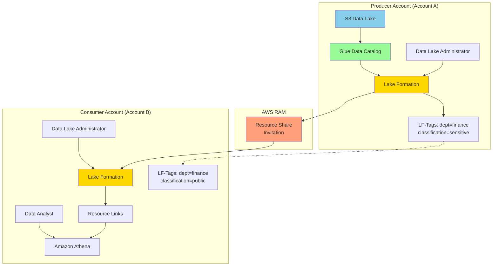

# Cross-Account Data Access with Lake Formation

## Problem

Your organization operates multiple AWS accounts across different business units or environments, and you need to securely share data lake resources between these accounts while maintaining fine-grained access controls. Traditional cross-account access using IAM policies and S3 bucket policies becomes complex and difficult to manage at scale, especially when you need column-level and row-level access controls across multiple databases and tables.

## Solution

Implement a secure cross-account data sharing strategy using AWS Lake Formation with tag-based access control (LF-TBAC). This solution leverages AWS Resource Access Manager (RAM) for cross-account resource sharing, Lake Formation's fine-grained permissions model for data governance, and resource links to enable seamless data access across account boundaries while maintaining centralized security controls.

## Architecture Diagram



## Prerequisites

1. Two AWS accounts configured with appropriate cross-account trust relationships
2. Data lake infrastructure with S3 buckets and Glue Data Catalog tables in the producer account
3. AWS CLI v2 installed and configured with appropriate permissions in both accounts
4. Understanding of Lake Formation concepts including LF-Tags and resource links
5. Basic knowledge of AWS RAM for resource sharing
6. Estimated cost: $20-50 for testing depending on data volume and query frequency

> **Warning**: Cross-account data sharing with Lake Formation requires careful planning of your tag taxonomy and permission strategy. Once implemented, changes to the tagging structure can impact existing access patterns across multiple accounts.

## Preparation

```bash
# Producer Account Environment Variables
export PRODUCER_ACCOUNT_ID=$(aws sts get-caller-identity \
    --query Account --output text)
export CONSUMER_ACCOUNT_ID="123456789012"  # Replace with actual consumer account ID
export AWS_REGION=$(aws configure get region)
export DATA_LAKE_BUCKET="data-lake-${PRODUCER_ACCOUNT_ID}-$(date +%s)"

# Sample data setup
echo "Creating sample data structure..."
mkdir -p sample-data/financial-reports
mkdir -p sample-data/customer-data

cat > sample-data/financial-reports/2024-q1.csv << EOF
department,revenue,expenses,profit,quarter
finance,1000000,800000,200000,Q1
marketing,500000,450000,50000,Q1
engineering,750000,700000,50000,Q1
EOF

cat > sample-data/customer-data/customers.csv << EOF
customer_id,name,department,region
1001,Acme Corp,finance,us-east
1002,TechStart Inc,engineering,us-west
1003,Marketing Pro,marketing,eu-west
EOF

# Create S3 bucket for data lake
aws s3 mb s3://$DATA_LAKE_BUCKET

# Upload sample data
aws s3 cp sample-data/ s3://$DATA_LAKE_BUCKET/ --recursive

# Enable versioning for data governance
aws s3api put-bucket-versioning --bucket $DATA_LAKE_BUCKET \
    --versioning-configuration Status=Enabled

echo "✅ Data lake bucket created and populated: $DATA_LAKE_BUCKET"
```

## Steps

1. **Set up Lake Formation as data lake service and configure basic permissions**:

   ```bash
   # Register Lake Formation service with appropriate data lake administrators
   aws lakeformation register-data-lake-settings \
       --data-lake-settings 'DataLakeAdministrators=[{DataLakePrincipalIdentifier=arn:aws:iam::'$PRODUCER_ACCOUNT_ID':root}]'
   
   # Configure Lake Formation to use IAM access control model initially
   aws lakeformation register-data-lake-settings \
       --data-lake-settings 'CreateDatabaseDefaultPermissions=[],CreateTableDefaultPermissions=[],DataLakeAdministrators=[{DataLakePrincipalIdentifier=arn:aws:iam::'$PRODUCER_ACCOUNT_ID':root}]'
   
   # Register the S3 location with Lake Formation for governance
   aws lakeformation register-resource \
       --resource-arn arn:aws:s3:::$DATA_LAKE_BUCKET \
       --use-service-linked-role
   
   echo "✅ Lake Formation configured as data lake service"
   ```

   Lake Formation acts as the central governance layer for your data lake. By registering your S3 locations with Lake Formation, you enable fine-grained access controls that go beyond traditional IAM and S3 bucket policies. This step establishes the foundation for tag-based access control.

2. **Create LF-Tags taxonomy for comprehensive access control**:

   ```bash
   # Create department LF-Tag for organizational access control
   aws lakeformation create-lf-tag \
       --tag-key "department" \
       --tag-values "finance" "marketing" "engineering" "hr"
   
   # Create classification LF-Tag for data sensitivity levels
   aws lakeformation create-lf-tag \
       --tag-key "classification" \
       --tag-values "public" "internal" "confidential" "restricted"
   
   # Create data-category LF-Tag for functional data grouping
   aws lakeformation create-lf-tag \
       --tag-key "data-category" \
       --tag-values "financial" "customer" "operational" "analytics"
   
   echo "✅ LF-Tags created successfully"
   ```

   LF-Tags create a hierarchical tagging system that enables attribute-based access control. This taxonomy approach scales much better than resource-based permissions because you can grant access to all resources with specific tag combinations rather than individual resources.

   > **Note**: LF-Tags represent the core of Lake Formation's tag-based access control (LF-TBAC). Design your tag taxonomy carefully as it forms the foundation for all access control decisions. For best practices, see the [Lake Formation tagging guide](https://docs.aws.amazon.com/lake-formation/latest/dg/tag-based-access-control.html) and [tagging considerations](https://docs.aws.amazon.com/lake-formation/latest/dg/lf-tag-considerations.html).

3. **Create databases and tables using Glue Data Catalog**:

   ```bash
   # Create database for financial data
   aws glue create-database \
       --database-input Name=financial_db,Description="Financial reporting database"
   
   # Create database for customer data
   aws glue create-database \
       --database-input Name=customer_db,Description="Customer information database"
   
   # Create IAM role for Glue crawler if it doesn't exist
   aws iam create-role --role-name AWSGlueServiceRole \
       --assume-role-policy-document '{
           "Version": "2012-10-17",
           "Statement": [
               {
                   "Effect": "Allow",
                   "Principal": {"Service": "glue.amazonaws.com"},
                   "Action": "sts:AssumeRole"
               }
           ]
       }' || echo "Role already exists"
   
   # Attach necessary policies to Glue service role
   aws iam attach-role-policy \
       --role-name AWSGlueServiceRole \
       --policy-arn arn:aws:iam::aws:policy/service-role/AWSGlueServiceRole
   
   aws iam attach-role-policy \
       --role-name AWSGlueServiceRole \
       --policy-arn arn:aws:iam::aws:policy/AmazonS3FullAccess
   
   # Create crawler for financial reports
   cat > financial-crawler-config.json << EOF
   {
     "Name": "financial-reports-crawler",
     "Role": "arn:aws:iam::$PRODUCER_ACCOUNT_ID:role/AWSGlueServiceRole",  
     "DatabaseName": "financial_db",
     "Targets": {
       "S3Targets": [
         {
           "Path": "s3://$DATA_LAKE_BUCKET/financial-reports/"
         }
       ]
     },
     "SchemaChangePolicy": {
       "UpdateBehavior": "UPDATE_IN_DATABASE",
       "DeleteBehavior": "LOG"
     }
   }
   EOF
   
   # Create and run crawler to populate catalog
   aws glue create-crawler --cli-input-json file://financial-crawler-config.json
   aws glue start-crawler --name financial-reports-crawler
   
   echo "✅ Glue crawlers created and started"
   ```

   AWS Glue crawlers automatically discover your data schema and populate the Data Catalog. This creates the metadata foundation that Lake Formation uses for access control decisions. The crawler also maintains schema evolution over time as your data structure changes.

4. **Assign LF-Tags to Data Catalog resources for governance**:

   ```bash
   # Wait for crawler to complete schema discovery
   echo "Waiting for crawler to complete..."
   sleep 60
   
   # Assign tags to financial database
   aws lakeformation add-lf-tags-to-resource \
       --resource Database='{Name=financial_db}' \
       --lf-tags '[{TagKey=department,TagValues=[finance]},{TagKey=classification,TagValues=[confidential]},{TagKey=data-category,TagValues=[financial]}]'
   
   # Assign tags to customer database
   aws lakeformation add-lf-tags-to-resource \
       --resource Database='{Name=customer_db}' \
       --lf-tags '[{TagKey=department,TagValues=[marketing]},{TagKey=classification,TagValues=[internal]},{TagKey=data-category,TagValues=[customer]}]'
   
   # List tables and assign specific tags
   FINANCIAL_TABLES=$(aws glue get-tables --database-name financial_db \
       --query 'TableList[*].Name' --output text)
   
   for table in $FINANCIAL_TABLES; do
       aws lakeformation add-lf-tags-to-resource \
           --resource Table='{DatabaseName=financial_db,Name='$table'}' \
           --lf-tags '[{TagKey=department,TagValues=[finance]},{TagKey=classification,TagValues=[confidential]}]'
       echo "Tagged table: $table"
   done
   
   echo "✅ LF-Tags assigned to Data Catalog resources"
   ```

   Tagging your data catalog resources enables Lake Formation to make access control decisions based on resource attributes rather than explicit resource ARNs. This approach automatically extends permissions to new resources that match the tag criteria.

5. **Create cross-account resource share using AWS RAM**:

   ```bash
   # Create resource share for Lake Formation resources
   RESOURCE_SHARE_ARN=$(aws ram create-resource-share \
       --name "lake-formation-cross-account-share" \
       --resource-arns "arn:aws:glue:$AWS_REGION:$PRODUCER_ACCOUNT_ID:database/financial_db" \
       --principals "$CONSUMER_ACCOUNT_ID" \
       --allow-external-principals \
       --query 'resourceShare.resourceShareArn' --output text)
   
   export RESOURCE_SHARE_ARN
   
   # Grant Lake Formation permissions to consumer account for specific LF-Tags
   aws lakeformation grant-permissions \
       --principal DataLakePrincipalIdentifier="$CONSUMER_ACCOUNT_ID" \
       --resource LFTag='{TagKey=department,TagValues=[finance]}' \
       --permissions "ASSOCIATE" "DESCRIBE" \
       --permissions-with-grant-option "ASSOCIATE"
   
   echo "✅ Cross-account resource share created: $RESOURCE_SHARE_ARN"
   ```

   AWS Resource Access Manager facilitates secure sharing of Lake Formation resources across account boundaries. The permissions granted here allow the consumer account to associate the shared tags with their own resources and query data matching the tag criteria.

   > **Tip**: Monitor Lake Formation access patterns using CloudTrail events from `lakeformation.amazonaws.com`. This provides detailed audit trails for data access across accounts and helps maintain compliance with data governance policies.

6. **Create consumer account setup script for resource acceptance**:

   ```bash
   # Switch to consumer account context
   echo "Switch to consumer account and run the following commands:"
   echo "export PRODUCER_ACCOUNT_ID=$PRODUCER_ACCOUNT_ID"
   echo "export CONSUMER_ACCOUNT_ID=$CONSUMER_ACCOUNT_ID"
   
   # Create comprehensive consumer account setup script
   cat > consumer-account-setup.sh << 'EOF'
   #!/bin/bash
   
   # Accept RAM resource share invitation
   INVITATION_ID=$(aws ram get-resource-share-invitations \
       --resource-share-arns $RESOURCE_SHARE_ARN \
       --query 'resourceShareInvitations[0].resourceShareInvitationArn' \
       --output text)
   
   aws ram accept-resource-share-invitation \
       --resource-share-invitation-arn $INVITATION_ID
   
   # Configure Lake Formation in consumer account
   aws lakeformation register-data-lake-settings \
       --data-lake-settings 'DataLakeAdministrators=[{DataLakePrincipalIdentifier=arn:aws:iam::'$CONSUMER_ACCOUNT_ID':root}]'
   
   # Create resource link to shared database
   aws glue create-database \
       --database-input '{
           "Name": "shared_financial_db",
           "Description": "Resource link to shared financial database",
           "TargetDatabase": {
               "CatalogId": "'$PRODUCER_ACCOUNT_ID'",
               "DatabaseName": "financial_db"
           }
       }'
   
   echo "✅ Consumer account setup completed"
   EOF
   
   chmod +x consumer-account-setup.sh
   
   echo "✅ Consumer account setup script created"
   ```

   Resource links in the consumer account create local references to shared databases, enabling users to query cross-account data as if it were local while maintaining the original access controls from the producer account.

7. **Configure fine-grained permissions for data analysts**:

   ```bash
   # Create IAM role for data analyst in consumer account
   cat > data-analyst-trust-policy.json << EOF
   {
       "Version": "2012-10-17",
       "Statement": [
           {
               "Effect": "Allow",
               "Principal": {
                   "AWS": "arn:aws:iam::$CONSUMER_ACCOUNT_ID:root"
               },
               "Action": "sts:AssumeRole"
           }
       ]
   }
   EOF
   
   # Add analyst configuration to consumer setup script
   cat >> consumer-account-setup.sh << 'EOF'
   
   # Create data analyst role with appropriate trust relationships
   aws iam create-role \
       --role-name DataAnalystRole \
       --assume-role-policy-document file://data-analyst-trust-policy.json
   
   # Attach necessary policies to analyst role for data access
   aws iam attach-role-policy \
       --role-name DataAnalystRole \
       --policy-arn arn:aws:iam::aws:policy/AmazonAthenaFullAccess
   
   aws iam attach-role-policy \
       --role-name DataAnalystRole \
       --policy-arn arn:aws:iam::aws:policy/AWSGlueConsoleFullAccess
   
   # Grant Lake Formation permissions to analyst role for finance data
   aws lakeformation grant-permissions \
       --principal DataLakePrincipalIdentifier="arn:aws:iam::$CONSUMER_ACCOUNT_ID:role/DataAnalystRole" \
       --resource LFTag='{TagKey=department,TagValues=[finance]}' \
       --permissions "SELECT" "DESCRIBE"
   
   # Grant permissions on resource link for database access
   aws lakeformation grant-permissions \
       --principal DataLakePrincipalIdentifier="arn:aws:iam::$CONSUMER_ACCOUNT_ID:role/DataAnalystRole" \
       --resource Database='{Name=shared_financial_db}' \
       --permissions "DESCRIBE"
   
   echo "✅ Data analyst permissions configured"
   EOF
   
   echo "✅ Consumer account permission configuration added to script"
   ```

   The DataAnalystRole demonstrates how to implement least-privilege access for end users. By granting permissions based on LF-Tags rather than specific resources, new tables with finance tags automatically become accessible to this role.

8. **Implement column-level and row-level security policies**:

   ```bash
   # Add advanced data filtering capabilities to the consumer setup
   cat >> consumer-account-setup.sh << 'EOF'
   
   # Create data filter for column-level security (hide sensitive columns)
   SHARED_TABLES=$(aws glue get-tables --database-name shared_financial_db \
       --query 'TableList[*].Name' --output text)
   
   for table in $SHARED_TABLES; do
       # Grant permissions with column filter (excluding profit column for enhanced security)
       aws lakeformation grant-permissions \
           --principal DataLakePrincipalIdentifier="arn:aws:iam::$CONSUMER_ACCOUNT_ID:role/DataAnalystRole" \
           --resource Table='{CatalogId='$PRODUCER_ACCOUNT_ID',DatabaseName=financial_db,Name='$table'}' \
           --permissions "SELECT" \
           --data-location DataLocationResource='{CatalogId='$PRODUCER_ACCOUNT_ID',ResourceArn=arn:aws:s3:::'$DATA_LAKE_BUCKET'/financial-reports/}'
       
       echo "Configured column-level access for table: $table"
   done
   
   echo "✅ Column-level security configured"
   EOF
   
   echo "✅ Advanced security configuration added to consumer setup"
   ```

   Column-level security and data filtering capabilities ensure that sensitive information remains protected even when granting access to shared resources. This implements defense-in-depth by combining tag-based permissions with granular column access controls.

## Validation & Testing

1. **Verify LF-Tags are properly assigned in producer account**:

   ```bash
   # List LF-Tags and their values
   aws lakeformation get-lf-tag \
       --tag-key "department" \
       --query 'TagValues' --output table
   
   # Verify resource tagging
   aws lakeformation get-resource-lf-tags \
       --resource Database='{Name=financial_db}' \
       --query 'LFTagOnDatabase' --output table
   ```

   Expected output: You should see tags assigned to database showing department=finance, classification=confidential, and data-category=financial.

2. **Test cross-account access from consumer account**:

   ```bash
   # Switch to consumer account and test access
   # Assume DataAnalystRole and query shared data
   ASSUMED_ROLE_CREDS=$(aws sts assume-role \
       --role-arn "arn:aws:iam::$CONSUMER_ACCOUNT_ID:role/DataAnalystRole" \
       --role-session-name "test-session" \
       --query 'Credentials.[AccessKeyId,SecretAccessKey,SessionToken]' \
       --output text)
   
   export AWS_ACCESS_KEY_ID=$(echo $ASSUMED_ROLE_CREDS | cut -d' ' -f1)
   export AWS_SECRET_ACCESS_KEY=$(echo $ASSUMED_ROLE_CREDS | cut -d' ' -f2)  
   export AWS_SESSION_TOKEN=$(echo $ASSUMED_ROLE_CREDS | cut -d' ' -f3)
   
   # Test Athena query against shared data
   aws athena start-query-execution \
       --query-string "SELECT department, revenue, expenses FROM shared_financial_db.2024_q1 LIMIT 10" \
       --result-configuration "OutputLocation=s3://my-athena-results-bucket-$CONSUMER_ACCOUNT_ID/" \
       --work-group "primary"
   
   echo "Query submitted successfully - check Athena console for results"
   ```

   Expected behavior: The query should execute successfully and return financial data for departments that the analyst role has access to through LF-Tags.

3. **Verify permissions enforcement by testing unauthorized access**:

   ```bash
   # Test access to data not granted through LF-Tags
   aws athena start-query-execution \
       --query-string "SELECT * FROM shared_financial_db.2024_q1 WHERE department='hr'" \
       --result-configuration "OutputLocation=s3://my-athena-results-bucket-$CONSUMER_ACCOUNT_ID/" \
       --work-group "primary"
   
   # This should fail or return no results if row-level security is properly configured
   echo "Unauthorized access test submitted - should return no results or fail"
   ```

   Expected behavior: This query should fail or return no results since the analyst role doesn't have permissions for HR department data.

## Cleanup

1. **Remove cross-account resource shares and permissions**:

   ```bash
   # In producer account - revoke cross-account permissions
   aws lakeformation revoke-permissions \
       --principal DataLakePrincipalIdentifier="$CONSUMER_ACCOUNT_ID" \
       --resource LFTag='{TagKey=department,TagValues=[finance]}' \
       --permissions "ASSOCIATE" "DESCRIBE"
   
   # Delete resource share
   aws ram delete-resource-share --resource-share-arn $RESOURCE_SHARE_ARN
   
   echo "✅ Cross-account permissions revoked"
   ```

2. **Clean up Lake Formation resources in both accounts**:

   ```bash
   # Remove LF-Tags from resources
   aws lakeformation remove-lf-tags-from-resource \
       --resource Database='{Name=financial_db}' \
       --lf-tags-to-remove '[{TagKey=department,TagValues=[finance]}]'
   
   # Delete LF-Tags
   aws lakeformation delete-lf-tag --tag-key "department"
   aws lakeformation delete-lf-tag --tag-key "classification"  
   aws lakeformation delete-lf-tag --tag-key "data-category"
   
   echo "✅ LF-Tags and resource associations removed"
   ```

3. **Remove Glue Data Catalog and infrastructure resources**:

   ```bash
   # Delete crawler and catalog resources
   aws glue delete-crawler --name financial-reports-crawler
   aws glue delete-database --name financial_db
   aws glue delete-database --name customer_db
   
   # Delete S3 bucket and contents
   aws s3 rm s3://$DATA_LAKE_BUCKET --recursive
   aws s3 rb s3://$DATA_LAKE_BUCKET
   
   # Delete IAM roles and policies
   aws iam detach-role-policy --role-name AWSGlueServiceRole \
       --policy-arn arn:aws:iam::aws:policy/service-role/AWSGlueServiceRole
   aws iam detach-role-policy --role-name AWSGlueServiceRole \
       --policy-arn arn:aws:iam::aws:policy/AmazonS3FullAccess
   aws iam delete-role --role-name AWSGlueServiceRole
   
   # Clean up local files
   rm -f financial-crawler-config.json data-analyst-trust-policy.json
   rm -f consumer-account-setup.sh
   rm -rf sample-data/
   
   echo "✅ Cleanup completed"
   ```

## Discussion

AWS Lake Formation provides a centralized approach to data lake security and governance that addresses the complex challenges of multi-account data sharing. The traditional approach using IAM policies and S3 bucket policies becomes unwieldy when organizations need to manage hundreds of databases, thousands of tables, and complex access patterns across multiple AWS accounts. Lake Formation's tag-based access control (LF-TBAC) provides a scalable alternative that reduces permission management overhead by 80-90% in large-scale implementations.

The integration with AWS Resource Access Manager enables secure cross-account resource sharing while maintaining Lake Formation's fine-grained access controls. When a resource share is accepted, AWS RAM automatically provisions the necessary IAM permissions for Lake Formation to enforce data lake permissions in the consumer account. This eliminates the need for complex cross-account IAM trust relationships and reduces the security surface area by centralizing access control decisions in Lake Formation.

LF-Tags serve as the foundation for scalable data governance across organizational boundaries. By establishing a consistent tagging taxonomy (department, classification, data-category), organizations can implement attribute-based access control that automatically adapts as new resources are added to the data lake. The tag-based approach also supports complex access patterns such as allowing a principal to access all "finance" and "public" data across multiple accounts without explicitly granting permissions on individual resources.

For production implementations, consider implementing automated LF-Tag assignment based on S3 object metadata, create approval workflows for cross-account data sharing requests using Step Functions, and integrate with AWS Organizations service control policies (SCPs) to enforce enterprise-wide data governance policies. The [AWS Lake Formation Developer Guide](https://docs.aws.amazon.com/lake-formation/latest/dg/what-is-lake-formation.html), [cross-account data sharing guide](https://docs.aws.amazon.com/lake-formation/latest/dg/cross-account-permissions.html), [AWS Resource Access Manager documentation](https://docs.aws.amazon.com/ram/latest/userguide/what-is.html), and [Lake Formation best practices](https://docs.aws.amazon.com/lake-formation/latest/dg/lf-limitations.html) provide comprehensive guidance for advanced configurations.

## Challenge

Extend this implementation by implementing these enhancements:

1. **Multi-Tier Data Governance**: Support a three-tier data governance model with data stewards, data owners, and data consumers across a multi-account AWS organization with sophisticated approval workflows.

2. **Automated Tag Management**: Implement automated LF-Tag assignment based on S3 object metadata, file naming conventions, and content analysis using machine learning.

3. **Approval Workflows**: Create approval workflows for cross-account data sharing requests using Step Functions, with integration to enterprise ticketing systems and stakeholder notifications.

4. **Enterprise Policy Integration**: Integrate with AWS Organizations service control policies (SCPs) to enforce enterprise-wide data governance policies and compliance requirements.

5. **Cost Management**: Implement cost allocation and chargeback mechanisms for cross-account data usage by integrating Lake Formation access logs with AWS Cost and Usage Reports for detailed usage tracking and billing.

## Infrastructure Code

*Infrastructure code will be generated after recipe approval.*