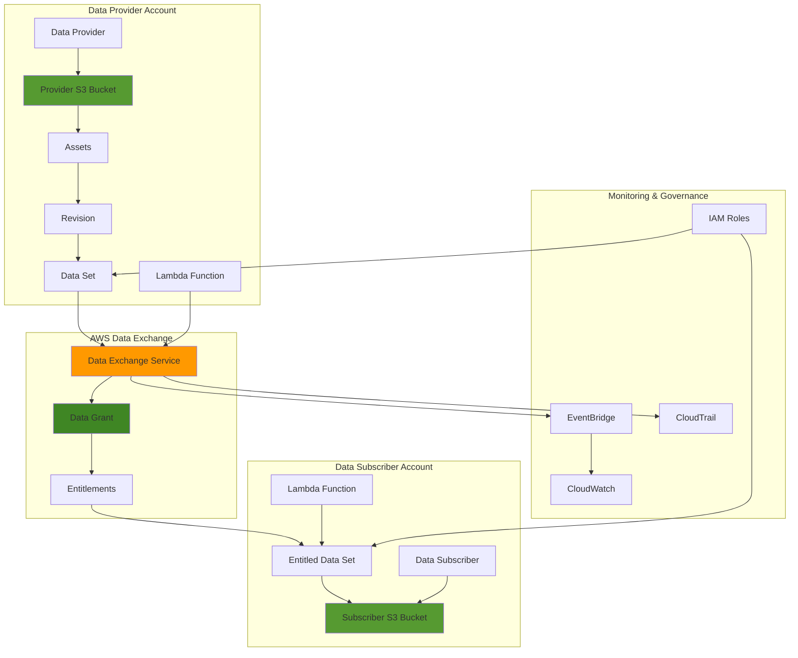

# Cross-Account Data Sharing with Data Exchange

## Problem

Enterprise organizations frequently need to share sensitive data assets between different AWS accounts while maintaining granular access controls, audit trails, and compliance requirements. Traditional data sharing methods involve complex ETL processes, manual data transfers, or insecure file sharing systems that create operational overhead, security vulnerabilities, and data governance challenges. Organizations struggle to establish automated, secure, and cost-effective cross-account data sharing workflows that can scale across multiple business units and external partners.

## Solution

AWS Data Exchange provides a secure, scalable solution for sharing data assets across AWS accounts through data grants and automated delivery mechanisms. This approach enables organizations to establish secure data sharing pipelines with built-in access controls, automated notifications, and comprehensive audit logging while eliminating the need for complex data duplication or manual intervention in the sharing process.

## Architecture Diagram



## Prerequisites

1. Two AWS accounts with appropriate Data Exchange permissions (provider and subscriber)
2. AWS CLI v2 installed and configured (or AWS CloudShell)
3. Understanding of IAM roles, S3 bucket policies, and cross-account access
4. Familiarity with JSON configuration and AWS CLI operations
5. Estimated cost: $50-100/month for data transfer and storage (varies by data volume)

> **Note**: This recipe requires jq for JSON parsing. Install jq if not available: `sudo yum install jq` (Amazon Linux) or `brew install jq` (macOS).

## Preparation

```bash
# Set environment variables for provider account
export AWS_REGION=$(aws configure get region)
export PROVIDER_ACCOUNT_ID=$(aws sts get-caller-identity \
    --query Account --output text)

# Generate unique identifiers for resources
RANDOM_SUFFIX=$(aws secretsmanager get-random-password \
    --exclude-punctuation --exclude-uppercase \
    --password-length 6 --require-each-included-type \
    --output text --query RandomPassword)

export DATASET_NAME="enterprise-analytics-data-${RANDOM_SUFFIX}"
export PROVIDER_BUCKET="data-exchange-provider-${RANDOM_SUFFIX}"
export SUBSCRIBER_BUCKET="data-exchange-subscriber-${RANDOM_SUFFIX}"
export SUBSCRIBER_ACCOUNT_ID="123456789012"  # Replace with actual subscriber account

# Create foundational S3 bucket for data provider
aws s3 mb s3://$PROVIDER_BUCKET --region $AWS_REGION

# Enable versioning for data consistency
aws s3api put-bucket-versioning \
    --bucket $PROVIDER_BUCKET \
    --versioning-configuration Status=Enabled

# Enable server-side encryption for security
aws s3api put-bucket-encryption \
    --bucket $PROVIDER_BUCKET \
    --server-side-encryption-configuration \
    'Rules=[{ApplyServerSideEncryptionByDefault:{SSEAlgorithm:AES256}}]'

echo "✅ Preparation completed with bucket: $PROVIDER_BUCKET"
```

## Steps

1. **Create IAM Role for Data Exchange Operations**:

   AWS Data Exchange requires specific IAM permissions to access S3 buckets and manage data assets. This role enables the service to perform operations like importing assets from S3 and creating revisions while maintaining security through least-privilege access controls.

   ```bash
   # Create trust policy for Data Exchange service
   cat > data-exchange-trust-policy.json << 'EOF'
   {
       "Version": "2012-10-17",
       "Statement": [
           {
               "Effect": "Allow",
               "Principal": {
                   "Service": [
                       "dataexchange.amazonaws.com",
                       "lambda.amazonaws.com"
                   ]
               },
               "Action": "sts:AssumeRole"
           }
       ]
   }
   EOF
   
   # Create the IAM role
   aws iam create-role \
       --role-name DataExchangeProviderRole \
       --assume-role-policy-document file://data-exchange-trust-policy.json
   
   # Attach necessary permissions for Data Exchange
   aws iam attach-role-policy \
       --role-name DataExchangeProviderRole \
       --policy-arn arn:aws:iam::aws:policy/AWSDataExchangeProviderFullAccess
   
   # Attach Lambda execution permissions
   aws iam attach-role-policy \
       --role-name DataExchangeProviderRole \
       --policy-arn arn:aws:iam::aws:policy/service-role/AWSLambdaBasicExecutionRole
   
   echo "✅ Created IAM role for Data Exchange operations"
   ```

   > **Note**: The AWSDataExchangeProviderFullAccess policy provides comprehensive permissions for Data Exchange operations. Review the [AWS Data Exchange documentation](https://docs.aws.amazon.com/data-exchange/latest/userguide/what-is.html) for production security best practices and configuration guidance.

2. **Create and Upload Sample Data Assets**:

   Data assets form the foundation of any Data Exchange offering, representing the actual files and information shared with subscribers. Creating realistic sample data helps demonstrate data sharing capabilities and provides subscribers with a understanding of the data structure and content format they will receive.

   ```bash
   # Create sample data files
   mkdir -p sample-data
   
   # Generate sample customer analytics data with current date
   CURRENT_DATE=$(date '+%Y-%m-%d')
   cat > sample-data/customer-analytics.csv << EOF
   customer_id,purchase_date,amount,category,region
   C001,$CURRENT_DATE,150.50,electronics,us-east
   C002,$CURRENT_DATE,89.99,books,us-west
   C003,$CURRENT_DATE,299.99,clothing,eu-central
   C004,$CURRENT_DATE,45.75,home,us-east
   C005,$CURRENT_DATE,199.99,electronics,asia-pacific
   EOF
   
   # Generate sample sales data
   cat > sample-data/sales-summary.json << EOF
   {
       "report_date": "$CURRENT_DATE",
       "total_sales": 785.72,
       "transaction_count": 5,
       "top_category": "electronics",
       "average_order_value": 157.14
   }
   EOF
   
   # Upload sample data to S3
   aws s3 cp sample-data/ s3://$PROVIDER_BUCKET/analytics-data/ \
       --recursive
   
   echo "✅ Uploaded sample data assets to S3"
   ```

3. **Create Data Set in AWS Data Exchange**:

   Data sets in AWS Data Exchange serve as containers for organizing related data assets. The S3_SNAPSHOT asset type is ideal for sharing file-based data like CSV, JSON, or Parquet files, enabling recipients to download complete data snapshots.

   ```bash
   # Create the data set
   DATASET_RESPONSE=$(aws dataexchange create-data-set \
       --asset-type S3_SNAPSHOT \
       --description "Enterprise customer analytics data for cross-account sharing" \
       --name "$DATASET_NAME" \
       --tags Environment=Production,DataType=Analytics)
   
   # Extract data set ID
   export DATASET_ID=$(echo $DATASET_RESPONSE | \
       jq -r '.Id')
   
   echo "✅ Created data set with ID: $DATASET_ID"
   ```

   The data set is now created and ready for revision management. This foundational step establishes the container structure that organizes all related data assets and enables efficient subscriber discovery through the Data Exchange catalog.

4. **Create Initial Revision and Import Assets**:

   Revisions in AWS Data Exchange enable versioning of data assets, allowing you to publish updates while maintaining historical versions. The import process securely transfers S3-hosted data into the Data Exchange service, where it becomes available for sharing with authorized subscribers. This versioning capability ensures data lineage and enables rollback to previous versions if needed.

   ```bash
   # Create a new revision
   REVISION_RESPONSE=$(aws dataexchange create-revision \
       --data-set-id $DATASET_ID \
       --comment "Initial data revision with customer analytics")
   
   # Extract revision ID
   export REVISION_ID=$(echo $REVISION_RESPONSE | \
       jq -r '.Id')
   
   # Import customer analytics CSV asset
   IMPORT_JOB_CSV=$(aws dataexchange create-job \
       --type IMPORT_ASSETS_FROM_S3 \
       --details "{
           \"ImportAssetsFromS3JobDetails\": {
               \"DataSetId\": \"$DATASET_ID\",
               \"RevisionId\": \"$REVISION_ID\",
               \"AssetSources\": [
                   {
                       \"Bucket\": \"$PROVIDER_BUCKET\",
                       \"Key\": \"analytics-data/customer-analytics.csv\"
                   }
               ]
           }
       }")
   
   # Extract job ID and wait for completion
   IMPORT_JOB_ID=$(echo $IMPORT_JOB_CSV | jq -r '.Id')
   
   # Wait for import job to complete
   aws dataexchange wait job-completed --job-id $IMPORT_JOB_ID
   
   echo "✅ Imported assets into revision $REVISION_ID"
   ```

5. **Finalize Revision and Publish Data Set**:

   Finalizing a revision makes it immutable and available for sharing, transitioning it from a draft state to a published state. This process ensures data integrity by preventing accidental modifications once assets are ready for distribution. Multiple assets can be imported into a single revision, creating comprehensive data packages for subscribers.

   ```bash
   # Import JSON asset
   IMPORT_JOB_JSON=$(aws dataexchange create-job \
       --type IMPORT_ASSETS_FROM_S3 \
       --details "{
           \"ImportAssetsFromS3JobDetails\": {
               \"DataSetId\": \"$DATASET_ID\",
               \"RevisionId\": \"$REVISION_ID\",
               \"AssetSources\": [
                   {
                       \"Bucket\": \"$PROVIDER_BUCKET\",
                       \"Key\": \"analytics-data/sales-summary.json\"
                   }
               ]
           }
       }")
   
   # Wait for second import job
   IMPORT_JOB_ID_2=$(echo $IMPORT_JOB_JSON | jq -r '.Id')
   aws dataexchange wait job-completed --job-id $IMPORT_JOB_ID_2
   
   # Finalize the revision
   aws dataexchange update-revision \
       --data-set-id $DATASET_ID \
       --revision-id $REVISION_ID \
       --finalized
   
   echo "✅ Finalized revision and published data set"
   ```

6. **Create Data Grant for Cross-Account Sharing**:

   Data grants establish secure, time-limited access permissions for specific AWS accounts. This mechanism ensures that only authorized accounts can access your data, and access automatically expires based on your specified timeline, maintaining data governance and compliance.

   ```bash
   # Create data grant for subscriber account with future expiration
   EXPIRY_DATE=$(date -d '+1 year' '+%Y-%m-%dT23:59:59Z')
   
   DATA_GRANT_RESPONSE=$(aws dataexchange create-data-grant \
       --name "Analytics Data Grant for Account $SUBSCRIBER_ACCOUNT_ID" \
       --description "Cross-account data sharing grant for analytics data" \
       --dataset-id $DATASET_ID \
       --recipient-account-id $SUBSCRIBER_ACCOUNT_ID \
       --ends-at "$EXPIRY_DATE")
   
   # Extract data grant ID
   export DATA_GRANT_ID=$(echo $DATA_GRANT_RESPONSE | \
       jq -r '.Id')
   
   echo "✅ Created data grant with ID: $DATA_GRANT_ID"
   echo "Grant expires on: $EXPIRY_DATE"
   echo "Share this grant ID with the subscriber: $DATA_GRANT_ID"
   ```

   > **Warning**: Data grants have expiration dates and cannot be extended once created. Plan your sharing timeline carefully and create new grants if extended access is needed. Monitor grant status through [CloudWatch metrics](https://docs.aws.amazon.com/AmazonCloudWatch/latest/monitoring/working_with_metrics.html).

7. **Set Up Automated Notifications with Lambda**:

   Automated notifications ensure stakeholders are immediately informed of data sharing events, operational issues, and subscription activities. Lambda functions provide a serverless, cost-effective way to process Data Exchange events and deliver notifications through various channels like email, SMS, or custom integrations. This proactive monitoring approach enables rapid response to data sharing incidents.

   ```bash
   # Create Lambda function for notifications
   cat > notification-lambda.py << 'EOF'
   import json
   import boto3
   import os
   import logging
   
   logger = logging.getLogger()
   logger.setLevel(logging.INFO)
   
   def lambda_handler(event, context):
       logger.info(f"Received event: {json.dumps(event)}")
       
       try:
           # Parse the Data Exchange event
           detail = event.get('detail', {})
           event_name = detail.get('eventName', 'Unknown')
           dataset_id = detail.get('dataSetId', 'Unknown')
           
           message = f"""
           AWS Data Exchange Event: {event_name}
           Dataset ID: {dataset_id}
           Timestamp: {event.get('time', 'Unknown')}
           
           Event Details: {json.dumps(detail, indent=2)}
           """
           
           logger.info(f"Processing Data Exchange event: {event_name}")
           
           # Send notification to SNS if topic ARN is configured
           topic_arn = os.environ.get('SNS_TOPIC_ARN')
           if topic_arn:
               sns = boto3.client('sns')
               sns.publish(
                   TopicArn=topic_arn,
                   Message=message,
                   Subject=f'Data Exchange Event: {event_name}'
               )
               logger.info("Notification sent to SNS topic")
           
           return {
               'statusCode': 200,
               'body': json.dumps('Notification processed successfully')
           }
           
       except Exception as e:
           logger.error(f"Error processing event: {str(e)}")
           return {
               'statusCode': 500,
               'body': json.dumps(f'Error: {str(e)}')
           }
   EOF
   
   # Create deployment package
   zip notification-lambda.zip notification-lambda.py
   
   # Create Lambda function with latest Python runtime
   aws lambda create-function \
       --function-name DataExchangeNotificationHandler \
       --runtime python3.12 \
       --role arn:aws:iam::$PROVIDER_ACCOUNT_ID:role/DataExchangeProviderRole \
       --handler notification-lambda.lambda_handler \
       --zip-file fileb://notification-lambda.zip \
       --timeout 60 \
       --description "Handles Data Exchange events and notifications"
   
   echo "✅ Created notification Lambda function"
   ```

8. **Configure EventBridge Rule for Data Exchange Events**:

   Amazon EventBridge provides real-time event processing for AWS Data Exchange operations, enabling automated responses to data sharing activities. EventBridge rules filter and route specific events to target services like Lambda functions, SNS topics, or SQS queues. This integration creates a comprehensive monitoring and automation framework for your data sharing workflows.

   ```bash
   # Create EventBridge rule for Data Exchange events
   aws events put-rule \
       --name DataExchangeEventRule \
       --event-pattern '{
           "source": ["aws.dataexchange"],
           "detail-type": [
               "Data Exchange Asset Import State Change",
               "Data Exchange Revision State Change",
               "Data Exchange Data Grant State Change"
           ]
       }' \
       --description "Captures Data Exchange events for notifications"
   
   # Add Lambda function as target
   aws events put-targets \
       --rule DataExchangeEventRule \
       --targets "Id"="1","Arn"="arn:aws:lambda:$AWS_REGION:$PROVIDER_ACCOUNT_ID:function:DataExchangeNotificationHandler"
   
   # Grant EventBridge permission to invoke Lambda
   aws lambda add-permission \
       --function-name DataExchangeNotificationHandler \
       --statement-id DataExchangeEventPermission \
       --action lambda:InvokeFunction \
       --principal events.amazonaws.com \
       --source-arn arn:aws:events:$AWS_REGION:$PROVIDER_ACCOUNT_ID:rule/DataExchangeEventRule
   
   echo "✅ Configured EventBridge integration for automated notifications"
   ```

   The EventBridge rule is now configured to capture Data Exchange events and automatically trigger Lambda functions for notification processing. This integration provides comprehensive monitoring of all data sharing activities, enabling proactive response to operational events and subscriber activities. Learn more about [EventBridge Data Exchange events](https://docs.aws.amazon.com/eventbridge/latest/userguide/eb-service-event.html).

9. **Create Subscriber Access Script (for subscriber account)**:

   Subscriber access scripts streamline the data consumption process by automating the acceptance of data grants and the export of entitled data assets. This script eliminates manual steps for subscribers and ensures consistent data retrieval processes. The automated export functionality transfers entitled data directly to the subscriber's S3 bucket for immediate use in their analytics workflows.

   ```bash
   # Create script for subscriber to accept and access data grant
   cat > subscriber-access-script.sh << 'EOF'
   #!/bin/bash
   
   # Configuration for subscriber account
   DATA_GRANT_ID="$1"
   SUBSCRIBER_BUCKET="$2"
   
   if [ -z "$DATA_GRANT_ID" ] || [ -z "$SUBSCRIBER_BUCKET" ]; then
       echo "Usage: $0 <data-grant-id> <subscriber-bucket-name>"
       exit 1
   fi
   
   echo "Accepting data grant: $DATA_GRANT_ID"
   
   # Accept the data grant
   aws dataexchange accept-data-grant \
       --data-grant-id $DATA_GRANT_ID
   
   # Wait a moment for grant processing
   sleep 5
   
   # List entitled data sets
   ENTITLED_DATASETS=$(aws dataexchange list-data-sets \
       --origin ENTITLED \
       --query 'DataSets[0].Id' \
       --output text)
   
   if [ "$ENTITLED_DATASETS" = "None" ] || [ -z "$ENTITLED_DATASETS" ]; then
       echo "Error: No entitled datasets found"
       exit 1
   fi
   
   echo "Entitled to data set: $ENTITLED_DATASETS"
   
   # Create subscriber S3 bucket if it doesn't exist
   aws s3 mb s3://$SUBSCRIBER_BUCKET 2>/dev/null || echo "Bucket already exists or accessible"
   
   # Export entitled assets to subscriber bucket
   EXPORT_JOB=$(aws dataexchange create-job \
       --type EXPORT_ASSETS_TO_S3 \
       --details "{
           \"ExportAssetsToS3JobDetails\": {
               \"DataSetId\": \"$ENTITLED_DATASETS\",
               \"AssetDestinations\": [
                   {
                       \"AssetId\": \"*\",
                       \"Bucket\": \"$SUBSCRIBER_BUCKET\",
                       \"Key\": \"imported-data/\"
                   }
               ]
           }
       }")
   
   EXPORT_JOB_ID=$(echo $EXPORT_JOB | jq -r '.Id')
   echo "Export job initiated with ID: $EXPORT_JOB_ID"
   
   # Wait for export job to complete
   aws dataexchange wait job-completed --job-id $EXPORT_JOB_ID
   
   echo "✅ Data grant accepted and export job completed"
   EOF
   
   chmod +x subscriber-access-script.sh
   
   echo "✅ Created subscriber access script"
   ```

10. **Set Up Automated Data Updates with Lambda**:

    Automated data updates ensure subscribers receive fresh, current information without manual intervention from data providers. This Lambda function generates new data revisions on a scheduled basis, simulating real-world data refresh scenarios. The automation reduces operational overhead while maintaining data freshness and ensuring subscribers have access to the most recent information.

    ```bash
    # Create Lambda function for automated data updates
    cat > update-lambda.py << 'EOF'
    import json
    import boto3
    from datetime import datetime
    import random
    import logging
    
    logger = logging.getLogger()
    logger.setLevel(logging.INFO)
    
    def lambda_handler(event, context):
        logger.info(f"Starting automated data update: {json.dumps(event)}")
        
        try:
            dataexchange = boto3.client('dataexchange')
            s3 = boto3.client('s3')
            
            dataset_id = event.get('dataset_id')
            bucket_name = event.get('bucket_name')
            
            if not dataset_id or not bucket_name:
                raise ValueError('Missing required parameters: dataset_id or bucket_name')
            
            # Generate updated sample data
            current_date = datetime.now().strftime('%Y-%m-%d')
            updated_data = []
            
            for i in range(1, 6):
                updated_data.append([
                    f'C{i:03d}',
                    current_date,
                    f'{random.uniform(50, 300):.2f}',
                    random.choice(['electronics', 'books', 'clothing', 'home']),
                    random.choice(['us-east', 'us-west', 'eu-central', 'asia-pacific'])
                ])
            
            # Upload updated data to S3
            csv_content = 'customer_id,purchase_date,amount,category,region\n'
            for row in updated_data:
                csv_content += ','.join(row) + '\n'
            
            s3_key = f'analytics-data/customer-analytics-{current_date}.csv'
            s3.put_object(
                Bucket=bucket_name,
                Key=s3_key,
                Body=csv_content,
                ServerSideEncryption='AES256'
            )
            
            logger.info(f"Uploaded new data file: {s3_key}")
            
            # Create new revision
            revision_response = dataexchange.create_revision(
                DataSetId=dataset_id,
                Comment=f'Automated update - {current_date}'
            )
            
            revision_id = revision_response['Id']
            logger.info(f"Created revision: {revision_id}")
            
            # Import new assets
            import_job = dataexchange.create_job(
                Type='IMPORT_ASSETS_FROM_S3',
                Details={
                    'ImportAssetsFromS3JobDetails': {
                        'DataSetId': dataset_id,
                        'RevisionId': revision_id,
                        'AssetSources': [
                            {
                                'Bucket': bucket_name,
                                'Key': s3_key
                            }
                        ]
                    }
                }
            )
            
            logger.info(f"Started import job: {import_job['Id']}")
            
            return {
                'statusCode': 200,
                'body': json.dumps({
                    'revision_id': revision_id,
                    'import_job_id': import_job['Id'],
                    'date': current_date
                })
            }
            
        except Exception as e:
            logger.error(f"Error in automated update: {str(e)}")
            return {
                'statusCode': 500,
                'body': json.dumps(f'Error: {str(e)}')
            }
    EOF
    
    # Create deployment package
    zip update-lambda.zip update-lambda.py
    
    # Create Lambda function
    aws lambda create-function \
        --function-name DataExchangeAutoUpdate \
        --runtime python3.12 \
        --role arn:aws:iam::$PROVIDER_ACCOUNT_ID:role/DataExchangeProviderRole \
        --handler update-lambda.lambda_handler \
        --zip-file fileb://update-lambda.zip \
        --timeout 300 \
        --memory-size 256 \
        --description "Automatically updates data sets with new revisions"
    
    echo "✅ Created automated data update Lambda function"
    ```

11. **Configure Automated Scheduling with EventBridge**:

    EventBridge scheduling enables time-based automation for data updates, ensuring consistent data refresh cycles that align with business requirements. The scheduling service provides reliable, serverless triggering of Lambda functions at specified intervals. This automation framework supports complex scheduling patterns and integrates seamlessly with other AWS services for comprehensive data pipeline orchestration.

    ```bash
    # Create scheduled rule for daily data updates
    aws events put-rule \
        --name DataExchangeAutoUpdateSchedule \
        --schedule-expression "rate(24 hours)" \
        --description "Triggers daily data updates for Data Exchange" \
        --state ENABLED
    
    # Add Lambda function as target with input
    aws events put-targets \
        --rule DataExchangeAutoUpdateSchedule \
        --targets "Id"="1","Arn"="arn:aws:lambda:$AWS_REGION:$PROVIDER_ACCOUNT_ID:function:DataExchangeAutoUpdate","Input"="{\"dataset_id\":\"$DATASET_ID\",\"bucket_name\":\"$PROVIDER_BUCKET\"}"
    
    # Grant EventBridge permission to invoke Lambda
    aws lambda add-permission \
        --function-name DataExchangeAutoUpdate \
        --statement-id DataExchangeSchedulePermission \
        --action lambda:InvokeFunction \
        --principal events.amazonaws.com \
        --source-arn arn:aws:events:$AWS_REGION:$PROVIDER_ACCOUNT_ID:rule/DataExchangeAutoUpdateSchedule
    
    echo "✅ Configured automated daily data updates"
    ```

12. **Set Up Monitoring and Alerts**:

    Comprehensive monitoring and alerting capabilities ensure data sharing operations remain healthy and performant. CloudWatch metrics, alarms, and log groups provide visibility into Data Exchange activities, Lambda function performance, and system health. Custom metrics and filters enable proactive identification of issues before they impact subscribers or data availability.

    ```bash
    # Create CloudWatch log group for Data Exchange operations
    aws logs create-log-group \
        --log-group-name /aws/dataexchange/operations \
        --retention-in-days 30
    
    # Create CloudWatch alarm for Lambda function errors
    aws cloudwatch put-metric-alarm \
        --alarm-name "DataExchangeLambdaErrors" \
        --alarm-description "Alert when Lambda functions encounter errors" \
        --metric-name "Errors" \
        --namespace "AWS/Lambda" \
        --statistic Sum \
        --period 300 \
        --threshold 1 \
        --comparison-operator GreaterThanOrEqualToThreshold \
        --evaluation-periods 1 \
        --dimensions Name=FunctionName,Value=DataExchangeAutoUpdate
    
    # Create custom metric filter for Lambda errors
    aws logs put-metric-filter \
        --log-group-name "/aws/lambda/DataExchangeAutoUpdate" \
        --filter-name "ErrorMetricFilter" \
        --filter-pattern "ERROR" \
        --metric-transformations \
            metricName=DataExchangeLambdaErrors,metricNamespace=CustomMetrics,metricValue=1
    
    # Create alarm for failed import jobs
    aws cloudwatch put-metric-alarm \
        --alarm-name "DataExchangeFailedImports" \
        --alarm-description "Alert when data import jobs fail" \
        --metric-name "DataExchangeLambdaErrors" \
        --namespace "CustomMetrics" \
        --statistic Sum \
        --period 300 \
        --threshold 1 \
        --comparison-operator GreaterThanOrEqualToThreshold \
        --evaluation-periods 1
    
    echo "✅ Configured monitoring and alerting"
    ```

## Validation & Testing

1. Verify data set was created successfully:

   ```bash
   # Check data set details
   aws dataexchange get-data-set --data-set-id $DATASET_ID
   ```

   Expected output: JSON object with data set details including name, description, and status.

2. Validate revision and assets were imported:

   ```bash
   # List revisions in the data set
   aws dataexchange list-revisions --data-set-id $DATASET_ID
   
   # List assets in the latest revision
   aws dataexchange list-revision-assets \
       --data-set-id $DATASET_ID \
       --revision-id $REVISION_ID
   ```

3. Test data grant creation and access:

   ```bash
   # Verify data grant exists
   aws dataexchange list-data-grants \
       --query "DataGrants[?DataSetId=='$DATASET_ID']"
   ```

4. Test automated Lambda functions:

   ```bash
   # Invoke update Lambda function manually
   aws lambda invoke \
       --function-name DataExchangeAutoUpdate \
       --payload "{\"dataset_id\":\"$DATASET_ID\",\"bucket_name\":\"$PROVIDER_BUCKET\"}" \
       response.json
   
   cat response.json
   ```

5. Verify EventBridge integration:

   ```bash
   # Check EventBridge rules
   aws events list-rules --name-prefix DataExchange
   
   # List targets for each rule
   aws events list-targets-by-rule --rule DataExchangeEventRule
   ```

## Cleanup

1. Remove EventBridge rules and targets:

   ```bash
   # Remove targets from rules
   aws events remove-targets \
       --rule DataExchangeAutoUpdateSchedule \
       --ids 1
   
   aws events remove-targets \
       --rule DataExchangeEventRule \
       --ids 1
   
   # Delete EventBridge rules
   aws events delete-rule --name DataExchangeAutoUpdateSchedule
   aws events delete-rule --name DataExchangeEventRule
   
   echo "✅ Deleted EventBridge rules"
   ```

2. Remove Lambda functions:

   ```bash
   # Delete Lambda functions
   aws lambda delete-function \
       --function-name DataExchangeAutoUpdate
   
   aws lambda delete-function \
       --function-name DataExchangeNotificationHandler
   
   echo "✅ Deleted Lambda functions"
   ```

3. Remove CloudWatch resources:

   ```bash
   # Delete CloudWatch alarms
   aws cloudwatch delete-alarms \
       --alarm-names DataExchangeLambdaErrors DataExchangeFailedImports
   
   # Delete log groups
   aws logs delete-log-group \
       --log-group-name /aws/dataexchange/operations
   
   aws logs delete-log-group \
       --log-group-name /aws/lambda/DataExchangeAutoUpdate 2>/dev/null || true
   
   aws logs delete-log-group \
       --log-group-name /aws/lambda/DataExchangeNotificationHandler 2>/dev/null || true
   
   echo "✅ Deleted CloudWatch resources"
   ```

4. Remove data grants and data sets:

   ```bash
   # Delete data grant (if applicable)
   aws dataexchange delete-data-grant \
       --data-grant-id $DATA_GRANT_ID 2>/dev/null || echo "Data grant already deleted or expired"
   
   # Delete data set (this also deletes revisions and assets)
   aws dataexchange delete-data-set \
       --data-set-id $DATASET_ID
   
   echo "✅ Deleted data grants and data sets"
   ```

5. Remove S3 buckets and IAM resources:

   ```bash
   # Empty and delete S3 bucket
   aws s3 rm s3://$PROVIDER_BUCKET --recursive
   aws s3 rb s3://$PROVIDER_BUCKET
   
   # Detach and delete IAM role
   aws iam detach-role-policy \
       --role-name DataExchangeProviderRole \
       --policy-arn arn:aws:iam::aws:policy/AWSDataExchangeProviderFullAccess
   
   aws iam detach-role-policy \
       --role-name DataExchangeProviderRole \
       --policy-arn arn:aws:iam::aws:policy/service-role/AWSLambdaBasicExecutionRole
   
   aws iam delete-role --role-name DataExchangeProviderRole
   
   # Clean up local files
   rm -f data-exchange-trust-policy.json
   rm -f notification-lambda.py notification-lambda.zip
   rm -f update-lambda.py update-lambda.zip
   rm -f subscriber-access-script.sh response.json
   rm -rf sample-data/
   
   echo "✅ Cleaned up all resources"
   ```

## Discussion

AWS Data Exchange revolutionizes enterprise data sharing by providing a secure, scalable, and compliant platform for cross-account data distribution. This solution addresses critical business challenges including data sovereignty, access controls, and audit requirements while eliminating traditional barriers to secure data collaboration. The service integrates seamlessly with existing AWS infrastructure, leveraging [IAM permissions](https://docs.aws.amazon.com/IAM/latest/UserGuide/access_policies.html) and [S3 storage capabilities](https://docs.aws.amazon.com/s3/latest/userguide/Welcome.html) for comprehensive data management.

The architecture leverages AWS Data Exchange's native integration with IAM for fine-grained access controls, ensuring that only authorized accounts can access specific data sets. The automated revision management system enables real-time data updates without manual intervention, while the [EventBridge integration](https://docs.aws.amazon.com/eventbridge/latest/userguide/eb-service-event.html) provides comprehensive monitoring and notification capabilities. This approach significantly reduces operational overhead compared to traditional ETL-based data sharing methods while following [AWS Well-Architected Framework](https://docs.aws.amazon.com/wellarchitected/latest/framework/) principles.

The solution's security model implements defense-in-depth principles through multiple layers of access controls, encryption at rest and in transit, and comprehensive audit logging via [CloudTrail](https://docs.aws.amazon.com/cloudtrail/latest/userguide/cloudtrail-user-guide.html). Organizations can establish data sharing agreements with explicit expiration dates, ensuring compliance with data retention policies and regulatory requirements. The automated notification system ensures stakeholders are immediately informed of data availability, access grants, and any operational issues.

Cost optimization is achieved through intelligent data lifecycle management, where organizations pay only for active data grants and actual data transfer volumes. The serverless architecture using [Lambda functions](https://docs.aws.amazon.com/lambda/latest/dg/welcome.html) eliminates infrastructure management overhead while providing automatic scaling based on demand, supporting the latest [Python 3.12 runtime](https://docs.aws.amazon.com/lambda/latest/dg/lambda-python.html) for improved performance and security.

> **Tip**: Implement data quality validation before creating new revisions to ensure subscribers receive high-quality, consistent data. Consider using [AWS Glue DataBrew](https://docs.aws.amazon.com/databrew/latest/dg/what-is.html) for automated data profiling and quality assessment.

## Challenge

Extend this solution by implementing these enhancements:

1. **Advanced Data Governance**: Implement automated data classification and tagging using AWS Macie to identify sensitive data elements and apply appropriate access controls automatically.

2. **Multi-Format Data Support**: Extend the solution to support API-based data sharing using Amazon API Gateway integration, enabling real-time data access through RESTful endpoints.

3. **Cross-Region Data Replication**: Implement automated cross-region data replication using S3 Cross-Region Replication to ensure data availability and disaster recovery capabilities.

4. **Advanced Analytics Integration**: Create automated data pipeline integration with AWS Glue and Amazon Athena to enable immediate analytics capabilities upon data receipt by subscribers.

5. **Blockchain-Based Audit Trail**: Implement AWS Managed Blockchain integration to create immutable audit trails for all data sharing transactions and access events.

## Infrastructure Code

### Available Infrastructure as Code:

- [Infrastructure Code Overview](code/README.md) - Detailed description of all infrastructure components
- [AWS CDK (Python)](code/cdk-python/) - AWS CDK Python implementation
- [AWS CDK (TypeScript)](code/cdk-typescript/) - AWS CDK TypeScript implementation
- [CloudFormation](code/cloudformation.yaml) - AWS CloudFormation template
- [Bash CLI Scripts](code/scripts/) - Example bash scripts using AWS CLI commands to deploy infrastructure
- [Terraform](code/terraform/) - Terraform configuration files