# Cross-Account Database Sharing with VPC Lattice and RDS

## Problem

Enterprise organizations frequently need to share database resources across multiple AWS accounts while maintaining strict security controls and network isolation. Traditional cross-account database access requires complex VPC peering setups, shared security groups, and intricate routing configurations that become difficult to manage at scale. Without proper governance frameworks, teams struggle to provide secure, auditable database access to partner accounts while maintaining compliance with data governance policies and minimizing operational overhead.

## Solution

VPC Lattice resource configurations provide a modern approach to cross-account database sharing by creating secure, governed access to RDS databases without complex networking configurations. This solution establishes a resource configuration that represents the RDS database endpoint, associates it with a service network for centralized governance, and uses IAM-based authentication policies to control cross-account access. The architecture enables secure database connectivity while maintaining network isolation and providing comprehensive monitoring through CloudWatch integration.

## Architecture Diagram

```mermaid
graph TB
    subgraph "Account A (Database Owner)"
        RDSA[RDS Database]
        RG[Resource Gateway]
        RCA[Resource Configuration]
        SNA[Service Network]
        RESIAMA[Resource IAM Role]
    end
    
    subgraph "Account B (Database Consumer)"
        APPB[Application]
        IAMB[Consumer IAM Role]
        VPCB[Consumer VPC]
        SNVPCB[Service Network VPC Association]
    end
    
    subgraph "Shared Resources"
        RAM[AWS RAM Share]
        CWLOGS[CloudWatch Logs]
        CWMETRICS[CloudWatch Metrics]
    end
    
    RDSA --> RG
    RG --> RCA
    RCA --> SNA
    SNA --> RAM
    RAM --> APPB
    APPB --> |Authenticated Access| RG
    RG --> |Database Connection| RDSA
    VPCB --> SNVPCB
    SNVPCB --> SNA
    
    SNA --> CWLOGS
    RG --> CWMETRICS
    
    style RDSA fill:#FF9900
    style RCA fill:#3F8624
    style SNA fill:#0073BB
    style RAM fill:#232F3E
```



## Prerequisites

1. Two AWS accounts with administrative access (Account A for database owner, Account B for consumer)
2. AWS CLI v2 installed and configured with appropriate credentials for both accounts
3. Understanding of VPC concepts, IAM policies, and RDS database management
4. Knowledge of cross-account resource sharing principles and security best practices
5. Estimated cost: $15-25 per day for RDS db.t3.micro instance, VPC Lattice service network, and CloudWatch monitoring

> **Note**: This recipe follows AWS Well-Architected Framework security and reliability principles. Ensure you have appropriate permissions for VPC Lattice, RDS, IAM, and AWS RAM operations.

## Preparation

```bash
# Set environment variables for Account A (Database Owner)
export AWS_REGION=$(aws configure get region)
export AWS_ACCOUNT_A=$(aws sts get-caller-identity \
    --query Account --output text)

# Set Account B ID (replace with actual Account B ID)
export AWS_ACCOUNT_B="123456789012"

# Generate unique identifiers for resources
RANDOM_SUFFIX=$(aws secretsmanager get-random-password \
    --exclude-punctuation --exclude-uppercase \
    --password-length 6 --require-each-included-type \
    --output text --query RandomPassword)

# Set resource names
export DB_INSTANCE_ID="shared-database-${RANDOM_SUFFIX}"
export SERVICE_NETWORK_NAME="database-sharing-network-${RANDOM_SUFFIX}"
export RESOURCE_CONFIG_NAME="rds-resource-config-${RANDOM_SUFFIX}"
export RESOURCE_GATEWAY_NAME="rds-gateway-${RANDOM_SUFFIX}"

# Create VPC for RDS database if needed
VPC_ID=$(aws ec2 create-vpc \
    --cidr-block 10.0.0.0/16 \
    --query 'Vpc.VpcId' --output text)

aws ec2 create-tags \
    --resources ${VPC_ID} \
    --tags Key=Name,Value=database-owner-vpc

# Create internet gateway for public access
IGW_ID=$(aws ec2 create-internet-gateway \
    --query 'InternetGateway.InternetGatewayId' --output text)

aws ec2 attach-internet-gateway \
    --vpc-id ${VPC_ID} \
    --internet-gateway-id ${IGW_ID}

# Create subnets for RDS (minimum 2 AZs required)
SUBNET_A=$(aws ec2 create-subnet \
    --vpc-id ${VPC_ID} \
    --cidr-block 10.0.1.0/24 \
    --availability-zone ${AWS_REGION}a \
    --query 'Subnet.SubnetId' --output text)

SUBNET_B=$(aws ec2 create-subnet \
    --vpc-id ${VPC_ID} \
    --cidr-block 10.0.2.0/24 \
    --availability-zone ${AWS_REGION}b \
    --query 'Subnet.SubnetId' --output text)

# Create subnet for resource gateway (/28 required)
GATEWAY_SUBNET=$(aws ec2 create-subnet \
    --vpc-id ${VPC_ID} \
    --cidr-block 10.0.3.0/28 \
    --availability-zone ${AWS_REGION}a \
    --query 'Subnet.SubnetId' --output text)

aws ec2 create-tags \
    --resources ${SUBNET_A} ${SUBNET_B} ${GATEWAY_SUBNET} \
    --tags Key=Name,Value=database-subnets

echo "✅ AWS environment configured for Account A"
echo "VPC ID: ${VPC_ID}"
echo "Database Instance ID: ${DB_INSTANCE_ID}"
echo "Account B ID: ${AWS_ACCOUNT_B}"
```

## Steps

1. **Create RDS Database in Account A**:

   Amazon RDS provides managed relational database services that integrate seamlessly with VPC Lattice resource configurations. Creating the database with proper security group configurations ensures it can be accessed through the VPC Lattice resource gateway while maintaining network isolation. The database serves as the foundational resource that will be shared across accounts through the VPC Lattice architecture.

   ```bash
   # Create DB subnet group
   aws rds create-db-subnet-group \
       --db-subnet-group-name ${DB_INSTANCE_ID}-subnet-group \
       --db-subnet-group-description "Subnet group for shared database" \
       --subnet-ids ${SUBNET_A} ${SUBNET_B}
   
   # Create security group for RDS
   DB_SECURITY_GROUP=$(aws ec2 create-security-group \
       --group-name ${DB_INSTANCE_ID}-sg \
       --description "Security group for shared RDS database" \
       --vpc-id ${VPC_ID} \
       --query 'GroupId' --output text)
   
   # Allow inbound traffic from VPC CIDR
   aws ec2 authorize-security-group-ingress \
       --group-id ${DB_SECURITY_GROUP} \
       --protocol tcp \
       --port 3306 \
       --cidr 10.0.0.0/16
   
   # Create RDS database
   aws rds create-db-instance \
       --db-instance-identifier ${DB_INSTANCE_ID} \
       --db-instance-class db.t3.micro \
       --engine mysql \
       --master-username admin \
       --master-user-password SecurePassword123! \
       --allocated-storage 20 \
       --db-subnet-group-name ${DB_INSTANCE_ID}-subnet-group \
       --vpc-security-group-ids ${DB_SECURITY_GROUP} \
       --backup-retention-period 7 \
       --storage-encrypted
   
   echo "✅ RDS database creation initiated"
   ```

   The RDS database is now being created with encryption enabled and proper VPC integration. This establishes the core database resource that will be made accessible to other accounts through VPC Lattice resource configurations while maintaining enterprise-grade security features.

2. **Wait for RDS Database and Get Endpoint**:

   Database initialization requires several minutes to complete all provisioning and configuration tasks. Once available, the database endpoint becomes the target for our VPC Lattice resource configuration, enabling secure cross-account access through the service mesh architecture.

   ```bash
   # Wait for database to be available
   echo "Waiting for RDS database to become available..."
   aws rds wait db-instance-available \
       --db-instance-identifier ${DB_INSTANCE_ID}
   
   # Get database endpoint
   DB_ENDPOINT=$(aws rds describe-db-instances \
       --db-instance-identifier ${DB_INSTANCE_ID} \
       --query 'DBInstances[0].Endpoint.Address' \
       --output text)
   
   DB_PORT=$(aws rds describe-db-instances \
       --db-instance-identifier ${DB_INSTANCE_ID} \
       --query 'DBInstances[0].Endpoint.Port' \
       --output text)
   
   echo "✅ Database available at ${DB_ENDPOINT}:${DB_PORT}"
   ```

3. **Create VPC Lattice Resource Gateway**:

   Resource gateways provide the network entry points for VPC Lattice resource configurations, enabling secure connectivity between service networks and resources. The gateway spans multiple Availability Zones and requires dedicated subnet space to establish the networking foundation for cross-account database access.

   ```bash
   # Create security group for resource gateway
   GATEWAY_SECURITY_GROUP=$(aws ec2 create-security-group \
       --group-name ${RESOURCE_GATEWAY_NAME}-sg \
       --description "Security group for VPC Lattice resource gateway" \
       --vpc-id ${VPC_ID} \
       --query 'GroupId' --output text)
   
   # Allow all traffic within VPC for resource gateway
   aws ec2 authorize-security-group-ingress \
       --group-id ${GATEWAY_SECURITY_GROUP} \
       --protocol -1 \
       --cidr 10.0.0.0/16
   
   # Create resource gateway
   RESOURCE_GATEWAY_ID=$(aws vpc-lattice create-resource-gateway \
       --name ${RESOURCE_GATEWAY_NAME} \
       --vpc-identifier ${VPC_ID} \
       --subnet-ids ${GATEWAY_SUBNET} \
       --security-group-ids ${GATEWAY_SECURITY_GROUP} \
       --query 'id' --output text)
   
   echo "✅ Resource gateway created: ${RESOURCE_GATEWAY_ID}"
   ```

   The resource gateway is now established, providing the network infrastructure required for VPC Lattice resource configurations. This gateway enables secure connectivity patterns while maintaining network isolation and supporting multi-AZ deployments for high availability.

4. **Create VPC Lattice Service Network**:

   VPC Lattice service networks provide centralized governance and policy enforcement for resource sharing across accounts. The service network acts as a logical boundary where authentication policies and access controls are defined, enabling secure and auditable cross-account database access while maintaining compliance with organizational security requirements.

   ```bash
   # Create VPC Lattice service network
   SERVICE_NETWORK_ID=$(aws vpc-lattice create-service-network \
       --name ${SERVICE_NETWORK_NAME} \
       --auth-type AWS_IAM \
       --query 'id' --output text)
   
   # Associate VPC with service network
   aws vpc-lattice create-service-network-vpc-association \
       --service-network-identifier ${SERVICE_NETWORK_ID} \
       --vpc-identifier ${VPC_ID}
   
   echo "✅ Service network created: ${SERVICE_NETWORK_ID}"
   ```

   The service network is now established with IAM-based authentication, providing the governance layer for our cross-account database sharing solution. This centralized approach enables consistent policy enforcement and monitoring across all shared resources.

5. **Create Resource Configuration for RDS Database**:

   Resource configurations in VPC Lattice represent the database endpoint and define how it can be accessed from other VPCs and accounts. This configuration creates a logical representation of the RDS database that can be shared through AWS RAM while maintaining security boundaries and enabling fine-grained access control through IAM policies.

   ```bash
   # Create resource configuration
   RESOURCE_CONFIG_ID=$(aws vpc-lattice create-resource-configuration \
       --name ${RESOURCE_CONFIG_NAME} \
       --type SINGLE \
       --resource-gateway-identifier ${RESOURCE_GATEWAY_ID} \
       --resource-configuration-definition '{
           "ipResource": {
               "ipAddress": "'${DB_ENDPOINT}'"
           }
       }' \
       --protocol TCP \
       --port-ranges "${DB_PORT}" \
       --allow-association-to-shareable-service-network \
       --query 'id' --output text)
   
   echo "✅ Resource configuration created: ${RESOURCE_CONFIG_ID}"
   ```

   The resource configuration now represents the RDS database endpoint and establishes the networking foundation for cross-account access. This abstraction layer enables secure database connectivity while maintaining network isolation and providing audit capabilities.

6. **Associate Resource Configuration with Service Network**:

   Associating the resource configuration with the service network enables centralized policy enforcement and governance for database access. This relationship allows the service network's authentication policies to control which principals can access the database while providing comprehensive monitoring and logging capabilities through CloudWatch integration.

   ```bash
   # Associate resource configuration with service network
   aws vpc-lattice create-resource-configuration-association \
       --resource-configuration-identifier ${RESOURCE_CONFIG_ID} \
       --service-network-identifier ${SERVICE_NETWORK_ID}
   
   echo "✅ Resource configuration associated with service network"
   ```

7. **Create Cross-Account IAM Role for Database Access**:

   IAM roles provide the identity foundation for cross-account database access, implementing least privilege principles while enabling secure authentication. This role will be assumed by applications in Account B, providing the necessary permissions to access the shared database through VPC Lattice while maintaining audit trails and access controls.

   ```bash
   # Create IAM role for cross-account access
   cat > database-access-role-trust-policy.json << 'EOF'
   {
       "Version": "2012-10-17",
       "Statement": [
           {
               "Effect": "Allow",
               "Principal": {
                   "AWS": "arn:aws:iam::ACCOUNT_B_ID:root"
               },
               "Action": "sts:AssumeRole",
               "Condition": {
                   "StringEquals": {
                       "sts:ExternalId": "unique-external-id-12345"
                   }
               }
           }
       ]
   }
   EOF
   
   # Replace placeholder with actual Account B ID
   sed -i "s/ACCOUNT_B_ID/${AWS_ACCOUNT_B}/g" \
       database-access-role-trust-policy.json
   
   CROSS_ACCOUNT_ROLE_ARN=$(aws iam create-role \
       --role-name DatabaseAccessRole-${RANDOM_SUFFIX} \
       --assume-role-policy-document file://database-access-role-trust-policy.json \
       --query 'Role.Arn' --output text)
   
   # Create policy for database access
   cat > database-access-policy.json << 'EOF'
   {
       "Version": "2012-10-17",
       "Statement": [
           {
               "Effect": "Allow",
               "Action": [
                   "vpc-lattice:Invoke"
               ],
               "Resource": "*"
           }
       ]
   }
   EOF
   
   aws iam put-role-policy \
       --role-name DatabaseAccessRole-${RANDOM_SUFFIX} \
       --policy-name DatabaseAccessPolicy \
       --policy-document file://database-access-policy.json
   
   echo "✅ Cross-account IAM role created: ${CROSS_ACCOUNT_ROLE_ARN}"
   ```

8. **Create Service Network Authentication Policy**:

   Authentication policies define which principals can access resources through the service network, implementing fine-grained access controls at the network level. This policy enables Account B to access the database resource while maintaining security boundaries and providing comprehensive audit capabilities through CloudTrail integration.

   ```bash
   # Create authentication policy for service network
   cat > service-network-auth-policy.json << EOF
   {
       "Version": "2012-10-17",
       "Statement": [
           {
               "Effect": "Allow",
               "Principal": {
                   "AWS": "${CROSS_ACCOUNT_ROLE_ARN}"
               },
               "Action": "vpc-lattice:Invoke",
               "Resource": "*"
           }
       ]
   }
   EOF
   
   aws vpc-lattice put-auth-policy \
       --resource-identifier ${SERVICE_NETWORK_ID} \
       --policy file://service-network-auth-policy.json
   
   echo "✅ Service network authentication policy configured"
   ```

9. **Share Resource Configuration via AWS RAM**:

   AWS Resource Access Manager enables secure sharing of VPC Lattice resource configurations across accounts while maintaining governance and compliance requirements. This sharing mechanism allows Account B to discover and connect to the database resource through the service network while providing centralized management and monitoring capabilities.

   ```bash
   # Create resource share
   RESOURCE_SHARE_ARN=$(aws ram create-resource-share \
       --name "DatabaseResourceShare-${RANDOM_SUFFIX}" \
       --resource-arns "arn:aws:vpc-lattice:${AWS_REGION}:${AWS_ACCOUNT_A}:resourceconfiguration/${RESOURCE_CONFIG_ID}" \
       --principals "${AWS_ACCOUNT_B}" \
       --query 'resourceShare.resourceShareArn' --output text)
   
   echo "✅ Resource share created: ${RESOURCE_SHARE_ARN}"
   echo "Account B (${AWS_ACCOUNT_B}) can now accept the resource share"
   ```

10. **Set Up CloudWatch Monitoring**:

    CloudWatch monitoring provides comprehensive observability for VPC Lattice database access patterns, enabling proactive monitoring of connection health, performance metrics, and security events. This monitoring foundation supports operational excellence and security best practices by providing real-time visibility into cross-account database usage patterns.

    ```bash
    # Create CloudWatch log group for VPC Lattice
    aws logs create-log-group \
        --log-group-name /aws/vpc-lattice/servicenetwork/${SERVICE_NETWORK_ID}
    
    # Create CloudWatch dashboard
    cat > dashboard-definition.json << EOF
    {
        "widgets": [
            {
                "type": "metric",
                "x": 0,
                "y": 0,
                "width": 12,
                "height": 6,
                "properties": {
                    "metrics": [
                        ["AWS/VpcLattice", "RequestCount", "ServiceNetwork", "${SERVICE_NETWORK_ID}"],
                        [".", "ResponseTime", ".", "."],
                        [".", "ActiveConnectionCount", ".", "."]
                    ],
                    "period": 300,
                    "stat": "Sum",
                    "region": "${AWS_REGION}",
                    "title": "Database Access Metrics"
                }
            }
        ]
    }
    EOF
    
    aws cloudwatch put-dashboard \
        --dashboard-name "DatabaseSharingMonitoring-${RANDOM_SUFFIX}" \
        --dashboard-body file://dashboard-definition.json
    
    echo "✅ CloudWatch monitoring configured"
    ```

## Validation & Testing

1. Verify VPC Lattice service network is active:

   ```bash
   # Check service network status
   aws vpc-lattice get-service-network \
       --service-network-identifier ${SERVICE_NETWORK_ID}
   ```

   Expected output: Service network should show "ACTIVE" status with proper configuration

2. Verify resource gateway is operational:

   ```bash
   # Check resource gateway status
   aws vpc-lattice get-resource-gateway \
       --resource-gateway-identifier ${RESOURCE_GATEWAY_ID}
   ```

   Expected output: Resource gateway should show "ACTIVE" status

3. Verify resource configuration association:

   ```bash
   # List resource configuration associations
   aws vpc-lattice list-resource-configuration-associations \
       --service-network-identifier ${SERVICE_NETWORK_ID}
   ```

   Expected output: Association should be listed with "ACTIVE" status

4. Test database connectivity through resource configuration:

   ```bash
   # Get resource configuration details
   aws vpc-lattice get-resource-configuration \
       --resource-configuration-identifier ${RESOURCE_CONFIG_ID}
   
   echo "Resource configuration ID: ${RESOURCE_CONFIG_ID}"
   echo "Resource gateway ID: ${RESOURCE_GATEWAY_ID}"
   ```

5. Verify AWS RAM resource share is active:

   ```bash
   # Check resource share status
   aws ram get-resource-shares \
       --resource-owner SELF \
       --name "DatabaseResourceShare-${RANDOM_SUFFIX}"
   ```

   Expected output: Resource share should show "ACTIVE" status

6. Verify CloudWatch metrics are being collected:

   ```bash
   # Check for VPC Lattice metrics
   aws cloudwatch list-metrics \
       --namespace AWS/VpcLattice \
       --dimensions Name=ServiceNetwork,Value=${SERVICE_NETWORK_ID}
   ```

## Cleanup

1. Remove AWS RAM resource share:

   ```bash
   # Delete resource share
   aws ram delete-resource-share \
       --resource-share-arn ${RESOURCE_SHARE_ARN}
   
   echo "✅ Resource share deleted"
   ```

2. Remove VPC Lattice resource configuration association:

   ```bash
   # Delete resource configuration association
   aws vpc-lattice delete-resource-configuration-association \
       --resource-configuration-identifier ${RESOURCE_CONFIG_ID} \
       --service-network-identifier ${SERVICE_NETWORK_ID}
   
   echo "✅ Resource configuration association deleted"
   ```

3. Delete VPC Lattice resource configuration:

   ```bash
   # Delete resource configuration
   aws vpc-lattice delete-resource-configuration \
       --resource-configuration-identifier ${RESOURCE_CONFIG_ID}
   
   echo "✅ Resource configuration deleted"
   ```

4. Remove service network VPC association and delete service network:

   ```bash
   # Delete service network VPC association
   aws vpc-lattice delete-service-network-vpc-association \
       --service-network-identifier ${SERVICE_NETWORK_ID} \
       --vpc-identifier ${VPC_ID}
   
   # Delete service network
   aws vpc-lattice delete-service-network \
       --service-network-identifier ${SERVICE_NETWORK_ID}
   
   echo "✅ Service network deleted"
   ```

5. Delete VPC Lattice resource gateway:

   ```bash
   # Delete resource gateway
   aws vpc-lattice delete-resource-gateway \
       --resource-gateway-identifier ${RESOURCE_GATEWAY_ID}
   
   echo "✅ Resource gateway deleted"
   ```

6. Remove RDS database and related resources:

   ```bash
   # Delete RDS database
   aws rds delete-db-instance \
       --db-instance-identifier ${DB_INSTANCE_ID} \
       --skip-final-snapshot \
       --delete-automated-backups
   
   # Wait for deletion
   aws rds wait db-instance-deleted \
       --db-instance-identifier ${DB_INSTANCE_ID}
   
   # Delete DB subnet group
   aws rds delete-db-subnet-group \
       --db-subnet-group-name ${DB_INSTANCE_ID}-subnet-group
   
   echo "✅ RDS resources deleted"
   ```

7. Clean up IAM roles and CloudWatch resources:

   ```bash
   # Delete IAM role
   aws iam delete-role-policy \
       --role-name DatabaseAccessRole-${RANDOM_SUFFIX} \
       --policy-name DatabaseAccessPolicy
   
   aws iam delete-role \
       --role-name DatabaseAccessRole-${RANDOM_SUFFIX}
   
   # Delete CloudWatch dashboard
   aws cloudwatch delete-dashboards \
       --dashboard-names "DatabaseSharingMonitoring-${RANDOM_SUFFIX}"
   
   # Delete log group
   aws logs delete-log-group \
       --log-group-name /aws/vpc-lattice/servicenetwork/${SERVICE_NETWORK_ID}
   
   echo "✅ IAM and CloudWatch resources cleaned up"
   ```

8. Clean up VPC and networking resources:

   ```bash
   # Delete security groups
   aws ec2 delete-security-group \
       --group-id ${DB_SECURITY_GROUP}
   
   aws ec2 delete-security-group \
       --group-id ${GATEWAY_SECURITY_GROUP}
   
   # Delete subnets
   aws ec2 delete-subnet --subnet-id ${SUBNET_A}
   aws ec2 delete-subnet --subnet-id ${SUBNET_B}
   aws ec2 delete-subnet --subnet-id ${GATEWAY_SUBNET}
   
   # Detach and delete internet gateway
   aws ec2 detach-internet-gateway \
       --vpc-id ${VPC_ID} \
       --internet-gateway-id ${IGW_ID}
   
   aws ec2 delete-internet-gateway \
       --internet-gateway-id ${IGW_ID}
   
   # Delete VPC
   aws ec2 delete-vpc --vpc-id ${VPC_ID}
   
   # Clean up local files
   rm -f database-access-role-trust-policy.json
   rm -f database-access-policy.json
   rm -f service-network-auth-policy.json
   rm -f dashboard-definition.json
   
   echo "✅ VPC and networking resources cleaned up"
   ```

## Discussion

VPC Lattice resource configurations revolutionize cross-account database sharing by providing a service mesh approach that eliminates complex networking requirements while maintaining enterprise-grade security. Unlike traditional solutions that require VPC peering, transit gateways, or shared security groups, VPC Lattice creates logical abstractions that represent database endpoints and enable secure connectivity through centralized governance policies. This approach significantly reduces operational complexity while providing superior security through IAM-based authentication and fine-grained access controls.

The authentication policy framework in VPC Lattice provides unprecedented control over cross-account resource access. By attaching policies to service networks, organizations can implement centralized governance that spans multiple accounts and resources, ensuring consistent security posture across distributed architectures. The integration with AWS RAM enables streamlined resource sharing workflows that maintain audit trails and compliance requirements while simplifying the operational burden of cross-account access management.

CloudWatch integration provides comprehensive observability into database access patterns, enabling organizations to monitor performance, security events, and usage trends across shared resources. This monitoring capability supports both operational excellence and security best practices by providing real-time visibility into cross-account interactions, enabling proactive identification of performance bottlenecks or security anomalies. The combination of detailed metrics, logs, and distributed tracing through X-Ray creates a complete observability foundation for shared database architectures.

Resource configurations support multiple database engines and deployment patterns, making this solution applicable across diverse enterprise environments. Whether sharing Aurora clusters, RDS instances, or self-managed databases, the VPC Lattice approach provides consistent connectivity patterns and security controls. This flexibility enables organizations to standardize their cross-account sharing strategies while accommodating various application requirements and compliance needs. The [AWS VPC Lattice User Guide](https://docs.aws.amazon.com/vpc-lattice/latest/ug/) provides comprehensive guidance on implementing advanced architectural patterns and security configurations.

> **Tip**: Use AWS Config to monitor compliance of VPC Lattice resource configurations and ensure they meet your organization's security standards. The [AWS Config documentation](https://docs.aws.amazon.com/config/latest/developerguide/vpc-lattice-config.html) provides detailed guidance on compliance monitoring.

## Challenge

Extend this solution by implementing these enhancements:

1. **Multi-Region Database Sharing**: Configure cross-region resource configurations to enable database access across AWS regions while maintaining low-latency connectivity patterns and disaster recovery capabilities using Aurora Global Database.

2. **Dynamic Access Control**: Implement time-based access policies that automatically grant and revoke database access based on business hours, project timelines, or compliance requirements using Lambda functions and EventBridge schedules.

3. **Database Connection Pooling**: Deploy RDS Proxy as an intermediate layer within the resource configuration to enable connection pooling, improved security through IAM database authentication, and better performance for high-concurrency applications.

4. **Advanced Monitoring and Alerting**: Create comprehensive monitoring dashboards with custom CloudWatch metrics, automated anomaly detection, and integration with AWS Security Hub for centralized security event management across shared database resources.

5. **Multi-Tenant Database Isolation**: Extend the architecture to support multiple isolated database schemas or instances within a single shared environment, implementing tenant-specific access controls and monitoring through enhanced IAM policies and resource tagging strategies.

## Infrastructure Code

*Infrastructure code will be generated after recipe approval.*