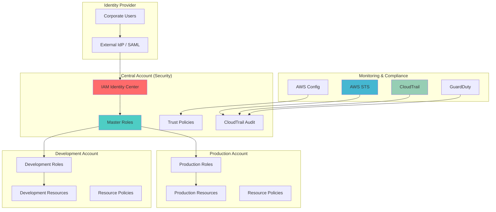

# Cross-Account IAM Role Federation

## Problem

Large enterprises operating multiple AWS accounts face complex identity management challenges when implementing secure cross-account access without compromising least privilege principles. Traditional approaches using IAM users with long-term credentials create security risks, operational overhead, and compliance difficulties while integrating with external identity providers.

## Solution

This solution implements a comprehensive cross-account IAM role federation architecture using IAM Identity Center, advanced role chaining, and conditional access policies to enable secure, scalable, and auditable cross-account access. The architecture leverages federated identities, external ID validation, and session tagging to establish zero-trust access across account boundaries with comprehensive audit trails.

## Architecture Diagram



## Prerequisites

1. AWS Organizations set up with multiple accounts (minimum 3: security, production, development)
2. AWS CLI v2 installed and configured with administrative permissions
3. IAM Identity Center configured with external identity provider
4. Understanding of IAM roles, trust policies, and cross-account access patterns
5. Knowledge of SAML federation and identity provider integration
6. Estimated cost: $50-150/month for logging, Config rules, and identity center usage

> **Note**: This recipe requires multiple AWS accounts. Use sandbox/test accounts for learning purposes.

## Preparation

```bash
# Set environment variables
export AWS_REGION=$(aws configure get region)
export AWS_ACCOUNT_ID=$(aws sts get-caller-identity \
    --query Account --output text)

# Set example account IDs (replace with your actual account IDs)
export SECURITY_ACCOUNT_ID="111111111111"  # Replace with your security account ID
export PROD_ACCOUNT_ID="222222222222"      # Replace with your production account ID
export DEV_ACCOUNT_ID="333333333333"       # Replace with your development account ID

# Generate unique identifier for resources
export RANDOM_SUFFIX=$(aws secretsmanager get-random-password \
    --exclude-punctuation --exclude-uppercase \
    --password-length 6 --require-each-included-type \
    --output text --query RandomPassword)

# Generate external IDs for enhanced security
export PROD_EXTERNAL_ID=$(aws secretsmanager get-random-password \
    --exclude-punctuation --exclude-uppercase \
    --password-length 16 --require-each-included-type \
    --output text --query RandomPassword)
export DEV_EXTERNAL_ID=$(aws secretsmanager get-random-password \
    --exclude-punctuation --exclude-uppercase \
    --password-length 16 --require-each-included-type \
    --output text --query RandomPassword)

# Store external IDs securely (in real implementation, use Secrets Manager)
echo "Production External ID: $PROD_EXTERNAL_ID"
echo "Development External ID: $DEV_EXTERNAL_ID"

# Verify account access and current account
aws sts get-caller-identity

echo "✅ AWS environment configured"
```

## Steps

1. **Create Master Cross-Account Role in Security Account**:

   The master role serves as the central hub for cross-account access, implementing the hub-and-spoke security pattern that AWS recommends for enterprise environments. This role acts as an intermediary that validates federated users and provides controlled access to target account roles. By centralizing this function, organizations can implement consistent security policies and maintain a single point of audit for cross-account activities. Learn more about this pattern in the [AWS IAM cross-account tutorial](https://docs.aws.amazon.com/IAM/latest/UserGuide/tutorial_cross-account-with-roles.html).

   ```bash
   # Create trust policy for the master role
   cat > master-cross-account-trust-policy.json << EOF
   {
     "Version": "2012-10-17",
     "Statement": [
       {
         "Effect": "Allow",
         "Principal": {
           "Federated": "arn:aws:iam::${SECURITY_ACCOUNT_ID}:saml-provider/CorporateIdP"
         },
         "Action": "sts:AssumeRoleWithSAML",
         "Condition": {
           "StringEquals": {
             "SAML:aud": "https://signin.aws.amazon.com/saml"
           },
           "ForAllValues:StringLike": {
             "SAML:department": ["Engineering", "Security", "DevOps"]
           }
         }
       },
       {
         "Effect": "Allow",
         "Principal": {
           "AWS": "arn:aws:iam::${SECURITY_ACCOUNT_ID}:root"
         },
         "Action": "sts:AssumeRole",
         "Condition": {
           "Bool": {
             "aws:MultiFactorAuthPresent": "true"
           },
           "NumericLessThan": {
             "aws:MultiFactorAuthAge": "3600"
           }
         }
       }
     ]
   }
   EOF
   
   # Create permissions policy for cross-account role assumption
   cat > master-cross-account-permissions.json << EOF
   {
     "Version": "2012-10-17",
     "Statement": [
       {
         "Effect": "Allow",
         "Action": [
           "sts:AssumeRole",
           "sts:TagSession"
         ],
         "Resource": [
           "arn:aws:iam::${PROD_ACCOUNT_ID}:role/CrossAccount-*",
           "arn:aws:iam::${DEV_ACCOUNT_ID}:role/CrossAccount-*"
         ],
         "Condition": {
           "StringEquals": {
             "sts:ExternalId": ["${PROD_EXTERNAL_ID}", "${DEV_EXTERNAL_ID}"]
           }
         }
       },
       {
         "Effect": "Allow",
         "Action": [
           "iam:ListRoles",
           "iam:GetRole",
           "sts:GetCallerIdentity"
         ],
         "Resource": "*"
       }
     ]
   }
   EOF
   
   # Create the master cross-account role
   aws iam create-role \
       --role-name "MasterCrossAccountRole-${RANDOM_SUFFIX}" \
       --assume-role-policy-document file://master-cross-account-trust-policy.json \
       --description "Master role for federated cross-account access" \
       --max-session-duration 7200
   
   # Attach permissions policy
   aws iam put-role-policy \
       --role-name "MasterCrossAccountRole-${RANDOM_SUFFIX}" \
       --policy-name "CrossAccountAssumePolicy" \
       --policy-document file://master-cross-account-permissions.json
   
   echo "✅ Master cross-account role created"
   ```

   The master role is now established with comprehensive trust policies that support both SAML federation and direct role assumption with MFA requirements. This foundational security layer ensures that all cross-account access flows through controlled, auditable pathways while maintaining the flexibility needed for operational efficiency.

2. **Create Production Account Cross-Account Role**:

   Production environments require the highest security controls due to their business-critical nature and regulatory compliance requirements. This role implements the principle of least privilege by granting only specific permissions needed for production operations while enforcing strict trust boundaries. The external ID mechanism protects against the [confused deputy problem](https://docs.aws.amazon.com/IAM/latest/UserGuide/confused-deputy.html), ensuring that only authorized entities can assume the role even if they have the role ARN.

   ```bash
   # Switch to production account context (configure AWS CLI for prod account)
   # aws configure set profile.prod.account_id $PROD_ACCOUNT_ID
   
   # Create trust policy for production account role
   cat > prod-cross-account-trust-policy.json << EOF
   {
     "Version": "2012-10-17",
     "Statement": [
       {
         "Effect": "Allow",
         "Principal": {
           "AWS": "arn:aws:iam::${SECURITY_ACCOUNT_ID}:role/MasterCrossAccountRole-${RANDOM_SUFFIX}"
         },
         "Action": "sts:AssumeRole",
         "Condition": {
           "StringEquals": {
             "sts:ExternalId": "${PROD_EXTERNAL_ID}"
           },
           "Bool": {
             "aws:MultiFactorAuthPresent": "true"
           },
           "StringLike": {
             "aws:userid": "*:${SECURITY_ACCOUNT_ID}:*"
           }
         }
       }
     ]
   }
   EOF
   
   # Create production permissions policy (limited production access)
   cat > prod-cross-account-permissions.json << EOF
   {
     "Version": "2012-10-17",
     "Statement": [
       {
         "Effect": "Allow",
         "Action": [
           "s3:GetObject",
           "s3:PutObject",
           "s3:ListBucket"
         ],
         "Resource": [
           "arn:aws:s3:::prod-shared-data-${RANDOM_SUFFIX}",
           "arn:aws:s3:::prod-shared-data-${RANDOM_SUFFIX}/*"
         ]
       },
       {
         "Effect": "Allow",
         "Action": [
           "logs:CreateLogGroup",
           "logs:CreateLogStream",
           "logs:PutLogEvents",
           "logs:DescribeLogGroups",
           "logs:DescribeLogStreams"
         ],
         "Resource": "arn:aws:logs:${AWS_REGION}:${PROD_ACCOUNT_ID}:*"
       },
       {
         "Effect": "Allow",
         "Action": [
           "cloudwatch:PutMetricData",
           "cloudwatch:GetMetricStatistics",
           "cloudwatch:ListMetrics"
         ],
         "Resource": "*"
       }
     ]
   }
   EOF
   
   # Create production cross-account role (run this in production account)
   aws iam create-role \
       --role-name "CrossAccount-ProductionAccess-${RANDOM_SUFFIX}" \
       --assume-role-policy-document file://prod-cross-account-trust-policy.json \
       --description "Cross-account role for production resource access" \
       --max-session-duration 3600 \
       --tags Key=Environment,Value=Production Key=Purpose,Value=CrossAccount
   
   # Attach permissions policy
   aws iam put-role-policy \
       --role-name "CrossAccount-ProductionAccess-${RANDOM_SUFFIX}" \
       --policy-name "ProductionResourceAccess" \
       --policy-document file://prod-cross-account-permissions.json
   
   echo "✅ Production cross-account role created"
   ```

   The production role is now configured with restrictive permissions that align with production environment security requirements. The external ID validation and MFA enforcement create multiple security layers that protect critical business resources while maintaining operational access for authorized personnel.

3. **Create Development Account Cross-Account Role**:

   Development environments typically require broader permissions to support rapid iteration and testing activities, but still need security controls to prevent unauthorized access and maintain compliance. This role balances accessibility with security by providing expanded permissions within the development context while maintaining the same external ID and trust policy protections as production environments.

   ```bash
   # Create trust policy for development account role
   cat > dev-cross-account-trust-policy.json << EOF
   {
     "Version": "2012-10-17",
     "Statement": [
       {
         "Effect": "Allow",
         "Principal": {
           "AWS": "arn:aws:iam::${SECURITY_ACCOUNT_ID}:role/MasterCrossAccountRole-${RANDOM_SUFFIX}"
         },
         "Action": "sts:AssumeRole",
         "Condition": {
           "StringEquals": {
             "sts:ExternalId": "${DEV_EXTERNAL_ID}"
           },
           "StringLike": {
             "aws:userid": "*:${SECURITY_ACCOUNT_ID}:*"
           },
           "IpAddress": {
             "aws:SourceIp": ["203.0.113.0/24", "198.51.100.0/24"]
           }
         }
       }
     ]
   }
   EOF
   
   # Create development permissions policy (broader dev access)
   cat > dev-cross-account-permissions.json << EOF
   {
     "Version": "2012-10-17",
     "Statement": [
       {
         "Effect": "Allow",
         "Action": [
           "s3:*"
         ],
         "Resource": [
           "arn:aws:s3:::dev-shared-data-${RANDOM_SUFFIX}",
           "arn:aws:s3:::dev-shared-data-${RANDOM_SUFFIX}/*"
         ]
       },
       {
         "Effect": "Allow",
         "Action": [
           "ec2:DescribeInstances",
           "ec2:DescribeSecurityGroups",
           "ec2:DescribeVpcs",
           "ec2:DescribeSubnets"
         ],
         "Resource": "*"
       },
       {
         "Effect": "Allow",
         "Action": [
           "lambda:InvokeFunction",
           "lambda:GetFunction",
           "lambda:ListFunctions"
         ],
         "Resource": "arn:aws:lambda:${AWS_REGION}:${DEV_ACCOUNT_ID}:function:dev-*"
       },
       {
         "Effect": "Allow",
         "Action": [
           "logs:*"
         ],
         "Resource": "arn:aws:logs:${AWS_REGION}:${DEV_ACCOUNT_ID}:*"
       }
     ]
   }
   EOF
   
   # Create development cross-account role (run this in development account)
   aws iam create-role \
       --role-name "CrossAccount-DevelopmentAccess-${RANDOM_SUFFIX}" \
       --assume-role-policy-document file://dev-cross-account-trust-policy.json \
       --description "Cross-account role for development resource access" \
       --max-session-duration 7200 \
       --tags Key=Environment,Value=Development Key=Purpose,Value=CrossAccount
   
   # Attach permissions policy
   aws iam put-role-policy \
       --role-name "CrossAccount-DevelopmentAccess-${RANDOM_SUFFIX}" \
       --policy-name "DevelopmentResourceAccess" \
       --policy-document file://dev-cross-account-permissions.json
   
   echo "✅ Development cross-account role created"
   ```

   The development role now provides the expanded access needed for development activities while maintaining security boundaries through external ID validation. The IP address restrictions demonstrate how additional conditional controls can be applied based on organizational security requirements.

4. **Implement Session Tags and Conditional Access**:

   Session tags provide powerful capabilities for implementing fine-grained access control and detailed audit trails across AWS environments. These tags enable attribute-based access control (ABAC) patterns that can dynamically adjust permissions based on user attributes, project assignments, or organizational context. The [AWS session tags documentation](https://docs.aws.amazon.com/IAM/latest/UserGuide/id_session-tags.html) provides comprehensive guidance on implementing these advanced access patterns.

   ```bash
   # Create enhanced permissions policy with session tags
   cat > enhanced-cross-account-permissions.json << EOF
   {
     "Version": "2012-10-17",
     "Statement": [
       {
         "Effect": "Allow",
         "Action": [
           "sts:AssumeRole",
           "sts:TagSession"
         ],
         "Resource": [
           "arn:aws:iam::${PROD_ACCOUNT_ID}:role/CrossAccount-*",
           "arn:aws:iam::${DEV_ACCOUNT_ID}:role/CrossAccount-*"
         ],
         "Condition": {
           "StringEquals": {
             "sts:ExternalId": ["${PROD_EXTERNAL_ID}", "${DEV_EXTERNAL_ID}"],
             "aws:RequestedRegion": "${AWS_REGION}"
           },
           "ForAllValues:StringEquals": {
             "sts:TransitiveTagKeys": ["Department", "Project", "Environment"]
           }
         }
       }
     ]
   }
   EOF
   
   # Update master role with enhanced permissions
   aws iam put-role-policy \
       --role-name "MasterCrossAccountRole-${RANDOM_SUFFIX}" \
       --policy-name "EnhancedCrossAccountAccess" \
       --policy-document file://enhanced-cross-account-permissions.json
   
   # Create script for role assumption with session tags
   cat > assume-cross-account-role.sh << 'EOF'
   #!/bin/bash
   
   TARGET_ACCOUNT=$1
   ROLE_NAME=$2
   EXTERNAL_ID=$3
   SESSION_NAME=$4
   
   if [ $# -ne 4 ]; then
       echo "Usage: $0 <target-account-id> <role-name> <external-id> <session-name>"
       exit 1
   fi
   
   # Assume role with session tags
   ROLE_CREDENTIALS=$(aws sts assume-role \
       --role-arn "arn:aws:iam::${TARGET_ACCOUNT}:role/${ROLE_NAME}" \
       --role-session-name "${SESSION_NAME}" \
       --external-id "${EXTERNAL_ID}" \
       --tags Key=Department,Value=Engineering \
             Key=Project,Value=CrossAccountDemo \
             Key=Environment,Value=Prod \
       --transitive-tag-keys Department,Project,Environment \
       --duration-seconds 3600 \
       --output json)
   
   if [ $? -eq 0 ]; then
       echo "Role assumed successfully. Credentials:"
       echo "$ROLE_CREDENTIALS" | jq -r '.Credentials | "export AWS_ACCESS_KEY_ID=\(.AccessKeyId)\nexport AWS_SECRET_ACCESS_KEY=\(.SecretAccessKey)\nexport AWS_SESSION_TOKEN=\(.SessionToken)"'
   else
       echo "Failed to assume role"
       exit 1
   fi
   EOF
   
   chmod +x assume-cross-account-role.sh
   
   echo "✅ Session tagging and conditional access implemented"
   ```

   Session tagging is now configured to provide granular access control and comprehensive audit capabilities. The transitive tag keys ensure that session attributes flow through the entire assume role chain, enabling consistent policy enforcement and detailed tracking of user activities across account boundaries.

5. **Set Up Cross-Account Audit Trail**:

   Comprehensive audit logging is essential for security monitoring, compliance reporting, and incident investigation in cross-account environments. CloudTrail provides detailed logs of all API activities, including role assumptions, policy evaluations, and resource access patterns. This audit infrastructure enables security teams to detect anomalous behavior, investigate security incidents, and demonstrate compliance with regulatory requirements.

   ```bash
   # Create CloudTrail for cross-account activity monitoring
   cat > cross-account-cloudtrail-policy.json << EOF
   {
     "Version": "2012-10-17",
     "Statement": [
       {
         "Effect": "Allow",
         "Principal": {
           "Service": "cloudtrail.amazonaws.com"
         },
         "Action": [
           "s3:PutObject",
           "s3:GetBucketAcl"
         ],
         "Resource": [
           "arn:aws:s3:::cross-account-audit-trail-${RANDOM_SUFFIX}",
           "arn:aws:s3:::cross-account-audit-trail-${RANDOM_SUFFIX}/*"
         ]
       }
     ]
   }
   EOF
   
   # Create S3 bucket for CloudTrail logs
   aws s3 mb s3://cross-account-audit-trail-${RANDOM_SUFFIX} \
       --region ${AWS_REGION}
   
   # Apply bucket policy
   aws s3api put-bucket-policy \
       --bucket "cross-account-audit-trail-${RANDOM_SUFFIX}" \
       --policy file://cross-account-cloudtrail-policy.json
   
   # Create CloudTrail
   aws cloudtrail create-trail \
       --name "CrossAccountAuditTrail-${RANDOM_SUFFIX}" \
       --s3-bucket-name "cross-account-audit-trail-${RANDOM_SUFFIX}" \
       --include-global-service-events \
       --is-multi-region-trail \
       --enable-log-file-validation
   
   # Configure event selectors for cross-account role monitoring
   aws cloudtrail put-event-selectors \
       --trail-name "CrossAccountAuditTrail-${RANDOM_SUFFIX}" \
       --event-selectors '[
         {
           "ReadWriteType": "All",
           "IncludeManagementEvents": true,
           "DataResources": [
             {
               "Type": "AWS::IAM::Role",
               "Values": ["arn:aws:iam::*:role/CrossAccount-*"]
             }
           ]
         }
       ]'
   
   # Start logging
   aws cloudtrail start-logging \
       --name "CrossAccountAuditTrail-${RANDOM_SUFFIX}"
   
   echo "✅ Cross-account audit trail configured"
   ```

   The audit trail now captures all cross-account activities with detailed event logging and tamper-evident log file validation. This security monitoring foundation enables continuous compliance monitoring and provides the forensic capabilities needed for security incident investigation.

6. **Implement Automated Role Validation**:

   Automated validation ensures that cross-account role configurations remain compliant with organizational security policies as environments evolve. This Lambda-based validation system implements continuous compliance monitoring by checking role trust policies, external ID requirements, and MFA enforcement. The automation reduces manual oversight burden while maintaining consistent security posture across all accounts.

   ```bash
   # Create Lambda function for role validation
   cat > role-validator.py << 'EOF'
   import json
   import boto3
   import logging
   
   logger = logging.getLogger()
   logger.setLevel(logging.INFO)
   
   iam = boto3.client('iam')
   config = boto3.client('config')
   
   def lambda_handler(event, context):
       """
       Validate cross-account role configurations and trust policies
       """
       try:
           # Get all cross-account roles
           paginator = iam.get_paginator('list_roles')
           
           validation_results = []
           
           for page in paginator.paginate():
               for role in page['Roles']:
                   if 'CrossAccount-' in role['RoleName']:
                       validation_result = validate_role(role)
                       validation_results.append(validation_result)
           
           # Report findings to Config
           for result in validation_results:
               if not result['compliant']:
                   logger.warning(f"Non-compliant role found: {result}")
           
           return {
               'statusCode': 200,
               'body': json.dumps({
                   'validated_roles': len(validation_results),
                   'compliant_roles': sum(1 for r in validation_results if r['compliant'])
               })
           }
           
       except Exception as e:
           logger.error(f"Error validating roles: {str(e)}")
           return {
               'statusCode': 500,
               'body': json.dumps({'error': str(e)})
           }
   
   def validate_role(role):
       """
       Validate individual role configuration
       """
       role_name = role['RoleName']
       
       try:
           # Get role details
           role_details = iam.get_role(RoleName=role_name)
           assume_role_policy = role_details['Role']['AssumeRolePolicyDocument']
           
           validation_checks = {
               'has_external_id': check_external_id(assume_role_policy),
               'has_mfa_condition': check_mfa_condition(assume_role_policy),
               'has_ip_restriction': check_ip_restriction(assume_role_policy),
               'max_session_duration_ok': role['MaxSessionDuration'] <= 7200
           }
           
           compliant = all(validation_checks.values())
           
           return {
               'role_name': role_name,
               'compliant': compliant,
               'checks': validation_checks
           }
           
       except Exception as e:
           logger.error(f"Error validating role {role_name}: {str(e)}")
           return {
               'role_name': role_name,
               'compliant': False,
               'error': str(e)
           }
   
   def check_external_id(policy):
       """Check if policy requires ExternalId"""
       for statement in policy.get('Statement', []):
           conditions = statement.get('Condition', {})
           if 'StringEquals' in conditions and 'sts:ExternalId' in conditions['StringEquals']:
               return True
       return False
   
   def check_mfa_condition(policy):
       """Check if policy requires MFA"""
       for statement in policy.get('Statement', []):
           conditions = statement.get('Condition', {})
           if 'Bool' in conditions and 'aws:MultiFactorAuthPresent' in conditions['Bool']:
               return True
       return False
   
   def check_ip_restriction(policy):
       """Check if policy has IP restrictions"""
       for statement in policy.get('Statement', []):
           conditions = statement.get('Condition', {})
           if 'IpAddress' in conditions or 'IpAddressIfExists' in conditions:
               return True
       return True  # Not mandatory for all environments
   EOF
   
   # Create Lambda deployment package
   zip role-validator.zip role-validator.py
   
   # Create Lambda execution role
   cat > lambda-execution-trust-policy.json << EOF
   {
     "Version": "2012-10-17",
     "Statement": [
       {
         "Effect": "Allow",
         "Principal": {
           "Service": "lambda.amazonaws.com"
         },
         "Action": "sts:AssumeRole"
       }
     ]
   }
   EOF
   
   aws iam create-role \
       --role-name "RoleValidatorLambdaRole-${RANDOM_SUFFIX}" \
       --assume-role-policy-document file://lambda-execution-trust-policy.json
   
   # Wait for role propagation
   sleep 10
   
   # Attach necessary policies
   aws iam attach-role-policy \
       --role-name "RoleValidatorLambdaRole-${RANDOM_SUFFIX}" \
       --policy-arn "arn:aws:iam::aws:policy/service-role/AWSLambdaBasicExecutionRole"
   
   aws iam attach-role-policy \
       --role-name "RoleValidatorLambdaRole-${RANDOM_SUFFIX}" \
       --policy-arn "arn:aws:iam::aws:policy/IAMReadOnlyAccess"
   
   # Create Lambda function
   aws lambda create-function \
       --function-name "CrossAccountRoleValidator-${RANDOM_SUFFIX}" \
       --runtime python3.9 \
       --role "arn:aws:iam::${AWS_ACCOUNT_ID}:role/RoleValidatorLambdaRole-${RANDOM_SUFFIX}" \
       --handler role-validator.lambda_handler \
       --zip-file fileb://role-validator.zip \
       --timeout 300 \
       --memory-size 256
   
   echo "✅ Automated role validation implemented"
   ```

   The automated validation system now provides continuous monitoring of cross-account role configurations, ensuring that security policies remain enforced even as infrastructure changes. This proactive approach to security compliance reduces the risk of configuration drift and maintains consistent security posture across the enterprise.

## Validation & Testing

1. **Test Cross-Account Role Assumption**:

   ```bash
   # Test assuming the production role
   PROD_CREDENTIALS=$(aws sts assume-role \
       --role-arn "arn:aws:iam::${PROD_ACCOUNT_ID}:role/CrossAccount-ProductionAccess-${RANDOM_SUFFIX}" \
       --role-session-name "TestSession-$(date +%s)" \
       --external-id "${PROD_EXTERNAL_ID}" \
       --duration-seconds 3600)
   
   if [ $? -eq 0 ]; then
       echo "✅ Production role assumption successful"
       echo "$PROD_CREDENTIALS" | jq -r '.AssumedRoleUser.Arn'
   else
       echo "❌ Production role assumption failed"
   fi
   ```

2. **Verify Session Tags and Conditions**:

   ```bash
   # Test with invalid external ID (should fail)
   aws sts assume-role \
       --role-arn "arn:aws:iam::${PROD_ACCOUNT_ID}:role/CrossAccount-ProductionAccess-${RANDOM_SUFFIX}" \
       --role-session-name "InvalidTest-$(date +%s)" \
       --external-id "invalid-external-id" \
       --duration-seconds 3600 2>&1 | grep -q "AccessDenied"
   
   if [ $? -eq 0 ]; then
       echo "✅ External ID validation working correctly"
   else
       echo "❌ External ID validation failed"
   fi
   ```

3. **Test Role Validation Function**:

   ```bash
   # Invoke the role validator Lambda
   aws lambda invoke \
       --function-name "CrossAccountRoleValidator-${RANDOM_SUFFIX}" \
       --payload '{}' \
       response.json
   
   echo "Role validation results:"
   cat response.json | jq '.'
   ```

4. **Verify Audit Logging**:

   ```bash
   # Check CloudTrail status
   aws cloudtrail get-trail-status \
       --name "CrossAccountAuditTrail-${RANDOM_SUFFIX}"
   
   echo "✅ CloudTrail logging verified"
   ```

## Cleanup

1. **Remove Lambda Functions and Roles**:

   ```bash
   # Delete Lambda function
   aws lambda delete-function \
       --function-name "CrossAccountRoleValidator-${RANDOM_SUFFIX}"
   
   # Delete Lambda execution role
   aws iam detach-role-policy \
       --role-name "RoleValidatorLambdaRole-${RANDOM_SUFFIX}" \
       --policy-arn "arn:aws:iam::aws:policy/service-role/AWSLambdaBasicExecutionRole"
   
   aws iam detach-role-policy \
       --role-name "RoleValidatorLambdaRole-${RANDOM_SUFFIX}" \
       --policy-arn "arn:aws:iam::aws:policy/IAMReadOnlyAccess"
   
   aws iam delete-role \
       --role-name "RoleValidatorLambdaRole-${RANDOM_SUFFIX}"
   
   echo "✅ Lambda resources cleaned up"
   ```

2. **Remove CloudTrail and S3 Bucket**:

   ```bash
   # Stop logging and delete trail
   aws cloudtrail stop-logging \
       --name "CrossAccountAuditTrail-${RANDOM_SUFFIX}"
   
   aws cloudtrail delete-trail \
       --name "CrossAccountAuditTrail-${RANDOM_SUFFIX}"
   
   # Empty and delete S3 bucket
   aws s3 rm s3://cross-account-audit-trail-${RANDOM_SUFFIX} \
       --recursive
   
   aws s3 rb s3://cross-account-audit-trail-${RANDOM_SUFFIX}
   
   echo "✅ Audit trail resources cleaned up"
   ```

3. **Remove Cross-Account Roles**:

   ```bash
   # Delete production account role policies and role
   aws iam delete-role-policy \
       --role-name "CrossAccount-ProductionAccess-${RANDOM_SUFFIX}" \
       --policy-name "ProductionResourceAccess"
   
   aws iam delete-role \
       --role-name "CrossAccount-ProductionAccess-${RANDOM_SUFFIX}"
   
   # Delete development account role policies and role
   aws iam delete-role-policy \
       --role-name "CrossAccount-DevelopmentAccess-${RANDOM_SUFFIX}" \
       --policy-name "DevelopmentResourceAccess"
   
   aws iam delete-role \
       --role-name "CrossAccount-DevelopmentAccess-${RANDOM_SUFFIX}"
   
   # Delete master role policies and role
   aws iam delete-role-policy \
       --role-name "MasterCrossAccountRole-${RANDOM_SUFFIX}" \
       --policy-name "CrossAccountAssumePolicy"
   
   aws iam delete-role-policy \
       --role-name "MasterCrossAccountRole-${RANDOM_SUFFIX}" \
       --policy-name "EnhancedCrossAccountAccess"
   
   aws iam delete-role \
       --role-name "MasterCrossAccountRole-${RANDOM_SUFFIX}"
   
   echo "✅ All IAM roles cleaned up"
   ```

4. **Clean Up Local Files**:

   ```bash
   # Remove generated files
   rm -f master-cross-account-trust-policy.json
   rm -f master-cross-account-permissions.json
   rm -f prod-cross-account-trust-policy.json
   rm -f prod-cross-account-permissions.json
   rm -f dev-cross-account-trust-policy.json
   rm -f dev-cross-account-permissions.json
   rm -f enhanced-cross-account-permissions.json
   rm -f cross-account-cloudtrail-policy.json
   rm -f lambda-execution-trust-policy.json
   rm -f role-validator.py
   rm -f role-validator.zip
   rm -f assume-cross-account-role.sh
   rm -f response.json
   
   echo "✅ Local files cleaned up"
   ```

## Discussion

This advanced cross-account IAM federation pattern demonstrates several critical security concepts that address enterprise-scale challenges. The solution implements defense-in-depth through multiple layers of validation including external IDs, MFA requirements, session duration limits, and IP restrictions. The use of session tags provides granular access control and audit capabilities, allowing organizations to track resource usage across account boundaries with detailed attribution.

The architecture separates concerns by centralizing identity management in a security account while distributing authorization to individual accounts. This pattern reduces the blast radius of potential security incidents while maintaining operational flexibility. The conditional access policies ensure that access is granted only under specific circumstances, implementing true zero-trust principles where every access request is verified regardless of the requesting principal's location within the organization. Additional guidance on [cross-account resource access patterns](https://docs.aws.amazon.com/IAM/latest/UserGuide/access_policies-cross-account-resource-access.html) provides deeper implementation insights.

The automated validation component demonstrates how to implement continuous compliance monitoring for IAM configurations. By using Lambda functions triggered by CloudWatch Events or Config rules, organizations can detect configuration drift and policy violations in real-time. This approach is essential for maintaining security posture in dynamic environments where infrastructure changes frequently. The [AWS CLI role switching documentation](https://docs.aws.amazon.com/IAM/latest/UserGuide/id_roles_use_switch-role-cli.html) provides additional operational guidance for managing these complex access patterns.

> **Warning**: External IDs and session tags must be carefully managed and rotated regularly. Store external IDs in AWS Secrets Manager rather than environment variables in production environments to maintain security best practices.

## Challenge

Extend this solution by implementing these advanced security enhancements:

1. **Implement automated external ID rotation** using AWS Secrets Manager and Lambda functions that update trust policies across accounts automatically
2. **Add AWS Config rules** that monitor cross-account role configurations and automatically remediate non-compliant policies using Systems Manager automation documents  
3. **Create a centralized dashboard** using QuickSight or CloudWatch to visualize cross-account access patterns and detect anomalous usage
4. **Implement just-in-time (JIT) access** using AWS Systems Manager Session Manager and temporary role elevation with approval workflows
5. **Add integration with external SIEM tools** to correlate cross-account access events with other security telemetry for advanced threat detection

## Infrastructure Code

*Infrastructure code will be generated after recipe approval.*