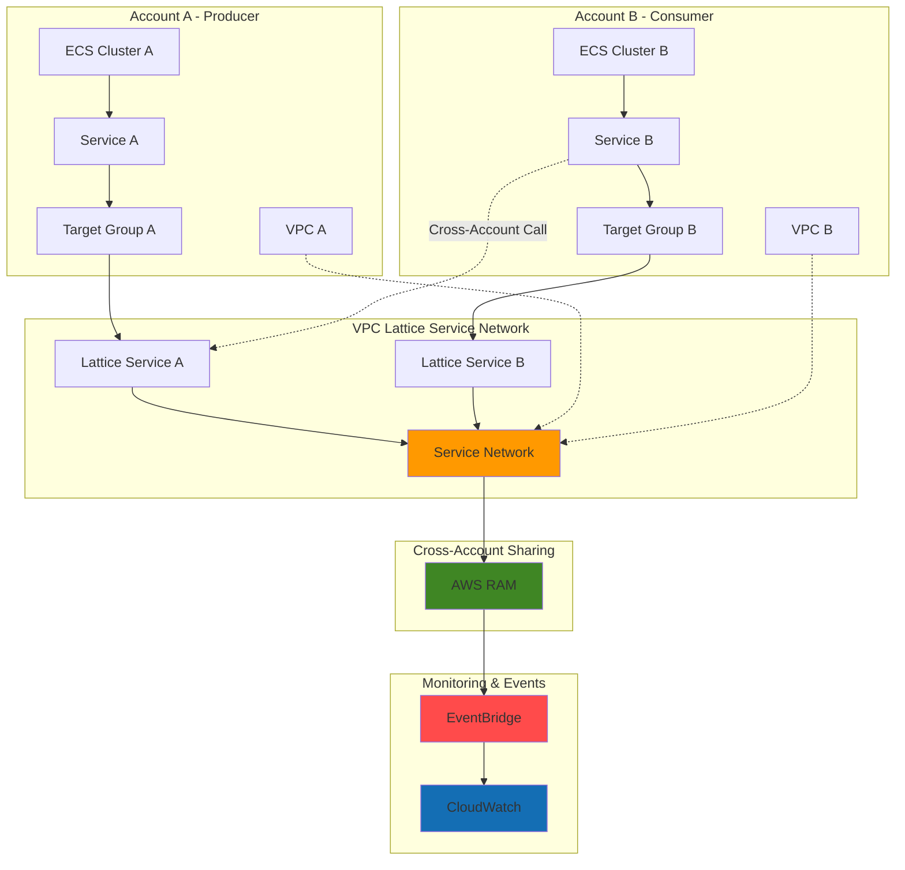

# Cross-Account Service Discovery with VPC Lattice and ECS

## Problem

Organizations deploying microservices across multiple AWS accounts struggle with complex network configuration, security boundaries, and service discovery challenges. Traditional approaches require intricate VPC peering, Transit Gateway configurations, and custom service discovery mechanisms that are difficult to maintain, scale, and secure. Teams spend significant time managing networking infrastructure instead of focusing on application development, while security teams worry about exposing services across account boundaries without proper access controls.

## Solution

Amazon VPC Lattice provides a managed application networking service that simplifies cross-account service discovery and connectivity for ECS-based microservices. By creating service networks that span multiple accounts, services can automatically discover and communicate securely without complex network configuration. EventBridge captures service discovery events for monitoring and automation, while CloudWatch provides comprehensive observability across the distributed architecture.

## Architecture Diagram



## Prerequisites

1. Two AWS accounts with administrative access for cross-account configuration
2. AWS CLI v2 installed and configured for both accounts
3. Understanding of containerized applications and microservices architecture
4. Basic knowledge of AWS networking concepts (VPC, subnets, security groups)
5. Estimated cost: $20-30 for 45 minutes of testing (ECS tasks, VPC Lattice data processing)

> **Note**: This recipe requires access to two AWS accounts. If you only have one account, you can adapt the steps to work within a single account across different VPCs.

## Preparation

```bash
# Set environment variables for Account A (Producer)
export AWS_REGION=$(aws configure get region)
export ACCOUNT_A_ID=$(aws sts get-caller-identity \
    --query Account --output text)

# Generate unique identifiers for resources
RANDOM_SUFFIX=$(aws secretsmanager get-random-password \
    --exclude-punctuation --exclude-uppercase \
    --password-length 6 --require-each-included-type \
    --output text --query RandomPassword)

# Set resource names
export CLUSTER_NAME_A="producer-cluster-${RANDOM_SUFFIX}"
export SERVICE_NAME_A="producer-service-${RANDOM_SUFFIX}"
export LATTICE_SERVICE_A="lattice-producer-${RANDOM_SUFFIX}"
export SERVICE_NETWORK_NAME="cross-account-network-${RANDOM_SUFFIX}"

# Store account B ID (replace with your second account ID)
export ACCOUNT_B_ID="123456789012"

# Create CloudWatch log group for ECS tasks
aws logs create-log-group \
    --log-group-name "/ecs/producer" \
    --retention-in-days 7

echo "✅ Environment configured for Account A"
echo "Account A ID: ${ACCOUNT_A_ID}"
echo "Service Network: ${SERVICE_NETWORK_NAME}"
```

## Steps

1. **Create VPC Lattice Service Network in Account A**:

   VPC Lattice service networks act as logical boundaries that enable secure cross-account service discovery and communication. The service network will be the central point where services from multiple accounts can be registered and discovered, eliminating the need for complex networking configuration while maintaining security through IAM-based access controls.

   ```bash
   # Create VPC Lattice service network
   SERVICE_NETWORK_ARN=$(aws vpc-lattice create-service-network \
       --name ${SERVICE_NETWORK_NAME} \
       --auth-type "AWS_IAM" \
       --query 'arn' --output text)
   
   # Get service network ID for future reference
   SERVICE_NETWORK_ID=$(echo ${SERVICE_NETWORK_ARN} | \
       cut -d'/' -f2)
   
   echo "✅ Service network created: ${SERVICE_NETWORK_ID}"
   ```

   The service network is now established with IAM-based authentication, providing a secure foundation for cross-account service discovery. This centralized approach enables fine-grained access control while simplifying the networking complexity typically associated with multi-account architectures.

2. **Create ECS Cluster and Task Definition in Account A**:

   Amazon ECS will host our producer service that will be discoverable across accounts. The ECS service integrates directly with VPC Lattice through target groups, enabling automatic registration and health checking of containerized applications without requiring additional service discovery infrastructure.

   ```bash
   # Create ECS cluster
   aws ecs create-cluster \
       --cluster-name ${CLUSTER_NAME_A} \
       --capacity-providers FARGATE \
       --default-capacity-provider-strategy \
       capacityProvider=FARGATE,weight=1
   
   # Create task definition for producer service
   cat > producer-task-def.json << EOF
   {
       "family": "producer-task",
       "networkMode": "awsvpc",
       "requiresCompatibilities": ["FARGATE"],
       "cpu": "256",
       "memory": "512",
       "executionRoleArn": "arn:aws:iam::${ACCOUNT_A_ID}:role/ecsTaskExecutionRole",
       "containerDefinitions": [
           {
               "name": "producer-container",
               "image": "nginx:latest",
               "portMappings": [
                   {
                       "containerPort": 80,
                       "protocol": "tcp"
                   }
               ],
               "essential": true,
               "logConfiguration": {
                   "logDriver": "awslogs",
                   "options": {
                       "awslogs-group": "/ecs/producer",
                       "awslogs-region": "${AWS_REGION}",
                       "awslogs-stream-prefix": "ecs"
                   }
               }
           }
       ]
   }
   EOF
   
   # Register task definition
   aws ecs register-task-definition \
       --cli-input-json file://producer-task-def.json
   
   echo "✅ ECS cluster and task definition created"
   ```

   The ECS infrastructure is now ready to run containerized services with Fargate providing serverless container execution. The task definition includes CloudWatch logging integration for comprehensive observability across the distributed system.

3. **Create VPC Lattice Target Group and Service in Account A**:

   VPC Lattice target groups enable ECS tasks to be automatically registered as service endpoints. The target group handles health checking and load distribution while the VPC Lattice service provides the discoverable endpoint that can be shared across accounts through AWS Resource Access Manager.

   ```bash
   # Get default VPC ID
   VPC_ID=$(aws ec2 describe-vpcs \
       --filters "Name=is-default,Values=true" \
       --query 'Vpcs[0].VpcId' --output text)
   
   # Create VPC Lattice target group for ECS service
   TARGET_GROUP_ARN=$(aws vpc-lattice create-target-group \
       --name "producer-targets-${RANDOM_SUFFIX}" \
       --type "IP" \
       --protocol "HTTP" \
       --port 80 \
       --vpc-identifier ${VPC_ID} \
       --health-check-config \
       enabled=true,protocol=HTTP,path="/",\
timeoutSeconds=5,intervalSeconds=30,\
healthyThresholdCount=2,unhealthyThresholdCount=3 \
       --query 'arn' --output text)
   
   # Create VPC Lattice service
   LATTICE_SERVICE_ARN=$(aws vpc-lattice create-service \
       --name ${LATTICE_SERVICE_A} \
       --auth-type "AWS_IAM" \
       --query 'arn' --output text)
   
   # Create listener for the service
   LISTENER_ARN=$(aws vpc-lattice create-listener \
       --service-identifier ${LATTICE_SERVICE_ARN} \
       --name "http-listener" \
       --protocol "HTTP" \
       --port 80 \
       --default-action "{\"forward\":{\"targetGroups\":[{\"targetGroupIdentifier\":\"${TARGET_GROUP_ARN}\"}]}}" \
       --query 'arn' --output text)
   
   echo "✅ VPC Lattice target group and service created"
   ```

   The VPC Lattice service is now configured with health checking and load balancing capabilities. The HTTP listener ensures that incoming requests are properly routed to healthy ECS tasks, providing a resilient service endpoint for cross-account communication.

4. **Associate VPC Lattice Service with Service Network**:

   Associating the VPC Lattice service with the service network makes it discoverable by other services within the network. This association enables the service to participate in cross-account service discovery while maintaining security boundaries through IAM policies and network access controls.

   ```bash
   # Associate service with service network
   aws vpc-lattice create-service-network-service-association \
       --service-network-identifier ${SERVICE_NETWORK_ARN} \
       --service-identifier ${LATTICE_SERVICE_ARN}
   
   # Associate VPC with service network
   aws vpc-lattice create-service-network-vpc-association \
       --service-network-identifier ${SERVICE_NETWORK_ARN} \
       --vpc-identifier ${VPC_ID}
   
   echo "✅ Service and VPC associated with service network"
   ```

   The service is now registered within the service network and accessible to other associated VPCs and services. This association enables seamless cross-account communication without requiring complex networking configuration or VPC peering relationships.

5. **Create ECS Service with VPC Lattice Integration**:

   The ECS service configuration includes VPC Lattice integration that automatically registers and deregisters tasks with the target group as they start and stop. This integration ensures that only healthy tasks receive traffic while providing automatic scaling capabilities based on demand.

   ```bash
   # Get subnet IDs for service deployment
   SUBNET_IDS=$(aws ec2 describe-subnets \
       --filters "Name=vpc-id,Values=${VPC_ID}" \
       --query 'Subnets[?MapPublicIpOnLaunch==`true`].SubnetId' \
       --output text | tr '\t' ',')
   
   # Create ECS service with VPC Lattice configuration
   aws ecs create-service \
       --cluster ${CLUSTER_NAME_A} \
       --service-name ${SERVICE_NAME_A} \
       --task-definition producer-task \
       --desired-count 2 \
       --launch-type FARGATE \
       --network-configuration "awsvpcConfiguration={subnets=[${SUBNET_IDS}],assignPublicIp=ENABLED}" \
       --load-balancers "targetGroupArn=${TARGET_GROUP_ARN},containerName=producer-container,containerPort=80"
   
   # Wait for service to stabilize
   aws ecs wait services-stable \
       --cluster ${CLUSTER_NAME_A} \
       --services ${SERVICE_NAME_A}
   
   echo "✅ ECS service created with VPC Lattice integration"
   ```

   The ECS service is now running with automatic VPC Lattice integration through the target group. Tasks are automatically registered with the target group, enabling load balancing and health checking while providing a discoverable service endpoint for cross-account communication.

6. **Share Service Network Using AWS RAM**:

   AWS Resource Access Manager enables secure sharing of VPC Lattice service networks across AWS accounts. This sharing mechanism maintains security boundaries while allowing authorized accounts to discover and access services within the shared network.

   ```bash
   # Create AWS RAM resource share
   RESOURCE_SHARE_ARN=$(aws ram create-resource-share \
       --name "lattice-network-share-${RANDOM_SUFFIX}" \
       --resource-arns ${SERVICE_NETWORK_ARN} \
       --principals ${ACCOUNT_B_ID} \
       --allow-external-principals \
       --query 'resourceShare.resourceShareArn' --output text)
   
   echo "✅ Service network shared with Account B"
   echo "Resource Share ARN: ${RESOURCE_SHARE_ARN}"
   ```

   The service network is now shared with Account B, enabling services in that account to discover and communicate with services in Account A. The sharing maintains security through IAM-based access controls while simplifying cross-account networking.

7. **Set Up EventBridge Rules for Service Discovery Events**:

   EventBridge captures VPC Lattice service discovery events, enabling monitoring and automation based on service registration, deregistration, and health status changes. This event-driven approach provides real-time visibility into the distributed service architecture.

   ```bash
   # Create CloudWatch log group for events
   aws logs create-log-group \
       --log-group-name "/aws/events/vpc-lattice" \
       --retention-in-days 7
   
   # Create IAM role for EventBridge to write to CloudWatch Logs
   cat > eventbridge-role-policy.json << EOF
   {
       "Version": "2012-10-17",
       "Statement": [
           {
               "Effect": "Allow",
               "Principal": {
                   "Service": "events.amazonaws.com"
               },
               "Action": "sts:AssumeRole"
           }
       ]
   }
   EOF
   
   cat > eventbridge-logs-policy.json << EOF
   {
       "Version": "2012-10-17",
       "Statement": [
           {
               "Effect": "Allow",
               "Action": [
                   "logs:CreateLogStream",
                   "logs:PutLogEvents"
               ],
               "Resource": "arn:aws:logs:${AWS_REGION}:${ACCOUNT_A_ID}:log-group:/aws/events/vpc-lattice:*"
           }
       ]
   }
   EOF
   
   # Create role for EventBridge
   aws iam create-role \
       --role-name EventBridgeLogsRole \
       --assume-role-policy-document file://eventbridge-role-policy.json
   
   aws iam put-role-policy \
       --role-name EventBridgeLogsRole \
       --policy-name EventBridgeLogsPolicy \
       --policy-document file://eventbridge-logs-policy.json
   
   # Create EventBridge rule for VPC Lattice events
   aws events put-rule \
       --name "vpc-lattice-events" \
       --event-pattern "{\"source\":[\"aws.vpc-lattice\"],\"detail-type\":[\"VPC Lattice Service Network State Change\",\"VPC Lattice Service State Change\"]}" \
       --state ENABLED
   
   # Add CloudWatch Logs target
   aws events put-targets \
       --rule "vpc-lattice-events" \
       --targets "Id"="1","Arn"="arn:aws:logs:${AWS_REGION}:${ACCOUNT_A_ID}:log-group:/aws/events/vpc-lattice","RoleArn"="arn:aws:iam::${ACCOUNT_A_ID}:role/EventBridgeLogsRole"
   
   echo "✅ EventBridge rules configured for VPC Lattice events"
   ```

   EventBridge is now monitoring VPC Lattice events and logging them to CloudWatch with proper IAM permissions. This provides comprehensive visibility into service discovery events, enabling proactive monitoring and automated responses to changes in the service architecture.

8. **Configure CloudWatch Dashboard for Cross-Account Monitoring**:

   CloudWatch dashboards provide centralized monitoring across the distributed architecture, enabling teams to observe service health, performance metrics, and discovery events from a single pane of glass. This observability is crucial for maintaining reliable cross-account service communication.

   ```bash
   # Create CloudWatch dashboard
   cat > dashboard-config.json << EOF
   {
       "widgets": [
           {
               "type": "metric",
               "x": 0,
               "y": 0,
               "width": 12,
               "height": 6,
               "properties": {
                   "metrics": [
                       ["AWS/VpcLattice", "ActiveConnectionCount", "ServiceName", "${LATTICE_SERVICE_A}"],
                       [".", "NewConnectionCount", ".", "."],
                       [".", "ProcessedBytes", ".", "."]
                   ],
                   "period": 300,
                   "stat": "Sum",
                   "region": "${AWS_REGION}",
                   "title": "VPC Lattice Service Metrics"
               }
           },
           {
               "type": "log",
               "x": 0,
               "y": 6,
               "width": 24,
               "height": 6,
               "properties": {
                   "query": "SOURCE '/aws/events/vpc-lattice'\n| fields @timestamp, source, detail-type, detail\n| sort @timestamp desc\n| limit 100",
                   "region": "${AWS_REGION}",
                   "title": "VPC Lattice Events"
               }
           }
       ]
   }
   EOF
   
   # Create dashboard
   aws cloudwatch put-dashboard \
       --dashboard-name "cross-account-service-discovery" \
       --dashboard-body file://dashboard-config.json
   
   echo "✅ CloudWatch dashboard created for monitoring"
   ```

   The CloudWatch dashboard provides real-time visibility into VPC Lattice service metrics and events. This centralized monitoring enables teams to quickly identify issues, track performance trends, and maintain the health of the cross-account service architecture.

## Validation & Testing

1. **Verify VPC Lattice Service Network Configuration**:

   ```bash
   # Check service network status
   aws vpc-lattice get-service-network \
       --service-network-identifier ${SERVICE_NETWORK_ID}
   
   # List associated services
   aws vpc-lattice list-service-network-service-associations \
       --service-network-identifier ${SERVICE_NETWORK_ID}
   ```

   Expected output: Service network in "ACTIVE" state with associated services listed.

2. **Test ECS Service Health and Registration**:

   ```bash
   # Check ECS service status
   aws ecs describe-services \
       --cluster ${CLUSTER_NAME_A} \
       --services ${SERVICE_NAME_A}
   
   # Verify target group health
   aws vpc-lattice list-targets \
       --target-group-identifier ${TARGET_GROUP_ARN}
   ```

   Expected output: ECS service running with desired task count and healthy targets in VPC Lattice target group.

3. **Validate AWS RAM Resource Sharing**:

   ```bash
   # Check resource share status
   aws ram get-resource-shares \
       --resource-owner SELF \
       --name "lattice-network-share-${RANDOM_SUFFIX}"
   
   # Verify associated resources
   aws ram get-resource-share-associations \
       --association-type RESOURCE \
       --resource-share-arns ${RESOURCE_SHARE_ARN}
   ```

   Expected output: Resource share in "ACTIVE" state with service network associated and shared with Account B.

4. **Test Service Discovery Events in EventBridge**:

   ```bash
   # Check EventBridge rule
   aws events describe-rule --name "vpc-lattice-events"
   
   # Query CloudWatch logs for recent events
   aws logs filter-log-events \
       --log-group-name "/aws/events/vpc-lattice" \
       --start-time $(date -d '5 minutes ago' +%s)000
   ```

   Expected output: EventBridge rule enabled and CloudWatch logs showing VPC Lattice service events.

## Cleanup

1. **Remove ECS Service and Cluster**:

   ```bash
   # Delete ECS service
   aws ecs update-service \
       --cluster ${CLUSTER_NAME_A} \
       --service ${SERVICE_NAME_A} \
       --desired-count 0
   
   aws ecs wait services-stable \
       --cluster ${CLUSTER_NAME_A} \
       --services ${SERVICE_NAME_A}
   
   aws ecs delete-service \
       --cluster ${CLUSTER_NAME_A} \
       --service ${SERVICE_NAME_A}
   
   # Delete ECS cluster
   aws ecs delete-cluster --cluster ${CLUSTER_NAME_A}
   
   echo "✅ ECS resources deleted"
   ```

2. **Remove VPC Lattice Resources**:

   ```bash
   # Delete service network associations
   aws vpc-lattice delete-service-network-vpc-association \
       --service-network-vpc-association-identifier \
       $(aws vpc-lattice list-service-network-vpc-associations \
           --service-network-identifier ${SERVICE_NETWORK_ID} \
           --query 'items[0].id' --output text)
   
   aws vpc-lattice delete-service-network-service-association \
       --service-network-service-association-identifier \
       $(aws vpc-lattice list-service-network-service-associations \
           --service-network-identifier ${SERVICE_NETWORK_ID} \
           --query 'items[0].id' --output text)
   
   # Delete VPC Lattice service and target group
   aws vpc-lattice delete-listener \
       --listener-identifier ${LISTENER_ARN}
   
   aws vpc-lattice delete-service \
       --service-identifier ${LATTICE_SERVICE_ARN}
   
   aws vpc-lattice delete-target-group \
       --target-group-identifier ${TARGET_GROUP_ARN}
   
   # Delete service network
   aws vpc-lattice delete-service-network \
       --service-network-identifier ${SERVICE_NETWORK_ID}
   
   echo "✅ VPC Lattice resources deleted"
   ```

3. **Clean Up Monitoring and Sharing Resources**:

   ```bash
   # Delete AWS RAM resource share
   aws ram delete-resource-share \
       --resource-share-arn ${RESOURCE_SHARE_ARN}
   
   # Remove EventBridge rule
   aws events remove-targets \
       --rule "vpc-lattice-events" \
       --ids "1"
   
   aws events delete-rule \
       --name "vpc-lattice-events"
   
   # Delete IAM role and policy
   aws iam delete-role-policy \
       --role-name EventBridgeLogsRole \
       --policy-name EventBridgeLogsPolicy
   
   aws iam delete-role \
       --role-name EventBridgeLogsRole
   
   # Delete CloudWatch resources
   aws cloudwatch delete-dashboards \
       --dashboard-names "cross-account-service-discovery"
   
   aws logs delete-log-group \
       --log-group-name "/aws/events/vpc-lattice"
   
   aws logs delete-log-group \
       --log-group-name "/ecs/producer"
   
   # Clean up local files
   rm -f producer-task-def.json dashboard-config.json \
       eventbridge-role-policy.json eventbridge-logs-policy.json
   
   echo "✅ All resources cleaned up"
   ```

## Discussion

Amazon VPC Lattice revolutionizes cross-account service discovery by providing a managed application networking service that eliminates the complexity traditionally associated with multi-account microservices architectures. Unlike conventional approaches that require intricate VPC peering, Transit Gateway configurations, and custom service discovery mechanisms, VPC Lattice offers a unified networking layer that spans accounts, VPCs, and compute services while maintaining security boundaries through IAM-based access controls.

The integration between ECS and VPC Lattice demonstrates the power of AWS native service integration. ECS tasks automatically register with VPC Lattice target groups, providing seamless service discovery without requiring additional infrastructure components like service meshes or external load balancers. This tight integration ensures that services remain discoverable and healthy through built-in health checking and automatic traffic routing capabilities. The architecture scales automatically as ECS services scale, maintaining performance and reliability across distributed deployments.

AWS Resource Access Manager (RAM) provides the secure sharing mechanism that enables cross-account service discovery while maintaining security boundaries. By sharing VPC Lattice service networks through RAM, organizations can implement zero-trust networking principles where services must explicitly authenticate and authorize each request, regardless of account boundaries. This approach aligns with modern security practices and compliance requirements while simplifying operational complexity.

EventBridge integration provides real-time visibility into service discovery events, enabling teams to build event-driven automation and monitoring solutions. Combined with CloudWatch observability, this architecture provides comprehensive insights into service health, performance metrics, and discovery events across the distributed system. This observability is crucial for maintaining reliable cross-account communication and troubleshooting issues in complex microservices architectures. See the [VPC Lattice User Guide](https://docs.aws.amazon.com/vpc-lattice/latest/ug/) for comprehensive implementation guidance.

> **Tip**: Consider implementing VPC Lattice auth policies to enforce fine-grained access controls between services. These policies enable zero-trust networking where each service request is authenticated and authorized based on IAM principals and request attributes. See the [VPC Lattice auth policies documentation](https://docs.aws.amazon.com/vpc-lattice/latest/ug/auth-policies.html) for implementation guidance.

## Challenge

Extend this solution by implementing these enhancements:

1. **Implement VPC Lattice Auth Policies**: Create fine-grained access control policies that restrict service communication based on IAM principals, request headers, and source IP addresses to implement zero-trust networking principles.

2. **Add Circuit Breaker Pattern**: Integrate AWS X-Ray and CloudWatch to implement circuit breaker patterns that automatically isolate failing services and provide fallback responses during outages.

3. **Deploy Multi-Region Service Discovery**: Extend the architecture across multiple AWS regions using VPC Lattice service networks and implement automated failover between regions for high availability.

4. **Implement Service Versioning**: Add blue-green deployment capabilities using multiple VPC Lattice target groups and weighted routing to enable zero-downtime deployments and canary releases.

5. **Add Compliance Monitoring**: Integrate AWS Config and AWS Security Hub to continuously monitor VPC Lattice configurations for compliance with organizational security policies and industry standards.

## Infrastructure Code

*Infrastructure code will be generated after recipe approval.*