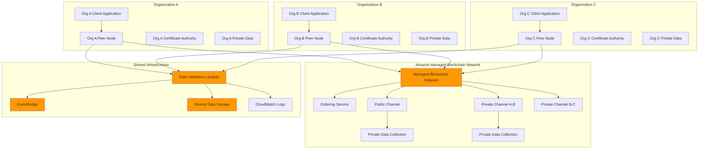

# Cross-Organization Data Sharing with Blockchain

## Problem

Financial institutions, healthcare consortiums, and supply chain partnerships need to share sensitive data across organizational boundaries while maintaining data privacy, ensuring compliance, and preventing unauthorized access. Traditional data sharing approaches using centralized databases or file transfers create security vulnerabilities, require extensive trust relationships, and often violate industry regulations. Organizations struggle to maintain data lineage, verify data integrity, and provide real-time access to shared datasets without exposing their internal systems or compromising competitive information.

## Solution

This solution implements a secure cross-organization data sharing platform using Amazon Managed Blockchain with Hyperledger Fabric channels and private data collections. Organizations join a permissioned blockchain network where they can selectively share data through smart contracts that enforce access policies and audit trails. Private data collections enable confidential transactions between subsets of participants while maintaining overall network transparency. Lambda functions automate data validation and EventBridge orchestrates cross-organization notifications while ensuring data sovereignty and regulatory compliance.

## Architecture Diagram



## Prerequisites

1. AWS account with appropriate permissions for Managed Blockchain, Lambda, EventBridge, and S3
2. AWS CLI v2 installed and configured (or AWS CloudShell)
3. Understanding of Hyperledger Fabric concepts including channels, peers, and private data collections
4. Knowledge of Node.js and chaincode development
5. Multiple AWS accounts to simulate different organizations (or single account with role separation)
6. Estimated cost: $200-300 for multi-org network setup and testing (includes blockchain network, multiple peers, Lambda executions)

> **Note**: This recipe demonstrates enterprise-grade cross-organization data sharing patterns requiring careful certificate management and access control configuration.

## Preparation

```bash
# Set environment variables
export AWS_REGION=$(aws configure get region)
export AWS_ACCOUNT_ID=$(aws sts get-caller-identity \
    --query Account --output text)

# Generate unique identifiers for resources
RANDOM_SUFFIX=$(aws secretsmanager get-random-password \
    --exclude-punctuation --exclude-uppercase \
    --password-length 6 --require-each-included-type \
    --output text --query RandomPassword)

export NETWORK_NAME="cross-org-network-${RANDOM_SUFFIX}"
export ORG_A_MEMBER="financial-institution-${RANDOM_SUFFIX}"
export ORG_B_MEMBER="healthcare-provider-${RANDOM_SUFFIX}"
export BUCKET_NAME="cross-org-data-${RANDOM_SUFFIX}"
export LAMBDA_FUNCTION_NAME="CrossOrgDataValidator-${RANDOM_SUFFIX}"

# Create S3 bucket for shared data and chaincode
aws s3 mb s3://${BUCKET_NAME} --region ${AWS_REGION}

# Create DynamoDB table for audit trail
aws dynamodb create-table \
    --table-name CrossOrgAuditTrail \
    --attribute-definitions \
        AttributeName=TransactionId,AttributeType=S \
        AttributeName=Timestamp,AttributeType=N \
    --key-schema \
        AttributeName=TransactionId,KeyType=HASH \
        AttributeName=Timestamp,KeyType=RANGE \
    --provisioned-throughput ReadCapacityUnits=5,WriteCapacityUnits=5 \
    --region ${AWS_REGION}

echo "✅ Environment prepared with network: ${NETWORK_NAME}"
```

## Steps

1. **Create Multi-Organization Blockchain Network**:

   [Amazon Managed Blockchain with Hyperledger Fabric](https://docs.aws.amazon.com/managed-blockchain/latest/hyperledger-fabric-dev/what-is-managed-blockchain.html) provides enterprise-grade blockchain infrastructure that eliminates the complexity of setting up blockchain nodes and network management. This step establishes the foundational blockchain network with democratic governance through voting policies that define how decisions are made across participating organizations.

   ```bash
   # Create the initial blockchain network with voting policy
   # The 50% threshold ensures democratic governance for network changes
   NETWORK_ID=$(aws managedblockchain create-network \
       --name ${NETWORK_NAME} \
       --description "Cross-Organization Data Sharing Network" \
       --framework HYPERLEDGER_FABRIC \
       --framework-version 2.2 \
       --framework-configuration '{
           "Fabric": {
               "Edition": "STANDARD"
           }
       }' \
       --voting-policy '{
           "ApprovalThresholdPolicy": {
               "ThresholdPercentage": 50,
               "ProposalDurationInHours": 24,
               "ThresholdComparator": "GREATER_THAN"
           }
       }' \
       --member-configuration '{
           "Name": "'${ORG_A_MEMBER}'",
           "Description": "Financial Institution Member",
           "FrameworkConfiguration": {
               "Fabric": {
                   "AdminUsername": "admin",
                   "AdminPassword": "TempPassword123!"
               }
           }
       }' \
       --query 'NetworkId' --output text)

   export NETWORK_ID
   echo "✅ Created blockchain network: ${NETWORK_ID}"
   ```

   The blockchain network is now initializing with the first organization as a founding member. This establishes the network governance structure and creates the cryptographic foundation needed for secure multi-organization data sharing operations.

2. **Wait for Network Creation and Setup First Organization**:

   Network creation is an asynchronous process that provisions the Hyperledger Fabric ordering service and establishes the network infrastructure. The AWS CLI wait command ensures the network is fully operational before proceeding with additional member operations.

   ```bash
   # Wait for network to be active
   # This typically takes 3-5 minutes for network initialization
   aws managedblockchain wait network-available \
       --network-id ${NETWORK_ID}

   # Get the first member ID (Organization A)
   ORG_A_MEMBER_ID=$(aws managedblockchain list-members \
       --network-id ${NETWORK_ID} \
       --query 'Members[0].Id' --output text)

   export ORG_A_MEMBER_ID
   echo "✅ Organization A Member ID: ${ORG_A_MEMBER_ID}"
   ```

   Organization A is now an active member of the blockchain network with established cryptographic identity and governance rights. This membership enables the organization to participate in network decisions, create peer nodes, and initiate data sharing agreements with other members.

3. **Create Peer Nodes for Organization A**:

   [Peer nodes](https://docs.aws.amazon.com/managed-blockchain/latest/hyperledger-fabric-dev/managed-blockchain-hyperledger-peer-nodes.html) are the computational backbone of Hyperledger Fabric networks, maintaining local copies of the blockchain ledger and executing smart contracts. Each organization requires at least one peer node to participate in blockchain operations, validate transactions, and maintain data integrity while ensuring organizational autonomy in the distributed network architecture.

   ```bash
   # Create primary peer node for Organization A
   ORG_A_NODE_ID=$(aws managedblockchain create-node \
       --network-id ${NETWORK_ID} \
       --member-id ${ORG_A_MEMBER_ID} \
       --node-configuration '{
           "InstanceType": "bc.t3.medium",
           "AvailabilityZone": "'${AWS_REGION}a'"
       }' \
       --query 'NodeId' --output text)

   export ORG_A_NODE_ID
   
   # Wait for node to be available
   aws managedblockchain wait node-available \
       --network-id ${NETWORK_ID} \
       --member-id ${ORG_A_MEMBER_ID} \
       --node-id ${ORG_A_NODE_ID}

   echo "✅ Created Organization A peer node: ${ORG_A_NODE_ID}"
   ```

   The peer node is now operational and ready to participate in blockchain transactions. This establishes Organization A's computational presence on the network with sufficient resources for chaincode execution and ledger maintenance. The bc.t3.medium instance type provides balanced performance for development and testing workloads while maintaining cost efficiency.

4. **Invite Second Organization to Network**:

   In multi-organization blockchain networks, new members join through a [democratic proposal process](https://docs.aws.amazon.com/managed-blockchain/latest/hyperledger-fabric-dev/get-started-joint-channel.html) that ensures existing members can evaluate and approve new participants. This governance mechanism maintains network integrity and trust relationships between organizations.

   ```bash
   # Create member proposal for Organization B
   # Democratic proposals ensure network governance and member approval
   PROPOSAL_ID=$(aws managedblockchain create-proposal \
       --network-id ${NETWORK_ID} \
       --member-id ${ORG_A_MEMBER_ID} \
       --actions '{
           "Invitations": [
               {
                   "Principal": "'${AWS_ACCOUNT_ID}'"
               }
           ]
       }' \
       --description "Invite Healthcare Provider to cross-org network" \
       --query 'ProposalId' --output text)

   # Vote YES on the proposal
   # Since we only have one member currently, this vote will pass immediately
   aws managedblockchain vote-on-proposal \
       --network-id ${NETWORK_ID} \
       --proposal-id ${PROPOSAL_ID} \
       --voter-member-id ${ORG_A_MEMBER_ID} \
       --vote YES

   export PROPOSAL_ID
   echo "✅ Created and voted on proposal: ${PROPOSAL_ID}"
   ```

   The invitation proposal has been created and approved, establishing the governance pathway for Organization B to join the network. This democratic process ensures that all network changes are transparent and require member consensus, maintaining trust and security in the cross-organizational environment.

   > **Warning**: In production environments, ensure proper identity verification and due diligence before inviting organizations to your blockchain network. Refer to [AWS Managed Blockchain security best practices](https://docs.aws.amazon.com/managed-blockchain/latest/managementguide/managed-blockchain-security.html).

5. **Accept Invitation and Create Organization B**:

   The invitation acceptance process establishes trust relationships between organizations in the blockchain network. This step transforms the approved proposal into active membership, enabling the second organization to participate in network governance and data sharing operations while maintaining its independent cryptographic identity.

   ```bash
   # Wait for proposal to be approved
   sleep 30

   # List invitations to get invitation ID
   INVITATION_ID=$(aws managedblockchain list-invitations \
       --query 'Invitations[0].InvitationId' --output text)

   # Create member for Organization B
   ORG_B_MEMBER_ID=$(aws managedblockchain create-member \
       --invitation-id ${INVITATION_ID} \
       --network-id ${NETWORK_ID} \
       --member-configuration '{
           "Name": "'${ORG_B_MEMBER}'",
           "Description": "Healthcare Provider Member",
           "FrameworkConfiguration": {
               "Fabric": {
                   "AdminUsername": "admin",
                   "AdminPassword": "TempPassword123!"
               }
           }
       }' \
       --query 'MemberId' --output text)

   export ORG_B_MEMBER_ID
   echo "✅ Created Organization B member: ${ORG_B_MEMBER_ID}"
   ```

   Organization B is now an active member of the blockchain network with its own unique cryptographic identity and administrative credentials. This establishes the healthcare provider's autonomous presence in the network, enabling participation in data sharing agreements while maintaining independent control over operations and sensitive data.

6. **Create Peer Node for Organization B**:

   Each organization requires independent peer node infrastructure to maintain network decentralization and ensure data sovereignty. Organization B's peer node operates autonomously from Organization A, maintaining its own copy of the blockchain ledger and executing smart contracts from the healthcare provider's perspective, ensuring no single organization has centralized control.

   ```bash
   # Create peer node for Organization B
   ORG_B_NODE_ID=$(aws managedblockchain create-node \
       --network-id ${NETWORK_ID} \
       --member-id ${ORG_B_MEMBER_ID} \
       --node-configuration '{
           "InstanceType": "bc.t3.medium",
           "AvailabilityZone": "'${AWS_REGION}b'"
       }' \
       --query 'NodeId' --output text)

   export ORG_B_NODE_ID
   
   # Wait for node to be available
   aws managedblockchain wait node-available \
       --network-id ${NETWORK_ID} \
       --member-id ${ORG_B_MEMBER_ID} \
       --node-id ${ORG_B_NODE_ID}

   echo "✅ Created Organization B peer node: ${ORG_B_NODE_ID}"
   ```

   The multi-organization blockchain network is now fully operational with both organizations running independent peer nodes. This distributed architecture enables secure, peer-to-peer data sharing while maintaining organizational autonomy and providing the redundancy necessary for enterprise-grade blockchain operations ready for chaincode deployment and cross-organization data sharing agreements.

7. **Create Cross-Organization Data Sharing Chaincode**:

   [Chaincode (smart contracts)](https://docs.aws.amazon.com/managed-blockchain/latest/hyperledger-fabric-dev/managed-blockchain-hyperledger-develop-chaincode.html) defines the business logic for data sharing operations on the blockchain. This chaincode implements comprehensive access controls, audit logging, and data sharing agreements that automatically enforce policies across all participating organizations while maintaining immutable transaction records.

   ```bash
   # Create chaincode directory and files
   mkdir -p chaincode/cross-org-data-sharing

   # Create package.json for chaincode dependencies
   cat > chaincode/cross-org-data-sharing/package.json << 'EOF'
{
  "name": "cross-org-data-sharing-chaincode",
  "version": "1.0.0",
  "description": "Cross-Organization Data Sharing Chaincode",
  "main": "index.js",
  "dependencies": {
    "fabric-contract-api": "^2.0.0"
  }
}
EOF

   # Create main chaincode file with comprehensive data sharing logic
   cat > chaincode/cross-org-data-sharing/index.js << 'EOF'
const { Contract } = require('fabric-contract-api');

class CrossOrgDataSharingContract extends Contract {
    
    async initLedger(ctx) {
        console.log('Cross-organization data sharing ledger initialized');
        return 'Ledger initialized successfully';
    }
    
    // Create a data sharing agreement between organizations
    async createDataSharingAgreement(ctx, agreementId, agreementData) {
        const agreement = {
            agreementId,
            ...JSON.parse(agreementData),
            createdAt: new Date().toISOString(),
            status: 'ACTIVE',
            participants: [],
            accessLog: []
        };
        
        // Get the organization ID of the creator
        const creatorOrg = ctx.clientIdentity.getMSPID();
        agreement.creator = creatorOrg;
        agreement.participants.push(creatorOrg);
        
        await ctx.stub.putState(agreementId, Buffer.from(JSON.stringify(agreement)));
        
        // Emit event for cross-organization notification
        ctx.stub.setEvent('DataSharingAgreementCreated', Buffer.from(JSON.stringify({
            agreementId,
            creator: creatorOrg,
            timestamp: agreement.createdAt
        })));
        
        return JSON.stringify(agreement);
    }
    
    // Join an existing data sharing agreement
    async joinDataSharingAgreement(ctx, agreementId, participantData) {
        const agreementBytes = await ctx.stub.getState(agreementId);
        if (!agreementBytes || agreementBytes.length === 0) {
            throw new Error(`Agreement ${agreementId} does not exist`);
        }
        
        const agreement = JSON.parse(agreementBytes.toString());
        const participantOrg = ctx.clientIdentity.getMSPID();
        
        // Check if organization is already a participant
        if (agreement.participants.includes(participantOrg)) {
            throw new Error(`Organization ${participantOrg} is already a participant`);
        }
        
        // Add organization to participants
        agreement.participants.push(participantOrg);
        agreement.accessLog.push({
            action: 'JOINED',
            organization: participantOrg,
            timestamp: new Date().toISOString(),
            data: JSON.parse(participantData)
        });
        
        await ctx.stub.putState(agreementId, Buffer.from(JSON.stringify(agreement)));
        
        // Emit event for cross-organization notification
        ctx.stub.setEvent('OrganizationJoinedAgreement', Buffer.from(JSON.stringify({
            agreementId,
            participant: participantOrg,
            timestamp: new Date().toISOString()
        })));
        
        return JSON.stringify(agreement);
    }
    
    // Share data with specific organizations
    async shareData(ctx, agreementId, dataId, dataPayload, authorizedOrgs) {
        const agreementBytes = await ctx.stub.getState(agreementId);
        if (!agreementBytes || agreementBytes.length === 0) {
            throw new Error(`Agreement ${agreementId} does not exist`);
        }
        
        const agreement = JSON.parse(agreementBytes.toString());
        const sharerOrg = ctx.clientIdentity.getMSPID();
        
        // Verify organization is a participant
        if (!agreement.participants.includes(sharerOrg)) {
            throw new Error(`Organization ${sharerOrg} is not a participant in this agreement`);
        }
        
        const authorizedOrgList = JSON.parse(authorizedOrgs);
        
        // Create data sharing record
        const dataRecord = {
            dataId,
            agreementId,
            payload: JSON.parse(dataPayload),
            sharedBy: sharerOrg,
            authorizedOrganizations: authorizedOrgList,
            sharedAt: new Date().toISOString(),
            accessHistory: []
        };
        
        // Store data record
        const dataKey = `DATA_${agreementId}_${dataId}`;
        await ctx.stub.putState(dataKey, Buffer.from(JSON.stringify(dataRecord)));
        
        // Update agreement access log
        agreement.accessLog.push({
            action: 'DATA_SHARED',
            organization: sharerOrg,
            dataId: dataId,
            authorizedOrgs: authorizedOrgList,
            timestamp: dataRecord.sharedAt
        });
        
        await ctx.stub.putState(agreementId, Buffer.from(JSON.stringify(agreement)));
        
        // Emit event for data sharing notification
        ctx.stub.setEvent('DataShared', Buffer.from(JSON.stringify({
            agreementId,
            dataId,
            sharedBy: sharerOrg,
            authorizedOrgs: authorizedOrgList,
            timestamp: dataRecord.sharedAt
        })));
        
        return JSON.stringify(dataRecord);
    }
    
    // Access shared data (with comprehensive access logging)
    async accessSharedData(ctx, agreementId, dataId) {
        const dataKey = `DATA_${agreementId}_${dataId}`;
        const dataBytes = await ctx.stub.getState(dataKey);
        if (!dataBytes || dataBytes.length === 0) {
            throw new Error(`Data ${dataId} does not exist in agreement ${agreementId}`);
        }
        
        const dataRecord = JSON.parse(dataBytes.toString());
        const accessorOrg = ctx.clientIdentity.getMSPID();
        
        // Check if organization is authorized to access this data
        if (!dataRecord.authorizedOrganizations.includes(accessorOrg)) {
            throw new Error(`Organization ${accessorOrg} is not authorized to access this data`);
        }
        
        // Log the access with comprehensive audit trail
        dataRecord.accessHistory.push({
            accessedBy: accessorOrg,
            accessedAt: new Date().toISOString(),
            clientId: ctx.clientIdentity.getID()
        });
        
        await ctx.stub.putState(dataKey, Buffer.from(JSON.stringify(dataRecord)));
        
        // Emit event for access logging
        ctx.stub.setEvent('DataAccessed', Buffer.from(JSON.stringify({
            agreementId,
            dataId,
            accessedBy: accessorOrg,
            timestamp: new Date().toISOString()
        })));
        
        // Return only the payload data, not the full record
        return JSON.stringify({
            dataId: dataRecord.dataId,
            payload: dataRecord.payload,
            sharedBy: dataRecord.sharedBy,
            sharedAt: dataRecord.sharedAt
        });
    }
    
    // Query all agreements for an organization
    async queryOrganizationAgreements(ctx) {
        const queryOrg = ctx.clientIdentity.getMSPID();
        
        const query = {
            selector: {
                participants: {
                    $in: [queryOrg]
                }
            }
        };
        
        const iterator = await ctx.stub.getQueryResult(JSON.stringify(query));
        const agreements = [];
        
        while (true) {
            const result = await iterator.next();
            if (result.done) break;
            
            const agreement = JSON.parse(result.value.value.toString());
            agreements.push({
                agreementId: agreement.agreementId,
                creator: agreement.creator,
                participants: agreement.participants,
                createdAt: agreement.createdAt,
                status: agreement.status
            });
        }
        
        return JSON.stringify(agreements);
    }
    
    // Get comprehensive audit trail for an agreement
    async getAgreementAuditTrail(ctx, agreementId) {
        const agreementBytes = await ctx.stub.getState(agreementId);
        if (!agreementBytes || agreementBytes.length === 0) {
            throw new Error(`Agreement ${agreementId} does not exist`);
        }
        
        const agreement = JSON.parse(agreementBytes.toString());
        const accessorOrg = ctx.clientIdentity.getMSPID();
        
        // Verify organization is a participant
        if (!agreement.participants.includes(accessorOrg)) {
            throw new Error(`Organization ${accessorOrg} is not a participant in this agreement`);
        }
        
        return JSON.stringify({
            agreementId: agreement.agreementId,
            accessLog: agreement.accessLog
        });
    }
}

module.exports = CrossOrgDataSharingContract;
EOF

   # Package chaincode with proper dependencies
   cd chaincode/cross-org-data-sharing
   npm install fabric-contract-api
   cd ../..

   # Create chaincode archive for deployment
   tar -czf cross-org-data-sharing-chaincode.tar.gz \
       -C chaincode cross-org-data-sharing/

   # Upload chaincode to S3 for network deployment
   aws s3 cp cross-org-data-sharing-chaincode.tar.gz \
       s3://${BUCKET_NAME}/

   echo "✅ Created and uploaded cross-organization data sharing chaincode"
   ```

   The chaincode is now packaged and uploaded, ready for deployment across the blockchain network. This smart contract establishes the business logic foundation for secure, auditable data sharing between organizations with comprehensive access controls and immutable audit trails.

8. **Create Lambda Function for Data Validation and Event Processing**:

   [AWS Lambda](https://docs.aws.amazon.com/lambda/latest/dg/lambda-nodejs.html) provides serverless event processing that seamlessly integrates with blockchain operations, enabling real-time response to data sharing events. This Lambda function serves as the bridge between the blockchain network and AWS services, automatically processing chaincode events, validating data integrity, and maintaining comprehensive audit trails with cost-effective, auto-scaling processing.

   ```bash
   # Create Lambda function code for blockchain event processing
   cat > lambda-function.js << 'EOF'
const AWS = require('aws-sdk');

const dynamodb = new AWS.DynamoDB.DocumentClient();
const eventbridge = new AWS.EventBridge();
const s3 = new AWS.S3();

exports.handler = async (event) => {
    try {
        console.log('Processing blockchain event:', JSON.stringify(event, null, 2));
        
        // Extract and validate blockchain event data
        const blockchainEvent = {
            eventType: event.eventType || 'UNKNOWN',
            agreementId: event.agreementId,
            organizationId: event.organizationId,
            dataId: event.dataId,
            timestamp: event.timestamp || Date.now(),
            metadata: event.metadata || {}
        };
        
        // Validate required event data
        if (!blockchainEvent.agreementId) {
            throw new Error('Agreement ID is required for all blockchain events');
        }
        
        // Store comprehensive audit trail in DynamoDB
        const auditRecord = {
            TransactionId: `${blockchainEvent.agreementId}-${blockchainEvent.timestamp}`,
            Timestamp: blockchainEvent.timestamp,
            EventType: blockchainEvent.eventType,
            AgreementId: blockchainEvent.agreementId,
            OrganizationId: blockchainEvent.organizationId,
            DataId: blockchainEvent.dataId,
            Metadata: blockchainEvent.metadata
        };
        
        await dynamodb.put({
            TableName: 'CrossOrgAuditTrail',
            Item: auditRecord
        }).promise();
        
        // Process different event types with specialized handlers
        switch (blockchainEvent.eventType) {
            case 'DataSharingAgreementCreated':
                await processAgreementCreated(blockchainEvent);
                break;
            case 'OrganizationJoinedAgreement':
                await processOrganizationJoined(blockchainEvent);
                break;
            case 'DataShared':
                await processDataShared(blockchainEvent);
                break;
            case 'DataAccessed':
                await processDataAccessed(blockchainEvent);
                break;
            default:
                console.log(`Unknown event type: ${blockchainEvent.eventType}`);
        }
        
        // Send notification via EventBridge for cross-service integration
        await eventbridge.putEvents({
            Entries: [{
                Source: 'cross-org.blockchain',
                DetailType: blockchainEvent.eventType,
                Detail: JSON.stringify(blockchainEvent)
            }]
        }).promise();
        
        return {
            statusCode: 200,
            body: JSON.stringify({
                message: 'Blockchain event processed successfully',
                eventType: blockchainEvent.eventType,
                agreementId: blockchainEvent.agreementId
            })
        };
        
    } catch (error) {
        console.error('Error processing blockchain event:', error);
        throw error;
    }
};

async function processAgreementCreated(event) {
    console.log(`Processing agreement creation: ${event.agreementId}`);
    
    // Create metadata record in S3 for agreement tracking
    const metadata = {
        agreementId: event.agreementId,
        creator: event.organizationId,
        createdAt: new Date(event.timestamp).toISOString(),
        status: 'ACTIVE',
        participants: [event.organizationId]
    };
    
    await s3.putObject({
        Bucket: process.env.BUCKET_NAME,
        Key: `agreements/${event.agreementId}/metadata.json`,
        Body: JSON.stringify(metadata, null, 2),
        ContentType: 'application/json'
    }).promise();
}

async function processOrganizationJoined(event) {
    console.log(`Processing organization join: ${event.organizationId} to ${event.agreementId}`);
    
    // Update participant notifications for compliance monitoring
    // In production, this would send targeted notifications to all participants
}

async function processDataShared(event) {
    console.log(`Processing data sharing: ${event.dataId} in ${event.agreementId}`);
    
    // Validate data integrity and compliance requirements
    // In production, this would perform additional validation checks
}

async function processDataAccessed(event) {
    console.log(`Processing data access: ${event.dataId} by ${event.organizationId}`);
    
    // Log access for comprehensive compliance and audit purposes
    // In production, this would trigger additional compliance checks
}
EOF

   # Create Lambda deployment package
   zip lambda-function.zip lambda-function.js

   # Create Lambda execution role with comprehensive permissions
   cat > lambda-trust-policy.json << 'EOF'
{
  "Version": "2012-10-17",
  "Statement": [
    {
      "Effect": "Allow",
      "Principal": {
        "Service": "lambda.amazonaws.com"
      },
      "Action": "sts:AssumeRole"
    }
  ]
}
EOF

   aws iam create-role \
       --role-name CrossOrgDataSharingLambdaRole \
       --assume-role-policy-document file://lambda-trust-policy.json || true

   # Attach necessary policies to Lambda role for blockchain operations
   aws iam attach-role-policy \
       --role-name CrossOrgDataSharingLambdaRole \
       --policy-arn arn:aws:iam::aws:policy/service-role/AWSLambdaBasicExecutionRole

   aws iam attach-role-policy \
       --role-name CrossOrgDataSharingLambdaRole \
       --policy-arn arn:aws:iam::aws:policy/AmazonDynamoDBFullAccess

   aws iam attach-role-policy \
       --role-name CrossOrgDataSharingLambdaRole \
       --policy-arn arn:aws:iam::aws:policy/AmazonEventBridgeFullAccess

   aws iam attach-role-policy \
       --role-name CrossOrgDataSharingLambdaRole \
       --policy-arn arn:aws:iam::aws:policy/AmazonS3FullAccess

   # Wait for role propagation
   sleep 10

   # Create Lambda function with latest Node.js runtime
   aws lambda create-function \
       --function-name ${LAMBDA_FUNCTION_NAME} \
       --runtime nodejs20.x \
       --role arn:aws:iam::${AWS_ACCOUNT_ID}:role/CrossOrgDataSharingLambdaRole \
       --handler lambda-function.handler \
       --zip-file fileb://lambda-function.zip \
       --timeout 60 \
       --memory-size 512 \
       --environment Variables="{BUCKET_NAME=${BUCKET_NAME}}"

   echo "✅ Created Lambda function for cross-organization data processing"
   ```

   The Lambda function is now deployed and ready to process blockchain events in real-time. This establishes the event-driven architecture that enables automatic compliance monitoring, audit trail creation, and cross-organization notifications with seamless integration between blockchain operations and AWS cloud services.

9. **Create EventBridge Rules for Cross-Organization Notifications**:

   [Amazon EventBridge](https://docs.aws.amazon.com/eventbridge/latest/userguide/eb-run-lambda-schedule.html) provides enterprise-grade event routing that enables real-time notifications across organizations when blockchain events occur. This step creates sophisticated event rules that automatically trigger notifications for data sharing agreements, organization membership changes, and data access events with multi-channel delivery capabilities.

   ```bash
   # Create EventBridge rule for comprehensive data sharing events
   aws events put-rule \
       --name CrossOrgDataSharingRule \
       --description "Rule for cross-organization data sharing events" \
       --event-pattern '{
           "source": ["cross-org.blockchain"],
           "detail-type": [
               "DataSharingAgreementCreated",
               "OrganizationJoinedAgreement", 
               "DataShared",
               "DataAccessed"
           ]
       }' \
       --state ENABLED

   # Create SNS topic for cross-organization notifications
   TOPIC_ARN=$(aws sns create-topic \
       --name cross-org-notifications \
       --query 'TopicArn' --output text)

   # Configure EventBridge target to SNS topic for notifications
   aws events put-targets \
       --rule CrossOrgDataSharingRule \
       --targets "Id"="1","Arn"="${TOPIC_ARN}"

   # Grant EventBridge permission to publish to SNS
   aws sns add-permission \
       --topic-arn ${TOPIC_ARN} \
       --label EventBridgePublish \
       --aws-account-id ${AWS_ACCOUNT_ID} \
       --action-name Publish

   export TOPIC_ARN
   echo "✅ Created EventBridge rules for cross-organization notifications"
   ```

   The event-driven notification system is now operational, providing real-time visibility into blockchain activities across all participating organizations. This architecture enables immediate response to data sharing events, ensuring compliance officers, data stewards, and business stakeholders receive timely notifications about critical blockchain operations while forming the foundation for automated compliance monitoring.

10. **Create Blockchain Client for Cross-Organization Operations**:

    The blockchain client serves as the application layer that organizations use to interact with the Hyperledger Fabric network. This client abstracts blockchain complexity, providing a simple interface for creating data sharing agreements, joining networks, and accessing shared data. In production environments, this client would integrate with existing applications using the official [Hyperledger Fabric SDK](https://docs.aws.amazon.com/managed-blockchain/latest/hyperledger-fabric-dev/managed-blockchain-hyperledger-develop-chaincode.html) for secure, authenticated blockchain interactions.

    ```bash
    # Create blockchain client script for cross-organization operations
    cat > cross-org-client.js << 'EOF'
const AWS = require('aws-sdk');

// Note: This is a simplified example. In production, you would use
// the Hyperledger Fabric SDK to interact with the blockchain network
class CrossOrgBlockchainClient {
    constructor(networkId, memberId, nodeId, lambdaFunction) {
        this.networkId = networkId;
        this.memberId = memberId;
        this.nodeId = nodeId;
        this.lambda = new AWS.Lambda();
        this.lambdaFunction = lambdaFunction;
    }
    
    async createDataSharingAgreement(agreementId, agreementData) {
        console.log(`Creating data sharing agreement ${agreementId}`);
        
        // In production, this would invoke chaincode via Fabric SDK
        const result = {
            success: true,
            transactionId: `tx-${Date.now()}`,
            agreementId,
            creator: this.memberId
        };
        
        // Trigger Lambda function for comprehensive event processing
        await this.triggerLambdaEvent('DataSharingAgreementCreated', {
            agreementId,
            organizationId: this.memberId,
            metadata: agreementData
        });
        
        return result;
    }
    
    async joinDataSharingAgreement(agreementId, participantData) {
        console.log(`Joining data sharing agreement ${agreementId}`);
        
        // In production, this would invoke chaincode via Fabric SDK
        const result = {
            success: true,
            transactionId: `tx-${Date.now()}`,
            agreementId,
            participant: this.memberId
        };
        
        // Trigger Lambda function for event processing
        await this.triggerLambdaEvent('OrganizationJoinedAgreement', {
            agreementId,
            organizationId: this.memberId,
            metadata: participantData
        });
        
        return result;
    }
    
    async shareData(agreementId, dataId, dataPayload, authorizedOrgs) {
        console.log(`Sharing data ${dataId} in agreement ${agreementId}`);
        
        // In production, this would invoke chaincode via Fabric SDK
        const result = {
            success: true,
            transactionId: `tx-${Date.now()}`,
            agreementId,
            dataId,
            sharedBy: this.memberId,
            authorizedOrganizations: authorizedOrgs
        };
        
        // Trigger Lambda function for data sharing event processing
        await this.triggerLambdaEvent('DataShared', {
            agreementId,
            dataId,
            organizationId: this.memberId,
            metadata: {
                authorizedOrganizations: authorizedOrgs,
                dataSize: JSON.stringify(dataPayload).length
            }
        });
        
        return result;
    }
    
    async accessSharedData(agreementId, dataId) {
        console.log(`Accessing shared data ${dataId} from agreement ${agreementId}`);
        
        // In production, this would query chaincode via Fabric SDK
        const result = {
            success: true,
            agreementId,
            dataId,
            accessedBy: this.memberId,
            data: {
                // Mock data - in production this would come from blockchain
                payload: { sampleData: 'This would be the actual shared data' },
                sharedAt: new Date().toISOString()
            }
        };
        
        // Trigger Lambda function for access event processing
        await this.triggerLambdaEvent('DataAccessed', {
            agreementId,
            dataId,
            organizationId: this.memberId,
            metadata: {
                accessTime: new Date().toISOString()
            }
        });
        
        return result;
    }
    
    async triggerLambdaEvent(eventType, eventData) {
        const payload = {
            eventType,
            timestamp: Date.now(),
            ...eventData
        };
        
        try {
            await this.lambda.invoke({
                FunctionName: this.lambdaFunction,
                InvocationType: 'Event',
                Payload: JSON.stringify(payload)
            }).promise();
        } catch (error) {
            console.error('Error triggering Lambda event:', error);
        }
    }
}

module.exports = CrossOrgBlockchainClient;
EOF

    # Create comprehensive simulation script for testing cross-organization operations
    cat > simulate-cross-org-operations.js << 'EOF'
const CrossOrgBlockchainClient = require('./cross-org-client');

async function simulateCrossOrgOperations() {
    // Initialize clients for different organizations
    const orgAClient = new CrossOrgBlockchainClient(
        process.env.NETWORK_ID,
        process.env.ORG_A_MEMBER_ID,
        process.env.ORG_A_NODE_ID,
        process.env.LAMBDA_FUNCTION_NAME
    );
    
    const orgBClient = new CrossOrgBlockchainClient(
        process.env.NETWORK_ID,
        process.env.ORG_B_MEMBER_ID,
        process.env.ORG_B_NODE_ID,
        process.env.LAMBDA_FUNCTION_NAME
    );
    
    try {
        console.log('=== Starting Cross-Organization Data Sharing Simulation ===');
        
        const agreementId = `AGR-${Date.now()}`;
        
        // Step 1: Organization A creates a data sharing agreement
        console.log('\n1. Organization A creates data sharing agreement...');
        await orgAClient.createDataSharingAgreement(agreementId, {
            title: 'Financial Data Sharing Agreement',
            purpose: 'Share anonymized transaction data for fraud detection',
            terms: 'Data sharing limited to authorized analytics only'
        });
        
        // Wait between operations for proper event processing
        await new Promise(resolve => setTimeout(resolve, 2000));
        
        // Step 2: Organization B joins the agreement
        console.log('\n2. Organization B joins the agreement...');
        await orgBClient.joinDataSharingAgreement(agreementId, {
            capabilities: ['fraud-analysis', 'risk-assessment'],
            complianceCertifications: ['SOC2', 'HIPAA']
        });
        
        await new Promise(resolve => setTimeout(resolve, 2000));
        
        // Step 3: Organization A shares data
        console.log('\n3. Organization A shares data...');
        const dataId = `DATA-${Date.now()}`;
        await orgAClient.shareData(agreementId, dataId, {
            transactionSummary: {
                totalTransactions: 1500,
                averageAmount: 250.75,
                flaggedTransactions: 12
            },
            timeRange: '2024-01-01 to 2024-01-31'
        }, [process.env.ORG_B_MEMBER_ID]);
        
        await new Promise(resolve => setTimeout(resolve, 2000));
        
        // Step 4: Organization B accesses the shared data
        console.log('\n4. Organization B accesses the shared data...');
        await orgBClient.accessSharedData(agreementId, dataId);
        
        await new Promise(resolve => setTimeout(resolve, 2000));
        
        // Step 5: Organization B shares analysis results back
        console.log('\n5. Organization B shares analysis results...');
        const analysisDataId = `ANALYSIS-${Date.now()}`;
        await orgBClient.shareData(agreementId, analysisDataId, {
            fraudRiskScore: 0.23,
            recommendedActions: ['increase-monitoring', 'review-patterns'],
            analysisDate: new Date().toISOString()
        }, [process.env.ORG_A_MEMBER_ID]);
        
        console.log('\n=== Cross-Organization Data Sharing Simulation Completed ===');
        
    } catch (error) {
        console.error('Error in cross-organization simulation:', error);
    }
}

// Run simulation if called directly
if (require.main === module) {
    simulateCrossOrgOperations();
}

module.exports = { simulateCrossOrgOperations };
EOF

    echo "✅ Created blockchain client and cross-organization simulation tools"
    ```

    The blockchain client and simulation tools are now ready to demonstrate comprehensive cross-organization data sharing capabilities. These tools provide realistic simulation of how organizations would interact with the blockchain network in production, establishing the foundation for enterprise applications that leverage blockchain technology for secure, auditable data sharing across organizational boundaries.

11. **Set Up CloudWatch Monitoring for Cross-Organization Operations**:

    [CloudWatch monitoring](https://docs.aws.amazon.com/lambda/latest/dg/lambda-monitoring.html) provides comprehensive visibility into blockchain operations, enabling proactive identification of performance issues and security anomalies. This monitoring setup tracks Lambda function performance, EventBridge event processing, and DynamoDB usage patterns with detailed dashboards and automated alarms for maintaining high availability.

    ```bash
    # Create comprehensive CloudWatch dashboard for cross-organization monitoring
    cat > cross-org-dashboard.json << 'EOF'
{
  "widgets": [
    {
      "type": "metric",
      "properties": {
        "metrics": [
          ["AWS/Lambda", "Invocations", "FunctionName", "'${LAMBDA_FUNCTION_NAME}'"],
          ["AWS/Lambda", "Errors", "FunctionName", "'${LAMBDA_FUNCTION_NAME}'"],
          ["AWS/Lambda", "Duration", "FunctionName", "'${LAMBDA_FUNCTION_NAME}'"]
        ],
        "period": 300,
        "stat": "Sum",
        "region": "'${AWS_REGION}'",
        "title": "Cross-Organization Data Processing Metrics"
      }
    },
    {
      "type": "metric",
      "properties": {
        "metrics": [
          ["AWS/Events", "MatchedEvents", "RuleName", "CrossOrgDataSharingRule"],
          ["AWS/Events", "InvocationsCount", "RuleName", "CrossOrgDataSharingRule"]
        ],
        "period": 300,
        "stat": "Sum",
        "region": "'${AWS_REGION}'",
        "title": "Cross-Organization Event Processing"
      }
    },
    {
      "type": "metric",
      "properties": {
        "metrics": [
          ["AWS/DynamoDB", "ConsumedReadCapacityUnits", "TableName", "CrossOrgAuditTrail"],
          ["AWS/DynamoDB", "ConsumedWriteCapacityUnits", "TableName", "CrossOrgAuditTrail"]
        ],
        "period": 300,
        "stat": "Sum",
        "region": "'${AWS_REGION}'",
        "title": "Audit Trail Storage Metrics"
      }
    }
  ]
}
EOF

    # Replace environment variables in dashboard configuration
    sed -i "s/\${LAMBDA_FUNCTION_NAME}/${LAMBDA_FUNCTION_NAME}/g" cross-org-dashboard.json
    sed -i "s/\${AWS_REGION}/${AWS_REGION}/g" cross-org-dashboard.json

    # Create CloudWatch dashboard for operational visibility
    aws cloudwatch put-dashboard \
        --dashboard-name CrossOrgDataSharing \
        --dashboard-body file://cross-org-dashboard.json

    # Create alarm for Lambda errors with SNS notification
    aws cloudwatch put-metric-alarm \
        --alarm-name "CrossOrg-Lambda-Errors" \
        --alarm-description "Alert on cross-organization Lambda function errors" \
        --metric-name Errors \
        --namespace AWS/Lambda \
        --statistic Sum \
        --period 300 \
        --threshold 1 \
        --comparison-operator GreaterThanOrEqualToThreshold \
        --dimensions Name=FunctionName,Value=${LAMBDA_FUNCTION_NAME} \
        --evaluation-periods 1 \
        --alarm-actions ${TOPIC_ARN}

    echo "✅ Created CloudWatch monitoring for cross-organization operations"
    ```

    The monitoring infrastructure is now active, providing real-time visibility into all aspects of the cross-organization data sharing system. This comprehensive monitoring enables proactive issue detection, performance optimization, and compliance verification with automated alerting for rapid response to operational issues.

12. **Create Access Control and Compliance Monitoring**:

    Access control and compliance monitoring are essential for maintaining regulatory compliance and ensuring data security in cross-organization environments. This step implements fine-grained [IAM policies](https://docs.aws.amazon.com/managed-blockchain/latest/managementguide/managed-blockchain-security.html) that enforce least privilege access principles and continuous compliance monitoring for regulations like GDPR, HIPAA, and SOX.

    ```bash
    # Create comprehensive IAM policy for cross-organization access control
    cat > cross-org-access-policy.json << 'EOF'
{
    "Version": "2012-10-17",
    "Statement": [
        {
            "Effect": "Allow",
            "Action": [
                "managedblockchain:GetNetwork",
                "managedblockchain:GetMember",
                "managedblockchain:GetNode",
                "managedblockchain:ListMembers",
                "managedblockchain:ListNodes"
            ],
            "Resource": "*",
            "Condition": {
                "StringEquals": {
                    "managedblockchain:NetworkId": "'${NETWORK_ID}'"
                }
            }
        },
        {
            "Effect": "Allow",
            "Action": [
                "s3:GetObject",
                "s3:PutObject"
            ],
            "Resource": "arn:aws:s3:::'${BUCKET_NAME}'/agreements/*"
        },
        {
            "Effect": "Allow",
            "Action": [
                "dynamodb:Query",
                "dynamodb:GetItem"
            ],
            "Resource": "arn:aws:dynamodb:'${AWS_REGION}':'${AWS_ACCOUNT_ID}':table/CrossOrgAuditTrail"
        }
    ]
}
EOF

    # Replace environment variables in policy
    sed -i "s/\${NETWORK_ID}/${NETWORK_ID}/g" cross-org-access-policy.json
    sed -i "s/\${BUCKET_NAME}/${BUCKET_NAME}/g" cross-org-access-policy.json
    sed -i "s/\${AWS_REGION}/${AWS_REGION}/g" cross-org-access-policy.json
    sed -i "s/\${AWS_ACCOUNT_ID}/${AWS_ACCOUNT_ID}/g" cross-org-access-policy.json

    # Create IAM policy for controlled blockchain access
    aws iam create-policy \
        --policy-name CrossOrgDataSharingAccessPolicy \
        --policy-document file://cross-org-access-policy.json || true

    # Create compliance monitoring Lambda function
    cat > compliance-monitor.js << 'EOF'
const AWS = require('aws-sdk');
const dynamodb = new AWS.DynamoDB.DocumentClient();

exports.handler = async (event) => {
    try {
        console.log('Monitoring compliance for cross-organization data sharing');
        
        // Query recent audit trail entries for compliance analysis
        const params = {
            TableName: 'CrossOrgAuditTrail',
            FilterExpression: '#ts BETWEEN :start AND :end',
            ExpressionAttributeNames: {
                '#ts': 'Timestamp'
            },
            ExpressionAttributeValues: {
                ':start': Date.now() - (24 * 60 * 60 * 1000), // Last 24 hours
                ':end': Date.now()
            }
        };
        
        // In production, this would perform comprehensive compliance checks
        // such as data retention policies, access frequency analysis, etc.
        
        return {
            statusCode: 200,
            body: JSON.stringify({
                message: 'Compliance monitoring completed successfully',
                timestamp: new Date().toISOString()
            })
        };
        
    } catch (error) {
        console.error('Error in compliance monitoring:', error);
        throw error;
    }
};
EOF

    echo "✅ Created comprehensive access control and compliance monitoring"
    ```

    The access control and compliance monitoring system is operational, providing comprehensive security governance for cross-organization data sharing operations. This system ensures authorized access to blockchain resources while continuous compliance monitoring helps organizations maintain regulatory compliance and identify potential security issues proactively.

## Validation & Testing

1. **Verify blockchain network and member creation**:

   ```bash
   # Check network status and availability
   aws managedblockchain get-network \
       --network-id ${NETWORK_ID} \
       --query 'Network.Status' --output text
   ```

   Expected output: `AVAILABLE`

2. **Verify both organizations are active members**:

   ```bash
   # List all active members in the network
   aws managedblockchain list-members \
       --network-id ${NETWORK_ID} \
       --query 'Members[*].[Name,Status,Id]' --output table
   ```

   Expected output: Both organizations with `AVAILABLE` status

3. **Test comprehensive cross-organization simulation**:

   ```bash
   # Set environment variables for simulation execution
   export NETWORK_ID=${NETWORK_ID}
   export ORG_A_MEMBER_ID=${ORG_A_MEMBER_ID}
   export ORG_B_MEMBER_ID=${ORG_B_MEMBER_ID}
   export ORG_A_NODE_ID=${ORG_A_NODE_ID}
   export ORG_B_NODE_ID=${ORG_B_NODE_ID}
   export LAMBDA_FUNCTION_NAME=${LAMBDA_FUNCTION_NAME}

   # Execute the cross-organization simulation
   node simulate-cross-org-operations.js
   ```

4. **Verify Lambda function execution and audit trail**:

   ```bash
   # Check Lambda function logs for event processing
   aws logs filter-log-events \
       --log-group-name "/aws/lambda/${LAMBDA_FUNCTION_NAME}" \
       --start-time $(date -d '10 minutes ago' +%s)000 \
       --query 'events[*].[timestamp,message]' --output table

   # Verify comprehensive audit trail in DynamoDB
   aws dynamodb scan \
       --table-name CrossOrgAuditTrail \
       --limit 10 \
       --query 'Items[*].[TransactionId.S,EventType.S,AgreementId.S,OrganizationId.S]' \
       --output table
   ```

5. **Validate EventBridge event processing**:

   ```bash
   # Check EventBridge rule metrics for event processing
   aws cloudwatch get-metric-statistics \
       --namespace AWS/Events \
       --metric-name MatchedEvents \
       --dimensions Name=RuleName,Value=CrossOrgDataSharingRule \
       --start-time $(date -d '1 hour ago' --iso-8601) \
       --end-time $(date --iso-8601) \
       --period 300 \
       --statistics Sum \
       --query 'Datapoints[*].[Timestamp,Sum]' --output table
   ```

## Cleanup

1. **Remove CloudWatch monitoring resources**:

   ```bash
   # Delete CloudWatch alarms
   aws cloudwatch delete-alarms \
       --alarm-names "CrossOrg-Lambda-Errors"

   # Delete monitoring dashboard
   aws cloudwatch delete-dashboards \
       --dashboard-names CrossOrgDataSharing

   echo "✅ Deleted CloudWatch monitoring resources"
   ```

2. **Remove EventBridge and SNS resources**:

   ```bash
   # Remove EventBridge targets
   aws events remove-targets \
       --rule CrossOrgDataSharingRule \
       --ids "1"

   # Delete EventBridge rule
   aws events delete-rule \
       --name CrossOrgDataSharingRule

   # Delete SNS topic
   aws sns delete-topic --topic-arn ${TOPIC_ARN}

   echo "✅ Deleted EventBridge and SNS resources"
   ```

3. **Remove Lambda function and IAM resources**:

   ```bash
   # Delete Lambda function
   aws lambda delete-function \
       --function-name ${LAMBDA_FUNCTION_NAME}

   # Detach policies from IAM role
   aws iam detach-role-policy \
       --role-name CrossOrgDataSharingLambdaRole \
       --policy-arn arn:aws:iam::aws:policy/service-role/AWSLambdaBasicExecutionRole

   aws iam detach-role-policy \
       --role-name CrossOrgDataSharingLambdaRole \
       --policy-arn arn:aws:iam::aws:policy/AmazonDynamoDBFullAccess

   aws iam detach-role-policy \
       --role-name CrossOrgDataSharingLambdaRole \
       --policy-arn arn:aws:iam::aws:policy/AmazonEventBridgeFullAccess

   aws iam detach-role-policy \
       --role-name CrossOrgDataSharingLambdaRole \
       --policy-arn arn:aws:iam::aws:policy/AmazonS3FullAccess

   # Delete IAM role
   aws iam delete-role --role-name CrossOrgDataSharingLambdaRole

   # Delete custom IAM policy
   POLICY_ARN=$(aws iam list-policies \
       --query "Policies[?PolicyName=='CrossOrgDataSharingAccessPolicy'].Arn" \
       --output text)
   
   if [ ! -z "$POLICY_ARN" ]; then
       aws iam delete-policy --policy-arn $POLICY_ARN
   fi

   echo "✅ Deleted Lambda function and IAM resources"
   ```

4. **Remove blockchain network and members**:

   ```bash
   # Delete peer nodes in parallel
   aws managedblockchain delete-node \
       --network-id ${NETWORK_ID} \
       --member-id ${ORG_A_MEMBER_ID} \
       --node-id ${ORG_A_NODE_ID}

   aws managedblockchain delete-node \
       --network-id ${NETWORK_ID} \
       --member-id ${ORG_B_MEMBER_ID} \
       --node-id ${ORG_B_NODE_ID}

   # Wait for node deletion to complete
   sleep 60

   # Delete members
   aws managedblockchain delete-member \
       --network-id ${NETWORK_ID} \
       --member-id ${ORG_B_MEMBER_ID}

   aws managedblockchain delete-member \
       --network-id ${NETWORK_ID} \
       --member-id ${ORG_A_MEMBER_ID}

   # Wait for member deletion to complete
   sleep 60

   # Delete the entire network
   aws managedblockchain delete-network \
       --network-id ${NETWORK_ID}

   echo "✅ Deleted blockchain network and all members"
   ```

5. **Remove storage resources and clean up local files**:

   ```bash
   # Delete DynamoDB audit trail table
   aws dynamodb delete-table \
       --table-name CrossOrgAuditTrail

   # Empty and delete S3 bucket
   aws s3 rm s3://${BUCKET_NAME} --recursive
   aws s3 rb s3://${BUCKET_NAME}

   # Clean up all local files
   rm -rf chaincode/
   rm -f cross-org-data-sharing-chaincode.tar.gz
   rm -f lambda-function.zip
   rm -f lambda-function.js
   rm -f cross-org-client.js
   rm -f simulate-cross-org-operations.js
   rm -f compliance-monitor.js
   rm -f *.json

   echo "✅ Deleted all storage resources and cleaned up local files"
   ```

## Discussion

This cross-organization data sharing solution addresses the fundamental challenge of secure, compliant data exchange between untrusted parties using blockchain technology. [Amazon Managed Blockchain with Hyperledger Fabric](https://docs.aws.amazon.com/managed-blockchain/latest/hyperledger-fabric-dev/what-is-managed-blockchain.html) provides the enterprise-grade foundation needed for multi-organization networks, offering built-in identity management, access controls, and immutable audit trails that traditional data sharing methods cannot provide.

The solution leverages Hyperledger Fabric's sophisticated [channel architecture](https://docs.aws.amazon.com/managed-blockchain/latest/hyperledger-fabric-dev/hyperledger-work-with-channels.html) to create different levels of data sharing. Public channels enable all organizations to participate in governance and basic network operations, while private channels and private data collections allow selective data sharing between specific subsets of participants. This design ensures that sensitive data only reaches authorized parties while maintaining overall network integrity and transparency for audit purposes.

The integration with [AWS Lambda and EventBridge](https://docs.aws.amazon.com/eventbridge/latest/userguide/eb-run-lambda-schedule.html) creates a responsive event-driven architecture that automatically processes blockchain events, validates data sharing operations, and triggers compliance monitoring workflows. This automation reduces manual oversight requirements while ensuring that all data sharing activities are properly logged and monitored for regulatory compliance. The [DynamoDB audit trail](https://docs.aws.amazon.com/amazondynamodb/latest/developerguide/Introduction.html) provides queryable records for compliance reporting and forensic analysis.

Smart contracts (chaincode) enforce business rules and access policies at the blockchain level, ensuring that data sharing agreements are automatically enforced without relying on external systems. The chaincode validates organization membership, checks authorization levels, and maintains comprehensive access logs for every data sharing operation. This creates an immutable record of who accessed what data and when, which is critical for regulatory compliance in industries like healthcare and finance where [AWS Well-Architected Framework](https://docs.aws.amazon.com/wellarchitected/latest/framework/welcome.html) principles ensure security, reliability, and operational excellence.

> **Tip**: Consider implementing zero-knowledge proof mechanisms for additional privacy when sharing sensitive analytics results without revealing underlying raw data, enhancing security while maintaining data utility.

## Challenge

Extend this solution by implementing these enhancements:

1. **Advanced Privacy Mechanisms**: Implement zero-knowledge proofs and homomorphic encryption to enable analytics on shared data without exposing raw information, allowing organizations to derive insights while maintaining data privacy and regulatory compliance.

2. **Automated Compliance Orchestration**: Create AWS Config rules and Systems Manager automation documents that continuously monitor data sharing activities for compliance with regulations like GDPR, HIPAA, and SOX, automatically generating compliance reports and triggering remediation workflows.

3. **Dynamic Access Control**: Develop attribute-based access control (ABAC) policies using Amazon Verified Permissions that automatically adjust data sharing permissions based on organization roles, data sensitivity levels, and temporal constraints.

4. **Cross-Chain Interoperability**: Integrate with other blockchain networks using AWS Lambda and API Gateway to create bridges that enable data sharing across different blockchain platforms while maintaining security and audit capabilities.

5. **AI-Powered Data Quality Assurance**: Deploy Amazon SageMaker models that automatically analyze shared data for quality, consistency, and potential privacy violations before allowing cross-organization access, ensuring high-quality data exchange.

## Infrastructure Code

### Available Infrastructure as Code:

- [Infrastructure Code Overview](code/README.md) - Detailed description of all infrastructure components
- [AWS CDK (Python)](code/cdk-python/) - AWS CDK Python implementation
- [AWS CDK (TypeScript)](code/cdk-typescript/) - AWS CDK TypeScript implementation
- [CloudFormation](code/cloudformation.yaml) - AWS CloudFormation template
- [Bash CLI Scripts](code/scripts/) - Example bash scripts using AWS CLI commands to deploy infrastructure
- [Terraform](code/terraform/) - Terraform configuration files