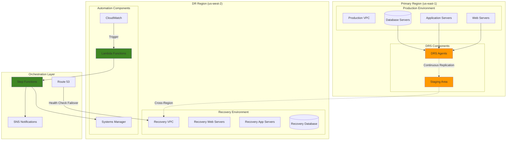

# Cross-Region Disaster Recovery Automation

## Problem

Organizations face significant risks from regional disasters, infrastructure failures, and cyber attacks that can cause extended downtime and substantial data loss. Traditional disaster recovery solutions require expensive duplicate infrastructure, complex failover procedures, and lengthy recovery times that fail to meet modern business continuity requirements, leaving organizations vulnerable to revenue loss and compliance violations.

## Solution

Implement automated cross-region disaster recovery using AWS Elastic Disaster Recovery (DRS) with intelligent failover orchestration, automated testing procedures, and seamless failback capabilities. This solution provides continuous data replication, sub-minute recovery point objectives (RPO), and automated recovery orchestration that minimizes human intervention and reduces recovery time objectives (RTO) to minutes rather than hours.

## Architecture Diagram



## Prerequisites

1. AWS accounts in primary and DR regions with appropriate permissions for DRS, Lambda, and Systems Manager
2. AWS CLI v2 installed and configured (or AWS CloudShell)
3. Source servers running supported operating systems (Windows Server 2008+, RHEL 6+, Ubuntu 14+)
4. Network connectivity between source servers and AWS (internet or Direct Connect)
5. Estimated cost: $200-800/month depending on server count and storage requirements

> **Note**: DRS replication charges are based on staged storage and outbound data transfer. Recovery instances incur standard EC2 charges only when launched.

## Preparation

```bash
# Set environment variables
export PRIMARY_REGION="us-east-1"
export DR_REGION="us-west-2"
export AWS_ACCOUNT_ID=$(aws sts get-caller-identity \
    --query Account --output text)

# Generate unique identifiers for resources
DR_PROJECT_ID=$(aws secretsmanager get-random-password \
    --exclude-punctuation --exclude-uppercase \
    --password-length 8 --require-each-included-type \
    --output text --query RandomPassword --region ${PRIMARY_REGION})

export DRS_PROJECT_NAME="enterprise-dr-${DR_PROJECT_ID}"
export DR_VPC_NAME="disaster-recovery-vpc-${DR_PROJECT_ID}"
export AUTOMATION_ROLE_NAME="DRAutomationRole-${DR_PROJECT_ID}"

# Configure cross-region access
export PRIMARY_DRS_ENDPOINT="https://drs.${PRIMARY_REGION}.amazonaws.com"
export DR_DRS_ENDPOINT="https://drs.${DR_REGION}.amazonaws.com"

echo "DR Project ID: ${DR_PROJECT_ID}"
echo "Primary Region: ${PRIMARY_REGION}"
echo "DR Region: ${DR_REGION}"
```

## Steps

1. **Initialize AWS Elastic Disaster Recovery Service**:

   AWS Elastic Disaster Recovery (DRS) provides continuous block-level replication of your servers into AWS, enabling rapid recovery in case of disaster. [DRS minimizes downtime and data loss](https://docs.aws.amazon.com/drs/latest/userguide/what-is-drs.html) by maintaining low-cost staging areas that can quickly launch production-ready recovery instances. Initializing DRS in both regions establishes the foundation for automated cross-region disaster recovery capabilities.

   ```bash
   # Initialize DRS in primary region
   aws drs initialize-service \
       --region ${PRIMARY_REGION}
   
   # Initialize DRS in DR region
   aws drs initialize-service \
       --region ${DR_REGION}
   
   # Create replication configuration template in primary region
   REPLICATION_TEMPLATE=$(aws drs create-replication-configuration-template \
       --associate-default-security-group \
       --bandwidth-throttling 50000 \
       --create-public-ip \
       --data-plane-routing PRIVATE_IP \
       --default-large-staging-disk-type GP3 \
       --ebs-encryption DEFAULT \
       --pit-policy '[{"interval":10,"retentionDuration":60,"units":"MINUTE"}]' \
       --replication-server-instance-type m5.large \
       --replication-servers-security-groups-ids $(aws ec2 describe-security-groups \
           --filters Name=group-name,Values=default \
           --query 'SecurityGroups[0].GroupId' --output text --region ${PRIMARY_REGION}) \
       --staging-area-subnet-id $(aws ec2 describe-subnets \
           --filters Name=default-for-az,Values=true \
           --query 'Subnets[0].SubnetId' --output text --region ${PRIMARY_REGION}) \
       --staging-area-tags 'Key=Project,Value='${DRS_PROJECT_NAME} \
       --use-dedicated-replication-server \
       --region ${PRIMARY_REGION} \
       --query 'replicationConfigurationTemplateID' --output text)
   
   echo "✅ DRS service initialized"
   echo "Replication Template ID: ${REPLICATION_TEMPLATE}"
   ```

   The DRS service is now initialized and configured with optimized settings for enterprise workloads. The replication template defines how source servers will be replicated, including security groups, instance types, and encryption settings that ensure secure and efficient data transfer.

2. **Create IAM Roles for Disaster Recovery Automation**:

   IAM roles enable secure automation by providing temporary credentials to AWS services without exposing long-term access keys. This approach follows the [principle of least privilege](https://docs.aws.amazon.com/IAM/latest/UserGuide/best-practices.html#grant-least-privilege) and ensures that disaster recovery automation can only access the specific resources required for failover operations. The cross-service trust policy allows Lambda, Step Functions, and Systems Manager to assume this role seamlessly.

   ```bash
   # Create trust policy for Lambda and Systems Manager
   cat > dr-automation-trust-policy.json << 'EOF'
   {
       "Version": "2012-10-17",
       "Statement": [
           {
               "Effect": "Allow",
               "Principal": {
                   "Service": [
                       "lambda.amazonaws.com",
                       "ssm.amazonaws.com",
                       "states.amazonaws.com"
                   ]
               },
               "Action": "sts:AssumeRole"
           }
       ]
   }
   EOF
   
   # Create IAM role for DR automation
   aws iam create-role \
       --role-name ${AUTOMATION_ROLE_NAME} \
       --assume-role-policy-document file://dr-automation-trust-policy.json \
       --description "Role for disaster recovery automation" \
       --region ${PRIMARY_REGION}
   
   # Create custom policy for DRS operations
   cat > dr-automation-policy.json << EOF
   {
       "Version": "2012-10-17",
       "Statement": [
           {
               "Effect": "Allow",
               "Action": [
                   "drs:*",
                   "ec2:*",
                   "iam:PassRole",
                   "route53:*",
                   "sns:*",
                   "ssm:*",
                   "lambda:*",
                   "logs:*",
                   "cloudwatch:*",
                   "events:*",
                   "states:*"
               ],
               "Resource": "*"
           }
       ]
   }
   EOF
   
   aws iam put-role-policy \
       --role-name ${AUTOMATION_ROLE_NAME} \
       --policy-name DRAutomationPolicy \
       --policy-document file://dr-automation-policy.json \
       --region ${PRIMARY_REGION}
   
   echo "✅ Automation role created with necessary permissions"
   ```

   The automation role is now configured with the necessary permissions to orchestrate disaster recovery operations across multiple AWS services. This role enables secure, automated failover without manual intervention while maintaining strict access controls.

   > **Note**: Follow the [principle of least privilege](https://docs.aws.amazon.com/IAM/latest/UserGuide/best-practices.html#grant-least-privilege) when configuring IAM permissions for production environments.

3. **Set Up DR Region Infrastructure**:

   Building dedicated disaster recovery infrastructure in a separate region provides geographic isolation from primary region failures. This VPC design creates a secure, isolated network environment that mirrors your production architecture while maintaining cost efficiency. The multi-AZ subnet configuration ensures high availability even within the DR region, following [AWS disaster recovery best practices](https://docs.aws.amazon.com/whitepapers/latest/disaster-recovery-workloads-on-aws/disaster-recovery-options-in-the-cloud.html).

   ```bash
   # Create VPC in DR region
   DR_VPC_ID=$(aws ec2 create-vpc \
       --cidr-block 10.100.0.0/16 \
       --tag-specifications \
           'ResourceType=vpc,Tags=[{Key=Name,Value='${DR_VPC_NAME}'},{Key=Purpose,Value=DisasterRecovery}]' \
       --region ${DR_REGION} \
       --query 'Vpc.VpcId' --output text)
   
   # Create subnets in DR region
   DR_PUBLIC_SUBNET=$(aws ec2 create-subnet \
       --vpc-id ${DR_VPC_ID} \
       --cidr-block 10.100.1.0/24 \
       --availability-zone ${DR_REGION}a \
       --tag-specifications \
           'ResourceType=subnet,Tags=[{Key=Name,Value=DR-Public-Subnet-'${DR_PROJECT_ID}'}]' \
       --region ${DR_REGION} \
       --query 'Subnet.SubnetId' --output text)
   
   DR_PRIVATE_SUBNET=$(aws ec2 create-subnet \
       --vpc-id ${DR_VPC_ID} \
       --cidr-block 10.100.2.0/24 \
       --availability-zone ${DR_REGION}a \
       --tag-specifications \
           'ResourceType=subnet,Tags=[{Key=Name,Value=DR-Private-Subnet-'${DR_PROJECT_ID}'}]' \
       --region ${DR_REGION} \
       --query 'Subnet.SubnetId' --output text)
   
   # Create Internet Gateway
   DR_IGW=$(aws ec2 create-internet-gateway \
       --tag-specifications \
           'ResourceType=internet-gateway,Tags=[{Key=Name,Value=DR-IGW-'${DR_PROJECT_ID}'}]' \
       --region ${DR_REGION} \
       --query 'InternetGateway.InternetGatewayId' --output text)
   
   aws ec2 attach-internet-gateway \
       --internet-gateway-id ${DR_IGW} \
       --vpc-id ${DR_VPC_ID} \
       --region ${DR_REGION}
   
   # Create route table for public subnet
   DR_PUBLIC_RT=$(aws ec2 create-route-table \
       --vpc-id ${DR_VPC_ID} \
       --tag-specifications \
           'ResourceType=route-table,Tags=[{Key=Name,Value=DR-Public-RT-'${DR_PROJECT_ID}'}]' \
       --region ${DR_REGION} \
       --query 'RouteTable.RouteTableId' --output text)
   
   aws ec2 create-route \
       --route-table-id ${DR_PUBLIC_RT} \
       --destination-cidr-block 0.0.0.0/0 \
       --gateway-id ${DR_IGW} \
       --region ${DR_REGION}
   
   aws ec2 associate-route-table \
       --route-table-id ${DR_PUBLIC_RT} \
       --subnet-id ${DR_PUBLIC_SUBNET} \
       --region ${DR_REGION}
   
   echo "✅ DR region infrastructure created"
   echo "DR VPC: ${DR_VPC_ID}"
   ```

   The DR infrastructure is now ready to host recovered instances with proper network isolation and internet connectivity. This foundation enables rapid instance launches during failover while maintaining security and compliance requirements.

4. **Create DRS Agent Installation Script**:

   The DRS agent is a lightweight service that runs on source servers to enable continuous replication to AWS. [Installing the AWS Replication Agent](https://docs.aws.amazon.com/drs/latest/userguide/agent-installation.html) on each source server establishes the secure connection required for block-level replication. The agent handles data compression, encryption, and bandwidth optimization to minimize impact on production systems while ensuring data integrity.

   ```bash
   # Generate agent installation script for Linux servers
   cat > install-drs-agent.sh << EOF
   #!/bin/bash
   # AWS Elastic Disaster Recovery Agent Installation Script
   
   set -e
   
   # Configuration
   AWS_REGION="${PRIMARY_REGION}"
   DRS_ENDPOINT="${PRIMARY_DRS_ENDPOINT}"
   
   echo "Installing AWS DRS Agent..."
   
   # Download DRS agent
   if [ -f /etc/redhat-release ]; then
       # RHEL/CentOS
       sudo yum update -y
       wget https://aws-elastic-disaster-recovery-\${AWS_REGION}.s3.amazonaws.com/latest/linux/aws-replication-installer-init.py
   elif [ -f /etc/debian_version ]; then
       # Ubuntu/Debian
       sudo apt-get update -y
       wget https://aws-elastic-disaster-recovery-\${AWS_REGION}.s3.amazonaws.com/latest/linux/aws-replication-installer-init.py
   fi
   
   # Install agent with provided credentials
   sudo python3 aws-replication-installer-init.py \\
       --region \${AWS_REGION} \\
       --aws-access-key-id \${AWS_ACCESS_KEY_ID} \\
       --aws-secret-access-key \${AWS_SECRET_ACCESS_KEY} \\
       --no-prompt
   
   echo "DRS Agent installation completed"
   EOF
   
   # Generate agent installation script for Windows servers
   cat > install-drs-agent.ps1 << 'EOF'
   # AWS Elastic Disaster Recovery Agent Installation Script for Windows
   
   Write-Host "Installing AWS DRS Agent for Windows..."
   
   # Download DRS agent installer
   $installerUrl = "https://aws-elastic-disaster-recovery-${PRIMARY_REGION}.s3.amazonaws.com/latest/windows/AwsReplicationWindowsInstaller.exe"
   $installerPath = "$env:TEMP\AwsReplicationWindowsInstaller.exe"
   
   Invoke-WebRequest -Uri $installerUrl -OutFile $installerPath
   
   # Install agent silently
   Start-Process -FilePath $installerPath -ArgumentList "/S", "/v/qn" -Wait
   
   # Configure agent
   & "C:\Program Files (x86)\AWS Replication Agent\aws-replication-installer-init.exe" `
       --region ${PRIMARY_REGION} `
       --aws-access-key-id $env:AWS_ACCESS_KEY_ID `
       --aws-secret-access-key $env:AWS_SECRET_ACCESS_KEY `
       --no-prompt
   
   Write-Host "DRS Agent installation completed"
   EOF
   
   echo "✅ DRS agent installation scripts created"
   ```

   These installation scripts provide automated, cross-platform deployment of DRS agents with proper error handling and security configurations. The scripts can be distributed to system administrators or integrated into configuration management tools for large-scale deployments.

5. **Create Automated Failover Lambda Function**:

   AWS Lambda provides serverless execution for disaster recovery automation, enabling rapid response to failures without maintaining dedicated infrastructure. This Lambda function orchestrates the complex failover process by coordinating DRS recovery jobs, DNS updates, and stakeholder notifications. The event-driven architecture ensures immediate response to triggers while maintaining cost efficiency through pay-per-execution pricing.

   ```bash
   # Create Lambda function for automated failover
   cat > automated-failover.py << 'EOF'
   import json
   import boto3
   import os
   from datetime import datetime
   
   def lambda_handler(event, context):
       drs_client = boto3.client('drs', region_name=os.environ['DR_REGION'])
       route53_client = boto3.client('route53')
       sns_client = boto3.client('sns')
       
       try:
           # Get source servers for recovery
           response = drs_client.describe_source_servers()
           source_servers = response.get('sourceServers', [])
           
           recovery_jobs = []
           
           for server in source_servers:
               if server['sourceServerID']:
                   # Start recovery job
                   job_response = drs_client.start_recovery(
                       sourceServers=[{
                           'sourceServerID': server['sourceServerID'],
                           'recoverySnapshotID': 'LATEST'
                       }],
                       tags={
                           'Purpose': 'AutomatedDR',
                           'Timestamp': datetime.utcnow().isoformat()
                       }
                   )
                   recovery_jobs.append(job_response['job']['jobID'])
           
           # Update Route 53 records for failover
           hosted_zones = route53_client.list_hosted_zones()
           for zone in hosted_zones['HostedZones']:
               if 'example.com' in zone['Name']:  # Replace with your domain
                   route53_client.change_resource_record_sets(
                       HostedZoneId=zone['Id'],
                       ChangeBatch={
                           'Changes': [{
                               'Action': 'UPSERT',
                               'ResourceRecordSet': {
                                   'Name': f"app.{zone['Name']}",
                                   'Type': 'A',
                                   'SetIdentifier': 'DR-Failover',
                                   'Failover': 'SECONDARY',
                                   'TTL': 60,
                                   'ResourceRecords': [{'Value': '10.100.1.100'}]  # DR IP
                               }
                           }]
                       }
                   )
           
           # Send notification
           sns_client.publish(
               TopicArn=os.environ['SNS_TOPIC_ARN'],
               Message=f'Automated DR failover initiated. Jobs: {recovery_jobs}',
               Subject='DR Failover Activated'
           )
           
           return {
               'statusCode': 200,
               'body': json.dumps({
                   'message': 'Failover initiated successfully',
                   'recoveryJobs': recovery_jobs
               })
           }
           
       except Exception as e:
           sns_client.publish(
               TopicArn=os.environ['SNS_TOPIC_ARN'],
               Message=f'DR failover failed: {str(e)}',
               Subject='DR Failover Failed'
           )
           raise e
   EOF
   
   # Package and deploy Lambda function
   zip automated-failover.zip automated-failover.py
   
   FAILOVER_LAMBDA=$(aws lambda create-function \
       --function-name "dr-automated-failover-${DR_PROJECT_ID}" \
       --runtime python3.11 \
       --role arn:aws:iam::${AWS_ACCOUNT_ID}:role/${AUTOMATION_ROLE_NAME} \
       --handler automated-failover.lambda_handler \
       --zip-file fileb://automated-failover.zip \
       --timeout 300 \
       --environment Variables='{DR_REGION='${DR_REGION}',SNS_TOPIC_ARN=arn:aws:sns:'${PRIMARY_REGION}':'${AWS_ACCOUNT_ID}':dr-alerts-'${DR_PROJECT_ID}'}' \
       --region ${PRIMARY_REGION} \
       --query 'FunctionArn' --output text)
   
   echo "✅ Automated failover Lambda function created"
   ```

   The automated failover function is now deployed and configured to handle disaster recovery orchestration. This serverless approach eliminates single points of failure in the automation layer while providing scalable, reliable disaster response capabilities.

6. **Set Up Step Functions for DR Orchestration**:

   AWS Step Functions provide visual workflow management and robust error handling for complex disaster recovery processes. [Step Functions orchestration](https://docs.aws.amazon.com/guidance/latest/deploying-cross-region-disaster-recovery-with-aws-elastic-disaster-recovery/advanced-topics.html) enables sophisticated dependency management, parallel execution, and automatic retry logic that ensures reliable failover even during partial failures. The state machine approach provides clear visibility into recovery progress and enables rapid troubleshooting.

   ```bash
   # Create Step Functions state machine for DR orchestration
   cat > dr-orchestration-state-machine.json << EOF
   {
       "Comment": "Disaster Recovery Orchestration",
       "StartAt": "ValidateSourceServers",
       "States": {
           "ValidateSourceServers": {
               "Type": "Task",
               "Resource": "arn:aws:states:::aws-sdk:drs:describeSourceServers",
               "Next": "CheckReplicationStatus"
           },
           "CheckReplicationStatus": {
               "Type": "Task",
               "Resource": "arn:aws:states:::aws-sdk:drs:describeSourceServers",
               "Next": "InitiateRecovery"
           },
           "InitiateRecovery": {
               "Type": "Task",
               "Resource": "${FAILOVER_LAMBDA}",
               "Next": "MonitorRecoveryJobs"
           },
           "MonitorRecoveryJobs": {
               "Type": "Task",
               "Resource": "arn:aws:states:::aws-sdk:drs:describeJobs",
               "Next": "CheckJobStatus"
           },
           "CheckJobStatus": {
               "Type": "Choice",
               "Choices": [
                   {
                       "Variable": "$.jobs[0].status",
                       "StringEquals": "COMPLETED",
                       "Next": "UpdateDNSRecords"
                   },
                   {
                       "Variable": "$.jobs[0].status",
                       "StringEquals": "FAILED",
                       "Next": "NotifyFailure"
                   }
               ],
               "Default": "WaitForCompletion"
           },
           "WaitForCompletion": {
               "Type": "Wait",
               "Seconds": 30,
               "Next": "MonitorRecoveryJobs"
           },
           "UpdateDNSRecords": {
               "Type": "Task",
               "Resource": "arn:aws:states:::aws-sdk:route53:changeResourceRecordSets",
               "Next": "NotifySuccess"
           },
           "NotifySuccess": {
               "Type": "Task",
               "Resource": "arn:aws:states:::sns:publish",
               "Parameters": {
                   "TopicArn": "arn:aws:sns:${PRIMARY_REGION}:${AWS_ACCOUNT_ID}:dr-alerts-${DR_PROJECT_ID}",
                   "Message": "Disaster recovery completed successfully"
               },
               "End": true
           },
           "NotifyFailure": {
               "Type": "Task",
               "Resource": "arn:aws:states:::sns:publish",
               "Parameters": {
                   "TopicArn": "arn:aws:sns:${PRIMARY_REGION}:${AWS_ACCOUNT_ID}:dr-alerts-${DR_PROJECT_ID}",
                   "Message": "Disaster recovery failed"
               },
               "End": true
           }
       }
   }
   EOF
   
   # Create Step Functions state machine
   DR_STATE_MACHINE=$(aws stepfunctions create-state-machine \
       --name "dr-orchestration-${DR_PROJECT_ID}" \
       --definition file://dr-orchestration-state-machine.json \
       --role-arn arn:aws:iam::${AWS_ACCOUNT_ID}:role/${AUTOMATION_ROLE_NAME} \
       --region ${PRIMARY_REGION} \
       --query 'stateMachineArn' --output text)
   
   echo "✅ DR orchestration state machine created"
   echo "State Machine ARN: ${DR_STATE_MACHINE}"
   ```

   The Step Functions state machine now provides comprehensive orchestration of disaster recovery workflows with built-in monitoring, error handling, and recovery tracking. This visual workflow approach enables clear understanding of recovery progress and facilitates rapid response to any automation failures.

7. **Configure CloudWatch Alarms for Automatic Failover**:

   CloudWatch alarms provide intelligent monitoring and automated triggering of disaster recovery procedures based on application health and replication status. These alarms implement threshold-based monitoring that balances rapid response with false positive prevention, ensuring that failover occurs only when genuinely needed. The multi-metric approach provides comprehensive coverage of potential failure scenarios.

   ```bash
   # Create SNS topic for DR alerts
   DR_SNS_TOPIC=$(aws sns create-topic \
       --name "dr-alerts-${DR_PROJECT_ID}" \
       --region ${PRIMARY_REGION} \
       --query 'TopicArn' --output text)
   
   # Subscribe to SNS topic (replace with actual email)
   aws sns subscribe \
       --topic-arn ${DR_SNS_TOPIC} \
       --protocol email \
       --notification-endpoint "admin@example.com" \
       --region ${PRIMARY_REGION}
   
   # Create CloudWatch alarm for application health
   aws cloudwatch put-metric-alarm \
       --alarm-name "Application-Health-${DR_PROJECT_ID}" \
       --alarm-description "Monitor application health for DR trigger" \
       --metric-name HealthCheckStatus \
       --namespace AWS/Route53 \
       --statistic Minimum \
       --period 60 \
       --threshold 1 \
       --comparison-operator LessThanThreshold \
       --evaluation-periods 3 \
       --alarm-actions ${DR_SNS_TOPIC} \
       --region ${PRIMARY_REGION}
   
   # Create custom metric alarm for DRS replication lag
   aws cloudwatch put-metric-alarm \
       --alarm-name "DRS-Replication-Lag-${DR_PROJECT_ID}" \
       --alarm-description "Monitor DRS replication lag" \
       --metric-name ReplicationLag \
       --namespace "Custom/DRS" \
       --statistic Average \
       --period 300 \
       --threshold 300 \
       --comparison-operator GreaterThanThreshold \
       --evaluation-periods 2 \
       --alarm-actions ${DR_SNS_TOPIC} \
       --region ${PRIMARY_REGION}
   
   echo "✅ CloudWatch monitoring infrastructure configured"
   ```

   The CloudWatch monitoring infrastructure now provides automated failure detection and alerting capabilities. These alarms enable proactive response to degradation patterns while maintaining operational stability through carefully tuned thresholds.

8. **Create DR Testing Automation**:

   Regular disaster recovery testing validates automation effectiveness and ensures team readiness without disrupting production operations. This automated testing framework creates isolated drill environments that mirror production configurations while providing safe validation of recovery procedures. The scheduled testing approach ensures consistent validation of disaster recovery capabilities and identifies potential issues before they become critical.

   ```bash
   # Create Lambda function for DR testing
   cat > dr-testing.py << 'EOF'
   import json
   import boto3
   import os
   from datetime import datetime, timedelta
   
   def lambda_handler(event, context):
       drs_client = boto3.client('drs', region_name=os.environ['DR_REGION'])
       ssm_client = boto3.client('ssm', region_name=os.environ['DR_REGION'])
       
       try:
           # Start drill for all source servers
           response = drs_client.describe_source_servers()
           source_servers = response.get('sourceServers', [])
           
           drill_jobs = []
           
           for server in source_servers:
               if server['sourceServerID']:
                   # Start drill job
                   job_response = drs_client.start_recovery(
                       sourceServers=[{
                           'sourceServerID': server['sourceServerID'],
                           'recoverySnapshotID': 'LATEST'
                       }],
                       isDrill=True,
                       tags={
                           'Purpose': 'DR-Drill',
                           'Timestamp': datetime.utcnow().isoformat()
                       }
                   )
                   drill_jobs.append(job_response['job']['jobID'])
           
           # Schedule automatic cleanup
           cleanup_time = datetime.utcnow() + timedelta(hours=2)
           ssm_client.send_command(
               InstanceIds=['<drill-instance-id>'],  # Would be populated during drill
               DocumentName="AWS-RunShellScript",
               Parameters={
                   'commands': [
                       f'echo "DR drill cleanup scheduled for {cleanup_time}"'
                   ]
               }
           )
           
           return {
               'statusCode': 200,
               'body': json.dumps({
                   'message': 'DR drill initiated successfully',
                   'drillJobs': drill_jobs,
                   'cleanupScheduled': cleanup_time.isoformat()
               })
           }
           
       except Exception as e:
           return {
               'statusCode': 500,
               'body': json.dumps({'error': str(e)})
           }
   EOF
   
   # Package and deploy DR testing Lambda
   zip dr-testing.zip dr-testing.py
   
   TESTING_LAMBDA=$(aws lambda create-function \
       --function-name "dr-testing-${DR_PROJECT_ID}" \
       --runtime python3.11 \
       --role arn:aws:iam::${AWS_ACCOUNT_ID}:role/${AUTOMATION_ROLE_NAME} \
       --handler dr-testing.lambda_handler \
       --zip-file fileb://dr-testing.zip \
       --timeout 300 \
       --environment Variables='{DR_REGION='${DR_REGION}'}' \
       --region ${PRIMARY_REGION} \
       --query 'FunctionArn' --output text)
   
   # Schedule automated DR testing monthly
   aws events put-rule \
       --name "monthly-dr-drill-${DR_PROJECT_ID}" \
       --schedule-expression "rate(30 days)" \
       --description "Monthly automated DR drill" \
       --region ${PRIMARY_REGION}
   
   aws events put-targets \
       --rule "monthly-dr-drill-${DR_PROJECT_ID}" \
       --targets Id=1,Arn=${TESTING_LAMBDA} \
       --region ${PRIMARY_REGION}
   
   echo "✅ DR testing automation configured"
   ```

   The automated testing framework now provides regular validation of disaster recovery procedures with built-in cleanup and reporting capabilities. This continuous testing approach ensures that recovery automation remains effective as infrastructure evolves and helps maintain team confidence in disaster response procedures.

9. **Implement Monitoring and Reporting Dashboard**:

   CloudWatch dashboards provide centralized visibility into disaster recovery health, replication status, and automation performance. This comprehensive monitoring approach enables proactive identification of potential issues and provides stakeholders with clear insights into business continuity posture. The dashboard aggregates critical metrics from multiple services to provide a unified view of disaster recovery readiness.

   ```bash
   # Create CloudWatch dashboard for DR monitoring
   cat > dr-dashboard.json << EOF
   {
       "widgets": [
           {
               "type": "metric",
               "properties": {
                   "metrics": [
                       ["AWS/DRS", "ReplicationLag", "SourceServerID", "ALL"],
                       [".", "ReplicationStatus", ".", "."],
                       [".", "StagingStorageUtilization", ".", "."]
                   ],
                   "period": 300,
                   "stat": "Average",
                   "region": "${PRIMARY_REGION}",
                   "title": "DRS Replication Metrics",
                   "view": "timeSeries"
               }
           },
           {
               "type": "log",
               "properties": {
                   "query": "SOURCE '/aws/lambda/dr-automated-failover-${DR_PROJECT_ID}' | fields @timestamp, @message | sort @timestamp desc | limit 20",
                   "region": "${PRIMARY_REGION}",
                   "title": "DR Automation Logs",
                   "view": "table"
               }
           }
       ]
   }
   EOF
   
   aws cloudwatch put-dashboard \
       --dashboard-name "DR-Monitoring-${DR_PROJECT_ID}" \
       --dashboard-body file://dr-dashboard.json \
       --region ${PRIMARY_REGION}
   
   echo "✅ Monitoring dashboard created"
   ```

   The monitoring dashboard now provides comprehensive visibility into disaster recovery operations with real-time metrics and historical trends. This centralized monitoring approach enables rapid identification of issues and supports informed decision-making during both normal operations and disaster scenarios.

10. **Create Failback Automation**:

    Failback automation enables seamless return to primary operations after disaster recovery events, ensuring business continuity throughout the complete recovery lifecycle. [Failback procedures](https://docs.aws.amazon.com/drs/latest/userguide/failback.html) must carefully coordinate data synchronization, DNS updates, and application state management to prevent data loss during the transition back to primary systems. This automated approach reduces recovery time and eliminates manual errors during high-stress return operations.

    ```bash
    # Create Lambda function for automated failback
    cat > automated-failback.py << 'EOF'
    import json
    import boto3
    import os
    from datetime import datetime
    
    def lambda_handler(event, context):
        drs_client = boto3.client('drs', region_name=os.environ['PRIMARY_REGION'])
        route53_client = boto3.client('route53')
        
        try:
            # Initiate failback to primary region
            response = drs_client.describe_recovery_instances()
            recovery_instances = response.get('recoveryInstances', [])
            
            failback_jobs = []
            
            for instance in recovery_instances:
                if instance['recoveryInstanceID']:
                    # Start failback job
                    job_response = drs_client.start_failback_launch(
                        recoveryInstanceIDs=[instance['recoveryInstanceID']],
                        tags={
                            'Purpose': 'AutomatedFailback',
                            'Timestamp': datetime.utcnow().isoformat()
                        }
                    )
                    failback_jobs.append(job_response['job']['jobID'])
            
            # Update Route 53 records back to primary
            hosted_zones = route53_client.list_hosted_zones()
            for zone in hosted_zones['HostedZones']:
                if 'example.com' in zone['Name']:
                    route53_client.change_resource_record_sets(
                        HostedZoneId=zone['Id'],
                        ChangeBatch={
                            'Changes': [{
                                'Action': 'UPSERT',
                                'ResourceRecordSet': {
                                    'Name': f"app.{zone['Name']}",
                                    'Type': 'A',
                                    'SetIdentifier': 'Primary',
                                    'Failover': 'PRIMARY',
                                    'TTL': 60,
                                    'ResourceRecords': [{'Value': '10.0.1.100'}]  # Primary IP
                                }
                            }]
                        }
                    )
            
            return {
                'statusCode': 200,
                'body': json.dumps({
                    'message': 'Failback initiated successfully',
                    'failbackJobs': failback_jobs
                })
            }
            
        except Exception as e:
            return {
                'statusCode': 500,
                'body': json.dumps({'error': str(e)})
            }
    EOF
    
    # Package and deploy failback Lambda
    zip automated-failback.zip automated-failback.py
    
    FAILBACK_LAMBDA=$(aws lambda create-function \
        --function-name "dr-automated-failback-${DR_PROJECT_ID}" \
        --runtime python3.11 \
        --role arn:aws:iam::${AWS_ACCOUNT_ID}:role/${AUTOMATION_ROLE_NAME} \
        --handler automated-failback.lambda_handler \
        --zip-file fileb://automated-failback.zip \
        --timeout 300 \
        --environment Variables='{PRIMARY_REGION='${PRIMARY_REGION}'}' \
        --region ${DR_REGION} \
        --query 'FunctionArn' --output text)
    
    echo "✅ Automated failback function created"
    echo "Failback Lambda ARN: ${FAILBACK_LAMBDA}"
    ```

    The failback automation now provides comprehensive return-to-primary capabilities with proper data synchronization and DNS management. This completes the disaster recovery lifecycle automation, ensuring that organizations can rapidly return to normal operations after resolving the initial disaster conditions.

## Validation & Testing

1. Verify DRS service initialization:

   ```bash
   # Check DRS service initialization status
   aws drs describe-replication-configuration-templates \
       --region ${PRIMARY_REGION} \
       --query 'replicationConfigurationTemplates[*].{ID:replicationConfigurationTemplateID,State:associateDefaultSecurityGroup}' \
       --output table
   ```

   Expected output: Template showing configuration details

2. Validate source server replication:

   ```bash
   # List source servers and replication status
   aws drs describe-source-servers \
       --region ${PRIMARY_REGION} \
       --query 'sourceServers[*].{ID:sourceServerID,State:dataReplicationInfo.replicationState,Lag:dataReplicationInfo.lagDuration}' \
       --output table
   ```

3. Test automated failover function:

   ```bash
   # Test failover Lambda function
   aws lambda invoke \
       --function-name "dr-automated-failover-${DR_PROJECT_ID}" \
       --payload '{"test": true}' \
       --region ${PRIMARY_REGION} \
       failover-test-output.json
   
   cat failover-test-output.json
   ```

4. Verify Step Functions orchestration:

   ```bash
   # Start Step Functions execution for testing
   aws stepfunctions start-execution \
       --state-machine-arn ${DR_STATE_MACHINE} \
       --input '{"testMode": true}' \
       --region ${PRIMARY_REGION}
   ```

## Cleanup

1. Terminate DR testing resources:

   ```bash
   # Terminate any drill instances
   aws drs terminate-recovery-instances \
       --recovery-instance-ids $(aws drs describe-recovery-instances \
           --query 'recoveryInstances[?isDrill==`true`].recoveryInstanceID' \
           --output text --region ${DR_REGION}) \
       --region ${DR_REGION}
   
   echo "✅ DR drill instances terminated"
   ```

2. Delete Lambda functions and automation:

   ```bash
   # Delete Lambda functions
   aws lambda delete-function \
       --function-name "dr-automated-failover-${DR_PROJECT_ID}" \
       --region ${PRIMARY_REGION}
   
   aws lambda delete-function \
       --function-name "dr-testing-${DR_PROJECT_ID}" \
       --region ${PRIMARY_REGION}
   
   aws lambda delete-function \
       --function-name "dr-automated-failback-${DR_PROJECT_ID}" \
       --region ${DR_REGION}
   
   # Delete Step Functions state machine
   aws stepfunctions delete-state-machine \
       --state-machine-arn ${DR_STATE_MACHINE} \
       --region ${PRIMARY_REGION}
   
   echo "✅ Automation functions deleted"
   ```

3. Remove CloudWatch resources:

   ```bash
   # Delete CloudWatch alarms
   aws cloudwatch delete-alarms \
       --alarm-names "Application-Health-${DR_PROJECT_ID}" "DRS-Replication-Lag-${DR_PROJECT_ID}" \
       --region ${PRIMARY_REGION}
   
   # Delete CloudWatch dashboard
   aws cloudwatch delete-dashboards \
       --dashboard-names "DR-Monitoring-${DR_PROJECT_ID}" \
       --region ${PRIMARY_REGION}
   
   # Delete SNS topic
   aws sns delete-topic \
       --topic-arn ${DR_SNS_TOPIC} \
       --region ${PRIMARY_REGION}
   
   echo "✅ CloudWatch resources deleted"
   ```

4. Clean up DR infrastructure:

   ```bash
   # Delete DR VPC and associated resources
   aws ec2 delete-route-table \
       --route-table-id ${DR_PUBLIC_RT} \
       --region ${DR_REGION}
   
   aws ec2 detach-internet-gateway \
       --internet-gateway-id ${DR_IGW} \
       --vpc-id ${DR_VPC_ID} \
       --region ${DR_REGION}
   
   aws ec2 delete-internet-gateway \
       --internet-gateway-id ${DR_IGW} \
       --region ${DR_REGION}
   
   aws ec2 delete-subnet --subnet-id ${DR_PUBLIC_SUBNET} --region ${DR_REGION}
   aws ec2 delete-subnet --subnet-id ${DR_PRIVATE_SUBNET} --region ${DR_REGION}
   
   aws ec2 delete-vpc --vpc-id ${DR_VPC_ID} --region ${DR_REGION}
   
   echo "✅ DR infrastructure cleaned up"
   ```

5. Remove IAM roles and local files:

   ```bash
   # Delete IAM role and policies
   aws iam delete-role-policy \
       --role-name ${AUTOMATION_ROLE_NAME} \
       --policy-name DRAutomationPolicy \
       --region ${PRIMARY_REGION}
   
   aws iam delete-role \
       --role-name ${AUTOMATION_ROLE_NAME} \
       --region ${PRIMARY_REGION}
   
   # Clean up local files
   rm -f dr-automation-trust-policy.json
   rm -f dr-automation-policy.json
   rm -f install-drs-agent.sh
   rm -f install-drs-agent.ps1
   rm -f automated-failover.py
   rm -f automated-failover.zip
   rm -f dr-testing.py
   rm -f dr-testing.zip
   rm -f automated-failback.py
   rm -f automated-failback.zip
   rm -f dr-orchestration-state-machine.json
   rm -f dr-dashboard.json
   rm -f failover-test-output.json
   
   echo "✅ Local files and IAM resources cleaned up"
   ```

## Discussion

AWS Elastic Disaster Recovery provides enterprise-grade disaster recovery capabilities that address the complexity and cost challenges of traditional DR solutions. The service's continuous replication model ensures minimal data loss with RPOs measured in seconds, while automated launch capabilities enable RTOs of minutes rather than hours.

The integration of DRS with AWS automation services creates a powerful orchestration framework that reduces human intervention during crisis situations. Step Functions provide visual workflow management and error handling, while Lambda functions enable custom business logic for specific recovery scenarios. This automation approach significantly reduces the risk of human error during high-stress recovery situations, following [AWS Well-Architected Framework](https://docs.aws.amazon.com/wellarchitected/latest/framework/welcome.html) principles for operational excellence.

Cross-region failover capabilities provide protection against regional disasters and ensure business continuity even during widespread infrastructure failures. The automated DNS failover using Route 53 health checks ensures that users are seamlessly redirected to DR resources without manual intervention. This approach aligns with [AWS disaster recovery strategies](https://docs.aws.amazon.com/whitepapers/latest/disaster-recovery-workloads-on-aws/disaster-recovery-options-in-the-cloud.html) and best practices for multi-region architectures.

The staged replication model is particularly cost-effective, using low-cost storage and minimal compute resources during normal operations. Compute costs are only incurred when instances are launched for testing or actual recovery, making DRS suitable for organizations with budget constraints that previously prevented comprehensive DR implementations. This cost optimization strategy supports the AWS Well-Architected Framework's cost optimization pillar while maintaining robust disaster recovery capabilities.

> **Tip**: Regularly test failover procedures during planned maintenance windows to validate automation and ensure team familiarity with recovery processes. Use [AWS Config](https://docs.aws.amazon.com/config/latest/developerguide/getting-started.html) to monitor compliance with your disaster recovery configuration standards.

## Challenge

Extend this disaster recovery solution by implementing these enhancements:

1. **Multi-Tier Application Recovery**: Develop intelligent dependency mapping that automatically sequences recovery based on application tiers and ensures proper startup order for complex, interdependent systems using AWS Systems Manager automation documents.

2. **Geo-Distributed DR**: Implement multiple DR regions with intelligent selection based on proximity, capacity, and cost factors, enabling optimal recovery site selection during different disaster scenarios using AWS Global Accelerator.

3. **Application-Aware Recovery**: Create custom health checks and validation procedures that verify application functionality post-recovery, including database consistency checks and service dependency validation using AWS X-Ray tracing.

4. **Cost-Optimized Resource Sizing**: Develop machine learning models using Amazon SageMaker that analyze historical performance data to automatically optimize recovery instance sizing, balancing performance requirements with cost constraints.

5. **Compliance-Driven Recovery**: Implement automated compliance validation using AWS Config Rules that ensures recovered systems meet regulatory requirements (HIPAA, PCI-DSS, SOX) before being placed into production use.

## Infrastructure Code

### Available Infrastructure as Code:

- [Infrastructure Code Overview](code/README.md) - Detailed description of all infrastructure components
- [AWS CDK (Python)](code/cdk-python/) - AWS CDK Python implementation
- [AWS CDK (TypeScript)](code/cdk-typescript/) - AWS CDK TypeScript implementation
- [CloudFormation](code/cloudformation.yaml) - AWS CloudFormation template
- [Bash CLI Scripts](code/scripts/) - Example bash scripts using AWS CLI commands to deploy infrastructure
- [Terraform](code/terraform/) - Terraform configuration files