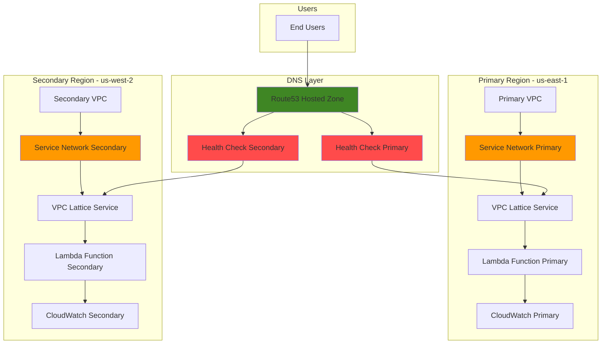

# Cross-Region Service Failover with VPC Lattice and Route53

## Problem

Modern distributed applications require high availability across multiple AWS regions to meet strict SLA requirements and minimize customer impact during regional outages. Organizations struggle to implement automated failover mechanisms that can seamlessly redirect traffic between regions while maintaining service discovery and security policies across their microservices architecture. Traditional load balancing approaches don't provide the fine-grained control and cross-VPC connectivity needed for complex distributed systems, especially when dealing with application-level health validation rather than simple network connectivity checks.

## Solution

Build a resilient multi-region microservices architecture using VPC Lattice service networks for secure service-to-service communication and Route53 health checks for DNS-based failover. This solution establishes service networks in both primary and secondary regions, deploys health check endpoints using Lambda functions, and configures intelligent DNS routing to automatically detect service failures and redirect traffic to healthy regions while maintaining consistent security policies and observability.

## Architecture Diagram



## Prerequisites

1. AWS account with appropriate permissions for VPC Lattice, Route53, Lambda, and CloudWatch
2. AWS CLI v2 installed and configured (or AWS CloudShell)
3. Advanced understanding of AWS networking, DNS, and microservices architecture
4. Access to create resources in at least two AWS regions (us-east-1 and us-west-2)
5. Domain name or subdomain for health check endpoints
6. Estimated cost: $20-35 for the duration of this recipe (Lambda, VPC Lattice, Route53 hosted zone charges)

> **Note**: This recipe demonstrates advanced networking concepts following AWS Well-Architected Framework reliability principles. Review [AWS disaster recovery strategies](https://docs.aws.amazon.com/whitepapers/latest/disaster-recovery-workloads-on-aws/disaster-recovery-options-in-the-cloud.html) for comprehensive guidance.

## Preparation

```bash
# Set environment variables for primary region
export PRIMARY_REGION="us-east-1"
export SECONDARY_REGION="us-west-2"
export AWS_ACCOUNT_ID=$(aws sts get-caller-identity \
    --query Account --output text)

# Generate unique identifiers for resources
RANDOM_SUFFIX=$(aws secretsmanager get-random-password \
    --exclude-punctuation --exclude-uppercase \
    --password-length 6 --require-each-included-type \
    --output text --query RandomPassword)

# Set resource names
export SERVICE_NETWORK_NAME="microservices-network-${RANDOM_SUFFIX}"
export SERVICE_NAME="api-service-${RANDOM_SUFFIX}"
export FUNCTION_NAME="health-check-service-${RANDOM_SUFFIX}"
export DOMAIN_NAME="api-${RANDOM_SUFFIX}.example.com"

# Create foundational VPCs in both regions
PRIMARY_VPC_ID=$(aws ec2 create-vpc \
    --cidr-block 10.0.0.0/16 \
    --region ${PRIMARY_REGION} \
    --tag-specifications \
    'ResourceType=vpc,Tags=[{Key=Name,Value=primary-vpc-lattice}]' \
    --query 'Vpc.VpcId' --output text)

SECONDARY_VPC_ID=$(aws ec2 create-vpc \
    --cidr-block 10.1.0.0/16 \
    --region ${SECONDARY_REGION} \
    --tag-specifications \
    'ResourceType=vpc,Tags=[{Key=Name,Value=secondary-vpc-lattice}]' \
    --query 'Vpc.VpcId' --output text)

echo "✅ Environment configured with unique suffix: ${RANDOM_SUFFIX}"
echo "Primary VPC: ${PRIMARY_VPC_ID}"
echo "Secondary VPC: ${SECONDARY_VPC_ID}"
```

## Steps

1. **Create VPC Lattice Service Networks in Both Regions**:

   VPC Lattice service networks provide the foundation for secure, cross-VPC service communication without complex routing or firewall rules. By establishing identical service networks in both regions, we create consistent networking policies that enable seamless failover while maintaining security boundaries and traffic control.

   ```bash
   # Create service network in primary region
   aws vpc-lattice create-service-network \
       --name ${SERVICE_NETWORK_NAME} \
       --region ${PRIMARY_REGION} \
       --tags Key=Environment,Value=production \
       Key=Region,Value=primary

   # Store service network ID
   PRIMARY_SERVICE_NETWORK_ID=$(aws vpc-lattice list-service-networks \
       --region ${PRIMARY_REGION} \
       --query "items[?name=='${SERVICE_NETWORK_NAME}'].id" \
       --output text)

   # Create service network in secondary region
   aws vpc-lattice create-service-network \
       --name ${SERVICE_NETWORK_NAME} \
       --region ${SECONDARY_REGION} \
       --tags Key=Environment,Value=production \
       Key=Region,Value=secondary

   # Store secondary service network ID
   SECONDARY_SERVICE_NETWORK_ID=$(aws vpc-lattice list-service-networks \
       --region ${SECONDARY_REGION} \
       --query "items[?name=='${SERVICE_NETWORK_NAME}'].id" \
       --output text)

   echo "✅ Service networks created in both regions"
   echo "Primary: ${PRIMARY_SERVICE_NETWORK_ID}"
   echo "Secondary: ${SECONDARY_SERVICE_NETWORK_ID}"
   ```

2. **Create Health Check Lambda Functions**:

   Lambda functions serve as health check endpoints that VPC Lattice services can expose and Route53 can monitor. These functions provide application-level health validation beyond simple TCP connectivity checks, enabling intelligent failover decisions based on actual service availability and performance metrics.

   ```bash
   # Create Lambda function code for health checks
   cat > health-check-function.py << 'EOF'
import json
import os
import time
from datetime import datetime

def lambda_handler(event, context):
    """
    Health check endpoint that validates service availability
    Returns HTTP 200 for healthy, 503 for unhealthy
    """
    region = os.environ.get('AWS_REGION', 'unknown')
    simulate_failure = os.environ.get('SIMULATE_FAILURE', 'false').lower()
    
    try:
        current_time = datetime.utcnow().isoformat()
        
        # Check for simulated failure from environment variable
        if simulate_failure == 'true':
            health_status = False
        else:
            # Add actual health validation logic here
            # Example: Check database connectivity, external APIs, etc.
            health_status = check_service_health()
        
        if health_status:
            response = {
                'statusCode': 200,
                'headers': {
                    'Content-Type': 'application/json',
                    'X-Health-Check': 'pass'
                },
                'body': json.dumps({
                    'status': 'healthy',
                    'region': region,
                    'timestamp': current_time,
                    'version': '1.0'
                })
            }
        else:
            response = {
                'statusCode': 503,
                'headers': {
                    'Content-Type': 'application/json',
                    'X-Health-Check': 'fail'
                },
                'body': json.dumps({
                    'status': 'unhealthy',
                    'region': region,
                    'timestamp': current_time
                })
            }
            
        return response
        
    except Exception as e:
        return {
            'statusCode': 500,
            'headers': {
                'Content-Type': 'application/json'
            },
            'body': json.dumps({
                'status': 'error',
                'message': str(e),
                'region': region
            })
        }

def check_service_health():
    """
    Implement actual health check logic
    Returns True if healthy, False otherwise
    """
    # Example health checks:
    # - Database connectivity
    # - External API availability
    # - Cache service status
    # - Disk space checks
    return True
EOF

   # Package Lambda function
   zip function.zip health-check-function.py

   echo "✅ Lambda function code prepared"
   ```

3. **Deploy Lambda Functions in Both Regions**:

   Deploy identical Lambda functions across both regions to ensure consistent health check behavior. Each function includes region-specific metadata and can be enhanced with additional health validation logic specific to your application requirements.

   ```bash
   # Create IAM role for Lambda execution
   cat > lambda-trust-policy.json << 'EOF'
{
    "Version": "2012-10-17",
    "Statement": [
        {
            "Effect": "Allow",
            "Principal": {
                "Service": "lambda.amazonaws.com"
            },
            "Action": "sts:AssumeRole"
        }
    ]
}
EOF

   # Create Lambda execution role
   aws iam create-role \
       --role-name lambda-health-check-role-${RANDOM_SUFFIX} \
       --assume-role-policy-document file://lambda-trust-policy.json

   # Attach basic execution policy
   aws iam attach-role-policy \
       --role-name lambda-health-check-role-${RANDOM_SUFFIX} \
       --policy-arn arn:aws:iam::aws:policy/service-role/AWSLambdaBasicExecutionRole

   # Wait for role to be available
   sleep 10

   # Deploy Lambda function in primary region
   aws lambda create-function \
       --region ${PRIMARY_REGION} \
       --function-name ${FUNCTION_NAME}-primary \
       --runtime python3.11 \
       --role arn:aws:iam::${AWS_ACCOUNT_ID}:role/lambda-health-check-role-${RANDOM_SUFFIX} \
       --handler health-check-function.lambda_handler \
       --zip-file fileb://function.zip \
       --timeout 30 \
       --memory-size 256 \
       --tags Environment=production,Region=primary

   # Deploy Lambda function in secondary region
   aws lambda create-function \
       --region ${SECONDARY_REGION} \
       --function-name ${FUNCTION_NAME}-secondary \
       --runtime python3.11 \
       --role arn:aws:iam::${AWS_ACCOUNT_ID}:role/lambda-health-check-role-${RANDOM_SUFFIX} \
       --handler health-check-function.lambda_handler \
       --zip-file fileb://function.zip \
       --timeout 30 \
       --memory-size 256 \
       --tags Environment=production,Region=secondary

   echo "✅ Lambda functions deployed in both regions"
   ```

4. **Create VPC Lattice Services and Target Groups**:

   VPC Lattice services abstract your Lambda functions behind managed networking interfaces that provide load balancing, health checking, and traffic routing capabilities. Target groups define how traffic is distributed and enable sophisticated routing policies based on application requirements.

   ```bash
   # Create target group for primary region Lambda
   PRIMARY_TARGET_GROUP_ID=$(aws vpc-lattice create-target-group \
       --region ${PRIMARY_REGION} \
       --name "health-check-targets-primary-${RANDOM_SUFFIX}" \
       --type LAMBDA \
       --query 'id' --output text)

   # Register Lambda function as target
   aws vpc-lattice register-targets \
       --region ${PRIMARY_REGION} \
       --target-group-identifier ${PRIMARY_TARGET_GROUP_ID} \
       --targets id=arn:aws:lambda:${PRIMARY_REGION}:${AWS_ACCOUNT_ID}:function:${FUNCTION_NAME}-primary

   # Create VPC Lattice service in primary region
   PRIMARY_SERVICE_ID=$(aws vpc-lattice create-service \
       --region ${PRIMARY_REGION} \
       --name ${SERVICE_NAME}-primary \
       --query 'id' --output text)

   # Create listener for the service
   aws vpc-lattice create-listener \
       --region ${PRIMARY_REGION} \
       --service-identifier ${PRIMARY_SERVICE_ID} \
       --name health-check-listener \
       --protocol HTTPS \
       --port 443 \
       --default-action forward='{targetGroups=[{targetGroupIdentifier='${PRIMARY_TARGET_GROUP_ID}'}]}'

   # Repeat for secondary region
   SECONDARY_TARGET_GROUP_ID=$(aws vpc-lattice create-target-group \
       --region ${SECONDARY_REGION} \
       --name "health-check-targets-secondary-${RANDOM_SUFFIX}" \
       --type LAMBDA \
       --query 'id' --output text)

   aws vpc-lattice register-targets \
       --region ${SECONDARY_REGION} \
       --target-group-identifier ${SECONDARY_TARGET_GROUP_ID} \
       --targets id=arn:aws:lambda:${SECONDARY_REGION}:${AWS_ACCOUNT_ID}:function:${FUNCTION_NAME}-secondary

   SECONDARY_SERVICE_ID=$(aws vpc-lattice create-service \
       --region ${SECONDARY_REGION} \
       --name ${SERVICE_NAME}-secondary \
       --query 'id' --output text)

   aws vpc-lattice create-listener \
       --region ${SECONDARY_REGION} \
       --service-identifier ${SECONDARY_SERVICE_ID} \
       --name health-check-listener \
       --protocol HTTPS \
       --port 443 \
       --default-action forward='{targetGroups=[{targetGroupIdentifier='${SECONDARY_TARGET_GROUP_ID}'}]}'

   echo "✅ VPC Lattice services created with target groups"
   ```

5. **Associate Services with Service Networks**:

   Service network associations enable services to communicate across VPCs and regions while maintaining security boundaries. This step establishes the connectivity that allows Route53 health checks to reach your services through the VPC Lattice managed infrastructure.

   ```bash
   # Associate primary service with service network
   aws vpc-lattice create-service-network-service-association \
       --region ${PRIMARY_REGION} \
       --service-network-identifier ${PRIMARY_SERVICE_NETWORK_ID} \
       --service-identifier ${PRIMARY_SERVICE_ID}

   # Associate secondary service with service network
   aws vpc-lattice create-service-network-service-association \
       --region ${SECONDARY_REGION} \
       --service-network-identifier ${SECONDARY_SERVICE_NETWORK_ID} \
       --service-identifier ${SECONDARY_SERVICE_ID}

   # Wait for services to be active
   sleep 30

   # Get service DNS names for health checks
   PRIMARY_SERVICE_DNS=$(aws vpc-lattice get-service \
       --region ${PRIMARY_REGION} \
       --service-identifier ${PRIMARY_SERVICE_ID} \
       --query 'dnsEntry.domainName' --output text)

   SECONDARY_SERVICE_DNS=$(aws vpc-lattice get-service \
       --region ${SECONDARY_REGION} \
       --service-identifier ${SECONDARY_SERVICE_ID} \
       --query 'dnsEntry.domainName' --output text)

   echo "✅ Services associated with service networks"
   echo "Primary DNS: ${PRIMARY_SERVICE_DNS}"
   echo "Secondary DNS: ${SECONDARY_SERVICE_DNS}"
   ```

6. **Create Route53 Health Checks**:

   Route53 health checks continuously monitor your VPC Lattice services from multiple AWS edge locations worldwide. These health checks provide the intelligence needed for DNS failover by detecting service failures and automatically updating DNS responses to route traffic to healthy endpoints.

   ```bash
   # Create health check for primary region
   PRIMARY_HEALTH_CHECK_ID=$(aws route53 create-health-check \
       --caller-reference "primary-health-check-${RANDOM_SUFFIX}" \
       --health-check-config '{
           "Type": "HTTPS",
           "ResourcePath": "/",
           "FullyQualifiedDomainName": "'${PRIMARY_SERVICE_DNS}'",
           "Port": 443,
           "RequestInterval": 30,
           "FailureThreshold": 3
       }' \
       --query 'HealthCheck.Id' --output text)

   # Tag the health check
   aws route53 change-tags-for-resource \
       --resource-type healthcheck \
       --resource-id ${PRIMARY_HEALTH_CHECK_ID} \
       --add-tags Key=Name,Value=primary-service-health \
       Key=Region,Value=${PRIMARY_REGION}

   # Create health check for secondary region
   SECONDARY_HEALTH_CHECK_ID=$(aws route53 create-health-check \
       --caller-reference "secondary-health-check-${RANDOM_SUFFIX}" \
       --health-check-config '{
           "Type": "HTTPS",
           "ResourcePath": "/",
           "FullyQualifiedDomainName": "'${SECONDARY_SERVICE_DNS}'",
           "Port": 443,
           "RequestInterval": 30,
           "FailureThreshold": 3
       }' \
       --query 'HealthCheck.Id' --output text)

   aws route53 change-tags-for-resource \
       --resource-type healthcheck \
       --resource-id ${SECONDARY_HEALTH_CHECK_ID} \
       --add-tags Key=Name,Value=secondary-service-health \
       Key=Region,Value=${SECONDARY_REGION}

   echo "✅ Route53 health checks created"
   echo "Primary Health Check: ${PRIMARY_HEALTH_CHECK_ID}"
   echo "Secondary Health Check: ${SECONDARY_HEALTH_CHECK_ID}"
   ```

7. **Create Route53 Hosted Zone and DNS Records**:

   The hosted zone and DNS records implement the failover logic that automatically routes traffic between regions based on health check status. This configuration enables active-passive failover with automatic recovery when the primary region becomes healthy again.

   ```bash
   # Create hosted zone (replace with your actual domain)
   HOSTED_ZONE_ID=$(aws route53 create-hosted-zone \
       --name ${DOMAIN_NAME} \
       --caller-reference "failover-zone-${RANDOM_SUFFIX}" \
       --query 'HostedZone.Id' --output text | cut -d'/' -f3)

   # Create primary DNS record with failover routing
   aws route53 change-resource-record-sets \
       --hosted-zone-id ${HOSTED_ZONE_ID} \
       --change-batch '{
           "Comment": "Create primary failover record",
           "Changes": [{
               "Action": "CREATE",
               "ResourceRecordSet": {
                   "Name": "'${DOMAIN_NAME}'",
                   "Type": "CNAME",
                   "SetIdentifier": "primary",
                   "Failover": "PRIMARY",
                   "TTL": 60,
                   "ResourceRecords": [{"Value": "'${PRIMARY_SERVICE_DNS}'"}],
                   "HealthCheckId": "'${PRIMARY_HEALTH_CHECK_ID}'"
               }
           }]
       }'

   # Create secondary DNS record with failover routing
   aws route53 change-resource-record-sets \
       --hosted-zone-id ${HOSTED_ZONE_ID} \
       --change-batch '{
           "Comment": "Create secondary failover record",
           "Changes": [{
               "Action": "CREATE",
               "ResourceRecordSet": {
                   "Name": "'${DOMAIN_NAME}'",
                   "Type": "CNAME",
                   "SetIdentifier": "secondary",
                   "Failover": "SECONDARY",
                   "TTL": 60,
                   "ResourceRecords": [{"Value": "'${SECONDARY_SERVICE_DNS}'"}]
               }
           }]
       }'

   echo "✅ DNS failover records created"
   echo "Domain: ${DOMAIN_NAME}"
   echo "Hosted Zone: ${HOSTED_ZONE_ID}"
   ```

8. **Configure CloudWatch Monitoring and Alarms**:

   CloudWatch monitoring provides observability into health check status and enables proactive alerting when failover events occur. This monitoring setup helps teams understand system behavior and optimize failover thresholds based on actual performance patterns.

   ```bash
   # Create CloudWatch alarm for primary health check
   aws cloudwatch put-metric-alarm \
       --region ${PRIMARY_REGION} \
       --alarm-name "Primary-Service-Health-${RANDOM_SUFFIX}" \
       --alarm-description "Monitor primary region service health" \
       --metric-name HealthCheckStatus \
       --namespace AWS/Route53 \
       --statistic Minimum \
       --period 60 \
       --threshold 1 \
       --comparison-operator LessThanThreshold \
       --evaluation-periods 2 \
       --dimensions Name=HealthCheckId,Value=${PRIMARY_HEALTH_CHECK_ID}

   # Create CloudWatch alarm for secondary health check
   aws cloudwatch put-metric-alarm \
       --region ${SECONDARY_REGION} \
       --alarm-name "Secondary-Service-Health-${RANDOM_SUFFIX}" \
       --alarm-description "Monitor secondary region service health" \
       --metric-name HealthCheckStatus \
       --namespace AWS/Route53 \
       --statistic Minimum \
       --period 60 \
       --threshold 1 \
       --comparison-operator LessThanThreshold \
       --evaluation-periods 2 \
       --dimensions Name=HealthCheckId,Value=${SECONDARY_HEALTH_CHECK_ID}

   echo "✅ CloudWatch monitoring configured"
   ```

## Validation & Testing

1. **Verify Health Check Status**:

   ```bash
   # Check primary health check status
   aws route53 get-health-check \
       --health-check-id ${PRIMARY_HEALTH_CHECK_ID} \
       --query 'StatusList[0].Status'

   # Check secondary health check status
   aws route53 get-health-check \
       --health-check-id ${SECONDARY_HEALTH_CHECK_ID} \
       --query 'StatusList[0].Status'
   ```

   Expected output: Both health checks should show "Success"

2. **Test DNS Resolution**:

   ```bash
   # Test DNS resolution
   nslookup ${DOMAIN_NAME}
   
   # Test with dig for detailed information
   dig ${DOMAIN_NAME} CNAME
   ```

   Expected output: DNS should resolve to the primary service DNS name

3. **Test Service Response Directly**:

   ```bash
   # Test primary service response
   curl -k https://${PRIMARY_SERVICE_DNS}
   
   # Test secondary service response  
   curl -k https://${SECONDARY_SERVICE_DNS}
   ```

   Expected output: JSON response indicating healthy status

4. **Test Failover Behavior**:

   ```bash
   # Simulate primary region failure by updating Lambda function
   aws lambda put-function-configuration \
       --region ${PRIMARY_REGION} \
       --function-name ${FUNCTION_NAME}-primary \
       --environment 'Variables={SIMULATE_FAILURE=true}'

   # Wait for health check to detect failure (approximately 2-3 minutes)
   echo "Waiting for health check to detect failure..."
   sleep 180

   # Check DNS resolution again
   dig ${DOMAIN_NAME} CNAME
   ```

   Expected output: DNS should now resolve to the secondary service DNS name

5. **Verify CloudWatch Metrics**:

   ```bash
   # Check Route53 health check metrics
   aws cloudwatch get-metric-statistics \
       --namespace AWS/Route53 \
       --metric-name HealthCheckStatus \
       --dimensions Name=HealthCheckId,Value=${PRIMARY_HEALTH_CHECK_ID} \
       --start-time $(date -u -d '10 minutes ago' +%Y-%m-%dT%H:%M:%S) \
       --end-time $(date -u +%Y-%m-%dT%H:%M:%S) \
       --period 300 \
       --statistics Average
   ```

   Expected output: Metrics showing health check status changes

## Cleanup

1. **Remove Route53 Resources**:

   ```bash
   # Delete DNS records
   aws route53 change-resource-record-sets \
       --hosted-zone-id ${HOSTED_ZONE_ID} \
       --change-batch '{
           "Changes": [
               {
                   "Action": "DELETE",
                   "ResourceRecordSet": {
                       "Name": "'${DOMAIN_NAME}'",
                       "Type": "CNAME",
                       "SetIdentifier": "primary",
                       "Failover": "PRIMARY",
                       "TTL": 60,
                       "ResourceRecords": [{"Value": "'${PRIMARY_SERVICE_DNS}'"}],
                       "HealthCheckId": "'${PRIMARY_HEALTH_CHECK_ID}'"
                   }
               },
               {
                   "Action": "DELETE",
                   "ResourceRecordSet": {
                       "Name": "'${DOMAIN_NAME}'",
                       "Type": "CNAME",
                       "SetIdentifier": "secondary", 
                       "Failover": "SECONDARY",
                       "TTL": 60,
                       "ResourceRecords": [{"Value": "'${SECONDARY_SERVICE_DNS}'"}]
                   }
               }
           ]
       }'

   # Delete health checks
   aws route53 delete-health-check \
       --health-check-id ${PRIMARY_HEALTH_CHECK_ID}
   aws route53 delete-health-check \
       --health-check-id ${SECONDARY_HEALTH_CHECK_ID}

   # Delete hosted zone
   aws route53 delete-hosted-zone \
       --id ${HOSTED_ZONE_ID}

   echo "✅ Route53 resources deleted"
   ```

2. **Remove VPC Lattice Resources**:

   ```bash
   # Delete service network associations
   aws vpc-lattice delete-service-network-service-association \
       --region ${PRIMARY_REGION} \
       --service-network-service-association-identifier \
       $(aws vpc-lattice list-service-network-service-associations \
           --region ${PRIMARY_REGION} \
           --service-network-identifier ${PRIMARY_SERVICE_NETWORK_ID} \
           --query 'items[0].id' --output text)

   aws vpc-lattice delete-service-network-service-association \
       --region ${SECONDARY_REGION} \
       --service-network-service-association-identifier \
       $(aws vpc-lattice list-service-network-service-associations \
           --region ${SECONDARY_REGION} \
           --service-network-identifier ${SECONDARY_SERVICE_NETWORK_ID} \
           --query 'items[0].id' --output text)

   # Delete services
   aws vpc-lattice delete-service \
       --region ${PRIMARY_REGION} \
       --service-identifier ${PRIMARY_SERVICE_ID}
   aws vpc-lattice delete-service \
       --region ${SECONDARY_REGION} \
       --service-identifier ${SECONDARY_SERVICE_ID}

   # Delete target groups
   aws vpc-lattice delete-target-group \
       --region ${PRIMARY_REGION} \
       --target-group-identifier ${PRIMARY_TARGET_GROUP_ID}
   aws vpc-lattice delete-target-group \
       --region ${SECONDARY_REGION} \
       --target-group-identifier ${SECONDARY_TARGET_GROUP_ID}

   # Delete service networks
   aws vpc-lattice delete-service-network \
       --region ${PRIMARY_REGION} \
       --service-network-identifier ${PRIMARY_SERVICE_NETWORK_ID}
   aws vpc-lattice delete-service-network \
       --region ${SECONDARY_REGION} \
       --service-network-identifier ${SECONDARY_SERVICE_NETWORK_ID}

   echo "✅ VPC Lattice resources deleted"
   ```

3. **Remove Lambda Functions and IAM Role**:

   ```bash
   # Delete Lambda functions
   aws lambda delete-function \
       --region ${PRIMARY_REGION} \
       --function-name ${FUNCTION_NAME}-primary
   aws lambda delete-function \
       --region ${SECONDARY_REGION} \
       --function-name ${FUNCTION_NAME}-secondary

   # Detach and delete IAM role
   aws iam detach-role-policy \
       --role-name lambda-health-check-role-${RANDOM_SUFFIX} \
       --policy-arn arn:aws:iam::aws:policy/service-role/AWSLambdaBasicExecutionRole
   aws iam delete-role \
       --role-name lambda-health-check-role-${RANDOM_SUFFIX}

   # Clean up local files
   rm -f function.zip health-check-function.py lambda-trust-policy.json

   echo "✅ Lambda functions and IAM resources deleted"
   ```

4. **Remove CloudWatch Alarms and VPCs**:

   ```bash
   # Delete CloudWatch alarms
   aws cloudwatch delete-alarms \
       --region ${PRIMARY_REGION} \
       --alarm-names "Primary-Service-Health-${RANDOM_SUFFIX}"
   aws cloudwatch delete-alarms \
       --region ${SECONDARY_REGION} \
       --alarm-names "Secondary-Service-Health-${RANDOM_SUFFIX}"

   # Delete VPCs (optional - only if created for this recipe)
   aws ec2 delete-vpc \
       --region ${PRIMARY_REGION} \
       --vpc-id ${PRIMARY_VPC_ID}
   aws ec2 delete-vpc \
       --region ${SECONDARY_REGION} \
       --vpc-id ${SECONDARY_VPC_ID}

   echo "✅ CloudWatch alarms and VPCs deleted"
   ```

## Discussion

This recipe demonstrates a sophisticated approach to cross-region failover using VPC Lattice and Route53 that addresses several critical aspects of modern distributed systems architecture. VPC Lattice provides a service mesh-like experience that simplifies microservices connectivity across VPCs and regions without requiring complex networking configuration or service discovery mechanisms. Unlike traditional approaches that rely on load balancers or API gateways, VPC Lattice offers native AWS integration with fine-grained security policies and automatic traffic management capabilities.

The Route53 health checking mechanism provides global DNS-based failover that operates at the application layer rather than just network connectivity. This approach enables more intelligent failover decisions based on actual service health rather than simple ping tests. The health checks run from multiple AWS edge locations worldwide, providing distributed monitoring that reduces false positives from localized network issues. The 30-second check interval with a failure threshold of 3 attempts balances responsiveness with stability, typically triggering failover within 2-3 minutes of an actual service failure.

The Lambda-based health check endpoints offer several advantages over static endpoints. They can implement sophisticated health validation logic including database connectivity tests, external API availability checks, and application-specific health criteria. This enables failover decisions based on the actual capability to serve traffic rather than mere process availability. Additionally, Lambda functions provide cost-effective, serverless health endpoints that scale automatically and require minimal operational overhead.

One key architectural decision is the use of separate service networks in each region rather than a single cross-region network. This approach provides better isolation and performance while enabling independent scaling and security policies per region. The trade-off is additional configuration complexity, but this is offset by improved fault isolation and the ability to implement region-specific optimizations. Organizations should consider their specific requirements for cross-region latency, compliance, and data residency when choosing between these approaches.

> **Tip**: Configure custom CloudWatch dashboards to visualize health check metrics, failover events, and regional traffic patterns. This observability enables proactive optimization of failover thresholds and helps identify performance trends across regions.

For production deployments, consider implementing more sophisticated health check logic that validates not just service availability but also performance metrics like response time and error rates. The health check endpoints can be enhanced to return different HTTP status codes based on degraded performance, enabling Route53 to implement more nuanced routing decisions. Additionally, consider implementing automated notifications using SNS when failover events occur to ensure operational teams are aware of regional issues requiring investigation.

**Documentation References:**
- [Amazon VPC Lattice User Guide](https://docs.aws.amazon.com/vpc-lattice/latest/ug/what-is-vpc-lattice.html)
- [Route53 DNS Failover Configuration](https://docs.aws.amazon.com/Route53/latest/DeveloperGuide/dns-failover-configuring.html)
- [Route53 Health Check Types](https://docs.aws.amazon.com/Route53/latest/DeveloperGuide/health-checks-types.html)
- [AWS Well-Architected Reliability Pillar](https://docs.aws.amazon.com/wellarchitected/latest/reliability-pillar/welcome.html)
- [AWS Disaster Recovery Strategies](https://docs.aws.amazon.com/whitepapers/latest/disaster-recovery-workloads-on-aws/disaster-recovery-options-in-the-cloud.html)

## Challenge

Extend this solution by implementing these enhancements:

1. **Multi-Region Active-Active Configuration**: Modify the Route53 configuration to use weighted routing policies instead of failover, distributing traffic across both regions simultaneously while maintaining health check-based traffic shifting for performance optimization.

2. **Database Failover Integration**: Add RDS with cross-region read replicas and implement automated database failover logic in the health check functions that validates both application and database connectivity before reporting healthy status.

3. **Blue-Green Deployment Integration**: Enhance the VPC Lattice services to support blue-green deployments within each region by implementing multiple target groups and automated traffic shifting based on deployment validation results.

4. **Advanced Health Check Logic**: Implement comprehensive health checks that validate external dependencies, measure response times, and check application-specific metrics like queue depth or cache hit rates before reporting service health.

5. **Cross-Region Service Mesh**: Extend the architecture to support service-to-service communication across regions using VPC Lattice service networks with automated service discovery and traffic encryption for a complete multi-region microservices mesh.

## Infrastructure Code

*Infrastructure code will be generated after recipe approval.*