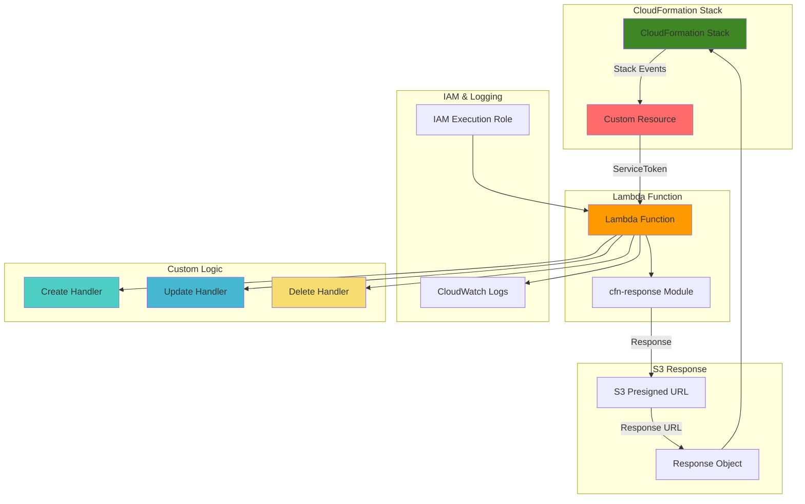

# Custom CloudFormation Resources with Lambda

## Problem

Enterprise infrastructure teams often need to provision resources or execute custom logic that isn't natively supported by CloudFormation's built-in resource types. This creates gaps in infrastructure-as-code workflows, forcing teams to use manual processes or external automation tools. Without the ability to extend CloudFormation's capabilities, organizations struggle to maintain consistent, repeatable deployment processes for complex enterprise requirements like custom certificate generation, third-party service integration, or specialized resource configurations.

## Solution

Lambda-backed custom resources provide a powerful mechanism to extend CloudFormation's native capabilities by executing custom provisioning logic through AWS Lambda functions. This approach enables you to implement Create, Update, and Delete operations for any resource type while maintaining CloudFormation's declarative infrastructure model. The solution leverages CloudFormation's event-driven architecture to trigger Lambda functions during stack lifecycle events, allowing seamless integration of custom logic with native AWS resource management.

## Architecture Diagram



## Prerequisites

1. AWS account with appropriate permissions for CloudFormation, Lambda, IAM, and S3
2. AWS CLI v2 installed and configured (or AWS CloudShell)
3. Basic understanding of CloudFormation templates and Lambda functions
4. Python programming knowledge for Lambda function development
5. Estimated cost: $1-5 for Lambda execution, CloudWatch logs, and S3 storage

> **Note**: Custom resources are powerful but require careful error handling and response management to prevent stack rollback issues.

## Preparation

```bash
# Set environment variables
export AWS_REGION=$(aws configure get region)
export AWS_ACCOUNT_ID=$(aws sts get-caller-identity \
    --query Account --output text)

# Generate unique identifiers for resources
RANDOM_SUFFIX=$(aws secretsmanager get-random-password \
    --exclude-punctuation --exclude-uppercase \
    --password-length 8 --require-each-included-type \
    --output text --query RandomPassword)

export STACK_NAME="custom-resource-demo-${RANDOM_SUFFIX}"
export LAMBDA_FUNCTION_NAME="custom-resource-handler-${RANDOM_SUFFIX}"
export IAM_ROLE_NAME="CustomResourceLambdaRole-${RANDOM_SUFFIX}"
export S3_BUCKET_NAME="custom-resource-data-${RANDOM_SUFFIX}"

# Create S3 bucket for demonstration data
aws s3 mb s3://${S3_BUCKET_NAME} --region ${AWS_REGION}

echo "✅ Environment variables set and S3 bucket created"
echo "Stack Name: ${STACK_NAME}"
echo "Lambda Function: ${LAMBDA_FUNCTION_NAME}"
echo "S3 Bucket: ${S3_BUCKET_NAME}"
```

## Steps

1. **Create IAM Role for Lambda Function**:

   Lambda functions require an execution role to access AWS services on your behalf. This role follows the principle of least privilege, granting only the minimum permissions necessary for your custom resource operations. The execution role establishes the security boundary for your Lambda function, ensuring controlled access to AWS resources while maintaining operational security. Understanding IAM roles is fundamental to building secure serverless applications, as documented in the [Lambda execution role guide](https://docs.aws.amazon.com/lambda/latest/dg/lambda-intro-execution-role.html).

   ```bash
   # Create trust policy for Lambda service
   cat > trust-policy.json << EOF
   {
     "Version": "2012-10-17",
     "Statement": [
       {
         "Effect": "Allow",
         "Principal": {
           "Service": "lambda.amazonaws.com"
         },
         "Action": "sts:AssumeRole"
       }
     ]
   }
   EOF
   
   # Create IAM role
   aws iam create-role \
       --role-name ${IAM_ROLE_NAME} \
       --assume-role-policy-document file://trust-policy.json
   
   # Attach basic Lambda execution policy
   aws iam attach-role-policy \
       --role-name ${IAM_ROLE_NAME} \
       --policy-arn arn:aws:iam::aws:policy/service-role/AWSLambdaBasicExecutionRole
   
   # Create custom policy for S3 access
   cat > s3-policy.json << EOF
   {
     "Version": "2012-10-17",
     "Statement": [
       {
         "Effect": "Allow",
         "Action": [
           "s3:GetObject",
           "s3:PutObject",
           "s3:DeleteObject",
           "s3:ListBucket"
         ],
         "Resource": [
           "arn:aws:s3:::${S3_BUCKET_NAME}",
           "arn:aws:s3:::${S3_BUCKET_NAME}/*"
         ]
       }
     ]
   }
   EOF
   
   # Create and attach S3 policy
   aws iam create-policy \
       --policy-name CustomResourceS3Policy-${RANDOM_SUFFIX} \
       --policy-document file://s3-policy.json
   
   aws iam attach-role-policy \
       --role-name ${IAM_ROLE_NAME} \
       --policy-arn arn:aws:iam::${AWS_ACCOUNT_ID}:policy/CustomResourceS3Policy-${RANDOM_SUFFIX}
   
   # Get role ARN
   ROLE_ARN=$(aws iam get-role \
       --role-name ${IAM_ROLE_NAME} \
       --query Role.Arn --output text)
   
   echo "✅ IAM role created: ${ROLE_ARN}"
   ```

   The IAM role is now established with the necessary permissions to execute Lambda functions and access S3 resources. This role will be attached to your Lambda function, enabling it to write logs to CloudWatch and perform S3 operations. The role ARN serves as a unique identifier that CloudFormation will use to associate the execution permissions with the Lambda function.

2. **Create Lambda Function Code**:

   Custom resources bridge the gap between CloudFormation's declarative model and custom business logic. The Lambda function serves as the execution engine for your custom resource, implementing the three essential lifecycle operations: CREATE, UPDATE, and DELETE. This pattern enables you to extend CloudFormation's capabilities while maintaining the infrastructure-as-code paradigm. The function must handle CloudFormation's event-driven communication protocol, processing resource properties and responding with appropriate status codes as detailed in the [Lambda-backed custom resources documentation](https://docs.aws.amazon.com/AWSCloudFormation/latest/UserGuide/template-custom-resources-lambda.html).

   ```bash
   # Create Lambda function code
   cat > lambda_function.py << 'EOF'
   import json
   import boto3
   import cfnresponse
   import logging
   from datetime import datetime
   
   # Configure logging
   logger = logging.getLogger()
   logger.setLevel(logging.INFO)
   
   # Initialize AWS clients
   s3 = boto3.client('s3')
   
   def lambda_handler(event, context):
       """
       Lambda function to handle custom resource operations
       """
       try:
           logger.info(f"Received event: {json.dumps(event)}")
           
           # Extract event properties
           request_type = event['RequestType']
           resource_properties = event.get('ResourceProperties', {})
           physical_resource_id = event.get('PhysicalResourceId', 'CustomResource')
           
           # Initialize response data
           response_data = {}
           
           if request_type == 'Create':
               logger.info("Processing CREATE request")
               response_data = handle_create(resource_properties, physical_resource_id)
               
           elif request_type == 'Update':
               logger.info("Processing UPDATE request")
               response_data = handle_update(resource_properties, physical_resource_id)
               
           elif request_type == 'Delete':
               logger.info("Processing DELETE request")
               response_data = handle_delete(resource_properties, physical_resource_id)
               
           else:
               logger.error(f"Unknown request type: {request_type}")
               cfnresponse.send(event, context, cfnresponse.FAILED, {}, physical_resource_id)
               return
           
           # Send success response
           cfnresponse.send(event, context, cfnresponse.SUCCESS, response_data, physical_resource_id)
           
       except Exception as e:
           logger.error(f"Error processing request: {str(e)}")
           cfnresponse.send(event, context, cfnresponse.FAILED, {}, physical_resource_id)
   
   def handle_create(properties, physical_resource_id):
       """
       Handle resource creation
       """
       try:
           # Get configuration from properties
           bucket_name = properties.get('BucketName')
           file_name = properties.get('FileName', 'custom-resource-data.json')
           data_content = properties.get('DataContent', {})
           
           # Create data object
           data_object = {
               'created_at': datetime.utcnow().isoformat(),
               'resource_id': physical_resource_id,
               'configuration': data_content,
               'operation': 'CREATE'
           }
           
           # Upload to S3
           s3.put_object(
               Bucket=bucket_name,
               Key=file_name,
               Body=json.dumps(data_object, indent=2),
               ContentType='application/json'
           )
           
           logger.info(f"Created object {file_name} in bucket {bucket_name}")
           
           # Return response data
           return {
               'BucketName': bucket_name,
               'FileName': file_name,
               'DataUrl': f"https://{bucket_name}.s3.amazonaws.com/{file_name}",
               'CreatedAt': data_object['created_at']
           }
           
       except Exception as e:
           logger.error(f"Error in handle_create: {str(e)}")
           raise
   
   def handle_update(properties, physical_resource_id):
       """
       Handle resource updates
       """
       try:
           # Get configuration from properties
           bucket_name = properties.get('BucketName')
           file_name = properties.get('FileName', 'custom-resource-data.json')
           data_content = properties.get('DataContent', {})
           
           # Try to get existing object
           try:
               response = s3.get_object(Bucket=bucket_name, Key=file_name)
               existing_data = json.loads(response['Body'].read())
           except s3.exceptions.NoSuchKey:
               existing_data = {}
           
           # Update data object
           data_object = {
               'created_at': existing_data.get('created_at', datetime.utcnow().isoformat()),
               'updated_at': datetime.utcnow().isoformat(),
               'resource_id': physical_resource_id,
               'configuration': data_content,
               'operation': 'UPDATE'
           }
           
           # Upload updated object to S3
           s3.put_object(
               Bucket=bucket_name,
               Key=file_name,
               Body=json.dumps(data_object, indent=2),
               ContentType='application/json'
           )
           
           logger.info(f"Updated object {file_name} in bucket {bucket_name}")
           
           # Return response data
           return {
               'BucketName': bucket_name,
               'FileName': file_name,
               'DataUrl': f"https://{bucket_name}.s3.amazonaws.com/{file_name}",
               'UpdatedAt': data_object['updated_at']
           }
           
       except Exception as e:
           logger.error(f"Error in handle_update: {str(e)}")
           raise
   
   def handle_delete(properties, physical_resource_id):
       """
       Handle resource deletion
       """
       try:
           # Get configuration from properties
           bucket_name = properties.get('BucketName')
           file_name = properties.get('FileName', 'custom-resource-data.json')
           
           # Delete object from S3
           try:
               s3.delete_object(Bucket=bucket_name, Key=file_name)
               logger.info(f"Deleted object {file_name} from bucket {bucket_name}")
           except Exception as e:
               logger.warning(f"Could not delete object: {str(e)}")
           
           # Return response data
           return {
               'BucketName': bucket_name,
               'FileName': file_name,
               'DeletedAt': datetime.utcnow().isoformat()
           }
           
       except Exception as e:
           logger.error(f"Error in handle_delete: {str(e)}")
           raise
   EOF
   
   # Create deployment package
   zip lambda-function.zip lambda_function.py
   
   echo "✅ Lambda function code created and packaged"
   ```

   The Lambda function code is now packaged and ready for deployment. This implementation handles the complete lifecycle of custom resources, including proper error handling, logging, and response formatting. The code follows AWS Lambda best practices for reliability and maintainability, ensuring consistent behavior across all custom resource operations.

3. **Deploy Lambda Function**:

   Deploying the Lambda function makes your custom resource handler available to CloudFormation. The function configuration includes runtime settings, memory allocation, and timeout values that impact performance and cost. Lambda functions provide serverless compute capacity, automatically scaling based on demand while maintaining high availability. The deployment process registers the function with AWS Lambda service, making it accessible via the function ARN that CloudFormation will use as the ServiceToken.

   ```bash
   # Wait for IAM role to be fully available
   sleep 10
   
   # Create Lambda function
   aws lambda create-function \
       --function-name ${LAMBDA_FUNCTION_NAME} \
       --runtime python3.9 \
       --role ${ROLE_ARN} \
       --handler lambda_function.lambda_handler \
       --zip-file fileb://lambda-function.zip \
       --timeout 60 \
       --memory-size 256 \
       --description "Custom resource handler for CloudFormation"
   
   # Get Lambda function ARN
   LAMBDA_ARN=$(aws lambda get-function \
       --function-name ${LAMBDA_FUNCTION_NAME} \
       --query Configuration.FunctionArn --output text)
   
   echo "✅ Lambda function created: ${LAMBDA_ARN}"
   ```

   The Lambda function is now deployed and ready to process custom resource requests. The function ARN serves as the unique identifier that CloudFormation will use to invoke your custom resource handler. This establishes the connection between your infrastructure template and the custom provisioning logic, enabling seamless integration with CloudFormation's deployment engine.

4. **Create CloudFormation Template with Custom Resource**:

   CloudFormation templates define infrastructure resources using a declarative syntax. Custom resources extend this capability by allowing you to define resources that aren't natively supported by CloudFormation. The ServiceToken property creates the link between your template and the Lambda function, while ResourceProperties pass configuration data to your custom logic. This approach maintains CloudFormation's dependency management and rollback capabilities while enabling custom provisioning workflows. The template structure follows CloudFormation best practices as outlined in the [template syntax documentation](https://docs.aws.amazon.com/AWSCloudFormation/latest/UserGuide/resources-section-structure.html).

   ```bash
   # Create CloudFormation template
   cat > custom-resource-template.yaml << EOF
   AWSTemplateFormatVersion: '2010-09-09'
   Description: 'Demo stack with Lambda-backed custom resource'
   
   Parameters:
     LambdaFunctionArn:
       Type: String
       Description: ARN of the Lambda function for custom resource
     S3BucketName:
       Type: String
       Description: S3 bucket name for data storage
     DataFileName:
       Type: String
       Default: 'demo-data.json'
       Description: Name of the data file to create
     CustomDataContent:
       Type: String
       Default: '{"environment": "demo", "version": "1.0"}'
       Description: JSON content for the custom data
   
   Resources:
     # Custom Resource that uses Lambda function
     CustomDataResource:
       Type: AWS::CloudFormation::CustomResource
       Properties:
         ServiceToken: !Ref LambdaFunctionArn
         BucketName: !Ref S3BucketName
         FileName: !Ref DataFileName
         DataContent: !Ref CustomDataContent
         Version: '1.0'  # Change this to trigger updates
   
     # Standard S3 bucket for comparison
     DemoS3Bucket:
       Type: AWS::S3::Bucket
       Properties:
         BucketName: !Sub '${S3BucketName}-standard'
         PublicAccessBlockConfiguration:
           BlockPublicAcls: true
           BlockPublicPolicy: true
           IgnorePublicAcls: true
           RestrictPublicBuckets: true
   
     # CloudWatch Log Group for monitoring
     CustomResourceLogGroup:
       Type: AWS::Logs::LogGroup
       Properties:
         LogGroupName: !Sub '/aws/lambda/${LambdaFunctionArn}'
         RetentionInDays: 7
   
   Outputs:
     CustomResourceDataUrl:
       Description: URL of the data file created by custom resource
       Value: !GetAtt CustomDataResource.DataUrl
       Export:
         Name: !Sub '${AWS::StackName}-DataUrl'
     
     CustomResourceFileName:
       Description: Name of the file created by custom resource
       Value: !GetAtt CustomDataResource.FileName
       Export:
         Name: !Sub '${AWS::StackName}-FileName'
     
     CustomResourceBucketName:
       Description: Bucket name used by custom resource
       Value: !GetAtt CustomDataResource.BucketName
       Export:
         Name: !Sub '${AWS::StackName}-BucketName'
     
     CreatedAt:
       Description: Timestamp when resource was created
       Value: !GetAtt CustomDataResource.CreatedAt
       Export:
         Name: !Sub '${AWS::StackName}-CreatedAt'
   EOF
   
   echo "✅ CloudFormation template created"
   ```

   The CloudFormation template now includes both standard AWS resources and your custom resource definition. This hybrid approach demonstrates how custom resources integrate seamlessly with native CloudFormation resources, enabling complex deployment scenarios while maintaining declarative infrastructure management. The template is ready for deployment through the CloudFormation service.

5. **Deploy CloudFormation Stack with Custom Resource**:

   Stack deployment orchestrates the creation of all resources defined in your template. CloudFormation processes dependencies, manages resource ordering, and handles error conditions automatically. When the stack encounters your custom resource, it invokes the Lambda function with the appropriate lifecycle event (CREATE, UPDATE, or DELETE). The stack deployment process validates template syntax, checks resource limits, and ensures proper IAM permissions before beginning resource provisioning.

   ```bash
   # Create CloudFormation stack
   aws cloudformation create-stack \
       --stack-name ${STACK_NAME} \
       --template-body file://custom-resource-template.yaml \
       --parameters ParameterKey=LambdaFunctionArn,ParameterValue=${LAMBDA_ARN} \
                   ParameterKey=S3BucketName,ParameterValue=${S3_BUCKET_NAME} \
                   ParameterKey=DataFileName,ParameterValue=demo-data.json \
                   ParameterKey=CustomDataContent,ParameterValue='{"environment":"production","version":"1.0","features":["logging","monitoring"]}' \
       --capabilities CAPABILITY_IAM
   
   # Wait for stack creation to complete
   echo "⏳ Waiting for stack creation to complete..."
   aws cloudformation wait stack-create-complete \
       --stack-name ${STACK_NAME}
   
   # Check stack status
   STACK_STATUS=$(aws cloudformation describe-stacks \
       --stack-name ${STACK_NAME} \
       --query 'Stacks[0].StackStatus' --output text)
   
   echo "✅ Stack created successfully: ${STACK_STATUS}"
   ```

   The CloudFormation stack is now deployed with your custom resource successfully created. The stack manages the complete lifecycle of both standard AWS resources and your custom resource, providing unified deployment and management capabilities. This establishes the foundation for infrastructure-as-code workflows that include custom provisioning logic.

6. **Test Custom Resource Update Operation**:

   Update operations test the Lambda function's ability to modify existing resources without recreation. CloudFormation uses the physical resource ID to determine whether changes require updates or replacements. This mechanism enables efficient resource management by avoiding unnecessary recreation of stable resources. Understanding update behavior is crucial for maintaining system stability and minimizing deployment downtime, as covered in the [CloudFormation update documentation](https://docs.aws.amazon.com/AWSCloudFormation/latest/UserGuide/stack-failure-options.html).

   ```bash
   # Update the custom resource by changing parameters
   aws cloudformation update-stack \
       --stack-name ${STACK_NAME} \
       --template-body file://custom-resource-template.yaml \
       --parameters ParameterKey=LambdaFunctionArn,ParameterValue=${LAMBDA_ARN} \
                   ParameterKey=S3BucketName,ParameterValue=${S3_BUCKET_NAME} \
                   ParameterKey=DataFileName,ParameterValue=demo-data.json \
                   ParameterKey=CustomDataContent,ParameterValue='{"environment":"production","version":"2.0","features":["logging","monitoring","alerting"],"updated":true}' \
       --capabilities CAPABILITY_IAM
   
   # Wait for update to complete
   echo "⏳ Waiting for stack update to complete..."
   aws cloudformation wait stack-update-complete \
       --stack-name ${STACK_NAME}
   
   echo "✅ Stack updated successfully - custom resource UPDATE operation completed"
   ```

   The custom resource update operation has been successfully processed, demonstrating the Lambda function's ability to handle resource modifications. This validates the complete lifecycle management capabilities of your custom resource implementation, ensuring both CREATE and UPDATE operations function correctly within the CloudFormation deployment model.

> **Warning**: Always ensure your custom resource Lambda function properly handles UPDATE operations. Incorrect implementation can cause stack updates to fail or create inconsistent resource states.

7. **Create Advanced Custom Resource with Error Handling**:

   Production-ready custom resources require comprehensive error handling to prevent stack failures and ensure reliable deployments. Error handling includes input validation, exception management, and graceful degradation strategies. This advanced implementation demonstrates defensive programming practices that protect against common failure scenarios like invalid inputs, service unavailability, and resource conflicts. Proper error handling is essential for maintaining stack stability and providing meaningful feedback to operators during deployment failures.

   ```bash
   # Create advanced Lambda function with better error handling
   cat > advanced_lambda_function.py << 'EOF'
   import json
   import boto3
   import cfnresponse
   import logging
   import traceback
   from datetime import datetime
   
   # Configure logging
   logger = logging.getLogger()
   logger.setLevel(logging.INFO)
   
   # Initialize AWS clients
   s3 = boto3.client('s3')
   
   def lambda_handler(event, context):
       """
       Advanced Lambda function with comprehensive error handling
       """
       physical_resource_id = event.get('PhysicalResourceId', 'AdvancedCustomResource')
       
       try:
           logger.info(f"Received event: {json.dumps(event, default=str)}")
           
           # Validate required properties
           resource_properties = event.get('ResourceProperties', {})
           required_props = ['BucketName']
           
           for prop in required_props:
               if prop not in resource_properties:
                   raise ValueError(f"Missing required property: {prop}")
           
           # Extract event properties
           request_type = event['RequestType']
           
           # Route to appropriate handler
           if request_type == 'Create':
               response_data = handle_create_advanced(resource_properties, physical_resource_id)
           elif request_type == 'Update':
               response_data = handle_update_advanced(resource_properties, physical_resource_id)
           elif request_type == 'Delete':
               response_data = handle_delete_advanced(resource_properties, physical_resource_id)
           else:
               raise ValueError(f"Unknown request type: {request_type}")
           
           # Add standard response data
           response_data['PhysicalResourceId'] = physical_resource_id
           response_data['RequestId'] = event['RequestId']
           response_data['LogicalResourceId'] = event['LogicalResourceId']
           
           logger.info(f"Operation completed successfully: {response_data}")
           cfnresponse.send(event, context, cfnresponse.SUCCESS, response_data, physical_resource_id)
           
       except Exception as e:
           logger.error(f"Error processing request: {str(e)}")
           logger.error(f"Traceback: {traceback.format_exc()}")
           
           # Send failure response with error details
           error_data = {
               'Error': str(e),
               'RequestId': event.get('RequestId', 'unknown'),
               'LogicalResourceId': event.get('LogicalResourceId', 'unknown')
           }
           cfnresponse.send(event, context, cfnresponse.FAILED, error_data, physical_resource_id)
   
   def handle_create_advanced(properties, physical_resource_id):
       """
       Advanced create handler with validation and error handling
       """
       bucket_name = properties['BucketName']
       file_name = properties.get('FileName', 'advanced-data.json')
       data_content = properties.get('DataContent', {})
       
       # Validate bucket exists
       try:
           s3.head_bucket(Bucket=bucket_name)
       except Exception as e:
           raise ValueError(f"Cannot access bucket {bucket_name}: {str(e)}")
       
       # Parse JSON data if string
       if isinstance(data_content, str):
           try:
               data_content = json.loads(data_content)
           except json.JSONDecodeError as e:
               raise ValueError(f"Invalid JSON in DataContent: {str(e)}")
       
       # Create comprehensive data object
       data_object = {
           'metadata': {
               'created_at': datetime.utcnow().isoformat(),
               'resource_id': physical_resource_id,
               'operation': 'CREATE',
               'version': '1.0'
           },
           'configuration': data_content,
           'validation': {
               'bucket_accessible': True,
               'data_format': 'valid'
           }
       }
       
       # Upload to S3 with error handling
       try:
           s3.put_object(
               Bucket=bucket_name,
               Key=file_name,
               Body=json.dumps(data_object, indent=2),
               ContentType='application/json',
               Metadata={
                   'resource-id': physical_resource_id,
                   'operation': 'CREATE'
               }
           )
       except Exception as e:
           raise RuntimeError(f"Failed to upload to S3: {str(e)}")
       
       return {
           'BucketName': bucket_name,
           'FileName': file_name,
           'DataUrl': f"https://{bucket_name}.s3.amazonaws.com/{file_name}",
           'CreatedAt': data_object['metadata']['created_at'],
           'Status': 'SUCCESS'
       }
   
   def handle_update_advanced(properties, physical_resource_id):
       """
       Advanced update handler
       """
       bucket_name = properties['BucketName']
       file_name = properties.get('FileName', 'advanced-data.json')
       data_content = properties.get('DataContent', {})
       
       # Parse JSON data if string
       if isinstance(data_content, str):
           try:
               data_content = json.loads(data_content)
           except json.JSONDecodeError as e:
               raise ValueError(f"Invalid JSON in DataContent: {str(e)}")
       
       # Get existing data
       existing_data = {}
       try:
           response = s3.get_object(Bucket=bucket_name, Key=file_name)
           existing_data = json.loads(response['Body'].read())
       except s3.exceptions.NoSuchKey:
           logger.warning(f"Object {file_name} not found, creating new one")
       
       # Update data object
       data_object = {
           'metadata': {
               'created_at': existing_data.get('metadata', {}).get('created_at', datetime.utcnow().isoformat()),
               'updated_at': datetime.utcnow().isoformat(),
               'resource_id': physical_resource_id,
               'operation': 'UPDATE',
               'version': '2.0'
           },
           'configuration': data_content,
           'validation': {
               'bucket_accessible': True,
               'data_format': 'valid'
           }
       }
       
       # Upload updated object
       s3.put_object(
           Bucket=bucket_name,
           Key=file_name,
           Body=json.dumps(data_object, indent=2),
           ContentType='application/json',
           Metadata={
               'resource-id': physical_resource_id,
               'operation': 'UPDATE'
           }
       )
       
       return {
           'BucketName': bucket_name,
           'FileName': file_name,
           'DataUrl': f"https://{bucket_name}.s3.amazonaws.com/{file_name}",
           'UpdatedAt': data_object['metadata']['updated_at'],
           'Status': 'SUCCESS'
       }
   
   def handle_delete_advanced(properties, physical_resource_id):
       """
       Advanced delete handler with cleanup verification
       """
       bucket_name = properties['BucketName']
       file_name = properties.get('FileName', 'advanced-data.json')
       
       # Delete object with verification
       try:
           s3.delete_object(Bucket=bucket_name, Key=file_name)
           logger.info(f"Deleted object {file_name} from bucket {bucket_name}")
           
           # Verify deletion
           try:
               s3.head_object(Bucket=bucket_name, Key=file_name)
               logger.warning(f"Object {file_name} still exists after deletion")
           except s3.exceptions.NoSuchKey:
               logger.info(f"Confirmed: Object {file_name} successfully deleted")
               
       except s3.exceptions.NoSuchKey:
           logger.info(f"Object {file_name} does not exist, deletion not needed")
       except Exception as e:
           logger.error(f"Error during deletion: {str(e)}")
           # Don't fail on cleanup errors during deletion
       
       return {
           'BucketName': bucket_name,
           'FileName': file_name,
           'DeletedAt': datetime.utcnow().isoformat(),
           'Status': 'SUCCESS'
       }
   EOF
   
   # Create deployment package for advanced function
   zip advanced-lambda-function.zip advanced_lambda_function.py
   
   # Create advanced Lambda function
   ADVANCED_LAMBDA_NAME="advanced-custom-resource-${RANDOM_SUFFIX}"
   aws lambda create-function \
       --function-name ${ADVANCED_LAMBDA_NAME} \
       --runtime python3.9 \
       --role ${ROLE_ARN} \
       --handler advanced_lambda_function.lambda_handler \
       --zip-file fileb://advanced-lambda-function.zip \
       --timeout 60 \
       --memory-size 256 \
       --description "Advanced custom resource handler with error handling"
   
   echo "✅ Advanced Lambda function created: ${ADVANCED_LAMBDA_NAME}"
   ```

   The advanced Lambda function incorporates enterprise-grade error handling and validation patterns. This implementation provides robust exception management, input validation, and detailed logging capabilities that are essential for production deployments. The function demonstrates how to build resilient custom resources that gracefully handle edge cases and provide meaningful error messages.

8. **Monitor Custom Resource Execution**:

   Monitoring provides visibility into custom resource operations, enabling troubleshooting and performance optimization. CloudWatch Logs capture detailed execution information, while CloudFormation events track resource lifecycle changes. This observability is crucial for maintaining reliable infrastructure deployments and identifying potential issues before they impact production systems. Effective monitoring follows AWS best practices for operational excellence as outlined in the [Lambda monitoring documentation](https://docs.aws.amazon.com/lambda/latest/dg/best-practices.html).

   ```bash
   # Check CloudWatch logs for Lambda function
   LOG_GROUP_NAME="/aws/lambda/${LAMBDA_FUNCTION_NAME}"
   
   # Get recent log events
   aws logs describe-log-streams \
       --log-group-name ${LOG_GROUP_NAME} \
       --order-by LastEventTime \
       --descending \
       --max-items 1 \
       --query 'logStreams[0].logStreamName' \
       --output text > latest_stream.txt
   
   LATEST_STREAM=$(cat latest_stream.txt)
   
   if [ "$LATEST_STREAM" != "None" ] && [ "$LATEST_STREAM" != "" ]; then
       echo "📋 Recent CloudWatch logs:"
       aws logs get-log-events \
           --log-group-name ${LOG_GROUP_NAME} \
           --log-stream-name ${LATEST_STREAM} \
           --limit 10 \
           --query 'events[].message' \
           --output table
   fi
   
   # Check stack events for custom resource operations
   echo "📋 CloudFormation stack events:"
   aws cloudformation describe-stack-events \
       --stack-name ${STACK_NAME} \
       --max-items 10 \
       --query 'StackEvents[].{Time:Timestamp,Resource:LogicalResourceId,Status:ResourceStatus,Reason:ResourceStatusReason}' \
       --output table
   
   echo "✅ Custom resource monitoring completed"
   ```

   The monitoring data provides comprehensive visibility into custom resource operations, including execution logs, performance metrics, and error patterns. This information is essential for maintaining operational awareness and troubleshooting deployment issues. The monitoring approach demonstrates how to implement observability for custom resources in production environments.

9. **Test Error Handling and Rollback**:

   Error testing validates the Lambda function's failure handling capabilities and CloudFormation's rollback mechanisms. When custom resources fail, CloudFormation initiates rollback procedures to maintain stack consistency. This testing ensures that failure scenarios are handled gracefully without leaving resources in inconsistent states. Understanding failure modes is critical for building reliable infrastructure automation, as detailed in the [CloudFormation failure handling documentation](https://docs.aws.amazon.com/AWSCloudFormation/latest/UserGuide/determine-root-cause-for-stack-failures.html).

   ```bash
   # Create template with intentional error to test rollback
   cat > error-test-template.yaml << EOF
   AWSTemplateFormatVersion: '2010-09-09'
   Description: 'Test error handling in custom resources'
   
   Parameters:
     LambdaFunctionArn:
       Type: String
       Description: ARN of the Lambda function for custom resource
   
   Resources:
     # Custom Resource with invalid configuration
     ErrorTestResource:
       Type: AWS::CloudFormation::CustomResource
       Properties:
         ServiceToken: !Ref LambdaFunctionArn
         # Missing required BucketName property to trigger error
         FileName: 'error-test.json'
         DataContent: '{"test": "error"}'
   
   Outputs:
     ErrorTestResult:
       Description: This should fail
       Value: !GetAtt ErrorTestResource.BucketName
   EOF
   
   # Attempt to create stack with error
   ERROR_STACK_NAME="error-test-${RANDOM_SUFFIX}"
   
   echo "🧪 Testing error handling..."
   aws cloudformation create-stack \
       --stack-name ${ERROR_STACK_NAME} \
       --template-body file://error-test-template.yaml \
       --parameters ParameterKey=LambdaFunctionArn,ParameterValue=${LAMBDA_ARN} \
       --capabilities CAPABILITY_IAM || echo "Expected failure occurred"
   
   # Wait briefly and check stack status
   sleep 30
   aws cloudformation describe-stacks \
       --stack-name ${ERROR_STACK_NAME} \
       --query 'Stacks[0].{StackName:StackName,Status:StackStatus,StatusReason:StackStatusReason}' \
       --output table 2>/dev/null || echo "Stack failed as expected"
   
   echo "✅ Error handling test completed"
   ```

   The error handling test validates the Lambda function's ability to properly communicate failures to CloudFormation and trigger appropriate rollback procedures. This testing confirms that the custom resource implementation follows CloudFormation's error handling protocols, ensuring stack stability during failure scenarios.

10. **Create Production-Ready Custom Resource Template**:

    Production templates incorporate security best practices, monitoring capabilities, and operational requirements. This comprehensive template demonstrates how to build enterprise-grade custom resources with proper IAM roles, logging configurations, and resource management. The template includes features like encryption, versioning, and lifecycle policies that are essential for production deployments. This approach ensures that custom resources meet organizational standards for security, compliance, and operational excellence.

    ```bash
    # Create comprehensive production template
    cat > production-template.yaml << EOF
    AWSTemplateFormatVersion: '2010-09-09'
    Description: 'Production-ready custom resource implementation'
    
    Parameters:
      Environment:
        Type: String
        Default: 'production'
        AllowedValues: ['development', 'staging', 'production']
        Description: Environment name
      
      ResourceVersion:
        Type: String
        Default: '1.0'
        Description: Version of the custom resource
    
    Resources:
      # IAM Role for Lambda execution
      CustomResourceRole:
        Type: AWS::IAM::Role
        Properties:
          AssumeRolePolicyDocument:
            Version: '2012-10-17'
            Statement:
              - Effect: Allow
                Principal:
                  Service: lambda.amazonaws.com
                Action: sts:AssumeRole
          ManagedPolicyArns:
            - arn:aws:iam::aws:policy/service-role/AWSLambdaBasicExecutionRole
          Policies:
            - PolicyName: CustomResourcePolicy
              PolicyDocument:
                Version: '2012-10-17'
                Statement:
                  - Effect: Allow
                    Action:
                      - s3:GetObject
                      - s3:PutObject
                      - s3:DeleteObject
                      - s3:ListBucket
                    Resource: !Sub 'arn:aws:s3:::${S3Bucket}/*'
                  - Effect: Allow
                    Action:
                      - s3:ListBucket
                    Resource: !Sub 'arn:aws:s3:::${S3Bucket}'
      
      # S3 Bucket for data storage
      S3Bucket:
        Type: AWS::S3::Bucket
        Properties:
          BucketName: !Sub 'custom-resource-${Environment}-${AWS::AccountId}-${AWS::Region}'
          PublicAccessBlockConfiguration:
            BlockPublicAcls: true
            BlockPublicPolicy: true
            IgnorePublicAcls: true
            RestrictPublicBuckets: true
          BucketEncryption:
            ServerSideEncryptionConfiguration:
              - ServerSideEncryptionByDefault:
                  SSEAlgorithm: AES256
          VersioningConfiguration:
            Status: Enabled
          LifecycleConfiguration:
            Rules:
              - Id: DeleteOldVersions
                Status: Enabled
                NoncurrentVersionExpirationInDays: 30
      
      # Lambda function for custom resource
      CustomResourceFunction:
        Type: AWS::Lambda::Function
        Properties:
          FunctionName: !Sub 'custom-resource-${Environment}-${AWS::Region}'
          Runtime: python3.9
          Handler: index.lambda_handler
          Role: !GetAtt CustomResourceRole.Arn
          Timeout: 300
          MemorySize: 256
          Environment:
            Variables:
              ENVIRONMENT: !Ref Environment
              LOG_LEVEL: INFO
          Code:
            ZipFile: |
              import json
              import boto3
              import cfnresponse
              import logging
              from datetime import datetime
              
              logger = logging.getLogger()
              logger.setLevel(logging.INFO)
              
              def lambda_handler(event, context):
                  try:
                      logger.info(f"Event: {json.dumps(event)}")
                      
                      request_type = event['RequestType']
                      properties = event.get('ResourceProperties', {})
                      physical_id = event.get('PhysicalResourceId', 'CustomResourceDemo')
                      
                      response_data = {}
                      
                      if request_type == 'Create':
                          response_data = {'Message': 'Resource created successfully', 'Timestamp': datetime.utcnow().isoformat()}
                      elif request_type == 'Update':
                          response_data = {'Message': 'Resource updated successfully', 'Timestamp': datetime.utcnow().isoformat()}
                      elif request_type == 'Delete':
                          response_data = {'Message': 'Resource deleted successfully', 'Timestamp': datetime.utcnow().isoformat()}
                      
                      cfnresponse.send(event, context, cfnresponse.SUCCESS, response_data, physical_id)
                      
                  except Exception as e:
                      logger.error(f"Error: {str(e)}")
                      cfnresponse.send(event, context, cfnresponse.FAILED, {}, physical_id)
      
      # CloudWatch Log Group
      CustomResourceLogGroup:
        Type: AWS::Logs::LogGroup
        Properties:
          LogGroupName: !Sub '/aws/lambda/${CustomResourceFunction}'
          RetentionInDays: 14
      
      # The actual custom resource
      CustomResourceDemo:
        Type: AWS::CloudFormation::CustomResource
        Properties:
          ServiceToken: !GetAtt CustomResourceFunction.Arn
          Environment: !Ref Environment
          Version: !Ref ResourceVersion
          BucketName: !Ref S3Bucket
    
    Outputs:
      CustomResourceArn:
        Description: ARN of the custom resource Lambda function
        Value: !GetAtt CustomResourceFunction.Arn
        Export:
          Name: !Sub '${AWS::StackName}-CustomResourceArn'
      
      S3BucketName:
        Description: Name of the S3 bucket
        Value: !Ref S3Bucket
        Export:
          Name: !Sub '${AWS::StackName}-S3Bucket'
      
      CustomResourceMessage:
        Description: Message from custom resource
        Value: !GetAtt CustomResourceDemo.Message
        Export:
          Name: !Sub '${AWS::StackName}-Message'
    EOF
    
    # Deploy production template
    PROD_STACK_NAME="production-custom-resource-${RANDOM_SUFFIX}"
    aws cloudformation create-stack \
        --stack-name ${PROD_STACK_NAME} \
        --template-body file://production-template.yaml \
        --parameters ParameterKey=Environment,ParameterValue=production \
                    ParameterKey=ResourceVersion,ParameterValue=1.0 \
        --capabilities CAPABILITY_IAM
    
    # Wait for completion
    echo "⏳ Deploying production template..."
    aws cloudformation wait stack-create-complete \
        --stack-name ${PROD_STACK_NAME}
    
    echo "✅ Production template deployed successfully"
    ```

    The production template demonstrates a complete custom resource implementation with enterprise-grade features. This template serves as a blueprint for building production-ready custom resources that meet organizational standards for security, monitoring, and operational excellence. The deployment validates the complete integration of custom resources with CloudFormation's infrastructure management capabilities.

## Validation & Testing

1. **Verify Stack Resources and Outputs**:

   ```bash
   # Check stack resources
   aws cloudformation describe-stacks \
       --stack-name ${STACK_NAME} \
       --query 'Stacks[0].Outputs' \
       --output table
   
   # Verify custom resource created the S3 object
   aws s3 ls s3://${S3_BUCKET_NAME}/ --recursive
   
   # Download and examine the created object
   aws s3 cp s3://${S3_BUCKET_NAME}/demo-data.json ./downloaded-data.json
   cat downloaded-data.json
   ```

   Expected output: JSON file with metadata, configuration, and timestamps

2. **Test Custom Resource Attributes**:

   ```bash
   # Get custom resource attributes using CloudFormation
   aws cloudformation describe-stack-resources \
       --stack-name ${STACK_NAME} \
       --logical-resource-id CustomDataResource \
       --query 'StackResources[0].ResourceStatus' \
       --output text
   
   # Verify exports are available
   aws cloudformation list-exports \
       --query 'Exports[?starts_with(Name, `'${STACK_NAME}'`)].{Name:Name,Value:Value}' \
       --output table
   ```

3. **Test Lambda Function Directly**:

   ```bash
   # Create test event for Lambda function
   cat > test-event.json << EOF
   {
     "RequestType": "Create",
     "ResponseURL": "https://example.com/test",
     "StackId": "arn:aws:cloudformation:us-west-2:123456789012:stack/test-stack/test-id",
     "RequestId": "test-request-id",
     "ResourceType": "Custom::TestResource",
     "LogicalResourceId": "TestResource",
     "ResourceProperties": {
       "BucketName": "${S3_BUCKET_NAME}",
       "FileName": "test-direct.json",
       "DataContent": "{\"test\": \"direct-invocation\"}"
     }
   }
   EOF
   
   # Invoke Lambda function directly
   aws lambda invoke \
       --function-name ${LAMBDA_FUNCTION_NAME} \
       --payload file://test-event.json \
       --cli-binary-format raw-in-base64-out \
       response.json
   
   # Check response
   cat response.json
   ```

4. **Validate Error Handling**:

   ```bash
   # Check failed stack status if error test was performed
   if aws cloudformation describe-stacks --stack-name ${ERROR_STACK_NAME} >/dev/null 2>&1; then
       echo "📋 Error test stack status:"
       aws cloudformation describe-stacks \
           --stack-name ${ERROR_STACK_NAME} \
           --query 'Stacks[0].{Status:StackStatus,Reason:StackStatusReason}' \
           --output table
   fi
   
   # Check Lambda error logs
   echo "📋 Checking for error logs..."
   aws logs filter-log-events \
       --log-group-name /aws/lambda/${LAMBDA_FUNCTION_NAME} \
       --start-time $(date -d '1 hour ago' +%s)000 \
       --filter-pattern "ERROR" \
       --query 'events[].message' \
       --output table
   ```

## Cleanup

1. **Delete CloudFormation Stacks**:

   ```bash
   # Delete main stack
   aws cloudformation delete-stack --stack-name ${STACK_NAME}
   
   # Delete production stack
   aws cloudformation delete-stack --stack-name ${PROD_STACK_NAME}
   
   # Delete error test stack if it exists
   aws cloudformation delete-stack --stack-name ${ERROR_STACK_NAME} || true
   
   # Wait for stack deletion
   echo "⏳ Waiting for stack deletion..."
   aws cloudformation wait stack-delete-complete --stack-name ${STACK_NAME}
   
   echo "✅ CloudFormation stacks deleted"
   ```

2. **Delete Lambda Functions**:

   ```bash
   # Delete Lambda functions
   aws lambda delete-function --function-name ${LAMBDA_FUNCTION_NAME}
   aws lambda delete-function --function-name ${ADVANCED_LAMBDA_NAME}
   
   echo "✅ Lambda functions deleted"
   ```

3. **Clean up IAM Resources**:

   ```bash
   # Detach policies from role
   aws iam detach-role-policy \
       --role-name ${IAM_ROLE_NAME} \
       --policy-arn arn:aws:iam::aws:policy/service-role/AWSLambdaBasicExecutionRole
   
   aws iam detach-role-policy \
       --role-name ${IAM_ROLE_NAME} \
       --policy-arn arn:aws:iam::${AWS_ACCOUNT_ID}:policy/CustomResourceS3Policy-${RANDOM_SUFFIX}
   
   # Delete custom policy
   aws iam delete-policy \
       --policy-arn arn:aws:iam::${AWS_ACCOUNT_ID}:policy/CustomResourceS3Policy-${RANDOM_SUFFIX}
   
   # Delete role
   aws iam delete-role --role-name ${IAM_ROLE_NAME}
   
   echo "✅ IAM resources cleaned up"
   ```

4. **Delete S3 Resources**:

   ```bash
   # Empty and delete S3 bucket
   aws s3 rm s3://${S3_BUCKET_NAME} --recursive || true
   aws s3 rb s3://${S3_BUCKET_NAME} || true
   
   # Delete standard bucket created by CloudFormation
   aws s3 rm s3://${S3_BUCKET_NAME}-standard --recursive || true
   aws s3 rb s3://${S3_BUCKET_NAME}-standard || true
   
   echo "✅ S3 resources deleted"
   ```

5. **Clean up Local Files**:

   ```bash
   # Remove temporary files
   rm -f trust-policy.json s3-policy.json
   rm -f lambda_function.py advanced_lambda_function.py
   rm -f lambda-function.zip advanced-lambda-function.zip
   rm -f custom-resource-template.yaml error-test-template.yaml production-template.yaml
   rm -f test-event.json response.json downloaded-data.json latest_stream.txt
   
   echo "✅ Local files cleaned up"
   ```

## Discussion

Lambda-backed custom resources represent a powerful pattern for extending CloudFormation's capabilities while maintaining infrastructure-as-code principles. This approach enables organizations to integrate custom logic, third-party services, and specialized configurations into their CloudFormation templates without breaking the declarative model.

The key architectural components include the Lambda function that implements the custom resource logic, the CloudFormation custom resource that triggers the Lambda function, and the response mechanism that uses S3 presigned URLs to communicate results back to CloudFormation. The `cfn-response` module simplifies this communication by providing a standardized way to send SUCCESS or FAILED responses with associated data.

Error handling is critical in custom resource implementations. Unlike standard CloudFormation resources, custom resources require explicit error management to prevent stack rollback issues. Proper logging, input validation, and graceful degradation ensure that failed operations don't leave stacks in inconsistent states. The physical resource ID management is also crucial for update operations, as CloudFormation uses this identifier to determine whether an update represents a modification or a replacement.

Security considerations include following the principle of least privilege for Lambda execution roles, implementing proper input validation to prevent injection attacks, and ensuring that sensitive data is not exposed in CloudFormation outputs or logs. The NoEcho attribute should be used for sensitive outputs, and credentials should never be hardcoded in the Lambda function code. Security best practices are detailed in the [IAM security best practices documentation](https://docs.aws.amazon.com/IAM/latest/UserGuide/best-practices.html).

> **Tip**: Use CloudFormation stack policies to protect critical custom resources from accidental updates or deletions during stack operations. Stack policies provide an additional layer of protection as described in the [stack policies documentation](https://docs.aws.amazon.com/prescriptive-guidance/latest/least-privilege-cloudformation/cloudformation-stack-policies.html).

## Challenge

Extend this solution by implementing these enhancements:

1. **Multi-Region Custom Resource**: Create a custom resource that manages resources across multiple AWS regions, implementing proper coordination and rollback mechanisms for distributed operations.

2. **Custom Resource Provider Framework**: Build a reusable framework that standardizes custom resource development, including common patterns for validation, error handling, and response management.

3. **Third-Party Integration**: Implement a custom resource that integrates with external APIs (like DNS providers, certificate authorities, or monitoring services) while handling authentication, rate limiting, and service availability.

4. **Advanced Lifecycle Management**: Create a custom resource that implements complex state machines for resource provisioning, including dependencies, prerequisites, and multi-step operations with progress tracking.

5. **Custom Resource Registry**: Develop a system for packaging, versioning, and distributing custom resources across an organization, including automated testing and deployment pipelines.

## Infrastructure Code

*Infrastructure code will be generated after recipe approval.*