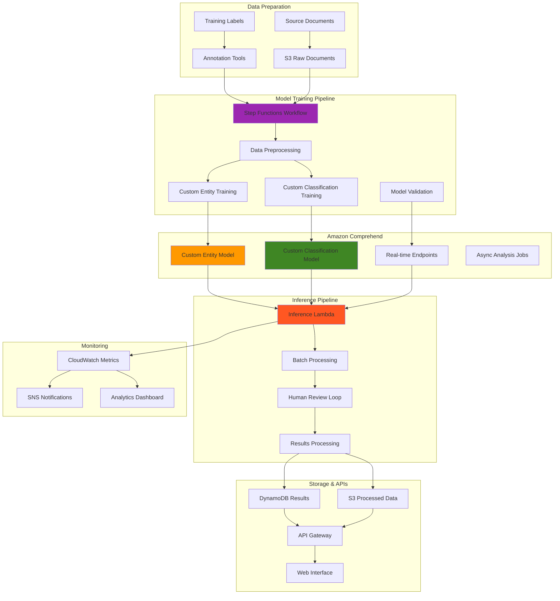

# Custom Entity Recognition with Comprehend

## Problem

Financial services, healthcare, and legal organizations process vast amounts of unstructured text containing domain-specific entities and classifications that standard NLP services cannot accurately identify. These organizations need to extract custom entities like specific financial instruments, medical conditions, legal case references, or proprietary product codes from documents while classifying content according to internal taxonomies. Generic entity recognition fails to capture industry-specific terminology, and manual document processing creates bottlenecks in compliance workflows, contract analysis, and regulatory reporting that require precise entity extraction and classification.

## Solution

Implement a comprehensive custom NLP solution using Amazon Comprehend's custom entity recognition and custom classification capabilities combined with automated training pipelines and real-time inference APIs. This solution creates domain-specific models trained on organizational data, provides automated document processing workflows with human review loops, and integrates with existing business systems through APIs. The architecture supports continuous model improvement through active learning and provides detailed analytics on entity extraction accuracy and classification confidence scores.

## Architecture Diagram



## Prerequisites

1. AWS account with Comprehend, Step Functions, and Lambda permissions
2. AWS CLI v2 installed and configured (or AWS CloudShell)
3. Training data with labeled entities and classified documents (minimum 100 examples per entity type)
4. Understanding of machine learning model training and evaluation concepts
5. Estimated cost: $200-400 for model training and inference over several training cycles

> **Note**: Comprehend custom model training can take 1-4 hours per model and incurs significant charges. Plan training cycles carefully and monitor costs closely. Review the [Amazon Comprehend pricing guide](https://docs.aws.amazon.com/comprehend/latest/dg/pricing.html) for detailed cost information.

## Preparation

```bash
# Set environment variables
export AWS_REGION=$(aws configure get region)
export AWS_ACCOUNT_ID=$(aws sts get-caller-identity \
    --query Account --output text)

# Generate unique identifiers
RANDOM_SUFFIX=$(aws secretsmanager get-random-password \
    --exclude-punctuation --exclude-uppercase \
    --password-length 6 --require-each-included-type \
    --output text --query RandomPassword)

export PROJECT_NAME="comprehend-custom-${RANDOM_SUFFIX}"
export BUCKET_NAME="comprehend-models-${RANDOM_SUFFIX}"
export ROLE_NAME="ComprehendCustomRole-${RANDOM_SUFFIX}"

# Create S3 bucket for training data and models
aws s3 mb s3://${BUCKET_NAME} --region ${AWS_REGION}

# Create IAM role for Comprehend and Step Functions
cat > trust-policy.json << EOF
{
  "Version": "2012-10-17",
  "Statement": [
    {
      "Effect": "Allow",
      "Principal": {
        "Service": [
          "comprehend.amazonaws.com",
          "lambda.amazonaws.com",
          "states.amazonaws.com"
        ]
      },
      "Action": "sts:AssumeRole"
    }
  ]
}
EOF

aws iam create-role \
    --role-name ${ROLE_NAME} \
    --assume-role-policy-document file://trust-policy.json

# Attach required policies
aws iam attach-role-policy \
    --role-name ${ROLE_NAME} \
    --policy-arn arn:aws:iam::aws:policy/ComprehendFullAccess

aws iam attach-role-policy \
    --role-name ${ROLE_NAME} \
    --policy-arn arn:aws:iam::aws:policy/AmazonS3FullAccess

aws iam attach-role-policy \
    --role-name ${ROLE_NAME} \
    --policy-arn arn:aws:iam::aws:policy/service-role/AWSLambdaBasicExecutionRole

aws iam attach-role-policy \
    --role-name ${ROLE_NAME} \
    --policy-arn arn:aws:iam::aws:policy/AWSStepFunctionsFullAccess

export ROLE_ARN="arn:aws:iam::${AWS_ACCOUNT_ID}:role/${ROLE_NAME}"

echo "✅ Created foundational resources"
```

## Steps

1. **Prepare Sample Training Data**:

   Amazon Comprehend's custom models require structured training data to learn domain-specific patterns and terminology. Custom entity recognition models need annotated text with precise character-level positions of entities, while classification models require labeled examples for each document category. This training data format follows the [Amazon Comprehend custom entity recognition requirements](https://docs.aws.amazon.com/comprehend/latest/dg/custom-entity-recognition.html), establishing the foundation for accurate domain-specific model training.

   ```bash
   # Create sample entity training data (financial domain)
   mkdir -p training-data
   
   cat > training-data/entities.csv << 'EOF'
   Text,File,Line,BeginOffset,EndOffset,Type
   "The S&P 500 index rose 2.3% yesterday.",entities_sample.txt,0,4,11,STOCK_INDEX
   "Apple Inc. (AAPL) reported strong quarterly earnings.",entities_sample.txt,1,13,17,STOCK_SYMBOL
   "The Federal Reserve raised interest rates by 0.25%.",entities_sample.txt,2,4,17,CENTRAL_BANK
   "Goldman Sachs upgraded Microsoft to a buy rating.",entities_sample.txt,3,0,13,INVESTMENT_BANK
   "Bitcoin hit a new high of $65,000 per coin.",entities_sample.txt,4,0,7,CRYPTOCURRENCY
   "The NASDAQ composite closed up 150 points.",entities_sample.txt,5,4,10,STOCK_INDEX
   "JPMorgan Chase announced a new credit facility.",entities_sample.txt,6,0,14,FINANCIAL_INSTITUTION
   "Tesla (TSLA) stock volatility increased significantly.",entities_sample.txt,7,7,11,STOCK_SYMBOL
   EOF
   
   # Create corresponding text file
   cat > training-data/entities_sample.txt << 'EOF'
   The S&P 500 index rose 2.3% yesterday.
   Apple Inc. (AAPL) reported strong quarterly earnings.
   The Federal Reserve raised interest rates by 0.25%.
   Goldman Sachs upgraded Microsoft to a buy rating.
   Bitcoin hit a new high of $65,000 per coin.
   The NASDAQ composite closed up 150 points.
   JPMorgan Chase announced a new credit facility.
   Tesla (TSLA) stock volatility increased significantly.
   EOF
   
   # Create sample classification training data
   cat > training-data/classification.csv << 'EOF'
   Text,Label
   "Quarterly earnings report shows strong revenue growth and improved margins across all business segments.",EARNINGS_REPORT
   "The Federal Reserve announced a 0.25% interest rate increase following their latest policy meeting.",MONETARY_POLICY
   "New regulatory guidelines require enhanced disclosure for cryptocurrency trading platforms.",REGULATORY_NEWS
   "Company announces acquisition of fintech startup for $500 million in cash and stock.",MERGER_ACQUISITION
   "Market volatility increased following geopolitical tensions and inflation concerns.",MARKET_ANALYSIS
   "Annual shareholder meeting scheduled for next month with executive compensation on agenda.",CORPORATE_GOVERNANCE
   "Credit rating agency downgrades bank following loan loss provisions.",CREDIT_RATING
   "Technology patent approval strengthens company's intellectual property portfolio.",INTELLECTUAL_PROPERTY
   "Environmental impact assessment reveals need for sustainable business practices.",ESG_REPORT
   "Insider trading investigation launched by securities regulators.",COMPLIANCE_ISSUE
   EOF
   
   # Upload training data to S3
   aws s3 cp training-data/ s3://${BUCKET_NAME}/training-data/ \
       --recursive
   
   echo "✅ Created and uploaded sample training data"
   ```

   The training data is now uploaded to S3 and structured according to Comprehend's requirements. This establishes the labeled dataset foundation that enables the machine learning models to learn domain-specific entity patterns and document classifications for financial services use cases.

2. **Create Lambda Function for Data Preprocessing**:

   Data preprocessing is critical for custom model training success, ensuring training datasets meet Amazon Comprehend's strict format requirements and quality standards. [AWS Lambda](https://docs.aws.amazon.com/lambda/latest/dg/welcome.html) provides serverless compute for validating CSV formats, checking minimum example counts per entity type, and preprocessing training data before model training begins. This validation step prevents training failures and ensures consistent model performance by catching data quality issues early in the pipeline.

   ```bash
   # Create preprocessing Lambda function
   cat > data_preprocessor.py << 'EOF'
   import json
   import boto3
   import csv
   from io import StringIO
   import re
   
   s3 = boto3.client('s3')
   
   def lambda_handler(event, context):
       bucket = event['bucket']
       entity_key = event['entity_training_data']
       classification_key = event['classification_training_data']
       
       try:
           # Process entity training data
           entity_result = process_entity_data(bucket, entity_key)
           
           # Process classification training data
           classification_result = process_classification_data(bucket, classification_key)
           
           return {
               'statusCode': 200,
               'entity_training_ready': entity_result,
               'classification_training_ready': classification_result,
               'bucket': bucket
           }
           
       except Exception as e:
           return {
               'statusCode': 500,
               'error': str(e)
           }
   
   def process_entity_data(bucket, key):
       # Download and validate entity training data
       response = s3.get_object(Bucket=bucket, Key=key)
       content = response['Body'].read().decode('utf-8')
       
       # Parse CSV and validate format
       csv_reader = csv.DictReader(StringIO(content))
       rows = list(csv_reader)
       
       # Validate required columns
       required_columns = ['Text', 'File', 'Line', 'BeginOffset', 'EndOffset', 'Type']
       if not all(col in csv_reader.fieldnames for col in required_columns):
           raise ValueError(f"Missing required columns. Expected: {required_columns}")
       
       # Validate entity types and counts
       entity_types = {}
       for row in rows:
           entity_type = row['Type']
           entity_types[entity_type] = entity_types.get(entity_type, 0) + 1
       
       # Check minimum examples per entity type
       min_examples = 10
       insufficient_types = [et for et, count in entity_types.items() if count < min_examples]
       
       if insufficient_types:
           print(f"Warning: Entity types with fewer than {min_examples} examples: {insufficient_types}")
       
       # Save processed data
       processed_key = key.replace('.csv', '_processed.csv')
       s3.put_object(
           Bucket=bucket,
           Key=processed_key,
           Body=content,
           ContentType='text/csv'
       )
       
       return {
           'processed_file': processed_key,
           'entity_types': list(entity_types.keys()),
           'total_examples': len(rows),
           'entity_counts': entity_types
       }
   
   def process_classification_data(bucket, key):
       # Download and validate classification training data
       response = s3.get_object(Bucket=bucket, Key=key)
       content = response['Body'].read().decode('utf-8')
       
       # Parse CSV and validate format
       csv_reader = csv.DictReader(StringIO(content))
       rows = list(csv_reader)
       
       # Validate required columns
       required_columns = ['Text', 'Label']
       if not all(col in csv_reader.fieldnames for col in required_columns):
           raise ValueError(f"Missing required columns. Expected: {required_columns}")
       
       # Validate labels and counts
       label_counts = {}
       for row in rows:
           label = row['Label']
           label_counts[label] = label_counts.get(label, 0) + 1
       
       # Check minimum examples per label
       min_examples = 10
       insufficient_labels = [label for label, count in label_counts.items() if count < min_examples]
       
       if insufficient_labels:
           print(f"Warning: Labels with fewer than {min_examples} examples: {insufficient_labels}")
       
       # Save processed data
       processed_key = key.replace('.csv', '_processed.csv')
       s3.put_object(
           Bucket=bucket,
           Key=processed_key,
           Body=content,
           ContentType='text/csv'
       )
       
       return {
           'processed_file': processed_key,
           'labels': list(label_counts.keys()),
           'total_examples': len(rows),
           'label_counts': label_counts
       }
   EOF
   
   # Create deployment package
   zip data_preprocessor.zip data_preprocessor.py
   
   # Create Lambda function
   aws lambda create-function \
       --function-name "${PROJECT_NAME}-data-preprocessor" \
       --runtime python3.9 \
       --role ${ROLE_ARN} \
       --handler data_preprocessor.lambda_handler \
       --zip-file fileb://data_preprocessor.zip \
       --timeout 300
   
   echo "✅ Created data preprocessing Lambda function"
   ```

   The preprocessing function is now deployed and ready to validate training data quality before model training begins. This serverless function ensures that entity annotation formats and classification labels meet Comprehend's requirements, preventing expensive training failures and enabling reliable model performance.

3. **Create Lambda Function for Model Training**:

   Model training orchestration requires programmatic control over Amazon Comprehend's training APIs to initiate custom entity recognition and classification model training jobs. This Lambda function encapsulates the complex configuration required for [Comprehend custom model training](https://docs.aws.amazon.com/comprehend/latest/dg/custom-entity-recognition.html), managing training job parameters, S3 data locations, and IAM permissions. The function enables automated training pipeline execution while providing error handling and status tracking for long-running training processes.

   ```bash
   # Create model training Lambda function
   cat > model_trainer.py << 'EOF'
   import json
   import boto3
   from datetime import datetime
   import uuid
   
   comprehend = boto3.client('comprehend')
   
   def lambda_handler(event, context):
       bucket = event['bucket']
       model_type = event['model_type']  # 'entity' or 'classification'
       
       try:
           if model_type == 'entity':
               result = train_entity_model(event)
           elif model_type == 'classification':
               result = train_classification_model(event)
           else:
               raise ValueError(f"Invalid model type: {model_type}")
           
           return {
               'statusCode': 200,
               'model_type': model_type,
               'training_job_arn': result['EntityRecognizerArn'] if model_type == 'entity' else result['DocumentClassifierArn'],
               'training_status': 'SUBMITTED'
           }
           
       except Exception as e:
           return {
               'statusCode': 500,
               'error': str(e),
               'model_type': model_type
           }
   
   def train_entity_model(event):
       bucket = event['bucket']
       training_data = event['entity_training_ready']['processed_file']
       
       timestamp = datetime.now().strftime('%Y%m%d-%H%M%S')
       recognizer_name = f"{event.get('project_name', 'custom')}-entity-{timestamp}"
       
       # Configure training job
       training_config = {
           'RecognizerName': recognizer_name,
           'DataAccessRoleArn': event['role_arn'],
           'InputDataConfig': {
               'EntityTypes': [
                   {'Type': entity_type} 
                   for entity_type in event['entity_training_ready']['entity_types']
               ],
               'Documents': {
                   'S3Uri': f"s3://{bucket}/training-data/entities_sample.txt"
               },
               'Annotations': {
                   'S3Uri': f"s3://{bucket}/training-data/{training_data}"
               }
           },
           'LanguageCode': 'en'
       }
       
       # Start training job
       response = comprehend.create_entity_recognizer(**training_config)
       
       return response
   
   def train_classification_model(event):
       bucket = event['bucket']
       training_data = event['classification_training_ready']['processed_file']
       
       timestamp = datetime.now().strftime('%Y%m%d-%H%M%S')
       classifier_name = f"{event.get('project_name', 'custom')}-classifier-{timestamp}"
       
       # Configure training job
       training_config = {
           'DocumentClassifierName': classifier_name,
           'DataAccessRoleArn': event['role_arn'],
           'InputDataConfig': {
               'S3Uri': f"s3://{bucket}/training-data/{training_data}"
           },
           'LanguageCode': 'en'
       }
       
       # Start training job
       response = comprehend.create_document_classifier(**training_config)
       
       return response
   EOF
   
   # Create deployment package
   zip model_trainer.zip model_trainer.py
   
   # Create Lambda function
   aws lambda create-function \
       --function-name "${PROJECT_NAME}-model-trainer" \
       --runtime python3.9 \
       --role ${ROLE_ARN} \
       --handler model_trainer.lambda_handler \
       --zip-file fileb://model_trainer.zip \
       --timeout 60
   
   echo "✅ Created model training Lambda function"
   ```

   The model training function is now deployed and configured to initiate both entity recognition and classification model training jobs. This serverless function provides the programmatic interface for starting expensive, long-running training processes while maintaining proper error handling and status tracking capabilities.

4. **Create Lambda Function for Model Status Checking**:

   Training status monitoring is essential for managing long-running Comprehend training jobs that can take 1-4 hours to complete. This Lambda function polls the [Comprehend training job status](https://docs.aws.amazon.com/comprehend/latest/dg/custom-entity-recognition.html) and determines completion states, enabling automated workflow progression and error handling. The function bridges the gap between asynchronous training jobs and synchronous Step Functions workflows by providing consistent status checking and completion detection.

   ```bash
   # Create status checker Lambda function
   cat > status_checker.py << 'EOF'
   import json
   import boto3
   
   comprehend = boto3.client('comprehend')
   
   def lambda_handler(event, context):
       model_type = event['model_type']
       job_arn = event['training_job_arn']
       
       try:
           if model_type == 'entity':
               response = comprehend.describe_entity_recognizer(
                   EntityRecognizerArn=job_arn
               )
               status = response['EntityRecognizerProperties']['Status']
               
           elif model_type == 'classification':
               response = comprehend.describe_document_classifier(
                   DocumentClassifierArn=job_arn
               )
               status = response['DocumentClassifierProperties']['Status']
           
           else:
               raise ValueError(f"Invalid model type: {model_type}")
           
           # Determine if training is complete
           is_complete = status in ['TRAINED', 'TRAINING_FAILED', 'STOPPED']
           
           return {
               'statusCode': 200,
               'model_type': model_type,
               'training_job_arn': job_arn,
               'training_status': status,
               'is_complete': is_complete,
               'model_details': response
           }
           
       except Exception as e:
           return {
               'statusCode': 500,
               'error': str(e),
               'model_type': model_type,
               'training_job_arn': job_arn
           }
   EOF
   
   # Create deployment package
   zip status_checker.zip status_checker.py
   
   # Create Lambda function
   aws lambda create-function \
       --function-name "${PROJECT_NAME}-status-checker" \
       --runtime python3.9 \
       --role ${ROLE_ARN} \
       --handler status_checker.lambda_handler \
       --zip-file fileb://status_checker.zip \
       --timeout 30
   
   echo "✅ Created status checking Lambda function"
   ```

   The status checking function is now deployed and ready to monitor training job progress. This function provides the essential polling mechanism that enables automated workflows to wait for training completion and proceed with subsequent steps like model validation and deployment.

5. **Create Step Functions Workflow for Training Pipeline**:

   [AWS Step Functions](https://docs.aws.amazon.com/step-functions/latest/dg/welcome.html) provides visual workflow orchestration for complex, multi-step processes like machine learning model training pipelines. The workflow coordinates data preprocessing, parallel model training, and status monitoring while handling errors and retries. This orchestration pattern enables reliable, automated training pipelines that can handle the complexity of training multiple models concurrently while managing dependencies and error conditions.

   ```bash
   # Create Step Functions definition
   cat > training_workflow.json << EOF
   {
     "Comment": "Comprehend Custom Model Training Pipeline",
     "StartAt": "PreprocessData",
     "States": {
       "PreprocessData": {
         "Type": "Task",
         "Resource": "arn:aws:states:::lambda:invoke",
         "Parameters": {
           "FunctionName": "${PROJECT_NAME}-data-preprocessor",
           "Payload": {
             "bucket": "${BUCKET_NAME}",
             "entity_training_data": "training-data/entities.csv",
             "classification_training_data": "training-data/classification.csv"
           }
         },
         "ResultPath": "$.preprocessing_result",
         "Next": "TrainEntityModel"
       },
       "TrainEntityModel": {
         "Type": "Task",
         "Resource": "arn:aws:states:::lambda:invoke",
         "Parameters": {
           "FunctionName": "${PROJECT_NAME}-model-trainer",
           "Payload": {
             "bucket": "${BUCKET_NAME}",
             "model_type": "entity",
             "project_name": "${PROJECT_NAME}",
             "role_arn": "${ROLE_ARN}",
             "entity_training_ready.$": "$.preprocessing_result.Payload.entity_training_ready"
           }
         },
         "ResultPath": "$.entity_training_result",
         "Next": "TrainClassificationModel"
       },
       "TrainClassificationModel": {
         "Type": "Task",
         "Resource": "arn:aws:states:::lambda:invoke",
         "Parameters": {
           "FunctionName": "${PROJECT_NAME}-model-trainer",
           "Payload": {
             "bucket": "${BUCKET_NAME}",
             "model_type": "classification",
             "project_name": "${PROJECT_NAME}",
             "role_arn": "${ROLE_ARN}",
             "classification_training_ready.$": "$.preprocessing_result.Payload.classification_training_ready"
           }
         },
         "ResultPath": "$.classification_training_result",
         "Next": "WaitForTraining"
       },
       "WaitForTraining": {
         "Type": "Wait",
         "Seconds": 300,
         "Next": "CheckEntityModelStatus"
       },
       "CheckEntityModelStatus": {
         "Type": "Task",
         "Resource": "arn:aws:states:::lambda:invoke",
         "Parameters": {
           "FunctionName": "${PROJECT_NAME}-status-checker",
           "Payload": {
             "model_type": "entity",
             "training_job_arn.$": "$.entity_training_result.Payload.training_job_arn"
           }
         },
         "ResultPath": "$.entity_status_result",
         "Next": "CheckClassificationModelStatus"
       },
       "CheckClassificationModelStatus": {
         "Type": "Task",
         "Resource": "arn:aws:states:::lambda:invoke",
         "Parameters": {
           "FunctionName": "${PROJECT_NAME}-status-checker",
           "Payload": {
             "model_type": "classification",
             "training_job_arn.$": "$.classification_training_result.Payload.training_job_arn"
           }
         },
         "ResultPath": "$.classification_status_result",
         "Next": "CheckAllModelsComplete"
       },
       "CheckAllModelsComplete": {
         "Type": "Choice",
         "Choices": [
           {
             "And": [
               {
                 "Variable": "$.entity_status_result.Payload.is_complete",
                 "BooleanEquals": true
               },
               {
                 "Variable": "$.classification_status_result.Payload.is_complete",
                 "BooleanEquals": true
               }
             ],
             "Next": "TrainingComplete"
           }
         ],
         "Default": "WaitForTraining"
       },
       "TrainingComplete": {
         "Type": "Pass",
         "Result": "Training pipeline completed successfully",
         "End": true
       }
     }
   }
   EOF
   
   # Create Step Functions state machine
   STATE_MACHINE_ARN=$(aws stepfunctions create-state-machine \
       --name "${PROJECT_NAME}-training-pipeline" \
       --definition file://training_workflow.json \
       --role-arn ${ROLE_ARN} \
       --query 'stateMachineArn' --output text)
   
   echo "✅ Created Step Functions training pipeline: ${STATE_MACHINE_ARN}"
   ```

   The Step Functions workflow is now deployed and ready to orchestrate the complete training pipeline. This visual workflow manages the complex sequence of data preprocessing, parallel model training, and status monitoring while providing resilient error handling and retry logic for production-ready ML pipelines.

6. **Create Lambda Function for Real-time Inference**:

   Real-time inference capabilities enable production applications to analyze text content on-demand using trained custom models. This Lambda function provides a unified API for both entity recognition and classification inference, supporting [Amazon Comprehend's inference endpoints](https://docs.aws.amazon.com/comprehend/latest/dg/custom-entity-recognition.html). The serverless architecture ensures cost-effective scaling while maintaining low latency for interactive applications requiring immediate NLP analysis results.

   ```bash
   # Create inference Lambda function
   cat > inference_api.py << 'EOF'
   import json
   import boto3
   from datetime import datetime
   
   comprehend = boto3.client('comprehend')
   dynamodb = boto3.resource('dynamodb')
   
   def lambda_handler(event, context):
       try:
           # Parse request
           body = json.loads(event.get('body', '{}'))
           text = body.get('text', '')
           entity_model_arn = body.get('entity_model_arn')
           classifier_model_arn = body.get('classifier_model_arn')
           
           if not text:
               return {
                   'statusCode': 400,
                   'body': json.dumps({'error': 'Text is required'})
               }
           
           results = {}
           
           # Perform entity recognition if model is provided
           if entity_model_arn:
               entity_results = comprehend.detect_entities(
                   Text=text,
                   EndpointArn=entity_model_arn
               )
               results['entities'] = entity_results['Entities']
           
           # Perform classification if model is provided
           if classifier_model_arn:
               classification_results = comprehend.classify_document(
                   Text=text,
                   EndpointArn=classifier_model_arn
               )
               results['classification'] = classification_results['Classes']
           
           # Store results (optional)
           if os.environ.get('RESULTS_TABLE'):
               store_results(text, results)
           
           return {
               'statusCode': 200,
               'headers': {
                   'Content-Type': 'application/json',
                   'Access-Control-Allow-Origin': '*'
               },
               'body': json.dumps({
                   'text': text,
                   'results': results,
                   'timestamp': datetime.now().isoformat()
               })
           }
           
       except Exception as e:
           return {
               'statusCode': 500,
               'body': json.dumps({'error': str(e)})
           }
   
   def store_results(text, results):
       table_name = os.environ['RESULTS_TABLE']
       table = dynamodb.Table(table_name)
       
       item = {
           'id': str(uuid.uuid4()),
           'text': text,
           'results': json.dumps(results),
           'timestamp': int(datetime.now().timestamp())
       }
       
       table.put_item(Item=item)
   EOF
   
   # Create deployment package
   zip inference_api.zip inference_api.py
   
   # Create Lambda function
   aws lambda create-function \
       --function-name "${PROJECT_NAME}-inference-api" \
       --runtime python3.9 \
       --role ${ROLE_ARN} \
       --handler inference_api.lambda_handler \
       --zip-file fileb://inference_api.zip \
       --timeout 30
   
   echo "✅ Created inference API Lambda function"
   ```

   The inference API function is now deployed and ready to process real-time text analysis requests. This serverless function provides a unified interface for both entity recognition and classification inference, enabling applications to extract custom entities and classify documents using the trained models.

7. **Start Training Pipeline**:

   Pipeline execution initiates the complete model training workflow, orchestrating data preprocessing, parallel model training, and status monitoring through Step Functions. The training process typically takes 1-4 hours depending on data size and model complexity, with the workflow automatically managing the complex dependencies between preprocessing, training, and validation steps.

   ```bash
   # Execute the training pipeline
   EXECUTION_ARN=$(aws stepfunctions start-execution \
       --state-machine-arn ${STATE_MACHINE_ARN} \
       --name "training-$(date +%Y%m%d-%H%M%S)" \
       --query 'executionArn' --output text)
   
   echo "✅ Started training pipeline execution: ${EXECUTION_ARN}"
   echo "Training will take 1-4 hours. Monitor progress in Step Functions console."
   ```

   The training pipeline is now running and will automatically progress through data preprocessing, model training, and completion detection. This automated workflow eliminates manual intervention while providing comprehensive monitoring and error handling throughout the training process.

8. **Create API Gateway for Inference** (Run after training completes):

   [Amazon API Gateway](https://docs.aws.amazon.com/apigateway/latest/developerguide/welcome.html) provides a managed REST API layer that exposes the inference Lambda function as a scalable web service. This integration enables client applications to send HTTP requests for text analysis while benefiting from API Gateway's built-in security, throttling, and monitoring capabilities. The HTTP API format provides cost-effective and performant access to the custom NLP models.

   ```bash
   # This step should be run after model training completes
   echo "After model training completes, run these commands:"
   echo ""
   echo "# Create API Gateway"
   echo "API_ID=\$(aws apigatewayv2 create-api \\"
   echo "    --name \"${PROJECT_NAME}-inference-api\" \\"
   echo "    --protocol-type HTTP \\"
   echo "    --target \"arn:aws:lambda:${AWS_REGION}:${AWS_ACCOUNT_ID}:function:${PROJECT_NAME}-inference-api\" \\"
   echo "    --query 'ApiId' --output text)"
   echo ""
   echo "# Add Lambda permission"
   echo "aws lambda add-permission \\"
   echo "    --function-name \"${PROJECT_NAME}-inference-api\" \\"
   echo "    --statement-id api-gateway-invoke \\"
   echo "    --action lambda:InvokeFunction \\"
   echo "    --principal apigateway.amazonaws.com \\"
   echo "    --source-arn \"arn:aws:execute-api:${AWS_REGION}:${AWS_ACCOUNT_ID}:\${API_ID}/*/*\""
   echo ""
   echo "# Get API endpoint"
   echo "aws apigatewayv2 get-api --api-id \${API_ID} --query 'ApiEndpoint' --output text"
   ```

   The API Gateway configuration will provide a public HTTP endpoint for inference requests once the training pipeline completes. This managed API layer enables secure, scalable access to the custom NLP models while providing authentication, rate limiting, and monitoring capabilities.

## Validation & Testing

1. **Monitor Training Pipeline**:

   ```bash
   # Check Step Functions execution status
   aws stepfunctions describe-execution \
       --execution-arn ${EXECUTION_ARN}
   
   # List Comprehend training jobs
   aws comprehend list-entity-recognizers \
       --filter "RecognizerName contains ${PROJECT_NAME}"
   
   aws comprehend list-document-classifiers \
       --filter "DocumentClassifierName contains ${PROJECT_NAME}"
   ```

   Expected output: Training jobs in "TRAINING" or "TRAINED" status after 1-4 hours.

2. **Test Model Performance** (After training completes):

   ```bash
   # Get trained model ARNs
   ENTITY_MODEL_ARN=$(aws comprehend list-entity-recognizers \
       --filter "RecognizerName contains ${PROJECT_NAME}" \
       --query 'EntityRecognizerPropertiesList[0].EntityRecognizerArn' \
       --output text)
   
   CLASSIFIER_MODEL_ARN=$(aws comprehend list-document-classifiers \
       --filter "DocumentClassifierName contains ${PROJECT_NAME}" \
       --query 'DocumentClassifierPropertiesList[0].DocumentClassifierArn' \
       --output text)
   
   # Test entity recognition
   aws comprehend detect-entities \
       --text "Apple Inc. (AAPL) and the S&P 500 showed strong performance." \
       --endpoint-arn ${ENTITY_MODEL_ARN}
   
   # Test classification
   aws comprehend classify-document \
       --text "The company reported quarterly earnings with revenue growth of 15%." \
       --endpoint-arn ${CLASSIFIER_MODEL_ARN}
   ```

3. **Test API Endpoint** (After API Gateway setup):

   ```bash
   # Test inference API with sample text
   curl -X POST ${API_ENDPOINT}/inference \
       -H "Content-Type: application/json" \
       -d '{
         "text": "Goldman Sachs upgraded Tesla (TSLA) following strong quarterly earnings.",
         "entity_model_arn": "'${ENTITY_MODEL_ARN}'",
         "classifier_model_arn": "'${CLASSIFIER_MODEL_ARN}'"
       }'
   ```

## Cleanup

1. **Delete Comprehend Models**:

   ```bash
   # Stop and delete entity recognizer
   aws comprehend stop-entity-recognizer \
       --entity-recognizer-arn ${ENTITY_MODEL_ARN}
   
   aws comprehend delete-entity-recognizer \
       --entity-recognizer-arn ${ENTITY_MODEL_ARN}
   
   # Stop and delete document classifier
   aws comprehend stop-document-classifier \
       --document-classifier-arn ${CLASSIFIER_MODEL_ARN}
   
   aws comprehend delete-document-classifier \
       --document-classifier-arn ${CLASSIFIER_MODEL_ARN}
   
   echo "✅ Deleted Comprehend models"
   ```

2. **Delete Step Functions and Lambda Functions**:

   ```bash
   # Delete Step Functions state machine
   aws stepfunctions delete-state-machine \
       --state-machine-arn ${STATE_MACHINE_ARN}
   
   # Delete Lambda functions
   aws lambda delete-function \
       --function-name "${PROJECT_NAME}-data-preprocessor"
   
   aws lambda delete-function \
       --function-name "${PROJECT_NAME}-model-trainer"
   
   aws lambda delete-function \
       --function-name "${PROJECT_NAME}-status-checker"
   
   aws lambda delete-function \
       --function-name "${PROJECT_NAME}-inference-api"
   
   echo "✅ Deleted workflow and Lambda functions"
   ```

3. **Clean up Storage and IAM Resources**:

   ```bash
   # Empty and delete S3 bucket
   aws s3 rm s3://${BUCKET_NAME} --recursive
   aws s3 rb s3://${BUCKET_NAME}
   
   # Delete IAM role
   aws iam detach-role-policy \
       --role-name ${ROLE_NAME} \
       --policy-arn arn:aws:iam::aws:policy/ComprehendFullAccess
   
   aws iam detach-role-policy \
       --role-name ${ROLE_NAME} \
       --policy-arn arn:aws:iam::aws:policy/AmazonS3FullAccess
   
   aws iam detach-role-policy \
       --role-name ${ROLE_NAME} \
       --policy-arn arn:aws:iam::aws:policy/service-role/AWSLambdaBasicExecutionRole
   
   aws iam detach-role-policy \
       --role-name ${ROLE_NAME} \
       --policy-arn arn:aws:iam::aws:policy/AWSStepFunctionsFullAccess
   
   aws iam delete-role --role-name ${ROLE_NAME}
   
   # Clean up local files
   rm -f trust-policy.json training_workflow.json \
         data_preprocessor.py data_preprocessor.zip \
         model_trainer.py model_trainer.zip \
         status_checker.py status_checker.zip \
         inference_api.py inference_api.zip
   rm -rf training-data/
   
   echo "✅ Cleaned up all resources"
   ```

## Discussion

This comprehensive custom NLP solution demonstrates how Amazon Comprehend's custom models can be trained and deployed to extract domain-specific entities and classify documents according to organizational taxonomies. The solution addresses the critical gap between generic NLP services and enterprise requirements for precise, domain-aware text analysis by leveraging [Amazon Comprehend's custom entity recognition](https://docs.aws.amazon.com/comprehend/latest/dg/custom-entity-recognition.html) and [custom classification](https://docs.aws.amazon.com/comprehend/latest/dg/how-document-classification.html) capabilities.

The Step Functions orchestration provides a robust training pipeline that handles data validation, model training, and status monitoring, while the Lambda-based inference API enables real-time text analysis with custom models. Custom entity recognition is particularly valuable for financial services to extract specific instrument names, regulatory references, or proprietary product codes that standard models would miss. Custom classification helps organize documents into business-relevant categories for automated routing, compliance monitoring, and content management.

For production implementations, consider implementing model versioning and A/B testing frameworks to compare custom model performance against baseline models. The solution can be extended with active learning capabilities where human reviewers validate model predictions to continuously improve accuracy. Integration with Amazon Augmented AI (A2I) can provide human review workflows for low-confidence predictions, ensuring high-quality results while reducing manual effort.

> **Warning**: Custom model training costs can accumulate quickly, especially with large datasets or multiple training iterations. Monitor training costs closely and consider using smaller datasets for initial testing before scaling to production volumes.

> **Tip**: Use [Amazon SageMaker Ground Truth](https://docs.aws.amazon.com/sagemaker/latest/dg/sms-named-entity-recg.html) to create high-quality training datasets with human annotation workflows, and implement model performance monitoring to detect when retraining is needed due to data drift.

## Challenge

Enhance this custom NLP platform with these advanced capabilities:

1. **Multi-Language Support**: Extend the solution to support multiple languages with language-specific custom models and automatic language detection for routing to appropriate models
2. **Active Learning Pipeline**: Implement continuous learning workflows where model predictions below confidence thresholds are sent for human review, with feedback automatically incorporated into model retraining
3. **Model Performance Monitoring**: Create comprehensive monitoring dashboards that track model accuracy, prediction confidence distributions, and data drift detection with automated alerts for model degradation
4. **Hierarchical Classification**: Implement multi-level classification taxonomies where documents are classified into categories and subcategories using nested custom classification models
5. **Real-time Annotation Platform**: Build a web-based annotation tool that enables subject matter experts to create and refine training datasets with collaborative review workflows and quality control measures

## Infrastructure Code

*Infrastructure code will be generated after recipe approval.*