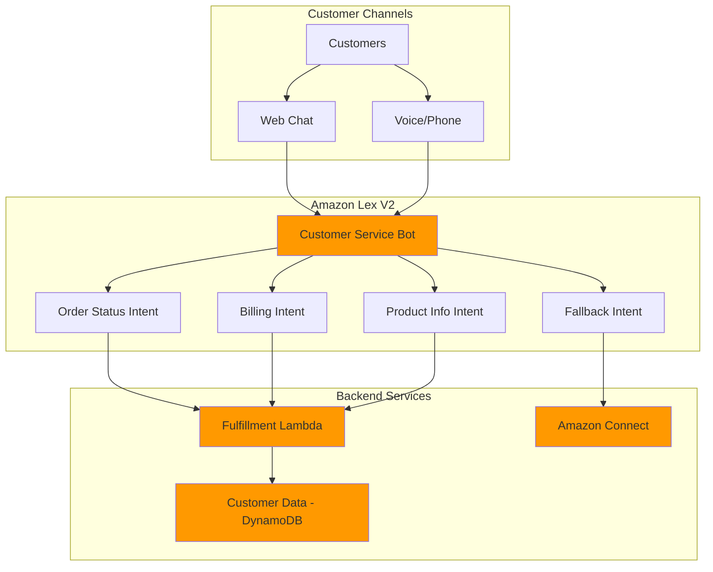

# Customer Service Chatbots with Amazon Lex

## Problem

Customer service teams face overwhelming volumes of repetitive inquiries about order status, billing questions, and basic product information, resulting in long wait times and high operational costs. Traditional support channels cannot scale efficiently to handle peak customer demand, leading to frustrated customers and overworked support agents who spend 70% of their time on routine questions that could be automated.

## Solution

Build an intelligent customer service chatbot using Amazon Lex that automatically handles common inquiries through natural language understanding. The solution integrates with backend services via Lambda functions to access real customer data, provides multi-channel deployment across web and voice interfaces, and seamlessly escalates complex issues to human agents when needed.

## Architecture Diagram



## Prerequisites

1. AWS account with appropriate permissions for Amazon Lex V2, Lambda, DynamoDB, and IAM
2. AWS CLI v2 installed and configured (or AWS CloudShell)
3. Basic understanding of conversational AI concepts and natural language processing
4. Familiarity with AWS Lambda and DynamoDB for backend integrations
5. Estimated cost: $5-15 for resources created during testing (primarily Lambda invocations and DynamoDB operations)

> **Note**: Amazon Lex V2 offers 10,000 text requests and 5,000 speech requests per month in the free tier for the first year. See the [Amazon Lex pricing page](https://aws.amazon.com/lex/pricing/) for current rates.

## Preparation

```bash
# Set environment variables
export AWS_REGION=$(aws configure get region)
export AWS_ACCOUNT_ID=$(aws sts get-caller-identity \
    --query Account --output text)

# Generate unique identifiers for resources
RANDOM_SUFFIX=$(aws secretsmanager get-random-password \
    --exclude-punctuation --exclude-uppercase \
    --password-length 6 --require-each-included-type \
    --output text --query RandomPassword)

export BOT_NAME="CustomerServiceBot-${RANDOM_SUFFIX}"
export LAMBDA_FUNCTION_NAME="lex-fulfillment-${RANDOM_SUFFIX}"
export DYNAMODB_TABLE_NAME="customer-data-${RANDOM_SUFFIX}"

# Create IAM service role for Amazon Lex
aws iam create-role \
    --role-name "LexServiceRole-${RANDOM_SUFFIX}" \
    --assume-role-policy-document '{
        "Version": "2012-10-17",
        "Statement": [
            {
                "Effect": "Allow",
                "Principal": {
                    "Service": "lexv2.amazonaws.com"
                },
                "Action": "sts:AssumeRole"
            }
        ]
    }'

# Attach the required policy to the Lex service role
aws iam attach-role-policy \
    --role-name "LexServiceRole-${RANDOM_SUFFIX}" \
    --policy-arn "arn:aws:iam::aws:policy/AmazonLexV2BotPolicy"

export LEX_ROLE_ARN="arn:aws:iam::${AWS_ACCOUNT_ID}:role/LexServiceRole-${RANDOM_SUFFIX}"

# Create DynamoDB table for customer data
aws dynamodb create-table \
    --table-name "$DYNAMODB_TABLE_NAME" \
    --attribute-definitions \
        AttributeName=CustomerId,AttributeType=S \
    --key-schema \
        AttributeName=CustomerId,KeyType=HASH \
    --billing-mode PAY_PER_REQUEST \
    --tags Key=Project,Value=LexCustomerService

# Wait for table to be created
aws dynamodb wait table-exists --table-name "$DYNAMODB_TABLE_NAME"

echo "✅ Preparation complete. Bot name: $BOT_NAME"
```

## Steps

1. **Create Customer Data in DynamoDB**:

   DynamoDB serves as the foundational data store for customer information in our chatbot architecture. As a fully managed NoSQL database, DynamoDB provides single-digit millisecond latency and automatic scaling capabilities essential for real-time customer service interactions. This step establishes the customer data repository that our Lambda function will query to provide personalized responses.

   ```bash
   # Insert sample customer data for testing
   aws dynamodb put-item \
       --table-name "$DYNAMODB_TABLE_NAME" \
       --item '{
           "CustomerId": {"S": "12345"},
           "Name": {"S": "John Smith"},
           "Email": {"S": "john.smith@example.com"},
           "LastOrderId": {"S": "ORD-789"},
           "LastOrderStatus": {"S": "Shipped"},
           "AccountBalance": {"N": "156.78"}
       }'
   
   aws dynamodb put-item \
       --table-name "$DYNAMODB_TABLE_NAME" \
       --item '{
           "CustomerId": {"S": "67890"},
           "Name": {"S": "Jane Doe"},
           "Email": {"S": "jane.doe@example.com"},
           "LastOrderId": {"S": "ORD-456"},
           "LastOrderStatus": {"S": "Processing"},
           "AccountBalance": {"N": "89.23"}
       }'
   
   echo "✅ Sample customer data created in DynamoDB"
   ```

   The customer data is now stored in DynamoDB with consistent item structure including customer identification, contact information, order history, and account details. This data foundation enables our chatbot to provide personalized responses and maintain context across conversation turns.

2. **Create Lambda Function for Intent Fulfillment**:

   AWS Lambda provides the serverless compute layer that processes customer requests and integrates with backend data systems. Lambda functions automatically scale to handle conversation volume while maintaining cost efficiency through pay-per-request billing. This step creates the necessary IAM roles and permissions for secure integration between Amazon Lex and DynamoDB.

   ```bash
   # Create IAM role for Lambda function
   aws iam create-role \
       --role-name "LexLambdaRole-${RANDOM_SUFFIX}" \
       --assume-role-policy-document '{
           "Version": "2012-10-17",
           "Statement": [
               {
                   "Effect": "Allow",
                   "Principal": {
                       "Service": "lambda.amazonaws.com"
                   },
                   "Action": "sts:AssumeRole"
               }
           ]
       }'
   
   # Attach basic execution policy
   aws iam attach-role-policy \
       --role-name "LexLambdaRole-${RANDOM_SUFFIX}" \
       --policy-arn "arn:aws:iam::aws:policy/service-role/AWSLambdaBasicExecutionRole"
   
   # Create policy for DynamoDB access
   aws iam create-policy \
       --policy-name "LexDynamoDBPolicy-${RANDOM_SUFFIX}" \
       --policy-document '{
           "Version": "2012-10-17",
           "Statement": [
               {
                   "Effect": "Allow",
                   "Action": [
                       "dynamodb:GetItem",
                       "dynamodb:PutItem",
                       "dynamodb:UpdateItem",
                       "dynamodb:Query"
                   ],
                   "Resource": "arn:aws:dynamodb:'"$AWS_REGION"':'"$AWS_ACCOUNT_ID"':table/'"$DYNAMODB_TABLE_NAME"'"
               }
           ]
       }'
   
   # Attach DynamoDB policy to Lambda role
   aws iam attach-role-policy \
       --role-name "LexLambdaRole-${RANDOM_SUFFIX}" \
       --policy-arn "arn:aws:iam::${AWS_ACCOUNT_ID}:policy/LexDynamoDBPolicy-${RANDOM_SUFFIX}"
   
   export LAMBDA_ROLE_ARN="arn:aws:iam::${AWS_ACCOUNT_ID}:role/LexLambdaRole-${RANDOM_SUFFIX}"
   ```

   The IAM roles are now configured with least-privilege access following AWS security best practices. The Lambda function can execute with CloudWatch logging capabilities and specific DynamoDB permissions limited to our customer data table.

   > **Note**: Following the [principle of least privilege](https://docs.aws.amazon.com/IAM/latest/UserGuide/best-practices.html#grant-least-privilege) when configuring IAM permissions helps minimize security risks and ensures compliance with enterprise security policies.

3. **Create Lambda Function Code**:

   The Lambda function code implements the conversational logic that processes customer intents and retrieves relevant data from DynamoDB. This serverless approach enables automatic scaling during peak customer service periods while maintaining consistent response times. The code structure follows Amazon Lex V2 event formats and implements proper error handling for production reliability.

   ```bash
   # Create Lambda function code
   cat > lambda_function.py << 'EOF'
import json
import boto3
import os
import logging

logger = logging.getLogger()
logger.setLevel(logging.INFO)

dynamodb = boto3.resource('dynamodb')
table_name = os.environ['DYNAMODB_TABLE_NAME']
table = dynamodb.Table(table_name)

def lambda_handler(event, context):
    logger.info(f"Received event: {json.dumps(event)}")
    
    intent_name = event['sessionState']['intent']['name']
    slots = event['sessionState']['intent']['slots']
    
    if intent_name == 'OrderStatus':
        return handle_order_status(event, slots)
    elif intent_name == 'BillingInquiry':
        return handle_billing_inquiry(event, slots)
    elif intent_name == 'ProductInfo':
        return handle_product_info(event, slots)
    else:
        return close_intent(event, 'Fulfilled', 
                           'I can help you with order status, billing questions, or product information.')

def handle_order_status(event, slots):
    customer_id = slots.get('CustomerId', {}).get('value', {}).get('interpretedValue')
    
    if not customer_id:
        return elicit_slot(event, 'CustomerId', 
                          'Could you please provide your customer ID to check your order status?')
    
    try:
        response = table.get_item(Key={'CustomerId': customer_id})
        if 'Item' in response:
            item = response['Item']
            message = f"Hi {item['Name']}! Your last order {item['LastOrderId']} is currently {item['LastOrderStatus']}."
        else:
            message = f"I couldn't find a customer with ID {customer_id}. Please check your customer ID."
        
        return close_intent(event, 'Fulfilled', message)
    except Exception as e:
        logger.error(f"Error retrieving order status: {str(e)}")
        return close_intent(event, 'Failed', 
                           'Sorry, I encountered an error checking your order status. Please try again later.')

def handle_billing_inquiry(event, slots):
    customer_id = slots.get('CustomerId', {}).get('value', {}).get('interpretedValue')
    
    if not customer_id:
        return elicit_slot(event, 'CustomerId', 
                          'Could you please provide your customer ID to check your account balance?')
    
    try:
        response = table.get_item(Key={'CustomerId': customer_id})
        if 'Item' in response:
            item = response['Item']
            balance = float(item['AccountBalance'])
            message = f"Hi {item['Name']}! Your current account balance is ${balance:.2f}."
        else:
            message = f"I couldn't find a customer with ID {customer_id}. Please check your customer ID."
        
        return close_intent(event, 'Fulfilled', message)
    except Exception as e:
        logger.error(f"Error retrieving billing info: {str(e)}")
        return close_intent(event, 'Failed', 
                           'Sorry, I encountered an error checking your account. Please try again later.')

def handle_product_info(event, slots):
    product_name = slots.get('ProductName', {}).get('value', {}).get('interpretedValue')
    
    if not product_name:
        return elicit_slot(event, 'ProductName', 
                          'What product would you like information about?')
    
    # Simple product info responses (in real implementation, query product database)
    product_info = {
        'laptop': 'Our laptops feature high-performance processors and long battery life, starting at $899.',
        'smartphone': 'Our smartphones offer premium cameras and 5G connectivity, starting at $699.',
        'tablet': 'Our tablets are perfect for productivity and entertainment, starting at $399.'
    }
    
    product_lower = product_name.lower()
    if product_lower in product_info:
        message = product_info[product_lower]
    else:
        message = f"I don't have specific information about {product_name}. Please contact our sales team for detailed product information."
    
    return close_intent(event, 'Fulfilled', message)

def elicit_slot(event, slot_to_elicit, message):
    return {
        'sessionState': {
            'sessionAttributes': event['sessionState'].get('sessionAttributes', {}),
            'dialogAction': {
                'type': 'ElicitSlot',
                'slotToElicit': slot_to_elicit
            },
            'intent': event['sessionState']['intent']
        },
        'messages': [
            {
                'contentType': 'PlainText',
                'content': message
            }
        ]
    }

def close_intent(event, fulfillment_state, message):
    return {
        'sessionState': {
            'sessionAttributes': event['sessionState'].get('sessionAttributes', {}),
            'dialogAction': {
                'type': 'Close'
            },
            'intent': {
                'name': event['sessionState']['intent']['name'],
                'state': fulfillment_state
            }
        },
        'messages': [
            {
                'contentType': 'PlainText',
                'content': message
            }
        ]
    }
EOF
   
   # Create deployment package
   zip lambda_function.zip lambda_function.py
   
   echo "✅ Lambda function code created"
   ```

   The Lambda function is now ready for deployment with comprehensive intent handling logic, proper error handling, and DynamoDB integration. The code implements the Amazon Lex V2 response format and provides personalized customer service responses based on real-time data queries.

4. **Deploy Lambda Function**:

   Lambda deployment creates the serverless compute environment that will process customer conversations in real-time. The function is configured with appropriate timeout settings and environment variables for DynamoDB integration. This step establishes the backend fulfillment capability that transforms customer utterances into actionable business responses.

   ```bash
   # Wait for IAM role to propagate
   sleep 15
   
   # Create Lambda function with Python 3.12 runtime
   aws lambda create-function \
       --function-name "$LAMBDA_FUNCTION_NAME" \
       --runtime python3.12 \
       --role "$LAMBDA_ROLE_ARN" \
       --handler lambda_function.lambda_handler \
       --zip-file fileb://lambda_function.zip \
       --environment Variables="{DYNAMODB_TABLE_NAME=$DYNAMODB_TABLE_NAME}" \
       --timeout 30 \
       --tags Project=LexCustomerService
   
   export LAMBDA_FUNCTION_ARN=$(aws lambda get-function \
       --function-name "$LAMBDA_FUNCTION_NAME" \
       --query 'Configuration.FunctionArn' --output text)
   
   echo "✅ Lambda function deployed: $LAMBDA_FUNCTION_ARN"
   ```

   The Lambda function is now deployed with the latest Python 3.12 runtime and ready for integration with Amazon Lex. The function ARN is stored for later use in configuring the chatbot's fulfillment capabilities, enabling real-time processing of customer service requests.

5. **Create Amazon Lex Bot**:

   Amazon Lex provides the conversational AI foundation that understands natural language and manages dialogue flow. Lex V2 offers enhanced natural language understanding capabilities with improved intent recognition and multi-turn conversation handling. This step creates the core bot infrastructure that will process customer interactions across multiple channels.

   ```bash
   # Create the bot
   BOT_RESPONSE=$(aws lexv2-models create-bot \
       --bot-name "$BOT_NAME" \
       --description "Customer service chatbot for handling common inquiries" \
       --role-arn "$LEX_ROLE_ARN" \
       --data-privacy childDirected=false \
       --idle-session-ttl-in-seconds 600 \
       --bot-tags Project=LexCustomerService)
   
   export BOT_ID=$(echo $BOT_RESPONSE | jq -r '.botId')
   
   echo "✅ Bot created with ID: $BOT_ID"
   ```

   The Amazon Lex bot is now created with proper session management and privacy settings. The bot ID enables subsequent configuration steps and provides the foundation for adding conversational capabilities that will handle customer service interactions.

6. **Create Bot Locale and Language Configuration**:

   Bot localization enables natural language processing for specific languages and regions, configuring the NLU confidence thresholds and voice settings. This step establishes the language-specific processing capabilities that determine how accurately the bot understands customer utterances and responds appropriately.

   ```bash
   # Create bot locale for English (US)
   aws lexv2-models create-bot-locale \
       --bot-id "$BOT_ID" \
       --bot-version "DRAFT" \
       --locale-id "en_US" \
       --description "English US locale for customer service bot" \
       --nlu-intent-confidence-threshold 0.40 \
       --voice-settings voiceId=Joanna
   
   # Wait for locale creation
   sleep 10
   
   echo "✅ Bot locale created for en_US"
   ```

   The bot locale configuration is now active with appropriate confidence thresholds for intent recognition. The 0.40 confidence threshold balances accuracy with coverage, ensuring the bot responds to clear customer requests while avoiding misinterpretations that could frustrate users.

7. **Create Custom Slot Types**:

   Slot types define the structured data that the bot extracts from customer utterances, enabling parameter capture for personalized responses. Custom slot types improve entity recognition accuracy by providing domain-specific vocabulary and synonym mappings that enhance the bot's understanding of customer service terminology.

   ```bash
   # Create CustomerId slot type
   aws lexv2-models create-slot-type \
       --bot-id "$BOT_ID" \
       --bot-version "DRAFT" \
       --locale-id "en_US" \
       --slot-type-name "CustomerId" \
       --description "Customer identification numbers" \
       --slot-type-values '[
           {
               "sampleValue": {"value": "12345"},
               "synonyms": []
           },
           {
               "sampleValue": {"value": "67890"},
               "synonyms": []
           }
       ]' \
       --value-selection-strategy "ORIGINAL_VALUE"
   
   # Create ProductName slot type  
   aws lexv2-models create-slot-type \
       --bot-id "$BOT_ID" \
       --bot-version "DRAFT" \
       --locale-id "en_US" \
       --slot-type-name "ProductName" \
       --description "Product names for inquiries" \
       --slot-type-values '[
           {
               "sampleValue": {"value": "laptop"},
               "synonyms": [{"value": "computer"}, {"value": "notebook"}]
           },
           {
               "sampleValue": {"value": "smartphone"},
               "synonyms": [{"value": "phone"}, {"value": "mobile"}]
           },
           {
               "sampleValue": {"value": "tablet"},
               "synonyms": [{"value": "ipad"}]
           }
       ]' \
       --value-selection-strategy "TOP_RESOLUTION"
   
   echo "✅ Custom slot types created"
   ```

   Custom slot types are now configured with sample values and synonyms to improve entity recognition. The slot types enable the bot to extract structured data from natural language input, supporting personalized customer service experiences through accurate parameter identification.

8. **Create Bot Intents**:

   Intents represent the goals customers want to accomplish through conversation, such as checking order status or requesting product information. Each intent includes sample utterances that train the natural language understanding model to recognize customer requests across various phrasings and contexts.

   ```bash
   # Create OrderStatus intent
   aws lexv2-models create-intent \
       --bot-id "$BOT_ID" \
       --bot-version "DRAFT" \
       --locale-id "en_US" \
       --intent-name "OrderStatus" \
       --description "Handle order status inquiries" \
       --sample-utterances '[
           {"utterance": "What is my order status"},
           {"utterance": "Check my order"},
           {"utterance": "Where is my order"},
           {"utterance": "Track my order {CustomerId}"},
           {"utterance": "Order status for {CustomerId}"},
           {"utterance": "My customer ID is {CustomerId}"}
       ]'
   
   # Wait between intent creations
   sleep 5
   
   # Create BillingInquiry intent
   aws lexv2-models create-intent \
       --bot-id "$BOT_ID" \
       --bot-version "DRAFT" \
       --locale-id "en_US" \
       --intent-name "BillingInquiry" \
       --description "Handle billing and account balance inquiries" \
       --sample-utterances '[
           {"utterance": "What is my account balance"},
           {"utterance": "Check my balance"},
           {"utterance": "How much do I owe"},
           {"utterance": "Billing information for {CustomerId}"},
           {"utterance": "Account balance for customer {CustomerId}"},
           {"utterance": "My balance please"}
       ]'
   
   sleep 5
   
   # Create ProductInfo intent
   aws lexv2-models create-intent \
       --bot-id "$BOT_ID" \
       --bot-version "DRAFT" \
       --locale-id "en_US" \
       --intent-name "ProductInfo" \
       --description "Handle product information requests" \
       --sample-utterances '[
           {"utterance": "Tell me about {ProductName}"},
           {"utterance": "Product information for {ProductName}"},
           {"utterance": "What can you tell me about {ProductName}"},
           {"utterance": "I want to know about {ProductName}"},
           {"utterance": "Details about your {ProductName}"}
       ]'
   
   echo "✅ Bot intents created"
   ```

   The bot intents are now configured with diverse sample utterances that train the NLU model to recognize customer requests across different conversation patterns. These intents provide the foundation for understanding customer goals and routing requests to appropriate fulfillment logic.

9. **Add Slots to Intents**:

   Slot configuration enables the bot to extract specific information from customer utterances and prompt for missing details through natural conversation flow. This step implements the slot-filling mechanism that ensures the bot collects all necessary information before processing customer requests.

   ```bash
   # Add CustomerId slot to OrderStatus intent
   aws lexv2-models create-slot \
       --bot-id "$BOT_ID" \
       --bot-version "DRAFT" \
       --locale-id "en_US" \
       --intent-id "OrderStatus" \
       --slot-name "CustomerId" \
       --description "Customer identification number" \
       --slot-type-id "CustomerId" \
       --value-elicitation-setting '{
           "slotConstraint": "Required",
           "promptSpecification": {
               "messageGroups": [
                   {
                       "message": {
                           "plainTextMessage": {
                               "value": "Could you please provide your customer ID?"
                           }
                       }
                   }
               ],
               "maxRetries": 2
           }
       }'
   
   sleep 3
   
   # Add CustomerId slot to BillingInquiry intent
   aws lexv2-models create-slot \
       --bot-id "$BOT_ID" \
       --bot-version "DRAFT" \
       --locale-id "en_US" \
       --intent-id "BillingInquiry" \
       --slot-name "CustomerId" \
       --description "Customer identification number for billing" \
       --slot-type-id "CustomerId" \
       --value-elicitation-setting '{
           "slotConstraint": "Required",
           "promptSpecification": {
               "messageGroups": [
                   {
                       "message": {
                           "plainTextMessage": {
                               "value": "Please provide your customer ID to check your account balance."
                           }
                       }
                   }
               ],
               "maxRetries": 2
           }
       }'
   
   sleep 3
   
   # Add ProductName slot to ProductInfo intent
   aws lexv2-models create-slot \
       --bot-id "$BOT_ID" \
       --bot-version "DRAFT" \
       --locale-id "en_US" \
       --intent-id "ProductInfo" \
       --slot-name "ProductName" \
       --description "Product name for information request" \
       --slot-type-id "ProductName" \
       --value-elicitation-setting '{
           "slotConstraint": "Required",
           "promptSpecification": {
               "messageGroups": [
                   {
                       "message": {
                           "plainTextMessage": {
                               "value": "What product would you like information about?"
                           }
                       }
                   }
               ],
               "maxRetries": 2
           }
       }'
   
   echo "✅ Slots added to intents"
   ```

   Slot configuration is now complete with required parameter collection and natural prompting mechanisms. The bot can now engage in multi-turn conversations to gather necessary information before processing customer requests, ensuring complete and accurate service delivery.

10. **Configure Lambda Integration and Build Bot**:

    Lambda integration connects the conversational interface with backend business logic, enabling real-time data access and personalized responses. The bot build process compiles the natural language model and prepares the conversational AI for production deployment across multiple channels.

    ```bash
    # Grant Lex permission to invoke Lambda function
    aws lambda add-permission \
        --function-name "$LAMBDA_FUNCTION_NAME" \
        --statement-id "lex-invoke-permission" \
        --action lambda:InvokeFunction \
        --principal lexv2.amazonaws.com \
        --source-arn "arn:aws:lex:${AWS_REGION}:${AWS_ACCOUNT_ID}:bot/${BOT_ID}"
    
    # Update intents to use Lambda fulfillment
    for INTENT in "OrderStatus" "BillingInquiry" "ProductInfo"; do
        aws lexv2-models update-intent \
            --bot-id "$BOT_ID" \
            --bot-version "DRAFT" \
            --locale-id "en_US" \
            --intent-id "$INTENT" \
            --intent-name "$INTENT" \
            --fulfillment-code-hook '{
                "enabled": true,
                "fulfillmentUpdatesSpecification": {
                    "active": false
                }
            }' > /dev/null
        
        sleep 2
    done
    
    # Build the bot
    aws lexv2-models build-bot-locale \
        --bot-id "$BOT_ID" \
        --bot-version "DRAFT" \
        --locale-id "en_US"
    
    echo "✅ Lambda integration configured and bot build initiated"
    ```

    The Amazon Lex bot is now fully configured with Lambda fulfillment integration and ready for customer service deployment. The bot build process creates the production-ready conversational AI that can handle real-time customer interactions with personalized responses.

## Validation & Testing

1. **Wait for Bot Build Completion**:

   ```bash
   # Check build status
   while true; do
       BUILD_STATUS=$(aws lexv2-models describe-bot-locale \
           --bot-id "$BOT_ID" \
           --bot-version "DRAFT" \
           --locale-id "en_US" \
           --query 'botLocaleStatus' --output text)
       
       echo "Build status: $BUILD_STATUS"
       
       if [ "$BUILD_STATUS" = "Built" ]; then
           echo "✅ Bot build completed successfully"
           break
       elif [ "$BUILD_STATUS" = "Failed" ]; then
           echo "❌ Bot build failed"
           exit 1
       fi
       
       sleep 30
   done
   ```

   Expected output: Build status should progress from "Building" to "Built"

2. **Test Bot Conversations**:

   ```bash
   # Test order status intent
   aws lexv2-runtime recognize-text \
       --bot-id "$BOT_ID" \
       --bot-alias-id "TSTALIASID" \
       --locale-id "en_US" \
       --session-id "test-session-1" \
       --text "What is my order status for customer 12345?" \
       --query 'messages[0].content' --output text
   ```

   Expected output: "Hi John Smith! Your last order ORD-789 is currently Shipped."

3. **Test Billing Inquiry**:

   ```bash
   # Test billing inquiry intent
   aws lexv2-runtime recognize-text \
       --bot-id "$BOT_ID" \
       --bot-alias-id "TSTALIASID" \
       --locale-id "en_US" \
       --session-id "test-session-2" \
       --text "Check my account balance for customer 67890" \
       --query 'messages[0].content' --output text
   ```

   Expected output: "Hi Jane Doe! Your current account balance is $89.23."

4. **Test Product Information**:

   ```bash
   # Test product information intent
   aws lexv2-runtime recognize-text \
       --bot-id "$BOT_ID" \
       --bot-alias-id "TSTALIASID" \
       --locale-id "en_US" \
       --session-id "test-session-3" \
       --text "Tell me about your laptops" \
       --query 'messages[0].content' --output text
   ```

   Expected output: "Our laptops feature high-performance processors and long battery life, starting at $899."

## Cleanup

1. **Remove Bot and Associated Resources**:

   ```bash
   # Delete the bot (this removes all intents, slots, and configurations)
   aws lexv2-models delete-bot \
       --bot-id "$BOT_ID" \
       --skip-resource-in-use-check
   
   echo "✅ Deleted Amazon Lex bot"
   ```

2. **Remove Lambda Function**:

   ```bash
   # Delete Lambda function
   aws lambda delete-function \
       --function-name "$LAMBDA_FUNCTION_NAME"
   
   echo "✅ Deleted Lambda function"
   ```

3. **Remove DynamoDB Table**:

   ```bash
   # Delete DynamoDB table
   aws dynamodb delete-table \
       --table-name "$DYNAMODB_TABLE_NAME"
   
   echo "✅ Deleted DynamoDB table"
   ```

4. **Remove IAM Roles and Policies**:

   ```bash
   # Detach and delete policies from Lex role
   aws iam detach-role-policy \
       --role-name "LexServiceRole-${RANDOM_SUFFIX}" \
       --policy-arn "arn:aws:iam::aws:policy/AmazonLexV2BotPolicy"
   
   aws iam delete-role \
       --role-name "LexServiceRole-${RANDOM_SUFFIX}"
   
   # Detach and delete policies from Lambda role
   aws iam detach-role-policy \
       --role-name "LexLambdaRole-${RANDOM_SUFFIX}" \
       --policy-arn "arn:aws:iam::aws:policy/service-role/AWSLambdaBasicExecutionRole"
   
   aws iam detach-role-policy \
       --role-name "LexLambdaRole-${RANDOM_SUFFIX}" \
       --policy-arn "arn:aws:iam::${AWS_ACCOUNT_ID}:policy/LexDynamoDBPolicy-${RANDOM_SUFFIX}"
   
   aws iam delete-policy \
       --policy-arn "arn:aws:iam::${AWS_ACCOUNT_ID}:policy/LexDynamoDBPolicy-${RANDOM_SUFFIX}"
   
   aws iam delete-role \
       --role-name "LexLambdaRole-${RANDOM_SUFFIX}"
   
   echo "✅ Cleaned up IAM roles and policies"
   ```

5. **Remove Local Files**:

   ```bash
   # Clean up local files
   rm -f lambda_function.py lambda_function.zip
   
   # Unset environment variables
   unset BOT_NAME LAMBDA_FUNCTION_NAME DYNAMODB_TABLE_NAME
   unset BOT_ID LAMBDA_FUNCTION_ARN LEX_ROLE_ARN LAMBDA_ROLE_ARN
   
   echo "✅ Cleanup completed successfully"
   ```

## Discussion

Amazon Lex V2 provides a powerful platform for building conversational interfaces that can significantly reduce customer service workload while improving customer satisfaction. The [natural language understanding capabilities](https://docs.aws.amazon.com/lexv2/latest/dg/what-is.html) allow customers to interact using their own words rather than rigid menu systems, creating a more intuitive experience that mirrors human conversation patterns.

The integration with [AWS Lambda](https://docs.aws.amazon.com/lambda/latest/dg/welcome.html) enables real-time access to backend systems and databases, allowing the chatbot to provide personalized responses based on actual customer data. This serverless architecture pattern of using Lex for conversation management and Lambda for business logic creates a scalable and maintainable solution that can handle complex customer service scenarios while automatically adjusting to demand fluctuations.

The slot-filling mechanism in Amazon Lex automatically prompts users for missing information, ensuring conversations flow naturally while collecting all necessary data. Built-in fallback handling and confidence thresholds help manage edge cases where the bot cannot understand user input, providing graceful escalation paths to human agents through integration with [Amazon Connect](https://docs.aws.amazon.com/connect/latest/adminguide/amazon-lex.html).

For production deployments, consider implementing additional features such as session persistence, conversation logging for analytics, and integration with existing CRM systems. The [DynamoDB NoSQL database](https://docs.aws.amazon.com/amazondynamodb/latest/developerguide/HowItWorks.CoreComponents.html) provides the scalable data foundation necessary for high-volume customer service operations with single-digit millisecond response times.

> **Warning**: Monitor conversation analytics closely during initial deployment to identify common failure patterns and adjust intent training data accordingly. Poor intent recognition can lead to customer frustration and increased support costs.

## Challenge

Extend this solution by implementing these enhancements:

1. **Multi-Channel Integration**: Deploy the bot to Amazon Connect for voice support and create a web chat interface using the AWS SDK for JavaScript, enabling customers to switch seamlessly between voice and text channels while maintaining conversation context.

2. **Advanced Natural Language Processing**: Integrate with Amazon Comprehend to detect customer sentiment and automatically prioritize urgent or negative conversations for human agent escalation, improving customer satisfaction through proactive support.

3. **Personalization and Context**: Implement session attributes to maintain conversation context across multiple interactions and personalize responses based on customer history and preferences stored in DynamoDB, creating more engaging customer experiences.

4. **Analytics and Optimization**: Set up CloudWatch dashboards to track bot performance metrics, conversation success rates, and customer satisfaction scores, then use this data to continuously improve intent recognition and response quality.

5. **Enterprise Integration**: Connect the bot to existing CRM systems like Salesforce using API Gateway and Lambda, enabling real-time access to customer support tickets, order history, and account information for comprehensive customer service capabilities.

## Infrastructure Code

### Available Infrastructure as Code:

- [Infrastructure Code Overview](code/README.md) - Detailed description of all infrastructure components
- [AWS CDK (Python)](code/cdk-python/) - AWS CDK Python implementation
- [AWS CDK (TypeScript)](code/cdk-typescript/) - AWS CDK TypeScript implementation
- [CloudFormation](code/cloudformation.yaml) - AWS CloudFormation template
- [Bash CLI Scripts](code/scripts/) - Example bash scripts using AWS CLI commands to deploy infrastructure
- [Terraform](code/terraform/) - Terraform configuration files