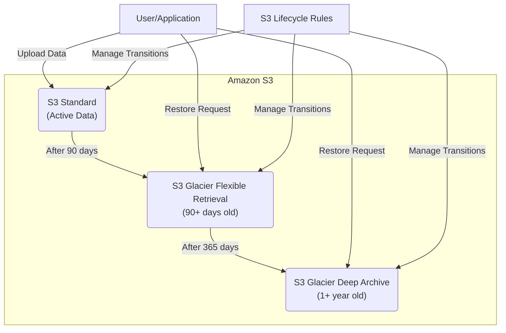

# Automated Data Archiving with S3 Glacier

## Problem

Your organization has accumulated a large amount of data that is rarely accessed but must be retained for regulatory compliance. This data is currently stored in Amazon S3 Standard storage, which is cost-inefficient for long-term retention of infrequently accessed data. You need an automated solution to identify and archive this data to reduce storage costs while maintaining compliance.

## Solution

Implement an automated data archiving solution using Amazon S3 Lifecycle policies and S3 Glacier storage classes. You'll set up a tiered archiving strategy that automatically transitions objects from S3 Standard to S3 Glacier Flexible Retrieval based on age, and eventually to S3 Glacier Deep Archive for extremely low-cost long-term storage. This approach optimizes storage costs while ensuring data remains accessible when needed.

## Architecture Diagram



## Prerequisites

1. An AWS account with administrator access
2. AWS CLI installed and configured
3. Basic knowledge of Amazon S3 and its storage classes
4. An existing S3 bucket with data to archive, or the ability to create one
5. Understanding of your data retention requirements and access patterns

> **Note**: The cost savings of using S3 Glacier storage classes come with trade-offs in data retrieval speed and potential retrieval fees. Make sure you understand these trade-offs before implementing this solution in a production environment.

## Preparation

```bash
# Set environment variables
export AWS_REGION=$(aws configure get region)
export AWS_ACCOUNT_ID=$(aws sts get-caller-identity \
    --query Account --output text)

# Generate unique bucket name
export BUCKET_NAME="awscookbook-archive-${AWS_ACCOUNT_ID:0:8}"

echo "✅ Environment variables set successfully"
echo "Region: $AWS_REGION"
echo "Account ID: $AWS_ACCOUNT_ID"
echo "Bucket Name: $BUCKET_NAME"
```

## Steps

1. **Create S3 bucket for data archiving**:

   Amazon S3 provides the foundation for our automated archiving solution with its 99.999999999% (11 9's) durability and virtually unlimited storage capacity. Creating a dedicated bucket establishes the secure, scalable repository that will handle your organization's long-term data retention requirements while supporting automated lifecycle management.

   ```bash
   # Create the S3 bucket for our archiving demonstration
   aws s3api create-bucket --bucket $BUCKET_NAME \
       --region $AWS_REGION \
       --create-bucket-configuration \
       LocationConstraint=$AWS_REGION
   
   echo "✅ Created S3 bucket: $BUCKET_NAME"
   ```

   The bucket is now established as your data lake foundation, ready to receive objects and apply automated lifecycle policies. The region-specific configuration ensures compliance with data residency requirements and optimizes performance for your geographic location.

2. **Upload sample data to demonstrate the archiving process**:

   S3's object-based storage model allows for flexible data organization using prefixes (logical folders) that enable targeted lifecycle management. By uploading sample data with consistent prefixes, we establish the organizational structure that allows lifecycle policies to intelligently identify and manage different data categories based on business requirements.

   ```bash
   # Create sample files for demonstration
   echo "This is a sample file for S3 Glacier archiving demonstration" \
       > sample-data.txt
   
   # Upload the primary sample file
   aws s3 cp sample-data.txt s3://$BUCKET_NAME/data/
   
   # Create additional test files with timestamps for easy identification
   for i in {1..5}; do
       echo "Test file $i created on $(date)" > test-file-$i.txt
       aws s3 cp test-file-$i.txt s3://$BUCKET_NAME/data/
   done
   
   echo "✅ Uploaded sample data files to s3://$BUCKET_NAME/data/"
   ```

   The data is now stored in S3 Standard storage class with immediate availability and high performance. The `data/` prefix creates a logical namespace that enables granular lifecycle policy application, allowing different retention policies for different types of organizational data.

   > **Note**: S3 lifecycle policies work based on object modification time, not creation time. This means objects are evaluated for transition based on when they were last modified, which is important for understanding [S3 lifecycle policy behavior](https://docs.aws.amazon.com/AmazonS3/latest/userguide/object-lifecycle-mgmt.html).

3. **Create and configure the lifecycle policy for automated archiving**:

   S3 Lifecycle policies provide automated data management that can reduce storage costs by up to 90% through intelligent tiering. This policy implements a three-tier archiving strategy that balances cost optimization with data accessibility, automatically moving data through progressively cheaper storage classes based on age and access patterns.

   ```bash
   # Create the lifecycle policy JSON configuration
   cat > lifecycle-policy.json << 'EOF'
   {
       "Rules": [
           {
               "ID": "ArchiveRule",
               "Status": "Enabled",
               "Filter": {
                   "Prefix": "data/"
               },
               "Transitions": [
                   {
                       "Days": 90,
                       "StorageClass": "GLACIER"
                   },
                   {
                       "Days": 365,
                       "StorageClass": "DEEP_ARCHIVE"
                   }
               ]
           }
       ]
   }
   EOF
   
   echo "✅ Created lifecycle policy configuration"
   ```

   This configuration establishes automatic cost optimization without manual intervention. The 90-day transition to Glacier Flexible Retrieval reduces storage costs by approximately 68%, while the 365-day transition to Deep Archive can reduce costs by up to 95% compared to S3 Standard storage.

   > **Tip**: You can create more sophisticated lifecycle rules using object tagging instead of just prefix-based filtering. This allows for more granular control over which objects are archived when. For example, you could tag objects with different retention periods based on data type or department. Learn more about [S3 object lifecycle management](https://docs.aws.amazon.com/AmazonS3/latest/userguide/object-lifecycle-mgmt.html).

4. **Apply the lifecycle policy to your S3 bucket**:

   Activating the lifecycle policy transforms your S3 bucket into an intelligent, self-managing archive system. S3's lifecycle engine runs daily evaluations of all objects, automatically executing transitions without requiring any manual intervention or operational overhead, ensuring consistent cost optimization across your entire data estate.

   ```bash
   # Apply the lifecycle configuration to the bucket
   aws s3api put-bucket-lifecycle-configuration \
       --bucket $BUCKET_NAME \
       --lifecycle-configuration file://lifecycle-policy.json
   
   echo "✅ Applied lifecycle policy to bucket $BUCKET_NAME"
   ```

   The bucket now operates with automated data lifecycle management, providing immediate operational benefits through reduced manual processes and long-term financial benefits through optimized storage costs. This automation eliminates the risk of human error in data management decisions.

5. **Verify the lifecycle policy configuration**:

   Verification ensures the lifecycle policy is correctly configured and active, providing confidence that your data archiving strategy will execute as planned. This step is critical for validating that the automated cost optimization and compliance features are properly enabled before relying on them for production data management.

   ```bash
   # Verify that the lifecycle policy has been applied correctly
   aws s3api get-bucket-lifecycle-configuration \
       --bucket $BUCKET_NAME
   
   echo "✅ Lifecycle policy verification completed"
   ```

   The response confirms that S3 has registered your lifecycle rules and will begin evaluating objects according to your defined schedule. This establishes the foundation for ongoing automated data management that operates transparently in the background.

6. **Set up object restoration capability for archived data**:

   ```bash
   # Create a restore request configuration for demonstration
   cat > restore-request.json << 'EOF'
   {
       "Days": 7,
       "GlacierJobParameters": {
           "Tier": "Standard"
       }
   }
   EOF
   
   echo "✅ Created restore request configuration"
   ```

   This configuration defines how archived objects can be restored when needed. The Standard tier provides balanced cost and retrieval time (3-5 hours for Glacier Flexible Retrieval). This is essential for understanding how to access your archived data when compliance or business needs require it.

7. **Configure SNS topic for archiving notifications**:

   Amazon SNS provides the messaging infrastructure for real-time visibility into your data lifecycle operations. By establishing notification channels, you create operational transparency that enables proactive monitoring of archive activities, ensuring business stakeholders stay informed about data availability and compliance status changes.

   ```bash
   # Create SNS topic for archive notifications
   SNS_TOPIC_ARN=$(aws sns create-topic --name archive-notification \
       --output text --query 'TopicArn')
   
   echo "✅ Created SNS topic: $SNS_TOPIC_ARN"
   
   # Store the topic ARN for later use
   export SNS_TOPIC_ARN
   ```

   The SNS topic is now ready to deliver notifications across multiple channels (email, SMS, HTTP endpoints, SQS queues), providing flexible integration with existing operational workflows and monitoring systems.

8. **Subscribe to notifications (replace with your email)**:

   ```bash
   # Replace with your actual email address
   EMAIL="your-email@example.com"
   
   # Subscribe to the SNS topic for notifications
   aws sns subscribe \
       --topic-arn $SNS_TOPIC_ARN \
       --protocol email \
       --notification-endpoint $EMAIL
   
   echo "✅ Subscribed $EMAIL to archive notifications"
   echo "Check your email to confirm the subscription"
   ```

   Email notifications provide real-time updates about restore operations and other important lifecycle events. In production, you might also integrate with systems like Slack or PagerDuty for operational alerts.

9. **Configure S3 event notifications for restore operations**:

   ```bash
   # Create notification configuration for S3 events
   cat > notification-config.json << EOF
   {
       "TopicConfigurations": [
           {
               "TopicArn": "$SNS_TOPIC_ARN",
               "Events": ["s3:ObjectRestore:Completed"],
               "Filter": {
                   "Key": {
                       "FilterRules": [
                           {
                               "Name": "prefix",
                               "Value": "data/"
                           }
                       ]
                   }
               }
           }
       ]
   }
   EOF
   
   # Apply the notification configuration
   aws s3api put-bucket-notification-configuration \
       --bucket $BUCKET_NAME \
       --notification-configuration file://notification-config.json
   
   echo "✅ Configured S3 event notifications"
   ```

   This completes the notification chain, ensuring you're alerted when restore operations complete. This integration between S3 and SNS provides operational visibility into your data lifecycle management processes.

   > **Warning**: In a production environment, transitions to Glacier storage classes are not immediate. They occur as background processes that can take hours to complete after an object becomes eligible. Don't rely on transitions happening exactly at the time threshold you've set. For more details, see [S3 lifecycle transition considerations](https://docs.aws.amazon.com/AmazonS3/latest/userguide/lifecycle-transition-general-considerations.html).

## Validation & Testing

1. **Verify lifecycle policy is correctly applied**:

   ```bash
   aws s3api get-bucket-lifecycle-configuration \
       --bucket $BUCKET_NAME
   ```

   Expected output: You should see the policy rules you defined with the correct transition days and storage classes.

2. **Check current storage class of uploaded objects**:

   ```bash
   aws s3api head-object \
       --bucket $BUCKET_NAME \
       --key data/sample-data.txt
   ```

   Expected output: In the response, look for the `StorageClass` field. Initially, it should be `STANDARD`.

3. **Verify bucket notification configuration**:

   ```bash
   aws s3api get-bucket-notification-configuration \
       --bucket $BUCKET_NAME
   ```

   Expected output: You should see the SNS topic configuration you set up for restore notifications.

4. **Test restore functionality (demonstration)**:

   ```bash
   # Note: This command demonstrates how to restore an object
   # In a real scenario, your object would already be in Glacier
   aws s3api restore-object \
       --bucket $BUCKET_NAME \
       --key data/sample-data.txt \
       --restore-request file://restore-request.json
   
   echo "Restore request submitted (demonstration only)"
   ```

   Expected behavior: In a real scenario with archived objects, this would initiate a restore process and you would receive notifications when completed.

## Cleanup

1. **Remove lifecycle configuration from bucket**:

   ```bash
   aws s3api delete-bucket-lifecycle --bucket $BUCKET_NAME
   
   echo "✅ Removed lifecycle configuration"
   ```

2. **Delete all objects in the bucket**:

   ```bash
   aws s3 rm s3://$BUCKET_NAME --recursive
   
   echo "✅ Deleted all objects from bucket"
   ```

3. **Delete the S3 bucket**:

   ```bash
   aws s3api delete-bucket --bucket $BUCKET_NAME
   
   echo "✅ Deleted S3 bucket"
   ```

4. **Delete SNS topic and clean up local files**:

   ```bash
   # Delete the SNS topic
   aws sns delete-topic --topic-arn $SNS_TOPIC_ARN
   
   # Delete local files created for this recipe
   rm -f lifecycle-policy.json restore-request.json notification-config.json
   rm -f sample-data.txt test-file-*.txt
   
   echo "✅ Cleanup completed"
   ```

## Discussion

Amazon S3 Glacier provides a cost-effective solution for long-term data archiving, but it's important to understand the trade-offs involved. The three main S3 Glacier storage classes offer different cost and retrieval characteristics optimized for specific access patterns:

1. **S3 Glacier Instant Retrieval**: Offers millisecond retrieval for data accessed about once per quarter. It costs more than the other Glacier options but provides immediate access, making it ideal for backup data that might need quick restoration.

2. **S3 Glacier Flexible Retrieval**: Designed for data accessed once or twice per year with retrieval times ranging from minutes to hours depending on the tier selected (Expedited, Standard, or Bulk). This balance of cost and accessibility works well for compliance archives.

3. **S3 Glacier Deep Archive**: The lowest-cost storage option, designed for data accessed less than once per year with retrieval times of 9-12 hours for Standard retrievals or up to 48 hours for Bulk retrievals. Perfect for regulatory archives with minimal access requirements.

Lifecycle policies automate the transition between storage classes, allowing you to optimize costs based on data access patterns without operational overhead. When designing your archiving strategy, consider these critical factors:

- **Retrieval needs**: How quickly might you need to access archived data? This determines which Glacier class is most appropriate and affects business continuity planning.
- **Data access patterns**: Do different types of data have different access patterns? Consider using tags or prefixes to apply different lifecycle rules across departments or data types.
- **Costs beyond storage**: Remember that while storage costs are lower with Glacier, retrieval operations incur additional fees that should be factored into total cost of ownership calculations.

For more complex archiving needs, you might consider implementing a more sophisticated solution using AWS Lambda to automate the restoration process or to perform additional processing on data before archiving. The [S3 storage classes documentation](https://docs.aws.amazon.com/AmazonS3/latest/userguide/storage-class-intro.html) and [lifecycle management guide](https://docs.aws.amazon.com/AmazonS3/latest/userguide/object-lifecycle-mgmt.html) provide comprehensive information on optimizing your archiving strategy.

In this recipe, we implemented a simple archiving strategy using S3 Lifecycle rules. In real-world scenarios, you might need to implement additional features such as more granular control over which objects are archived when, automated retrieval processes for archived data, comprehensive logging and monitoring of archival activities, and integration with approval workflows for restoring data.

## Challenge

Extend this solution by implementing these enhancements:

1. **Advanced Tagging Strategy**: Modify the solution to use different lifecycle rules for different types of data by implementing a tagging strategy. Create a Lambda function that automatically tags new objects based on their attributes (such as file type, size, or content), and adjust the lifecycle rules to use these tags.

2. **Cost Analysis Dashboard**: Implement a solution that automatically tracks and reports on the potential cost savings achieved by moving data to Glacier storage classes. Use Amazon CloudWatch and AWS Cost Explorer APIs to collect and analyze this data.

3. **Intelligent Restoration**: Create an automated system that intelligently restores data based on access patterns or business rules, potentially using machine learning to predict when archived data might be needed.

4. **Cross-Region Archiving**: Extend the solution to include cross-region replication for disaster recovery, ensuring archived data is protected against regional failures.

5. **Compliance Reporting**: Build a comprehensive reporting system that tracks all lifecycle transitions and provides audit trails for compliance purposes, including integration with AWS CloudTrail and Config.

## Infrastructure Code

*Infrastructure code will be generated after recipe approval.*