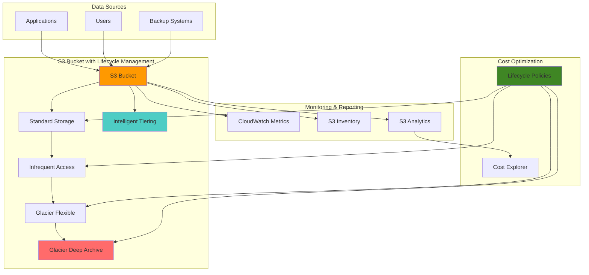

# Data Archiving Solutions with S3 Lifecycle

## Problem

Organizations accumulate vast amounts of data over time, with frequently accessed data becoming less valuable as it ages. Without proper archiving strategies, businesses face escalating storage costs and inefficient data management practices. Many companies struggle with manual data lifecycle management, leading to compliance issues and unnecessary expenses for storing infrequently accessed data in expensive storage tiers.

## Solution

Implement automated data archiving using S3 Lifecycle Policies with intelligent tiering to reduce storage costs while maintaining data availability. This solution leverages S3's multiple storage classes and automated transition rules to move data through cost-effective storage tiers based on access patterns, ensuring optimal cost performance without manual intervention.

## Architecture Diagram



## Prerequisites

1. AWS account with appropriate permissions for S3, CloudWatch, and IAM
2. AWS CLI v2 installed and configured (or AWS CloudShell)
3. Basic understanding of S3 storage classes and lifecycle management concepts
4. Existing data or ability to generate test data for demonstration
5. Estimated cost: $1-5 for testing with small amounts of data

> **Note**: This recipe uses multiple S3 storage classes which have different minimum storage durations and retrieval fees. Review the [S3 Storage Classes documentation](https://docs.aws.amazon.com/AmazonS3/latest/userguide/storage-class-intro.html) and current pricing before implementing in production.

## Preparation

```bash
# Set environment variables
export AWS_REGION=$(aws configure get region)
export AWS_ACCOUNT_ID=$(aws sts get-caller-identity \
    --query Account --output text)

# Generate unique identifiers for resources
RANDOM_SUFFIX=$(aws secretsmanager get-random-password \
    --exclude-punctuation --exclude-uppercase \
    --password-length 6 --require-each-included-type \
    --output text --query RandomPassword)

export BUCKET_NAME="data-archiving-demo-${RANDOM_SUFFIX}"
export POLICY_NAME="DataArchivingPolicy"
export ROLE_NAME="S3LifecycleRole"

# Create S3 bucket for demonstration
aws s3 mb s3://${BUCKET_NAME} --region ${AWS_REGION}

# Enable versioning for better lifecycle management
aws s3api put-bucket-versioning \
    --bucket ${BUCKET_NAME} \
    --versioning-configuration Status=Enabled

echo "✅ Created S3 bucket: ${BUCKET_NAME}"
echo "✅ Enabled versioning on bucket"
```

## Steps

1. **Create Sample Data Structure**:

   Creating a realistic data structure helps demonstrate how different types of data require different archiving strategies. S3 supports organizing data using prefixes (similar to folders), which allows lifecycle policies to target specific data types with appropriate transition timelines. This approach mirrors real-world scenarios where applications generate diverse data types with varying access patterns and retention requirements.

   ```bash
   # Create different types of files to demonstrate lifecycle policies
   mkdir -p lifecycle-demo-data/{documents,logs,backups,media}
   
   # Generate sample files with different sizes and types
   echo "Important business document - $(date)" > \
       lifecycle-demo-data/documents/business-doc-$(date +%Y%m%d).txt
   echo "Application log entry - $(date)" > \
       lifecycle-demo-data/logs/app-log-$(date +%Y%m%d).log
   echo "Database backup metadata - $(date)" > \
       lifecycle-demo-data/backups/db-backup-$(date +%Y%m%d).sql
   echo "Media file placeholder - $(date)" > \
       lifecycle-demo-data/media/video-$(date +%Y%m%d).mp4
   
   # Upload files to S3 with different prefixes
   aws s3 cp lifecycle-demo-data/documents/ \
       s3://${BUCKET_NAME}/documents/ --recursive
   aws s3 cp lifecycle-demo-data/logs/ \
       s3://${BUCKET_NAME}/logs/ --recursive
   aws s3 cp lifecycle-demo-data/backups/ \
       s3://${BUCKET_NAME}/backups/ --recursive
   aws s3 cp lifecycle-demo-data/media/ \
       s3://${BUCKET_NAME}/media/ --recursive
   
   echo "✅ Created and uploaded sample data to S3"
   ```

   The sample data is now organized by type in S3, creating distinct prefixes that can be targeted by different lifecycle policies. This structure enables granular control over data archiving based on business requirements and access patterns.

2. **Create Basic Lifecycle Policy for Documents**:

   S3 Lifecycle policies automate the transition of objects between storage classes based on age or other criteria. This reduces storage costs by moving infrequently accessed data to cheaper storage tiers without manual intervention. The policy defines rules that specify when objects should transition from Standard storage to Infrequent Access (IA), then to Glacier, and finally to Deep Archive storage classes.

   ```bash
   # Create lifecycle policy for documents (30 days to IA, 90 days to Glacier)
   cat > document-lifecycle-policy.json << 'EOF'
   {
       "Rules": [
           {
               "ID": "DocumentArchiving",
               "Status": "Enabled",
               "Filter": {
                   "Prefix": "documents/"
               },
               "Transitions": [
                   {
                       "Days": 30,
                       "StorageClass": "STANDARD_IA"
                   },
                   {
                       "Days": 90,
                       "StorageClass": "GLACIER"
                   },
                   {
                       "Days": 365,
                       "StorageClass": "DEEP_ARCHIVE"
                   }
               ]
           }
       ]
   }
   EOF
   
   # Apply lifecycle policy to bucket
   aws s3api put-bucket-lifecycle-configuration \
       --bucket ${BUCKET_NAME} \
       --lifecycle-configuration file://document-lifecycle-policy.json
   
   echo "✅ Applied document lifecycle policy"
   ```

   The lifecycle policy is now active and will automatically transition document objects through progressively cheaper storage classes. This creates a predictable cost reduction pattern while maintaining data availability for compliance and business needs.

3. **Create Comprehensive Lifecycle Policy for All Data Types**:

   Different data types require different archiving strategies based on their access patterns and business value. Log files are accessed frequently when recent but rarely after 30 days. Backup files need immediate verification but long-term cold storage. Media files have unpredictable access patterns, making them ideal for Intelligent Tiering. This comprehensive approach optimizes costs while meeting operational requirements.

   ```bash
   # Create comprehensive lifecycle policy for different data types
   cat > comprehensive-lifecycle-policy.json << 'EOF'
   {
       "Rules": [
           {
               "ID": "DocumentArchiving",
               "Status": "Enabled",
               "Filter": {
                   "Prefix": "documents/"
               },
               "Transitions": [
                   {
                       "Days": 30,
                       "StorageClass": "STANDARD_IA"
                   },
                   {
                       "Days": 90,
                       "StorageClass": "GLACIER"
                   },
                   {
                       "Days": 365,
                       "StorageClass": "DEEP_ARCHIVE"
                   }
               ]
           },
           {
               "ID": "LogArchiving",
               "Status": "Enabled",
               "Filter": {
                   "Prefix": "logs/"
               },
               "Transitions": [
                   {
                       "Days": 7,
                       "StorageClass": "STANDARD_IA"
                   },
                   {
                       "Days": 30,
                       "StorageClass": "GLACIER"
                   },
                   {
                       "Days": 90,
                       "StorageClass": "DEEP_ARCHIVE"
                   }
               ],
               "Expiration": {
                   "Days": 2555
               }
           },
           {
               "ID": "BackupArchiving",
               "Status": "Enabled",
               "Filter": {
                   "Prefix": "backups/"
               },
               "Transitions": [
                   {
                       "Days": 1,
                       "StorageClass": "STANDARD_IA"
                   },
                   {
                       "Days": 30,
                       "StorageClass": "GLACIER"
                   }
               ]
           },
           {
               "ID": "MediaIntelligentTiering",
               "Status": "Enabled",
               "Filter": {
                   "Prefix": "media/"
               },
               "Transitions": [
                   {
                       "Days": 0,
                       "StorageClass": "INTELLIGENT_TIERING"
                   }
               ]
           }
       ]
   }
   EOF
   
   # Apply comprehensive lifecycle policy
   aws s3api put-bucket-lifecycle-configuration \
       --bucket ${BUCKET_NAME} \
       --lifecycle-configuration file://comprehensive-lifecycle-policy.json
   
   echo "✅ Applied comprehensive lifecycle policy for all data types"
   ```

   The comprehensive policy now manages all data types with appropriate transition schedules. Log files transition quickly to cheaper storage, backups move to Glacier for long-term retention, and media files use Intelligent Tiering for automatic cost optimization based on access patterns.

4. **Configure S3 Intelligent Tiering**:

   S3 Intelligent Tiering automatically monitors access patterns and moves objects between storage tiers without operational overhead or retrieval fees. It includes multiple access tiers: Frequent Access for regularly accessed data, Infrequent Access for data not accessed for 30 days, Archive Access for data not accessed for 90 days, and Deep Archive Access for data not accessed for 180 days. This eliminates guesswork in lifecycle management.

   ```bash
   # Create intelligent tiering configuration
   cat > intelligent-tiering-config.json << 'EOF'
   {
       "Id": "MediaIntelligentTieringConfig",
       "Status": "Enabled",
       "Filter": {
           "Prefix": "media/"
       },
       "Tierings": [
           {
               "Days": 90,
               "AccessTier": "ARCHIVE_ACCESS"
           },
           {
               "Days": 180,
               "AccessTier": "DEEP_ARCHIVE_ACCESS"
           }
       ]
   }
   EOF
   
   # Apply intelligent tiering configuration
   aws s3api put-bucket-intelligent-tiering-configuration \
       --bucket ${BUCKET_NAME} \
       --id MediaIntelligentTieringConfig \
       --intelligent-tiering-configuration file://intelligent-tiering-config.json
   
   echo "✅ Configured S3 Intelligent Tiering for media files"
   ```

   Intelligent Tiering is now actively monitoring media file access patterns and will automatically optimize storage costs without impacting performance. The configuration includes both Archive and Deep Archive access tiers, providing maximum cost optimization for rarely accessed data.

5. **Set Up S3 Inventory for Cost Tracking**:

   S3 Inventory provides scheduled reports about your objects and their metadata, including storage class, encryption status, and access patterns. This visibility enables cost analysis, compliance reporting, and optimization opportunities. The inventory reports help identify objects that could benefit from different lifecycle policies or storage classes.

   ```bash
   # Create inventory configuration to track storage usage
   cat > inventory-config.json << 'EOF'
   {
       "Id": "StorageInventoryConfig",
       "IsEnabled": true,
       "Destination": {
           "S3BucketDestination": {
               "Bucket": "arn:aws:s3:::BUCKET_NAME",
               "Prefix": "inventory-reports/",
               "Format": "CSV"
           }
       },
       "Schedule": {
           "Frequency": "Daily"
       },
       "IncludedObjectVersions": "Current",
       "OptionalFields": [
           "Size",
           "LastModifiedDate",
           "StorageClass",
           "IntelligentTieringAccessTier"
       ]
   }
   EOF
   
   # Replace placeholder with actual bucket name
   sed -i.bak "s/BUCKET_NAME/${BUCKET_NAME}/g" inventory-config.json
   
   # Apply inventory configuration
   aws s3api put-bucket-inventory-configuration \
       --bucket ${BUCKET_NAME} \
       --id StorageInventoryConfig \
       --inventory-configuration file://inventory-config.json
   
   echo "✅ Configured S3 Inventory for storage tracking"
   ```

   S3 Inventory will now generate daily reports providing detailed insights into storage usage patterns, enabling data-driven decisions about lifecycle policy optimization and cost management strategies.

6. **Create CloudWatch Alarms for Storage Monitoring**:

   CloudWatch monitoring provides proactive alerting for storage costs and usage patterns. Setting up alarms for both billing metrics and object counts helps detect unexpected changes in storage behavior, preventing cost overruns and identifying potential issues with lifecycle policies or data ingestion patterns.

   ```bash
   # Create CloudWatch alarm for storage costs
   aws cloudwatch put-metric-alarm \
       --alarm-name "S3-Storage-Cost-${BUCKET_NAME}" \
       --alarm-description "Monitor S3 storage costs" \
       --metric-name "EstimatedCharges" \
       --namespace "AWS/Billing" \
       --statistic "Maximum" \
       --period 86400 \
       --threshold 10.0 \
       --comparison-operator "GreaterThanThreshold" \
       --dimensions Name=Currency,Value=USD Name=ServiceName,Value=AmazonS3 \
       --evaluation-periods 1 \
       --alarm-actions "arn:aws:sns:${AWS_REGION}:${AWS_ACCOUNT_ID}:billing-alerts" \
       --treat-missing-data "notBreaching" || true
   
   # Create CloudWatch alarm for object count
   aws cloudwatch put-metric-alarm \
       --alarm-name "S3-Object-Count-${BUCKET_NAME}" \
       --alarm-description "Monitor S3 object count" \
       --metric-name "NumberOfObjects" \
       --namespace "AWS/S3" \
       --statistic "Average" \
       --period 86400 \
       --threshold 1000 \
       --comparison-operator "GreaterThanThreshold" \
       --dimensions Name=BucketName,Value=${BUCKET_NAME} Name=StorageType,Value=AllStorageTypes \
       --evaluation-periods 1 \
       --treat-missing-data "notBreaching"
   
   echo "✅ Created CloudWatch alarms for storage monitoring"
   ```

   The CloudWatch alarms now provide automated monitoring of storage costs and object counts, enabling proactive management of storage resources and early detection of unexpected changes in usage patterns.

7. **Configure S3 Analytics for Storage Class Analysis**:

   S3 Analytics provides insights into storage access patterns, helping optimize lifecycle policy transition timing. The feature analyzes how frequently objects are accessed and recommends optimal transition schedules to minimize costs while maintaining appropriate performance. This data-driven approach ensures lifecycle policies align with actual usage patterns.

   ```bash
   # Create analytics configuration for documents
   cat > analytics-config.json << 'EOF'
   {
       "Id": "DocumentAnalytics",
       "Filter": {
           "Prefix": "documents/"
       },
       "StorageClassAnalysis": {
           "DataExport": {
               "OutputSchemaVersion": "V_1",
               "Destination": {
                   "S3BucketDestination": {
                       "Bucket": "arn:aws:s3:::BUCKET_NAME",
                       "Prefix": "analytics-reports/documents/",
                       "Format": "CSV"
                   }
               }
           }
       }
   }
   EOF
   
   # Replace placeholder with actual bucket name
   sed -i.bak "s/BUCKET_NAME/${BUCKET_NAME}/g" analytics-config.json
   
   # Apply analytics configuration
   aws s3api put-bucket-analytics-configuration \
       --bucket ${BUCKET_NAME} \
       --id DocumentAnalytics \
       --analytics-configuration file://analytics-config.json
   
   echo "✅ Configured S3 Analytics for storage class analysis"
   ```

   S3 Analytics will now analyze document access patterns and provide recommendations for optimizing lifecycle policy transitions, enabling fine-tuning of archiving strategies based on actual usage data.

8. **Create IAM Role for Lifecycle Management Automation**:

   IAM roles enable secure, automated lifecycle management operations without hardcoding credentials. The role follows the principle of least privilege, granting only the minimum permissions required for lifecycle operations. This security model ensures that automated processes can manage storage transitions while maintaining strict access controls.

   ```bash
   # Create trust policy for S3 lifecycle role
   cat > lifecycle-trust-policy.json << 'EOF'
   {
       "Version": "2012-10-17",
       "Statement": [
           {
               "Effect": "Allow",
               "Principal": {
                   "Service": "s3.amazonaws.com"
               },
               "Action": "sts:AssumeRole"
           }
       ]
   }
   EOF
   
   # Create IAM role for lifecycle management
   aws iam create-role \
       --role-name ${ROLE_NAME} \
       --assume-role-policy-document file://lifecycle-trust-policy.json \
       --description "Role for S3 lifecycle management operations"
   
   # Create policy for lifecycle management
   cat > lifecycle-policy.json << 'EOF'
   {
       "Version": "2012-10-17",
       "Statement": [
           {
               "Effect": "Allow",
               "Action": [
                   "s3:GetBucketLocation",
                   "s3:GetBucketLifecycleConfiguration",
                   "s3:PutBucketLifecycleConfiguration",
                   "s3:GetBucketVersioning",
                   "s3:GetBucketIntelligentTieringConfiguration",
                   "s3:PutBucketIntelligentTieringConfiguration"
               ],
               "Resource": "*"
           },
           {
               "Effect": "Allow",
               "Action": [
                   "s3:GetObject",
                   "s3:GetObjectVersion",
                   "s3:ListBucket"
               ],
               "Resource": [
                   "arn:aws:s3:::*",
                   "arn:aws:s3:::*/*"
               ]
           }
       ]
   }
   EOF
   
   # Create and attach policy to role
   aws iam create-policy \
       --policy-name ${POLICY_NAME} \
       --policy-document file://lifecycle-policy.json
   
   aws iam attach-role-policy \
       --role-name ${ROLE_NAME} \
       --policy-arn "arn:aws:iam::${AWS_ACCOUNT_ID}:policy/${POLICY_NAME}"
   
   echo "✅ Created IAM role and policy for lifecycle management"
   ```

   The IAM role is now configured with appropriate permissions for lifecycle management operations, enabling secure automation of storage transitions while maintaining strict access controls and following AWS security best practices.

## Validation & Testing

1. **Verify Lifecycle Configuration**:

   ```bash
   # Check lifecycle configuration
   aws s3api get-bucket-lifecycle-configuration \
       --bucket ${BUCKET_NAME} \
       --query 'Rules[*].{ID:ID,Status:Status,Prefix:Filter.Prefix,Transitions:Transitions[*].{Days:Days,StorageClass:StorageClass}}'
   ```

   Expected output: JSON showing all configured lifecycle rules with their transition schedules.

2. **Verify Intelligent Tiering Configuration**:

   ```bash
   # Check intelligent tiering setup
   aws s3api get-bucket-intelligent-tiering-configuration \
       --bucket ${BUCKET_NAME} \
       --id MediaIntelligentTieringConfig
   ```

   Expected output: Configuration showing enabled intelligent tiering for media files.

3. **Test Storage Class Transitions (Simulated)**:

   ```bash
   # Create test objects with different modification dates
   for i in {1..5}; do
       echo "Test file $i - $(date)" > test-file-$i.txt
       aws s3 cp test-file-$i.txt s3://${BUCKET_NAME}/documents/
   done
   
   # List objects and their storage classes
   aws s3api list-objects-v2 \
       --bucket ${BUCKET_NAME} \
       --query 'Contents[*].{Key:Key,StorageClass:StorageClass,LastModified:LastModified,Size:Size}'
   
   echo "✅ Verified object storage classes"
   ```

4. **Monitor CloudWatch Metrics**:

   ```bash
   # Check CloudWatch metrics for bucket
   aws cloudwatch get-metric-statistics \
       --namespace AWS/S3 \
       --metric-name BucketSizeBytes \
       --dimensions Name=BucketName,Value=${BUCKET_NAME} Name=StorageType,Value=StandardStorage \
       --start-time $(date -u -d '1 hour ago' +%Y-%m-%dT%H:%M:%S) \
       --end-time $(date -u +%Y-%m-%dT%H:%M:%S) \
       --period 3600 \
       --statistics Sum
   ```

   Expected output: Metrics showing bucket size and storage usage.

5. **Verify Cost Optimization Settings**:

   ```bash
   # Check if bucket has cost optimization features enabled
   aws s3api get-bucket-analytics-configuration \
       --bucket ${BUCKET_NAME} \
       --id DocumentAnalytics
   
   aws s3api get-bucket-inventory-configuration \
       --bucket ${BUCKET_NAME} \
       --id StorageInventoryConfig
   
   echo "✅ Verified cost optimization configurations"
   ```

## Cleanup

1. **Remove Lifecycle Policies**:

   ```bash
   # Delete lifecycle configuration
   aws s3api delete-bucket-lifecycle \
       --bucket ${BUCKET_NAME}
   
   echo "✅ Deleted lifecycle policies"
   ```

2. **Remove Intelligent Tiering Configuration**:

   ```bash
   # Delete intelligent tiering configuration
   aws s3api delete-bucket-intelligent-tiering-configuration \
       --bucket ${BUCKET_NAME} \
       --id MediaIntelligentTieringConfig
   
   echo "✅ Deleted intelligent tiering configuration"
   ```

3. **Remove Analytics and Inventory Configurations**:

   ```bash
   # Delete analytics configuration
   aws s3api delete-bucket-analytics-configuration \
       --bucket ${BUCKET_NAME} \
       --id DocumentAnalytics
   
   # Delete inventory configuration
   aws s3api delete-bucket-inventory-configuration \
       --bucket ${BUCKET_NAME} \
       --id StorageInventoryConfig
   
   echo "✅ Deleted analytics and inventory configurations"
   ```

4. **Remove CloudWatch Alarms**:

   ```bash
   # Delete CloudWatch alarms
   aws cloudwatch delete-alarms \
       --alarm-names "S3-Storage-Cost-${BUCKET_NAME}" \
                    "S3-Object-Count-${BUCKET_NAME}"
   
   echo "✅ Deleted CloudWatch alarms"
   ```

5. **Remove IAM Resources**:

   ```bash
   # Detach and delete IAM policy
   aws iam detach-role-policy \
       --role-name ${ROLE_NAME} \
       --policy-arn "arn:aws:iam::${AWS_ACCOUNT_ID}:policy/${POLICY_NAME}"
   
   aws iam delete-policy \
       --policy-arn "arn:aws:iam::${AWS_ACCOUNT_ID}:policy/${POLICY_NAME}"
   
   # Delete IAM role
   aws iam delete-role \
       --role-name ${ROLE_NAME}
   
   echo "✅ Deleted IAM role and policy"
   ```

6. **Remove S3 Bucket and Objects**:

   ```bash
   # Delete all objects in bucket
   aws s3 rm s3://${BUCKET_NAME} --recursive
   
   # Delete bucket
   aws s3 rb s3://${BUCKET_NAME}
   
   # Clean up local files
   rm -rf lifecycle-demo-data/
   rm -f *.json *.txt
   
   echo "✅ Deleted S3 bucket and cleaned up local files"
   ```

## Discussion

S3 Lifecycle Policies provide automated data archiving that significantly reduces storage costs while maintaining data accessibility. The solution demonstrates how different data types require different archiving strategies - log files might transition to cheaper storage classes faster than business documents, while media files benefit from intelligent tiering that adapts to access patterns.

The key to effective lifecycle management is understanding your data access patterns and business requirements. Documents might need immediate access for 30 days, then infrequent access for compliance purposes. Log files typically follow a pattern where recent logs are accessed frequently for troubleshooting, but older logs are rarely accessed except for auditing. Backup files represent another pattern where immediate verification is important, but long-term storage in the cheapest tier is preferred.

S3 Intelligent Tiering automatically monitors access patterns and moves objects between storage tiers without operational overhead. This is particularly valuable for unpredictable access patterns or when you want to optimize costs without manual intervention. The Archive Access and Deep Archive Access tiers within Intelligent Tiering provide automatic optimization for rarely accessed data. Learn more about [how S3 Intelligent-Tiering works](https://docs.aws.amazon.com/AmazonS3/latest/userguide/intelligent-tiering-overview.html).

Monitoring and analytics capabilities ensure you understand the cost impact of your lifecycle policies. S3 Analytics provides insights into storage access patterns, helping you optimize transition timing. CloudWatch alarms notify you of unexpected cost increases, while S3 Inventory provides detailed reports on storage usage across different classes. The [S3 Inventory documentation](https://docs.aws.amazon.com/AmazonS3/latest/userguide/storage-inventory.html) provides comprehensive guidance on cataloging and analyzing your data for cost optimization.

> **Warning**: Be aware of minimum storage duration requirements for each storage class. For example, objects moved to Standard-IA must remain for at least 30 days, while Glacier Deep Archive requires 180 days minimum. Review the [S3 storage classes documentation](https://docs.aws.amazon.com/AmazonS3/latest/userguide/storage-class-intro.html) for complete details.

> **Tip**: Use S3 Storage Class Analysis to understand your data access patterns before implementing lifecycle policies. This 30-day analysis helps determine optimal transition timings for your specific use case. Learn more about [S3 lifecycle management](https://docs.aws.amazon.com/AmazonS3/latest/userguide/object-lifecycle-mgmt.html) best practices.

## Challenge

Extend this solution by implementing these enhancements:

1. **Multi-Region Archiving**: Set up Cross-Region Replication with lifecycle policies to create geographically distributed archives with different retention policies based on compliance requirements.

2. **Lambda-Based Dynamic Policies**: Create Lambda functions that automatically adjust lifecycle policies based on object metadata, file types, or business rules, triggered by S3 events.

3. **Cost Optimization Dashboard**: Build a QuickSight dashboard that visualizes storage costs by class, provides recommendations for policy adjustments, and tracks savings over time.

4. **Automated Compliance Reporting**: Implement automated compliance reporting using S3 Inventory and Lambda to generate reports showing data retention adherence and archival status for audit purposes.

5. **Intelligent Restoration Workflow**: Create a Step Functions workflow that automatically restores archived objects based on access requests, with approval workflows for expensive Deep Archive retrievals.

## Infrastructure Code

*Infrastructure code will be generated after recipe approval.*